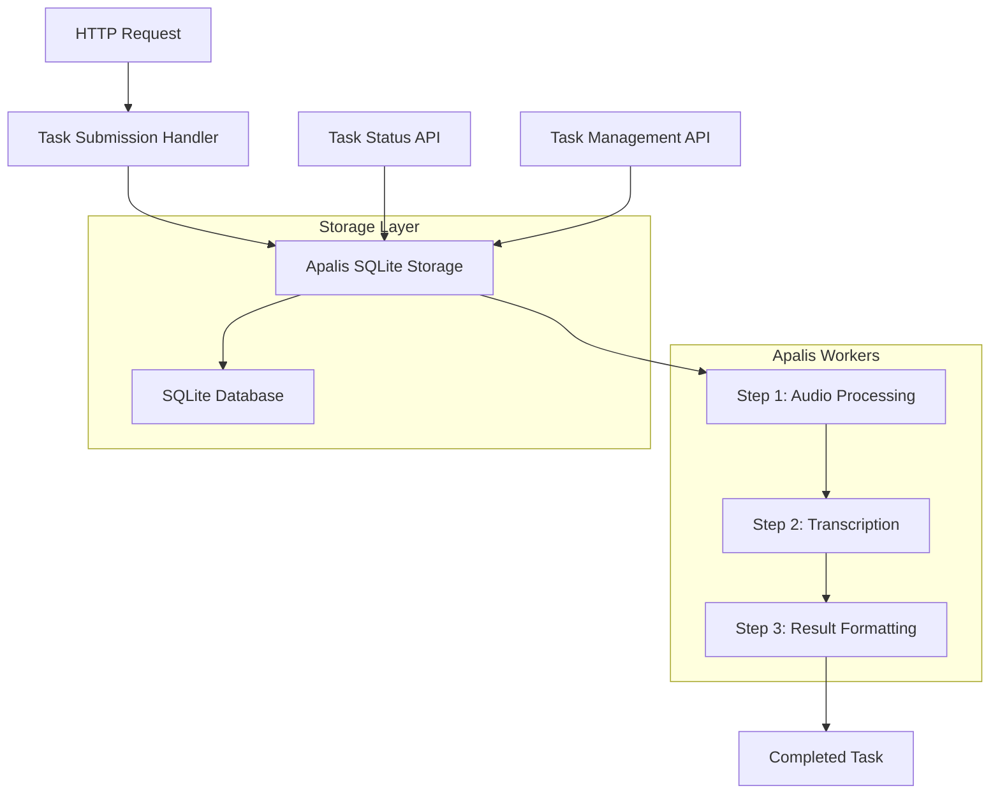

# Design Document

## Overview

This design document outlines the implementation of Apalis-based stepped task processing for the voice-cli transcription service using the apalis library with SQLite storage backend. The design fixes existing implementation issues with apalis API usage and properly implements the apalis stepped workflow pattern to work with the latest apalis version.

The implementation replaces incorrect apalis usage with proper SqliteStorage setup, implements apalis-compatible job types with the Job trait, and creates a three-step transcription pipeline using the correct apalis StepBuilder pattern: audio processing, transcription, and result formatting. The design maintains backward compatibility with existing synchronous endpoints while adding new asynchronous task management capabilities under the "/tasks" route prefix.

Key improvements include:
- Proper apalis-sql SqliteStorage initialization with WAL mode and connection pooling
- Correct implementation of stepped job types with apalis Job trait
- Proper use of start_stepped(), StepBuilder::new().step_fn(), and WorkerBuilder::new().build_stepped() methods
- Comprehensive job state tracking using apalis built-in capabilities
- Feature flag support for gradual migration from existing custom task queue

## Architecture

### High-Level Architecture



### Component Architecture

The system consists of several key components:

1. **Apalis SQLite Manager**: Manages database connections and storage setup
2. **Stepped Job Types**: Three job types representing each processing step
3. **Step Functions**: Business logic for each processing step
4. **Worker Management**: Apalis worker configuration and lifecycle
5. **HTTP Handlers**: API endpoints for job submission and management
6. **Configuration**: Settings for workers, storage, and processing

## Components and Interfaces

### HTTP API Endpoints

The async task API follows the "/tasks" route pattern:

```rust
// POST /tasks/transcribe - Submit new transcription job
pub async fn submit_transcription_task(
    State(app_state): State<AppState>,
    Json(request): Json<TranscriptionRequest>,
) -> Result<Json<TaskSubmissionResponse>, ApiError> {
    let task = AsyncTranscriptionTask {
        task_id: Uuid::new_v4().to_string(),
        audio_file_path: request.audio_file_path,
        original_filename: request.filename,
        model: request.model,
        response_format: request.response_format,
        created_at: Utc::now(),
        priority: request.priority.unwrap_or_default(),
    };
    
    let job_id = app_state.apalis_manager.submit_job(task).await?;
    
    Ok(Json(TaskSubmissionResponse {
        job_id,
        status: "submitted".to_string(),
        message: "Task submitted for processing".to_string(),
    }))
}

// GET /tasks/{job_id} - Get job status (Requirements 5.2, 5.3, 5.4, 5.5, 5.6)
pub async fn get_task_status(
    State(app_state): State<AppState>,
    Path(job_id): Path<String>,
) -> Result<Json<TaskStatusResponse>, ApiError> {
    let status = app_state.apalis_manager.get_job_status(&job_id).await
        .map_err(|e| match e {
            ApalisIntegrationError::JobNotFound { .. } => ApiError::NotFound(format!("Job {} not found", job_id)),
            _ => ApiError::Internal(e.to_string()),
        })?;
    
    Ok(Json(TaskStatusResponse {
        job_id,
        status: status.status,
        current_step: status.current_step,
        progress: status.progress,
        created_at: status.created_at,
        updated_at: status.updated_at,
        completed_at: status.completed_at,
        result: status.result,
        error: status.error,
        retry_count: status.retry_count,
        queue_position: status.queue_position,
        estimated_start_time: status.estimated_start_time,
    }))
}

// DELETE /tasks/{job_id} - Cancel job
pub async fn cancel_task(
    State(app_state): State<AppState>,
    Path(job_id): Path<String>,
) -> Result<Json<TaskCancellationResponse>, ApiError> {
    app_state.apalis_manager.cancel_job(&job_id).await?;
    
    Ok(Json(TaskCancellationResponse {
        job_id,
        status: "cancelled".to_string(),
        message: "Task cancelled successfully".to_string(),
    }))
}

// GET /tasks - List jobs with filtering (Requirement 5.8)
pub async fn list_tasks(
    State(app_state): State<AppState>,
    Query(params): Query<TaskListParams>,
) -> Result<Json<TaskListResponse>, ApiError> {
    let jobs = app_state.apalis_manager.list_jobs(params.clone()).await?;
    let total_count = app_state.apalis_manager.count_jobs(params.status.clone()).await?;
    
    Ok(Json(TaskListResponse {
        jobs,
        total: total_count,
        page: params.page.unwrap_or(1),
        per_page: params.per_page.unwrap_or(20),
        has_more: (params.page.unwrap_or(1) * params.per_page.unwrap_or(20)) < total_count,
    }))
}

// Supporting API types for task management (Requirements 5.11, 5.12)
#[derive(Debug, Serialize, Deserialize)]
pub struct TaskSubmissionResponse {
    pub job_id: String,
    pub status: String,
    pub message: String,
    pub estimated_completion_time: Option<DateTime<Utc>>,
}

#[derive(Debug, Serialize, Deserialize)]
pub struct TaskStatusResponse {
    pub job_id: String,
    pub status: String,  // Pending, Running, Done, Failed, Killed
    pub current_step: Option<String>,
    pub progress: Option<f32>,  // 0.0 to 1.0
    pub created_at: DateTime<Utc>,
    pub updated_at: DateTime<Utc>,
    pub completed_at: Option<DateTime<Utc>>,
    pub result: Option<serde_json::Value>,
    pub error: Option<String>,
    pub retry_count: u32,
    pub queue_position: Option<u32>,  // For pending jobs
    pub estimated_start_time: Option<DateTime<Utc>>,  // For pending jobs
}

#[derive(Debug, Serialize, Deserialize)]
pub struct TaskCancellationResponse {
    pub job_id: String,
    pub status: String,
    pub message: String,
    pub cancelled_at: DateTime<Utc>,
}

#[derive(Debug, Serialize, Deserialize, Clone)]
pub struct TaskListParams {
    pub status: Option<String>,  // Filter by job status
    pub priority: Option<TaskPriority>,  // Filter by priority
    pub page: Option<usize>,
    pub per_page: Option<usize>,
    pub created_after: Option<DateTime<Utc>>,
    pub created_before: Option<DateTime<Utc>>,
}

#[derive(Debug, Serialize, Deserialize)]
pub struct TaskListResponse {
    pub jobs: Vec<JobSummary>,
    pub total: usize,
    pub page: usize,
    pub per_page: usize,
    pub has_more: bool,
}

#[derive(Debug, Serialize, Deserialize)]
pub struct JobSummary {
    pub job_id: String,
    pub status: String,
    pub current_step: Option<String>,
    pub progress: Option<f32>,
    pub created_at: DateTime<Utc>,
    pub updated_at: DateTime<Utc>,
    pub original_filename: String,
    pub priority: TaskPriority,
}
```

### 1. Apalis SQLite Manager

The ApalisSqliteManager provides proper apalis-sql integration with SQLite backend, addressing Requirement 1 for correct storage setup:

```rust
use apalis_sql::{SqliteStorage, Config as ApalisConfig};
use sqlx::{SqlitePool, sqlite::SqliteConnectOptions};
use std::str::FromStr;

pub struct ApalisSqliteManager {
    pool: SqlitePool,
    storage: SqliteStorage<AsyncTranscriptionTask>,
    config: ApalisConfig,
}

impl ApalisSqliteManager {
    pub async fn new(database_url: &str) -> Result<Self, ApalisIntegrationError> {
        // Configure SQLite connection with WAL mode and proper settings
        let connect_options = SqliteConnectOptions::from_str(database_url)?
            .journal_mode(sqlx::sqlite::SqliteJournalMode::Wal)  // Enable WAL mode for concurrency
            .synchronous(sqlx::sqlite::SqliteSynchronous::Normal)
            .busy_timeout(std::time::Duration::from_millis(5000))
            .foreign_keys(true);
        
        // Create connection pool with proper sizing
        let pool = SqlitePool::connect_with(connect_options).await
            .map_err(|e| ApalisIntegrationError::DatabaseError(e))?;
        
        // Configure apalis SQLite storage with namespace for job isolation
        let config = ApalisConfig::default()
            .set_namespace("voice-cli-transcription")
            .set_buffer_size(100)  // Configure buffer for batch operations
            .set_poll_interval(std::time::Duration::from_secs(1));
        
        let storage = SqliteStorage::new_with_config(pool.clone(), config.clone());
        
        Ok(Self { pool, storage, config })
    }
    
    pub async fn setup_storage(&self) -> Result<(), ApalisIntegrationError> {
        // Apalis automatically creates necessary tables for stepped job management
        self.storage.setup().await
            .map_err(|e| ApalisIntegrationError::StorageError(e))?;
        
        // Create additional metadata table for extended job information
        sqlx::query(r#"
            CREATE TABLE IF NOT EXISTS transcription_job_metadata (
                job_id TEXT PRIMARY KEY,
                original_filename TEXT NOT NULL,
                file_size INTEGER,
                audio_duration REAL,
                model_name TEXT,
                priority INTEGER DEFAULT 0,
                user_id TEXT,
                created_at TIMESTAMP DEFAULT CURRENT_TIMESTAMP
            )
        "#)
        .execute(&self.pool)
        .await
        .map_err(|e| ApalisIntegrationError::DatabaseError(e))?;
        
        Ok(())
    }
    
    pub fn get_storage(&self) -> &SqliteStorage<AsyncTranscriptionTask> {
        &self.storage
    }
    
    pub async fn submit_job(&self, job: AsyncTranscriptionTask) -> Result<String, ApalisIntegrationError> {
        // Use apalis start_stepped to initiate stepped workflow (Requirement 2.1)
        let job_id = self.storage.start_stepped(job).await
            .map_err(|e| ApalisIntegrationError::StorageError(e))?;
        Ok(job_id.to_string())
    }
    
    pub async fn get_job_status(&self, job_id: &str) -> Result<JobStatusResponse, ApalisIntegrationError> {
        // Query apalis storage for job status (Requirement 5.2, 8.6)
        let job = self.storage.fetch_by_id(job_id).await
            .map_err(|e| ApalisIntegrationError::StorageError(e))?
            .ok_or_else(|| ApalisIntegrationError::JobNotFound { job_id: job_id.to_string() })?;
        
        Ok(JobStatusResponse {
            job_id: job_id.to_string(),
            status: job.status.to_string(),
            current_step: job.current_step,
            progress: job.progress_percentage,
            created_at: job.created_at,
            updated_at: job.updated_at,
            result: job.result,
            error: job.error_message,
            retry_count: job.attempts,
        })
    }
    
    pub async fn cancel_job(&self, job_id: &str) -> Result<(), ApalisIntegrationError> {
        // Update job status to "Killed" (Requirement 5.7, 8.5)
        self.storage.kill_job(job_id).await
            .map_err(|e| ApalisIntegrationError::StorageError(e))
    }
    
    pub async fn list_jobs(&self, params: TaskListParams) -> Result<Vec<JobSummary>, ApalisIntegrationError> {
        // Query apalis storage with filtering (Requirement 5.8)
        self.storage.list_jobs(params.status, params.limit, params.offset).await
            .map_err(|e| ApalisIntegrationError::StorageError(e))
    }
}
```

### 2. Apalis Stepped Job Types

Job types implementing apalis Job trait for stepped workflow compatibility, addressing Requirements 3.1, 3.2, and 3.3:

```rust
use apalis::prelude::*;
use serde::{Deserialize, Serialize};
use std::path::PathBuf;
use chrono::{DateTime, Utc};

// Step 1: Initial Transcription Task (implements apalis Job trait - Requirement 3.1)
#[derive(Debug, Serialize, Deserialize, Clone)]
pub struct AsyncTranscriptionTask {
    pub task_id: String,
    pub audio_file_path: PathBuf,
    pub original_filename: String,
    pub model: Option<String>,
    pub response_format: Option<String>,
    pub created_at: DateTime<Utc>,
    pub priority: TaskPriority,
    pub file_size: Option<u64>,
    pub user_id: Option<String>,
}

// Implement apalis Job trait for proper serialization (Requirement 3.2)
impl Job for AsyncTranscriptionTask {
    const NAME: &'static str = "transcription_task";
}

// Step 2: Audio Processing Result with type safety (Requirement 3.3)
#[derive(Debug, Serialize, Deserialize, Clone)]
pub struct AudioProcessedTask {
    pub task_id: String,
    pub processed_audio_path: PathBuf,
    pub original_format: AudioFormat,
    pub model: Option<String>,
    pub response_format: Option<String>,
    pub created_at: DateTime<Utc>,
    pub audio_duration: Option<f32>,
    pub cleanup_files: Vec<PathBuf>,
    pub processing_metadata: AudioProcessingMetadata,
}

impl Job for AudioProcessedTask {
    const NAME: &'static str = "audio_processed_task";
}

// Step 3: Transcription Completed with comprehensive result data
#[derive(Debug, Serialize, Deserialize, Clone)]
pub struct TranscriptionCompletedTask {
    pub task_id: String,
    pub transcription_result: SerializableTranscriptionResult,
    pub response_format: Option<String>,
    pub created_at: DateTime<Utc>,
    pub processing_stages: Vec<ProcessingStageInfo>,
    pub total_processing_time: std::time::Duration,
}

impl Job for TranscriptionCompletedTask {
    const NAME: &'static str = "transcription_completed_task";
}

// Final result type for completed transcription
#[derive(Debug, Serialize, Deserialize, Clone)]
pub struct TranscriptionResponse {
    pub task_id: String,
    pub result: serde_json::Value,
    pub completed_at: DateTime<Utc>,
    pub processing_summary: ProcessingSummary,
}

impl Job for TranscriptionResponse {
    const NAME: &'static str = "transcription_response";
}

// Supporting types for job data integrity (Requirement 3.3)
#[derive(Debug, Serialize, Deserialize, Clone)]
pub struct AudioProcessingMetadata {
    pub original_size: u64,
    pub processed_size: u64,
    pub sample_rate: u32,
    pub channels: u16,
    pub bit_depth: u16,
}

#[derive(Debug, Serialize, Deserialize, Clone)]
pub struct ProcessingStageInfo {
    pub stage_name: String,
    pub status: String,
    pub started_at: DateTime<Utc>,
    pub completed_at: Option<DateTime<Utc>>,
    pub duration: Option<std::time::Duration>,
    pub error: Option<String>,
}

#[derive(Debug, Serialize, Deserialize, Clone)]
pub struct ProcessingSummary {
    pub total_duration: std::time::Duration,
    pub stages_completed: usize,
    pub model_used: String,
    pub audio_duration: f32,
}

// Task priority enum for job scheduling
#[derive(Debug, Serialize, Deserialize, Clone, PartialEq, Eq, PartialOrd, Ord)]
pub enum TaskPriority {
    Low = 0,
    Normal = 1,
    High = 2,
    Critical = 3,
}

impl Default for TaskPriority {
    fn default() -> Self {
        TaskPriority::Normal
    }
}
```

### 3. Apalis Step Functions

Step functions following apalis step_fn signature requirements (Requirement 3.5) and integrating with existing services (Requirement 6):

```rust
use apalis::prelude::*;
use std::sync::Arc;
use chrono::Utc;

// Step 1: Audio Format Processing (Requirements 6.1, 2.2, 2.3)
async fn audio_format_step(
    task: AsyncTranscriptionTask,
    ctx: Data<Arc<TranscriptionContext>>,
) -> Result<GoTo<AudioProcessedTask>, ApalisIntegrationError> {
    let start_time = Utc::now();
    tracing::info!("Processing audio format for task: {}", task.task_id);
    
    // Use existing AudioFileManager logic without modification (Requirement 6.1)
    let processed_path = ctx.audio_file_manager
        .process_audio_file(&task.audio_file_path)
        .await
        .map_err(|e| ApalisIntegrationError::AudioProcessingError(e))?;
    
    // Detect audio format using existing logic
    let original_format = ctx.audio_file_manager
        .detect_audio_format(&task.audio_file_path)
        .await
        .map_err(|e| ApalisIntegrationError::AudioProcessingError(e))?;
    
    let audio_duration = ctx.audio_file_manager
        .get_audio_duration(&processed_path)
        .await
        .map_err(|e| ApalisIntegrationError::AudioProcessingError(e))?;
    
    let processing_metadata = AudioProcessingMetadata {
        original_size: std::fs::metadata(&task.audio_file_path)
            .map(|m| m.len())
            .unwrap_or(0),
        processed_size: std::fs::metadata(&processed_path)
            .map(|m| m.len())
            .unwrap_or(0),
        sample_rate: 16000, // Default for transcription
        channels: 1,       // Mono for transcription
        bit_depth: 16,     // Standard bit depth
    };
    
    let audio_processed = AudioProcessedTask {
        task_id: task.task_id,
        processed_audio_path: processed_path,
        original_format,
        model: task.model,
        response_format: task.response_format,
        created_at: task.created_at,
        audio_duration: Some(audio_duration),
        cleanup_files: vec![task.audio_file_path],
        processing_metadata,
    };
    
    tracing::info!("Audio processing completed for task: {} in {:?}", 
                   audio_processed.task_id, Utc::now() - start_time);
    
    // Return proper step transition (Requirement 2.3)
    Ok(GoTo::next(audio_processed))
}

// Step 2: Whisper Transcription (Requirements 6.2, 2.2, 2.4)
async fn whisper_transcription_step(
    task: AudioProcessedTask,
    ctx: Data<Arc<TranscriptionContext>>,
) -> Result<GoTo<TranscriptionCompletedTask>, ApalisIntegrationError> {
    let start_time = Utc::now();
    tracing::info!("Performing transcription for task: {}", task.task_id);
    
    // Use existing TranscriptionEngine with same parameters (Requirement 6.2)
    let transcription_result = ctx.transcription_engine
        .transcribe_audio(&task.processed_audio_path, task.model.as_deref())
        .await
        .map_err(|e| ApalisIntegrationError::AudioProcessingError(e))?;
    
    let processing_time = Utc::now() - start_time;
    
    let mut processing_stages = vec![
        ProcessingStageInfo {
            stage_name: "audio_processing".to_string(),
            status: "completed".to_string(),
            started_at: task.created_at,
            completed_at: Some(start_time),
            duration: Some(start_time - task.created_at),
            error: None,
        },
        ProcessingStageInfo {
            stage_name: "transcription".to_string(),
            status: "completed".to_string(),
            started_at: start_time,
            completed_at: Some(Utc::now()),
            duration: Some(processing_time),
            error: None,
        },
    ];
    
    let transcription_completed = TranscriptionCompletedTask {
        task_id: task.task_id,
        transcription_result: SerializableTranscriptionResult::from(transcription_result),
        response_format: task.response_format,
        created_at: task.created_at,
        processing_stages,
        total_processing_time: Utc::now() - task.created_at,
    };
    
    tracing::info!("Transcription completed for task: {} in {:?}", 
                   transcription_completed.task_id, processing_time);
    
    Ok(GoTo::next(transcription_completed))
}

// Step 3: Result Formatting (Requirements 6.3, 2.2)
async fn result_formatting_step(
    task: TranscriptionCompletedTask,
    ctx: Data<Arc<TranscriptionContext>>,
) -> Result<GoTo<TranscriptionResponse>, ApalisIntegrationError> {
    let start_time = Utc::now();
    tracing::info!("Formatting results for task: {}", task.task_id);
    
    // Use existing response formatting to maintain API compatibility (Requirement 6.3)
    let formatted_result = ctx.transcription_engine
        .format_transcription_response(
            &task.transcription_result,
            task.response_format.as_deref(),
        )
        .map_err(|e| ApalisIntegrationError::AudioProcessingError(e))?;
    
    // Cleanup temporary files
    for cleanup_file in &task.processing_stages {
        if let Some(error) = cleanup_audio_files(&cleanup_file.stage_name).await.err() {
            tracing::warn!("Failed to cleanup files for stage {}: {:?}", 
                          cleanup_file.stage_name, error);
        }
    }
    
    let processing_summary = ProcessingSummary {
        total_duration: task.total_processing_time,
        stages_completed: task.processing_stages.len(),
        model_used: task.transcription_result.model_used.clone(),
        audio_duration: task.processing_stages
            .iter()
            .find(|s| s.stage_name == "audio_processing")
            .and_then(|s| s.duration)
            .map(|d| d.as_secs_f32())
            .unwrap_or(0.0),
    };
    
    let response = TranscriptionResponse {
        task_id: task.task_id,
        result: formatted_result,
        completed_at: Utc::now(),
        processing_summary,
    };
    
    tracing::info!("Result formatting completed for task: {} in {:?}", 
                   response.task_id, Utc::now() - start_time);
    
    Ok(GoTo::next(response))
}

// Helper function for file cleanup
async fn cleanup_audio_files(stage_name: &str) -> Result<(), ApalisIntegrationError> {
    // Implementation for cleaning up temporary files
    // This would be implemented based on the specific cleanup requirements
    Ok(())
}
```

### 4. Transcription Context

Shared context containing all necessary services:

```rust
pub struct TranscriptionContext {
    pub config: Arc<Config>,
    pub model_service: Arc<ModelService>,
    pub transcription_engine: Arc<TranscriptionEngine>,
    pub audio_file_manager: Arc<AudioFileManager>,
    pub task_store: Arc<TaskStore>,
}
```

### 5. Apalis Worker Builder and Management

Worker management implementation addressing Requirements 4.1, 4.2, 4.3, 4.4, 4.5, and 4.6:

```rust
use apalis::prelude::*;
use tokio::task::JoinHandle;
use std::sync::Arc;

pub struct ApalisWorkerManager {
    worker_handles: Vec<JoinHandle<Result<(), ApalisError>>>,
    sqlite_manager: Arc<ApalisSqliteManager>,
    context: Arc<TranscriptionContext>,
    config: Arc<ApalisConfig>,
    is_running: Arc<std::sync::atomic::AtomicBool>,
}

impl ApalisWorkerManager {
    pub async fn new(
        config: Arc<Config>,
        context: Arc<TranscriptionContext>,
    ) -> Result<Self, ApalisIntegrationError> {
        let sqlite_manager = Arc::new(
            ApalisSqliteManager::new(&config.apalis.sqlite_url).await?
        );
        sqlite_manager.setup_storage().await?;
        
        let apalis_config = Arc::new(ApalisConfig {
            worker_concurrency: config.apalis.worker_concurrency,
            worker_name: config.apalis.worker_name.clone(),
            enable_tracing: config.apalis.enable_tracing,
            max_retries: config.apalis.max_retries,
            retry_delay: std::time::Duration::from_secs(config.apalis.retry_delay_seconds),
            step_timeout: std::time::Duration::from_secs(config.apalis.step_timeout_seconds),
            job_timeout: std::time::Duration::from_secs(config.apalis.job_timeout_seconds),
        });
        
        Ok(Self {
            worker_handles: Vec::new(),
            sqlite_manager,
            context,
            config: apalis_config,
            is_running: Arc::new(std::sync::atomic::AtomicBool::new(false)),
        })
    }
    
    pub async fn start_workers(&mut self) -> Result<(), ApalisIntegrationError> {
        if self.is_running.load(std::sync::atomic::Ordering::Relaxed) {
            return Err(ApalisIntegrationError::WorkerConfigError(
                "Workers are already running".to_string()
            ));
        }
        
        // Build apalis stepped workflow using StepBuilder (Requirement 4.2)
        let steps = StepBuilder::new()
            .step_fn(audio_format_step)           // Step 1: Audio processing
            .step_fn(whisper_transcription_step)  // Step 2: Transcription  
            .step_fn(result_formatting_step);     // Step 3: Result formatting
        
        // Create multiple workers for concurrency (Requirement 4.1, 4.3)
        for worker_id in 0..self.config.worker_concurrency {
            let worker_name = format!("{}-{}", self.config.worker_name, worker_id);
            
            // Create worker using WorkerBuilder with proper configuration
            let worker = WorkerBuilder::new(&worker_name)
                .data(self.context.clone())      // Shared context for all steps
                .enable_tracing()                // Enable apalis tracing
                .concurrency(1)                  // Each worker handles one job at a time
                .backend(self.sqlite_manager.get_storage().clone())
                .build_stepped(steps.clone())    // Build stepped worker (Requirement 4.2)
                .on_event({                      // Event handling for monitoring (Requirement 4.6)
                    let worker_name = worker_name.clone();
                    move |event| {
                        tracing::info!("Apalis worker {} event: {:?}", worker_name, event);
                        // Additional monitoring logic can be added here
                    }
                });
            
            // Start the worker with proper error handling (Requirement 4.4)
            let handle = tokio::spawn({
                let worker_name = worker_name.clone();
                async move {
                    tracing::info!("Starting apalis worker: {}", worker_name);
                    match worker.run().await {
                        Ok(_) => {
                            tracing::info!("Apalis worker {} completed successfully", worker_name);
                            Ok(())
                        }
                        Err(e) => {
                            tracing::error!("Apalis worker {} failed: {:?}", worker_name, e);
                            Err(e)
                        }
                    }
                }
            });
            
            self.worker_handles.push(handle);
        }
        
        self.is_running.store(true, std::sync::atomic::Ordering::Relaxed);
        tracing::info!("Started {} apalis workers", self.config.worker_concurrency);
        Ok(())
    }
    
    pub async fn stop_workers(&mut self) -> Result<(), ApalisIntegrationError> {
        if !self.is_running.load(std::sync::atomic::Ordering::Relaxed) {
            return Ok(());
        }
        
        tracing::info!("Stopping {} apalis workers gracefully", self.worker_handles.len());
        
        // Signal workers to stop gracefully (Requirement 4.5)
        self.is_running.store(false, std::sync::atomic::Ordering::Relaxed);
        
        // Wait for all workers to complete current jobs and stop cleanly
        let mut results = Vec::new();
        for handle in self.worker_handles.drain(..) {
            // Give workers time to complete current jobs
            match tokio::time::timeout(
                std::time::Duration::from_secs(30), 
                handle
            ).await {
                Ok(result) => results.push(result),
                Err(_) => {
                    tracing::warn!("Worker did not stop gracefully within timeout, forcing shutdown");
                }
            }
        }
        
        // Check for any worker errors
        for result in results {
            match result {
                Ok(Ok(_)) => {},
                Ok(Err(e)) => tracing::error!("Worker stopped with error: {:?}", e),
                Err(e) => tracing::error!("Worker join error: {:?}", e),
            }
        }
        
        tracing::info!("All apalis workers stopped");
        Ok(())
    }
    
    pub async fn get_worker_stats(&self) -> Result<WorkerStats, ApalisIntegrationError> {
        // Query apalis storage for worker statistics
        let stats = self.sqlite_manager.get_storage().get_worker_stats().await
            .map_err(|e| ApalisIntegrationError::StorageError(e))?;
        
        Ok(WorkerStats {
            active_workers: self.worker_handles.len(),
            total_jobs_processed: stats.total_processed,
            jobs_in_queue: stats.pending_jobs,
            failed_jobs: stats.failed_jobs,
            average_processing_time: stats.avg_processing_time,
            is_running: self.is_running.load(std::sync::atomic::Ordering::Relaxed),
        })
    }
    
    pub fn is_running(&self) -> bool {
        self.is_running.load(std::sync::atomic::Ordering::Relaxed)
    }
    
    pub async fn health_check(&self) -> Result<HealthStatus, ApalisIntegrationError> {
        // Check if workers are running and storage is accessible
        let storage_healthy = self.sqlite_manager.get_storage().health_check().await
            .map_err(|e| ApalisIntegrationError::StorageError(e))?;
        
        let workers_healthy = self.is_running() && 
            self.worker_handles.iter().all(|h| !h.is_finished());
        
        Ok(HealthStatus {
            storage_healthy,
            workers_healthy,
            active_worker_count: self.worker_handles.len(),
        })
    }
}

// Supporting types for worker management
#[derive(Debug)]
pub struct ApalisConfig {
    pub worker_concurrency: usize,
    pub worker_name: String,
    pub enable_tracing: bool,
    pub max_retries: u32,
    pub retry_delay: std::time::Duration,
    pub step_timeout: std::time::Duration,
    pub job_timeout: std::time::Duration,
}

#[derive(Debug, Serialize)]
pub struct WorkerStats {
    pub active_workers: usize,
    pub total_jobs_processed: u64,
    pub jobs_in_queue: u64,
    pub failed_jobs: u64,
    pub average_processing_time: std::time::Duration,
    pub is_running: bool,
}

#[derive(Debug, Serialize)]
pub struct HealthStatus {
    pub storage_healthy: bool,
    pub workers_healthy: bool,
    pub active_worker_count: usize,
}
```

## Data Models

### Job State Management

Jobs progress through the following states:
- `Pending`: Job submitted but not yet started
- `Running`: Job currently being processed
- `Done`: Job completed successfully
- `Failed`: Job failed with error
- `Killed`: Job was cancelled

### Database Schema

Apalis automatically manages job storage tables with the configured namespace:

```sql
-- Apalis managed tables (created automatically by apalis-sql)
-- voice_cli_transcription_jobs: Core stepped job storage with state tracking
-- voice_cli_transcription_workers: Worker registration and heartbeat
-- voice_cli_transcription_job_steps: Step execution history and progress

-- Example of apalis job table structure (managed automatically):
CREATE TABLE voice_cli_transcription_jobs (
    id TEXT PRIMARY KEY,
    job_type TEXT NOT NULL,
    payload BLOB NOT NULL,           -- Serialized job data
    status TEXT NOT NULL,            -- Pending, Running, Done, Failed, Killed
    attempts INTEGER DEFAULT 0,      -- Retry count
    max_attempts INTEGER DEFAULT 3,  -- Maximum retries
    run_at TIMESTAMP,               -- When to run the job
    created_at TIMESTAMP DEFAULT CURRENT_TIMESTAMP,
    updated_at TIMESTAMP DEFAULT CURRENT_TIMESTAMP,
    completed_at TIMESTAMP,
    failed_at TIMESTAMP,
    context BLOB,                   -- Additional context data
    step_name TEXT,                 -- Current step name for stepped jobs
    step_data BLOB                  -- Step-specific data
);

-- Optional: Additional metadata table for extended job information
CREATE TABLE transcription_job_metadata (
    job_id TEXT PRIMARY KEY REFERENCES voice_cli_transcription_jobs(id),
    original_filename TEXT NOT NULL,
    file_size INTEGER,
    audio_duration REAL,
    model_name TEXT,
    priority INTEGER DEFAULT 0,
    user_id TEXT,
    FOREIGN KEY (job_id) REFERENCES voice_cli_transcription_jobs(id) ON DELETE CASCADE
);
```

### Configuration Schema

Configuration management addressing Requirements 7.1, 7.2, 7.3, 7.4, 7.6, and 7.7:

```yaml
# Feature flag for gradual migration (Requirement 9.3, 9.4)
task_processing:
  engine: "apalis"  # "apalis" or "custom" - feature flag for gradual migration
  fallback_enabled: true  # Enable fallback to custom queue if apalis fails
  
  apalis:
    # SQLite storage configuration (Requirement 7.2)
    sqlite_url: "sqlite:./voice-cli.db?mode=rwc"
    namespace: "voice-cli-transcription"  # Apalis namespace for job isolation
    
    # Worker configuration (Requirement 7.1)
    worker_concurrency: 4                 # Number of concurrent workers
    worker_name: "voice-cli-transcription-worker"
    enable_tracing: true                  # Enable apalis event tracing
    
    # Job retry and timeout settings (Requirement 7.3)
    max_retries: 3                        # Maximum retries per step
    retry_delay_seconds: 30               # Initial retry delay (exponential backoff)
    step_timeout_seconds: 300             # Timeout per step (5 minutes)
    job_timeout_seconds: 1800             # Total job timeout (30 minutes)
    
    # Cleanup and maintenance policies (Requirement 7.3)
    cleanup_interval_hours: 24            # How often to run cleanup
    cleanup_completed_after_days: 7       # Remove completed jobs after N days
    cleanup_failed_after_days: 30         # Remove failed jobs after N days
    cleanup_killed_after_days: 14         # Remove cancelled jobs after N days
    
    # SQLite specific settings (Requirement 7.2)
    connection_pool_size: 10              # SQLite connection pool size
    enable_wal_mode: true                 # Enable WAL mode for better concurrency
    busy_timeout_ms: 5000                 # SQLite busy timeout
    max_connections: 20                   # Maximum concurrent connections
    
    # Job queue settings
    buffer_size: 100                      # Job buffer size for batch operations
    poll_interval_seconds: 1              # How often to poll for new jobs
    
    # Monitoring and health checks
    health_check_interval_seconds: 30     # Worker health check frequency
    metrics_enabled: true                 # Enable metrics collection
    
# Environment variable overrides (Requirement 7.4)
# These can be overridden with environment variables:
# VOICE_CLI_APALIS_SQLITE_URL
# VOICE_CLI_APALIS_WORKER_CONCURRENCY
# VOICE_CLI_APALIS_MAX_RETRIES
# etc.
```

### Configuration Validation

Configuration validation implementation (Requirements 7.5, 7.7):

```rust
use serde::{Deserialize, Serialize};
use std::time::Duration;

#[derive(Debug, Deserialize, Serialize, Clone)]
pub struct ApalisConfig {
    pub sqlite_url: String,
    pub namespace: String,
    pub worker_concurrency: usize,
    pub worker_name: String,
    pub enable_tracing: bool,
    pub max_retries: u32,
    pub retry_delay_seconds: u64,
    pub step_timeout_seconds: u64,
    pub job_timeout_seconds: u64,
    pub cleanup_interval_hours: u64,
    pub cleanup_completed_after_days: u64,
    pub cleanup_failed_after_days: u64,
    pub cleanup_killed_after_days: u64,
    pub connection_pool_size: u32,
    pub enable_wal_mode: bool,
    pub busy_timeout_ms: u64,
    pub max_connections: u32,
    pub buffer_size: usize,
    pub poll_interval_seconds: u64,
    pub health_check_interval_seconds: u64,
    pub metrics_enabled: bool,
}

impl ApalisConfig {
    pub fn validate(&self) -> Result<(), ConfigValidationError> {
        // Validate worker concurrency (Requirement 7.5)
        if self.worker_concurrency == 0 {
            return Err(ConfigValidationError::InvalidValue {
                field: "worker_concurrency".to_string(),
                value: self.worker_concurrency.to_string(),
                reason: "Must be greater than 0".to_string(),
            });
        }
        
        if self.worker_concurrency > 100 {
            return Err(ConfigValidationError::InvalidValue {
                field: "worker_concurrency".to_string(),
                value: self.worker_concurrency.to_string(),
                reason: "Must not exceed 100 for resource safety".to_string(),
            });
        }
        
        // Validate timeout settings
        if self.step_timeout_seconds > self.job_timeout_seconds {
            return Err(ConfigValidationError::InvalidConfiguration {
                reason: "step_timeout_seconds cannot be greater than job_timeout_seconds".to_string(),
            });
        }
        
        // Validate SQLite URL format
        if !self.sqlite_url.starts_with("sqlite:") {
            return Err(ConfigValidationError::InvalidValue {
                field: "sqlite_url".to_string(),
                value: self.sqlite_url.clone(),
                reason: "Must start with 'sqlite:'".to_string(),
            });
        }
        
        // Validate connection pool settings
        if self.connection_pool_size == 0 {
            return Err(ConfigValidationError::InvalidValue {
                field: "connection_pool_size".to_string(),
                value: self.connection_pool_size.to_string(),
                reason: "Must be greater than 0".to_string(),
            });
        }
        
        // Validate cleanup settings
        if self.cleanup_completed_after_days == 0 {
            return Err(ConfigValidationError::InvalidValue {
                field: "cleanup_completed_after_days".to_string(),
                value: self.cleanup_completed_after_days.to_string(),
                reason: "Must be greater than 0".to_string(),
            });
        }
        
        Ok(())
    }
    
    pub fn with_safe_defaults() -> Self {
        Self {
            sqlite_url: "sqlite:./voice-cli.db?mode=rwc".to_string(),
            namespace: "voice-cli-transcription".to_string(),
            worker_concurrency: 2,  // Safe default for most systems
            worker_name: "voice-cli-transcription-worker".to_string(),
            enable_tracing: true,
            max_retries: 3,
            retry_delay_seconds: 30,
            step_timeout_seconds: 300,
            job_timeout_seconds: 1800,
            cleanup_interval_hours: 24,
            cleanup_completed_after_days: 7,
            cleanup_failed_after_days: 30,
            cleanup_killed_after_days: 14,
            connection_pool_size: 5,
            enable_wal_mode: true,
            busy_timeout_ms: 5000,
            max_connections: 10,
            buffer_size: 50,
            poll_interval_seconds: 1,
            health_check_interval_seconds: 30,
            metrics_enabled: true,
        }
    }
}

#[derive(Debug, thiserror::Error)]
pub enum ConfigValidationError {
    #[error("Invalid value for field '{field}': '{value}' - {reason}")]
    InvalidValue {
        field: String,
        value: String,
        reason: String,
    },
    
    #[error("Invalid configuration: {reason}")]
    InvalidConfiguration {
        reason: String,
    },
}
```

## Error Handling

### Error Types

```rust
use apalis::prelude::*;
use thiserror::Error;

#[derive(Debug, Error)]
pub enum ApalisIntegrationError {
    #[error("Apalis storage error: {0}")]
    StorageError(#[from] apalis::Error),
    
    #[error("SQLite database error: {0}")]
    DatabaseError(#[from] sqlx::Error),
    
    #[error("Audio processing error in step: {0}")]
    AudioProcessingError(#[from] VoiceCliError),
    
    #[error("Job not found: {job_id}")]
    JobNotFound { job_id: String },
    
    #[error("Invalid job state transition from {from} to {to}")]
    InvalidStateTransition { from: String, to: String },
    
    #[error("Step execution failed: {step_name} - {reason}")]
    StepExecutionError { step_name: String, reason: String },
    
    #[error("Worker configuration error: {0}")]
    WorkerConfigError(String),
    
    #[error("Job timeout exceeded: {job_id} after {timeout_seconds}s")]
    JobTimeoutError { job_id: String, timeout_seconds: u64 },
    
    #[error("Serialization error: {0}")]
    SerializationError(#[from] serde_json::Error),
}

// Implement apalis Error trait for proper error handling in steps
impl From<ApalisIntegrationError> for apalis::Error {
    fn from(err: ApalisIntegrationError) -> Self {
        apalis::Error::Failed(Box::new(err))
    }
}
```

### Error Recovery Strategy

1. **Transient Errors**: Automatic retry with exponential backoff
2. **Audio Processing Errors**: Mark job as failed, preserve original file
3. **Transcription Errors**: Retry with different model if available
4. **Storage Errors**: Implement circuit breaker pattern
5. **Worker Crashes**: Apalis handles automatic job recovery

### Retry Logic

- Maximum 3 retries per step
- Exponential backoff: 30s, 60s, 120s
- Different retry strategies per step type
- Dead letter queue for permanently failed jobs

## Testing Strategy

### Unit Tests

1. **Step Function Tests**
   - Test each step function in isolation
   - Mock external dependencies
   - Verify error handling and edge cases

2. **Storage Tests**
   - Test SQLite storage operations
   - Verify job state transitions
   - Test concurrent access scenarios

3. **Configuration Tests**
   - Test configuration loading and validation
   - Test environment variable overrides
   - Test invalid configuration handling

### Integration Tests

1. **End-to-End Workflow Tests**
   - Submit job and verify completion
   - Test job cancellation
   - Test worker failure scenarios

2. **API Integration Tests**
   - Test all HTTP endpoints
   - Verify response formats
   - Test error responses

3. **Database Integration Tests**
   - Test database migrations
   - Test cleanup operations
   - Test performance under load

### Performance Tests

1. **Concurrency Tests**
   - Test multiple workers processing jobs
   - Verify no race conditions
   - Test resource utilization

2. **Load Tests**
   - Test system under high job volume
   - Measure throughput and latency
   - Test memory usage patterns

3. **Stress Tests**
   - Test system limits
   - Test recovery from failures
   - Test long-running operations

## Backward Compatibility Strategy

### Dual System Architecture

To address Requirement 9 for maintaining backward compatibility, the system implements a dual architecture approach:

```rust
// Feature flag-based routing (Requirement 9.3, 9.4)
pub enum TaskProcessingEngine {
    Apalis,
    Custom,
}

pub struct TaskProcessingManager {
    apalis_manager: Option<ApalisWorkerManager>,
    custom_manager: Option<CustomWorkerManager>,
    engine: TaskProcessingEngine,
    fallback_enabled: bool,
}

impl TaskProcessingManager {
    pub async fn new(config: &Config) -> Result<Self, TaskProcessingError> {
        let engine = match config.task_processing.engine.as_str() {
            "apalis" => TaskProcessingEngine::Apalis,
            "custom" => TaskProcessingEngine::Custom,
            _ => return Err(TaskProcessingError::InvalidEngine),
        };
        
        let apalis_manager = if matches!(engine, TaskProcessingEngine::Apalis) || config.task_processing.fallback_enabled {
            Some(ApalisWorkerManager::new(config.clone(), context.clone()).await?)
        } else {
            None
        };
        
        let custom_manager = if matches!(engine, TaskProcessingEngine::Custom) || config.task_processing.fallback_enabled {
            Some(CustomWorkerManager::new(config.clone(), context.clone()).await?)
        } else {
            None
        };
        
        Ok(Self {
            apalis_manager,
            custom_manager,
            engine,
            fallback_enabled: config.task_processing.fallback_enabled,
        })
    }
    
    // Seamless fallback mechanism (Requirement 9.3)
    pub async fn submit_transcription(&self, request: TranscriptionRequest) -> Result<TaskResponse, TaskProcessingError> {
        match self.engine {
            TaskProcessingEngine::Apalis => {
                if let Some(ref manager) = self.apalis_manager {
                    match manager.submit_job(request.into()).await {
                        Ok(response) => Ok(response),
                        Err(e) if self.fallback_enabled => {
                            tracing::warn!("Apalis submission failed, falling back to custom: {:?}", e);
                            self.custom_manager.as_ref().unwrap().submit_job(request).await
                        }
                        Err(e) => Err(e.into()),
                    }
                } else {
                    Err(TaskProcessingError::ManagerNotAvailable)
                }
            }
            TaskProcessingEngine::Custom => {
                self.custom_manager.as_ref().unwrap().submit_job(request).await
            }
        }
    }
}
```

### API Compatibility Layer

```rust
// Existing synchronous endpoint remains unchanged (Requirement 9.1, 9.6)
pub async fn transcribe_sync(
    State(app_state): State<AppState>,
    Json(request): Json<TranscriptionRequest>,
) -> Result<Json<TranscriptionResponse>, ApiError> {
    // This endpoint continues to work exactly as before
    // Uses existing synchronous processing regardless of apalis configuration
    let result = app_state.transcription_engine
        .transcribe_sync(&request)
        .await?;
    
    Ok(Json(result))
}

// New asynchronous endpoints under /tasks prefix (Requirement 5.9)
pub async fn submit_transcription_task(
    State(app_state): State<AppState>,
    Json(request): Json<TranscriptionRequest>,
) -> Result<Json<TaskSubmissionResponse>, ApiError> {
    // New async endpoint that uses apalis when available
    let task_response = app_state.task_manager
        .submit_transcription(request)
        .await?;
    
    Ok(Json(TaskSubmissionResponse {
        job_id: task_response.job_id,
        status: "submitted".to_string(),
        message: "Task submitted for processing".to_string(),
    }))
}
```

### Route Organization

```rust
// Route setup ensuring no interference (Requirement 9.2, 9.5)
pub fn create_routes(app_state: AppState) -> Router {
    Router::new()
        // Existing synchronous routes - unchanged
        .route("/transcribe", post(transcribe_sync))
        .route("/health", get(health_check))
        
        // New asynchronous task routes under /tasks prefix
        .route("/tasks/transcribe", post(submit_transcription_task))
        .route("/tasks/:job_id", get(get_task_status))
        .route("/tasks/:job_id", delete(cancel_task))
        .route("/tasks", get(list_tasks))
        
        .with_state(app_state)
}
```

## Implementation Phases

### Phase 1: Core Infrastructure
- Implement ApalisSqliteManager with proper storage setup
- Set up apalis-compatible job types with Job trait
- Create configuration management with validation
- Basic worker setup with WorkerBuilder pattern

### Phase 2: Step Implementation  
- Implement audio processing step using existing AudioFileManager
- Implement transcription step using existing TranscriptionEngine
- Implement result formatting step with existing response formatting
- Add comprehensive error handling and retry mechanisms

### Phase 3: API Integration
- Create new HTTP handlers for async operations under /tasks routes
- Implement job status, cancellation, and listing endpoints
- Ensure existing synchronous endpoints remain unchanged
- Update OpenAPI documentation for new endpoints

### Phase 4: Backward Compatibility
- Implement feature flag system for engine selection
- Add fallback mechanism from apalis to custom queue
- Ensure concurrent operation without interference
- Comprehensive compatibility testing

### Phase 5: Monitoring and Management
- Add job statistics and monitoring using apalis capabilities
- Implement cleanup operations based on configuration
- Add health checks for both systems
- Performance optimization and tuning

## Security Considerations

1. **Input Validation**: Validate all job parameters before processing
2. **File Access**: Restrict file system access to designated directories
3. **Resource Limits**: Implement timeouts and resource usage limits
4. **Error Information**: Avoid exposing sensitive information in error messages
5. **Database Security**: Use parameterized queries, proper connection security

## Performance Considerations

1. **Connection Pooling**: Use SQLite connection pooling for concurrent access
2. **Batch Operations**: Batch database operations where possible
3. **Memory Management**: Implement proper cleanup of temporary files
4. **Worker Scaling**: Configure optimal number of workers based on system resources
5. **Monitoring**: Implement metrics collection for performance tuning

## Deployment Considerations

1. **Database Migration**: Implement smooth migration from existing storage
2. **Configuration Management**: Support environment-specific configurations
3. **Graceful Shutdown**: Ensure workers complete current jobs before shutdown
4. **Health Checks**: Implement readiness and liveness probes
5. **Logging**: Structured logging for monitoring and debugging