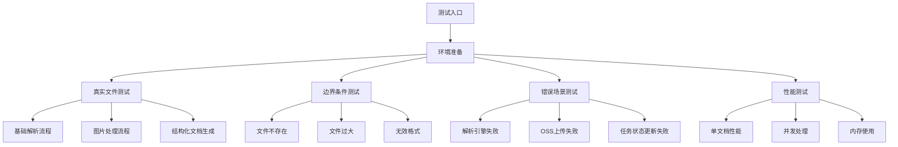

# Design Document

## Overview

本设计文档描述了对 `parse_document_internal` 核心函数的全面测试架构。该函数是文档解析服务的核心，包含了从文件验证到最终结果保存的完整流程。我们将设计一套全面的测试策略，确保每个关键步骤都得到充分验证。

## Architecture

### 测试架构设计



### 核心测试组件

1. **TestEnvironment**: 测试环境管理器
2. **MockServices**: 模拟服务组件
3. **RealFileProcessor**: 真实文件处理器
4. **TaskStatusMonitor**: 任务状态监控器
5. **PerformanceProfiler**: 性能分析器

## Components and Interfaces

### 1. TestEnvironment 组件

```rust
pub struct TestEnvironment {
    pub app_state: Arc<AppState>,
    pub temp_dir: TempDir,
    pub test_files: TestFileManager,
}

impl TestEnvironment {
    pub async fn new() -> Result<Self, TestError>;
    pub async fn cleanup(&self) -> Result<(), TestError>;
    pub fn get_test_file_path(&self, filename: &str) -> PathBuf;
}
```

**职责:**
- 创建和管理测试环境
- 提供真实的 AppState 实例
- 管理测试文件和临时目录
- 环境清理和资源释放

### 2. TaskStatusMonitor 组件

```rust
pub struct TaskStatusMonitor {
    task_service: Arc<TaskService>,
    status_history: Vec<TaskStatusSnapshot>,
}

pub struct TaskStatusSnapshot {
    pub timestamp: Instant,
    pub status: TaskStatus,
    pub progress: u32,
    pub stage: Option<ProcessingStage>,
}

impl TaskStatusMonitor {
    pub async fn start_monitoring(&mut self, task_id: &str);
    pub async fn stop_monitoring(&mut self);
    pub fn get_status_history(&self) -> &[TaskStatusSnapshot];
    pub fn verify_stage_progression(&self) -> Result<(), TestError>;
}
```

**职责:**
- 实时监控任务状态变化
- 记录状态变化历史
- 验证状态转换的正确性
- 提供状态分析功能

### 3. ParseResultValidator 组件

```rust
pub struct ParseResultValidator;

impl ParseResultValidator {
    pub fn validate_basic_structure(result: &ParseResult) -> Result<(), ValidationError>;
    pub fn validate_image_processing(result: &ParseResult, expected_images: &[String]) -> Result<(), ValidationError>;
    pub fn validate_markdown_content(content: &str, expected_elements: &ContentElements) -> Result<(), ValidationError>;
    pub fn validate_structured_document(doc: &StructuredDocument, expected: &ExpectedStructure) -> Result<(), ValidationError>;
}

pub struct ContentElements {
    pub headers: Vec<String>,
    pub code_blocks: usize,
    pub tables: usize,
    pub lists: usize,
    pub images: Vec<String>,
}

pub struct ExpectedStructure {
    pub title: String,
    pub section_count: usize,
    pub max_level: usize,
    pub sections: Vec<ExpectedSection>,
}
```

**职责:**
- 验证解析结果的完整性
- 检查图片处理的正确性
- 验证Markdown内容结构
- 验证结构化文档的准确性

### 4. ErrorScenarioTester 组件

```rust
pub struct ErrorScenarioTester {
    test_env: Arc<TestEnvironment>,
}

impl ErrorScenarioTester {
    pub async fn test_file_not_found(&self) -> Result<(), TestError>;
    pub async fn test_file_too_large(&self) -> Result<(), TestError>;
    pub async fn test_parsing_engine_failure(&self) -> Result<(), TestError>;
    pub async fn test_oss_upload_failure(&self) -> Result<(), TestError>;
    pub async fn test_timeout_scenario(&self) -> Result<(), TestError>;
}
```

**职责:**
- 测试各种错误场景
- 验证错误处理的正确性
- 确保系统的健壮性
- 验证错误恢复机制

### 5. PerformanceProfiler 组件

```rust
pub struct PerformanceProfiler {
    start_time: Option<Instant>,
    checkpoints: Vec<PerformanceCheckpoint>,
}

pub struct PerformanceCheckpoint {
    pub name: String,
    pub timestamp: Instant,
    pub memory_usage: u64,
    pub cpu_usage: f64,
}

impl PerformanceProfiler {
    pub fn start(&mut self);
    pub fn checkpoint(&mut self, name: &str);
    pub fn finish(&mut self) -> PerformanceReport;
    pub fn analyze_memory_usage(&self) -> MemoryAnalysis;
    pub fn analyze_timing(&self) -> TimingAnalysis;
}
```

**职责:**
- 性能数据收集
- 内存使用分析
- 时间消耗分析
- 性能报告生成

## Data Models

### 测试数据模型

```rust
#[derive(Debug, Clone)]
pub struct TestCase {
    pub name: String,
    pub description: String,
    pub input_file: String,
    pub expected_format: DocumentFormat,
    pub expected_images: Vec<String>,
    pub expected_content: ContentElements,
    pub expected_structure: ExpectedStructure,
}

#[derive(Debug)]
pub struct TestResult {
    pub test_name: String,
    pub success: bool,
    pub duration: Duration,
    pub error: Option<String>,
    pub performance_data: Option<PerformanceReport>,
    pub validation_results: Vec<ValidationResult>,
}

#[derive(Debug)]
pub struct ValidationResult {
    pub validator_name: String,
    pub passed: bool,
    pub details: String,
    pub expected: String,
    pub actual: String,
}
```

### 测试配置模型

```rust
#[derive(Debug, Clone)]
pub struct TestConfig {
    pub test_files_dir: PathBuf,
    pub images_dir: PathBuf,
    pub timeout_duration: Duration,
    pub max_concurrent_tests: usize,
    pub enable_performance_profiling: bool,
    pub enable_memory_tracking: bool,
}

impl Default for TestConfig {
    fn default() -> Self {
        Self {
            test_files_dir: PathBuf::from("/Volumes/soddygo/git_work/mcp_proxy/document-parser/fixtures"),
            images_dir: PathBuf::from("/Volumes/soddygo/git_work/mcp_proxy/document-parser/fixtures/images"),
            timeout_duration: Duration::from_secs(30),
            max_concurrent_tests: 5,
            enable_performance_profiling: true,
            enable_memory_tracking: true,
        }
    }
}
```

## Error Handling

### 错误类型定义

```rust
#[derive(Debug, thiserror::Error)]
pub enum TestError {
    #[error("环境初始化失败: {0}")]
    EnvironmentSetup(String),
    
    #[error("测试文件不存在: {0}")]
    TestFileNotFound(String),
    
    #[error("验证失败: {0}")]
    ValidationFailed(String),
    
    #[error("性能测试失败: {0}")]
    PerformanceTestFailed(String),
    
    #[error("并发测试失败: {0}")]
    ConcurrencyTestFailed(String),
    
    #[error("应用状态错误: {0}")]
    AppStateError(#[from] crate::error::AppError),
    
    #[error("IO错误: {0}")]
    IoError(#[from] std::io::Error),
}
```

### 错误处理策略

1. **测试环境错误**: 跳过相关测试，记录警告
2. **文件访问错误**: 提供清晰的错误信息和解决建议
3. **验证失败**: 详细记录期望值和实际值的差异
4. **性能测试错误**: 记录性能数据并提供分析报告
5. **并发测试错误**: 分析并发冲突和资源竞争问题

## Testing Strategy

### 测试分层策略

#### 1. 单元测试层
- 测试 `parse_document_internal` 函数的各个步骤
- 使用真实的测试文件和模拟的依赖服务
- 验证每个处理阶段的正确性

#### 2. 集成测试层
- 测试完整的解析流程
- 使用真实的所有依赖服务
- 验证端到端的功能正确性

#### 3. 性能测试层
- 测试单文档解析性能
- 测试并发处理能力
- 测试内存使用和资源管理

#### 4. 错误场景测试层
- 测试各种异常情况
- 验证错误处理和恢复机制
- 确保系统的健壮性

### 测试用例设计

#### 核心功能测试用例

1. **基础解析流程测试**
   - 输入: `upload_parse_test.md`
   - 验证: 文件验证、格式检测、解析引擎选择、内容解析
   - 期望: 成功解析并返回正确的 ParseResult

2. **图片处理流程测试**
   - 输入: 包含图片引用的 Markdown 文件
   - 验证: 图片提取、路径处理、内容更新
   - 期望: 正确识别和处理所有图片引用

3. **结构化文档生成测试**
   - 输入: 解析后的 Markdown 内容
   - 验证: TOC 生成、章节结构、标题层级
   - 期望: 生成正确的结构化文档对象

#### 边界条件测试用例

1. **文件不存在测试**
   - 输入: 不存在的文件路径
   - 期望: 返回 "文件不存在" 错误

2. **文件过大测试**
   - 输入: 超过大小限制的文件
   - 期望: 返回 "文件大小超过限制" 错误

3. **空文件测试**
   - 输入: 空的 Markdown 文件
   - 期望: 正确处理并返回空内容结构

#### 错误场景测试用例

1. **解析引擎失败测试**
   - 模拟: 解析引擎返回错误
   - 期望: 正确处理错误并更新任务状态

2. **OSS上传失败测试**
   - 模拟: OSS 服务不可用
   - 期望: 记录错误但不影响主要解析流程

3. **任务状态更新失败测试**
   - 模拟: 任务服务不可用
   - 期望: 记录警告但继续执行主流程

### 测试数据管理

#### 测试文件结构
```
fixtures/
├── upload_parse_test.md          # 主要测试文件
├── images/                       # 图片资源目录
│   ├── test1.jpg
│   ├── test2.png
│   └── test3.gif
├── edge_cases/                   # 边界条件测试文件
│   ├── empty.md
│   ├── large_file.md
│   └── no_images.md
└── error_cases/                  # 错误场景测试文件
    ├── corrupted.md
    └── invalid_format.txt
```

#### 预期结果数据
```rust
pub const EXPECTED_TEST_RESULTS: TestCase = TestCase {
    name: "upload_parse_test.md".to_string(),
    description: "主要测试文件的完整解析流程".to_string(),
    input_file: "upload_parse_test.md".to_string(),
    expected_format: DocumentFormat::Md,
    expected_images: vec![
        "test1.jpg".to_string(),
        "test2.png".to_string(),
        "test3.gif".to_string(),
    ],
    expected_content: ContentElements {
        headers: vec![
            "文档解析测试".to_string(),
            "第一章节".to_string(),
            "子章节 1.1".to_string(),
            "子章节 1.2".to_string(),
            "第二章节".to_string(),
            "代码示例".to_string(),
            "表格示例".to_string(),
            "第三章节".to_string(),
            "列表示例".to_string(),
            "链接示例".to_string(),
            "结论".to_string(),
        ],
        code_blocks: 1,
        tables: 1,
        lists: 1,
        images: vec![
            "test1.jpg".to_string(),
            "test2.png".to_string(),
            "test3.gif".to_string(),
        ],
    },
    expected_structure: ExpectedStructure {
        title: "文档解析测试".to_string(),
        section_count: 7,
        max_level: 3,
        sections: vec![
            ExpectedSection {
                title: "文档解析测试".to_string(),
                level: 1,
            },
            ExpectedSection {
                title: "第一章节".to_string(),
                level: 2,
            },
            // ... 其他章节
        ],
    },
};
```

## Implementation Approach

### 开发阶段

#### 阶段 1: 基础测试框架
1. 创建测试环境管理器
2. 实现基础的测试用例结构
3. 建立测试数据和配置管理

#### 阶段 2: 核心功能测试
1. 实现真实文件解析测试
2. 添加任务状态监控功能
3. 实现解析结果验证器

#### 阶段 3: 高级测试功能
1. 添加图片处理流程测试
2. 实现结构化文档验证
3. 添加性能分析功能

#### 阶段 4: 错误场景和边界测试
1. 实现各种错误场景测试
2. 添加边界条件测试
3. 完善错误处理验证

#### 阶段 5: 性能和并发测试
1. 实现性能基准测试
2. 添加并发处理测试
3. 实现内存使用分析

### 技术选择

1. **测试框架**: 使用 Rust 原生的 `#[tokio::test]` 进行异步测试
2. **断言库**: 使用标准的 `assert!` 宏和自定义验证器
3. **模拟框架**: 根据需要实现轻量级的模拟组件
4. **性能分析**: 使用 `std::time::Instant` 和系统资源监控
5. **并发测试**: 使用 `tokio::spawn` 和 `futures::join!` 进行并发控制

### 质量保证

1. **代码覆盖率**: 确保 `parse_document_internal` 函数的所有分支都被测试覆盖
2. **测试可靠性**: 所有测试都应该是确定性的和可重复的
3. **性能基准**: 建立性能基准线，监控性能回归
4. **文档完整性**: 为所有测试用例提供清晰的文档说明
5. **持续集成**: 确保测试可以在 CI/CD 环境中稳定运行