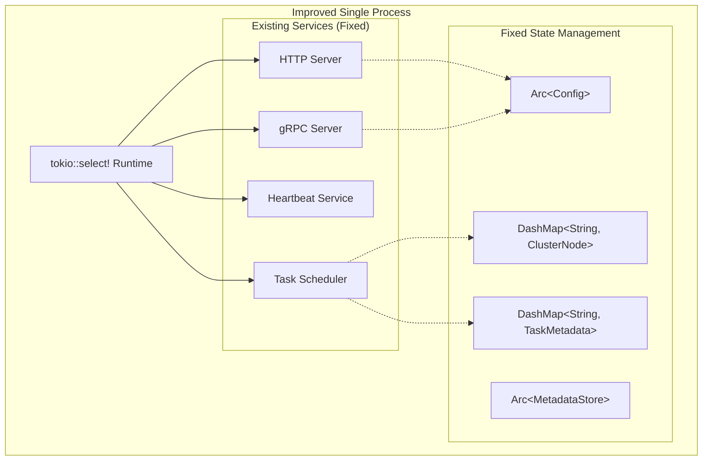

# Voice-CLI Cluster Architecture Improvement Design

## Overview

This design document focuses on **core quality improvements** to the existing voice-cli cluster implementation. The improvements target specific code quality issues without adding new features or extensive architectural changes. The goal is to fix existing problems and align with Rust best practices while maintaining current functionality.

## Architecture

### Core Issues to Fix

The current implementation has specific code quality issues that need fixing:

1. **Process Management**: Replace `Command::spawn()` with direct async service startup
2. **State Management**: Replace `RwLock<HashMap>` with `DashMap` for better concurrency
3. **Error Handling**: Standardize on `anyhow` for application-level errors
4. **Module Organization**: Fix ambiguous re-exports and naming conflicts
5. **Service Coordination**: Use `tokio::select!` for proper async service management

### Improved Architecture (Minimal Changes)



**Key Changes:**
- Replace process spawning with direct async startup
- Replace `RwLock<HashMap>` with `DashMap`
- Use `tokio::select!` for service coordination
- Standardize error handling with `anyhow`

## 核心改进方案

### 1. 修复进程管理 (替换 Command::spawn)

**当前问题**: 集群启动命令使用 `Command::spawn()` 启动后台进程，增加了管理复杂性。

**解决方案**: 使用 `tokio::select!` 直接启动异步服务，消除进程管理复杂性。

**设计合理性分析**:
- ✅ **简化部署**: 单进程架构，无需管理多个子进程
- ✅ **更好的错误处理**: 直接的错误传播，无需解析子进程退出码
- ✅ **资源共享**: 服务间可以直接共享内存状态
- ✅ **优雅关闭**: 统一的关闭信号处理

```rust
// 当前有问题的代码 (需要替换):
// let mut child = Command::new("voice-cli")
//     .args(&["cluster", "start"])
//     .spawn()?;

// 新的解决方案 - 直接异步服务启动:
pub async fn start_cluster_services(config: Arc<Config>) -> anyhow::Result<()> {
    let (shutdown_tx, mut shutdown_rx) = broadcast::channel(1);
    
    // 使用 tokio::select! 并发运行所有服务
    tokio::select! {
        result = start_http_server(config.clone()) => {
            result.context("HTTP server failed")?;
        }
        result = start_grpc_server(config.clone()) => {
            result.context("gRPC server failed")?;
        }
        result = start_heartbeat_service(config.clone()) => {
            result.context("Heartbeat service failed")?;
        }
        result = start_task_scheduler(config.clone()) => {
            result.context("Task scheduler failed")?;
        }
        _ = shutdown_rx.recv() => {
            info!("Received shutdown signal");
        }
        _ = tokio::signal::ctrl_c() => {
            info!("Received Ctrl+C, shutting down");
        }
    }
    
    Ok(())
}
```

### 2. 使用 DashMap 替换 RwLock<HashMap>

**当前问题**: 使用 `RwLock<HashMap>` 进行并发访问，导致锁竞争和性能瓶颈。

**解决方案**: 使用 `DashMap` 实现无锁原子操作，提高并发性能。

**设计合理性分析**:
- ✅ **性能提升**: 无锁操作，减少线程阻塞
- ✅ **简化代码**: 无需显式锁管理，减少死锁风险
- ✅ **更好的扩展性**: 支持更高的并发访问
- ✅ **保持API兼容**: 接口变化最小，易于迁移

```rust
// 当前有问题的代码 (需要替换):
// pub struct ClusterState {
//     nodes: Arc<RwLock<HashMap<String, ClusterNode>>>,
//     tasks: Arc<RwLock<HashMap<String, TaskMetadata>>>,
// }
// 
// // 需要显式锁管理:
// let nodes = self.nodes.read().await;
// let node = nodes.get(node_id);

// 新的解决方案 - 使用 DashMap:
pub struct ClusterState {
    /// 无锁并发节点缓存
    nodes: Arc<DashMap<String, ClusterNode>>,
    /// 无锁并发任务缓存  
    tasks: Arc<DashMap<String, TaskMetadata>>,
    config: Arc<Config>,
    metadata_store: Arc<MetadataStore>,
}

impl ClusterState {
    /// 原子更新节点，无需锁
    pub async fn update_node(&self, node: ClusterNode) -> anyhow::Result<()> {
        // 原子插入操作，无锁
        self.nodes.insert(node.node_id.clone(), node.clone());
        
        // 持久化到数据库
        self.metadata_store.add_node(&node).await
            .context("Failed to persist node")?;
            
        Ok(())
    }
    
    /// 获取健康节点，无需读锁
    pub fn get_healthy_nodes(&self) -> Vec<ClusterNode> {
        self.nodes.iter()
            .filter(|entry| entry.value().status == NodeStatus::Healthy)
            .map(|entry| entry.value().clone())
            .collect()
    }
    
    /// 原子获取节点信息
    pub fn get_node(&self, node_id: &str) -> Option<ClusterNode> {
        self.nodes.get(node_id).map(|entry| entry.value().clone())
    }
    
    /// 原子移除节点
    pub fn remove_node(&self, node_id: &str) -> Option<ClusterNode> {
        self.nodes.remove(node_id).map(|(_, node)| node)
    }
}
```

### 3. Fix Task Scheduler to Use DashMap

**Current Issue**: Task scheduler uses locks for node selection and task tracking.

**Fix**: Update existing `SimpleTaskScheduler` to use DashMap operations.

```rust
// Update existing SimpleTaskScheduler implementation:
impl SimpleTaskScheduler {
    pub async fn assign_next_task(&self, task_id: String) -> anyhow::Result<String> {
        let available_nodes = self.get_available_nodes_for_tasks();
        
        if available_nodes.is_empty() {
            return Err(anyhow::anyhow!("No available nodes for task assignment"));
        }
        
        // Atomic round-robin selection (existing logic, but with DashMap)
        let index = self.current_node_index.fetch_add(1, Ordering::Relaxed) % available_nodes.len();
        let selected_node = &available_nodes[index];
        
        // Use DashMap for atomic task state update
        let mut task = TaskMetadata::new(task_id.clone(), "client".to_string(), "file".to_string());
        task.assign_to_node(selected_node.node_id.clone());
        
        // Atomic insert instead of lock-based update
        self.cluster_state.tasks.insert(task_id.clone(), task.clone());
        
        // Persist to database (existing logic)
        self.cluster_state.metadata_store.assign_task(&task_id, &selected_node.node_id).await
            .context("Failed to persist task assignment")?;
            
        Ok(selected_node.node_id.clone())
    }
}
```

### 4. Standardize Error Handling with Anyhow

**Current Issue**: Mixed use of `thiserror` and other error handling approaches.

**Fix**: Standardize on `anyhow` for application-level errors, keep `thiserror` only for library errors.

```rust
// Replace VoiceCliError with anyhow for application errors:
// pub enum VoiceCliError { ... } // Remove this

// Use anyhow::Result consistently:
pub type Result<T> = anyhow::Result<T>;

// Keep ClusterError (thiserror) for library-level errors:
#[derive(thiserror::Error, Debug)]
pub enum ClusterError {
    #[error("Configuration error: {0}")]
    Config(String),
    #[error("Network error: {0}")]
    Network(String),
    #[error("No available nodes")]
    NoAvailableNodes,
}

// Convert library errors to anyhow with context:
impl From<ClusterError> for anyhow::Error {
    fn from(error: ClusterError) -> Self {
        anyhow::anyhow!("{}", error)
    }
}

// Add context helpers for better error messages:
pub trait ClusterResultExt<T> {
    fn with_node_context(self, node_id: &str) -> anyhow::Result<T>;
    fn with_task_context(self, task_id: &str) -> anyhow::Result<T>;
}

impl<T, E> ClusterResultExt<T> for std::result::Result<T, E>
where
    E: Into<anyhow::Error>,
{
    fn with_node_context(self, node_id: &str) -> anyhow::Result<T> {
        self.map_err(|e| e.into())
            .with_context(|| format!("Node operation failed: {}", node_id))
    }
    
    fn with_task_context(self, task_id: &str) -> anyhow::Result<T> {
        self.map_err(|e| e.into())
            .with_context(|| format!("Task operation failed: {}", task_id))
    }
}
```

### 5. Fix Module Organization and Import Conflicts

**Current Issue**: Ambiguous glob re-exports causing naming conflicts.

**Fix**: Use explicit re-exports and separate conflicting types.

```rust
// models/mod.rs - Fix ambiguous re-exports
pub mod config;
pub mod cluster;
pub mod metadata_store;
pub mod http_result;

// Explicit re-exports instead of glob imports
pub use config::Config;
pub use cluster::{ClusterNode, TaskMetadata, NodeRole, NodeStatus, TaskState};
pub use metadata_store::{MetadataStore, ClusterError};
pub use http_result::HttpResult;

// Separate conflicting types into submodules
pub mod request {
    pub use crate::models::request::TranscriptionRequest;
    pub use crate::models::request::AudioMetadata;
}

pub mod worker {
    pub use crate::models::worker::WorkerRequest;
    pub use crate::models::worker::WorkerMetadata;
}

// Remove problematic glob re-exports:
// pub use request::*; // Remove this
// pub use worker::*;  // Remove this
```

## Configuration Improvements

### Add Environment Variable Support

**Current Issue**: Configuration only loads from files.

**Fix**: Add environment variable overrides to existing Config implementation.

```rust
// Extend existing Config implementation:
impl Config {
    /// Add environment variable overrides to existing load method
    pub fn load_with_env_overrides<P: AsRef<Path>>(path: P) -> anyhow::Result<Self> {
        let mut config = Self::load_or_create(path)
            .context("Failed to load configuration")?;
            
        // Apply environment variable overrides
        if let Ok(port) = std::env::var("VOICE_CLI_HTTP_PORT") {
            config.server.port = port.parse()
                .context("Invalid HTTP port in environment variable")?;
        }
        
        if let Ok(grpc_port) = std::env::var("VOICE_CLI_GRPC_PORT") {
            config.cluster.grpc_port = grpc_port.parse()
                .context("Invalid gRPC port in environment variable")?;
        }
        
        // Add basic validation
        config.validate()
            .context("Configuration validation failed")?;
            
        Ok(config)
    }
    
    /// Add validation to existing Config
    pub fn validate(&self) -> anyhow::Result<()> {
        if self.server.port == 0 || self.server.port > 65535 {
            return Err(anyhow::anyhow!("Invalid HTTP port: {}", self.server.port));
        }
        
        if self.cluster.grpc_port == 0 || self.cluster.grpc_port > 65535 {
            return Err(anyhow::anyhow!("Invalid gRPC port: {}", self.cluster.grpc_port));
        }
        
        if self.server.port == self.cluster.grpc_port {
            return Err(anyhow::anyhow!("HTTP and gRPC ports cannot be the same"));
        }
        
        Ok(())
    }
}
```

## Logging and Error Context

### Structured Logging Improvements

**Current Issue**: Inconsistent logging across services.

**Fix**: Add structured logging with consistent fields.

```rust
// Add structured logging setup:
pub fn setup_structured_logging() -> anyhow::Result<()> {
    tracing_subscriber::fmt()
        .with_target(false)
        .with_thread_ids(true)
        .with_level(true)
        .json()
        .init();
        
    Ok(())
}

// Add logging macros with consistent fields:
macro_rules! log_cluster_event {
    ($level:ident, $node_id:expr, $service:expr, $operation:expr, $message:expr) => {
        tracing::$level!(
            node_id = $node_id,
            service_type = $service,
            operation = $operation,
            message = $message
        );
    };
}

// Usage in cluster operations:
// log_cluster_event!(info, "node-1", "task_scheduler", "assign_task", "Task assigned successfully");
```

## Testing Strategy

### Core Business Logic Tests

**重点测试集群核心业务逻辑**，确保改进后的代码质量和功能正确性。

```rust
#[cfg(test)]
mod cluster_core_tests {
    use super::*;
    use std::sync::Arc;
    use tokio::time::{sleep, Duration};
    
    #[tokio::test]
    async fn test_cluster_state_concurrent_operations() -> anyhow::Result<()> {
        let cluster_state = Arc::new(ClusterState::new(
            Arc::new(Config::default()),
            Arc::new(MetadataStore::new_temp()?)
        ));
        
        // 测试并发节点更新
        let mut handles = vec![];
        for i in 0..10 {
            let state = cluster_state.clone();
            let handle = tokio::spawn(async move {
                let node = ClusterNode::new(
                    format!("node-{}", i),
                    "127.0.0.1".to_string(),
                    9090 + i,
                    8080 + i
                );
                state.update_node(node).await
            });
            handles.push(handle);
        }
        
        // 等待所有操作完成
        for handle in handles {
            handle.await??;
        }
        
        // 验证所有节点都已添加
        assert_eq!(cluster_state.nodes.len(), 10);
        Ok(())
    }
    
    #[tokio::test]
    async fn test_task_scheduler_round_robin_logic() -> anyhow::Result<()> {
        let cluster_state = Arc::new(ClusterState::new(
            Arc::new(Config::default()),
            Arc::new(MetadataStore::new_temp()?)
        ));
        
        // 添加测试节点
        for i in 0..3 {
            let mut node = ClusterNode::new(
                format!("node-{}", i),
                "127.0.0.1".to_string(),
                9090 + i,
                8080 + i
            );
            node.status = NodeStatus::Healthy;
            node.role = NodeRole::Follower;
            cluster_state.nodes.insert(node.node_id.clone(), node);
        }
        
        let scheduler = SimpleTaskScheduler::new(
            cluster_state.clone(),
            false, // leader不处理任务
            "leader".to_string()
        );
        
        // 测试轮询分配
        let mut assigned_nodes = vec![];
        for i in 0..6 {
            let task_id = format!("task-{}", i);
            let assigned_node = scheduler.assign_next_task(task_id).await?;
            assigned_nodes.push(assigned_node);
        }
        
        // 验证轮询逻辑：应该是 node-0, node-1, node-2, node-0, node-1, node-2
        assert_eq!(assigned_nodes[0], "node-0");
        assert_eq!(assigned_nodes[1], "node-1");
        assert_eq!(assigned_nodes[2], "node-2");
        assert_eq!(assigned_nodes[3], "node-0");
        assert_eq!(assigned_nodes[4], "node-1");
        assert_eq!(assigned_nodes[5], "node-2");
        
        Ok(())
    }
    
    #[tokio::test]
    async fn test_cluster_service_lifecycle() -> anyhow::Result<()> {
        let config = Arc::new(Config::default());
        
        // 测试服务启动和关闭
        let (shutdown_tx, mut shutdown_rx) = tokio::sync::broadcast::channel(1);
        
        let service_task = tokio::spawn(async move {
            tokio::select! {
                _ = start_cluster_services(config) => {
                    // 服务正常运行
                }
                _ = shutdown_rx.recv() => {
                    // 收到关闭信号
                }
            }
        });
        
        // 等待一小段时间让服务启动
        sleep(Duration::from_millis(100)).await;
        
        // 发送关闭信号
        let _ = shutdown_tx.send(());
        
        // 验证服务能够正常关闭
        tokio::time::timeout(Duration::from_secs(5), service_task).await??;
        
        Ok(())
    }
    
    #[test]
    fn test_node_health_status_logic() {
        let mut node = ClusterNode::new(
            "test-node".to_string(),
            "127.0.0.1".to_string(),
            9090,
            8080
        );
        
        // 测试节点状态转换逻辑
        assert_eq!(node.status, NodeStatus::Joining);
        assert!(!node.can_accept_tasks(0));
        
        node.status = NodeStatus::Healthy;
        node.capabilities.can_process_tasks = true;
        assert!(node.can_accept_tasks(0));
        assert!(node.can_accept_tasks(4)); // 小于最大并发数
        assert!(!node.can_accept_tasks(5)); // 等于最大并发数
        assert!(!node.can_accept_tasks(6)); // 超过最大并发数
        
        node.status = NodeStatus::Unhealthy;
        assert!(!node.can_accept_tasks(0));
    }
    
    #[test]
    fn test_config_validation_business_rules() -> anyhow::Result<()> {
        let mut config = Config::default();
        
        // 测试业务规则验证
        config.server.port = 8080;
        config.cluster.grpc_port = 9090;
        assert!(config.validate().is_ok());
        
        // 端口冲突
        config.cluster.grpc_port = 8080;
        assert!(config.validate().is_err());
        
        // 无效端口范围
        config.server.port = 0;
        assert!(config.validate().is_err());
        
        config.server.port = 70000;
        assert!(config.validate().is_err());
        
        Ok(())
    }
    
    #[tokio::test]
    async fn test_error_handling_with_context() -> anyhow::Result<()> {
        // 测试错误上下文传播
        let result: Result<(), ClusterError> = Err(ClusterError::NoAvailableNodes);
        let with_context = result.with_node_context("test-node-123");
        
        assert!(with_context.is_err());
        let error_msg = with_context.unwrap_err().to_string();
        assert!(error_msg.contains("test-node-123"));
        assert!(error_msg.contains("Node operation failed"));
        
        Ok(())
    }
}

#[cfg(test)]
mod integration_tests {
    use super::*;
    
    #[tokio::test]
    async fn test_cluster_node_join_workflow() -> anyhow::Result<()> {
        // 测试节点加入集群的完整流程
        let cluster_state = Arc::new(ClusterState::new(
            Arc::new(Config::default()),
            Arc::new(MetadataStore::new_temp()?)
        ));
        
        // 1. 新节点加入
        let new_node = ClusterNode::new(
            "new-node".to_string(),
            "192.168.1.100".to_string(),
            9090,
            8080
        );
        
        cluster_state.update_node(new_node.clone()).await?;
        
        // 2. 验证节点已添加但状态为 Joining
        assert!(cluster_state.nodes.contains_key("new-node"));
        let stored_node = cluster_state.nodes.get("new-node").unwrap();
        assert_eq!(stored_node.status, NodeStatus::Joining);
        
        // 3. 模拟健康检查通过，更新状态为 Healthy
        let mut healthy_node = new_node.clone();
        healthy_node.status = NodeStatus::Healthy;
        cluster_state.update_node(healthy_node).await?;
        
        // 4. 验证节点现在可以接受任务
        let healthy_nodes = cluster_state.get_healthy_nodes();
        assert_eq!(healthy_nodes.len(), 1);
        assert_eq!(healthy_nodes[0].node_id, "new-node");
        
        Ok(())
    }
    
    #[tokio::test]
    async fn test_task_assignment_and_completion_flow() -> anyhow::Result<()> {
        // 测试任务分配和完成的完整流程
        let cluster_state = Arc::new(ClusterState::new(
            Arc::new(Config::default()),
            Arc::new(MetadataStore::new_temp()?)
        ));
        
        // 添加健康节点
        let mut node = ClusterNode::new(
            "worker-node".to_string(),
            "127.0.0.1".to_string(),
            9090,
            8080
        );
        node.status = NodeStatus::Healthy;
        node.role = NodeRole::Follower;
        cluster_state.nodes.insert(node.node_id.clone(), node);
        
        let scheduler = SimpleTaskScheduler::new(
            cluster_state.clone(),
            false,
            "leader".to_string()
        );
        
        // 1. 分配任务
        let task_id = "test-task-001".to_string();
        let assigned_node = scheduler.assign_next_task(task_id.clone()).await?;
        assert_eq!(assigned_node, "worker-node");
        
        // 2. 验证任务状态已更新
        assert!(cluster_state.tasks.contains_key(&task_id));
        let task = cluster_state.tasks.get(&task_id).unwrap();
        assert_eq!(task.assigned_node_id, Some("worker-node".to_string()));
        
        // 3. 模拟任务完成
        let mut completed_task = task.clone();
        completed_task.state = TaskState::Completed;
        cluster_state.tasks.insert(task_id.clone(), completed_task);
        
        // 4. 验证任务完成状态
        let final_task = cluster_state.tasks.get(&task_id).unwrap();
        assert_eq!(final_task.state, TaskState::Completed);
        
        Ok(())
    }
}
```

## 实施优先级和合理性评估

### 第一阶段: 核心修复 (高优先级)
1. **替换 Command::spawn 为 tokio::select!** 
   - 合理性: ✅ 消除进程管理复杂性，提高可靠性
   - 风险: 🟡 低风险，主要是重构现有启动逻辑
   
2. **替换 RwLock<HashMap> 为 DashMap** 
   - 合理性: ✅ 显著提升并发性能，简化代码
   - 风险: 🟡 低风险，API兼容，主要是数据结构替换
   
3. **统一使用 anyhow 处理错误** 
   - 合理性: ✅ 一致的错误管理，更好的错误上下文
   - 风险: 🟢 极低风险，主要是类型替换
   
4. **修复模块组织和导入冲突** 
   - 合理性: ✅ 解决编译问题，提高代码可维护性
   - 风险: 🟢 极低风险，主要是重新组织导入

### 第二阶段: 质量改进 (中等优先级)
1. **添加环境变量支持** - 更好的配置管理
2. **改进结构化日志** - 更好的监控和调试
3. **添加基础验证** - 防止配置错误
4. **添加单元测试** - 确保代码质量

### 预期收益
- **降低复杂性**: 无需进程管理和PID文件
- **性能提升**: DashMap无锁并发操作
- **提高可靠性**: 一致的错误处理和验证
- **易于维护**: 清晰的模块组织和更好的日志

### 迁移策略
- **向后兼容**: 保持现有API契约不变
- **增量实施**: 可以逐个组件实现
- **低风险**: 专注于代码质量改进，不改变功能

### 设计合理性总结
✅ **专注核心问题**: 针对现有代码的具体问题，不过度设计
✅ **技术选择合适**: DashMap、anyhow、tokio::select! 都是成熟的Rust生态解决方案
✅ **实施风险可控**: 主要是重构现有代码，不涉及架构大改
✅ **测试覆盖充分**: 重点测试集群核心业务逻辑和并发场景
✅ **渐进式改进**: 可以分阶段实施，每个阶段都有明确的价值