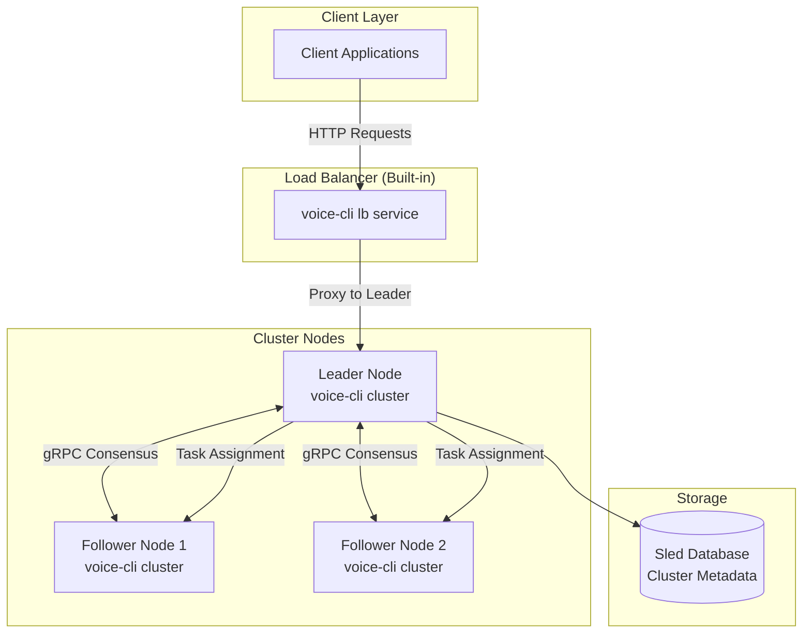
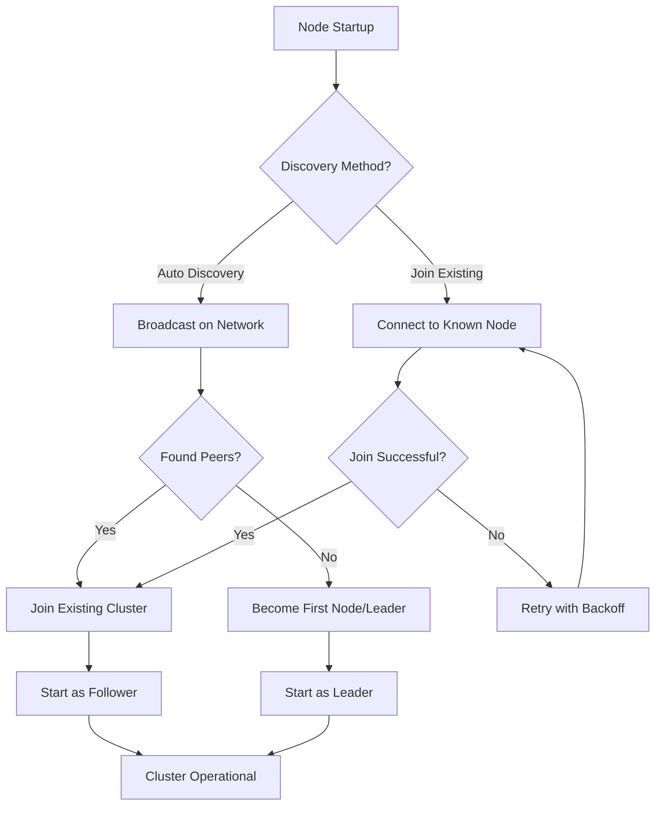
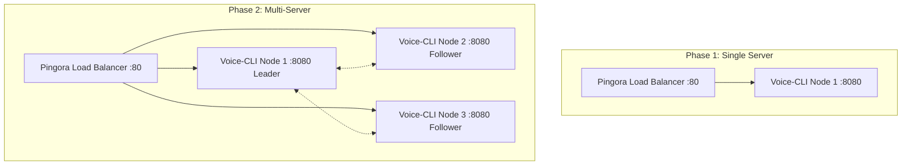
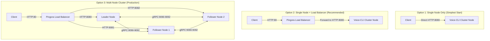
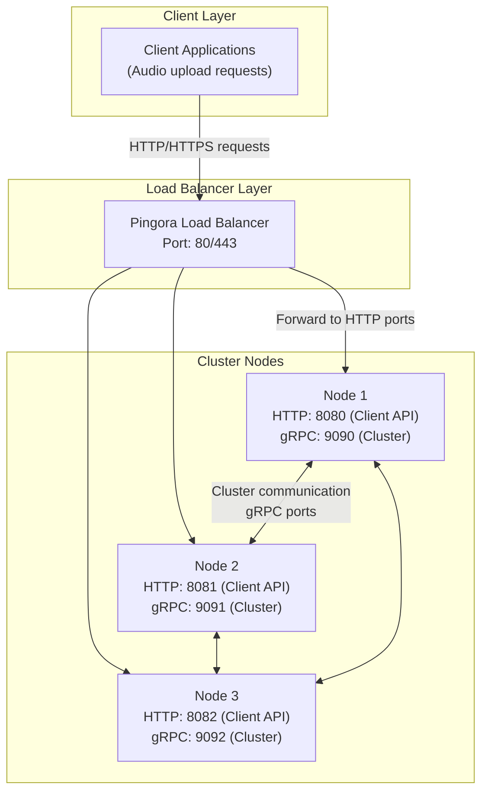

# Audio Cluster Service Design

## Overview

The Audio Cluster Service extends the existing single-node voice-cli service into a distributed cluster for horizontal scaling and load distribution. The first version focuses on **core clustering functionality**: leader election, task distribution, and basic load balancing.

**Core Features (v1):**
- Transform single voice-cli into multi-node cluster
- Automatic leader election using Raft consensus
- Task distribution across healthy nodes
- Built-in load balancer service
- Simple join/leave cluster operations
- Preserve existing voice-cli API compatibility

## System Architecture

### High-Level Architecture (v1 Core)



### Technology Stack (v1 Essentials)

**Core Dependencies:**
- **Consensus**: Raft using `raft-rs` library
- **Communication**: Tonic gRPC for cluster coordination
- **Storage**: Sled embedded database for cluster metadata
- **Web Framework**: Axum for HTTP API (existing)
- **Audio Processing**: Existing voice-toolkit and ffmpeg-sidecar
- **Configuration**: YAML config files

**Simplified Architecture:**
- Single binary: `voice-cli` with cluster and load balancer built-in
- No external dependencies (Pingora, Redis, etc.)
- File-based configuration and logging
- Basic health checking via HTTP endpoints

## Protocol Buffer Definitions (v1 Core)

### Essential gRPC Service

```protobuf
syntax = "proto3";

package audio_cluster;

// Core cluster service - minimal required functionality
service AudioClusterService {
    // Basic cluster operations
    rpc JoinCluster(JoinRequest) returns (JoinResponse);
    rpc GetClusterStatus(ClusterStatusRequest) returns (ClusterStatusResponse);
    rpc Heartbeat(HeartbeatRequest) returns (HeartbeatResponse);
    
    // Task coordination
    rpc AssignTask(TaskAssignmentRequest) returns (TaskAssignmentResponse);
    rpc ReportTaskCompletion(TaskCompletionRequest) returns (TaskCompletionResponse);
}

// Simplified node information
message NodeInfo {
    string node_id = 1;
    string address = 2;
    uint32 grpc_port = 3;
    uint32 http_port = 4;
    NodeRole role = 5;
    NodeStatus status = 6;
    int64 last_heartbeat = 7;  // Essential for health monitoring
}

enum NodeRole {
    LEADER = 0;
    FOLLOWER = 1;
    CANDIDATE = 2;
}

enum NodeStatus {
    HEALTHY = 0;
    UNHEALTHY = 1;
    JOINING = 2;
    LEAVING = 3;
}

// Task assignment (simplified but with essential business info)
message TaskAssignmentRequest {
    string task_id = 1;
    string client_id = 2;           // Track client for business purposes
    string filename = 3;            // Original filename for context
    string audio_file_path = 4;     // Local file path instead of bytes
    string model = 5;
    string response_format = 6;
}

// Task completion reporting
message TaskCompletionRequest {
    string task_id = 1;
    TaskState final_state = 2;      // COMPLETED or FAILED
    string error_message = 3;       // Only set if final_state is FAILED
    string result_data = 4;         // Transcription result if successful
}

message TaskCompletionResponse {
    bool success = 1;
    string message = 2;
}

enum TaskState {
    PENDING = 0;
    ASSIGNED = 1;
    PROCESSING = 2;
    COMPLETED = 3;
    FAILED = 4;
}
```

## Data Models and Storage (v1 Simplified)

### Essential Metadata Schema

```rust
// Simplified cluster node tracking
#[derive(Serialize, Deserialize, Debug, Clone)]
pub struct ClusterNode {
    pub node_id: String,
    pub address: String,
    pub grpc_port: u16,
    pub http_port: u16,
    pub role: NodeRole,
    pub status: NodeStatus,
    pub last_heartbeat: i64,  // Essential for health monitoring
}

// Basic task tracking with essential business information
#[derive(Serialize, Deserialize, Debug, Clone)]
pub struct TaskMetadata {
    pub task_id: String,
    pub client_id: String,           // Track which client submitted the task
    pub filename: String,            // Original audio filename
    pub assigned_node: Option<String>,
    pub state: TaskState,
    pub created_at: i64,            // Task creation timestamp
    pub completed_at: Option<i64>,  // Task completion timestamp
    pub error_message: Option<String>, // Error details for failed tasks
}

// Minimal metadata operations
pub struct MetadataStore {
    db: Arc<sled::Db>,
}

impl MetadataStore {
    // Core node operations
    pub async fn add_node(&self, node: &ClusterNode) -> Result<(), ClusterError>;
    pub async fn remove_node(&self, node_id: &str) -> Result<(), ClusterError>;
    pub async fn get_all_nodes(&self) -> Result<Vec<ClusterNode>, ClusterError>;
    pub async fn update_node_status(&self, node_id: &str, status: NodeStatus) -> Result<(), ClusterError>;
    pub async fn update_heartbeat(&self, node_id: &str) -> Result<(), ClusterError>;  // Update last_heartbeat
    
    // Basic task operations
    pub async fn create_task(&self, task: &TaskMetadata) -> Result<(), ClusterError>;
    pub async fn assign_task(&self, task_id: &str, node_id: &str) -> Result<(), ClusterError>;
    pub async fn complete_task(&self, task_id: &str) -> Result<(), ClusterError>;
    pub async fn fail_task(&self, task_id: &str, error_message: &str) -> Result<(), ClusterError>;
    pub async fn get_task(&self, task_id: &str) -> Result<Option<TaskMetadata>, ClusterError>;
    pub async fn get_tasks_by_client(&self, client_id: &str) -> Result<Vec<TaskMetadata>, ClusterError>;
}
```

## Development Phases

### Phase 1: Core Cluster Functionality (v1 Priority)

**Must-Have Features:**
1. **Basic Cluster Formation**
   - `voice-cli cluster init` - Initialize single node
   - `voice-cli cluster join <address>` - Join existing cluster
   - Simple Raft consensus for leader election

2. **Task Distribution**
   - Leader receives HTTP requests
   - Leader assigns tasks to healthy followers
   - Round-robin task assignment (simple)

3. **Built-in Load Balancer**
   - `voice-cli lb run/start/stop` commands
   - Basic health checking of cluster nodes
   - HTTP proxy to leader node

4. **Essential Monitoring**
   - `voice-cli cluster status` - show cluster health
   - `voice-cli lb status` - show load balancer status
   - Basic logging to files

**Implementation Scope:**
- Single binary with all functionality
- File-based configuration (YAML)
- Sled database for cluster metadata
- Preserve existing voice-cli API compatibility
- Basic error handling and logging

### Phase 2: Stability and Reliability (v2)
- Advanced failover handling
- Node failure detection and recovery
- Persistent task queue
- Configuration validation
- Comprehensive error codes

### Phase 3: Production Features (v3)
- Performance metrics and monitoring
- Security authentication
- Advanced scheduling algorithms
- Backup and restore functionality
- Health monitoring dashboards

**v1 Development Focus:**
- Get basic clustering working reliably
- Maintain existing voice-cli functionality
- Simple deployment and operation
- Clear documentation and examples
- Avoid feature creep - focus on core value

## Core Components Implementation

### Simplified Task Scheduler (Leader Node)

```rust
// v1: Simple round-robin scheduler with configurable leader processing
pub struct SimpleTaskScheduler {
    metadata_store: Arc<MetadataStore>,
    current_node_index: AtomicUsize,
    leader_can_process: bool,  // Configuration option
    leader_node_id: String,
}

impl SimpleTaskScheduler {
    pub fn new(
        metadata_store: Arc<MetadataStore>, 
        leader_can_process: bool,
        leader_node_id: String
    ) -> Self {
        Self {
            metadata_store,
            current_node_index: AtomicUsize::new(0),
            leader_can_process,
            leader_node_id,
        }
    }
    
    pub async fn assign_next_task(&self, task_id: String) -> Result<String, ClusterError> {
        // Get available nodes for task processing
        let mut available_nodes = self.metadata_store.get_all_nodes().await?
            .into_iter()
            .filter(|node| node.status == NodeStatus::Healthy)
            .collect::<Vec<_>>();
            
        // Filter nodes based on leader processing configuration
        if self.leader_can_process {
            // Leader can process: include all healthy nodes (leader + followers)
            available_nodes.retain(|node| 
                node.role == NodeRole::Leader || node.role == NodeRole::Follower
            );
        } else {
            // Leader only coordinates: include only healthy followers
            available_nodes.retain(|node| node.role == NodeRole::Follower);
        }
            
        if available_nodes.is_empty() {
            return Err(ClusterError::NoAvailableNodes);
        }
        
        // Simple round-robin selection
        let index = self.current_node_index.fetch_add(1, Ordering::Relaxed) % available_nodes.len();
        let selected_node = &available_nodes[index];
        
        // Assign task to selected node
        self.metadata_store
            .assign_task(&task_id, &selected_node.node_id)
            .await?;
            
        Ok(selected_node.node_id.clone())
    }
    
    // Check if current node (leader) should process this task
    pub fn should_leader_process(&self, assigned_node_id: &str) -> bool {
        self.leader_can_process && assigned_node_id == self.leader_node_id
    }
}
```

### Raft Consensus Integration (v1 Approach)

```rust
// v1: Use existing raft-rs library with minimal custom logic
use raft::prelude::*;

pub struct AudioClusterRaft {
    raft_node: RawNode<MemStorage>,
    metadata_store: Arc<MetadataStore>,
    node_id: u64,
}

// Implementation notes for v1:
// - Use raft-rs library defaults for most configuration
// - Focus on basic leader election only
// - Defer complex log replication features
// - Simple in-memory storage for Raft state
// - File-based persistence for cluster metadata only

impl AudioClusterRaft {
    pub fn new(node_id: u64, peers: Vec<u64>) -> Self {
        let config = Config {
            id: node_id,
            election_tick: 10,
            heartbeat_tick: 3,
            ..Config::default()  // Use library defaults
        };
        
        let storage = MemStorage::new();
        let raft_node = RawNode::new(&config, storage, &[]).unwrap();
        
        Self { raft_node, node_id, /* ... */ }
    }
    
    pub fn is_leader(&self) -> bool {
        self.raft_node.raft.state == StateRole::Leader
    }
}
```

### Simplified Transcription Worker (Follower Node)

```rust
// v1: Minimal worker that reuses existing voice-cli logic
pub struct SimpleTranscriptionWorker {
    node_id: String,
    metadata_store: Arc<MetadataStore>,
}

impl SimpleTranscriptionWorker {
    pub async fn process_task(
        &self, 
        task_request: TaskAssignmentRequest
    ) -> Result<TranscriptionResult, ClusterError> {
        
        let task_id = &task_request.task_id;
        tracing::info!("Worker {} processing task {} for client {}", 
                      self.node_id, task_id, task_request.client_id);
        
        // Update task status to processing
        self.metadata_store
            .assign_task(task_id, &self.node_id)
            .await?;
            
        // Process transcription
        match self.perform_transcription(&task_request).await {
            Ok(result) => {
                // Mark task as completed
                self.metadata_store.complete_task(task_id).await?;
                Ok(result)
            }
            Err(error) => {
                // Mark task as failed with error message
                self.metadata_store
                    .fail_task(task_id, &error.to_string())
                    .await?;
                Err(error)
            }
        }
    }
    
    async fn perform_transcription(
        &self,
        task_request: &TaskAssignmentRequest
    ) -> Result<TranscriptionResult, ClusterError> {
        
        // v1: Reuse existing voice-cli transcription logic directly
        let result = voice_toolkit::stt::transcribe(
            &task_request.audio_file_path,
            &task_request.model,
            &voice_toolkit::stt::TranscriptionOptions::default(),
        ).await
        .map_err(|e| ClusterError::TranscriptionFailed(e.to_string()))?;
        
        Ok(TranscriptionResult {
            text: result.text,
            language: result.language,
            duration: result.audio_duration as f32 / 1000.0,
            filename: task_request.filename.clone(), // Include original filename
        })
    }
}

#[derive(Debug, Serialize)]
pub struct TranscriptionResult {
    pub text: String,
    pub language: Option<String>,
    pub duration: f32,
    pub filename: String,  // Original filename for client reference
}
```

## Load Balancer Integration

### Pingora Configuration

```rust
use pingora::prelude::*;

pub struct AudioClusterProxy {
    cluster_nodes: Arc<RwLock<Vec<ClusterNode>>>,
    health_checker: Arc<HealthChecker>,
}

#[async_trait]
impl ProxyHttp for AudioClusterProxy {
    type CTX = ();
    
    async fn upstream_peer(
        &self,
        _session: &mut Session,
        _ctx: &mut Self::CTX,
    ) -> Result<Box<dyn Peer + Send + Sync>, Box<Error>> {
        // Find healthy leader node
        let backend = self.select_leader_backend().await
            .ok_or_else(|| Error::explain(ErrorType::ConnectError, "No healthy leader available"))?;
            
        let peer = Peer::new(backend, false, "".to_string());
        Ok(Box::new(peer))
    }
    
    async fn select_leader_backend(&self) -> Option<SocketAddr> {
        let nodes = self.cluster_nodes.read().await;
        
        nodes.iter()
            .find(|node| node.role == NodeRole::Leader && node.status == NodeStatus::Healthy)
            .map(|node| format!("{}:{}", node.address, node.http_port).parse().ok())
            .flatten()
    }
}
```

### Health Checking

```rust
pub struct HealthChecker {
    client: reqwest::Client,
    check_interval: Duration,
}

impl HealthChecker {
    pub async fn run(&self, nodes: Arc<RwLock<Vec<ClusterNode>>>) {
        let mut interval = tokio::time::interval(self.check_interval);
        
        loop {
            interval.tick().await;
            
            let current_nodes = nodes.read().await.clone();
            let mut updated_nodes = Vec::new();
            
            for mut node in current_nodes {
                let is_healthy = self.check_node_health(&node).await;
                
                node.status = if is_healthy {
                    NodeStatus::Healthy
                } else {
                    NodeStatus::Unhealthy
                };
                
                updated_nodes.push(node);
            }
            
            *nodes.write().await = updated_nodes;
        }
    }
    
    async fn check_node_health(&self, node: &ClusterNode) -> bool {
        let health_url = format!("http://{}:{}/health", node.address, node.http_port);
        
        self.client.get(&health_url)
            .timeout(Duration::from_secs(5))
            .send()
            .await
            .map(|response| response.status().is_success())
            .unwrap_or(false)
    }
}
```

## API Endpoints

### HTTP API (Compatible with existing voice-cli)

```rust
// Maintain compatibility with existing voice-cli API
pub async fn transcribe_handler(
    State(state): State<ClusterHttpServer>,
    mut multipart: Multipart,
) -> Result<Json<HttpResult<TranscriptionResponse>>, StatusCode> {
    // Parse multipart form data (same as existing voice-cli)
    let (audio_data, filename, model, response_format) = parse_multipart(multipart).await?;
    
    // Create task
    let task_id = uuid::Uuid::new_v4().to_string();
    let task = TaskMetadata {
        task_id: task_id.clone(),
        client_id: "http_client".to_string(),
        filename,
        file_size: audio_data.len() as u64,
        state: TaskState::Pending,
        created_at: chrono::Utc::now().timestamp(),
        // ... other fields
    };
    
    // Submit to cluster leader for scheduling
    let assigned_node = state.task_scheduler.schedule_task(task).await
        .map_err(|_| StatusCode::INTERNAL_SERVER_ERROR)?;
    
    // Wait for task completion
    let result = state.coordinator.wait_for_task_completion(&task_id).await
        .map_err(|_| StatusCode::INTERNAL_SERVER_ERROR)?;
        
    Ok(Json(HttpResult::success(result)))
}

// Health check endpoint for load balancer
pub async fn cluster_health_handler(
    State(state): State<ClusterHttpServer>,
) -> Json<serde_json::Value> {
    let is_leader = state.coordinator.is_leader().await;
    let cluster_status = state.coordinator.get_cluster_status().await;
    
    Json(serde_json::json!({
        "status": "healthy",
        "role": if is_leader { "leader" } else { "follower" },
        "cluster_size": cluster_status.cluster_size,
        "node_id": state.coordinator.node_id()
    }))
}
```

## Cluster Bootstrap and Discovery

### Automatic Node Discovery

The cluster eliminates manual seed configuration through automatic discovery:

```rust
pub enum DiscoveryMethod {
    AutoDiscovery, // Network broadcast discovery (recommended)
    JoinExisting,  // Join a known cluster node
    Static,        // Manual seed list (fallback only)
}

pub struct NodeDiscovery {
    method: DiscoveryMethod,
    network_interface: String,
    port_range: (u16, u16),
}

impl NodeDiscovery {
    // Automatically discover peers on the network
    async fn broadcast_discovery(&self) -> Result<Vec<NodeInfo>, ClusterError> {
        let socket = UdpSocket::bind("0.0.0.0:0").await?;
        socket.set_broadcast(true)?;
        
        // Broadcast announcement and collect responses
        let discovery_msg = DiscoveryMessage {
            node_id: self.node_id.clone(),
            grpc_port: self.grpc_port,
            message_type: DiscoveryMessageType::Announce,
        };
        
        // Broadcast and listen for peer responses
        self.collect_peer_responses().await
    }
}
```

### Bootstrap Process



### Configuration Examples

#### Configuration Examples

##### Scenario 1: Leader Processes Tasks (Default)
```yaml
# cluster-config.yml
cluster:
  leader_can_process_tasks: true  # Default: leader participates in processing
```

**Behavior:**
- Leader receives client requests via HTTP
- Leader assigns tasks to available nodes (including itself)
- Leader can process transcription tasks when selected
- Provides maximum resource utilization

**Usage:**
```bash
# Single node deployment - leader handles everything
voice-cli cluster init
voice-cli cluster start
# Leader processes all tasks since no followers exist

# Multi-node deployment - leader participates in processing
voice-cli cluster join 192.168.1.100:9090
# Tasks distributed among leader + followers
```

##### Scenario 2: Leader Coordination Only
```yaml
# cluster-config.yml
cluster:
  leader_can_process_tasks: false  # Leader only coordinates, doesn't process
```

**Behavior:**
- Leader receives client requests via HTTP
- Leader assigns tasks only to follower nodes
- Leader focuses on cluster coordination and task distribution
- Better for high-concurrency scenarios where leader needs to stay responsive

**Usage:**
```bash
# Edit configuration file manually
vim cluster-config.yml  # Set leader_can_process_tasks: false
voice-cli cluster restart

# Check configuration
voice-cli cluster status
# Output:
# Role: Leader (Coordination Only)
# Processing Tasks: No
# Available Workers: 2 followers
```

##### Scenario 3: Dynamic Configuration Change
```bash
# Start with leader processing enabled
voice-cli cluster init
voice-cli cluster start

# Add follower nodes
voice-cli cluster join 192.168.1.100:9090  # On second server
voice-cli cluster join 192.168.1.100:9090  # On third server

# Edit configuration file to switch leader to coordination-only
vim cluster-config.yml
# Change: leader_can_process_tasks: false

voice-cli cluster restart

# Verify change
voice-cli cluster status
# Output:
# Role: Leader (Coordination Only) 
# Available Workers: 2 followers
# Task Assignment: Round-robin among followers
```

#### Leader Processing Configuration Comparison

| Configuration | Leader Role | Task Processing | Resource Utilization | Best For |
|---------------|-------------|-----------------|---------------------|----------|
| `leader_can_process_tasks: true` | Coordinator + Worker | Leader + Followers | Maximum | Small clusters, resource efficiency |
| `leader_can_process_tasks: false` | Coordinator Only | Followers Only | Dedicated coordination | Large clusters, high concurrency |

#### Configuration Validation

```rust
// Validation logic for leader processing configuration
pub fn validate_leader_config(config: &ClusterConfig) -> Result<(), ConfigError> {
    if !config.leader_can_process_tasks {
        // If leader doesn't process tasks, ensure we have followers
        let follower_count = get_healthy_follower_count().await?;
        if follower_count == 0 {
            return Err(ConfigError::NoWorkersAvailable(
                "Leader configured as coordination-only but no followers available".to_string()
            ));
        }
    }
    Ok(())
}
```

#### Single-Node + Load Balancer Setup

```bash
# 1. Initialize and start cluster node
cd /opt/voice-cli
voice-cli cluster init
voice-cli cluster start

# 2. Configure Pingora to point to local node
# /etc/pingora/cluster.conf
upstream audio_cluster {
    server 127.0.0.1:8080;
}

server {
    listen 80;
    location / {
        proxy_pass http://audio_cluster;
        proxy_set_header Host $host;
        proxy_set_header X-Real-IP $remote_addr;
    }
}

# 3. Start Pingora
sudo pingora -c /etc/pingora/cluster.conf
```

#### Service Status Check
```bash
# Check cluster node
voice-cli cluster status
# Response: {"status":"healthy","role":"leader","cluster_size":1}

# Check via load balancer
curl http://localhost:80/health
# Same response through proxy
```

### Multi-Node Expansion

#### Scaling from Single Node
When you're ready to add more servers:



#### Adding Second Node
```bash
# On new server (192.168.1.101)
cd /opt/voice-cli
voice-cli cluster init
voice-cli cluster join 192.168.1.100:9090

# Update Pingora config
# /etc/pingora/cluster.conf
upstream audio_cluster {
    server 192.168.1.100:8080;  # Original node
    server 192.168.1.101:8080;  # New node
}

# Reload Pingora
sudo pingora -s reload
```

#### Deployment Architecture Options



#### Service Independence Details

| Service | Type | Responsibility | Independence |
|---------|------|----------------|-------------|
| **voice-cli cluster** | Core Processing | Audio transcription, cluster coordination | Fully independent - can run alone |
| **Pingora Load Balancer** | Proxy/Router | Request routing, health checking | Completely separate - optional service |

**Key Points:**
- Audio cluster nodes are **self-contained** - they include HTTP API and cluster communication
- Load balancer is **purely optional** for single-node deployments
- You can add/remove load balancer without affecting cluster operation
- Services can be deployed on same server or different servers

#### Verification
```bash
# Check cluster status from any node
voice-cli cluster status
# Response: {"leader":"node-1","followers":["node-2"],"cluster_size":2}
```
```

## Deployment Configuration

### Complete Custom Directory Deployment Example

#### Scenario: Deploy in Custom Directory with Auto-Service Management

```bash
# 1. Create your custom working directory
mkdir -p /home/user/my-audio-cluster
cd /home/user/my-audio-cluster

# 2. Copy voice-cli binary to current directory
cp /path/to/voice-cli ./

# 3. Initialize cluster environment in current directory
./voice-cli cluster init
# Creates:
# - cluster-config.yml (in current directory)
# - ./data/ (cluster metadata)
# - ./models/ (whisper models)
# - ./logs/ (application logs)

# 4. Test cluster functionality
./voice-cli cluster run &  # Start in foreground for testing
curl http://localhost:8080/health  # Test API
kill %1  # Stop test instance

# 5. Install as system service (optional)
sudo ./voice-cli service install
# Generates service file with default name: voice-cli-cluster.service
# WorkingDirectory=/home/user/my-audio-cluster
# ExecStart=/home/user/my-audio-cluster/voice-cli cluster start
# Note: No resource limits by default - uses full server resources

# 6. Manage via systemd
sudo ./voice-cli service start
sudo ./voice-cli service status
sudo ./voice-cli service logs

# 7. Or run directly without systemd
./voice-cli cluster start  # Direct execution
```

#### Directory Structure After Initialization

```
/home/user/my-audio-cluster/
├── voice-cli                 # Binary (copied here)
├── cluster-config.yml        # Auto-generated config
├── data/                     # Sled database
│   ├── nodes.db
│   ├── tasks.db
│   └── cluster.db
├── models/                   # Whisper models
│   ├── base.bin
│   └── small.bin
├── logs/                     # Application logs
│   ├── cluster.log
│   └── error.log
└── temp/                     # Temporary files
```

#### Multiple Deployment Scenarios

```bash
# Scenario 1: Development environment
cd /home/dev/audio-dev
./voice-cli cluster init
./voice-cli cluster run  # Foreground mode

# Scenario 2: Production with systemd
cd /opt/production/audio
./voice-cli cluster init
sudo ./voice-cli service install
sudo ./voice-cli service enable
sudo ./voice-cli service start

# Scenario 3: Multiple instances on same server
cd /opt/cluster-1
./voice-cli cluster init --port 8080 --grpc-port 9090
sudo ./voice-cli service install --name audio-cluster-1

cd /opt/cluster-2
./voice-cli cluster init --port 8081 --grpc-port 9091
sudo ./voice-cli service install --name audio-cluster-2
```

#### Step 1: Environment Initialization

```bash
# 1. Create working directory (anywhere you want)
mkdir -p /your/custom/path
cd /your/custom/path

# 2. Copy voice-cli binary to current directory
cp /path/to/voice-cli ./

# 3. Initialize cluster environment (creates config, downloads models, etc.)
./voice-cli cluster init
# This will:
# - Generate cluster-config.yml with auto-discovery enabled
# - Create data/ directories for Sled database  
# - Download default Whisper models if needed
# - Initialize logging configuration
# - Validate system requirements
# - Use current directory as base path for all operations

# 4. (Optional) Download additional models
./voice-cli model download base
./voice-cli model download small

# 5. Validate environment
./voice-cli cluster validate
# Checks:
# - Configuration validity
# - Network connectivity
# - Model availability
# - Storage permissions
# - Current directory structure

# 6. (Optional) Install as system service
sudo ./voice-cli service install
# Auto-generates systemd service with current directory paths
```

#### Step 2: Start First Node (Leader)

```bash
# Start the first cluster node (becomes leader automatically)
voice-cli cluster start

# Or run in foreground for debugging
voice-cli cluster run

# Check cluster status
voice-cli cluster status
# Output:
# Cluster Status: Healthy
# Role: Leader
# Node ID: voice-node-hostname-12345
# Cluster Size: 1
# HTTP Port: 8080
# gRPC Port: 9090
```

#### Step 3: Add Additional Nodes

```bash
# On second server
cd /opt/voice-cli

# Initialize environment (same as first node)
voice-cli cluster init

# Join existing cluster using DIRECT node address (NOT load balancer)
# IMPORTANT: Use the cluster node's gRPC port for joining
voice-cli cluster join 192.168.1.100:9090

# Address explanation:
# ✅ CORRECT: 192.168.1.100:9090 (cluster node gRPC port)
# ❌ WRONG:   192.168.1.100:80   (load balancer port - clients use this)
# ❌ WRONG:   192.168.1.100:8080 (cluster node HTTP port - clients use this)

# Visual representation:
# Client requests: Client → Load Balancer:80 → Cluster Node:8080 (HTTP)
# Cluster joining: New Node → Existing Node:9090 (gRPC)

# The difference:
# - Load balancer address (80): Used by clients for transcription requests
# - Cluster node HTTP (8080): Used by load balancer to forward client requests
# - Cluster node gRPC (9090): Used for cluster communication and joining

# Alternative: Auto-discovery (if on same network)
voice-cli cluster start  # Will auto-discover existing cluster

# Verify cluster membership
voice-cli cluster status
# Output:
# Cluster Status: Healthy
# Role: Follower
# Leader: voice-node-server1-12345
# Node ID: voice-node-server2-67890
# Cluster Size: 2
```

#### Comprehensive Port Configuration

##### Understanding Port Usage



##### Port Configuration Commands

```bash
# 1. Initialize with custom ports (avoiding conflicts)
voice-cli cluster init --http-port 8081 --grpc-port 9091

# 2. Join cluster with custom ports for new node
# Format: voice-cli cluster join <existing-node-grpc-address> [--http-port PORT] [--grpc-port PORT]
voice-cli cluster join 192.168.1.100:9090 --http-port 8082 --grpc-port 9092

# 3. Start cluster with custom ports
voice-cli cluster start --http-port 8080 --grpc-port 9090

# 4. Check available ports before deployment
voice-cli cluster check-ports --http-port 8080 --grpc-port 9090
# Output: Port 8080: Available, Port 9090: In use (suggests alternatives)

# 5. Auto-select available ports
voice-cli cluster init --auto-ports
# Automatically finds available ports starting from defaults

# 6. View all cluster endpoints with their ports
voice-cli cluster endpoints
# Output:
# Node 1: HTTP=192.168.1.100:8080, gRPC=192.168.1.100:9090 (Leader)
# Node 2: HTTP=192.168.1.101:8081, gRPC=192.168.1.101:9091 (Follower)
# Node 3: HTTP=192.168.1.102:8082, gRPC=192.168.1.102:9092 (Follower)
# 
# Load Balancer Config:
# upstream audio_cluster {
#     server 192.168.1.100:8080;
#     server 192.168.1.101:8081;
#     server 192.168.1.102:8082;
# }
```

##### Handling Port Conflicts

```bash
# Scenario 1: Port 8080 is occupied (e.g., by another web service)
voice-cli cluster init --http-port 8090 --grpc-port 9090

# Scenario 2: Both default ports are occupied
voice-cli cluster init --http-port 8090 --grpc-port 9095

# Scenario 3: Auto-detect and suggest available ports
voice-cli cluster init --auto-ports
# Output:
# Port 8080 is in use, using 8081
# Port 9090 is in use, using 9091
# Cluster initialized with HTTP:8081, gRPC:9091

# Scenario 4: Multiple clusters on same server
# Cluster 1
cd /opt/audio-cluster-1
voice-cli cluster init --http-port 8080 --grpc-port 9090

# Cluster 2
cd /opt/audio-cluster-2
voice-cli cluster init --http-port 8081 --grpc-port 9091

# Cluster 3
cd /opt/audio-cluster-3
voice-cli cluster init --http-port 8082 --grpc-port 9092
```

##### Port Configuration Examples

| Scenario | HTTP Port | gRPC Port | Usage |
|----------|-----------|-----------|-------|
| Default | 8080 | 9090 | Standard deployment |
| Conflict Resolution | 8081 | 9091 | When defaults are occupied |
| Multiple Clusters | 8080,8081,8082 | 9090,9091,9092 | Same server hosting multiple clusters |
| Custom Range | 8100-8110 | 9100-9110 | Corporate network restrictions |
| High Ports | 18080 | 19090 | Avoiding well-known port ranges |

##### Integrated Load Balancer Service

**voice-cli includes a built-in stateless load balancer** that can be managed directly without external dependencies:

#### Built-in Load Balancer Architecture

```rust
// Integrated into voice-cli binary
use axum::Router;
use tower_http::cors::CorsLayer;

pub struct VoiceCliLoadBalancer {
    cluster_client: ClusterClient,
    health_checker: HealthChecker,
    port: u16,
}

impl VoiceCliLoadBalancer {
    pub async fn run(&self) -> Result<(), LbError> {
        let app = Router::new()
            .route("/transcribe", post(proxy_transcribe_handler))
            .route("/health", get(lb_health_handler))
            .layer(CorsLayer::permissive());
            
        let listener = tokio::net::TcpListener::bind(format!("0.0.0.0:{}", self.port)).await?;
        tracing::info!("Load balancer listening on port {}", self.port);
        
        axum::serve(listener, app).await?;
        Ok(())
    }
    
    async fn select_healthy_node(&self) -> Result<String, LbError> {
        // Get healthy cluster nodes from cluster status
        let nodes = self.cluster_client.get_healthy_nodes().await?;
        
        if nodes.is_empty() {
            return Err(LbError::NoHealthyNodes);
        }
        
        // Round-robin selection
        let selected = &nodes[self.get_next_index() % nodes.len()];
        Ok(format!("{}:{}", selected.address, selected.http_port))
    }
}

async fn proxy_transcribe_handler(
    State(lb): State<Arc<VoiceCliLoadBalancer>>,
    mut multipart: Multipart,
) -> Result<Response, StatusCode> {
    // Get healthy cluster node
    let target_node = lb.select_healthy_node().await
        .map_err(|_| StatusCode::SERVICE_UNAVAILABLE)?;
        
    // Forward request to selected cluster node
    let client = reqwest::Client::new();
    let response = client
        .post(format!("http://{}/transcribe", target_node))
        .multipart(/* forward multipart data */)
        .send()
        .await
        .map_err(|_| StatusCode::BAD_GATEWAY)?;
        
    // Return response from cluster node
    Ok(response.into())
}
```

#### Building Custom Load Balancer with Pingora

**Step 1: Create Load Balancer Binary**

```rust
// src/bin/audio-lb.rs - Custom load balancer using Pingora framework
use pingora::prelude::*;
use std::sync::Arc;

// Custom load balancer service
pub struct AudioLoadBalancer {
    upstreams: Vec<String>,
}

#[async_trait]
impl ProxyHttp for AudioLoadBalancer {
    type CTX = ();
    
    async fn upstream_peer(
        &self,
        _session: &mut Session,
        _ctx: &mut Self::CTX,
    ) -> Result<Box<dyn Peer + Send + Sync>, Box<Error>> {
        // Round-robin selection of healthy cluster nodes
        let upstream = self.select_healthy_upstream().await?;
        let peer = Peer::new(upstream, false, "".to_string());
        Ok(Box::new(peer))
    }
}

impl AudioLoadBalancer {
    async fn select_healthy_upstream(&self) -> Result<SocketAddr, Box<Error>> {
        // Health check logic and upstream selection
        for upstream in &self.upstreams {
            if self.check_health(upstream).await {
                return Ok(upstream.parse()?);
            }
        }
        Err("No healthy upstreams available".into())
    }
    
    async fn check_health(&self, upstream: &str) -> bool {
        // HTTP health check to cluster node
        let health_url = format!("http://{}/health", upstream);
        reqwest::get(&health_url).await
            .map(|resp| resp.status().is_success())
            .unwrap_or(false)
    }
}

#[tokio::main]
async fn main() {
    // Read cluster endpoints from voice-cli
    let upstreams = load_cluster_endpoints().await;
    
    let mut server = Server::new(Some(Opt::default())).unwrap();
    server.bootstrap();
    
    let mut lb_service = pingora_proxy::http_proxy_service(
        &server.configuration,
        AudioLoadBalancer { upstreams }
    );
    lb_service.add_tcp("0.0.0.0:80");
    lb_service.add_tcp("0.0.0.0:443");
    
    server.add_service(lb_service);
    server.run_forever();
}

async fn load_cluster_endpoints() -> Vec<String> {
    // Execute voice-cli cluster endpoints command to get current nodes
    let output = std::process::Command::new("voice-cli")
        .args(["cluster", "endpoints", "--format", "json"])
        .output()
        .expect("Failed to get cluster endpoints");
        
    // Parse JSON response and return HTTP endpoints
    serde_json::from_slice(&output.stdout)
        .unwrap_or_else(|_| vec!["127.0.0.1:8080".to_string()])
}
```

**Step 2: Add to voice-cli Dependencies**

```toml
# Add to voice-cli/Cargo.toml
[dependencies]
pingora = "0.3"  # Latest Pingora version
pingora-proxy = "0.3"
reqwest = "0.12"
tokio = { version = "1", features = ["full"] }
```

**Step 3: Build and Deploy Custom Load Balancer**

```bash
# Build the custom load balancer binary
cargo build --release --bin audio-lb

# Deploy the load balancer binary
sudo cp target/release/audio-lb /usr/local/bin/

# Create systemd service for load balancer
sudo cat > /etc/systemd/system/audio-lb.service << EOF
[Unit]
Description=Audio Cluster Load Balancer
After=network.target

[Service]
Type=simple
User=audio-lb
Group=audio-lb
ExecStart=/usr/local/bin/audio-lb
Restart=always
RestartSec=10

[Install]
WantedBy=multi-user.target
EOF

# Start load balancer service
sudo systemctl enable audio-lb
sudo systemctl start audio-lb
```

#### Alternative: Use Existing Load Balancers

Instead of building a custom Pingora load balancer, you can use existing solutions:

**Option 1: Nginx**
```bash
# Generate nginx config instead
voice-cli cluster generate-lb-config --format nginx --output /etc/nginx/conf.d/audio-cluster.conf

# Example output:
upstream audio_cluster {
    server 192.168.1.100:8080;
    server 192.168.1.101:8081;
}

server {
    listen 80;
    location / {
        proxy_pass http://audio_cluster;
        proxy_set_header Host $host;
        proxy_set_header X-Real-IP $remote_addr;
    }
}
```

**Option 2: HAProxy**
```bash
# Generate HAProxy config
voice-cli cluster generate-lb-config --format haproxy --output /etc/haproxy/haproxy.cfg

# Example output:
frontend audio_frontend
    bind *:80
    default_backend audio_cluster

backend audio_cluster
    balance roundrobin
    server node1 192.168.1.100:8080 check
    server node2 192.168.1.101:8081 check
```

#### Step 4: Configure Load Balancer

```bash
# Update Pingora configuration
voice-cli cluster endpoints
# Output: List of all healthy cluster nodes for load balancer config
# 192.168.1.100:8080 (Leader)
# 192.168.1.101:8080 (Follower)
```

### CLI Commands Reference

#### Cluster Management Commands

```bash
# Initialization and setup
voice-cli cluster init [--http-port PORT] [--grpc-port PORT]  # Initialize cluster environment
voice-cli cluster validate               # Validate configuration and environment

# Node lifecycle
voice-cli cluster start [--http-port PORT] [--grpc-port PORT]    # Start cluster node (daemon mode)
voice-cli cluster run [--http-port PORT] [--grpc-port PORT]      # Run cluster node (foreground mode)
voice-cli cluster stop                   # Stop cluster node
voice-cli cluster restart               # Restart cluster node

# Cluster operations
voice-cli cluster join <node-address:grpc-port> [--http-port PORT] [--grpc-port PORT]  # Join existing cluster
voice-cli cluster leave                  # Leave cluster gracefully
voice-cli cluster status                 # Show detailed cluster status
voice-cli cluster endpoints             # List all cluster HTTP endpoints for load balancer
voice-cli cluster health                # Cluster health check
voice-cli cluster check-ports --http-port PORT --grpc-port PORT  # Check if ports are available
voice-cli cluster configure-lb [--lb-port PORT] [--lb-ssl-port PORT]  # Configure load balancer ports
voice-cli cluster generate-lb-config [--format FORMAT] [--output FILE]  # Generate load balancer configuration

# Load Balancer Config Generation Examples:
# 1. Generate Nginx config (recommended)
voice-cli cluster generate-lb-config --format nginx
# Creates: ./nginx-cluster.conf

# 2. Generate HAProxy config
voice-cli cluster generate-lb-config --format haproxy --output /etc/haproxy/haproxy.cfg
# Creates: /etc/haproxy/haproxy.cfg

# 3. Generate custom Pingora config (advanced)
voice-cli cluster generate-lb-config --format pingora --output ./pingora-cluster.toml
# Creates: ./pingora-cluster.toml (for custom Pingora binary)

# 4. Default format (nginx)
voice-cli cluster generate-lb-config --output ./config/lb.conf
# Creates: ./config/lb.conf (nginx format)

# Cluster Join Address Format (CRITICAL):
# ✅ CORRECT USAGE:
voice-cli cluster join 192.168.1.100:9090  # Cluster node's gRPC port
voice-cli cluster join node1.internal:9090  # Using hostname
# 
# ❌ WRONG USAGE:
voice-cli cluster join 192.168.1.100:80    # Load balancer port (for clients)
voice-cli cluster join 192.168.1.100:8080  # Cluster node's HTTP port (for clients)
# 
# Quick Reference:
# - Client requests → Load Balancer:80 → Node HTTP:8080
# - Cluster joining → Direct to Node gRPC:9090
# - Use 'voice-cli cluster endpoints' to see all ports

#### Load Balancer Management Commands

```bash
# Load balancer lifecycle management
voice-cli lb init [--port PORT]          # Initialize load balancer configuration

# Foreground mode (terminates with Ctrl+C)
voice-cli lb run [--port PORT]           # Run load balancer in foreground (blocks terminal)
                                         # Press Ctrl+C to stop

# Background daemon mode
voice-cli lb start [--port PORT]         # Start load balancer as background daemon
voice-cli lb stop                        # Stop background daemon
voice-cli lb restart [--port PORT]       # Restart background daemon

# Status and monitoring
voice-cli lb status                      # Show load balancer status (foreground or daemon)
voice-cli lb health                      # Check load balancer health
voice-cli lb logs                        # Show load balancer logs

# Load balancer configuration
voice-cli lb config show                 # Show current load balancer config
voice-cli lb config set --port 80        # Set load balancer port
voice-cli lb config validate             # Validate load balancer configuration

# Service management integration (systemd)
voice-cli lb service install [--name lb-service]  # Install as systemd service
voice-cli lb service uninstall                    # Remove systemd service
voice-cli lb service enable                       # Enable auto-start
voice-cli lb service disable                      # Disable auto-start
```

#### Load Balancer Service Modes

| Mode | Command | Behavior | Use Case |
|------|---------|----------|----------|
| **Foreground** | `voice-cli lb run` | Blocks terminal, shows logs, stops with Ctrl+C | Development, debugging, testing |
| **Background Daemon** | `voice-cli lb start` | Runs in background, detached from terminal | Production, server deployment |
| **SystemD Service** | `voice-cli lb service install` | Managed by systemd, auto-restart | Production with system integration |

#### Load Balancer Usage Examples

```bash
# Scenario 1: Development and Testing (Foreground Mode)
cd /opt/audio-cluster
voice-cli lb run --port 8000
# Load balancer runs in foreground, shows live logs
# Terminal is blocked, shows real-time requests
# Press Ctrl+C to stop immediately
# Output:
# [INFO] Load balancer starting on port 8000
# [INFO] Discovered cluster node: 192.168.1.100:8080
# [INFO] Request: POST /transcribe -> 192.168.1.100:8080
# [INFO] Response: 200 OK (1.2s)
# ^C (User presses Ctrl+C)
# [INFO] Shutting down load balancer...

# Scenario 2: Production Deployment (Background Daemon Mode)
voice-cli lb init --port 80
voice-cli lb start --port 80
# Load balancer starts in background, returns to terminal immediately
# Output:
# Load balancer started successfully (PID: 12345)

# Check daemon status
voice-cli lb status
# Output:
# Load Balancer Status: Running (Background Daemon)
# PID: 12345
# Port: 80
# Uptime: 2h 34m
# Healthy Nodes: 2
# Total Requests: 1,234
# Failed Requests: 0

# Restart daemon (keeps same PID management)
voice-cli lb restart
# Output:
# Stopping load balancer daemon...
# Starting load balancer daemon...
# Load balancer restarted successfully (PID: 12456)

# Stop daemon completely
voice-cli lb stop
# Output:
# Load balancer daemon stopped successfully

# Scenario 3: SystemD Service (Production with Auto-Restart)
voice-cli lb service install --name audio-lb
sudo systemctl enable audio-lb
sudo systemctl start audio-lb
# Now managed by systemd, survives reboots and crashes

# Scenario 4: Port Conflict Resolution
# If daemon is running on port 80
voice-cli lb status
# Output: Load Balancer Status: Running on port 80

voice-cli lb stop
voice-cli lb config set --port 8080
voice-cli lb start
# Now running on new port

# Scenario 5: Development Workflow
# Test in foreground first
voice-cli lb run --port 8080
# Watch logs, test requests
# Press Ctrl+C when satisfied

# Then deploy as daemon
voice-cli lb start --port 8080
# Service running in background

# Check health and monitoring
voice-cli lb health
# Output:
# Load Balancer: Healthy (Background Daemon)
# Uptime: 45 minutes
# Upstream Nodes:
#   - 192.168.1.100:8080 (Healthy, Leader)
#   - 192.168.1.101:8081 (Healthy, Follower)

voice-cli lb logs --tail 50
# Shows recent load balancer logs from daemon
```
```

#### Extended Model Commands

```bash
# Existing model commands work the same
voice-cli model download <model>        # Download Whisper model
voice-cli model list                    # List available/downloaded models
voice-cli model validate               # Validate model integrity
voice-cli model remove <model>         # Remove model

# New cluster-aware model commands
voice-cli model sync                    # Sync models across cluster
voice-cli model status                 # Show model status on all nodes
```

#### System Service Commands (Optional)

```bash
# Automatic systemd service management (--name optional)
voice-cli service install [--name <service-name>]     # Generate and install systemd service
voice-cli service uninstall [--name <service-name>]   # Remove systemd service
voice-cli service enable [--name <service-name>]      # Enable service auto-start
voice-cli service disable [--name <service-name>]     # Disable service auto-start
voice-cli service start [--name <service-name>]       # Start systemd service
voice-cli service stop [--name <service-name>]        # Stop systemd service
voice-cli service restart [--name <service-name>]     # Restart systemd service
voice-cli service status [--name <service-name>]      # Check systemd service status
voice-cli service logs [--name <service-name>]        # Show systemd service logs

# Simple usage (default name: voice-cli-cluster)
voice-cli service install                             # Install with default name
voice-cli service start                              # Start default service
voice-cli service status                             # Check default service

# Service installation with options (all optional)
voice-cli service install --name my-cluster \
  --user myuser \
  --group mygroup \
  --memory-limit 16G \
  --cpu-quota 800% \
  --restart-policy on-failure
```

#### Configuration Commands

```bash
voice-cli config show                  # Show current configuration
voice-cli config validate             # Validate configuration
voice-cli config generate             # Generate default config
voice-cli config migrate              # Migrate from single-node to cluster config
```

```yaml
# cluster-config.yml - Minimal configuration
cluster:
  node_id: "auto"  # Auto-generated from hostname
  grpc_port: 9090   # Cluster communication port (customizable)
  http_port: 8080   # HTTP API port (customizable)
  data_dir: "./data"
  leader_can_process_tasks: true  # Whether leader node can process transcription tasks (default: true)
  
load_balancer:
  enabled: false    # Enable integrated load balancer
  port: 80         # Load balancer listening port
  health_check_interval: 30  # Health check interval in seconds
  retry_attempts: 3         # Number of retry attempts for failed requests
  timeout_seconds: 30       # Request timeout
  
raft:
  election_timeout_ms: 5000
  heartbeat_interval_ms: 1000
  
bootstrap:
  # Automatic discovery - no manual configuration needed
  discovery_method: "auto_discovery"
  auto_discovery:
    network_interface: "eth0"
    discovery_timeout_ms: 30000
    
scheduling:
  algorithm: "least_loaded"
  max_tasks_per_node: 10
  task_timeout_seconds: 3600
  
# Whisper configuration (inherits from voice-cli)
whisper:
  default_model: "base"
  models_dir: "./models"
  auto_download: true
  # GPU acceleration auto-detected (Vulkan/CUDA)
  workers:
    transcription_workers: 3
    worker_timeout: 3600
```

### Physical Server Deployment

#### Single-Node Deployment (Recommended for Initial Setup)

#### Understanding Service Independence

**Important**: The load balancer (Pingora) is a **completely independent service** from the audio cluster nodes. They are separate processes with different responsibilities:

- **Audio Cluster Nodes**: Handle actual transcription processing (voice-cli cluster)
- **Load Balancer (Pingora)**: Routes client requests to healthy cluster nodes

#### Deployment Sequence for First-Time Setup

**Step 1: Deploy Audio Cluster Node First**
```bash
# Deploy your first audio transcription node
cd /opt/audio-cluster
voice-cli cluster init
voice-cli cluster start
# This node becomes the leader automatically and can process requests directly

# Test direct access (bypassing load balancer)
curl -X POST http://localhost:8080/transcribe \
  -F "audio=@test.mp3" \
  -F "model=base"
```

**Step 2: Deploy Integrated Load Balancer**

```bash
# Option A: Test in Foreground Mode (Development)
voice-cli lb init --port 80
voice-cli lb run --port 80
# Terminal shows live logs, press Ctrl+C to stop
# Output:
# [INFO] Load balancer starting on port 80
# [INFO] Proxying requests to cluster nodes...
# ^C to stop

# Option B: Run as Background Daemon (Production)
voice-cli lb init --port 80
voice-cli lb start --port 80
# Runs in background, terminal free for other commands
# Output: Load balancer started successfully (PID: 12345)

# Option C: Install as SystemD Service (Production with Auto-Start)
voice-cli lb service install --name audio-lb
sudo systemctl enable audio-lb
sudo systemctl start audio-lb
# Managed by systemd, survives reboots

# Check status (works for all modes)
voice-cli lb status
# Output: Load Balancer: Running on port 80, 1 healthy node

# Test via load balancer
curl -X POST http://localhost:80/transcribe \
  -F "audio=@test.mp3" \
  -F "model=base"

# For daemon mode, use these commands:
# voice-cli lb stop      # Stop background daemon
# voice-cli lb restart   # Restart background daemon
# voice-cli lb logs      # View daemon logs
```

**Important Notes:**
- You can use the audio cluster **without** a load balancer initially
- The load balancer becomes valuable when you have multiple nodes
- Both services run independently and can be restarted separately

With just one server, you can run both the cluster node and load balancer:

```bash
# Single server setup
Server: 192.168.1.100
├── Pingora Load Balancer (Port 80/443)
└── Audio Cluster Node (HTTP: 8080, gRPC: 9090)
```

**Single-Node Benefits:**
- Immediate service availability
- No cluster coordination overhead
- Simplified deployment and monitoring
- Easy to expand later by adding more nodes

#### Binary Deployment

```bash
# Build extended voice-cli with cluster support
cargo build --release -p voice-cli

# Note: voice-cli now includes cluster functionality
# Binary location: target/release/voice-cli

# Deploy to physical servers
scp target/release/voice-cli user@server1:/opt/voice-cli/
scp target/release/voice-cli user@server2:/opt/voice-cli/
scp target/release/voice-cli user@server3:/opt/voice-cli/

# Deploy configuration files
scp cluster-config.yml user@server1:/opt/voice-cli/
scp cluster-config.yml user@server2:/opt/voice-cli/
scp cluster-config.yml user@server3:/opt/voice-cli/
```

#### Extended voice-cli Commands

```bash
# Current voice-cli commands (existing)
voice-cli server run         # Run single-node server
voice-cli server start       # Start daemon server
voice-cli server stop        # Stop daemon server
voice-cli server status      # Check server status
voice-cli model download base # Download models
voice-cli model list         # List models

# New cluster commands (to be added)
voice-cli cluster init       # Initialize cluster environment
voice-cli cluster join <address>  # Join existing cluster
voice-cli cluster start      # Start cluster node
voice-cli cluster status     # Show cluster status
voice-cli cluster leave      # Leave cluster gracefully
```

#### Service Management (systemd)

##### Automatic Service Generation

```bash
# Navigate to your custom directory
cd /your/custom/directory

# Generate systemd service file for current directory (simple)
voice-cli service install
# Uses default name: voice-cli-cluster
# Creates: /etc/systemd/system/voice-cli-cluster.service

# Or specify custom name (optional)
voice-cli service install --name my-voice-cluster

# This will:
# 1. Create systemd service file
# 2. Use current directory as WorkingDirectory
# 3. Use current directory/voice-cli as ExecStart
# 4. Enable the service

# Generated service file will be:
# WorkingDirectory=/your/custom/directory
# ExecStart=/your/custom/directory/voice-cli cluster start
```

##### Service Management Commands

```bash
# Service lifecycle management (--name optional, defaults to voice-cli-cluster)
voice-cli service install [--name <service-name>]     # Generate and install service
voice-cli service uninstall [--name <service-name>]   # Remove service
voice-cli service enable [--name <service-name>]      # Enable service
voice-cli service disable [--name <service-name>]     # Disable service
voice-cli service start [--name <service-name>]       # Start service
voice-cli service stop [--name <service-name>]        # Stop service
voice-cli service restart [--name <service-name>]     # Restart service
voice-cli service status [--name <service-name>]      # Check service status
voice-cli service logs [--name <service-name>]        # Show service logs

# Simple usage (recommended for single instance)
voice-cli service install                # Creates voice-cli-cluster.service
voice-cli service start                 # Starts voice-cli-cluster.service
voice-cli service status                # Shows voice-cli-cluster.service status

# Advanced options (all optional)
voice-cli service install --name my-cluster \
  --user voice-cli \
  --group voice-cli \
  --memory-limit 8G \
  --cpu-quota 400% \
  --restart-policy always

# Note: Resource limits are optional and mainly useful for:
# - Shared servers with multiple services
# - Preventing runaway processes
# - Compliance requirements
# For dedicated audio processing servers, unlimited resources are typically preferred
```

##### Generated Service File Example

When you run `voice-cli service install` from `/opt/my-audio-cluster/`:

```ini
# /etc/systemd/system/voice-cli-cluster.service
# Auto-generated by voice-cli
[Unit]
Description=Voice CLI Cluster Service
After=network.target

[Service]
Type=simple
User=voice-cli
Group=voice-cli
WorkingDirectory=/opt/my-audio-cluster
ExecStart=/opt/my-audio-cluster/voice-cli cluster start --config cluster-config.yml
Restart=always
RestartSec=10
Environment=RUST_LOG=info

[Install]
WantedBy=multi-user.target
```

##### Optional Resource Limits

If you want to add resource limits, use the advanced installation options:

```bash
# Install with custom resource limits (optional)
voice-cli service install --name my-cluster \
  --memory-limit 16G \
  --cpu-quota 800%

# This generates additional systemd directives:
# MemoryLimit=16G
# CPUQuota=800%
```
```

## Migration Strategy

### Phase 1: Cluster Foundation
1. Extract core transcription logic from voice-cli
2. Implement gRPC protocol definitions
3. Add Raft consensus with raft-rs
4. Implement Sled metadata storage
5. Basic cluster formation and leader election

### Phase 2: Task Distribution
1. Implement task scheduling algorithms
2. Add worker pool integration
3. Create cluster-aware HTTP API
4. Implement fault tolerance and recovery

### Phase 3: Load Balancer Integration
1. Integrate Pingora proxy
2. Add health checking mechanisms
3. Implement automatic failover
4. Performance optimization and monitoring

### Phase 4: Production Features
1. Add metrics and monitoring
2. Implement cluster scaling
3. Add security and authentication
4. Performance tuning and optimization

## Testing Strategy

### Unit Testing
- Task scheduling algorithms
- Raft state machine operations
- Metadata storage operations
- Audio processing pipeline

### Integration Testing
- Multi-node cluster setup
- Leader failover scenarios  
- Task distribution testing
- Load balancer integration
- Network partition simulation

### Performance Testing
- Concurrent transcription load
- Cluster scaling behavior
- Failover recovery time
- Memory and CPU usage patterns