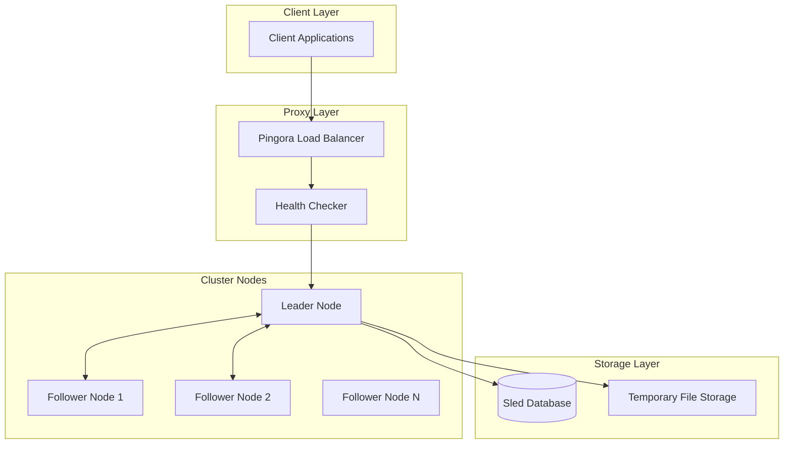

# Audio Cluster Service Design

## Overview

The Audio Cluster Service transforms the existing single-node voice-cli service into a distributed, fault-tolerant cluster using Raft consensus for leader election and task coordination. The system provides automatic failover, load distribution, and horizontal scaling for audio/video transcription workloads.

## System Architecture

### High-Level Architecture



### Technology Stack

- **Consensus Algorithm**: Raft using `raft-rs` library
- **gRPC Communication**: Tonic for inter-node communication  
- **Metadata Storage**: Sled embedded database
- **Load Balancer**: Pingora proxy
- **Audio Processing**: FFmpeg via `ffmpeg-sidecar`
- **Speech Recognition**: Whisper models via `voice-toolkit`

## Protocol Buffer Definitions

### Core gRPC Service

```protobuf
syntax = "proto3";

package audio_cluster;

service AudioClusterService {
    // Cluster management
    rpc JoinCluster(JoinRequest) returns (JoinResponse);
    rpc GetClusterStatus(ClusterStatusRequest) returns (ClusterStatusResponse);
    
    // Task management
    rpc SubmitTask(TaskSubmissionRequest) returns (TaskSubmissionResponse);
    rpc GetTaskStatus(TaskStatusRequest) returns (TaskStatusResponse);
    rpc GetTaskResult(TaskResultRequest) returns (TaskResultResponse);
    
    // Node communication
    rpc SendRaftMessage(RaftMessage) returns (RaftMessageResponse);
    rpc Heartbeat(HeartbeatRequest) returns (HeartbeatResponse);
}

message NodeInfo {
    string node_id = 1;
    string address = 2;
    uint32 grpc_port = 3;
    uint32 http_port = 4;
    NodeRole role = 5;
    NodeStatus status = 6;
    int64 last_heartbeat = 7;
}

enum NodeRole {
    LEADER = 0;
    FOLLOWER = 1;
    CANDIDATE = 2;
}

enum NodeStatus {
    HEALTHY = 0;
    UNHEALTHY = 1;
    JOINING = 2;
    LEAVING = 3;
}

message TaskSubmissionRequest {
    string task_id = 1;
    bytes audio_data = 2;
    string filename = 3;
    TaskOptions options = 4;
}

message TaskOptions {
    string model = 1;
    string language = 2;
    string response_format = 3;
    int32 priority = 4;
}

enum TaskState {
    PENDING = 0;
    ASSIGNED = 1;
    PROCESSING = 2;
    COMPLETED = 3;
    FAILED = 4;
}
```

## Data Models and Storage

### Metadata Storage Schema

```rust
#[derive(Serialize, Deserialize, Debug, Clone)]
pub struct ClusterNode {
    pub node_id: String,
    pub address: String,
    pub grpc_port: u16,
    pub http_port: u16,
    pub role: NodeRole,
    pub status: NodeStatus,
    pub last_heartbeat: i64,
    pub load_factor: f32,
}

#[derive(Serialize, Deserialize, Debug, Clone)]
pub struct TaskMetadata {
    pub task_id: String,
    pub client_id: String,
    pub filename: String,
    pub assigned_node: Option<String>,
    pub state: TaskState,
    pub created_at: i64,
    pub completed_at: Option<i64>,
    pub error_message: Option<String>,
}

pub struct MetadataStore {
    db: Arc<sled::Db>,
}

impl MetadataStore {
    pub async fn add_node(&self, node: &ClusterNode) -> Result<(), ClusterError>;
    pub async fn update_node_status(&self, node_id: &str, status: NodeStatus) -> Result<(), ClusterError>;
    pub async fn get_all_nodes(&self) -> Result<Vec<ClusterNode>, ClusterError>;
    pub async fn create_task(&self, task: &TaskMetadata) -> Result<(), ClusterError>;
    pub async fn assign_task(&self, task_id: &str, node_id: &str) -> Result<(), ClusterError>;
    pub async fn update_task_state(&self, task_id: &str, state: TaskState) -> Result<(), ClusterError>;
}
```

## Core Components Implementation

### Raft State Machine

```rust
use raft::{Config, RawNode};

pub struct AudioClusterStateMachine {
    node: RawNode<MemStorage>,
    metadata_store: Arc<MetadataStore>,
    node_id: String,
    peers: HashMap<String, String>,
}

impl AudioClusterStateMachine {
    pub async fn new(
        node_id: String,
        peers: Vec<(String, String)>,
        metadata_store: Arc<MetadataStore>,
    ) -> Result<Self, ClusterError> {
        let config = Config {
            id: node_id.parse()?,
            election_tick: 10,
            heartbeat_tick: 3,
            max_size_per_msg: 1024 * 1024,
            ..Default::default()
        };
        
        let storage = MemStorage::new();
        let node = RawNode::new(&config, storage, &[])?;
        
        Ok(Self {
            node,
            metadata_store,
            node_id,
            peers: peers.into_iter().collect(),
        })
    }
    
    pub async fn run(&mut self) {
        let mut ticker = tokio::time::interval(Duration::from_millis(100));
        
        loop {
            tokio::select! {
                _ = ticker.tick() => {
                    self.node.tick();
                    self.process_ready().await;
                }
            }
        }
    }
    
    async fn process_ready(&mut self) {
        if !self.node.has_ready() {
            return;
        }
        
        let ready = self.node.ready();
        
        // Send messages to other nodes
        for message in ready.messages {
            self.send_message_to_peer(message).await;
        }
        
        // Apply committed entries
        for entry in ready.committed_entries.unwrap_or_default() {
            self.apply_entry(entry).await;
        }
        
        self.node.advance(ready);
    }
}
```

### Task Scheduler (Leader Node)

```rust
pub struct TaskScheduler {
    metadata_store: Arc<MetadataStore>,
    node_clients: Arc<RwLock<HashMap<String, AudioClusterServiceClient<Channel>>>>,
    scheduling_algorithm: SchedulingAlgorithm,
}

#[derive(Clone)]
pub enum SchedulingAlgorithm {
    RoundRobin,
    LeastLoaded,
    Random,
}

impl TaskScheduler {
    pub async fn schedule_task(&self, task: TaskMetadata) -> Result<String, ClusterError> {
        // Get available healthy follower nodes
        let nodes = self.metadata_store.get_all_nodes().await?
            .into_iter()
            .filter(|node| node.status == NodeStatus::Healthy && node.role == NodeRole::Follower)
            .collect::<Vec<_>>();
            
        if nodes.is_empty() {
            return Err(ClusterError::NoAvailableNodes);
        }
        
        // Select node based on algorithm
        let selected_node = match self.scheduling_algorithm {
            SchedulingAlgorithm::RoundRobin => self.select_round_robin(&nodes).await,
            SchedulingAlgorithm::LeastLoaded => self.select_least_loaded(&nodes).await,
            SchedulingAlgorithm::Random => self.select_random(&nodes),
        }?;
        
        // Assign task to selected node
        self.assign_task_to_node(&task, &selected_node).await?;
        
        Ok(selected_node.node_id)
    }
    
    async fn assign_task_to_node(
        &self,
        task: &TaskMetadata,
        node: &ClusterNode,
    ) -> Result<(), ClusterError> {
        let clients = self.node_clients.read().await;
        let client = clients.get(&node.node_id)
            .ok_or(ClusterError::NodeNotConnected(node.node_id.clone()))?;
            
        let request = TaskAssignmentRequest {
            task_id: task.task_id.clone(),
            // Task data...
        };
        
        client.assign_task(request).await?;
        
        // Update metadata
        self.metadata_store
            .assign_task(&task.task_id, &node.node_id)
            .await?;
            
        Ok(())
    }
}
```

### Transcription Worker (Follower Node)

```rust
pub struct ClusterTranscriptionWorker {
    worker_id: String,
    config: Arc<Config>,
    model_service: Arc<ModelService>,
    audio_processor: Arc<AudioProcessor>,
    metadata_store: Arc<MetadataStore>,
}

impl ClusterTranscriptionWorker {
    pub async fn process_task(&self, task_request: TaskAssignmentRequest) -> Result<TranscriptionResult, ClusterError> {
        let task_id = &task_request.task_id;
        
        // Update task status to processing
        self.metadata_store
            .update_task_state(task_id, TaskState::Processing)
            .await?;
            
        tracing::info!("Worker {} starting task {}", self.worker_id, task_id);
        
        // Process audio data using existing voice-cli logic
        let audio_data = Bytes::from(task_request.audio_data);
        let processed_audio = self.audio_processor
            .process_audio_format(audio_data, &task_request.filename)
            .await?;
            
        // Perform transcription
        let transcription_result = self.perform_transcription(
            &processed_audio,
            &task_request.options.model,
        ).await?;
        
        // Update task status to completed
        self.metadata_store
            .update_task_state(task_id, TaskState::Completed)
            .await?;
            
        Ok(transcription_result)
    }
    
    async fn perform_transcription(
        &self,
        processed_audio: &ProcessedAudio,
        model: &Option<String>,
    ) -> Result<TranscriptionResult, ClusterError> {
        // Reuse existing voice-cli transcription logic
        let model_name = model.as_ref().unwrap_or(&self.config.whisper.default_model);
        let model_path = self.model_service.get_model_path(model_name)?;
        
        let result = voice_toolkit::stt::transcribe(
            &processed_audio.file_path,
            &model_path,
            &voice_toolkit::stt::TranscriptionOptions::default(),
        ).await?;
        
        Ok(TranscriptionResult {
            text: result.text,
            language: result.language,
            duration: Some(result.audio_duration as f32 / 1000.0),
            processing_time: result.processing_time as f32 / 1000.0,
        })
    }
}
```

## Load Balancer Integration

### Pingora Configuration

```rust
use pingora::prelude::*;

pub struct AudioClusterProxy {
    cluster_nodes: Arc<RwLock<Vec<ClusterNode>>>,
    health_checker: Arc<HealthChecker>,
}

#[async_trait]
impl ProxyHttp for AudioClusterProxy {
    type CTX = ();
    
    async fn upstream_peer(
        &self,
        _session: &mut Session,
        _ctx: &mut Self::CTX,
    ) -> Result<Box<dyn Peer + Send + Sync>, Box<Error>> {
        // Find healthy leader node
        let backend = self.select_leader_backend().await
            .ok_or_else(|| Error::explain(ErrorType::ConnectError, "No healthy leader available"))?;
            
        let peer = Peer::new(backend, false, "".to_string());
        Ok(Box::new(peer))
    }
    
    async fn select_leader_backend(&self) -> Option<SocketAddr> {
        let nodes = self.cluster_nodes.read().await;
        
        nodes.iter()
            .find(|node| node.role == NodeRole::Leader && node.status == NodeStatus::Healthy)
            .map(|node| format!("{}:{}", node.address, node.http_port).parse().ok())
            .flatten()
    }
}
```

### Health Checking

```rust
pub struct HealthChecker {
    client: reqwest::Client,
    check_interval: Duration,
}

impl HealthChecker {
    pub async fn run(&self, nodes: Arc<RwLock<Vec<ClusterNode>>>) {
        let mut interval = tokio::time::interval(self.check_interval);
        
        loop {
            interval.tick().await;
            
            let current_nodes = nodes.read().await.clone();
            let mut updated_nodes = Vec::new();
            
            for mut node in current_nodes {
                let is_healthy = self.check_node_health(&node).await;
                
                node.status = if is_healthy {
                    NodeStatus::Healthy
                } else {
                    NodeStatus::Unhealthy
                };
                
                updated_nodes.push(node);
            }
            
            *nodes.write().await = updated_nodes;
        }
    }
    
    async fn check_node_health(&self, node: &ClusterNode) -> bool {
        let health_url = format!("http://{}:{}/health", node.address, node.http_port);
        
        self.client.get(&health_url)
            .timeout(Duration::from_secs(5))
            .send()
            .await
            .map(|response| response.status().is_success())
            .unwrap_or(false)
    }
}
```

## API Endpoints

### HTTP API (Compatible with existing voice-cli)

```rust
// Maintain compatibility with existing voice-cli API
pub async fn transcribe_handler(
    State(state): State<ClusterHttpServer>,
    mut multipart: Multipart,
) -> Result<Json<HttpResult<TranscriptionResponse>>, StatusCode> {
    // Parse multipart form data (same as existing voice-cli)
    let (audio_data, filename, model, response_format) = parse_multipart(multipart).await?;
    
    // Create task
    let task_id = uuid::Uuid::new_v4().to_string();
    let task = TaskMetadata {
        task_id: task_id.clone(),
        client_id: "http_client".to_string(),
        filename,
        file_size: audio_data.len() as u64,
        state: TaskState::Pending,
        created_at: chrono::Utc::now().timestamp(),
        // ... other fields
    };
    
    // Submit to cluster leader for scheduling
    let assigned_node = state.task_scheduler.schedule_task(task).await
        .map_err(|_| StatusCode::INTERNAL_SERVER_ERROR)?;
    
    // Wait for task completion
    let result = state.coordinator.wait_for_task_completion(&task_id).await
        .map_err(|_| StatusCode::INTERNAL_SERVER_ERROR)?;
        
    Ok(Json(HttpResult::success(result)))
}

// Health check endpoint for load balancer
pub async fn cluster_health_handler(
    State(state): State<ClusterHttpServer>,
) -> Json<serde_json::Value> {
    let is_leader = state.coordinator.is_leader().await;
    let cluster_status = state.coordinator.get_cluster_status().await;
    
    Json(serde_json::json!({
        "status": "healthy",
        "role": if is_leader { "leader" } else { "follower" },
        "cluster_size": cluster_status.cluster_size,
        "node_id": state.coordinator.node_id()
    }))
}
```

## Deployment Configuration

### Cluster Configuration

```yaml
# cluster-config.yml
cluster:
  node_id: "node-1"
  grpc_port: 9090
  http_port: 8080
  data_dir: "./data"
  
raft:
  election_timeout_ms: 5000
  heartbeat_interval_ms: 1000
  
bootstrap:
  seeds: 
    - "node-1:9090"
    - "node-2:9090"
    - "node-3:9090"
    
scheduling:
  algorithm: "least_loaded"
  max_tasks_per_node: 10
  task_timeout_seconds: 3600
```

### Docker Compose

```yaml
version: '3.8'

services:
  pingora-lb:
    image: pingora:latest
    ports:
      - "80:80"
    depends_on:
      - audio-node-1
      - audio-node-2
      - audio-node-3
      
  audio-node-1:
    image: audio-cluster-service:latest
    environment:
      - NODE_ID=node-1
      - GRPC_PORT=9090
      - HTTP_PORT=8080
      - BOOTSTRAP_SEEDS=node-1:9090,node-2:9090,node-3:9090
    volumes:
      - ./data/node-1:/app/data
      - ./models:/app/models
    ports:
      - "8081:8080"
      - "9091:9090"
      
  audio-node-2:
    image: audio-cluster-service:latest
    environment:
      - NODE_ID=node-2
    # ... similar configuration
      
  audio-node-3:
    image: audio-cluster-service:latest
    environment:
      - NODE_ID=node-3"
    # ... similar configuration
```

## Migration Strategy

### Phase 1: Cluster Foundation
1. Extract core transcription logic from voice-cli
2. Implement gRPC protocol definitions
3. Add Raft consensus with raft-rs
4. Implement Sled metadata storage
5. Basic cluster formation and leader election

### Phase 2: Task Distribution
1. Implement task scheduling algorithms
2. Add worker pool integration
3. Create cluster-aware HTTP API
4. Implement fault tolerance and recovery

### Phase 3: Load Balancer Integration
1. Integrate Pingora proxy
2. Add health checking mechanisms
3. Implement automatic failover
4. Performance optimization and monitoring

### Phase 4: Production Features
1. Add metrics and monitoring
2. Implement cluster scaling
3. Add security and authentication
4. Performance tuning and optimization

## Testing Strategy

### Unit Testing
- Task scheduling algorithms
- Raft state machine operations
- Metadata storage operations
- Audio processing pipeline

### Integration Testing
- Multi-node cluster setup
- Leader failover scenarios  
- Task distribution testing
- Load balancer integration
- Network partition simulation

### Performance Testing
- Concurrent transcription load
- Cluster scaling behavior
- Failover recovery time
- Memory and CPU usage patterns