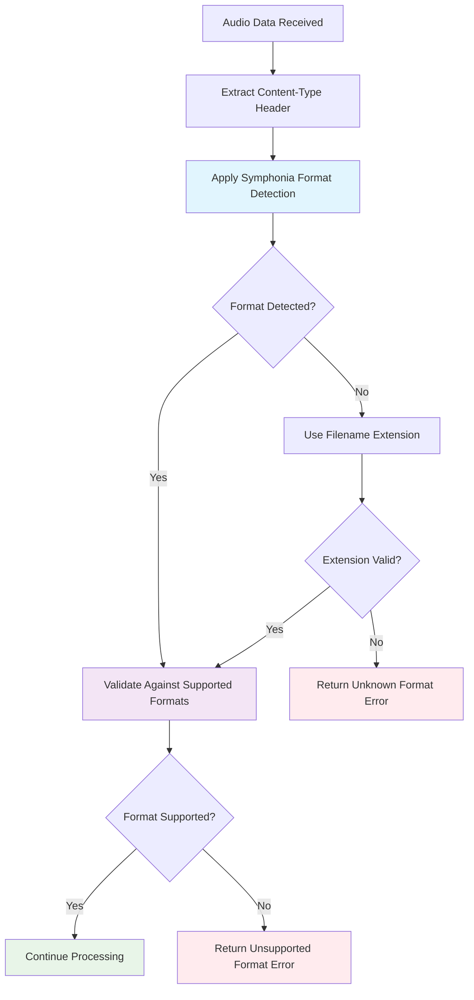
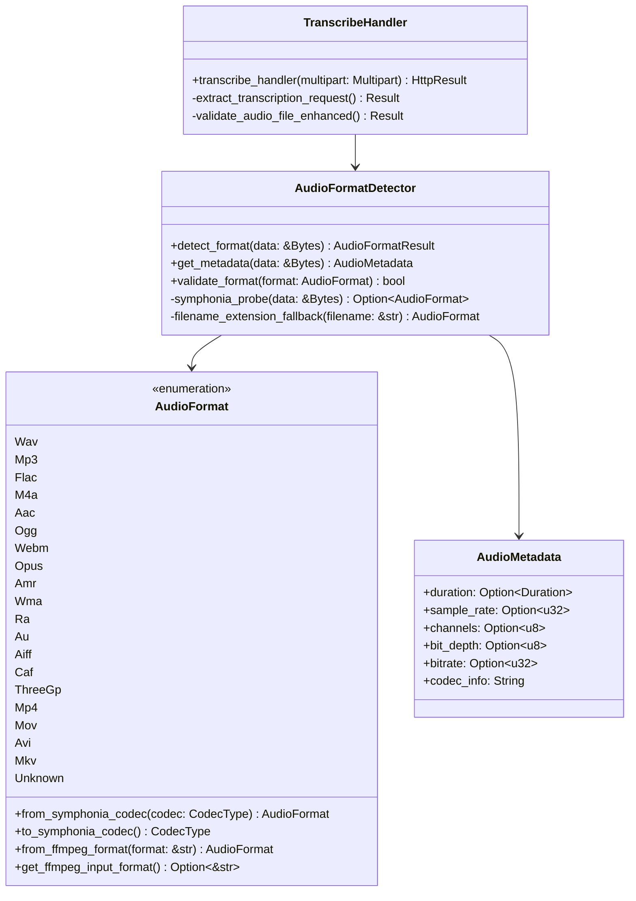
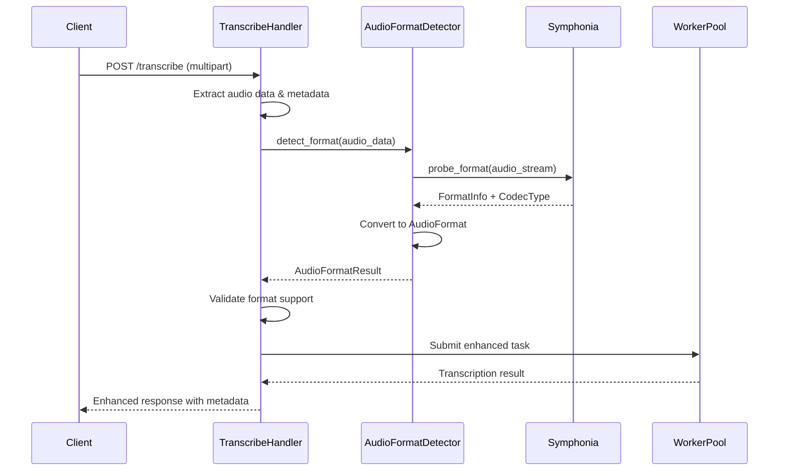
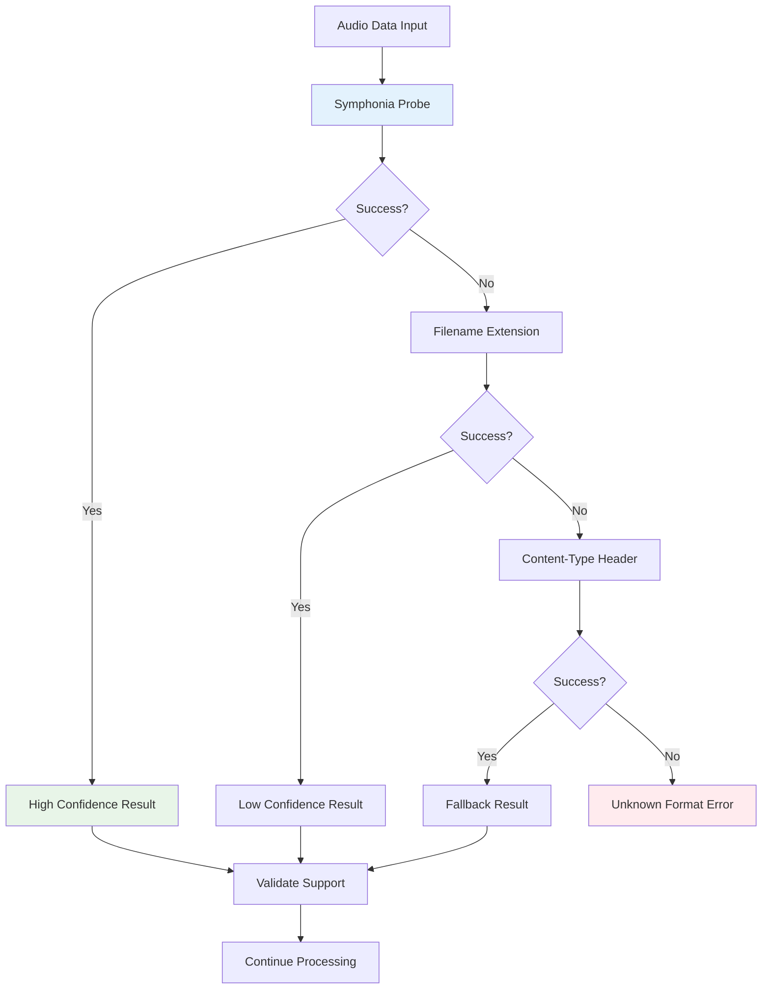

# Audio Format Detector for Voice CLI Service

## Overview

This design introduces intelligent audio format detection using the Symphonia audio codec library for the voice-cli service's `/transcribe` endpoint. The current implementation relies on filename extensions and manual magic byte detection, which can be unreliable when processing audio data from H5 pages or web applications where format information may be missing or incorrect. This enhancement removes the magic byte detection approach and uses Symphonia as the primary detection method with filename extension as the only fallback.

The Symphonia library provides comprehensive audio format detection and metadata extraction capabilities, supporting a wide range of formats including MP3, WAV, FLAC, OGG, AAC, M4A, and WebM. This enhancement will improve the robustness and accuracy of audio format detection in the transcription pipeline.

Additionally, since the service uses FFmpeg for audio conversion to WAV format for Whisper processing, we can support many more common audio and video formats that FFmpeg can handle, including AMR, WMA, RealAudio, AU, AIFF, CAF, 3GP, MP4, MOV, AVI, and MKV formats.

## Technology Stack & Dependencies

### New Dependency
- **symphonia**: A pure-Rust audio codec library with format detection capabilities
- **symphonia-core**: Core types and traits for Symphonia
- **symphonia-format-***: Format-specific decoders (MP3, WAV, FLAC, etc.)

### Dependency Configuration
```toml
# Add to voice-cli/Cargo.toml
symphonia = { version = "0.5", features = ["all"] }
# Or selective features for smaller binary size:
# symphonia = { version = "0.5", features = ["mp3", "wav", "flac", "ogg", "aac"] }
```

## Supported Audio Formats

### Core Audio Formats
These formats are commonly supported by both Symphonia and FFmpeg:

| Format | Extension | MIME Type | FFmpeg Format | Description |
|--------|-----------|-----------|---------------|--------------|
| WAV | .wav | audio/wav | wav | Uncompressed audio (target format) |
| MP3 | .mp3 | audio/mpeg | mp3 | Most common compressed audio |
| FLAC | .flac | audio/flac | flac | Lossless compression |
| AAC | .aac | audio/aac | aac | Advanced Audio Coding |
| M4A | .m4a | audio/mp4 | m4a | Apple's AAC container |
| OGG | .ogg | audio/ogg | ogg | Ogg Vorbis |
| WebM | .webm | audio/webm | webm | Web audio format |
| Opus | .opus | audio/opus | opus | Modern low-latency codec |

### Extended Audio Formats (FFmpeg Support)
These additional formats are supported through FFmpeg conversion:

| Format | Extension | MIME Type | FFmpeg Format | Description |
|--------|-----------|-----------|---------------|--------------|
| AMR | .amr | audio/amr | amr | Adaptive Multi-Rate (mobile) |
| WMA | .wma | audio/x-ms-wma | asf | Windows Media Audio |
| RealAudio | .ra, .ram | audio/vnd.rn-realaudio | rm | RealMedia audio |
| AU | .au, .snd | audio/basic | au | Sun/Unix audio |
| AIFF | .aiff, .aif | audio/aiff | aiff | Apple's uncompressed format |
| CAF | .caf | audio/x-caf | caf | Core Audio Format |

### Video Formats (Audio Extraction)
These video formats can have their audio extracted by FFmpeg:

| Format | Extension | MIME Type | FFmpeg Format | Description |
|--------|-----------|-----------|---------------|--------------|
| 3GP | .3gp, .3g2 | audio/3gpp | 3gp | Mobile video format |
| MP4 | .mp4 | video/mp4 | mp4 | MPEG-4 container |
| MOV | .mov | video/quicktime | mov | QuickTime format |
| AVI | .avi | video/x-msvideo | avi | Audio Video Interleave |
| MKV | .mkv, .mka | video/x-matroska | matroska | Matroska container |

### Format Detection Priority
1. **Symphonia Probe**: Primary detection for audio formats
2. **Filename Extension**: Fallback for unsupported or corrupted files
3. **Content-Type Header**: Last resort from HTTP headers

## Architecture

### Enhanced Audio Format Detection Flow



### Component Integration



## Enhanced Audio Processing Pipeline

### Audio Format Detection Service

```rust
// New module: src/services/audio_format_detector.rs
pub struct AudioFormatDetector;

impl AudioFormatDetector {
    pub fn detect_format(data: &Bytes, filename: Option<&str>) -> AudioFormatResult {
        // 1. Primary: Symphonia-based detection
        // 2. Fallback: Filename extension only if Symphonia fails
        // 3. Enhanced metadata extraction
    }
    
    pub fn get_detailed_metadata(data: &Bytes) -> Result<AudioMetadata> {
        // Extract comprehensive audio metadata using Symphonia
    }
}

// Enhanced result structure
pub struct AudioFormatResult {
    pub format: AudioFormat,
    pub confidence: f32,
    pub metadata: Option<AudioMetadata>,
    pub detection_method: DetectionMethod,
}

pub enum DetectionMethod {
    SymphoniaProbe,
    FileExtension,
    ContentType,
}
```

### Integration Points

#### 1. Handler Enhancement
The transcribe handler will be enhanced to use the new audio format detection:

```rust
// Enhanced validation in handlers.rs
async fn validate_audio_file_enhanced(
    audio_data: &Bytes,
    filename: &str,
    content_type: Option<&str>,
    max_file_size: usize,
) -> Result<AudioFormatResult, VoiceCliError> {
    // File size validation (existing)
    if audio_data.len() > max_file_size {
        return Err(VoiceCliError::FileTooLarge {
            size: audio_data.len(),
            max: max_file_size,
        });
    }

    // Enhanced format detection with Symphonia
    let format_result = AudioFormatDetector::detect_format(audio_data, Some(filename))?;
    
    // Validation against supported formats
    if !format_result.format.is_supported() {
        return Err(VoiceCliError::UnsupportedFormat(
            format!("Detected format {} is not supported", format_result.format.to_string())
        ));
    }

    Ok(format_result)
}
```

#### 2. AudioFormat Enum Extension
```rust
impl AudioFormat {
    pub fn from_symphonia_codec(codec_type: CodecType) -> Self {
        match codec_type {
            CodecType::Mp3 => AudioFormat::Mp3,
            CodecType::Wav => AudioFormat::Wav,
            CodecType::Flac => AudioFormat::Flac,
            CodecType::Aac => AudioFormat::Aac,
            CodecType::Vorbis => AudioFormat::Ogg,
            CodecType::Opus => AudioFormat::Opus,
            _ => AudioFormat::Unknown,
        }
    }
    
    pub fn from_filename_extended(filename: &str) -> Self {
        let extension = std::path::Path::new(filename)
            .extension()
            .and_then(|ext| ext.to_str())
            .unwrap_or("")
            .to_lowercase();

        match extension.as_str() {
            // Common audio formats
            "wav" => AudioFormat::Wav,
            "mp3" => AudioFormat::Mp3,
            "flac" => AudioFormat::Flac,
            "m4a" => AudioFormat::M4a,
            "aac" => AudioFormat::Aac,
            "ogg" => AudioFormat::Ogg,
            "webm" => AudioFormat::Webm,
            "opus" => AudioFormat::Opus,
            
            // Additional audio formats supported by FFmpeg
            "amr" => AudioFormat::Amr,
            "wma" => AudioFormat::Wma,
            "ra" | "ram" => AudioFormat::Ra,
            "au" | "snd" => AudioFormat::Au,
            "aiff" | "aif" => AudioFormat::Aiff,
            "caf" => AudioFormat::Caf,
            
            // Video formats with audio (FFmpeg can extract audio)
            "3gp" | "3g2" => AudioFormat::ThreeGp,
            "mp4" => AudioFormat::Mp4,
            "mov" => AudioFormat::Mov,
            "avi" => AudioFormat::Avi,
            "mkv" | "mka" => AudioFormat::Mkv,
            
            _ => AudioFormat::Unknown,
        }
    }
    
    pub fn get_mime_type(&self) -> &'static str {
        match self {
            AudioFormat::Mp3 => "audio/mpeg",
            AudioFormat::Wav => "audio/wav",
            AudioFormat::Flac => "audio/flac",
            AudioFormat::Aac => "audio/aac",
            AudioFormat::Ogg => "audio/ogg",
            AudioFormat::M4a => "audio/mp4",
            AudioFormat::Webm => "audio/webm",
            AudioFormat::Opus => "audio/opus",
            AudioFormat::Amr => "audio/amr",
            AudioFormat::Wma => "audio/x-ms-wma",
            AudioFormat::Ra => "audio/vnd.rn-realaudio",
            AudioFormat::Au => "audio/basic",
            AudioFormat::Aiff => "audio/aiff",
            AudioFormat::Caf => "audio/x-caf",
            AudioFormat::ThreeGp => "audio/3gpp",
            AudioFormat::Mp4 => "video/mp4",
            AudioFormat::Mov => "video/quicktime",
            AudioFormat::Avi => "video/x-msvideo",
            AudioFormat::Mkv => "video/x-matroska",
            AudioFormat::Unknown => "application/octet-stream",
        }
    }
    
    pub fn get_ffmpeg_input_format(&self) -> Option<&'static str> {
        match self {
            AudioFormat::Mp3 => Some("mp3"),
            AudioFormat::Wav => Some("wav"),
            AudioFormat::Flac => Some("flac"),
            AudioFormat::Aac => Some("aac"),
            AudioFormat::M4a => Some("m4a"),
            AudioFormat::Ogg => Some("ogg"),
            AudioFormat::Webm => Some("webm"),
            AudioFormat::Opus => Some("opus"),
            AudioFormat::Amr => Some("amr"),
            AudioFormat::Wma => Some("asf"),
            AudioFormat::Ra => Some("rm"),
            AudioFormat::Au => Some("au"),
            AudioFormat::Aiff => Some("aiff"),
            AudioFormat::Caf => Some("caf"),
            AudioFormat::ThreeGp => Some("3gp"),
            AudioFormat::Mp4 => Some("mp4"),
            AudioFormat::Mov => Some("mov"),
            AudioFormat::Avi => Some("avi"),
            AudioFormat::Mkv => Some("matroska"),
            AudioFormat::Unknown => None,
        }
    }
    
    pub fn requires_ffmpeg_conversion(&self) -> bool {
        !matches!(self, AudioFormat::Wav)
    }
}
```

## API Enhancement

### Request Processing Flow



### Enhanced Response Schema

```json
{
  "text": "transcribed text content",
  "segments": [
    {
      "start": 0.0,
      "end": 2.5,
      "text": "segment text",
      "confidence": 0.95
    }
  ],
  "language": "en",
  "duration": 2.5,
  "processing_time": 0.8,
  "audio_metadata": {
    "format": "mp3",
    "original_format": "wma",
    "sample_rate": 44100,
    "channels": 2,
    "bit_depth": 16,
    "bitrate": 128000,
    "detection_method": "symphonia_probe",
    "detection_confidence": 0.98,
    "conversion_required": true,
    "ffmpeg_format": "asf"
  }
}
```

## Implementation Strategy

### Phase 1: Core Integration
1. Add Symphonia dependency to Cargo.toml
2. Create AudioFormatDetector service
3. Implement basic format detection using Symphonia probing
4. Update AudioFormat enum with Symphonia integration
5. Enhance transcribe handler validation

### Phase 2: Metadata Enhancement
1. Implement comprehensive metadata extraction
2. Add audio metadata to API responses
3. Enhanced error reporting with format details
4. Add detection confidence scoring

### Phase 3: Optimization & Fallback
1. Implement intelligent fallback mechanism
2. Add caching for format detection results
3. Performance optimization for large files
4. Comprehensive error handling and logging

### File Structure
```
voice-cli/src/
├── services/
│   ├── mod.rs                          # Updated exports
│   ├── audio_format_detector.rs        # New: Symphonia integration
│   ├── transcription_service.rs        # Updated: Enhanced validation
│   └── ...
├── models/
│   ├── request.rs                      # Enhanced: Extended AudioFormat enum
│   ├── audio_metadata.rs               # New: Audio metadata structures
│   └── ...
├── server/
│   ├── handlers.rs                     # Updated: Enhanced validation with extended formats
│   └── ...
└── ...
```

### Configuration Updates
```yaml
# config.yml enhancement
audio:
  format_detection:
    use_symphonia: true
    fallback_to_filename_extension: true
    cache_detection_results: true
    max_probe_bytes: 1048576  # 1MB
    confidence_threshold: 0.7
  
  supported_formats:
    # Core audio formats
    audio: ["wav", "mp3", "flac", "aac", "m4a", "ogg", "webm", "opus"]
    # Extended formats (FFmpeg required)
    extended: ["amr", "wma", "ra", "au", "aiff", "caf"]
    # Video formats (audio extraction)
    video: ["3gp", "mp4", "mov", "avi", "mkv"]
    
  ffmpeg:
    enabled: true
    conversion_timeout: 30  # seconds
    temp_dir: "/tmp/voice-cli-conversion"
```

## Error Handling & Fallback Strategy

### Simplified Detection Approach



### Error Categories
```rust
#[derive(Debug, thiserror::Error)]
pub enum AudioFormatError {
    #[error("Symphonia probe failed: {0}")]
    SymphoniaError(String),
    
    #[error("No supported decoder found for format")]
    UnsupportedCodec,
    
    #[error("Audio stream is corrupted or incomplete")]
    CorruptedData,
    
    #[error("Format detection confidence too low: {confidence}")]
    LowConfidence { confidence: f32 },
    
    #[error("All detection methods failed")]
    DetectionFailed,
}
```

## Testing Strategy

### Unit Tests
```rust
#[cfg(test)]
mod tests {
    use super::*;
    use bytes::Bytes;

    #[test]
    fn test_symphonia_mp3_detection() {
        let mp3_data = include_bytes!("../../fixtures/sample.mp3");
        let result = AudioFormatDetector::detect_format(&Bytes::from(mp3_data.as_slice()), Some("sample.mp3"));
        assert!(matches!(result.format, AudioFormat::Mp3));
        assert!(result.confidence > 0.9);
    }
    
    #[test]
    fn test_extended_format_support() {
        // Test additional formats supported by FFmpeg
        assert!(matches!(AudioFormat::from_filename_extended("audio.wma"), AudioFormat::Wma));
        assert!(matches!(AudioFormat::from_filename_extended("audio.amr"), AudioFormat::Amr));
        assert!(matches!(AudioFormat::from_filename_extended("video.mp4"), AudioFormat::Mp4));
        assert!(matches!(AudioFormat::from_filename_extended("audio.aiff"), AudioFormat::Aiff));
        assert!(matches!(AudioFormat::from_filename_extended("audio.opus"), AudioFormat::Opus));
    }
    
    #[test]
    fn test_ffmpeg_conversion_requirements() {
        assert!(!AudioFormat::Wav.requires_ffmpeg_conversion());
        assert!(AudioFormat::Mp3.requires_ffmpeg_conversion());
        assert!(AudioFormat::Wma.requires_ffmpeg_conversion());
        assert!(AudioFormat::Mp4.requires_ffmpeg_conversion());
    }

    #[test]
    fn test_fallback_to_filename_extension() {
        // Test with corrupted Symphonia probe but valid filename extension
    }

    #[test]
    fn test_metadata_extraction() {
        // Test comprehensive metadata extraction
    }
}
```

### Integration Tests
- Test with real H5 audio recordings
- Test with various web browser audio formats
- Test fallback mechanisms
- Performance benchmarks for large files

## Performance Considerations

### Optimization Strategies
1. **Lazy Loading**: Only probe necessary bytes for format detection
2. **Caching**: Cache detection results for identical file hashes
3. **Streaming**: Process large files in chunks
4. **Selective Features**: Use only required Symphonia codec features

### Memory Management
```rust
// Efficient byte stream handling
pub fn detect_format_streaming(
    reader: impl std::io::Read + std::io::Seek
) -> Result<AudioFormatResult> {
    // Use Symphonia's streaming probe capabilities
    // Limit memory usage for large files
}
```

## Migration & Compatibility

### Backward Compatibility
- Filename extension detection remains as fallback
- Current API endpoints unchanged
- Optional metadata in responses (non-breaking)
- Graceful degradation if Symphonia fails

### Configuration Options
```yaml
# config.yml enhancement
audio:
  format_detection:
    use_symphonia: true
    fallback_to_filename_extension: true
    cache_detection_results: true
    max_probe_bytes: 1048576  # 1MB
    confidence_threshold: 0.7
```
