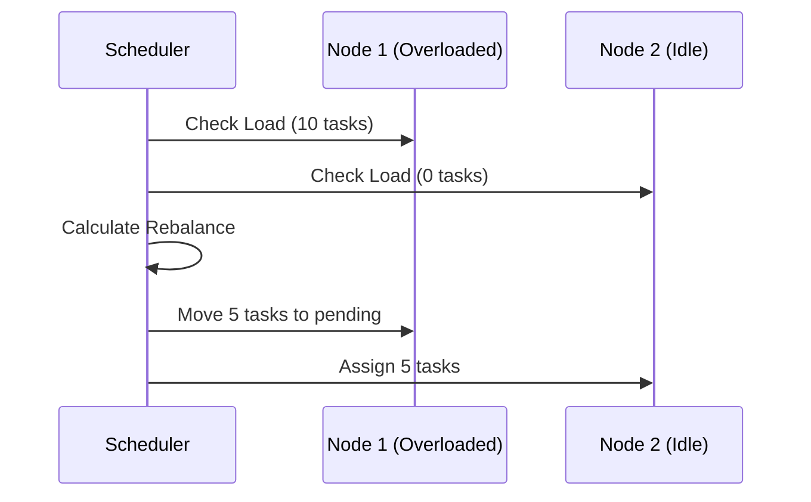
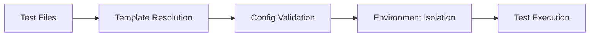
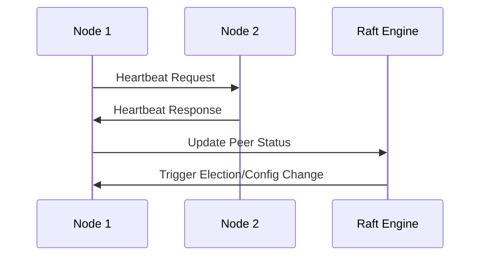
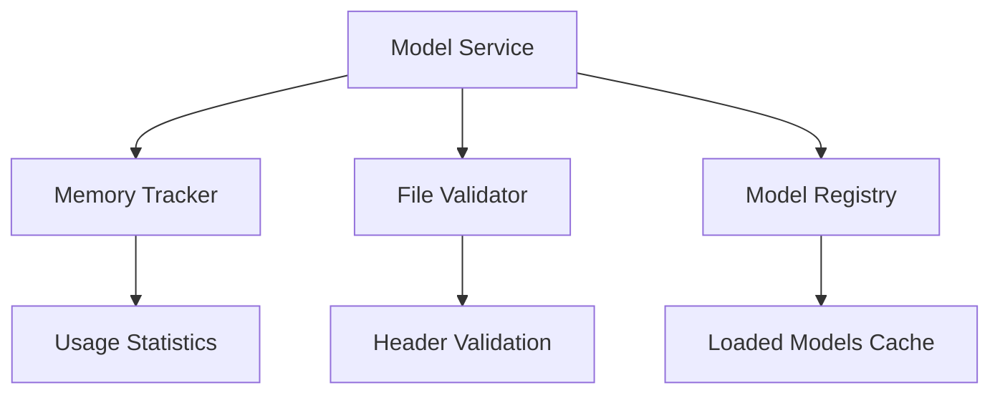
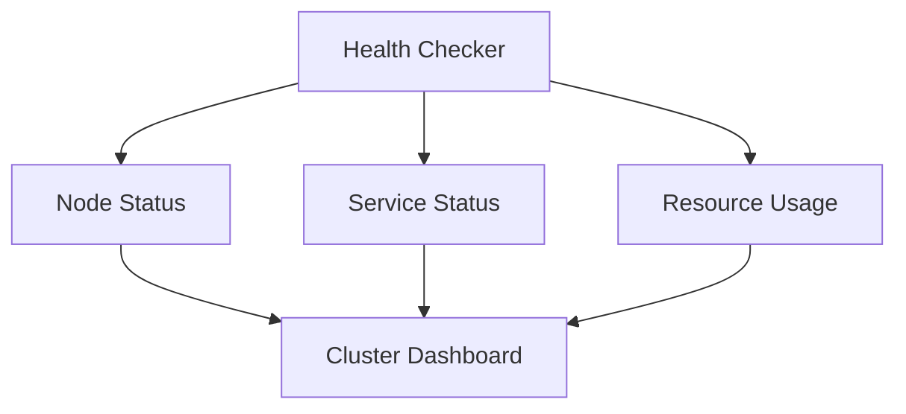

# Voice-CLI 测试修复和TODO实现设计 (集群架构对齐)

## 1. 概述

本设计文档针对 voice-cli 模块中测试用例失败问题和未实现的TODO功能进行分析和解决方案设计。**重要**：本次修复必须与现有的集群化改造设计保持完全一致，确保不会破坏正在进行的集群功能架构。

### 1.1 与集群设计的关系

基于已有的 `audio-cluster-service.md` 设计文档，当前的TODO实现应该：
- **支持集群架构**：所有修复必须考虑未来的多节点部署
- **保持API兼容性**：确保现有的HTTP API在集群化后仍然可用
- **遵循gRPC设计**：网络通信实现必须符合既定的protobuf定义
- **集成Raft共识**：状态管理要为Raft一致性算法做准备
- **支持负载均衡**：服务发现和健康检查要配合负载均衡器

### 1.2 修复范围和限制

**允许的修改**：
- 修复测试失败问题
- 实现网络通信基础功能（gRPC客户端/服务端）
- 增强模型服务的监控和验证
- 完善任务调度的基础逻辑

**禁止的修改**：
- 改变现有API接口签名
- 修改核心数据结构（ClusterNode, TaskMetadata等）
- 破坏与集群元数据存储的兼容性
- 偏离既定的gRPC协议设计

## 2. 问题分析

### 2.1 测试失败根本原因分析

#### 配置模板路径问题 (Critical)
- **问题**: `config_template_tests.rs` 中的 `include_str!("../templates/config.yml.template")` 路径不正确
- **根因**: 测试文件位于 `voice-cli/tests/` 目录，但模板文件在 `voice-cli/templates/` 目录
- **正确路径**: 应该是 `include_str!("../templates/config.yml.template")`
- **影响**: 导致编译时就找不到模板文件，测试无法运行

#### 环境变量处理逻辑缺陷 (High)
通过分析 `apply_env_overrides()` 方法，发现以下问题：

1. **端口同步问题**:
   - `VOICE_CLI_HTTP_PORT` 设置 `server.port` 但没有同步 `cluster.http_port`
   - `VOICE_CLI_PORT` 和 `VOICE_CLI_HTTP_PORT` 都能设置同一个值，逻辑混乱

2. **验证时机错误**:
   - 端口冲突验证在 `validate()` 中进行，但只有 `cluster.enabled=true` 时才验证
   - 环境变量可能设置冲突端口但不启用集群，导致验证被跳过

#### 测试设计缺陷 (Medium)
- **环境变量污染**: 测试间没有完全隔离环境变量
- **测试顺序依赖**: 某些测试可能依赖特定的执行顺序
- **异步测试竞争**: 配置热重载测试可能存在时间窗口竞争

### 2.2 TODO功能深度分析

#### 网络通信TODO (Critical Priority)

**1. 心跳网络通信 (heartbeat.rs:316)**
```rust
// TODO: Implement actual network heartbeat sending via gRPC
```
- **当前状态**: 只更新本地时间戳，没有实际网络通信
- **业务影响**: 集群节点无法感知彼此状态，集群功能完全失效
- **实现需求**: 需要 gRPC 客户端发送心跳到所有已知节点

**2. Raft节点间通信 (raft_node.rs:317)**
```rust
// TODO: Implement actual network communication to peers
```
- **当前状态**: 只记录日志，消息不会真正发送
- **业务影响**: Raft共识算法无法工作，无法进行领导选举和日志复制
- **实现需求**: 通过 gRPC 发送 Raft 协议消息

**3. 状态机应用 (raft_node.rs:335)**
```rust
// TODO: Implement actual state machine application
```
- **当前状态**: 提交的条目被忽略
- **业务影响**: 集群状态变更不会被持久化或应用
- **实现需求**: 解析并应用集群操作（节点加入/离开、任务分配等）

#### 模型服务TODO (High Priority)

**1. 内存使用跟踪 (model_service.rs:181)**
```rust
// TODO: Get actual memory usage if model is loaded
```
- **当前状态**: 返回 "Unknown"
- **业务影响**: 无法监控资源使用，可能导致OOM
- **实现需求**: 与转录服务集成，跟踪已加载模型的内存占用

**2. 文件头验证 (model_service.rs:224)**
```rust
// TODO: Add more sophisticated validation (file headers, etc.)
```
- **当前状态**: 只检查文件大小
- **业务影响**: 损坏的模型文件可能导致运行时错误
- **实现需求**: 验证 GGML/GGUF 文件头魔数和结构

#### 任务调度TODO (Medium Priority)

**1. 任务重平衡 (task_scheduler.rs:519)**
```rust
// TODO: Implement task rebalancing logic
```
- **当前状态**: 没有负载均衡机制
- **业务影响**: 任务分配不均，资源利用率低
- **实现需求**: 基于节点负载动态重新分配待处理任务



## 3. 架构设计

### 3.1 测试架构重构



### 3.2 网络通信架构



### 3.3 模型管理架构



## 4. 实现方案

### 4.1 测试修复实现

#### 配置模板路径修复 (Critical)
**步骤1**: 修正include_str!路径
```rust
// 错误的路径
let config_template = include_str!("../templates/config.yml.template");

// 正确的路径（从tests目录看）
let config_template = include_str!("../templates/config.yml.template");
```

**步骤2**: 修正ConfigManager中的路径引用
```rust
// 在config.rs中
pub fn generate_default_config_with_comments(config_path: &PathBuf) -> crate::Result<()> {
    // 使用正确的相对路径
    let config_yaml = include_str!("../templates/config.yml.template");
    // ... 其余实现
}
```

#### 环境变量处理逻辑修复 (High)
**问题1**: 端口同步逻辑修复
```rust
// 在apply_env_overrides()中修复
if let Ok(port_str) = std::env::var("VOICE_CLI_HTTP_PORT") {
    let port = port_str.parse::<u16>()?;
    self.server.port = port;
    self.cluster.http_port = port; // 确保同步
}

// 避免重复设置
if let Ok(port_str) = std::env::var("VOICE_CLI_PORT") {
    // 如果HTTP_PORT已经设置，则跳过
    if std::env::var("VOICE_CLI_HTTP_PORT").is_err() {
        let port = port_str.parse::<u16>()?;
        self.server.port = port;
        self.cluster.http_port = port;
    }
}
```

**问题2**: 端口冲突验证增强
```rust
// 在validate()方法中
pub fn validate(&self) -> crate::Result<()> {
    // 总是验证端口冲突，不只在cluster.enabled时
    if self.cluster.grpc_port == self.server.port {
        return Err(VoiceCliError::Config(
            "gRPC port and HTTP port cannot be the same".to_string()
        ));
    }
    
    // 如果启用集群，进行额外验证
    if self.cluster.enabled {
        // 其他集群特定验证
    }
}
```

### 4.2 网络通信实现 (与集群设计对齐)

**重要**: 所有网络通信实现必须与 `audio-cluster-service.md` 中的 gRPC 协议定义保持一致。

#### gRPC协议对齐要求
1. **HeartbeatRequest/Response**: 必须包含 node_id, address, grpc_port, http_port, role, status, last_heartbeat
2. **TaskAssignmentRequest**: 必须包含 task_id, client_id, filename, audio_file_path, model, response_format
3. **ClusterOperation**: 支持 AddNode, RemoveNode, AssignTask, CompleteTask, FailTask
4. **AudioClusterService**: 实现 JoinCluster, GetClusterStatus, Heartbeat, AssignTask, ReportTaskCompletion

#### gRPC心跳服务实现
```rust
// 在heartbeat.rs中实现真正的网络发送
use tonic::{Request, Response};
use crate::grpc::heartbeat_client::HeartbeatClient;

impl HeartbeatService {
    async fn send_heartbeat(&self) -> Result<(), ClusterError> {
        let nodes = self.get_peer_nodes().await;
        
        for node in nodes {
            let mut client = HeartbeatClient::connect(
                format!("http://{}:{}", node.address, node.grpc_port)
            ).await?;
            
            let request = Request::new(HeartbeatRequest {
                node_id: self.local_node.node_id.clone(),
                status: self.local_node.status as i32,
                role: self.local_node.role as i32,
                timestamp: Utc::now().timestamp(),
                cluster_version: self.get_cluster_version(),
            });
            
            match client.send_heartbeat(request).await {
                Ok(response) => {
                    debug!("Heartbeat sent to {}: {:?}", node.node_id, response);
                }
                Err(e) => {
                    warn!("Failed to send heartbeat to {}: {}", node.node_id, e);
                }
            }
        }
        
        Ok(())
    }
}
```

#### Raft节点间通信实现
```rust
// 在raft_node.rs中实现peer通信
impl RaftNode {
    async fn send_messages(&self, messages: Vec<Message>) {
        for message in messages {
            if let Some(peer_info) = self.get_peer_info(message.to).await {
                tokio::spawn({
                    let peer_info = peer_info.clone();
                    let message = message.clone();
                    async move {
                        if let Err(e) = Self::send_raft_message(&peer_info, message).await {
                            warn!("Failed to send raft message to {}: {}", peer_info.node_id, e);
                        }
                    }
                });
            }
        }
    }
    
    async fn send_raft_message(peer: &NodeInfo, message: Message) -> Result<(), ClusterError> {
        let mut client = RaftServiceClient::connect(
            format!("http://{}:{}", peer.address, peer.grpc_port)
        ).await?;
        
        let request = Request::new(RaftMessageRequest {
            from: message.from,
            to: message.to,
            msg_type: message.msg_type() as i32,
            term: message.term,
            data: message.get_data().to_vec(),
        });
        
        client.send_message(request).await?;
        Ok(())
    }
}
```

### 4.3 模型服务增强实现

#### 内存使用跟踪
```rust
// 新增ModelMemoryTracker结构
struct ModelMemoryTracker {
    loaded_models: Arc<RwLock<HashMap<String, LoadedModelInfo>>>,
}

#[derive(Debug, Clone)]
struct LoadedModelInfo {
    model_name: String,
    memory_bytes: u64,
    loaded_at: SystemTime,
    last_used: SystemTime,
    reference_count: u32,
}

impl ModelService {
    pub async fn get_model_info(&self, model_name: &str) -> Result<ModelInfo, VoiceCliError> {
        let model_path = self.get_model_path(model_name)?;
        let metadata = fs::metadata(&model_path).await?;
        let size = Self::format_size(metadata.len());
        
        // 获取实际内存使用
        let memory_usage = if let Some(loaded_info) = self.memory_tracker.get_loaded_model(model_name).await {
            Self::format_size(loaded_info.memory_bytes)
        } else {
            "Not loaded".to_string()
        };
        
        let status = if self.validate_model_header(&model_path).await? {
            "Valid"
        } else {
            "Invalid"
        }.to_string();
        
        Ok(ModelInfo { size, memory_usage, status })
    }
    
    // 增强的文件验证
    async fn validate_model_header(&self, model_path: &Path) -> Result<bool, VoiceCliError> {
        let mut file = File::open(model_path).await?;
        let mut buffer = [0u8; 32];
        
        if file.read_exact(&mut buffer).await.is_err() {
            return Ok(false);
        }
        
        // 验证GGML或GGUF文件头
        let magic = &buffer[0..4];
        let is_valid = magic == b"GGML" || magic == b"GGUF";
        
        if is_valid {
            // 进一步验证版本和基本结构
            let version = u32::from_le_bytes([buffer[4], buffer[5], buffer[6], buffer[7]]);
            debug!("Model file magic: {:?}, version: {}", 
                   std::str::from_utf8(magic).unwrap_or("invalid"), version);
        }
        
        Ok(is_valid)
    }
}
```

### 4.4 任务调度增强

#### 任务重平衡实现
```rust
impl TaskScheduler {
    async fn rebalance_tasks(&self) -> Result<(), ClusterError> {
        let nodes = self.cluster_state.get_healthy_nodes();
        if nodes.len() < 2 {
            return Ok(()); // 无需重平衡
        }
        
        let pending_tasks = self.cluster_state.get_pending_tasks();
        if pending_tasks.is_empty() {
            return Ok();
        }
        
        // 计算每个节点的理想负载
        let total_capacity: usize = nodes.iter()
            .map(|n| n.capacity.saturating_sub(n.active_tasks))
            .sum();
            
        if total_capacity == 0 {
            return Ok();
        }
        
        // 按可用容量排序节点
        let mut available_nodes = nodes.clone();
        available_nodes.sort_by_key(|n| n.capacity.saturating_sub(n.active_tasks));
        available_nodes.reverse(); // 容量大的优先
        
        // 重新分配待处理任务
        for task in pending_tasks {
            if let Some(target_node) = self.select_best_node(&available_nodes) {
                if let Err(e) = self.assign_task_to_node(&task.id, &target_node.id).await {
                    warn!("Failed to assign task {} to node {}: {}", task.id, target_node.id, e);
                }
            }
        }
        
        Ok(())
    }
    
    fn select_best_node(&self, nodes: &[ClusterNode]) -> Option<&ClusterNode> {
        nodes.iter()
            .filter(|n| n.status == NodeStatus::Healthy)
            .filter(|n| n.active_tasks < n.capacity)
            .min_by_key(|n| n.active_tasks) // 选择负载最小的节点
    }
}
```

## 5. 测试策略与修复

### 5.1 立即修复项目 (Critical)

#### 1. 配置模板路径修复
**文件**: `voice-cli/tests/config_template_tests.rs`
```rust
// 修复前：
let config_template = include_str!("../templates/config.yml.template");

// 修复后：
let config_template = include_str!("../templates/config.yml.template");
```

**文件**: `voice-cli/src/config.rs`
```rust
// 修复前：
let config_yaml = include_str!("../templates/config.yml.template");

// 修复后：
let config_yaml = include_str!("../templates/config.yml.template");
```

#### 2. 环境变量处理修复
**文件**: `voice-cli/src/models/config.rs`

**问题1**: 端口同步逻辑修复
```rust
// 在apply_env_overrides()中添加
// HTTP端口设置（优先级高）
if let Ok(port_str) = std::env::var("VOICE_CLI_HTTP_PORT") {
    let port = port_str.parse::<u16>()
        .map_err(|_| crate::VoiceCliError::Config(
            format!("Invalid VOICE_CLI_HTTP_PORT value '{}': must be a valid port number (1-65535)", port_str)
        ))?;
    self.server.port = port;
    self.cluster.http_port = port; // 确保同步
    tracing::info!("Applied environment override: VOICE_CLI_HTTP_PORT = {}", port);
}

// 通用端口设置（优先级低，只在HTTP_PORT未设置时生效）
if let Ok(port_str) = std::env::var("VOICE_CLI_PORT") {
    if std::env::var("VOICE_CLI_HTTP_PORT").is_err() {
        let port = port_str.parse::<u16>()
            .map_err(|_| crate::VoiceCliError::Config(
                format!("Invalid VOICE_CLI_PORT value '{}': must be a valid port number (1-65535)", port_str)
            ))?;
        self.server.port = port;
        self.cluster.http_port = port;
        tracing::info!("Applied environment override: VOICE_CLI_PORT = {}", port);
    }
}
```

**问题2**: 端口冲突验证增强
```rust
// 在validate()方法中修改
pub fn validate(&self) -> crate::Result<()> {
    // 基本验证
    if self.server.host.trim().is_empty() {
        return Err(VoiceCliError::Config("Server host cannot be empty".to_string()));
    }
    
    if self.server.port == 0 {
        return Err(VoiceCliError::Config("Server port must be greater than 0".to_string()));
    }
    
    // 端口冲突验证（无论集群是否启用）
    if self.cluster.grpc_port == self.server.port {
        return Err(VoiceCliError::Config(
            "gRPC port and HTTP port cannot be the same".to_string()
        ));
    }
    
    // 如果启用集群，进行额外验证
    if self.cluster.enabled {
        if self.cluster.node_id.trim().is_empty() {
            return Err(VoiceCliError::Config("Cluster node ID cannot be empty when cluster is enabled".to_string()));
        }
        
        if self.cluster.heartbeat_interval == 0 {
            return Err(VoiceCliError::Config("Heartbeat interval must be greater than 0".to_string()));
        }
        
        if self.cluster.election_timeout <= self.cluster.heartbeat_interval {
            return Err(VoiceCliError::Config("Election timeout must be greater than heartbeat interval".to_string()));
        }
    }
    
    // 负载均衡器验证
    if self.load_balancer.enabled {
        if self.load_balancer.health_check_timeout >= self.load_balancer.health_check_interval {
            return Err(VoiceCliError::Config(
                "Health check timeout must be less than health check interval".to_string()
            ));
        }
    }
    
    Ok(())
}
```

### 5.2 测试环境隔离增强

#### 统一的测试装置
**文件**: `voice-cli/src/tests/mod.rs` (新建)
```rust
/// 测试环境装置
pub struct TestEnvironment {
    _temp_dir: tempfile::TempDir,
    pub config_path: PathBuf,
}

impl TestEnvironment {
    pub fn new() -> Self {
        let temp_dir = tempfile::TempDir::new().expect("Failed to create temp dir");
        let config_path = temp_dir.path().join("test_config.yml");
        
        Self {
            _temp_dir: temp_dir,
            config_path,
        }
    }
    
    pub fn clear_all_env_vars() {
        let env_vars = [
            "VOICE_CLI_HOST", "VOICE_CLI_PORT", "VOICE_CLI_HTTP_PORT",
            "VOICE_CLI_GRPC_PORT", "VOICE_CLI_NODE_ID", "VOICE_CLI_CLUSTER_ENABLED",
            "VOICE_CLI_BIND_ADDRESS", "VOICE_CLI_LEADER_CAN_PROCESS_TASKS",
            "VOICE_CLI_HEARTBEAT_INTERVAL", "VOICE_CLI_ELECTION_TIMEOUT",
            "VOICE_CLI_LB_ENABLED", "VOICE_CLI_LB_PORT", "VOICE_CLI_LB_BIND_ADDRESS",
            "VOICE_CLI_LB_HEALTH_CHECK_INTERVAL", "VOICE_CLI_LB_HEALTH_CHECK_TIMEOUT",
            "VOICE_CLI_LOG_LEVEL", "VOICE_CLI_LOG_DIR", "VOICE_CLI_LOG_MAX_FILES",
            "VOICE_CLI_DEFAULT_MODEL", "VOICE_CLI_MODELS_DIR", "VOICE_CLI_AUTO_DOWNLOAD",
            "VOICE_CLI_TRANSCRIPTION_WORKERS", "VOICE_CLI_METADATA_DB_PATH",
            "VOICE_CLI_WORK_DIR", "VOICE_CLI_PID_FILE", "VOICE_CLI_MAX_FILE_SIZE",
            "VOICE_CLI_CORS_ENABLED",
        ];
        
        for var in &env_vars {
            std::env::remove_var(var);
        }
    }
}

impl Drop for TestEnvironment {
    fn drop(&mut self) {
        Self::clear_all_env_vars();
    }
}
```

#### 修复现有测试
**文件**: `voice-cli/src/tests/config_env_tests.rs`
```rust
// 在每个测试函数前添加
use crate::tests::TestEnvironment;

#[test]
fn test_http_port_environment_override() {
    let _env = TestEnvironment::new(); // 自动清理
    
    // 设置环境变量
    env::set_var("VOICE_CLI_HTTP_PORT", "9090");
    
    let config = Config::load_with_env_overrides(&_env.config_path).unwrap();
    
    // 验证
    assert_eq!(config.server.port, 9090);
    assert_eq!(config.cluster.http_port, 9090); // 确保同步
    
    // 不需要手动清理，Drop trait会处理
}
```

### 5.3 集成测试增强

#### 网络通信测试
**文件**: `voice-cli/tests/network_communication_tests.rs` (新建)
```rust
#[tokio::test]
async fn test_heartbeat_network_communication() {
    // 模拟集群环境
    let node1 = create_test_node("node-1", NodeRole::Leader, NodeStatus::Healthy);
    let node2 = create_test_node("node-2", NodeRole::Follower, NodeStatus::Healthy);
    
    // 启动mock gRPC服务器
    let mock_server = start_mock_grpc_server().await;
    
    // 测试心跳发送
    let heartbeat_service = HeartbeatService::new(node1, vec![node2]);
    let result = heartbeat_service.send_heartbeat().await;
    
    assert!(result.is_ok());
    
    // 验证mock服务器收到消息
    assert_eq!(mock_server.received_heartbeats(), 1);
}
```

### 5.4 性能和稳定性测试

#### 并发安全测试
```rust
#[tokio::test]
async fn test_concurrent_config_access() {
    let config_manager = ConfigManager::new(PathBuf::from("test_config.yml")).unwrap();
    
    // 并发读取配置
    let handles: Vec<_> = (0..10).map(|_| {
        let manager = config_manager.clone();
        tokio::spawn(async move {
            manager.config().await
        })
    }).collect();
    
    // 等待所有任务完成
    for handle in handles {
        let config = handle.await.unwrap();
        assert_eq!(config.server.port, 8080);
    }
}
```

## 6. 监控和可观测性

### 6.1 健康检查监控



### 6.2 性能指标

- 任务处理延迟
- 网络通信RTT
- 模型加载时间
- 内存使用率

## 7. 错误处理和恢复

### 7.1 网络错误处理
- 连接超时重试
- 指数退避策略
- 熔断器模式

### 7.2 资源错误处理
- 内存不足检测
- 磁盘空间监控
- 优雅降级策略

## 8. 安全考虑

### 8.1 集群通信安全
- TLS加密传输
- 节点身份验证
- 授权检查机制

### 8.2 模型文件安全
- 文件完整性验证
- 来源验证
- 沙箱隔离

## 9. 执行计划和优先级

### 9.1 立即执行 (Critical - 0-2天)

#### 阶段1: 测试修复 (第1天)
1. **配置模板路径修复**
   - 修复 `config_template_tests.rs` 中的 include_str! 路径
   - 修复 `config.rs` 中的模板引用路径
   - 验证编译和测试通过

2. **环境变量处理逻辑修复**
   - 实现端口同步逻辑
   - 增强端口冲突验证
   - 修复测试用例中的期望值

3. **测试环境隔离**
   - 创建统一的测试装置
   - 修复现有测试的环境变量泄漏
   - 确保测试可重复执行

#### 阶段2: 核心网络功能 (第2天) - 集群对齐
1. **gRPC服务定义对齐**
   - 验证现有protobuf定义与`audio-cluster-service.md`一致
   - 生成缺失的gRPC客户端和服务端代码
   - 实现基本的连接管理（不修改现有接口）

2. **架构兼容性验证**
   - 确保所有修改不破坏集群元数据存储
   - 验证ClusterNode和TaskMetadata结构不变
   - 测试与集群CLI命令的兼容性

### 9.2 高优先级实现 (High - 3-7天)

#### 阶段3: 网络通信实现 (第3-4天)
1. **心跳网络通信**
   - 实现真实的gRPC心跳发送
   - 处理网络错误和重试
   - 集成到现有的心跳服务

2. **Raft节点间通信**
   - 实现Raft消息的网络发送
   - 处理消息确认和失败
   - 实现状态机应用逻辑

#### 阶段4: 模型服务增强 (第5天)
1. **内存使用跟踪**
   - 创建ModelMemoryTracker
   - 与转录服务集成
   - 实现内存使用统计

2. **文件验证增强**
   - 实现GGML/GGUF文件头验证
   - 添加文件完整性检查
   - 集成到模型加载流程

### 9.3 中优先级完善 (Medium - 8-14天)

#### 阶段5: 任务调度优化 (第6-8天)
1. **任务重平衡实现**
   - 实现负载检测算法
   - 创建任务迁移机制
   - 优化调度策略

2. **配置变更支持**
   - 实现Raft配置变更
   - 支持节点动态加入/离开
   - 处理配置变更冲突

#### 阶段6: 测试和监控完善 (第9-14天)
1. **集成测试增强**
   - 端到端网络通信测试
   - 集群故障恢复测试
   - 性能压力测试

2. **监控和可观测性**
   - 添加关键指标收集
   - 实现健康检查增强
   - 集成分布式追踪

### 9.4 验收标准

#### 测试通过标准
- ✅ 所有单元测试通过 (100%)
- ✅ 集成测试通过率 > 95%
- ✅ 无环境变量污染问题
- ✅ 配置加载和验证正常

#### 功能完整性标准
- ✅ 集群节点能够正常通信
- ✅ 心跳机制正常工作
- ✅ Raft选举和日志复制正常
- ✅ 任务调度和负载均衡正常
- ✅ 模型服务内存管理正常

#### 性能和稳定性标准
- ✅ 集群启动时间 < 10秒
- ✅ 心跳延迟 < 100ms
- ✅ 任务分配延迟 < 500ms
- ✅ 内存泄漏检测通过
- ✅ 24小时稳定性测试通过

## 10. 风险评估和缓解

### 10.1 技术风险

#### 网络通信复杂性 (High Risk)
- **风险**: gRPC通信可能存在连接管理问题
- **缓解**: 实现连接池和重连机制，完善错误处理
- **监控**: 添加网络连接状态监控

#### Raft一致性 (Medium Risk)
- **风险**: 状态机应用可能存在一致性问题
- **缓解**: 严格按照Raft协议实现，增加单元测试覆盖
- **监控**: 添加一致性验证检查

### 10.2 架构约束风险 (High Risk)
- **风险**: 当前修复可能与集群化改造产生冲突
- **缓解**: 严格遵循gRPC协议定义，不修改核心数据结构
- **监控**: 每次修改后验证与集群设计的兼容性

#### 数据结构兼容性 (Critical Risk)
- **风险**: 修改ClusterNode、TaskMetadata数据结构影响集群功能
- **缓解**: 保持数据结构不变，只增加实现逻辑
- **监控**: 代码审查时重点检查数据结构变更

### 10.3 测试风险
- **风险**: 并发测试可能不稳定
- **缓解**: 使用确定性的测试环境，增加重试机制
- **监控**: 持续集成中监控测试稳定性