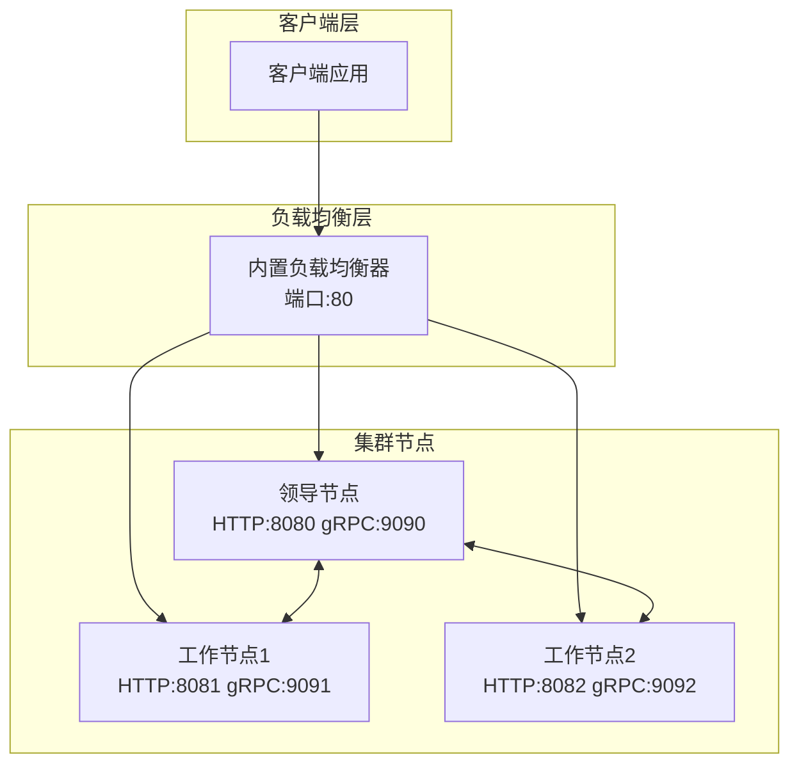

# Voice CLI - 语音转文字集群服务

高性能分布式语音转文字 HTTP 服务，支持单节点和多节点集群部署。基于 Rust 构建，使用 Whisper 引擎提供准确的语音识别能力。

## 🚀 核心特性

### 语音处理能力
- **多格式支持**: MP3, WAV, FLAC, M4A, AAC, OGG 等主流音频格式
- **自动格式转换**: 基于 rs-voice-toolkit 的智能音频处理
- **Whisper 模型**: 支持 tiny/base/small/medium/large 系列模型
- **自动模型管理**: 按需下载和管理 Whisper 模型

### 部署模式
- **🏠 单节点部署**: 快速启动，适合小规模使用
- **🏢 集群部署**: 多节点分布式处理，支持负载均衡和故障转移
- **⚡ 内置负载均衡**: 无需外部组件的集成负载均衡器
- **🔄 热扩容**: 动态添加/移除节点，无服务中断

### 高级功能
- **RESTful API**: 完整的 HTTP API 接口
- **实时监控**: 集群状态、节点健康检查
- **任务调度**: 智能任务分发算法
- **故障恢复**: 自动节点故障检测和任务重分配

## 📋 系统要求

- **操作系统**: Linux/macOS/Windows
- **内存**: 最低 2GB，推荐 8GB+
- **存储**: 至少 5GB（用于模型存储）
- **网络**: 集群部署需要节点间可互相访问

## 🛠️ 快速安装

### 从源码构建
```bash
# 克隆项目
git clone https://github.com/your-org/mcp-proxy
cd mcp-proxy

# 构建 voice-cli
cargo build --release -p voice-cli

# 二进制文件位置
ls target/release/voice-cli
```

## 🏠 单节点部署 (推荐入门)

### 方式一：直接运行（最简单）

```bash
# 1. 切换到工作目录
mkdir -p /opt/voice-service
cd /opt/voice-service
cp /path/to/voice-cli ./

# 2. 启动服务（自动创建配置文件）
./voice-cli server run

# 3. 测试服务
curl -X POST http://localhost:8080/transcribe \
  -F "audio=@test.mp3" \
  -F "model=base"
```

### 方式二：后台守护进程

```bash
# 1. 启动后台服务
./voice-cli server start

# 2. 检查状态
./voice-cli server status
# 输出: ✅ Server is running (PID: 12345, Port: 8080)

# 3. 停止服务
./voice-cli server stop

# 4. 重启服务
./voice-cli server restart
```

### 方式三：系统服务（推荐生产环境）

```bash
# 1. 安装为系统服务
sudo ./voice-cli service install

# 2. 启用开机自启
sudo ./voice-cli service enable

# 3. 启动服务
sudo ./voice-cli service start

# 4. 查看服务状态
sudo ./voice-cli service status

# 5. 查看服务日志
sudo ./voice-cli service logs
```

## 🏢 集群部署 (生产推荐)

### 架构概览



### 第一步：部署首个节点（领导节点）

```bash
# 服务器 1 (192.168.1.100)
cd /opt/voice-cluster
cp /path/to/voice-cli ./

# 1. 初始化集群环境
./voice-cli cluster init
# 自动创建:
# - cluster-config.yml (集群配置)
# - ./data/ (集群元数据)
# - ./models/ (Whisper模型)
# - ./logs/ (日志文件)

# 2. 启动集群节点
./voice-cli cluster start
# 输出: ✅ Cluster node started as Leader
#       Node ID: node-abc123
#       HTTP API: http://192.168.1.100:8080
#       gRPC Port: 9090

# 3. 验证节点状态
./voice-cli cluster status
# 输出: 
# 集群状态: 健康
# 角色: 领导节点
# 节点数量: 1
# HTTP端口: 8080
# gRPC端口: 9090

# 4. 测试直接访问
curl -X POST http://192.168.1.100:8080/transcribe \
  -F "audio=@test.mp3" \
  -F "model=base"
```

### 第二步：添加工作节点

```bash
# 服务器 2 (192.168.1.101)
cd /opt/voice-cluster
cp /path/to/voice-cli ./

# 1. 初始化节点环境
./voice-cli cluster init --http-port 8081 --grpc-port 9091

# 2. 加入现有集群
# ⚠️ 重要：使用领导节点的 gRPC 端口 (9090)，不是 HTTP 端口
./voice-cli cluster join 192.168.1.100:9090 \
  --http-port 8081 --grpc-port 9091
# 输出: ✅ Successfully joined cluster
#       Role: Follower
#       Leader: node-abc123

# 3. 验证加入成功
./voice-cli cluster status
# 输出:
# 集群状态: 健康
# 角色: 工作节点
# 领导节点: node-abc123
# 节点数量: 2
```

```bash
# 服务器 3 (192.168.1.102) - 第三个节点
cd /opt/voice-cluster
./voice-cli cluster init --http-port 8082 --grpc-port 9092
./voice-cli cluster join 192.168.1.100:9090 \
  --http-port 8082 --grpc-port 9092
```

### 第三步：部署负载均衡器

#### 方式一：内置负载均衡器（推荐）

```bash
# 在任一服务器或独立服务器上
cd /opt/voice-lb

# 1. 初始化负载均衡器
./voice-cli lb init --port 80

# 2. 前台运行（开发测试）
./voice-cli lb run --port 80
# 显示实时日志，Ctrl+C 停止

# 3. 后台运行（生产部署）
./voice-cli lb start --port 80
# 输出: ✅ Load balancer started (PID: 12345)

# 4. 检查负载均衡器状态
./voice-cli lb status
# 输出:
# 负载均衡器状态: 运行中 (后台进程)
# 端口: 80
# 运行时间: 2小时34分钟
# 健康节点: 3
# 总请求数: 1,234
# 失败请求: 0

# 5. 停止负载均衡器
./voice-cli lb stop
```

#### 方式二：系统服务部署

```bash
# 安装负载均衡器为系统服务
./voice-cli lb service install --name voice-lb
sudo systemctl enable voice-lb
sudo systemctl start voice-lb

# 查看服务状态
sudo systemctl status voice-lb
```

### 第四步：验证集群部署

```bash
# 1. 检查集群整体状态
./voice-cli cluster status
# 输出:
# 集群健康状态: 正常
# 领导节点: 192.168.1.100:8080
# 工作节点: 
#   - 192.168.1.101:8081 (健康)
#   - 192.168.1.102:8082 (健康)
# 集群大小: 3

# 2. 查看所有节点端点
./voice-cli cluster endpoints
# 输出:
# 节点 1: HTTP=192.168.1.100:8080, gRPC=192.168.1.100:9090 (领导节点)
# 节点 2: HTTP=192.168.1.101:8081, gRPC=192.168.1.101:9091 (工作节点)
# 节点 3: HTTP=192.168.1.102:8082, gRPC=192.168.1.102:9092 (工作节点)

# 3. 测试负载均衡
for i in {1..5}; do
  curl -X POST http://localhost:80/transcribe \
    -F "audio=@test.mp3" \
    -F "model=base"
done
# 请求会自动分发到不同节点

# 4. 测试故障转移
# 停止一个节点
./voice-cli cluster stop  # 在某个节点上执行

# 再次测试，流量会自动转移到健康节点
curl -X POST http://localhost:80/transcribe \
  -F "audio=@test.mp3"
```

## ⚙️ 配置详解

### 基础配置文件 (config.yml)

```yaml
# 服务器配置
server:
  host: "0.0.0.0"
  port: 8080
  max_file_size: 209715200  # 200MB
  cors_enabled: true

# Whisper 配置
whisper:
  default_model: "base"
  models_dir: "./models"
  auto_download: true
  supported_models: ["tiny", "base", "small", "medium", "large-v3"]

# 日志配置
logging:
  level: "info"
  log_dir: "./logs"
  max_file_size: "10MB"
  max_files: 5

# 守护进程配置
daemon:
  pid_file: "./voice-cli.pid"
  log_file: "./logs/daemon.log"
  work_dir: "./"
```

### 集群配置 (cluster-config.yml)

```yaml
# 集群配置
cluster:
  node_id: "auto"  # 自动生成或手动指定
  bind_address: "0.0.0.0"
  http_port: 8080      # HTTP API 端口
  grpc_port: 9090      # 集群通信端口
  leader_can_process_tasks: true  # 领导节点是否处理任务
  heartbeat_interval: 3    # 心跳间隔(秒)
  election_timeout: 15     # 选举超时(秒)
  metadata_db_path: "./data"
  enabled: true

# 负载均衡配置
load_balancer:
  enabled: true
  bind_address: "0.0.0.0"
  port: 80
  health_check_interval: 30    # 健康检查间隔(秒)
  health_check_timeout: 5      # 健康检查超时(秒)
  pid_file: "./voice-cli-lb.pid"
  log_file: "./logs/lb.log"
```

## 🔧 CLI 命令参考

### 单节点服务管理

```bash
# 服务器生命周期
voice-cli server run           # 前台运行
voice-cli server start         # 后台启动
voice-cli server stop          # 停止服务
voice-cli server restart       # 重启服务
voice-cli server status        # 查看状态

# 模型管理
voice-cli model download base  # 下载模型
voice-cli model list          # 列出模型
voice-cli model validate      # 验证模型
voice-cli model remove base   # 删除模型

# 系统服务
voice-cli service install     # 安装系统服务
voice-cli service start       # 启动服务
voice-cli service stop        # 停止服务
voice-cli service status      # 查看服务状态
```

### 集群管理命令

```bash
# 集群生命周期
voice-cli cluster init [选项]            # 初始化集群环境
voice-cli cluster start [选项]           # 启动集群节点
voice-cli cluster stop                   # 停止节点
voice-cli cluster restart [选项]         # 重启节点

# 集群操作
voice-cli cluster join <地址:端口> [选项] # 加入集群
voice-cli cluster leave                  # 离开集群
voice-cli cluster status                 # 集群状态
voice-cli cluster endpoints             # 节点端点列表
voice-cli cluster health                 # 健康检查

# 端口检查
voice-cli cluster check-ports --http-port 8080 --grpc-port 9090

# 示例：自定义端口启动
voice-cli cluster init --http-port 8081 --grpc-port 9091
voice-cli cluster start --http-port 8081 --grpc-port 9091
voice-cli cluster join 192.168.1.100:9090 --http-port 8082 --grpc-port 9092
```

### 负载均衡器管理

```bash
# 负载均衡器生命周期
voice-cli lb init [--port 80]           # 初始化负载均衡器
voice-cli lb run [--port 80]            # 前台运行
voice-cli lb start [--port 80]          # 后台启动
voice-cli lb stop                       # 停止负载均衡器
voice-cli lb restart [--port 80]        # 重启负载均衡器

# 状态查看
voice-cli lb status                      # 负载均衡器状态
voice-cli lb health                      # 健康检查
voice-cli lb logs                        # 查看日志

# 系统服务
voice-cli lb service install            # 安装为系统服务
voice-cli lb service start              # 启动服务
voice-cli lb service stop               # 停止服务
```

## 🌐 API 接口

### 转录音频 (POST /transcribe)

**请求示例:**
```bash
curl -X POST http://localhost:8080/transcribe \
  -F "audio=@audio.mp3" \
  -F "model=base" \
  -F "language=zh" \
  -F "response_format=json"
```

**响应示例:**
```json
{
  "text": "这是语音识别的结果文本。",
  "segments": [
    {
      "start": 0.0,
      "end": 2.5,
      "text": "这是语音识别的结果文本。",
      "confidence": 0.95
    }
  ],
  "language": "zh",
  "duration": 2.5,
  "processing_time": 0.8
}
```

### 健康检查 (GET /health)

**单节点响应:**
```json
{
  "status": "healthy",
  "models_loaded": ["base"],
  "uptime": 3600,
  "version": "0.1.0"
}
```

**集群响应:**
```json
{
  "status": "healthy", 
  "role": "leader",
  "cluster_size": 3,
  "node_id": "node-abc123",
  "models_loaded": ["base"],
  "uptime": 3600
}
```

### 模型列表 (GET /models)

```json
{
  "available_models": ["tiny", "base", "small", "medium", "large"],
  "loaded_models": ["base"],
  "model_info": {
    "base": {
      "size": "142 MB", 
      "memory_usage": "388 MB",
      "status": "loaded"
    }
  }
}
```

## 📊 监控和日志

### 日志文件位置

```bash
# 服务日志
./logs/voice-cli.log          # 应用日志
./logs/daemon.log             # 守护进程日志
./logs/lb.log                 # 负载均衡器日志

# 集群日志
./logs/cluster.log            # 集群操作日志
./logs/raft.log              # Raft 共识日志

# 实时查看日志
tail -f ./logs/voice-cli.log
tail -f ./logs/cluster.log
```

### 性能监控

```bash
# 查看集群状态
./voice-cli cluster status

# 查看负载均衡器统计
./voice-cli lb status

# 查看系统资源使用
./voice-cli cluster health --verbose
```

## 🚀 部署场景

### 场景一：开发测试环境

```bash
# 单机快速启动
cd /tmp/voice-test
./voice-cli server run
# 访问: http://localhost:8080
```

### 场景二：小型生产环境

```bash
# 单节点 + 系统服务
./voice-cli service install
sudo systemctl enable voice-cli
sudo systemctl start voice-cli
```

### 场景三：高可用生产集群

```bash
# 3节点集群 + 负载均衡器
# 节点1: 初始化并启动领导节点
./voice-cli cluster init && ./voice-cli cluster start

# 节点2,3: 加入集群
./voice-cli cluster join <leader-ip>:9090

# 独立服务器: 部署负载均衡器  
./voice-cli lb service install && sudo systemctl start voice-lb
```

### 场景四：混合部署（单节点+负载均衡）

```bash
# 服务器上同时运行节点和负载均衡器
./voice-cli cluster start                    # 端口 8080
./voice-cli lb start --port 80               # 端口 80 代理到 8080

# 客户端访问负载均衡器端口
curl http://server:80/transcribe -F "audio=@test.mp3"
```

## 🔍 故障排除

### 常见问题

**1. 端口占用**
```bash
# 检查端口使用情况
./voice-cli cluster check-ports --http-port 8080 --grpc-port 9090

# 使用其他端口
./voice-cli cluster init --http-port 8081 --grpc-port 9091
```

**2. 节点加入失败**
```bash
# 确保使用正确的 gRPC 端口
./voice-cli cluster join 192.168.1.100:9090  # ✅ 正确：gRPC端口
# 不要使用: 
# ./voice-cli cluster join 192.168.1.100:80    # ❌ 错误：负载均衡器端口
# ./voice-cli cluster join 192.168.1.100:8080  # ❌ 错误：HTTP端口
```

**3. 模型下载失败**
```bash
# 手动下载模型
./voice-cli model download base

# 检查网络连接和磁盘空间
df -h ./models/
```

**4. 集群节点失联**
```bash
# 检查网络连通性
ping 192.168.1.100

# 检查防火墙设置
sudo ufw allow 9090/tcp  # gRPC端口
sudo ufw allow 8080/tcp  # HTTP端口
```

### 调试模式

```bash
# 启用详细日志
RUST_LOG=debug ./voice-cli cluster run

# 查看配置
./voice-cli cluster status --verbose

# 检查集群连接
./voice-cli cluster health --check-connectivity
```

## 🎯 性能优化

### 硬件推荐

| 规模 | CPU | 内存 | 存储 | 网络 |
|------|-----|------|------|------|
| 开发测试 | 2核 | 4GB | 10GB | 100Mbps |
| 小型生产 | 4核 | 8GB | 50GB | 1Gbps |
| 大型集群 | 8核+ | 16GB+ | 100GB+ | 10Gbps |

### 性能调优

```yaml
# config.yml 性能配置
whisper:
  workers:
    transcription_workers: 4      # 增加工作线程
    worker_timeout: 3600          # 工作超时时间
    
cluster:
  heartbeat_interval: 3           # 心跳间隔
  leader_can_process_tasks: true  # 领导节点参与处理
  
server:
  max_file_size: 536870912       # 512MB 最大文件
```

## 📝 版本说明

- **v1.0.x**: 单节点服务，基础功能
- **v2.0.x**: 集群支持，负载均衡，故障转移
- **v2.1.x**: 性能优化，监控增强
- **v2.2.x**: 高可用性，自动扩缩容

## 🤝 贡献

欢迎提交问题和功能请求！请查看 [CONTRIBUTING.md](CONTRIBUTING.md) 了解详情。

## 📄 许可证

本项目是 mcp_proxy 工作空间的一部分，遵循相同的许可证条款。