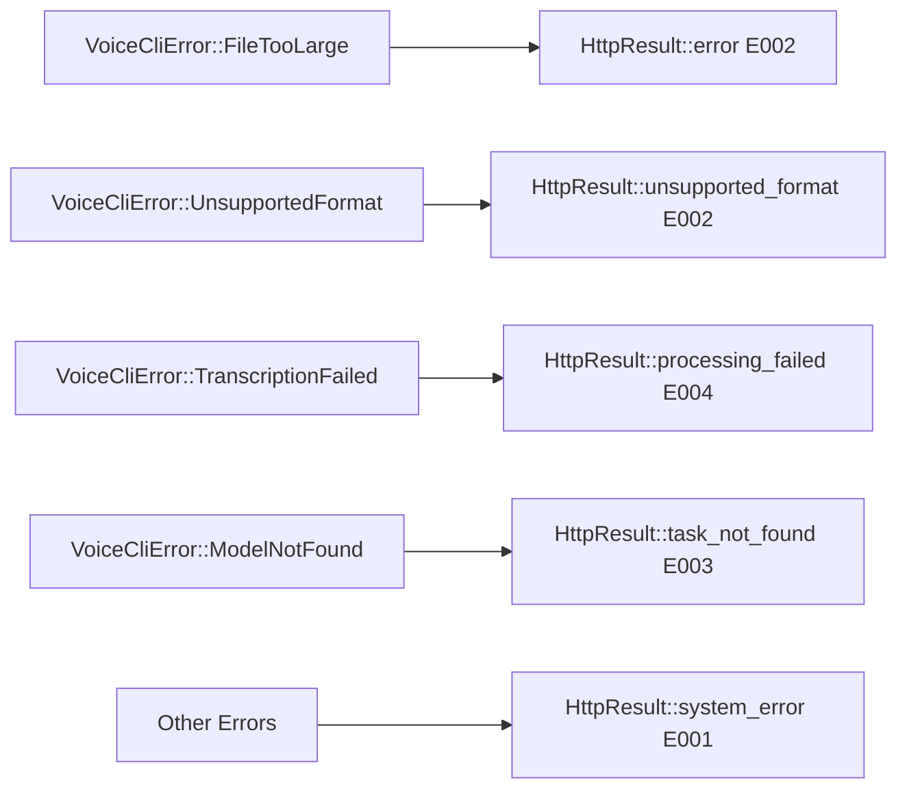

# Voice-CLI Router HttpResult Integration Design

## Overview
This design document outlines the implementation plan for standardizing all voice-cli router responses using the `HttpResult<T>` structure. The HttpResult wrapper ensures consistent API responses across all endpoints with standardized success/error codes and structured data formatting.

## Current State Analysis

### Existing Router Structure
The voice-cli service currently implements three main endpoints:
- `GET /health` - Service health status (excluded from HttpResult standardization)
- `GET /models` - Available and loaded model information  
- `POST /transcribe` - Audio transcription processing

### Current Response Patterns
Each endpoint returns different response structures directly:
- Health endpoint returns `Json<HealthResponse>` (will remain unchanged)
- Models endpoint returns `Json<ModelsResponse>`
- Transcribe endpoint returns `Json<TranscriptionResponse>`

Error handling is managed through the `VoiceCliError` type, but responses lack consistent formatting for business endpoints.

## Target Architecture

### HttpResult Structure Integration
Business router responses (excluding health checks) will be wrapped in the existing `HttpResult<T>` structure:

```mermaid
graph TD
A[Client Request] --> B[Router Endpoint]
B --> C{Processing}
C -->|Success| D[HttpResult::success with data]
C -->|Error| E[HttpResult::error with code]
D --> F[JSON Response with code: "0000"]
E --> G[JSON Response with error code]
F --> H[Client]
G --> H
```

### Response Format Standardization

#### Success Response Pattern
```json
{
  "code": "0000",
  "message": "操作成功",
  "data": {
    // Actual endpoint data
  }
}
```

#### Error Response Pattern
```json
{
  "code": "E001",
  "message": "Error description",
  "data": null
}
```

## Implementation Plan

### Handler Modifications

#### Models Handler Transformation
**Before:**
```rust
pub async fn models_list_handler(
    State(state): State<AppState>,
) -> Result<Json<ModelsResponse>, VoiceCliError>
```

**After:**
```rust
pub async fn models_list_handler(
    State(state): State<AppState>,
) -> Result<HttpResult<ModelsResponse>, VoiceCliError>
```

#### Transcribe Handler Transformation
**Before:**
```rust
pub async fn transcribe_handler(
    State(state): State<AppState>,
    multipart: Multipart,
) -> Result<Json<TranscriptionResponse>, VoiceCliError>
```

**After:**
```rust
pub async fn transcribe_handler(
    State(state): State<AppState>,
    multipart: Multipart,
) -> Result<HttpResult<TranscriptionResponse>, VoiceCliError>
```

### Error Code Mapping Strategy

#### VoiceCliError to HttpResult Mapping
Implement a conversion strategy that maps existing `VoiceCliError` variants to appropriate HttpResult error responses:



#### Error Code Categories
- **E001**: System errors (internal server errors, configuration issues)
- **E002**: Format/validation errors (unsupported formats, invalid parameters)
- **E003**: Resource not found errors (model not found, task not found)
- **E004**: Processing failures (transcription failed, worker pool errors)

### Response Wrapper Implementation

#### Success Response Wrapping
Each business handler will wrap successful responses:

```rust
// Models endpoint success  
let models_data = ModelsResponse { /* ... */ };
Ok(HttpResult::success(models_data))

// Transcribe endpoint success
let transcription_data = TranscriptionResponse { /* ... */ };
Ok(HttpResult::success(transcription_data))
```

#### Error Response Handling
Implement centralized error conversion:

```rust
impl From<VoiceCliError> for HttpResult<serde_json::Value> {
    fn from(error: VoiceCliError) -> Self {
        match error {
            VoiceCliError::FileTooLarge { size, max } => {
                HttpResult::unsupported_format(format!("File size {} exceeds maximum {}", size, max))
            },
            VoiceCliError::UnsupportedFormat(msg) => {
                HttpResult::unsupported_format(msg)
            },
            VoiceCliError::TranscriptionFailed(msg) => {
                HttpResult::processing_failed(msg)
            },
            VoiceCliError::ModelNotFound(msg) => {
                HttpResult::task_not_found(msg)
            },
            _ => {
                HttpResult::system_error(error.to_string())
            }
        }
    }
}
```

### OpenAPI Documentation Updates

#### Schema Modifications
Update OpenAPI schemas for business endpoints to reflect HttpResult wrapper structure:

```rust
#[utoipa::path(
    get,
    path = "/models",
    responses(
        (status = 200, description = "Models information", body = HttpResult<ModelsResponse>),
        (status = 500, description = "Service error", body = HttpResult<String>)
    )
)]
```

#### Response Schema Integration
Each endpoint's OpenAPI documentation will reference the standardized HttpResult format while maintaining type safety for the data field.

## Implementation Steps

### Phase 1: Handler Response Modification
1. Update business handler return types to use `HttpResult<T>` (excluding /health)
2. Wrap successful responses with `HttpResult::success(data)`
3. Test individual endpoint functionality

### Phase 2: Error Handling Standardization
1. Implement VoiceCliError to HttpResult conversion
2. Update error response patterns
3. Ensure consistent error code usage

### Phase 3: Integration Testing
1. Verify all endpoints return consistent HttpResult format
2. Test error scenarios with appropriate error codes
3. Validate OpenAPI documentation accuracy

### Phase 4: Documentation Updates
1. Update API documentation to reflect new response format
2. Provide migration guide for client applications
3. Update integration examples

## Testing Strategy

### Unit Tests
Verify each business handler properly wraps responses:
```rust
#[tokio::test]
async fn test_models_handler_success() {
    let result = models_list_handler(state).await.unwrap();
    assert_eq!(result.code, "0000");
    assert!(result.data.is_some());
}

#[tokio::test]
async fn test_transcribe_handler_error() {
    let result = transcribe_handler(state, invalid_multipart).await.unwrap();
    assert_ne!(result.code, "0000");
    assert!(result.data.is_none());
}
```

### Integration Tests
Validate end-to-end response format:
```rust
#[tokio::test]
async fn test_transcribe_endpoint_response_format() {
    let response = app.request()
        .method(http::Method::POST)
        .uri("/transcribe")
        .multipart(audio_data)
        .send()
        .await;
    
    let body: HttpResult<TranscriptionResponse> = response.json().await;
    assert_eq!(body.code, "0000");
    assert!(body.data.is_some());
}
```

## Backward Compatibility

### Client Migration Strategy
Existing clients will need to adapt to the new response format:
- Response data now nested under `data` field
- Success indicated by `code: "0000"`
- Error messages in `message` field with specific error codes

### Gradual Migration Approach
Consider implementing versioned endpoints during transition period:
- `/v1/models` - Original format
- `/v2/models` - HttpResult format
- Deprecation timeline for v1 endpoints
- Health endpoint remains unchanged across versions

## Performance Considerations

### Response Size Impact
HttpResult wrapper adds minimal overhead:
- Additional `code` and `message` fields (~50 bytes)
- Negligible impact on network performance
- Maintains JSON serialization efficiency

### Processing Overhead
- No additional processing complexity
- Single wrapper operation per response
- Maintains existing error handling performance

## Monitoring and Observability

### Error Code Tracking
Implement monitoring for error code distribution:
- Track frequency of each error code
- Monitor success rate (code "0000")
- Alert on unusual error patterns

### Response Time Metrics
Ensure HttpResult integration doesn't impact response times:
- Monitor endpoint latency
- Compare before/after performance metrics
- Validate transcription processing times remain consistent