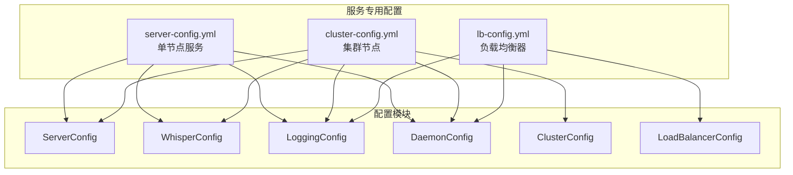

# Voice-CLI 服务配置文件分离设计

## 概述

当前 voice-cli 使用统一配置文件，所有服务（server、cluster、load balancer）共享同一个 config.yml。这导致不同服务启动时包含不必要的配置项。本设计将配置文件按服务类型分离，为不同部署场景提供专用配置。

**核心目标：**
- 为 `voice-cli server`、`voice-cli cluster`、`voice-cli lb` 提供独立配置文件
- 简化不同部署场景的配置管理
- 提供配置模板生成机制
- 避免不同服务间的配置干扰

## 架构设计

### 配置文件结构



### 配置文件对比

| 服务类型 | 配置文件 | 包含模块 | 行数 | 使用场景 |
|---------|---------|----------|------|----------|
| **Server** | `server-config.yml` | server + whisper + logging + daemon | ~50行 | 单节点转录 |
| **Cluster** | `cluster-config.yml` | server + whisper + logging + daemon + cluster | ~80行 | 集群节点 |
| **Load Balancer** | `lb-config.yml` | load_balancer + logging + daemon | ~30行 | 负载均衡 |

## 配置模板设计

### Server 配置模板

```yaml
# Voice CLI Server Configuration - 单节点语音转录服务

server:
  host: "0.0.0.0"
  port: 8080
  max_file_size: 209715200  # 200MB
  cors_enabled: true

whisper:
  default_model: "base"
  models_dir: "./models"
  auto_download: true
  supported_models: ["tiny", "base", "small", "medium", "large-v3"]
  
  audio_processing:
    supported_formats: ["mp3", "wav", "flac", "m4a", "ogg"]
    auto_convert: true
    conversion_timeout: 60
    temp_file_cleanup: true
    temp_file_retention: 300
    
  workers:
    transcription_workers: 3
    channel_buffer_size: 100
    worker_timeout: 3600

logging:
  level: "info"
  log_dir: "./logs"
  max_file_size: "10MB"
  max_files: 5

daemon:
  pid_file: "./voice-cli-server.pid"
  log_file: "./logs/server-daemon.log"
  work_dir: "./"
```

### Cluster 配置模板

```yaml
# Voice CLI Cluster Configuration - 集群节点配置

server:
  host: "0.0.0.0"
  port: 8080
  max_file_size: 209715200
  cors_enabled: true

whisper:
  default_model: "base"
  models_dir: "./models"
  auto_download: true
  supported_models: ["tiny", "base", "small", "medium", "large-v3"]
  
  audio_processing:
    supported_formats: ["mp3", "wav", "flac", "m4a", "ogg"]
    auto_convert: true
    conversion_timeout: 60
    temp_file_cleanup: true
    temp_file_retention: 300
    
  workers:
    transcription_workers: 3
    channel_buffer_size: 100
    worker_timeout: 3600

cluster:
  node_id: "node-auto-generated"
  bind_address: "0.0.0.0"
  grpc_port: 9090
  http_port: 8080
  leader_can_process_tasks: true
  heartbeat_interval: 3
  election_timeout: 15
  metadata_db_path: "./cluster_metadata"
  enabled: true

logging:
  level: "info"
  log_dir: "./logs"
  max_file_size: "10MB"
  max_files: 5

daemon:
  pid_file: "./voice-cli-cluster.pid"
  log_file: "./logs/cluster-daemon.log"
  work_dir: "./"
```

### Load Balancer 配置模板

```yaml
# Voice CLI Load Balancer Configuration - 负载均衡器配置

load_balancer:
  enabled: true
  bind_address: "0.0.0.0"
  port: 80
  health_check_interval: 30
  health_check_timeout: 5
  pid_file: "./voice-cli-lb.pid"
  log_file: "./logs/lb.log"

logging:
  level: "info"
  log_dir: "./logs"
  max_file_size: "10MB"
  max_files: 5

daemon:
  pid_file: "./voice-cli-lb.pid"
  log_file: "./logs/lb-daemon.log"
  work_dir: "./"
```

## 实现架构

### 服务类型定义

```rust
#[derive(Debug, Clone, Copy, PartialEq, Eq)]
pub enum ServiceType {
    Server,
    Cluster,
    LoadBalancer,
}

impl ServiceType {
    pub fn default_config_filename(&self) -> &'static str {
        match self {
            ServiceType::Server => "server-config.yml",
            ServiceType::Cluster => "cluster-config.yml",
            ServiceType::LoadBalancer => "lb-config.yml",
        }
    }
    
    pub fn display_name(&self) -> &'static str {
        match self {
            ServiceType::Server => "Server",
            ServiceType::Cluster => "Cluster",
            ServiceType::LoadBalancer => "Load Balancer",
        }
    }
    
    /// 获取所有支持的服务类型
    pub fn all() -> &'static [ServiceType] {
        &[ServiceType::Server, ServiceType::Cluster, ServiceType::LoadBalancer]
    }
}
```

### 配置模板生成器

```rust
pub struct ConfigTemplateGenerator;

impl ConfigTemplateGenerator {
    pub fn generate_config_file(
        service_type: ServiceType, 
        output_path: &PathBuf
    ) -> crate::Result<()> {
        let template_content = Self::get_template_content(service_type)?;
        
        if let Some(parent) = output_path.parent() {
            std::fs::create_dir_all(parent)?;
        }
        
        std::fs::write(output_path, template_content)?;
        
        tracing::info!(
            "Generated {} configuration file: {:?}", 
            service_type.display_name(), 
            output_path
        );
        
        Ok(())
    }
    
    fn get_template_content(service_type: ServiceType) -> crate::Result<&'static str> {
        match service_type {
            ServiceType::Server => Ok(include_str!("../templates/server-config.yml.template")),
            ServiceType::Cluster => Ok(include_str!("../templates/cluster-config.yml.template")),
            ServiceType::LoadBalancer => Ok(include_str!("../templates/lb-config.yml.template")),
        }
    }
    
    /// 生成所有类型的配置文件到指定目录
    pub fn generate_all_configs(output_dir: &PathBuf) -> crate::Result<HashMap<ServiceType, PathBuf>> {
        let mut generated_files = HashMap::new();
        
        for &service_type in ServiceType::all() {
            let filename = service_type.default_config_filename();
            let output_path = output_dir.join(filename);
            
            Self::generate_config_file(service_type, &output_path)?;
            generated_files.insert(service_type, output_path);
        }
        
        Ok(generated_files)
    }
}
```

### 服务专用配置加载器

```rust
pub struct ServiceConfigLoader;

impl ServiceConfigLoader {
    pub fn load_service_config(
        service_type: ServiceType,
        config_path: Option<&PathBuf>
    ) -> crate::Result<Config> {
        let config_path = match config_path {
            Some(path) => path.clone(),
            None => Self::resolve_config_path(service_type)?,
        };
        
        // 生成默认配置（如果不存在）
        if !config_path.exists() {
            ConfigTemplateGenerator::generate_config_file(service_type, &config_path)?;
        }
        
        // 加载并调整配置
        let mut config = Self::load_config_from_file(&config_path)?;
        Self::apply_service_specific_settings(&mut config, service_type)?;
        config.apply_env_overrides()?;
        config.validate()?;
        
        Ok(config)
    }
    
    fn resolve_config_path(service_type: ServiceType) -> crate::Result<PathBuf> {
        let current_dir = std::env::current_dir()?;
        
        // 使用服务专用配置文件
        let service_config = current_dir.join(service_type.default_config_filename());
        Ok(service_config)
    }
    
    fn apply_service_specific_settings(
        config: &mut Config, 
        service_type: ServiceType
    ) -> crate::Result<()> {
        match service_type {
            ServiceType::Server => {
                config.cluster.enabled = false;
                config.load_balancer.enabled = false;
                config.daemon.pid_file = "./voice-cli-server.pid".to_string();
            }
            
            ServiceType::Cluster => {
                config.cluster.enabled = true;
                config.load_balancer.enabled = false;
                config.cluster.http_port = config.server.port;
                config.daemon.pid_file = "./voice-cli-cluster.pid".to_string();
            }
            
            ServiceType::LoadBalancer => {
                config.cluster.enabled = false;
                config.load_balancer.enabled = true;
                config.daemon.pid_file = config.load_balancer.pid_file.clone();
            }
            

        }
        
        Ok(())
    }
}
```

## CLI 命令集成

### 各服务Init命令支持

```rust
/// Server 命令组
#[derive(Subcommand)]
pub enum ServerAction {
    /// 初始化 server 配置
    Init {
        /// 配置文件输出路径（默认: ./server-config.yml）
        #[arg(short, long)]
        config: Option<PathBuf>,
        
        /// 强制覆盖已存在的配置文件
        #[arg(long)]
        force: bool,
    },
    
    /// 运行 server（前台模式）
    Run {
        #[arg(short, long)]
        config: Option<PathBuf>,
    },
    
    /// 启动 server（后台模式）
    Start {
        #[arg(short, long)]
        config: Option<PathBuf>,
    },
    
    /// 停止 server
    Stop,
    
    /// 查看 server 状态
    Status,
}

/// Cluster 命令组
#[derive(Subcommand)]
pub enum ClusterAction {
    /// 初始化集群配置
    Init {
        /// 配置文件输出路径（默认: ./cluster-config.yml）
        #[arg(short, long)]
        config: Option<PathBuf>,
        
        /// HTTP 端口
        #[arg(long)]
        http_port: Option<u16>,
        
        /// gRPC 端口
        #[arg(long)]
        grpc_port: Option<u16>,
        
        /// 强制覆盖已存在的配置文件
        #[arg(long)]
        force: bool,
    },
    
    /// 运行集群节点（前台模式）
    Run {
        #[arg(short, long)]
        config: Option<PathBuf>,
        
        #[arg(long)]
        http_port: Option<u16>,
        
        #[arg(long)]
        grpc_port: Option<u16>,
    },
    
    /// 启动集群节点（后台模式）
    Start {
        #[arg(short, long)]
        config: Option<PathBuf>,
        
        #[arg(long)]
        http_port: Option<u16>,
        
        #[arg(long)]
        grpc_port: Option<u16>,
        
        /// 保存命令行参数到配置文件
        #[arg(long)]
        save_config: bool,
    },
    
    /// 停止集群节点
    Stop,
    
    /// 查看集群状态
    Status,
    
    /// 加入现有集群
    Join {
        /// 现有集群节点地址 (gRPC)
        target: String,
        
        #[arg(long)]
        http_port: Option<u16>,
        
        #[arg(long)]
        grpc_port: Option<u16>,
    },
}

/// Load Balancer 命令组
#[derive(Subcommand)]
pub enum LbAction {
    /// 初始化负载均衡器配置
    Init {
        /// 配置文件输出路径（默认: ./lb-config.yml）
        #[arg(short, long)]
        config: Option<PathBuf>,
        
        /// 负载均衡器端口
        #[arg(short, long)]
        port: Option<u16>,
        
        /// 强制覆盖已存在的配置文件
        #[arg(long)]
        force: bool,
    },
    
    /// 运行负载均衡器（前台模式）
    Run {
        #[arg(short, long)]
        config: Option<PathBuf>,
        
        #[arg(short, long)]
        port: Option<u16>,
    },
    
    /// 启动负载均衡器（后台模式）
    Start {
        #[arg(short, long)]
        config: Option<PathBuf>,
        
        #[arg(short, long)]
        port: Option<u16>,
    },
    
    /// 停止负载均衡器
    Stop,
    
    /// 查看负载均衡器状态
    Status,
}

### 配置管理命令

```rust
#[derive(Subcommand)]
pub enum ConfigAction {
    /// 生成配置文件
    Generate {
        #[arg(value_enum)]
        service: Option<ServiceTypeArg>,
        
        #[arg(short, long)]
        output: Option<PathBuf>,
        
        #[arg(long)]
        all: bool,
    },
    
    /// 验证配置文件
    Validate {
        #[arg(short, long)]
        config: Option<PathBuf>,
        
        #[arg(value_enum)]
        service: Option<ServiceTypeArg>,
    },
    
    /// 显示配置内容
    Show {
        #[arg(short, long)]
        config: Option<PathBuf>,
        
        #[arg(value_enum)]
        service: Option<ServiceTypeArg>,
    },
}

#[derive(Clone, Copy, Debug, ValueEnum)]
pub enum ServiceTypeArg {
    Server,
    Cluster,
    Lb,
}
```

### Init 命令处理器

```rust
/// Server Init 命令处理
pub async fn handle_server_init(
    config_path: Option<PathBuf>,
    force: bool,
) -> crate::Result<()> {
    let output_path = config_path.unwrap_or_else(|| {
        std::env::current_dir()
            .unwrap_or_else(|_| PathBuf::from("."))
            .join("server-config.yml")
    });
    
    // 检查文件是否已存在
    if output_path.exists() && !force {
        println!("❌ Configuration file already exists: {:?}", output_path);
        println!("💡 Use --force to overwrite, or specify a different path with --config");
        return Ok(());
    }
    
    // 生成配置文件
    ConfigTemplateGenerator::generate_config_file(ServiceType::Server, &output_path)?;
    
    println!("✅ Server configuration initialized: {:?}", output_path);
    println!("📝 Edit the configuration file and run:");
    println!("   voice-cli server run --config {:?}", output_path);
    
    Ok(())
}

/// Cluster Init 命令处理
pub async fn handle_cluster_init(
    config_path: Option<PathBuf>,
    http_port: Option<u16>,
    grpc_port: Option<u16>,
    force: bool,
) -> crate::Result<()> {
    let output_path = config_path.unwrap_or_else(|| {
        std::env::current_dir()
            .unwrap_or_else(|_| PathBuf::from("."))
            .join("cluster-config.yml")
    });
    
    // 检查文件是否已存在
    if output_path.exists() && !force {
        println!("❌ Configuration file already exists: {:?}", output_path);
        println!("💡 Use --force to overwrite, or specify a different path with --config");
        return Ok(());
    }
    
    // 生成基础配置
    ConfigTemplateGenerator::generate_config_file(ServiceType::Cluster, &output_path)?;
    
    // 如果指定了端口参数，更新配置文件
    if http_port.is_some() || grpc_port.is_some() {
        let mut config = ServiceConfigLoader::load_config_from_file(&output_path)?;
        
        if let Some(port) = http_port {
            config.server.port = port;
            config.cluster.http_port = port;
        }
        
        if let Some(port) = grpc_port {
            config.cluster.grpc_port = port;
        }
        
        config.save(&output_path)?;
    }
    
    println!("✅ Cluster configuration initialized: {:?}", output_path);
    if let Some(http_port) = http_port {
        println!("🔧 HTTP port set to: {}", http_port);
    }
    if let Some(grpc_port) = grpc_port {
        println!("🔧 gRPC port set to: {}", grpc_port);
    }
    println!("📝 Edit the configuration file and run:");
    println!("   voice-cli cluster start --config {:?}", output_path);
    
    Ok(())
}

/// Load Balancer Init 命令处理
pub async fn handle_lb_init(
    config_path: Option<PathBuf>,
    port: Option<u16>,
    force: bool,
) -> crate::Result<()> {
    let output_path = config_path.unwrap_or_else(|| {
        std::env::current_dir()
            .unwrap_or_else(|_| PathBuf::from("."))
            .join("lb-config.yml")
    });
    
    // 检查文件是否已存在
    if output_path.exists() && !force {
        println!("❌ Configuration file already exists: {:?}", output_path);
        println!("💡 Use --force to overwrite, or specify a different path with --config");
        return Ok(());
    }
    
    // 生成基础配置
    ConfigTemplateGenerator::generate_config_file(ServiceType::LoadBalancer, &output_path)?;
    
    // 如果指定了端口参数，更新配置文件
    if let Some(port) = port {
        let mut config = ServiceConfigLoader::load_config_from_file(&output_path)?;
        config.load_balancer.port = port;
        config.save(&output_path)?;
    }
    
    println!("✅ Load balancer configuration initialized: {:?}", output_path);
    if let Some(port) = port {
        println!("🔧 Port set to: {}", port);
    }
    println!("📝 Edit the configuration file and run:");
    println!("   voice-cli lb start --config {:?}", output_path);
    
    Ok(())
}
```

### 配置文件自动检测加载

```rust
/// 智能配置加载器 - 自动检测和生成配置
pub struct SmartConfigLoader;

impl SmartConfigLoader {
    /// 为服务加载配置，如果不存在则自动生成
    pub async fn load_or_create_config(
        service_type: ServiceType,
        config_path: Option<&PathBuf>,
        cli_overrides: Option<ConfigOverrides>,
    ) -> crate::Result<Config> {
        let resolved_path = match config_path {
            Some(path) => path.clone(),
            None => Self::get_default_config_path(service_type),
        };
        
        // 如果配置文件不存在，自动生成
        if !resolved_path.exists() {
            println!("📄 Configuration file not found, generating default config: {:?}", resolved_path);
            ConfigTemplateGenerator::generate_config_file(service_type, &resolved_path)?;
            println!("✅ Default configuration generated successfully");
        }
        
        // 加载配置
        let mut config = ServiceConfigLoader::load_service_config(service_type, Some(&resolved_path))?;
        
        // 应用CLI参数覆盖
        if let Some(overrides) = cli_overrides {
            Self::apply_cli_overrides(&mut config, &overrides)?;
        }
        
        Ok(config)
    }
    
    fn get_default_config_path(service_type: ServiceType) -> PathBuf {
        std::env::current_dir()
            .unwrap_or_else(|_| PathBuf::from("."))
            .join(service_type.default_config_filename())
    }
    
    fn apply_cli_overrides(
        config: &mut Config,
        overrides: &ConfigOverrides,
    ) -> crate::Result<()> {
        if let Some(http_port) = overrides.http_port {
            config.server.port = http_port;
            config.cluster.http_port = http_port;
        }
        
        if let Some(grpc_port) = overrides.grpc_port {
            config.cluster.grpc_port = grpc_port;
        }
        
        if let Some(lb_port) = overrides.lb_port {
            config.load_balancer.port = lb_port;
        }
        
        Ok(())
    }
}

#[derive(Debug, Default)]
pub struct ConfigOverrides {
    pub http_port: Option<u16>,
    pub grpc_port: Option<u16>,
    pub lb_port: Option<u16>,
}
```

## 使用示例

### 服务初始化

```bash
# 1. 单节点服务 - 使用 init 命令
mkdir -p /opt/voice-server
cd /opt/voice-server
voice-cli server init
voice-cli server start

# 2. 集群节点 - 使用 init 命令（支持端口参数）
mkdir -p /opt/voice-cluster  
cd /opt/voice-cluster
voice-cli cluster init --http-port 8080 --grpc-port 9090
voice-cli cluster start

# 3. 负载均衡器 - 使用 init 命令
mkdir -p /opt/voice-lb
cd /opt/voice-lb
voice-cli lb init --port 80
voice-cli lb start

# 4. 自动配置生成（直接启动服务）
cd /tmp/new-project
voice-cli server start  # 自动生成 server-config.yml
voice-cli cluster start --http-port 8081  # 自动生成 cluster-config.yml
voice-cli lb start --port 8080  # 自动生成 lb-config.yml
```

### Init 命令与 Config Generate 命令对比

| 功能 | Init 命令 | Config Generate 命令 |
|------|------------|----------------------|
| **使用场景** | 服务初始化 | 通用配置生成 |
| **命令示例** | `voice-cli server init` | `voice-cli config generate server` |
| **参数支持** | 支持端口设置 | 仅支持输出路径 |
| **配置调整** | 自动应用CLI参数 | 生成默认配置 |
| **覆盖保护** | 支持 --force 参数 | 直接覆盖 |
| **推荐用法** | 日常部署 | 批量生成/学习 |

```bash
# 推荐：使用 init 命令初始化服务
voice-cli server init
voice-cli cluster init --http-port 8080 --grpc-port 9090
voice-cli lb init --port 80

# 也可以使用 config generate（更通用）
voice-cli config generate server --output ./custom-server.yml
voice-cli config generate --all  # 生成所有类型的配置
```

## 配置管理特性

1. **专用配置**: 每种服务使用独立的配置文件，避免配置污染
2. **自动生成**: 如果配置文件不存在，自动生成对应的默认配置
3. **环境变量**: 支持所有现有环境变量覆盖
4. **CLI参数**: 支持 `--config` 参数指定自定义配置文件路径

## OpenAPI 文档路由集成

为了方便用户访问 API 文档，需要在 voice-cli 的路由中添加 `/api/docs/` 路径的 OpenAPI 文档接口。

### 路由文件修改方案

#### 更新 /voice-cli/src/openapi.rs

由于现在统一在 routes.rs 中管理 Swagger UI 路由，openapi.rs 文件可以简化：

```rust
use utoipa::OpenApi;
use crate::models::{
    TranscriptionResponse, Segment, HealthResponse, ModelsResponse, ModelInfo
};
use crate::server::handlers;

/// OpenAPI specification for Voice CLI API
#[derive(OpenApi)]
#[openapi(
    info(
        title = "Voice CLI API",
        version = "0.1.0",
        description = "Speech-to-text HTTP service with Whisper model support",
        license(
            name = "MIT",
        ),
        contact(
            name = "Voice CLI Support",
            email = "support@voice-cli.dev"
        )
    ),
    servers(
        (url = "http://localhost:8080", description = "Local development server"),
        (url = "https://api.voice-cli.dev", description = "Production server")
    ),
    paths(
        handlers::health_handler,
        handlers::models_list_handler,
        handlers::transcribe_handler
    ),
    components(
        schemas(
            TranscriptionResponse,
            Segment,
            HealthResponse,
            ModelsResponse,
            ModelInfo
        )
    ),
    tags(
        (name = "Health", description = "Service health and status endpoints"),
        (name = "Models", description = "Whisper model management endpoints"),
        (name = "Transcription", description = "Speech-to-text transcription endpoints")
    ),
    external_docs(
        url = "https://github.com/your-org/voice-cli",
        description = "Voice CLI GitHub Repository"
    )
)]
pub struct ApiDoc;

/// Get OpenAPI JSON specification
pub fn get_openapi_json() -> utoipa::openapi::OpenApi {
    ApiDoc::openapi()
}
```

#### 更新 /voice-cli/src/server/routes.rs

```rust
use crate::models::Config;
use crate::server::handlers;
use crate::openapi;
use axum::{routing::{get, post}, Router};
use std::sync::Arc;
use tower_http::cors::CorsLayer;
use tower_http::limit::RequestBodyLimitLayer;
use tower_http::trace::TraceLayer;
use utoipa_swagger_ui::SwaggerUi; // 新增导入

pub async fn create_routes(config: Config) -> crate::Result<Router> {
    let config = Arc::new(config);
    
    // Create shared state
    let shared_state = handlers::AppState::new(config.clone()).await?;
    
    let mut app = Router::new()
        // Health check endpoint
        .route("/health", get(handlers::health_handler))
        
        // Models management endpoints
        .route("/models", get(handlers::models_list_handler))
        
        // Main transcription endpoint
        .route("/transcribe", post(handlers::transcribe_handler))
        
        // Simple test endpoint for load balancer testing
        .route("/test", get(handlers::test_handler))
        
        // Cluster management endpoints
        .route("/cluster/shutdown", post(handlers::cluster_shutdown_handler))
        
        // Add shared state
        .with_state(shared_state)
        
        // Add unified API documentation route at /api/docs/
        .merge(create_api_docs_route());

    // Add CORS if enabled
    if config.server.cors_enabled {
        app = app.layer(CorsLayer::permissive());
    }

    // Add other middleware
    app = app
        .layer(RequestBodyLimitLayer::new(config.server.max_file_size))
        .layer(TraceLayer::new_for_http());

    Ok(app)
}

/// Create unified API documentation route at /api/docs/
fn create_api_docs_route() -> SwaggerUi {
    SwaggerUi::new("/api/docs")
        .url("/api/docs/openapi.json", openapi::ApiDoc::openapi())
        .config(utoipa_swagger_ui::Config::new(["/api/docs/openapi.json"]))
}

#[cfg(test)]
mod tests {
    use super::*;
    use crate::models::Config;

    #[tokio::test]
    async fn test_create_routes() {
        let config = Config::default();
        let app = create_routes(config).await;
        assert!(app.is_ok());
    }
    
    #[tokio::test] 
    async fn test_api_docs_route() {
        // 测试新的 API 文档路由
        let config = Config::default();
        let app = create_routes(config).await.unwrap();
        
        // 可以添加具体的路由测试逻辑
        // 例如测试 /api/docs/ 路径是否可访问
    }
}
```

### API 文档访问路径

添加此修改后，用户可以通过统一的路径访问 API 文档：

- **Swagger UI**: `http://localhost:8080/api/docs/`
- **OpenAPI JSON**: `http://localhost:8080/api/docs/openapi.json`

### 配置示例

```yaml
# server-config.yml 示例
server:
  host: "0.0.0.0"
  port: 8080
  cors_enabled: true  # 启用 CORS 以支持浏览器访问文档
  
# 访问 API 文档:
# http://localhost:8080/api/docs/
```

### 使用说明

```bash
# 1. 启动 voice-cli server
voice-cli server init
voice-cli server start

# 2. 访问统一的 API 文档路径
# 在浏览器中打开: http://localhost:8080/api/docs/

# 3. 获取 OpenAPI JSON 规范
curl http://localhost:8080/api/docs/openapi.json
```

### OpenAPI 文档特性

现有的 OpenAPI 集成已包含以下特性：

1. **完整的 API 规范**:
   - 所有 REST API 端点文档
   - 请求/响应模型定义
   - 参数和错误码说明

2. **交互式文档**:
   - Swagger UI 界面
   - 在线 API 测试功能
   - 模型结构可视化

3. **多环境支持**:
   - 本地开发服务器配置
   - 生产环境服务器配置

4. **API 分组**:
   - Health: 健康检查端点
   - Models: 模型管理端点
   - Transcription: 语音转录端点