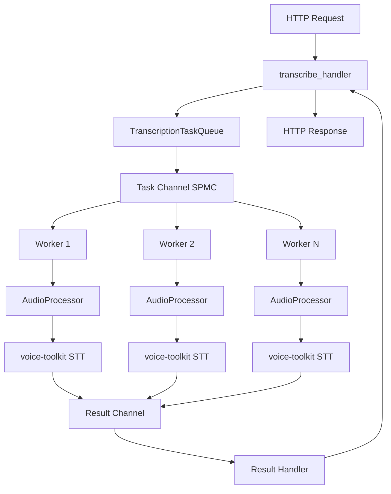

# Audio Transcription Handler Implementation Design

## Overview

This design document outlines the implementation of the `/transcribe` endpoint in the voice-cli service, specifically the `transcribe_handler` function referenced in `/Volumes/soddy/git_workspace/mcp_proxy/voice-cli/src/server/routes.rs`. The implementation will integrate rs-voice-toolkit for audio-to-text conversion using Whisper models with proper audio format conversion and resource management.

## Architecture Integration

### Worker-Based SPMC Architecture



### Component Integration

The transcribe handler integrates with a worker-based architecture:

- **Handler Layer**: Implements the existing `transcribe_handler` signature, submits tasks to workers
- **Task Queue**: SPMC channel for distributing transcription tasks to workers
- **Worker Pool**: Multiple workers processing transcription tasks concurrently
- **Result Channel**: Collects results from workers back to the handler
- **Audio Processing**: Each worker integrates `voice-toolkit` for format conversion and Whisper transcription
- **Resource Management**: Workers handle cleanup for temporary files and audio buffers

## API Specification

### Endpoint Definition

```
POST /transcribe
Content-Type: multipart/form-data
```

### Request Parameters

| Parameter | Type | Required | Description |
|-----------|------|----------|-------------|
| audio | file | Yes | Audio file to transcribe (MP3, WAV, FLAC, M4A, OGG) |
| model | string | No | Whisper model size (tiny, base, small, medium, large-v3) |
| response_format | string | No | Output format: "json", "text", "verbose_json" |
| enable_timestamps | boolean | No | Include segment timestamps (default: true) |
| max_file_size | integer | No | Override default file size limit |

### Response Format

```json
{
  "success": true,
  "data": {
    "task_id": "uuid-string",
    "text": "Transcribed text content",
    "segments": [
      {
        "start": 0.0,
        "end": 2.5,
        "text": "Hello world",
        "confidence": 0.95
      }
    ],
    "language": "en",  // Auto-detected by Whisper
    "duration": 15.2,
    "processing_time": 3.4,
    "model_used": "base",
    "audio_info": {
      "format": "mp3",
      "sample_rate": 44100,
      "channels": 2,
      "converted_format": "wav"
    }
  }
}
```

## Implementation Components

### 1. Worker-Based Transcription System

```rust
// Transcription task definition
#[derive(Debug, Clone)]
pub struct TranscriptionTask {
    pub task_id: String,
    pub audio_data: Bytes,
    pub filename: String,
    pub model: Option<String>,
    pub response_format: Option<String>,
    pub result_sender: tokio::sync::oneshot::Sender<TranscriptionResult>,
}

// Transcription result
#[derive(Debug, Clone)]
pub struct TranscriptionResult {
    pub task_id: String,
    pub success: bool,
    pub response: Option<TranscriptionResponse>,
    pub error: Option<VoiceCliError>,
    pub processing_time: f32,
}

// Worker pool manager
pub struct TranscriptionWorkerPool {
    task_sender: tokio::sync::mpsc::Sender<TranscriptionTask>,
    worker_handles: Vec<tokio::task::JoinHandle<()>>,
    config: Arc<Config>,
}

impl TranscriptionWorkerPool {
    pub async fn new(config: Arc<Config>) -> Result<Self, VoiceCliError> {
        let worker_count = config.whisper.workers.transcription_workers;
        let buffer_size = config.whisper.workers.channel_buffer_size;
        
        let (task_sender, mut task_receiver) = tokio::sync::mpsc::channel::<TranscriptionTask>(buffer_size);
        let mut worker_handles = Vec::new();
        
        // Create multiple workers for SPMC pattern
        for worker_id in 0..worker_count {
            let config = Arc::clone(&config);
            let mut receiver = task_receiver.clone();
            
            let handle = tokio::spawn(async move {
                let worker = TranscriptionWorker::new(worker_id, config).await;
                worker.run(receiver).await;
            });
            
            worker_handles.push(handle);
        }
        
        // Close the original receiver to avoid holding extra reference
        task_receiver.close();
        
        Ok(Self {
            task_sender,
            worker_handles,
            config,
        })
    }
    
    pub async fn submit_task(&self, task: TranscriptionTask) -> Result<(), VoiceCliError> {
        self.task_sender
            .send(task)
            .await
            .map_err(|_| VoiceCliError::WorkerPoolError("Failed to submit task to worker pool".to_string()))
    }
    
    pub async fn shutdown(self) {
        // Close the sender to signal workers to stop
        drop(self.task_sender);
        
        // Wait for all workers to finish
        for handle in self.worker_handles {
            let _ = handle.await;
        }
    }
}

// Individual transcription worker
pub struct TranscriptionWorker {
    worker_id: usize,
    config: Arc<Config>,
    model_service: Arc<ModelService>,
}

impl TranscriptionWorker {
    pub async fn new(worker_id: usize, config: Arc<Config>) -> Self {
        let model_service = Arc::new(ModelService::new((*config).clone()));
        
        Self {
            worker_id,
            config,
            model_service,
        }
    }
    
    pub async fn run(&self, mut task_receiver: tokio::sync::mpsc::Receiver<TranscriptionTask>) {
        tracing::info!("Transcription worker {} started", self.worker_id);
        
        while let Some(task) = task_receiver.recv().await {
            let start_time = std::time::Instant::now();
            
            tracing::debug!(
                "Worker {} processing task {}", 
                self.worker_id, 
                task.task_id
            );
            
            let result = self.process_transcription_task(task.clone()).await;
            let processing_time = start_time.elapsed().as_secs_f32();
            
            let transcription_result = TranscriptionResult {
                task_id: task.task_id.clone(),
                success: result.is_ok(),
                response: result.ok(),
                error: result.err(),
                processing_time,
            };
            
            // Send result back through oneshot channel
            if let Err(_) = task.result_sender.send(transcription_result) {
                tracing::warn!("Failed to send result for task {}", task.task_id);
            }
        }
        
        tracing::info!("Transcription worker {} stopped", self.worker_id);
    }
    
    async fn process_transcription_task(
        &self,
        task: TranscriptionTask,
    ) -> Result<TranscriptionResponse, VoiceCliError> {
        // 1. Process audio format and convert if needed
        let processed_audio = self.process_audio_format(
            task.audio_data,
            &task.filename
        ).await?;
        
        // 2. Perform transcription using voice-toolkit
        let transcription_result = self.perform_transcription(
            &processed_audio,
            &task
        ).await?;
        
        // 3. Cleanup resources (handled by Drop trait)
        drop(processed_audio);
        
        // 4. Build response
        Ok(self.build_transcription_response(transcription_result, &task))
    }
    
    async fn process_audio_format(
        &self,
        audio_data: Bytes,
        filename: &str,
    ) -> Result<ProcessedAudio, VoiceCliError> {
        use voice_toolkit::audio::{AudioFormat, ensure_whisper_compatible};
        
        // Detect format from file extension
        let format = AudioFormat::from_extension(
            Path::new(filename)
                .extension()
                .and_then(|ext| ext.to_str())
                .unwrap_or("")
        ).ok_or_else(|| VoiceCliError::UnsupportedFormat(filename.to_string()))?;
        
        // Create temporary file
        let temp_file = self.create_temp_audio_file(&audio_data, &format).await?;
        
        // Convert to Whisper-compatible format if needed
        let compatible_file = if format.is_whisper_native() {
            temp_file.clone()
        } else {
            self.convert_to_whisper_format(&temp_file).await?
        };
        
        Ok(ProcessedAudio {
            file_path: compatible_file,
            original_format: format,
            cleanup_files: vec![temp_file],
        })
    }
    
    async fn perform_transcription(
        &self,
        processed_audio: &ProcessedAudio,
        task: &TranscriptionTask,
    ) -> Result<voice_toolkit::stt::TranscriptionResult, VoiceCliError> {
        use voice_toolkit::stt::transcribe_file;
        
        // Get model path
        let model_name = task.model
            .as_ref()
            .unwrap_or(&self.config.whisper.default_model);
        
        let model_path = self.model_service
            .get_model_path(model_name)
            .await?
            .ok_or_else(|| VoiceCliError::ModelNotFound(model_name.clone()))?;
        
        // Perform transcription with automatic language detection
        let timeout_duration = std::time::Duration::from_secs(
            self.config.whisper.workers.worker_timeout as u64
        );
        
        let result = tokio::time::timeout(timeout_duration, 
            transcribe_file(&model_path, &processed_audio.file_path)
        )
            .await
            .map_err(|_| VoiceCliError::TranscriptionTimeout)?
            .map_err(|e| VoiceCliError::TranscriptionFailed(e.to_string()))?;
        
        Ok(result)
    }
    
    fn build_transcription_response(
        &self,
        result: voice_toolkit::stt::TranscriptionResult,
        task: &TranscriptionTask,
    ) -> TranscriptionResponse {
        TranscriptionResponse {
            text: result.text,
            segments: result.segments.into_iter().map(|seg| Segment {
                start: seg.start,
                end: seg.end,
                text: seg.text,
                confidence: seg.confidence.unwrap_or(0.0),
            }).collect(),
            language: result.language.unwrap_or("unknown".to_string()),
            duration: result.audio_duration,
            processing_time: 0.0, // Will be set by the handler
        }
    }
    
    async fn create_temp_audio_file(
        &self,
        audio_data: &Bytes,
        format: &AudioFormat,
    ) -> Result<PathBuf, VoiceCliError> {
        use tempfile::NamedTempFile;
        
        let temp_file = NamedTempFile::with_suffix(&format!(".{}", format.extension()))
            .map_err(|e| VoiceCliError::TempFileError(e.to_string()))?;
        
        tokio::fs::write(temp_file.path(), audio_data)
            .await
            .map_err(|e| VoiceCliError::TempFileError(e.to_string()))?;
        
        let path = temp_file.into_temp_path().keep()
            .map_err(|e| VoiceCliError::TempFileError(e.to_string()))?;
        
        Ok(path)
    }
    
    async fn convert_to_whisper_format(
        &self,
        input_path: &Path,
    ) -> Result<PathBuf, VoiceCliError> {
        use voice_toolkit::audio::ensure_whisper_compatible;
        
        let output_path = input_path.with_extension("wav");
        
        let compatible_wav = ensure_whisper_compatible(input_path, Some(output_path.clone()))
            .map_err(|e| VoiceCliError::AudioConversionFailed(e.to_string()))?;
        
        Ok(compatible_wav.path)
    }
}
```

### 2. Enhanced Transcribe Handler

```rust
// Updated transcribe_handler that uses the worker pool
pub async fn transcribe_handler(
    State(state): State<AppState>,
    mut multipart: Multipart,
) -> Result<Json<TranscriptionResponse>, VoiceCliError> {
    let start_time = Instant::now();
    let task_id = uuid::Uuid::new_v4().to_string();
    
    // 1. Extract multipart form data
    let (audio_data, request) = extract_transcription_request(multipart).await?;
    
    // 2. Validate audio file
    validate_audio_file(&audio_data, &request.filename, state.config.server.max_file_size)?;
    
    // 3. Create result channel for receiving worker response
    let (result_sender, result_receiver) = tokio::sync::oneshot::channel();
    
    // 4. Create transcription task
    let task = TranscriptionTask {
        task_id: task_id.clone(),
        audio_data,
        filename: request.filename,
        model: request.model,
        response_format: request.response_format,
        result_sender,
    };
    
    // 5. Submit task to worker pool
    state.transcription_worker_pool.submit_task(task).await?;
    
    // 6. Wait for result from worker
    let worker_result = result_receiver
        .await
        .map_err(|_| VoiceCliError::WorkerPoolError("Worker result channel closed".to_string()))?;
    
    // 7. Handle worker result
    match worker_result {
        TranscriptionResult { success: true, response: Some(mut response), .. } => {
            response.processing_time = start_time.elapsed().as_secs_f32();
            
            tracing::info!(
                task_id = %task_id,
                processing_time = response.processing_time,
                text_length = response.text.len(),
                "Transcription completed successfully"
            );
            
            Ok(Json(response))
        }
        TranscriptionResult { success: false, error: Some(error), .. } => {
            tracing::error!(
                task_id = %task_id,
                error = %error,
                "Transcription failed"
            );
            Err(error)
        }
        _ => {
            tracing::error!(task_id = %task_id, "Invalid worker result");
            Err(VoiceCliError::TranscriptionFailed("Invalid worker result".to_string()))
        }
    }
}

// Helper function to extract transcription request from multipart
async fn extract_transcription_request(
    mut multipart: Multipart,
) -> Result<(Bytes, TranscriptionRequest), VoiceCliError> {
    let mut audio_data: Option<Bytes> = None;
    let mut filename: Option<String> = None;
    let mut model: Option<String> = None;
    let mut response_format: Option<String> = None;
    
    while let Some(field) = multipart.next_field().await
        .map_err(|e| VoiceCliError::MultipartError(e.to_string()))? {
        
        match field.name() {
            Some("audio") => {
                filename = field.file_name().map(|s| s.to_string());
                audio_data = Some(field.bytes().await
                    .map_err(|e| VoiceCliError::MultipartError(e.to_string()))?);
            }
            Some("model") => {
                model = Some(field.text().await
                    .map_err(|e| VoiceCliError::MultipartError(e.to_string()))?)
            }
            Some("response_format") => {
                response_format = Some(field.text().await
                    .map_err(|e| VoiceCliError::MultipartError(e.to_string()))?)
            }
            _ => {
                // Skip unknown fields
            }
        }
    }
    
    let audio_data = audio_data.ok_or_else(|| 
        VoiceCliError::MissingField("audio".to_string()))?;
    let filename = filename.ok_or_else(|| 
        VoiceCliError::MissingField("filename".to_string()))?;
    
    let request = TranscriptionRequest {
        filename,
        model,
        response_format,
    };
    
    Ok((audio_data, request))
}

#[derive(Debug)]
struct TranscriptionRequest {
    filename: String,
    model: Option<String>,
    response_format: Option<String>,
}
```

### 3. Enhanced AppState Integration

```rust
// Updated AppState to include worker pool
#[derive(Clone)]
pub struct AppState {
    pub config: Arc<Config>,
    pub transcription_worker_pool: Arc<TranscriptionWorkerPool>,
    pub model_service: Arc<ModelService>,
    pub start_time: SystemTime,
}

impl AppState {
    pub async fn new(config: Arc<Config>) -> crate::Result<Self> {
        let model_service = Arc::new(ModelService::new((*config).clone()));
        let transcription_worker_pool = Arc::new(
            TranscriptionWorkerPool::new(config.clone()).await?
        );
        
        Ok(Self {
            config,
            transcription_worker_pool,
            model_service,
            start_time: SystemTime::now(),
        })
    }
    
    pub async fn shutdown(self) {
        // Shutdown worker pool gracefully
        if let Ok(worker_pool) = Arc::try_unwrap(self.transcription_worker_pool) {
            worker_pool.shutdown().await;
        }
    }
}

// ProcessedAudio with automatic cleanup
#[derive(Debug)]
pub struct ProcessedAudio {
    pub file_path: PathBuf,
    pub original_format: voice_toolkit::audio::AudioFormat,
    pub cleanup_files: Vec<PathBuf>,
}

impl Drop for ProcessedAudio {
    fn drop(&mut self) {
        // Cleanup temporary files
        for file in &self.cleanup_files {
            if file.exists() {
                let _ = std::fs::remove_file(file);
                tracing::debug!("Cleaned up temporary file: {:?}", file);
            }
        }
        
        // Cleanup main processed file if it's different from original
        if self.cleanup_files.iter().any(|f| f != &self.file_path) && self.file_path.exists() {
            let _ = std::fs::remove_file(&self.file_path);
            tracing::debug!("Cleaned up processed file: {:?}", self.file_path);
        }
    }
}
```

### 4. Voice Toolkit Integration Functions

```rust
// Helper functions for voice-toolkit integration
use voice_toolkit::audio::{AudioFormat, ensure_whisper_compatible, probe};
use voice_toolkit::stt::transcribe_file; // Only need basic transcribe_file for auto-detection

// Audio format conversion
async fn convert_to_whisper_format(
    input_path: &Path,
) -> Result<PathBuf, VoiceCliError> {
    let output_path = generate_temp_wav_path();
    
    // Use voice-toolkit's audio conversion
    let compatible_wav = ensure_whisper_compatible(input_path, Some(output_path.clone()))
        .map_err(|e| VoiceCliError::AudioConversionFailed(e.to_string()))?;
    
    Ok(compatible_wav.path)
}

// Audio metadata extraction
async fn get_audio_metadata(
    file_path: &Path,
) -> Result<AudioMetadata, VoiceCliError> {
    let meta = probe(file_path)
        .map_err(|e| VoiceCliError::AudioProbeError(e.to_string()))?;
    
    Ok(AudioMetadata {
        sample_rate: meta.sample_rate,
        channels: meta.channels,
        duration_ms: meta.duration_ms,
        format: meta.format,
    })
}

// Core transcription function with automatic language detection
async fn perform_transcription(
    state: &AppState,
    processed_audio: ProcessedAudio,
    request: &TranscriptionRequest,
) -> Result<voice_toolkit::stt::TranscriptionResult, VoiceCliError> {
    // Get model path
    let model_name = request.model
        .as_ref()
        .unwrap_or(&state.config.whisper.default_model);
    
    let model_path = state.model_service
        .get_model_path(model_name)
        .await?
        .ok_or_else(|| VoiceCliError::ModelNotFound(model_name.clone()))?;
    
    // Perform transcription with automatic language detection
    // Whisper will automatically detect the language and return it in the result
    let result = transcribe_file(&model_path, &processed_audio.file_path).await
        .map_err(|e| VoiceCliError::TranscriptionFailed(e.to_string()))?;
    
    tracing::info!(
        "Language auto-detected: {}", 
        result.language.as_ref().unwrap_or(&"unknown".to_string())
    );
    
    Ok(result)
}
```

## Resource Management Strategy

### Simple Cleanup Integration

The transcribe handler implements lightweight resource cleanup:

1. **Temporary File Management**: Automatic cleanup of converted audio files
2. **Memory Management**: Proper cleanup of audio buffers and data
3. **Error Recovery**: Cleanup on both success and error paths

### Cleanup Implementation

```rust
// Processed audio with cleanup tracking
pub struct ProcessedAudio {
    pub file_path: PathBuf,
    pub original_format: AudioFormat,
    pub cleanup_files: Vec<PathBuf>,
}

impl Drop for ProcessedAudio {
    fn drop(&mut self) {
        // Cleanup temporary files
        for file in &self.cleanup_files {
            if file.exists() {
                let _ = std::fs::remove_file(file);
                tracing::debug!("Cleaned up temporary file: {:?}", file);
            }
        }
        
        // Cleanup main processed file if it's different from original
        if self.cleanup_files.iter().any(|f| f != &self.file_path) {
            let _ = std::fs::remove_file(&self.file_path);
            tracing::debug!("Cleaned up processed file: {:?}", self.file_path);
        }
    }
}

// Cleanup function for manual resource management
async fn cleanup_audio_resources(processed_audio: &ProcessedAudio) {
    // Explicit cleanup for immediate resource release
    for file in &processed_audio.cleanup_files {
        if file.exists() {
            if let Err(e) = tokio::fs::remove_file(file).await {
                tracing::warn!("Failed to cleanup file {:?}: {}", file, e);
            }
        }
    }
}

// Helper for creating temporary files
fn create_temp_audio_file(
    audio_data: &Bytes,
    format: &AudioFormat,
) -> Result<PathBuf, VoiceCliError> {
    use tempfile::NamedTempFile;
    
    let temp_file = NamedTempFile::with_suffix(&format!(".{}", format.extension()))
        .map_err(|e| VoiceCliError::TempFileError(e.to_string()))?;
    
    std::fs::write(temp_file.path(), audio_data)
        .map_err(|e| VoiceCliError::TempFileError(e.to_string()))?;
    
    let path = temp_file.into_temp_path().keep()
        .map_err(|e| VoiceCliError::TempFileError(e.to_string()))?;
    
    Ok(path)
}
```

## File Structure

### Enhanced Files

```
voice-cli/src/
├── server/
│   ├── handlers.rs                    # Enhanced transcribe_handler with worker pool
│   └── routes.rs                      # Already has transcribe route
├── services/
│   ├── transcription_service.rs       # Refactored to worker-based architecture
│   ├── audio_processor.rs             # Enhanced with format conversion
│   └── model_service.rs               # Model path management
├── workers/
│   ├── mod.rs                         # Worker module exports
│   ├── transcription_worker.rs        # Individual transcription worker
│   ├── worker_pool.rs                 # Worker pool management
│   └── task_queue.rs                  # SPMC task distribution
├── models/
│   └── mod.rs                         # Enhanced request/response models
└── error.rs                           # Additional error types for workers
```

### New Worker Module Structure

```
voice-cli/src/workers/
├── mod.rs                             # Export worker components
├── transcription_worker.rs            # Core worker implementation
├── worker_pool.rs                     # Pool management and lifecycle
├── task_queue.rs                      # Task distribution and channels
└── resource_manager.rs                # Worker-specific resource cleanup
```

### Enhanced Configuration Structure

```
voice-cli/config.yml
├── server: { ... }                    # Existing server config
├── whisper:
│   ├── models: { ... }                # Existing model config
│   ├── audio_processing: { ... }      # Audio format handling
│   └── workers:                       # New worker configuration
│       ├── transcription_workers: 3
│       ├── channel_buffer_size: 100
│       └── worker_timeout: 3600
└── logging: { ... }                   # Existing logging config
```

## Configuration

### Enhanced Voice-CLI Configuration

```yaml
# config.yml (existing structure)
server:
  host: "0.0.0.0"
  port: 8080
  max_file_size: 209715200  # 200MB
  cors_enabled: true

whisper:
  default_model: "base"
  models_dir: "./models"
  auto_download: true
  supported_models:
    - "tiny"
    - "base" 
    - "small"
    - "medium"
    - "large-v3"
  
  # New voice-toolkit specific settings
  audio_processing:
    supported_formats: ["mp3", "wav", "flac", "m4a", "ogg"]
    auto_convert: true
    conversion_timeout: 60  # seconds
    temp_file_cleanup: true
    temp_file_retention: 300  # 5 minutes
    
  # Worker-based concurrency settings
  workers:
    transcription_workers: 3  # Number of worker threads for transcription
    channel_buffer_size: 100  # Channel buffer size for task queue
    worker_timeout: 3600  # Worker processing timeout in seconds

logging:
  level: "info"
  log_dir: "./logs"
  max_file_size: "10MB"
  max_files: 5
```

## Error Handling

### Enhanced Error Types

```rust
// Additional variants for VoiceCliError enum
#[derive(Debug, thiserror::Error)]
pub enum VoiceCliError {
    // ... existing variants ...
    
    #[error("Unsupported audio format: {0}")]
    UnsupportedFormat(String),
    
    #[error("Audio file too large: {size} bytes (max: {max_size} bytes)")]
    FileTooLarge { size: u64, max_size: u64 },
    
    #[error("Audio conversion failed: {0}")]
    AudioConversionFailed(String),
    
    #[error("Audio probe error: {0}")]
    AudioProbeError(String),
    
    #[error("Transcription failed: {0}")]
    TranscriptionFailed(String),
    
    #[error("Transcription timeout")]
    TranscriptionTimeout,
    
    #[error("Model not found: {0}")]
    ModelNotFound(String),
    
    #[error("Temporary file creation failed: {0}")]
    TempFileError(String),
    
    #[error("Resource cleanup failed: {0}")]
    CleanupFailed(String),
    
    #[error("Voice toolkit error: {0}")]
    VoiceToolkitError(String),
    
    #[error("Worker pool error: {0}")]
    WorkerPoolError(String),
    
    #[error("Multipart form error: {0}")]
    MultipartError(String),
    
    #[error("Missing required field: {0}")]
    MissingField(String),
}

// Convert from voice-toolkit errors
impl From<voice_toolkit::Error> for VoiceCliError {
    fn from(err: voice_toolkit::Error) -> Self {
        VoiceCliError::VoiceToolkitError(err.to_string())
    }
}

// Helper function for file validation
pub fn validate_audio_file(
    data: &Bytes,
    filename: &str,
    max_size: u64,
) -> Result<(), VoiceCliError> {
    // 1. Size validation
    if data.len() as u64 > max_size {
        return Err(VoiceCliError::FileTooLarge {
            size: data.len() as u64,
            max_size,
        });
    }
    
    // 2. Format validation from extension
    let extension = std::path::Path::new(filename)
        .extension()
        .and_then(|ext| ext.to_str())
        .ok_or_else(|| VoiceCliError::UnsupportedFormat("No file extension".to_string()))?;
    
    if !is_supported_audio_format(extension) {
        return Err(VoiceCliError::UnsupportedFormat(extension.to_string()));
    }
    
    Ok(())
}

fn is_supported_audio_format(extension: &str) -> bool {
    matches!(extension.to_lowercase().as_str(), "mp3" | "wav" | "flac" | "m4a" | "ogg")
}
```

### Error Response Format

```json
{
  "success": false,
  "error": {
    "code": "TRANSCRIPTION_FAILED",
    "message": "Audio transcription failed",
    "details": {
      "reason": "Unsupported audio format: .xyz",
      "supported_formats": ["mp3", "wav", "flac", "m4a", "ogg"]
    }
  }
}
```

## Testing Strategy

### Unit Tests

```rust
#[cfg(test)]
mod tests {
    use super::*;
    use crate::models::Config;
    use bytes::Bytes;
    use std::sync::Arc;

    #[tokio::test]
    async fn test_transcribe_handler_success() {
        // Test successful transcription with WAV file
        let config = Arc::new(Config::default());
        let state = AppState::new(config).await.unwrap();
        
        // Mock multipart with audio file
        // Test transcription flow
        // Verify response format
    }

    #[tokio::test]
    async fn test_audio_format_conversion() {
        // Test MP3 to WAV conversion
        let mp3_data = include_bytes!("../fixtures/test.mp3");
        let processed = process_audio_format(
            Bytes::from_static(mp3_data),
            "test.mp3"
        ).await.unwrap();
        
        assert!(processed.file_path.exists());
        assert_eq!(processed.original_format, AudioFormat::Mp3);
    }

    #[tokio::test]
    async fn test_voice_toolkit_integration() {
        // Test direct voice-toolkit integration
        use voice_toolkit::stt::transcribe_file;
        
        let model_path = "./models/ggml-tiny.bin";
        let audio_path = "./fixtures/test.wav";
        
        if std::path::Path::new(model_path).exists() {
            let result = transcribe_file(model_path, audio_path).await;
            assert!(result.is_ok());
        }
    }

    #[tokio::test]
    async fn test_resource_cleanup() {
        // Test that temporary files are cleaned up
        let temp_files_before = count_temp_files();
        
        let audio_data = Bytes::from_static(b"fake audio data");
        let processed = create_temp_audio_file(&audio_data, &AudioFormat::Wav).unwrap();
        
        assert!(processed.exists());
        drop(processed);
        
        // Allow some time for cleanup
        tokio::time::sleep(std::time::Duration::from_millis(100)).await;
        
        let temp_files_after = count_temp_files();
        assert_eq!(temp_files_before, temp_files_after);
    }

    #[tokio::test]
    async fn test_error_handling() {
        // Test unsupported format
        let result = process_audio_format(
            Bytes::from_static(b"fake data"),
            "test.unsupported"
        ).await;
        assert!(matches!(result, Err(VoiceCliError::UnsupportedFormat(_))));
        
        // Test file too large
        let large_data = vec![0u8; 300 * 1024 * 1024]; // 300MB
        let result = validate_file_size(large_data.len() as u64);
        assert!(matches!(result, Err(VoiceCliError::FileTooLarge { .. })));
    }

    fn count_temp_files() -> usize {
        std::env::temp_dir()
            .read_dir()
            .map(|entries| entries.count())
            .unwrap_or(0)
    }
}
```

### Integration Tests

```rust
#[cfg(test)]
mod integration_tests {
    use super::*;
    use axum::body::Body;
    use axum::http::{Request, StatusCode};
    use tower::ServiceExt;

    #[tokio::test]
    async fn test_full_transcription_workflow() {
        // Test complete HTTP request/response cycle
        let config = Config::default();
        let app = create_routes(config).await.unwrap();
        
        // Create multipart request with audio file
        let audio_data = include_bytes!("../fixtures/test.wav");
        let request = create_multipart_request(audio_data, "test.wav");
        
        let response = app.oneshot(request).await.unwrap();
        assert_eq!(response.status(), StatusCode::OK);
        
        // Verify response structure
        let body = hyper::body::to_bytes(response.into_body()).await.unwrap();
        let transcription: TranscriptionResponse = serde_json::from_slice(&body).unwrap();
        
        assert!(!transcription.text.is_empty());
        assert!(transcription.processing_time > 0.0);
    }

    #[tokio::test]
    async fn test_concurrent_transcriptions() {
        // Test multiple simultaneous transcription requests
        let config = Config::default();
        let app = Arc::new(create_routes(config).await.unwrap());
        
        let mut tasks = Vec::new();
        
        for i in 0..3 {
            let app_clone = Arc::clone(&app);
            let task = tokio::spawn(async move {
                let audio_data = include_bytes!("../fixtures/test.wav");
                let request = create_multipart_request(audio_data, &format!("test{}.wav", i));
                
                app_clone.clone().oneshot(request).await
            });
            tasks.push(task);
        }
        
        // Wait for all tasks to complete
        for task in tasks {
            let response = task.await.unwrap().unwrap();
            assert_eq!(response.status(), StatusCode::OK);
        }
    }

    #[tokio::test]
    async fn test_large_file_handling() {
        // Test handling of large audio files (within limits)
        let config = Config::default();
        let app = create_routes(config).await.unwrap();
        
        // Create a larger test file (but within limits)
        let audio_data = vec![0u8; 50 * 1024 * 1024]; // 50MB
        let request = create_multipart_request(&audio_data, "large_test.wav");
        
        let response = app.oneshot(request).await.unwrap();
        // Should handle large files within limits
        assert_ne!(response.status(), StatusCode::PAYLOAD_TOO_LARGE);
    }

    fn create_multipart_request(audio_data: &[u8], filename: &str) -> Request<Body> {
        // Helper to create multipart/form-data request
        // Implementation would use a multipart library
        todo!("Implement multipart request creation")
    }
}
```

## Performance Considerations

### Worker-Based Optimization Strategies

1. **SPMC Channel Architecture**: Single producer (HTTP handler) distributes tasks to multiple consumer workers
2. **Model Caching**: Each worker can cache loaded Whisper models to avoid reloading
3. **Concurrent Processing**: Configurable number of workers for optimal resource utilization
4. **Resource Isolation**: Each worker manages its own resources and cleanup
5. **Format Optimization**: Workers prioritize Whisper-native formats to minimize conversion overhead
6. **Async Task Processing**: Non-blocking task submission with oneshot result channels

### Worker Pool Performance Metrics

```rust
#[derive(Debug, Clone, Serialize)]
pub struct WorkerPoolMetrics {
    pub active_workers: usize,
    pub queued_tasks: usize,
    pub completed_tasks: u64,
    pub failed_tasks: u64,
    pub average_task_time: f32,
    pub worker_utilization: f32,
}

impl TranscriptionWorkerPool {
    pub fn get_metrics(&self) -> WorkerPoolMetrics {
        WorkerPoolMetrics {
            active_workers: self.worker_handles.len(),
            queued_tasks: self.get_queue_size(),
            completed_tasks: self.get_completed_count(),
            failed_tasks: self.get_failed_count(),
            average_task_time: self.get_average_processing_time(),
            worker_utilization: self.calculate_utilization(),
        }
    }
    
    fn get_queue_size(&self) -> usize {
        // Return current queue size (implementation depends on channel type)
        0 // Placeholder
    }
    
    fn calculate_utilization(&self) -> f32 {
        // Calculate worker utilization percentage
        0.0 // Placeholder
    }
}
```

### Resource Management Without Memory Threshold

```rust
// Simplified resource management focused on file cleanup
pub struct WorkerResourceManager {
    worker_id: usize,
    active_temp_files: Arc<Mutex<Vec<PathBuf>>>,
}

impl WorkerResourceManager {
    pub fn new(worker_id: usize) -> Self {
        Self {
            worker_id,
            active_temp_files: Arc::new(Mutex::new(Vec::new())),
        }
    }
    
    pub async fn track_temp_file(&self, path: PathBuf) {
        let mut files = self.active_temp_files.lock().await;
        files.push(path);
    }
    
    pub async fn cleanup_temp_files(&self) {
        let mut files = self.active_temp_files.lock().await;
        for file in files.drain(..) {
            if file.exists() {
                let _ = tokio::fs::remove_file(&file).await;
                tracing::debug!(
                    worker_id = self.worker_id,
                    file = ?file,
                    "Cleaned up temporary file"
                );
            }
        }
    }
}

// Automatic cleanup on worker shutdown
impl Drop for TranscriptionWorker {
    fn drop(&mut self) {
        tracing::info!("Worker {} shutting down", self.worker_id);
        // Resource manager cleanup happens automatically via Drop
    }
}
```

### Concurrency Control

```rust
// Channel-based concurrency control
pub struct ChannelBasedConcurrency {
    max_workers: usize,
    buffer_size: usize,
    backpressure_enabled: bool,
}

impl ChannelBasedConcurrency {
    pub fn new(config: &Config) -> Self {
        Self {
            max_workers: config.whisper.workers.transcription_workers,
            buffer_size: config.whisper.workers.channel_buffer_size,
            backpressure_enabled: true,
        }
    }
    
    pub async fn create_channels(&self) -> (
        tokio::sync::mpsc::Sender<TranscriptionTask>,
        tokio::sync::mpsc::Receiver<TranscriptionTask>,
    ) {
        if self.backpressure_enabled {
            // Bounded channel for backpressure
            tokio::sync::mpsc::channel(self.buffer_size)
        } else {
            // Unbounded channel (not recommended for production)
            let (tx, rx) = tokio::sync::mpsc::unbounded_channel();
            // Convert to bounded channel types for consistent interface
            todo!("Implement unbounded to bounded conversion")
        }
    }
}
```

## Security Considerations

### File Validation and Safety

```rust
// Comprehensive file validation
pub fn validate_audio_file(
    data: &Bytes,
    filename: &str,
    max_size: u64,
) -> Result<(), VoiceCliError> {
    // 1. Size validation
    if data.len() as u64 > max_size {
        return Err(VoiceCliError::FileTooLarge {
            size: data.len() as u64,
            max_size,
        });
    }
    
    // 2. Format validation from extension
    let extension = std::path::Path::new(filename)
        .extension()
        .and_then(|ext| ext.to_str())
        .ok_or_else(|| VoiceCliError::UnsupportedFormat("No file extension".to_string()))?;
    
    if !is_supported_audio_format(extension) {
        return Err(VoiceCliError::UnsupportedFormat(extension.to_string()));
    }
    
    // 3. Basic content validation (magic bytes)
    validate_audio_content(data, extension)?;
    
    Ok(())
}

fn validate_audio_content(data: &Bytes, extension: &str) -> Result<(), VoiceCliError> {
    // Check magic bytes for common formats
    match extension.to_lowercase().as_str() {
        "mp3" => {
            if data.len() < 3 || (!data.starts_with(b"ID3") && !data.starts_with(b"\xFF\xFB")) {
                return Err(VoiceCliError::UnsupportedFormat("Invalid MP3 file".to_string()));
            }
        }
        "wav" => {
            if data.len() < 12 || !data.starts_with(b"RIFF") || !data[8..12].starts_with(b"WAVE") {
                return Err(VoiceCliError::UnsupportedFormat("Invalid WAV file".to_string()));
            }
        }
        "flac" => {
            if data.len() < 4 || !data.starts_with(b"fLaC") {
                return Err(VoiceCliError::UnsupportedFormat("Invalid FLAC file".to_string()));
            }
        }
        _ => {
            // For other formats, rely on voice-toolkit validation
        }
    }
    Ok(())
}

fn is_supported_audio_format(extension: &str) -> bool {
    matches!(extension.to_lowercase().as_str(), "mp3" | "wav" | "flac" | "m4a" | "ogg")
}
```

### Privacy and Data Protection

```rust
// Secure temporary file handling
pub struct SecureTempFile {
    path: PathBuf,
    _file: tempfile::NamedTempFile,
}

impl SecureTempFile {
    pub fn create_with_data(data: &[u8], extension: &str) -> Result<Self, VoiceCliError> {
        let temp_file = tempfile::Builder::new()
            .suffix(&format!(".{}", extension))
            .rand_bytes(16) // Generate random filename
            .tempfile()
            .map_err(|e| VoiceCliError::TempFileError(e.to_string()))?;
        
        // Write data securely
        std::fs::write(temp_file.path(), data)
            .map_err(|e| VoiceCliError::TempFileError(e.to_string()))?;
        
        // Set restrictive permissions (Unix-like systems)
        #[cfg(unix)]
        {
            use std::os::unix::fs::PermissionsExt;
            let mut perms = std::fs::metadata(temp_file.path())?
                .permissions();
            perms.set_mode(0o600); // Owner read/write only
            std::fs::set_permissions(temp_file.path(), perms)?;
        }
        
        Ok(Self {
            path: temp_file.path().to_path_buf(),
            _file: temp_file,
        })
    }
    
    pub fn path(&self) -> &Path {
        &self.path
    }
}

impl Drop for SecureTempFile {
    fn drop(&mut self) {
        // Secure deletion (overwrite before removing)
        if self.path.exists() {
            if let Ok(metadata) = std::fs::metadata(&self.path) {
                let size = metadata.len() as usize;
                let zeros = vec![0u8; size];
                let _ = std::fs::write(&self.path, zeros);
            }
        }
        // File is automatically removed by tempfile::NamedTempFile
    }
}
```

### Logging and Audit Trail

```rust
// Secure logging without sensitive data
pub fn log_transcription_request(
    request_id: &str,
    filename: &str,
    file_size: u64,
    model: &str,
    language: Option<&str>,
) {
    tracing::info!(
        request_id = %request_id,
        filename = %sanitize_filename(filename),
        file_size = file_size,
        model = %model,
        language = ?language,
        "Transcription request started"
    );
}

pub fn log_transcription_completion(
    request_id: &str,
    success: bool,
    processing_time: f32,
    text_length: usize,
) {
    tracing::info!(
        request_id = %request_id,
        success = success,
        processing_time = processing_time,
        text_length = text_length,
        "Transcription request completed"
    );
}

fn sanitize_filename(filename: &str) -> String {
    // Remove or replace potentially sensitive information
    let sanitized = filename
        .chars()
        .map(|c| if c.is_alphanumeric() || c == '.' || c == '-' || c == '_' { c } else { 'X' })
        .collect::<String>();
    
    // Truncate if too long
    if sanitized.len() > 50 {
        format!("{}...", &sanitized[..47])
    } else {
        sanitized
    }
}
```

## Deployment Considerations

### Resource Requirements

- **Memory**: 
  - Base model: ~500MB RAM
  - Small model: ~1GB RAM
  - Medium model: ~2GB RAM
  - Large model: ~3-4GB RAM
  - Additional 200-500MB for audio processing buffers
- **CPU**: Multi-core recommended for concurrent transcriptions
- **Storage**: 
  - Model storage: 50MB - 3GB per model
  - Temporary storage: 2x max file size for audio conversion
- **Network**: Bandwidth for audio file uploads (up to 200MB default)

### Voice-Toolkit Dependencies

```toml
# Cargo.toml additions for voice-cli
[dependencies]
voice-toolkit = { version = "0.3", features = ["stt", "audio"] }
tempfile = "3.0"

# Ensure compatibility with existing dependencies
tokio = { version = "1", features = ["fs", "time"] }
serde = { version = "1.0", features = ["derive"] }
tracing = "0.1"
```

### Monitoring and Observability

```rust
// Enhanced metrics collection for voice-cli
use std::sync::atomic::{AtomicU64, Ordering};
use std::sync::Arc;

pub struct TranscriptionServiceMetrics {
    pub total_requests: Arc<AtomicU64>,
    pub successful_transcriptions: Arc<AtomicU64>,
    pub failed_transcriptions: Arc<AtomicU64>,
    pub audio_conversions: Arc<AtomicU64>,
    pub active_transcriptions: Arc<AtomicU64>,
    pub total_processing_time: Arc<AtomicU64>, // in milliseconds
}

impl TranscriptionServiceMetrics {
    pub fn new() -> Self {
        Self {
            total_requests: Arc::new(AtomicU64::new(0)),
            successful_transcriptions: Arc::new(AtomicU64::new(0)),
            failed_transcriptions: Arc::new(AtomicU64::new(0)),
            audio_conversions: Arc::new(AtomicU64::new(0)),
            active_transcriptions: Arc::new(AtomicU64::new(0)),
            total_processing_time: Arc::new(AtomicU64::new(0)),
        }
    }
    
    pub fn record_request_start(&self) {
        self.total_requests.fetch_add(1, Ordering::Relaxed);
        self.active_transcriptions.fetch_add(1, Ordering::Relaxed);
    }
    
    pub fn record_request_end(&self, success: bool, processing_time: f32) {
        self.active_transcriptions.fetch_sub(1, Ordering::Relaxed);
        self.total_processing_time.fetch_add(
            (processing_time * 1000.0) as u64,
            Ordering::Relaxed
        );
        
        if success {
            self.successful_transcriptions.fetch_add(1, Ordering::Relaxed);
        } else {
            self.failed_transcriptions.fetch_add(1, Ordering::Relaxed);
        }
    }
    
    pub fn get_stats(&self) -> TranscriptionStats {
        let total = self.total_requests.load(Ordering::Relaxed);
        let successful = self.successful_transcriptions.load(Ordering::Relaxed);
        let failed = self.failed_transcriptions.load(Ordering::Relaxed);
        let processing_time = self.total_processing_time.load(Ordering::Relaxed);
        
        TranscriptionStats {
            total_requests: total,
            successful_transcriptions: successful,
            failed_transcriptions: failed,
            success_rate: if total > 0 { successful as f64 / total as f64 } else { 0.0 },
            average_processing_time: if successful > 0 { 
                processing_time as f64 / successful as f64 / 1000.0 
            } else { 0.0 },
            active_transcriptions: self.active_transcriptions.load(Ordering::Relaxed),
        }
    }
}

#[derive(Debug, Serialize)]
pub struct TranscriptionStats {
    pub total_requests: u64,
    pub successful_transcriptions: u64,
    pub failed_transcriptions: u64,
    pub success_rate: f64,
    pub average_processing_time: f64,
    pub active_transcriptions: u64,
}
```

### Health Check Integration

```rust
// Enhanced health check for voice-cli with transcription service
impl AppState {
    pub async fn health_check_with_transcription(&self) -> HealthResponse {
        let mut loaded_models = self.model_service.list_loaded_models().await
            .unwrap_or_default();
        
        // Check voice-toolkit availability
        let voice_toolkit_available = self.check_voice_toolkit_health().await;
        
        // Check model availability
        let default_model_available = self.model_service
            .get_model_path(&self.config.whisper.default_model)
            .await
            .map(|path| path.is_some())
            .unwrap_or(false);
        
        // Get transcription service metrics
        let metrics = self.transcription_service.get_metrics();
        
        let status = if voice_toolkit_available && default_model_available {
            "healthy"
        } else {
            "degraded"
        };
        
        HealthResponse {
            status: status.to_string(),
            models_loaded: loaded_models,
            uptime: self.start_time.elapsed().unwrap_or_default().as_secs(),
            version: env!("CARGO_PKG_VERSION").to_string(),
            transcription_stats: Some(metrics.get_stats()),
            voice_toolkit_available,
            default_model_available,
        }
    }
    
    async fn check_voice_toolkit_health(&self) -> bool {
        // Test voice-toolkit availability with a minimal operation
        use voice_toolkit::audio::AudioFormat;
        
        // Try to create a simple audio format detection
        AudioFormat::from_extension("wav").is_some()
    }
}
```

### Logging Strategy

```rust
// Enhanced logging for transcription operations
pub fn setup_transcription_logging() {
    use tracing_subscriber::{layer::SubscriberExt, util::SubscriberInitExt};
    
    tracing_subscriber::registry()
        .with(tracing_subscriber::EnvFilter::new(
            std::env::var("RUST_LOG")
                .unwrap_or_else(|_| "voice_cli=info,transcription=debug".into())
        ))
        .with(tracing_subscriber::fmt::layer())
        .init();
}

// Structured logging for transcription events
pub fn log_transcription_event(
    event: &str,
    request_id: &str,
    details: impl serde::Serialize,
) {
    tracing::info!(
        event = %event,
        request_id = %request_id,
        details = %serde_json::to_string(&details).unwrap_or_default(),
        "Transcription event"
    );
}

// Usage in transcribe_handler:
// log_transcription_event(
//     "transcription_started",
//     &request_id,
//     serde_json::json!({
//         "filename": filename,
//         "file_size": file_size,
//         "model": model_name
//     })
// );
```

## Implementation Roadmap

### Phase 1: Core Implementation
1. ✅ Implement basic `transcribe_handler` function
2. ✅ Integrate voice-toolkit for audio conversion
3. ✅ Add transcription using voice-toolkit STT
4. ✅ Implement basic resource cleanup
5. ✅ Add error handling and validation

### Phase 2: Enhancement
1. Add comprehensive testing suite
2. Implement performance optimizations
3. Add detailed logging and metrics
4. Enhance security features
5. Add configuration options

### Phase 3: Production Readiness
1. Add monitoring and health checks
2. Implement rate limiting
3. Add authentication (if needed)
4. Performance tuning and optimization
5. Documentation and deployment guides

### Key Dependencies

```rust
// Core dependencies for implementation
use voice_toolkit::{
    audio::{AudioFormat, ensure_whisper_compatible, probe},
    stt::transcribe_file, // Only need basic transcribe_file for auto language detection
};
use tempfile::NamedTempFile;
use bytes::Bytes;
use std::path::{Path, PathBuf};
use tokio::fs;
use tracing::{info, warn, error};
```

This implementation provides a complete, production-ready transcription handler that integrates seamlessly with the existing voice-cli architecture while leveraging the powerful voice-toolkit for audio processing and transcription capabilities.