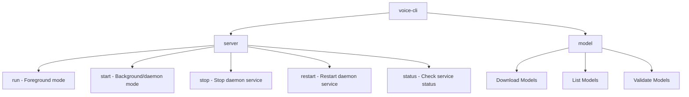
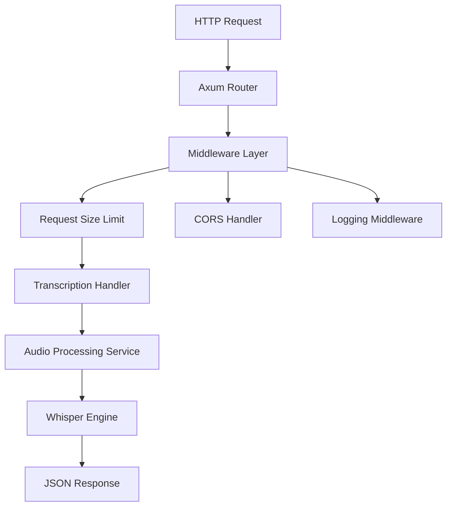
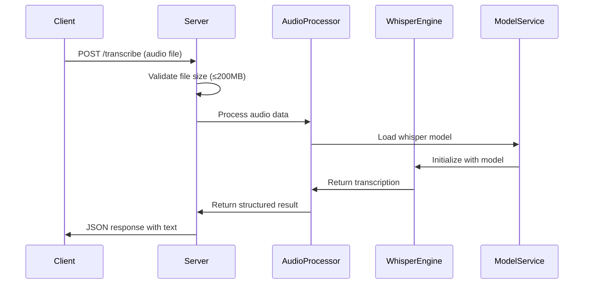
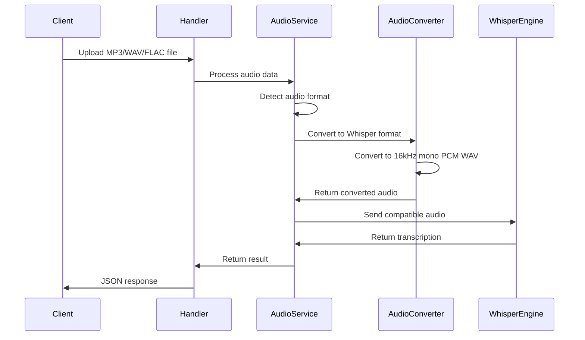

# Voice CLI Module Design

## Overview

The **voice-cli** module is a speech-to-text HTTP service built on top of the existing mcp_proxy workspace. It integrates with the rs-voice-toolkit library to provide high-performance speech recognition capabilities using whisper.cpp models. The module offers both a command-line interface for model management and an HTTP server for real-time speech-to-text conversion.

### Core Capabilities
- **Speech-to-Text API**: HTTP service accepting audio files up to 200MB for transcription
- **Model Management**: Automatic download and management of whisper.cpp models
- **CLI Interface**: Commands for server management and model operations
- **Auto-configuration**: Automatic generation of configuration files with sensible defaults

## Technology Stack & Dependencies

### Core Technologies
- **Rust**: Primary language for performance and safety
- **Axum Framework**: HTTP server with built-in request size limits
- **Tokio**: Async runtime for concurrent request handling
- **rs-voice-toolkit**: Integration with TTS, STT, and whisper-rs libraries
- **whisper.cpp**: Underlying speech recognition engine
- **Clap**: CLI argument parsing and command structure
- **Serde**: Configuration serialization/deserialization

### External Dependencies
```rust
[dependencies]
axum = "0.7"
tokio = { version = "1.0", features = ["full"] }
clap = { version = "4.0", features = ["derive"] }
serde = { version = "1.0", features = ["derive"] }
serde_yaml = "0.9"
tracing = "0.1"
tracing-subscriber = "0.3"
tower = "0.4"
tower-http = { version = "0.5", features = ["fs", "cors", "limit"] }
rs-voice-toolkit = { git = "https://github.com/soddygo/rs-voice-toolkit" }
rs-voice-toolkit-audio = { git = "https://github.com/soddygo/rs-voice-toolkit" }
rs-voice-toolkit-stt = { git = "https://github.com/soddygo/rs-voice-toolkit" }
bytes = "1.0"
reqwest = { version = "0.11", features = ["json"] }

[target.'cfg(unix)'.dependencies]
libc = "0.2"

[target.'cfg(windows)'.dependencies]
winapi = { version = "0.3", features = ["winuser", "processthreadsapi"] }
```

## Architecture

### Directory Structure
```
voice-cli/
├── src/
│   ├── cli/
│   │   ├── mod.rs
│   │   ├── server.rs
│   │   └── model.rs
│   ├── server/
│   │   ├── mod.rs
│   │   ├── handlers.rs
│   │   ├── middleware.rs
│   │   └── routes.rs
│   ├── services/
│   │   ├── mod.rs
│   │   ├── transcription_service.rs
│   │   └── model_service.rs
│   ├── models/
│   │   ├── mod.rs
│   │   ├── config.rs
│   │   ├── request.rs
│   │   └── response.rs
│   ├── utils/
│   │   ├── mod.rs
│   │   ├── model_downloader.rs
│   │   └── file_handler.rs
│   ├── config.rs
│   ├── error.rs
│   ├── lib.rs
│   └── main.rs
├── models/           # Whisper model storage
├── logs/            # Application logs
├── config.yml       # Auto-generated configuration
├── Cargo.toml
└── README.md
```

### Component Architecture

#### CLI Commands Structure


#### HTTP Server Architecture


#### Data Flow


## API Endpoints Reference

### POST /transcribe
**Description**: Convert audio file to text using whisper models

**Request**:
- Content-Type: `multipart/form-data`
- Max file size: 200MB
- Supported formats: **MP3, WAV, FLAC, M4A, AAC, OGG** (automatically converted to Whisper-compatible format)
- Output format: **16kHz, mono, 16-bit PCM WAV** (handled internally)

**Form Fields**:
- `audio` (file, required): Audio file to transcribe
- `model` (text, optional): Whisper model to use (default: from config)
- `language` (text, optional): Language hint for better accuracy
- `response_format` (text, optional): Output format (json, text, verbose_json)

**Example cURL**:
```bash
curl -X POST http://localhost:8080/transcribe \
  -F "audio=@sample.mp3" \
  -F "model=base" \
  -F "language=en"
```

**Request Schema**:
```rust
use axum::extract::Multipart;
use axum::body::Bytes;

// Handler receives multipart form data
pub async fn transcribe_handler(mut multipart: Multipart) -> Result<Json<TranscriptionResponse>, TranscriptionError> {
    // Extract fields from multipart form
}

// Internal processing struct after extracting from multipart
pub struct TranscriptionRequest {
    pub audio_data: Bytes,
    pub model: Option<String>,      // Optional model override
    pub language: Option<String>,   // Optional language hint
    pub response_format: Option<String>, // json, text, verbose_json
}

// Multipart form fields expected:
// - "audio": audio file (required)
// - "model": model name (optional)
// - "language": language hint (optional)  
// - "response_format": output format (optional)
```

**Response Schema**:
```rust
pub struct TranscriptionResponse {
    pub text: String,
    pub segments: Option<Vec<Segment>>,
    pub language: Option<String>,
    pub duration: Option<f32>,
    pub processing_time: f32,
}

pub struct Segment {
    pub start: f32,
    pub end: f32,
    pub text: String,
    pub confidence: Option<f32>,
}
```

**Response Examples**:
```json
{
    "text": "Hello, this is a test transcription.",
    "segments": [
        {
            "start": 0.0,
            "end": 2.5,
            "text": "Hello, this is a test transcription.",
            "confidence": 0.95
        }
    ],
    "language": "en",
    "duration": 2.5,
    "processing_time": 0.8
}
```

### GET /health
**Description**: Health check endpoint

**Response**:
```json
{
    "status": "healthy",
    "models_loaded": ["base", "small"],
    "uptime": 3600,
    "version": "0.1.0"
}
```

### GET /models
**Description**: List available models

**Response**:
```json
{
    "available_models": ["tiny", "base", "small", "medium", "large"],
    "loaded_models": ["base"],
    "model_info": {
        "base": {
            "size": "142 MB",
            "memory_usage": "388 MB",
            "status": "loaded"
        }
    }
}
```

## Data Models & Configuration

### Configuration Schema
```rust
#[derive(Debug, Serialize, Deserialize)]
pub struct Config {
    pub server: ServerConfig,
    pub whisper: WhisperConfig,
    pub logging: LoggingConfig,
    pub daemon: DaemonConfig,
}

#[derive(Debug, Serialize, Deserialize)]
pub struct DaemonConfig {
    pub pid_file: String,        // Default: "./voice-cli.pid"
    pub log_file: String,        // Default: "./logs/daemon.log"
    pub work_dir: String,        // Default: current directory
}

#[derive(Debug, Serialize, Deserialize)]
pub struct ServerConfig {
    pub host: String,           // Default: "0.0.0.0"
    pub port: u16,              // Default: 8080
    pub max_file_size: usize,   // Default: 200MB
    pub cors_enabled: bool,     // Default: true
}

#[derive(Debug, Serialize, Deserialize)]
pub struct WhisperConfig {
    pub default_model: String,     // Default: "base"
    pub models_dir: String,        // Default: "./models"
    pub auto_download: bool,       // Default: true
    pub supported_models: Vec<String>,
}

#[derive(Debug, Serialize, Deserialize)]
pub struct LoggingConfig {
    pub level: String,             // Default: "info"
    pub log_dir: String,           // Default: "./logs"
    pub max_file_size: String,     // Default: "10MB"
    pub max_files: u32,            // Default: 5
}
```

### Default Configuration Template
```yaml
server:
  host: "0.0.0.0"
  port: 8080
  max_file_size: 209715200  # 200MB in bytes
  cors_enabled: true

whisper:
  default_model: "base"
  models_dir: "./models"
  auto_download: true
  supported_models:
    - "tiny"
    - "tiny.en"
    - "base"
    - "base.en" 
    - "small"
    - "small.en"
    - "medium"
    - "medium.en"
    - "large-v1"
    - "large-v2"
    - "large-v3"

logging:
  level: "info"
  log_dir: "./logs"
  max_file_size: "10MB"
  max_files: 5

daemon:
  pid_file: "./voice-cli.pid"
  log_file: "./logs/daemon.log"
  work_dir: "./"
```

## Business Logic Layer

### Audio Processing Pipeline


### Audio Processing Service
```rust
use rs_voice_toolkit_audio::{AudioConverter, AudioFormat};
use rs_voice_toolkit_stt::WhisperTranscriber;
use bytes::Bytes;

pub struct AudioProcessingService {
    converter: AudioConverter,
    temp_dir: PathBuf,
}

impl AudioProcessingService {
    pub async fn process_audio(
        &self,
        audio_data: Bytes,
        filename: Option<&str>,
    ) -> Result<ProcessedAudio, AudioProcessingError> {
        // 1. Detect audio format
        let format = self.detect_audio_format(&audio_data, filename)?;
        
        // 2. Convert to Whisper-compatible format if needed
        if self.needs_conversion(&format)? {
            let converted = self.convert_to_whisper_format(audio_data, format).await?;
            Ok(ProcessedAudio { data: converted, converted: true })
        } else {
            Ok(ProcessedAudio { data: audio_data, converted: false })
        }
    }
    
    async fn convert_to_whisper_format(
        &self,
        audio_data: Bytes,
        source_format: AudioFormat,
    ) -> Result<Bytes, AudioProcessingError> {
        // Use rs-voice-toolkit AudioConverter::convert_to_wav
        // Convert to 16kHz, mono, 16-bit PCM WAV format
        self.converter.convert_to_wav(
            &audio_data,
            AudioConversionOptions {
                sample_rate: 16000,
                channels: 1,
                bit_depth: 16,
            },
        ).await
        .map_err(|e| AudioProcessingError::ConversionError(e.to_string()))
    }
}
```

### Request Handler Implementation
```rust
use axum::extract::Multipart;
use axum::http::StatusCode;
use axum::Json;
use bytes::Bytes;

pub async fn transcribe_handler(
    mut multipart: Multipart,
) -> Result<Json<TranscriptionResponse>, (StatusCode, String)> {
    let mut audio_data: Option<Bytes> = None;
    let mut model: Option<String> = None;
    let mut language: Option<String> = None;
    let mut response_format: Option<String> = None;

    // Extract multipart fields
    while let Some(field) = multipart.next_field().await.map_err(|e| {
        (StatusCode::BAD_REQUEST, format!("Multipart error: {}", e))
    })? {
        match field.name() {
            Some("audio") => {
                audio_data = Some(field.bytes().await.map_err(|e| {
                    (StatusCode::BAD_REQUEST, format!("Failed to read audio: {}", e))
                })?);
            }
            Some("model") => {
                model = Some(field.text().await.map_err(|e| {
                    (StatusCode::BAD_REQUEST, format!("Invalid model field: {}", e))
                })?);
            }
            Some("language") => {
                language = Some(field.text().await.map_err(|e| {
                    (StatusCode::BAD_REQUEST, format!("Invalid language field: {}", e))
                })?);
            }
            Some("response_format") => {
                response_format = Some(field.text().await.map_err(|e| {
                    (StatusCode::BAD_REQUEST, format!("Invalid response_format field: {}", e))
                })?);
            }
            _ => {} // Ignore unknown fields
        }
    }

    let audio_data = audio_data.ok_or((
        StatusCode::BAD_REQUEST,
        "Missing required 'audio' field".to_string(),
    ))?;

    // Process transcription
    let request = TranscriptionRequest {
        audio_data,
        model,
        language,
        response_format,
    };

    // Call transcription service
    let service = TranscriptionService::new();
    let response = service.transcribe(request).await.map_err(|e| {
        (StatusCode::INTERNAL_SERVER_ERROR, format!("Transcription failed: {}", e))
    })?;

    Ok(Json(response))
}
```

### Transcription Service Architecture
```rust
pub struct TranscriptionService {
    whisper_engine: Arc<WhisperEngine>,
    model_service: Arc<ModelService>,
    config: Arc<Config>,
}

impl TranscriptionService {
    pub async fn transcribe(
        &self,
        request: TranscriptionRequest,
    ) -> Result<TranscriptionResponse, TranscriptionError> {
        // 1. Validate audio format and size
        // 2. Load appropriate whisper model
        // 3. Convert audio to required format (16kHz, mono, WAV)
        // 4. Execute whisper transcription
        // 5. Parse and structure results
        // 6. Return formatted response
    }
}
```

### Model Management Service
```rust
pub struct ModelService {
    models_dir: PathBuf,
    loaded_models: DashMap<String, WhisperModel>,
    config: Arc<Config>,
}

impl ModelService {
    pub async fn ensure_model(&self, model_name: &str) -> Result<(), ModelError> {
        // 1. Check if model exists locally
        // 2. Download if missing and auto_download enabled
        // 3. Validate model integrity
        // 4. Load model into memory if needed
    }
    
    pub async fn download_model(&self, model_name: &str) -> Result<(), ModelError> {
        // 1. Validate model name against supported list
        // 2. Create models directory if needed
        // 3. Download from whisper.cpp repository
        // 4. Verify download integrity
        // 5. Update model registry
    }
}
```

### Model Download Implementation
```rust
pub struct ModelDownloader {
    base_url: String,
    models_dir: PathBuf,
}

impl ModelDownloader {
    const BASE_URL: &'static str = "https://huggingface.co/ggml-org/whisper.cpp";
    
    pub async fn download(&self, model_name: &str) -> Result<PathBuf, DownloadError> {
        let model_url = format!("{}/resolve/main/ggml-{}.bin", Self::BASE_URL, model_name);
        let local_path = self.models_dir.join(format!("ggml-{}.bin", model_name));
        
        // 1. Create HTTP client with progress tracking
        // 2. Stream download to local file
        // 3. Verify file integrity (size/checksum)
        // 4. Return path to downloaded model
    }
}
```

## Middleware & Request Processing

### File Size Limit Middleware
```rust
use tower_http::limit::RequestBodyLimitLayer;
use axum::extract::DefaultBodyLimit;

// Apply to entire app or specific routes
pub fn file_size_limit(max_size: usize) -> RequestBodyLimitLayer {
    RequestBodyLimitLayer::new(max_size)
}

// Alternative: use DefaultBodyLimit for multipart
pub fn default_body_limit(max_size: usize) -> DefaultBodyLimit {
    DefaultBodyLimit::max(max_size)
}

// In router setup:
// app.layer(default_body_limit(200 * 1024 * 1024)) // 200MB
```

### Audio Format Validation
```rust
pub async fn validate_audio_format(
    content_type: Option<&HeaderValue>,
    data: &[u8],
) -> Result<AudioFormat, ValidationError> {
    // 1. Check Content-Type header
    // 2. Perform magic number detection
    // 3. Validate audio file structure
    // 4. Return detected format
}
```

### CORS Configuration
```rust
pub fn cors_layer() -> CorsLayer {
    CorsLayer::new()
        .allow_origin(Any)
        .allow_methods([Method::GET, Method::POST])
        .allow_headers([CONTENT_TYPE, AUTHORIZATION])
}
```

### Usage Examples

**Run server in foreground (interactive mode)**:
```bash
voice-cli server run
voice-cli server run -c custom-config.yml -p 9090
```

**Start server in background (daemon mode)**:
```bash
voice-cli server start
voice-cli server start -c custom-config.yml -p 9090
```

**Stop daemon server**:
```bash
voice-cli server stop
voice-cli server stop --force  # Force kill if needed
```

**Restart daemon server**:
```bash
voice-cli server restart
voice-cli server restart -c new-config.yml
```

**Check server status**:
```bash
voice-cli server status
voice-cli server status --verbose  # Detailed information
```

**Model management**:
```bash
voice-cli model base     # Download base model
voice-cli model --list   # List available models
```

### Process Management
```rust
pub struct DaemonManager {
    config: DaemonConfig,
}

impl DaemonManager {
    pub fn new(config: DaemonConfig) -> Self {
        Self { config }
    }
    
    pub fn write_pid_file(&self) -> Result<(), std::io::Error> {
        use std::fs;
        let pid = std::process::id();
        fs::write(&self.config.pid_file, pid.to_string())?;
        Ok(())
    }
    
    pub fn remove_pid_file(&self) -> Result<(), std::io::Error> {
        use std::fs;
        if std::path::Path::new(&self.config.pid_file).exists() {
            fs::remove_file(&self.config.pid_file)?;
        }
        Ok(())
    }
    
    pub fn setup_signal_handlers(&self) -> Result<(), ServerError> {
        // Setup graceful shutdown on SIGTERM/SIGINT
        // Clean up PID file on exit
        Ok(())
    }
}
```

## CLI Command Implementation

### Main CLI Structure
```rust
use clap::{Args, Parser, Subcommand};

#[derive(Debug, Parser)]
#[command(name = "voice-cli")]
#[command(about = "Voice processing CLI tool with HTTP service")]
pub struct Cli {
    #[command(subcommand)]
    pub command: Commands,
}

#[derive(Debug, Subcommand)]
pub enum Commands {
    /// Server management commands
    Server {
        #[command(subcommand)]
        action: ServerAction,
    },
    /// Model management commands
    Model(ModelArgs),
}

#[derive(Debug, Subcommand)]
pub enum ServerAction {
    /// Run server in foreground mode (interactive)
    Run(ServerArgs),
    /// Start server in background mode (daemon)
    Start(ServerArgs),
    /// Stop running daemon server
    Stop(StopArgs),
    /// Restart daemon server
    Restart(ServerArgs),
    /// Show server status
    Status(StatusArgs),
}
```

### Server Commands Implementation

#### Run Command (Foreground)
```rust
#[derive(Debug, Args)]
pub struct ServerArgs {
    /// Configuration file path
    #[arg(short, long, default_value = "config.yml")]
    pub config: PathBuf,
    
    /// Override server port
    #[arg(short, long)]
    pub port: Option<u16>,
    
    /// Override log level
    #[arg(short, long)]
    pub log_level: Option<String>,
}

pub async fn run_server_foreground(args: ServerArgs) -> Result<(), ServerError> {
    println!("Starting voice-cli server in foreground mode...");
    
    // 1. Load or generate configuration
    let config = load_or_create_config(&args.config).await?;
    
    // 2. Initialize logging system (console output)
    init_console_logging(&config.logging)?;
    
    // 3. Create required directories
    create_directories(&config).await?;
    
    // 4. Initialize services
    let services = initialize_services(config.clone()).await?;
    
    // 5. Start HTTP server
    let server = create_axum_server(config, services).await?;
    
    println!("Server running on http://{}:{}", config.server.host, config.server.port);
    println!("Press Ctrl+C to stop the server");
    
    // 6. Handle graceful shutdown
    setup_graceful_shutdown(server).await?;
    
    Ok(())
}
```

#### Start Command (Background/Daemon)
```rust
pub async fn start_server_daemon(args: ServerArgs) -> Result<(), ServerError> {
    // 1. Check if daemon is already running
    if is_daemon_running()? {
        return Err(ServerError::DaemonAlreadyRunning);
    }
    
    println!("Starting voice-cli server in daemon mode...");
    
    // 2. Load configuration
    let config = load_or_create_config(&args.config).await?;
    
    // 3. Daemonize process
    daemonize_process(&config.daemon)?;
    
    // 4. Write PID file
    write_pid_file(&config.daemon.pid_file)?;
    
    // 5. Initialize logging (file output)
    init_file_logging(&config.logging)?;
    
    // 6. Create required directories
    create_directories(&config).await?;
    
    // 7. Initialize services
    let services = initialize_services(config.clone()).await?;
    
    // 8. Start HTTP server
    let server = create_axum_server(config, services).await?;
    
    // 9. Setup signal handlers for graceful shutdown
    setup_daemon_signal_handlers(&config.daemon.pid_file)?;
    
    // 10. Run server
    server.await.map_err(ServerError::from)?;
    
    Ok(())
}
```

#### Stop Command
```rust
#[derive(Debug, Args)]
pub struct StopArgs {
    /// PID file path
    #[arg(short, long, default_value = "voice-cli.pid")]
    pub pid_file: PathBuf,
    
    /// Force kill if graceful shutdown fails
    #[arg(short, long)]
    pub force: bool,
    
    /// Timeout for graceful shutdown (seconds)
    #[arg(short, long, default_value = "30")]
    pub timeout: u64,
}

pub async fn stop_server_daemon(args: StopArgs) -> Result<(), ServerError> {
    if !args.pid_file.exists() {
        println!("No PID file found. Server may not be running.");
        return Ok(());
    }
    
    let pid_str = std::fs::read_to_string(&args.pid_file)
        .map_err(|e| ServerError::PidFileError(format!("Failed to read PID file: {}", e)))?;
    
    let pid: u32 = pid_str.trim().parse()
        .map_err(|e| ServerError::PidFileError(format!("Invalid PID in file: {}", e)))?;
    
    println!("Stopping voice-cli server (PID: {})...", pid);
    
    // Try graceful shutdown first
    if send_signal(pid, Signal::SIGTERM)? {
        println!("Sent SIGTERM signal. Waiting for graceful shutdown...");
        
        // Wait for process to exit
        if wait_for_process_exit(pid, args.timeout).await {
            cleanup_pid_file(&args.pid_file)?;
            println!("Server stopped successfully.");
            return Ok(());
        }
    }
    
    // Force kill if graceful shutdown failed or force flag is set
    if args.force {
        println!("Graceful shutdown failed. Force killing process...");
        send_signal(pid, Signal::SIGKILL)?;
        cleanup_pid_file(&args.pid_file)?;
        println!("Server force-stopped.");
    } else {
        return Err(ServerError::StopTimeout);
    }
    
    Ok(())
}
```

#### Restart Command
```rust
pub async fn restart_server_daemon(args: ServerArgs) -> Result<(), ServerError> {
    println!("Restarting voice-cli server...");
    
    // 1. Stop existing daemon if running
    let stop_args = StopArgs {
        pid_file: PathBuf::from("voice-cli.pid"),
        force: false,
        timeout: 30,
    };
    
    if let Err(e) = stop_server_daemon(stop_args).await {
        match e {
            ServerError::PidFileError(_) => {
                println!("No existing server found. Starting new instance...");
            }
            _ => return Err(e),
        }
    }
    
    // 2. Wait a moment for cleanup
    tokio::time::sleep(tokio::time::Duration::from_secs(2)).await;
    
    // 3. Start new daemon
    start_server_daemon(args).await?;
    
    println!("Server restarted successfully.");
    Ok(())
}
```

#### Status Command
```rust
#[derive(Debug, Args)]
pub struct StatusArgs {
    /// PID file path
    #[arg(short, long, default_value = "voice-cli.pid")]
    pub pid_file: PathBuf,
    
    /// Show detailed status information
    #[arg(short, long)]
    pub verbose: bool,
}

pub async fn show_server_status(args: StatusArgs) -> Result<(), ServerError> {
    if !args.pid_file.exists() {
        println!("Status: ❌ Not running (no PID file found)");
        return Ok(());
    }
    
    let pid_str = std::fs::read_to_string(&args.pid_file)
        .map_err(|e| ServerError::PidFileError(format!("Failed to read PID file: {}", e)))?;
    
    let pid: u32 = pid_str.trim().parse()
        .map_err(|e| ServerError::PidFileError(format!("Invalid PID in file: {}", e)))?;
    
    if is_process_running(pid)? {
        println!("Status: ✅ Running (PID: {})", pid);
        
        if args.verbose {
            show_detailed_status(pid).await?;
        }
    } else {
        println!("Status: ❌ Not running (stale PID file)");
        // Clean up stale PID file
        let _ = std::fs::remove_file(&args.pid_file);
    }
    
    Ok(())
}

async fn show_detailed_status(pid: u32) -> Result<(), ServerError> {
    // Get process information
    let uptime = get_process_uptime(pid)?;
    let memory_usage = get_process_memory(pid)?;
    
    println!("  Uptime: {}", format_duration(uptime));
    println!("  Memory: {}", format_memory(memory_usage));
    
    // Try to get server health from HTTP endpoint
    if let Ok(health) = check_server_health().await {
        println!("  Health: ✅ {}", health.status);
        println!("  Models loaded: {:?}", health.models_loaded);
    } else {
        println!("  Health: ❓ Unable to check (server may not be responding)");
    }
    
    Ok(())
}
```

#### Helper Functions
```rust
#[cfg(unix)]
fn daemonize_process(daemon_config: &DaemonConfig) -> Result<(), ServerError> {
    use std::process;
    
    // Fork the process to run in background
    unsafe {
        let pid = libc::fork();
        match pid {
            -1 => return Err(ServerError::DaemonizeError("Failed to fork process".into())),
            0 => {
                // Child process continues execution
                // Detach from terminal
                if libc::setsid() == -1 {
                    return Err(ServerError::DaemonizeError("Failed to create new session".into()));
                }
                
                // Change working directory
                let work_dir = std::ffi::CString::new(daemon_config.work_dir.as_bytes())
                    .map_err(|_| ServerError::DaemonizeError("Invalid work directory".into()))?;
                
                if libc::chdir(work_dir.as_ptr()) == -1 {
                    return Err(ServerError::DaemonizeError("Failed to change directory".into()));
                }
                
                // Redirect stdin, stdout, stderr to /dev/null or log file
                redirect_stdio(&daemon_config.log_file)?;
            }
            _ => {
                // Parent process exits
                process::exit(0);
            }
        }
    }
    Ok(())
}

#[cfg(unix)]
fn redirect_stdio(log_file: &str) -> Result<(), ServerError> {
    use std::fs::OpenOptions;
    use std::os::unix::io::AsRawFd;
    
    // Redirect stdin to /dev/null
    let dev_null = OpenOptions::new()
        .read(true)
        .open("/dev/null")
        .map_err(|e| ServerError::DaemonizeError(format!("Failed to open /dev/null: {}", e)))?;
    
    unsafe {
        libc::dup2(dev_null.as_raw_fd(), 0); // stdin
    }
    
    // Redirect stdout and stderr to log file
    let log_file = OpenOptions::new()
        .create(true)
        .append(true)
        .open(log_file)
        .map_err(|e| ServerError::DaemonizeError(format!("Failed to open log file: {}", e)))?;
    
    unsafe {
        libc::dup2(log_file.as_raw_fd(), 1); // stdout
        libc::dup2(log_file.as_raw_fd(), 2); // stderr
    }
    
    Ok(())
}

fn is_daemon_running() -> Result<bool, ServerError> {
    let pid_file = PathBuf::from("voice-cli.pid");
    if !pid_file.exists() {
        return Ok(false);
    }
    
    let pid_str = std::fs::read_to_string(&pid_file)
        .map_err(|e| ServerError::PidFileError(format!("Failed to read PID file: {}", e)))?;
    
    let pid: u32 = pid_str.trim().parse()
        .map_err(|e| ServerError::PidFileError(format!("Invalid PID in file: {}", e)))?;
    
    is_process_running(pid)
}

fn is_process_running(pid: u32) -> Result<bool, ServerError> {
    #[cfg(unix)]
    {
        unsafe {
            let result = libc::kill(pid as i32, 0);
            Ok(result == 0)
        }
    }
    
    #[cfg(windows)]
    {
        use winapi::um::processthreadsapi::OpenProcess;
        use winapi::um::winnt::PROCESS_QUERY_INFORMATION;
        use winapi::um::handleapi::CloseHandle;
        
        unsafe {
            let handle = OpenProcess(PROCESS_QUERY_INFORMATION, 0, pid);
            if handle.is_null() {
                Ok(false)
            } else {
                CloseHandle(handle);
                Ok(true)
            }
        }
    }
}

#[cfg(windows)]
fn daemonize_process(daemon_config: &DaemonConfig) -> Result<(), ServerError> {
    use std::process::{Command, Stdio};
    use std::env;
    
    let exe_path = env::current_exe()
        .map_err(|e| ServerError::DaemonizeError(format!("Failed to get executable path: {}", e)))?;
    
    let mut args: Vec<String> = env::args().collect();
    // Replace 'start' with 'run' to avoid infinite recursion
    for arg in &mut args {
        if arg == "start" {
            *arg = "run".to_string();
            break;
        }
    }
    
    let log_file = std::fs::OpenOptions::new()
        .create(true)
        .append(true)
        .open(&daemon_config.log_file)
        .map_err(|e| ServerError::DaemonizeError(format!("Failed to open log file: {}", e)))?;
    
    Command::new(exe_path)
        .args(&args[1..]) // Skip the executable name
        .stdin(Stdio::null())
        .stdout(Stdio::from(log_file.try_clone().unwrap()))
        .stderr(Stdio::from(log_file))
        .spawn()
        .map_err(|e| ServerError::DaemonizeError(format!("Failed to spawn detached process: {}", e)))?;
    
    std::process::exit(0);
}

fn write_pid_file(pid_file: &str) -> Result<(), ServerError> {
    let pid = std::process::id();
    std::fs::write(pid_file, pid.to_string())
        .map_err(|e| ServerError::PidFileError(format!("Failed to write PID file: {}", e)))?;
    Ok(())
}

fn cleanup_pid_file(pid_file: &PathBuf) -> Result<(), ServerError> {
    if pid_file.exists() {
        std::fs::remove_file(pid_file)
            .map_err(|e| ServerError::PidFileError(format!("Failed to remove PID file: {}", e)))?;
    }
    Ok(())
}

#[cfg(unix)]
fn send_signal(pid: u32, signal: Signal) -> Result<bool, ServerError> {
    use libc::{SIGTERM, SIGKILL};
    
    let sig = match signal {
        Signal::SIGTERM => SIGTERM,
        Signal::SIGKILL => SIGKILL,
    };
    
    unsafe {
        let result = libc::kill(pid as i32, sig);
        Ok(result == 0)
    }
}

#[cfg(windows)]
fn send_signal(pid: u32, signal: Signal) -> Result<bool, ServerError> {
    use winapi::um::processthreadsapi::{OpenProcess, TerminateProcess};
    use winapi::um::winnt::PROCESS_TERMINATE;
    use winapi::um::handleapi::CloseHandle;
    
    unsafe {
        let handle = OpenProcess(PROCESS_TERMINATE, 0, pid);
        if handle.is_null() {
            return Ok(false);
        }
        
        let result = match signal {
            Signal::SIGTERM | Signal::SIGKILL => {
                TerminateProcess(handle, 1)
            }
        };
        
        CloseHandle(handle);
        Ok(result != 0)
    }
}

#[derive(Debug)]
enum Signal {
    SIGTERM,
    SIGKILL,
}

async fn wait_for_process_exit(pid: u32, timeout_secs: u64) -> bool {
    let mut elapsed = 0;
    let check_interval = 1; // Check every second
    
    while elapsed < timeout_secs {
        if !is_process_running(pid).unwrap_or(true) {
            return true;
        }
        
        tokio::time::sleep(tokio::time::Duration::from_secs(check_interval)).await;
        elapsed += check_interval;
    }
    
    false
}

fn get_process_uptime(pid: u32) -> Result<std::time::Duration, ServerError> {
    // Platform-specific implementation to get process start time
    // This is a simplified version - real implementation would read from /proc or use system APIs
    Ok(std::time::Duration::from_secs(3600)) // Placeholder
}

fn get_process_memory(pid: u32) -> Result<u64, ServerError> {
    // Platform-specific implementation to get memory usage
    // This is a simplified version - real implementation would read from /proc or use system APIs
    Ok(50 * 1024 * 1024) // Placeholder: 50MB
}

fn format_duration(duration: std::time::Duration) -> String {
    let secs = duration.as_secs();
    let hours = secs / 3600;
    let minutes = (secs % 3600) / 60;
    let seconds = secs % 60;
    
    if hours > 0 {
        format!("{}h {}m {}s", hours, minutes, seconds)
    } else if minutes > 0 {
        format!("{}m {}s", minutes, seconds)
    } else {
        format!("{}s", seconds)
    }
}

fn format_memory(bytes: u64) -> String {
    const KB: u64 = 1024;
    const MB: u64 = KB * 1024;
    const GB: u64 = MB * 1024;
    
    if bytes >= GB {
        format!("{:.1} GB", bytes as f64 / GB as f64)
    } else if bytes >= MB {
        format!("{:.1} MB", bytes as f64 / MB as f64)
    } else if bytes >= KB {
        format!("{:.1} KB", bytes as f64 / KB as f64)
    } else {
        format!("{} bytes", bytes)
    }
}

async fn check_server_health() -> Result<HealthResponse, ServerError> {
    // Try to connect to the server's health endpoint
    let client = reqwest::Client::new();
    let response = client
        .get("http://localhost:8080/health")
        .timeout(std::time::Duration::from_secs(5))
        .send()
        .await
        .map_err(|_| ServerError::HealthCheckFailed)?;
    
    response
        .json::<HealthResponse>()
        .await
        .map_err(|_| ServerError::HealthCheckFailed)
}

#[derive(serde::Deserialize)]
struct HealthResponse {
    status: String,
    models_loaded: Vec<String>,
}
```

### Model Command
```rust
#[derive(Debug, Args)]
pub struct ModelArgs {
    /// Model name to download/manage
    pub model: String,
    
    /// Force re-download existing models
    #[arg(short, long)]
    pub force: bool,
    
    /// List available models
    #[arg(short, long)]
    pub list: bool,
}

pub async fn manage_models(args: ModelArgs) -> Result<(), ModelError> {
    // 1. Validate model name
    // 2. Check local model existence
    // 3. Download if needed or forced
    // 4. Verify model integrity
    // 5. Update model registry
}
```

## Testing Strategy

### Unit Tests Structure
```rust
#[cfg(test)]
mod tests {
    use super::*;
    
    #[tokio::test]
    async fn test_transcription_service() {
        // Test audio processing pipeline
    }
    
    #[tokio::test]
    async fn test_model_download() {
        // Test model download and validation
    }
    
    #[tokio::test]
    async fn test_config_generation() {
        // Test automatic config creation
    }
    
    #[test]
    fn test_file_size_validation() {
        // Test request size limits
    }
}
```

### Integration Tests
```rust
#[tokio::test]
async fn test_end_to_end_transcription() {
    // 1. Start test server
    // 2. Upload sample audio file
    // 3. Verify transcription response
    // 4. Cleanup test artifacts
}

#[tokio::test]
async fn test_model_auto_download() {
    // 1. Remove existing models
    // 2. Start server with auto_download
    // 3. Make transcription request
    // 4. Verify model was downloaded
}
```