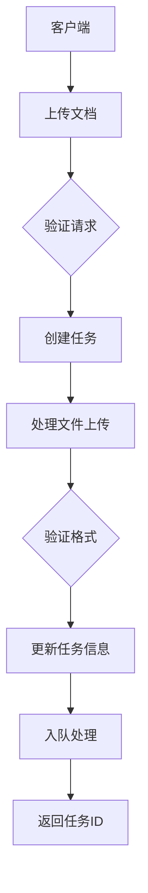
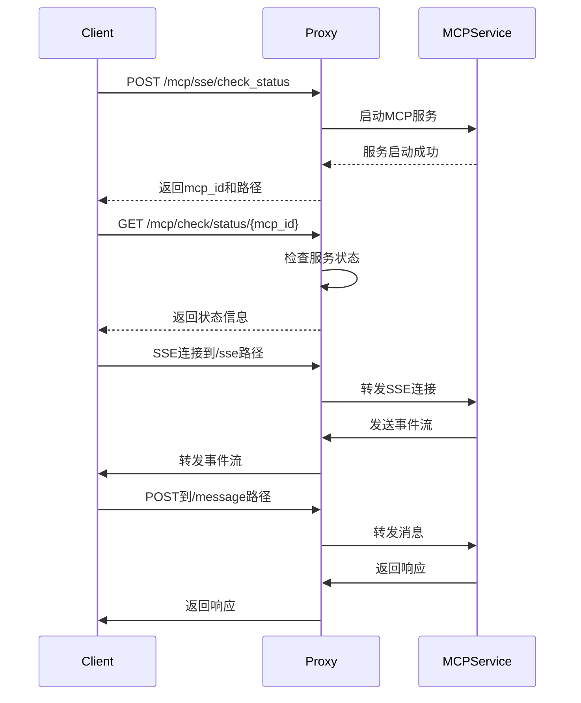
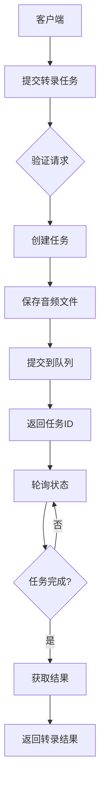
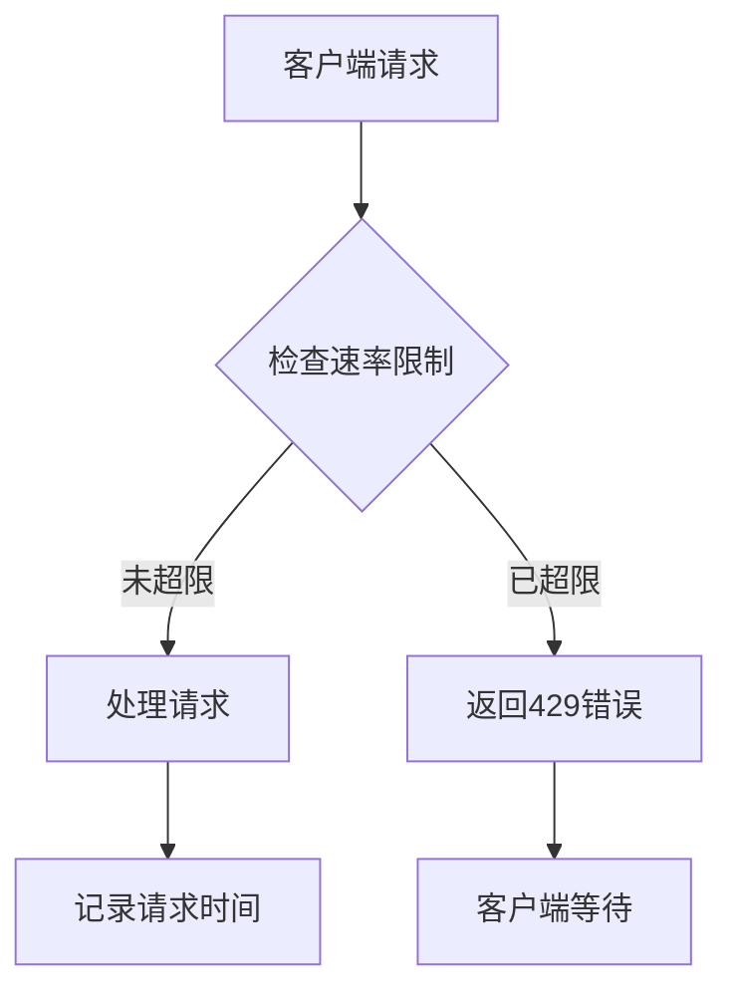

# API参考

<cite>
**本文档引用的文件**   
- [document_handler.rs](file://document-parser/src/handlers/document_handler.rs)
- [routes.rs](file://document-parser/src/routes.rs)
- [mcp_add_handler.rs](file://mcp-proxy/src/server/handlers/mcp_add_handler.rs)
- [check_mcp_is_status.rs](file://mcp-proxy/src/server/handlers/check_mcp_is_status.rs)
- [sse_server.rs](file://mcp-proxy/src/server/handlers/sse_server.rs)
- [run_code_handler.rs](file://mcp-proxy/src/server/handlers/run_code_handler.rs)
- [mcp_config.rs](file://mcp-proxy/src/model/mcp_config.rs)
- [mcp_router_model.rs](file://mcp-proxy/src/model/mcp_router_model.rs)
- [handlers.rs](file://voice-cli/src/server/handlers.rs)
- [routes.rs](file://voice-cli/src/server/routes.rs)
- [error_handler.rs](file://document-parser/src/middleware/error_handler.rs)
</cite>

## 目录
1. [文档解析API](#文档解析api)
2. [MCP代理API](#mcp代理api)
3. [语音处理API](#语音处理api)
4. [错误代码表](#错误代码表)
5. [速率限制策略](#速率限制策略)
6. [版本管理](#版本管理)

## 文档解析API

文档解析API提供了一系列端点用于上传、解析和管理文档。该API支持多种文档格式，包括PDF、DOCX、TXT、MD等，并提供了丰富的功能，如目录生成、Markdown解析和OSS集成。



**图源**
- [document_handler.rs](file://document-parser/src/handlers/document_handler.rs#L191-L347)
- [routes.rs](file://document-parser/src/routes.rs#L48-L57)

### 文档上传与解析

#### 上传文档
用于上传文档并启动解析任务。

**HTTP方法**: `POST`  
**URL模式**: `/api/v1/documents/upload`  
**认证方法**: 无

**请求参数**:
- `enable_toc` (可选, Query): 是否启用目录生成，默认为false
- `max_toc_depth` (可选, Query): 目录最大深度，默认为6
- `bucket_dir` (可选, Query): 指定上传到OSS时的子目录

**请求体**:
- `file` (multipart/form-data): 要上传的文件

**响应**:
- **202 Accepted**: 文档上传成功，解析任务已启动
```json
{
  "task_id": "string",
  "message": "string",
  "file_info": {
    "filename": "string",
    "size": 0,
    "format": "string",
    "mime_type": "string"
  }
}
```
- **400 Bad Request**: 请求参数错误
- **413 Payload Too Large**: 文件过大
- **415 Unsupported Media Type**: 不支持的文件格式
- **408 Request Timeout**: 上传超时

**示例**:
```bash
curl -X POST "http://localhost:8080/api/v1/documents/upload?enable_toc=true&max_toc_depth=3" \
  -H "Content-Type: multipart/form-data" \
  -F "file=@document.pdf"
```

**节源**
- [document_handler.rs](file://document-parser/src/handlers/document_handler.rs#L191-L347)

#### 从URL下载并解析文档
通过URL自动下载文档并启动解析任务。

**HTTP方法**: `POST`  
**URL模式**: `/api/v1/documents/uploadFromUrl`  
**认证方法**: 无

**请求体**:
```json
{
  "url": "https://example.com/document.pdf",
  "enable_toc": true,
  "max_toc_depth": 3,
  "bucket_dir": "projectA/docs/v1"
}
```

**响应**:
- **202 Accepted**: URL文档下载任务已启动
```json
{
  "task_id": "string",
  "message": "string"
}
```

**节源**
- [document_handler.rs](file://document-parser/src/handlers/document_handler.rs#L790-L800)

#### 生成结构化文档
根据Markdown内容生成结构化文档。

**HTTP方法**: `POST`  
**URL模式**: `/api/v1/documents/structured`  
**认证方法**: 无

**请求体**:
```json
{
  "markdown_content": "# 标题\n内容...",
  "enable_toc": true,
  "max_toc_depth": 3,
  "enable_anchors": true
}
```

**响应**:
- **202 Accepted**: 结构化文档生成任务已启动
```json
{
  "task_id": "string",
  "message": "string"
}
```

**节源**
- [document_handler.rs](file://document-parser/src/handlers/document_handler.rs#L130-L135)

### 任务管理

#### 获取任务状态
根据任务ID查询任务的当前状态。

**HTTP方法**: `GET`  
**URL模式**: `/api/v1/tasks/{task_id}`  
**认证方法**: 无

**响应**:
- **200 OK**: 成功获取任务状态
```json
{
  "id": "string",
  "status": "pending|processing|completed|failed|cancelled",
  "source_type": "upload|url|oss",
  "source_path": "string",
  "original_filename": "string",
  "document_format": "pdf|docx|txt|md|html|...",
  "created_at": "string",
  "updated_at": "string"
}
```
- **404 Not Found**: 任务不存在

**节源**
- [routes.rs](file://document-parser/src/routes.rs#L79)

#### 删除任务
删除指定的任务。

**HTTP方法**: `DELETE`  
**URL模式**: `/api/v1/tasks/{task_id}`  
**认证方法**: 无

**响应**:
- **200 OK**: 任务删除成功
```json
{
  "success": true,
  "message": "string"
}
```
- **404 Not Found**: 任务不存在

**节源**
- [routes.rs](file://document-parser/src/routes.rs#L80)

#### 获取任务结果
获取已完成任务的解析结果。

**HTTP方法**: `GET`  
**URL模式**: `/api/v1/tasks/{task_id}/result`  
**认证方法**: 无

**响应**:
- **200 OK**: 成功获取任务结果
```json
{
  "content": "string",
  "toc": [
    {
      "level": 1,
      "text": "标题",
      "anchor": "section-1"
    }
  ],
  "metadata": {
    "title": "string",
    "author": "string",
    "created_date": "string"
  }
}
```
- **404 Not Found**: 任务不存在或结果不可用
- **400 Bad Request**: 任务未完成

**节源**
- [routes.rs](file://document-parser/src/routes.rs#L81)

### 系统信息

#### 健康检查
检查服务是否正常运行。

**HTTP方法**: `GET`  
**URL模式**: `/health`  
**认证方法**: 无

**响应**:
- **200 OK**: 服务正常
```json
{
  "status": "healthy",
  "version": "string",
  "uptime": 0
}
```

**节源**
- [routes.rs](file://document-parser/src/routes.rs#L22)

#### 获取支持的格式
获取系统支持的文档格式列表。

**HTTP方法**: `GET`  
**URL模式**: `/api/v1/documents/formats`  
**认证方法**: 无

**响应**:
- **200 OK**: 成功获取支持的格式
```json
{
  "formats": ["pdf", "docx", "txt", "md", "html", "rtf", "odt", "xlsx", "xls", "csv", "pptx", "ppt", "odp", "jpg", "jpeg", "png", "gif", "bmp", "tiff", "mp3", "wav", "m4a", "aac"]
}
```

**节源**
- [routes.rs](file://document-parser/src/routes.rs#L68)

## MCP代理API

MCP代理API提供了添加服务、检查状态、SSE连接和消息发送等端点，用于管理和监控MCP服务。



**图源**
- [mcp_add_handler.rs](file://mcp-proxy/src/server/handlers/mcp_add_handler.rs#L17-L90)
- [check_mcp_is_status.rs](file://mcp-proxy/src/server/handlers/check_mcp_is_status.rs#L11-L46)
- [sse_server.rs](file://mcp-proxy/src/server/handlers/sse_server.rs#L27-L94)

### 服务管理

#### 添加服务
添加一个新的MCP服务。

**HTTP方法**: `POST`  
**URL模式**: `/mcp/sse/check_status` 或 `/mcp/stream/check_status`  
**认证方法**: 无

**请求头**:
- `Content-Type`: `application/json`

**请求体**:
```json
{
  "mcpId": "string",
  "mcpJsonConfig": "{\"mcpServers\": {\"test\": {\"url\": \"http://127.0.0.1:8000/mcp\"}}}",
  "mcpType": "Persistent|OneShot",
  "clientProtocol": "Sse|Stream"
}
```

**响应**:
- **200 OK**: 服务添加成功
```json
{
  "success": true,
  "data": {
    "mcp_id": "string",
    "sse_path": "string",
    "message_path": "string",
    "mcp_type": "Persistent|OneShot"
  }
}
```
- **400 Bad Request**: 无效的请求路径

**示例**:
```bash
curl -X POST "http://localhost:8085/mcp/sse/check_status" \
  -H "Content-Type: application/json" \
  -d '{
    "mcpId": "test-service",
    "mcpJsonConfig": "{\"mcpServers\": {\"test\": {\"url\": \"http://127.0.0.1:8000/mcp\"}}}",
    "mcpType": "Persistent"
  }'
```

**节源**
- [mcp_add_handler.rs](file://mcp-proxy/src/server/handlers/mcp_add_handler.rs#L17-L90)
- [mcp_router_model.rs](file://mcp-proxy/src/model/mcp_router_model.rs#L18-L19)

#### 检查服务状态
检查MCP服务的运行状态。

**HTTP方法**: `GET`  
**URL模式**: `/mcp/check/status/{mcp_id}`  
**认证方法**: 无

**路径参数**:
- `mcp_id`: MCP服务的ID

**响应**:
- **200 OK**: 成功获取状态
```json
{
  "success": true,
  "data": {
    "ready": true,
    "status": "Ready|Pending|Error",
    "error": "string"
  }
}
```

**节源**
- [check_mcp_is_status.rs](file://mcp-proxy/src/server/handlers/check_mcp_is_status.rs#L11-L46)

### SSE连接

#### SSE事件流
建立SSE连接以接收事件流。

**HTTP方法**: `GET`  
**URL模式**: `/mcp/sse/proxy/{mcp_id}/sse`  
**认证方法**: 无

**请求头**:
- `Accept`: `text/event-stream`

**响应**:
- **200 OK**: 建立SSE连接，返回事件流
```
event: session_start
data: {"sessionId": "123"}

event: message
data: {"content": "Hello"}

event: session_end
data: {"reason": "completed"}
```

**节源**
- [sse_server.rs](file://mcp-proxy/src/server/handlers/sse_server.rs#L27-L94)

#### 发送消息
向MCP服务发送消息。

**HTTP方法**: `POST`  
**URL模式**: `/mcp/sse/proxy/{mcp_id}/message`  
**认证方法**: 无

**请求体**:
```json
{
  "sessionId": "string",
  "message": "string"
}
```

**响应**:
- **200 OK**: 消息发送成功
```json
{
  "success": true,
  "data": {}
}
```

**节源**
- [sse_server.rs](file://mcp-proxy/src/server/handlers/sse_server.rs#L27-L94)

### 代码执行

#### 执行代码
执行JavaScript、TypeScript或Python代码。

**HTTP方法**: `POST`  
**URL模式**: `/mcp/run_code`  
**认证方法**: 无

**请求体**:
```json
{
  "code": "console.log('Hello World');",
  "json_param": {},
  "uid": "unique-id",
  "engine_type": "js|ts|python"
}
```

**响应**:
- **200 OK**: 代码执行成功
```json
{
  "data": {},
  "success": true,
  "error": "string"
}
```

**节源**
- [run_code_handler.rs](file://mcp-proxy/src/server/handlers/run_code_handler.rs#L38-L92)

## 语音处理API

语音处理API提供了语音转录、健康检查和任务管理等端点，用于处理音频文件的转录任务。



**图源**
- [handlers.rs](file://voice-cli/src/server/handlers.rs#L166-L332)
- [routes.rs](file://voice-cli/src/server/routes.rs#L52-L59)

### 健康检查

#### 健康检查
检查语音服务是否正常运行。

**HTTP方法**: `GET`  
**URL模式**: `/health`  
**认证方法**: 无

**响应**:
- **200 OK**: 服务正常
```json
{
  "status": "healthy",
  "models_loaded": ["string"],
  "uptime": 0,
  "version": "string"
}
```

**节源**
- [handlers.rs](file://voice-cli/src/server/handlers.rs#L106-L117)

### 模型管理

#### 获取模型列表
获取当前支持的语音转录模型列表。

**HTTP方法**: `GET`  
**URL模式**: `/models`  
**认证方法**: 无

**响应**:
- **200 OK**: 成功获取模型列表
```json
{
  "available_models": ["string"],
  "loaded_models": ["string"],
  "model_info": {}
}
```

**节源**
- [handlers.rs](file://voice-cli/src/server/handlers.rs#L132-L144)

### 任务管理

#### 提交异步转录任务
上传音频文件进行异步转录处理。

**HTTP方法**: `POST`  
**URL模式**: `/api/v1/tasks/transcribe`  
**认证方法**: 无

**请求体**:
- `file` (multipart/form-data): 音频文件
- `model` (可选): 使用的模型名称
- `response_format` (可选): 响应格式

**响应**:
- **200 OK**: 任务提交成功
```json
{
  "task_id": "string",
  "status": {
    "type": "Pending",
    "queued_at": "string"
  },
  "estimated_completion": "string"
}
```

**节源**
- [handlers.rs](file://voice-cli/src/server/handlers.rs#L281-L332)

#### 通过URL提交转录任务
通过URL下载音频文件进行异步转录处理。

**HTTP方法**: `POST`  
**URL模式**: `/api/v1/tasks/transcribeFromUrl`  
**认证方法**: 无

**请求体**:
```json
{
  "url": "https://example.com/audio.mp3",
  "model": "string",
  "response_format": "string"
}
```

**响应**:
- **200 OK**: 任务提交成功
```json
{
  "task_id": "string",
  "status": {
    "type": "Pending",
    "queued_at": "string"
  },
  "estimated_completion": "string"
}
```

**节源**
- [handlers.rs](file://voice-cli/src/server/handlers.rs#L353-L401)

#### 获取任务状态
查询转录任务的当前状态。

**HTTP方法**: `GET`  
**URL模式**: `/api/v1/tasks/{task_id}`  
**认证方法**: 无

**响应**:
- **200 OK**: 成功获取任务状态
```json
{
  "task_id": "string",
  "status": "pending|processing|completed|failed|cancelled",
  "message": "string",
  "created_at": "string",
  "updated_at": "string"
}
```

**节源**
- [handlers.rs](file://voice-cli/src/server/handlers.rs#L420-L453)

#### 获取任务结果
获取已完成任务的转录结果。

**HTTP方法**: `GET`  
**URL模式**: `/api/v1/tasks/{task_id}/result`  
**认证方法**: 无

**响应**:
- **200 OK**: 成功获取转录结果
```json
{
  "text": "string",
  "segments": [
    {
      "start": 0,
      "end": 0,
      "text": "string",
      "confidence": 0
    }
  ],
  "language": "string",
  "duration": 0,
  "processing_time": 0,
  "metadata": {}
}
```

**节源**
- [handlers.rs](file://voice-cli/src/server/handlers.rs#L473-L496)

#### 取消任务
取消待处理或正在处理的转录任务。

**HTTP方法**: `POST`  
**URL模式**: `/api/v1/tasks/{task_id}/cancel`  
**认证方法**: 无

**响应**:
- **200 OK**: 取消成功
```json
{
  "task_id": "string",
  "cancelled": true,
  "message": "string"
}
```

**节源**
- [handlers.rs](file://voice-cli/src/server/handlers.rs#L516-L536)

#### 重试任务
重试已失败或已取消的转录任务。

**HTTP方法**: `POST`  
**URL模式**: `/api/v1/tasks/{task_id}/retry`  
**认证方法**: 无

**响应**:
- **200 OK**: 重试成功
```json
{
  "task_id": "string",
  "retried": true,
  "message": "string"
}
```

**节源**
- [handlers.rs](file://voice-cli/src/server/handlers.rs#L556-L577)

#### 删除任务
彻底删除任务数据。

**HTTP方法**: `DELETE`  
**URL模式**: `/api/v1/tasks/{task_id}/delete`  
**认证方法**: 无

**响应**:
- **200 OK**: 删除成功
```json
{
  "task_id": "string",
  "deleted": true,
  "message": "string"
}
```

**节源**
- [handlers.rs](file://voice-cli/src/server/handlers.rs#L596-L616)

#### 获取任务统计
获取任务执行情况的统计信息。

**HTTP方法**: `GET`  
**URL模式**: `/api/v1/tasks/stats`  
**认证方法**: 无

**响应**:
- **200 OK**: 成功获取统计信息
```json
{
  "total_tasks": 0,
  "pending_tasks": 0,
  "processing_tasks": 0,
  "completed_tasks": 0,
  "failed_tasks": 0,
  "cancelled_tasks": 0,
  "average_processing_time": 0
}
```

**节源**
- [handlers.rs](file://voice-cli/src/server/handlers.rs#L631-L640)

## 错误代码表

| 错误代码 | HTTP状态码 | 描述 |
|---------|-----------|------|
| E001 | 400 | 请求参数验证失败 |
| E002 | 400 | 文件名无效 |
| E003 | 400 | 文件扩展名不支持 |
| E004 | 400 | TOC配置无效 |
| E005 | 400 | 文件大小超过限制 |
| E006 | 400 | 文件为空 |
| E007 | 400 | 文件过小，可能已损坏 |
| E008 | 400 | 无法检测文件格式 |
| E009 | 400 | 文件格式与内容不匹配 |
| E010 | 400 | 未找到文件字段 |
| E011 | 404 | 任务不存在 |
| E012 | 408 | 文件上传超时 |
| E013 | 413 | 文件过大 |
| E014 | 415 | 不支持的文件格式 |
| E015 | 422 | 解析失败 |
| E016 | 500 | 内部服务器错误 |
| E017 | 429 | 请求频率过高，请稍后再试 |
| E018 | 502 | OSS服务错误 |

**节源**
- [error_handler.rs](file://document-parser/src/middleware/error_handler.rs#L36-L75)

## 速率限制策略

API实施了速率限制策略以防止滥用和确保服务质量。

- **全局速率限制**: 每秒最多100个请求
- **IP级别限制**: 基于客户端IP地址进行限制
- **错误响应**: 当超过限制时，返回HTTP 429状态码和相应的错误信息

速率限制通过中间件实现，使用内存中的哈希表来跟踪每个IP地址的请求历史。



**图源**
- [error_handler.rs](file://document-parser/src/middleware/error_handler.rs#L80-L142)

## 版本管理

API版本通过URL路径进行管理，当前版本为v1。

- **版本格式**: `/api/v{version}/endpoint`
- **当前版本**: v1
- **向后兼容性**: 保证向后兼容性，重大变更将引入新版本
- **弃用策略**: 旧版本在新版本发布后至少维护6个月

**节源**
- [routes.rs](file://document-parser/src/routes.rs#L27-L29)
- [routes.rs](file://voice-cli/src/server/routes.rs#L31)