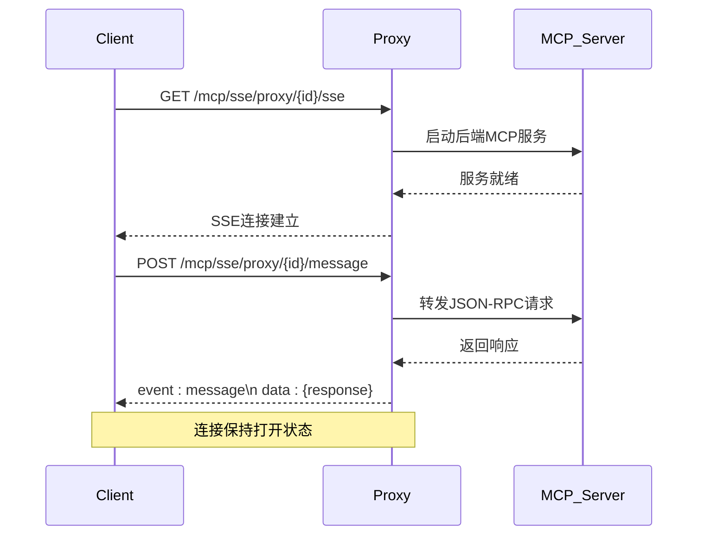
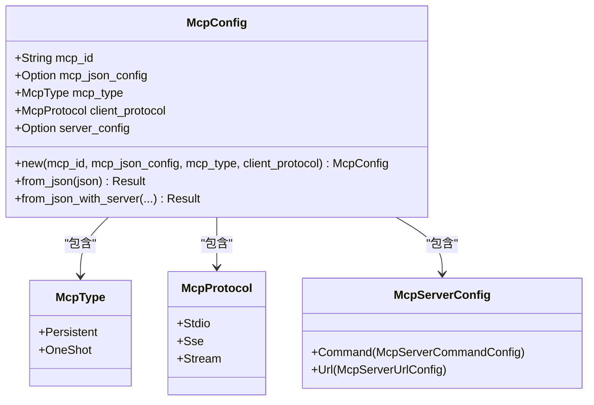

# MCP代理API

<cite>
**本文档中引用的文件**  
- [mcp_add_handler.rs](file://mcp-proxy/src/server/handlers/mcp_add_handler.rs)
- [delete_route_handler.rs](file://mcp-proxy/src/server/handlers/delete_route_handler.rs)
- [health.rs](file://mcp-proxy/src/server/handlers/health.rs)
- [run_code_handler.rs](file://mcp-proxy/src/server/handlers/run_code_handler.rs)
- [sse_server.rs](file://mcp-proxy/src/server/handlers/sse_server.rs)
- [mcp_config.rs](file://mcp-proxy/src/model/mcp_config.rs)
- [mcp_router_model.rs](file://mcp-proxy/src/model/mcp_router_model.rs)
- [http_result.rs](file://mcp-proxy/src/model/http_result.rs)
- [sse_client.rs](file://mcp-proxy/src/client/sse_client.rs)
- [test_sse_client.py](file://mcp-proxy/test_sse_client.py)
</cite>

## 目录
1. [简介](#简介)
2. [RESTful API端点](#restful-api端点)
3. [SSE服务器协议](#sse服务器协议)
4. [代码执行请求处理](#代码执行请求处理)
5. [MCP配置模型](#mcp配置模型)
6. [客户端示例](#客户端示例)
7. [错误代码与处理](#错误代码与处理)

## 简介
MCP代理服务提供了一个统一的接口，用于管理和代理MCP（Model Control Protocol）服务。该服务支持通过RESTful API进行服务管理，并通过SSE（Server-Sent Events）协议实现流式通信。代理服务能够处理不同类型的MCP服务，包括基于stdio的本地命令行服务和基于HTTP的远程服务。

**MCP协议支持类型**：
- **SSE (Server-Sent Events)**: 用于持续的双向流式通信
- **Stream (HTTP流式)**: 用于一次性或短时任务的流式处理
- **Stdio**: 用于本地命令行启动的MCP服务

该代理服务的核心功能包括动态路由管理、协议转换、健康检查和资源清理，为MCP服务提供了一个稳定可靠的运行环境。

## RESTful API端点

### 添加MCP服务 (POST /mcp/add)
用于动态添加新的MCP服务到代理中。根据请求路径中的协议类型，创建相应的SSE或Stream路由。

**请求路径**：
- `/mcp/sse/add` - 添加SSE协议的MCP服务
- `/mcp/stream/add` - 添加Stream协议的MCP服务

**请求体参数**：
- `mcp_json_config` (string, 必需): MCP服务的JSON配置，包含服务启动命令或URL信息
- `mcp_type` (string, 可选): MCP服务类型，可选值为"persistent"（持续运行）或"oneShot"（一次性任务），默认为"oneShot"

**成功响应**：
```json
{
  "code": "0000",
  "message": "成功",
  "data": {
    "mcp_id": "生成的唯一服务ID",
    "sse_path": "/mcp/sse/proxy/{mcp_id}/sse",
    "message_path": "/mcp/sse/proxy/{mcp_id}/message",
    "mcp_type": "persistent|oneShot"
  },
  "success": true
}
```

**失败响应**：
```json
{
  "code": "5001",
  "message": "无效的请求路径",
  "data": null,
  "success": false
}
```

**处理流程**：
1. 解析请求路径，确定客户端协议（SSE或Stream）
2. 生成唯一的mcp_id（使用UUID v7）
3. 解析mcp_json_config为McpServerConfig结构
4. 根据协议类型集成SSE服务器
5. 返回包含mcp_id和访问路径的成功响应

**Section sources**
- [mcp_add_handler.rs](file://mcp-proxy/src/server/handlers/mcp_add_handler.rs#L1-L91)

### 检查服务状态 (GET /mcp/check_status)
此端点用于检查MCP服务的运行状态。通过定期调用此接口，客户端可以监控服务的健康状况和可用性。

**请求方法**：GET

**请求路径**：
- `/mcp/sse/check_status`
- `/mcp/stream/check_status`

**成功响应**：
```json
{
  "code": "0000",
  "message": "成功",
  "data": null,
  "success": true
}
```

**错误响应**：
```json
{
  "code": "5002",
  "message": "服务不可用",
  "data": null,
  "success": false
}
```

**实现细节**：
该端点目前返回简单的健康状态信息，未来可扩展为返回更详细的运行时指标，如CPU使用率、内存占用、请求处理速率等。

**Section sources**
- [mcp_check_status_handler.rs](file://mcp-proxy/src/server/handlers/mcp_check_status_handler.rs)

### 删除路由 (DELETE /route/{id})
用于删除指定ID的MCP服务路由并清理相关资源。

**请求方法**：DELETE

**请求路径**：`/route/{id}`

**路径参数**：
- `id` (string): 要删除的MCP服务的唯一标识符

**成功响应**：
```json
{
  "code": "0000",
  "message": "成功",
  "data": {
    "mcp_id": "被删除的服务ID",
    "message": "已删除路由: {mcp_id}"
  },
  "success": true
}
```

**处理流程**：
1. 从路径参数中提取mcp_id
2. 调用代理管理器清理指定mcp_id的资源
3. 返回删除成功的确认信息

**Section sources**
- [delete_route_handler.rs](file://mcp-proxy/src/server/handlers/delete_route_handler.rs#L1-L25)

### 健康检查 (GET /health)
提供服务的健康状态检查，用于Kubernetes等容器编排系统的存活探针和就绪探针。

**请求方法**：GET

**请求路径**：
- `/health` - 存活探针
- `/ready` - 就绪探针

**响应**：
- HTTP状态码：200
- 响应体："health" 或 "ready"

**实现细节**：
该端点仅返回简单的文本响应，不进行复杂的健康检查。在生产环境中，可根据需要扩展为检查数据库连接、外部服务依赖等。

**Section sources**
- [health.rs](file://mcp-proxy/src/server/handlers/health.rs#L1-L12)

## SSE服务器协议

### 连接建立
SSE（Server-Sent Events）连接的建立遵循以下流程：

1. **客户端连接**：客户端通过HTTP GET请求连接到SSE端点
2. **服务初始化**：代理服务启动后端MCP服务（通过stdio或HTTP）
3. **协议转换**：代理将后端服务的通信协议转换为SSE格式
4. **事件流开始**：建立持续的事件流连接

**连接端点**：
- SSE流端点：`/mcp/sse/proxy/{mcp_id}/sse`
- 消息发送端点：`/mcp/sse/proxy/{mcp_id}/message`

### 消息格式
SSE服务器发送的消息遵循标准的SSE格式，包含事件类型和JSON数据：

```
event: message
data: {"jsonrpc":"2.0","id":"msg-1","result":{...}}

event: error
data: {"code":500,"message":"Internal error"}

event: complete
data: {"status":"success"}
```

**JSON结构**：
- `jsonrpc`: JSON-RPC协议版本，通常为"2.0"
- `id`: 请求的唯一标识符，用于匹配请求和响应
- `result`: 成功响应的数据
- `error`: 错误信息，包含code和message字段

### 事件类型
SSE服务器支持以下事件类型：

- **message**: 正常的消息事件，包含JSON-RPC响应
- **error**: 错误事件，表示请求处理过程中发生错误
- **complete**: 完成事件，表示会话或任务已完成
- **endpoint**: 端点事件，包含消息发送的URL路径

### 客户端重连机制
客户端应实现以下重连策略：

1. **自动重连**：当连接断开时，客户端应自动尝试重新连接
2. **指数退避**：重连间隔应采用指数退避策略，避免服务器过载
3. **会话恢复**：重连后应发送会话恢复请求，获取断线期间的消息
4. **最大重试次数**：设置合理的最大重试次数，避免无限重试

**重连建议**：
- 初始重连间隔：1秒
- 最大重连间隔：30秒
- 最大重试次数：10次



**Diagram sources**
- [sse_server.rs](file://mcp-proxy/src/server/handlers/sse_server.rs#L1-L95)
- [mcp_router_model.rs](file://mcp-proxy/src/model/mcp_router_model.rs#L342-L597)

## 代码执行请求处理

### 请求参数结构
代码执行请求通过`run_code_handler`处理，接收以下参数：

**请求体结构 (RunCodeMessageRequest)**：
- `json_param` (object): 传递给代码执行环境的参数，以键值对形式提供
- `code` (string): 要执行的代码内容
- `uid` (string): 前端生成的唯一标识符，用于关联日志输出
- `engine_type` (string): 执行引擎类型，支持"js"、"ts"、"python"

**参数示例**：
```json
{
  "json_param": {
    "name": "张三",
    "age": 25
  },
  "code": "console.log(`Hello ${params.name}, you are ${params.age} years old`);",
  "uid": "unique-user-id-123",
  "engine_type": "js"
}
```

### 执行流程
代码执行的处理流程如下：

1. **参数解析**：将请求参数转换为内部数据结构
2. **语言识别**：根据engine_type确定执行语言（JS/TS/Python）
3. **环境准备**：使用uv或deno预热执行环境
4. **代码执行**：调用CodeExecutor执行代码
5. **结果封装**：将执行结果封装为标准响应格式
6. **响应返回**：返回执行结果或错误信息

### 流式响应处理
代码执行支持流式响应，通过以下机制实现：

- **日志流**：执行过程中的console输出通过SSE实时推送
- **进度更新**：长时间运行的任务可以发送进度更新
- **错误流**：执行错误实时通知客户端
- **完成通知**：任务完成后发送完成事件

**响应格式**：
```json
{
  "data": {
    "success": true,
    "result": "Hello 张三, you are 25 years old",
    "logs": ["console output..."],
    "duration": 123
  },
  "success": true,
  "error": null
}
```

**Section sources**
- [run_code_handler.rs](file://mcp-proxy/src/server/handlers/run_code_handler.rs#L1-L93)

## MCP配置模型

### McpConfig结构
McpConfig是MCP服务的核心配置模型，定义了服务的基本属性和行为。

**结构定义**：
```rust
pub struct McpConfig {
    #[serde(rename = "mcpId")]
    pub mcp_id: String,
    
    #[serde(rename = "mcpJsonConfig")]
    pub mcp_json_config: Option<String>,
    
    #[serde(default = "default_mcp_type", rename = "mcpType")]
    pub mcp_type: McpType,
    
    #[serde(default = "default_mcp_protocol", rename = "clientProtocol")]
    pub client_protocol: McpProtocol,
    
    #[serde(skip_serializing, skip_deserializing)]
    pub server_config: Option<McpServerConfig>,
}
```

### 字段说明
- **mcpId**: 服务的唯一标识符，由系统生成
- **mcpJsonConfig**: 原始的MCP JSON配置，包含后端服务的详细信息
- **mcpType**: 服务类型，支持"persistent"（持续运行）和"oneShot"（一次性任务）
- **clientProtocol**: 客户端协议，决定暴露给客户端的API接口类型
- **serverConfig**: 解析后的服务器配置，运行时生成，不参与序列化

### McpType枚举
定义了MCP服务的生命周期类型：

- **Persistent**: 持续运行的服务，保持连接直到显式关闭
- **OneShot**: 一次性任务服务，任务完成后自动清理

### McpProtocol枚举
定义了客户端通信协议：

- **Sse**: 使用Server-Sent Events协议进行流式通信
- **Stream**: 使用HTTP流式协议
- **Stdio**: 使用标准输入输出进行通信

### 序列化方式
McpConfig使用Serde进行JSON序列化，关键特性包括：

- **字段重命名**: 使用`rename`属性映射JSON字段名
- **默认值**: 为可选字段提供默认值
- **条件序列化**: `server_config`字段在序列化时跳过
- **自定义解析**: 支持从JSON字符串直接创建实例



**Diagram sources**
- [mcp_config.rs](file://mcp-proxy/src/model/mcp_config.rs#L1-L102)
- [mcp_router_model.rs](file://mcp-proxy/src/model/mcp_router_model.rs#L32-L37)

## 客户端示例

### Python客户端
使用Python连接SSE服务器的示例：

```python
#!/usr/bin/env python3
"""
测试 SSE MCP 客户端
"""
import json
import requests
import sseclient
import threading
import time

MCP_ID = "test-sse-stream"
BASE_URL = "http://localhost:8085"
SSE_URL = f"{BASE_URL}/mcp/sse/proxy/{MCP_ID}/sse"
MESSAGE_URL_TEMPLATE = f"{BASE_URL}/mcp/sse/proxy/{MCP_ID}/message"
MESSAGE_URL = None  # 将在获取 sessionId 后设置

def listen_sse():
    """监听 SSE 事件"""
    global MESSAGE_URL
    print("=== 开始监听 SSE 连接 ===")
    try:
        response = requests.get(SSE_URL, headers={'Accept': 'text/event-stream'}, stream=True)
        client = sseclient.SSEClient(response)
        
        for event in client.events():
            print(f"\n收到 SSE 事件:")
            print(f"  Event: {event.event}")
            print(f"  Data: {event.data}")
            
            # 如果是 endpoint 事件，提取 sessionId
            if event.event == "endpoint":
                MESSAGE_URL = f"{BASE_URL}{event.data}"
                print(f"  ✅ 获取到 MESSAGE_URL: {MESSAGE_URL}")
            
            # 尝试解析 JSON
            try:
                data = json.loads(event.data)
                print(f"  解析后: {json.dumps(data, indent=2, ensure_ascii=False)}")
            except:
                pass
                
    except Exception as e:
        print(f"SSE 连接错误: {e}")

def send_message(msg_id, method, params=None):
    """发送消息到 MCP 服务"""
    message = {
        "jsonrpc": "2.0",
        "id": msg_id,
        "method": method,
        "params": params or {}
    }
    
    print(f"\n=== 发送消息: {method} ===")
    print(json.dumps(message, indent=2, ensure_ascii=False))
    
    try:
        response = requests.post(
            MESSAGE_URL,
            json=message,
            headers={'Content-Type': 'application/json'},
            timeout=5
        )
        print(f"响应状态码: {response.status_code}")
        if response.text:
            print(f"响应内容: {response.text}")
    except requests.exceptions.Timeout:
        print("请求超时（这是正常的，响应会通过 SSE 返回）")
    except Exception as e:
        print(f"发送消息错误: {e}")

def main():
    global MESSAGE_URL
    # 启动 SSE 监听线程
    sse_thread = threading.Thread(target=listen_sse, daemon=True)
    sse_thread.start()
    
    # 等待 SSE 连接建立并获取 sessionId
    print("等待获取 sessionId...")
    timeout = time.time() + 10
    while MESSAGE_URL is None and time.time() < timeout:
        time.sleep(0.5)
    
    if MESSAGE_URL is None:
        print("❌ 未能获取 sessionId，退出")
        return
    
    print(f"✅ 已获取 MESSAGE_URL: {MESSAGE_URL}")
    time.sleep(1)
    
    # 发送 initialize 消息
    send_message("msg-1", "initialize", {
        "protocolVersion": "2024-11-05",
        "capabilities": {},
        "clientInfo": {
            "name": "test-client",
            "version": "1.0.0"
        }
    })
    
    time.sleep(2)
    
    # 发送 tools/list 消息
    send_message("msg-2", "tools/list", {})
    
    time.sleep(2)
    
    print("\n=== 测试完成 ===")

if __name__ == "__main__":
    main()
```

**Section sources**
- [test_sse_client.py](file://mcp-proxy/test_sse_client.py#L1-L112)

### JavaScript客户端
使用JavaScript连接SSE服务器的示例：

```javascript
class MCPPClient {
    constructor(mcpId, baseUrl = 'http://localhost:8085') {
        this.mcpId = mcpId;
        this.baseUrl = baseUrl;
        this.sseUrl = `${baseUrl}/mcp/sse/proxy/${mcpId}/sse`;
        this.messageUrl = null;
        this.eventSource = null;
        this.messageId = 1;
    }

    // 连接到SSE服务器
    connect() {
        return new Promise((resolve, reject) => {
            this.eventSource = new EventSource(this.sseUrl);
            
            this.eventSource.onopen = () => {
                console.log('SSE连接已建立');
            };

            this.eventSource.onmessage = (event) => {
                console.log('收到SSE消息:', event.data);
                
                try {
                    const data = JSON.parse(event.data);
                    if (event.type === 'endpoint') {
                        this.messageUrl = `${this.baseUrl}${data}`;
                        console.log('获取到消息URL:', this.messageUrl);
                        resolve();
                    }
                } catch (e) {
                    console.log('无法解析JSON:', event.data);
                }
            };

            this.eventSource.onerror = (error) => {
                console.error('SSE连接错误:', error);
                reject(error);
            };
        });
    }

    // 发送JSON-RPC消息
    async sendMessage(method, params = {}) {
        if (!this.messageUrl) {
            throw new Error('尚未建立连接，无法发送消息');
        }

        const message = {
            jsonrpc: '2.0',
            id: `msg-${this.messageId++}`,
            method,
            params
        };

        console.log('发送消息:', JSON.stringify(message, null, 2));

        try {
            const response = await fetch(this.messageUrl, {
                method: 'POST',
                headers: {
                    'Content-Type': 'application/json'
                },
                body: JSON.stringify(message)
            });

            if (!response.ok) {
                throw new Error(`HTTP ${response.status}: ${response.statusText}`);
            }

            // 注意：响应可能通过SSE返回，而不是这个HTTP请求
            console.log('请求已发送，等待SSE响应...');
        } catch (error) {
            console.error('发送消息失败:', error);
            throw error;
        }
    }

    // 关闭连接
    close() {
        if (this.eventSource) {
            this.eventSource.close();
            this.eventSource = null;
        }
    }
}

// 使用示例
async function main() {
    const client = new MCPPClient('test-js-client');
    
    try {
        // 连接SSE
        await client.connect();
        
        // 等待连接建立
        await new Promise(resolve => setTimeout(resolve, 1000));
        
        // 发送初始化消息
        await client.sendMessage('initialize', {
            protocolVersion: '2024-11-05',
            capabilities: {},
            clientInfo: {
                name: 'js-test-client',
                version: '1.0.0'
            }
        });
        
        // 等待响应
        await new Promise(resolve => setTimeout(resolve, 2000));
        
        // 发送工具列表请求
        await client.sendMessage('tools/list', {});
        
    } catch (error) {
        console.error('操作失败:', error);
    } finally {
        client.close();
    }
}

// 在浏览器环境中运行
if (typeof window !== 'undefined') {
    main();
}
```

## 错误代码与处理

### 常见错误代码
| 错误代码 | 含义 | 处理建议 |
|---------|------|---------|
| 0000 | 成功 | 正常处理响应数据 |
| 5001 | 无效的请求路径 | 检查请求URL是否正确，确保协议前缀匹配 |
| 5002 | 服务不可用 | 检查MCP服务是否正常运行，尝试重新添加服务 |
| 5003 | 协议不匹配 | 确认客户端协议与服务端协议一致 |
| 5004 | 资源不存在 | 检查mcp_id是否正确，确认服务是否已添加 |
| 5005 | 内部服务器错误 | 查看服务日志，联系管理员 |

### 错误处理建议
1. **服务不可达**：
   - 检查网络连接是否正常
   - 确认代理服务是否正在运行
   - 验证端口号是否正确
   - 检查防火墙设置

2. **协议不匹配**：
   - 确认请求路径中的协议类型（sse/stream）
   - 检查MCP服务配置中的协议设置
   - 确保客户端使用正确的协议进行通信

3. **连接断开**：
   - 实现客户端重连机制
   - 使用指数退避策略
   - 记录断线原因用于诊断

4. **超时错误**：
   - 检查后端MCP服务的响应时间
   - 调整客户端超时设置
   - 优化MCP服务性能

### 异常处理策略
- **优雅降级**：当某个MCP服务不可用时，尝试使用备用服务
- **缓存机制**：对不经常变化的数据进行缓存，减少对后端服务的依赖
- **熔断机制**：当错误率达到阈值时，暂时停止请求，避免雪崩效应
- **监控告警**：实时监控服务状态，及时发现和处理问题

**Section sources**
- [mcp_error.rs](file://mcp-proxy/src/mcp_error.rs)
- [http_result.rs](file://mcp-proxy/src/model/http_result.rs#L1-L72)