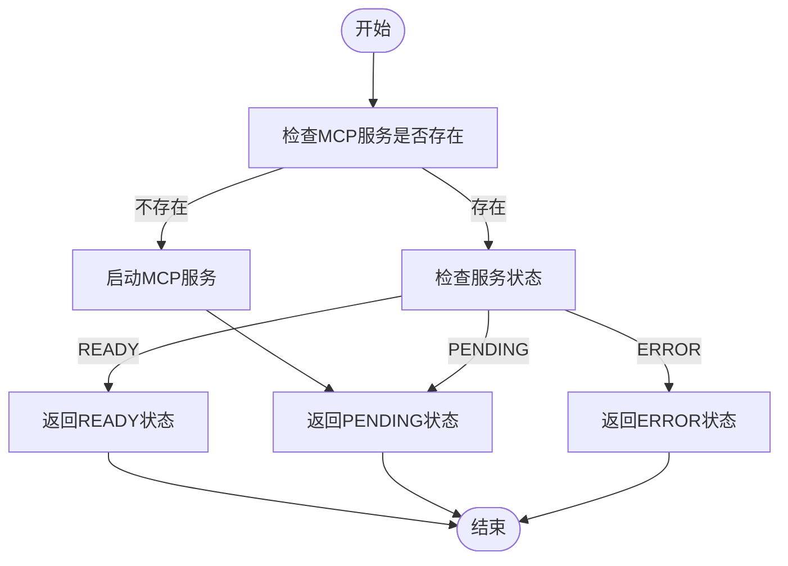
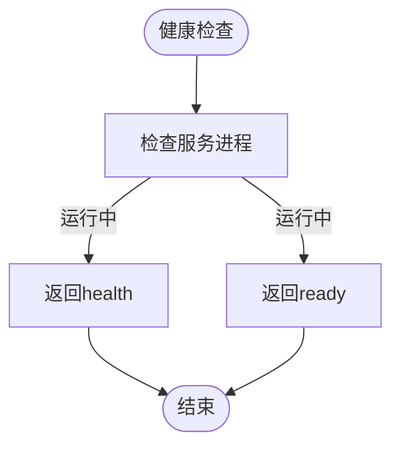
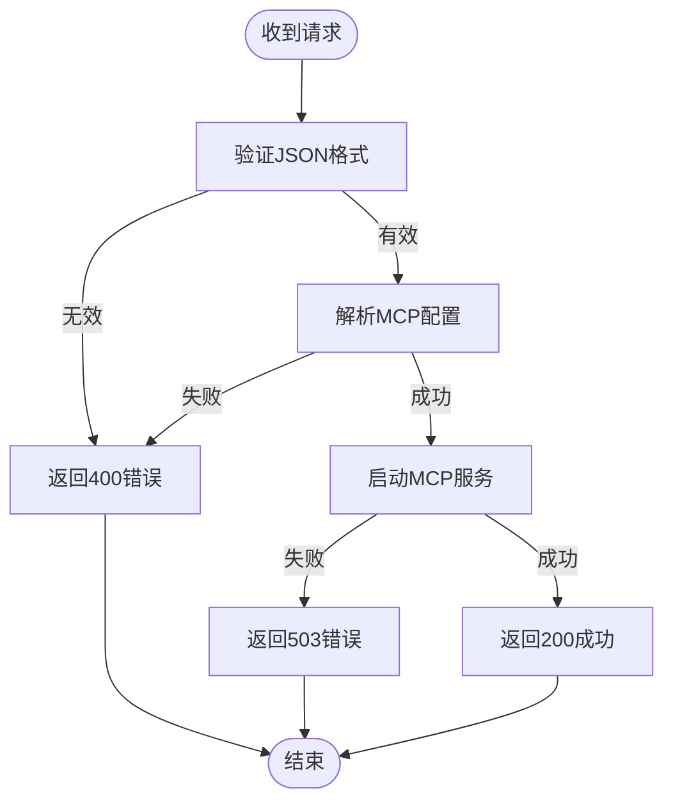

# REST API接口

<cite>
**本文档引用的文件**
- [mcp_add_handler.rs](file://mcp-proxy/src/server/handlers/mcp_add_handler.rs)
- [mcp_config.rs](file://mcp-proxy/src/model/mcp_config.rs)
- [mcp_router_model.rs](file://mcp-proxy/src/model/mcp_router_model.rs)
- [check_mcp_is_status.rs](file://mcp-proxy/src/server/handlers/check_mcp_is_status.rs)
- [mcp_check_status_handler.rs](file://mcp-proxy/src/server/handlers/mcp_check_status_handler.rs)
- [delete_route_handler.rs](file://mcp-proxy/src/server/handlers/delete_route_handler.rs)
- [health.rs](file://mcp-proxy/src/server/handlers/health.rs)
- [mcp_check_status_model.rs](file://mcp-proxy/src/model/mcp_check_status_model.rs)
- [http_result.rs](file://mcp-proxy/src/model/http_result.rs)
- [mcp_router_json.rs](file://mcp-proxy/src/server/middlewares/mcp_router_json.rs)
- [schedule_check_mcp_live.rs](file://mcp-proxy/src/server/task/schedule_check_mcp_live.rs)
</cite>

## 目录
1. [简介](#简介)
2. [/mcp/add 接口](#mcpadd-接口)
3. [/mcp/check_status 接口](#mcpcheck_status-接口)
4. [/route/{id} 接口](#routeid-接口)
5. [/health 接口](#health-接口)
6. [错误响应码说明](#错误响应码说明)
7. [curl命令示例](#curl命令示例)
8. [配置验证与错误处理](#配置验证与错误处理)

## 简介
MCP代理服务提供了一套RESTful API接口，用于动态管理MCP（Model Control Protocol）服务的生命周期。本API文档详细说明了各个端点的功能、请求格式、响应结构以及错误处理机制。核心功能包括添加新的MCP服务、检查服务状态、删除路由以及健康检查。

**本文档引用的文件**
- [mcp_add_handler.rs](file://mcp-proxy/src/server/handlers/mcp_add_handler.rs)
- [mcp_config.rs](file://mcp-proxy/src/model/mcp_config.rs)
- [mcp_router_model.rs](file://mcp-proxy/src/model/mcp_router_model.rs)

## /mcp/add 接口

该接口用于添加一个新的MCP服务配置。客户端通过POST请求发送MCP配置，服务端解析配置并启动相应的代理服务。

### 接口详情
- **HTTP方法**: POST
- **URL路径**: `/mcp/sse/add` 或 `/mcp/stream/add`
- **请求头**: 
  - `Content-Type: application/json`
- **请求体结构**:
```json
{
  "mcp_json_config": "string",
  "mcp_type": "oneShot|persistent"
}
```

### McpConfig配置模型
`McpConfig`结构体定义了MCP服务的核心配置参数，其字段与验证规则如下：

| 字段名 | 类型 | 必需 | 描述 | 验证规则 |
|-------|------|------|------|---------|
| mcpId | string | 是 | MCP服务的唯一标识符 | 由系统自动生成，使用UUID v7并移除连字符 |
| mcpJsonConfig | string | 是 | MCP服务的JSON配置字符串 | 必须为有效的JSON格式，包含`mcpServers`字段 |
| mcpType | string | 否 | MCP服务类型 | 可选值：`oneShot`（一次性任务，默认值）、`persistent`（持续运行） |
| clientProtocol | string | 否 | 客户端协议类型 | 由URL路径决定，`/mcp/sse`对应SSE协议，`/mcp/stream`对应Stream协议 |

### 序列化逻辑
在`mcp_add_handler.rs`中，JSON配置通过`McpServerConfig::try_from()`方法映射到内部结构体。具体流程如下：
1. 从请求体中提取`mcp_json_config`字符串
2. 通过`McpJsonServerParameters::from()`解析JSON
3. 调用`try_get_first_mcp_server()`获取第一个MCP服务器配置
4. 根据配置类型（命令行或URL）创建`McpServerConfig`实例

### 响应格式
成功响应（HTTP 200）:
```json
{
  "code": "0000",
  "message": "成功",
  "data": {
    "mcp_id": "string",
    "sse_path": "string",
    "message_path": "string",
    "mcp_type": "oneShot|persistent"
  },
  "success": true
}
```

**本文档引用的文件**
- [mcp_add_handler.rs](file://mcp-proxy/src/server/handlers/mcp_add_handler.rs#L1-L91)
- [mcp_config.rs](file://mcp-proxy/src/model/mcp_config.rs#L11-L102)
- [mcp_router_model.rs](file://mcp-proxy/src/model/mcp_router_model.rs#L18-L25)

## /mcp/check_status 接口

该接口用于检查MCP服务的运行状态，支持轮询机制和超时设置。

### 接口详情
- **HTTP方法**: POST
- **URL路径**: `/mcp/sse/check_status` 或 `/mcp/stream/check_status`
- **请求头**: 
  - `Content-Type: application/json`
- **请求体结构**:
```json
{
  "mcpId": "string",
  "mcpJsonConfig": "string",
  "mcpType": "oneShot|persistent",
  "backendProtocol": "stdio|sse|stream"
}
```

### 轮询机制与超时设置
- **轮询机制**: 当服务不存在时，系统会自动启动MCP服务，并返回`PENDING`状态。客户端应持续轮询直到状态变为`READY`或`ERROR`。
- **超时设置**: 系统通过`schedule_check_mcp_live.rs`中的定时任务检查服务状态。对于`oneShot`类型的服务，如果超过3分钟未被访问，则自动清理资源。

### 状态检查流程


**本文档引用的文件**
- [mcp_check_status_handler.rs](file://mcp-proxy/src/server/handlers/mcp_check_status_handler.rs#L1-L114)
- [mcp_check_status_model.rs](file://mcp-proxy/src/model/mcp_check_status_model.rs#L7-L104)
- [schedule_check_mcp_live.rs](file://mcp-proxy/src/server/task/schedule_check_mcp_live.rs#L1-L96)

## /route/{id} 接口

该接口用于删除指定ID的MCP路由。

### 接口详情
- **HTTP方法**: DELETE
- **URL路径**: `/route/{id}`
- **请求头**: 无特殊要求
- **请求体**: 无

### 幂等性保证
删除操作具有幂等性，即多次删除同一ID的路由不会产生副作用。系统通过以下机制保证幂等性：
1. 调用`get_proxy_manager().cleanup_resources()`清理资源
2. 如果资源已不存在，操作仍然返回成功
3. 返回的响应包含删除结果信息

### 响应格式
成功响应（HTTP 200）:
```json
{
  "code": "0000",
  "message": "成功",
  "data": {
    "mcp_id": "string",
    "message": "已删除路由: {mcp_id}"
  },
  "success": true
}
```

**本文档引用的文件**
- [delete_route_handler.rs](file://mcp-proxy/src/server/handlers/delete_route_handler.rs#L1-L25)

## /health 接口

该接口用于健康检查，检测系统依赖。

### 接口详情
- **HTTP方法**: GET
- **URL路径**: `/health` 和 `/ready`
- **请求头**: 无特殊要求
- **请求体**: 无

### 系统依赖检测逻辑
- `/health`: 检查服务的基本健康状态，只要服务进程存在即返回"health"
- `/ready`: 检查服务是否准备好接收请求，只要服务进程存在即返回"ready"

### 响应格式
成功响应（HTTP 200）:
- `/health` 返回: `health`
- `/ready` 返回: `ready`



**本文档引用的文件**
- [health.rs](file://mcp-proxy/src/server/handlers/health.rs#L1-L12)

## 错误响应码说明

| 错误码 | HTTP状态码 | 语义说明 | 可能原因 |
|-------|-----------|---------|---------|
| 400 | Bad Request | 请求格式错误 | 请求体JSON格式无效、缺少必需字段、协议类型不支持 |
| 404 | Not Found | 资源未找到 | 请求的MCP ID不存在、URL路径错误 |
| 503 | Service Unavailable | 服务不可用 | 后端MCP服务启动失败、资源清理失败、系统内部错误 |

**本文档引用的文件**
- [http_result.rs](file://mcp-proxy/src/model/http_result.rs#L1-L71)

## curl命令示例

### 添加MCP服务
```bash
curl -X POST http://localhost:8080/mcp/sse/add \
  -H "Content-Type: application/json" \
  -d '{
    "mcp_json_config": "{\"mcpServers\":{\"my-service\":{\"url\":\"https://example.com/mcp\",\"type\":\"sse\"}}}",
    "mcp_type": "oneShot"
  }'
```

### 检查MCP服务状态
```bash
curl -X POST http://localhost:8080/mcp/sse/check_status \
  -H "Content-Type: application/json" \
  -d '{
    "mcpId": "abc123",
    "mcpJsonConfig": "{\"mcpServers\":{\"my-service\":{\"url\":\"https://example.com/mcp\",\"type\":\"sse\"}}}",
    "mcpType": "oneShot"
  }'
```

### 删除路由
```bash
curl -X DELETE http://localhost:8080/route/abc123
```

### 健康检查
```bash
curl http://localhost:8080/health
curl http://localhost:8080/ready
```

**本文档引用的文件**
- [mcp_sse_test.rs](file://mcp-proxy/src/tests/mcp_sse_test.rs#L94-L128)

## 配置验证与错误处理

### 常见配置错误及校验时机
| 错误类型 | 校验时机 | 反馈方式 |
|---------|---------|---------|
| 无效URL | 解析`mcp_json_config`时 | 返回400错误，错误信息包含"无效的URL" |
| 不支持的协议类型 | 解析`type`字段时 | 返回400错误，错误信息包含"不支持的协议类型" |
| 缺少`mcpServers`字段 | 解析JSON时 | 返回400错误，错误信息包含"mcpServers 必须恰好只有一个MCP插件" |
| 多个MCP服务器配置 | 解析`mcpServers`时 | 返回400错误，错误信息包含"mcpServers 必须恰好只有一个MCP插件" |

### 错误反馈流程


**本文档引用的文件**
- [mcp_router_model.rs](file://mcp-proxy/src/model/mcp_router_model.rs#L180-L210)
- [mcp_config.rs](file://mcp-proxy/src/model/mcp_config.rs#L47-L57)
- [mcp_add_handler.rs](file://mcp-proxy/src/server/handlers/mcp_add_handler.rs#L86-L88)