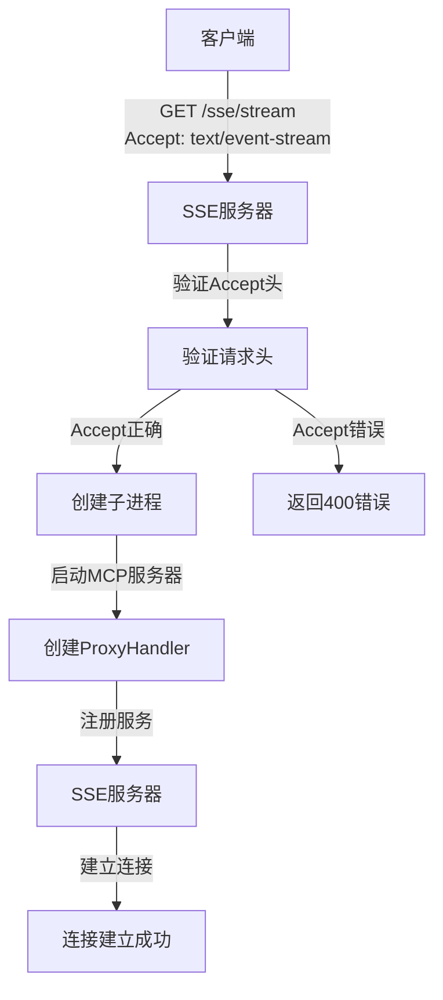
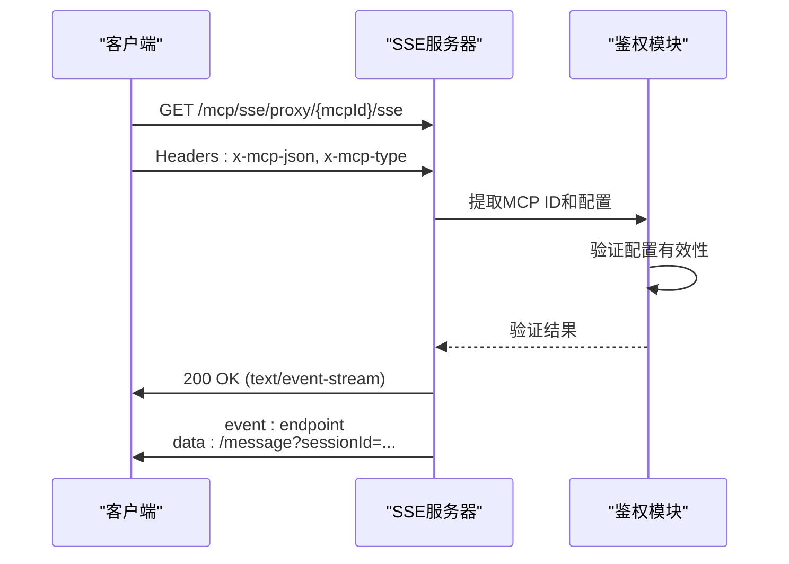
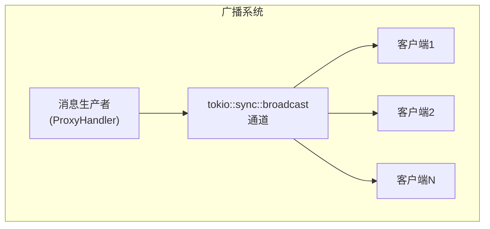
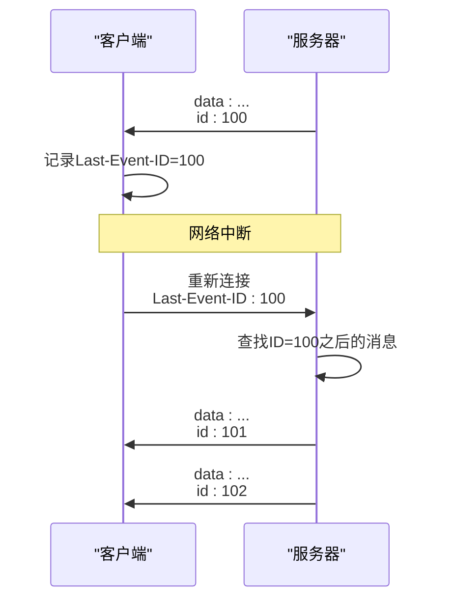
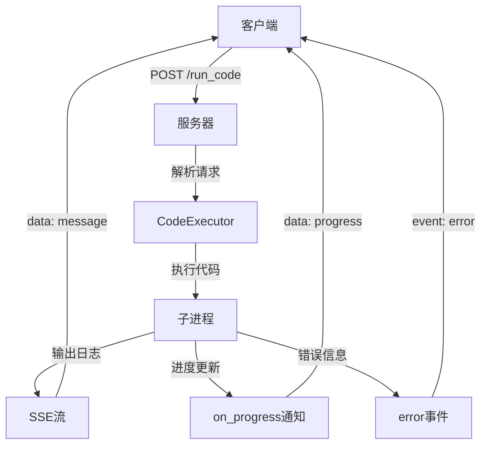
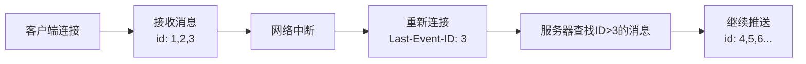

# SSE流式接口

<cite>
**本文档引用的文件**
- [sse_server.rs](file://mcp-proxy/src/server/handlers/sse_server.rs)
- [run_code_handler.rs](file://mcp-proxy/src/server/handlers/run_code_handler.rs)
- [sse_client.rs](file://mcp-proxy/src/client/sse_client.rs)
- [proxy_handler.rs](file://mcp-proxy/src/proxy/proxy_handler.rs)
- [mcp_config.rs](file://mcp-proxy/src/model/mcp_config.rs)
- [test_sse_client.py](file://mcp-proxy/test_sse_client.py)
- [test_sse_stream.sh](file://mcp-proxy/test_sse_stream.sh)
</cite>

## 目录
1. [引言](#引言)
2. [SSE连接建立过程](#sse连接建立过程)
3. [客户端鉴权机制](#客户端鉴权机制)
4. [消息帧格式与事件类型](#消息帧格式与事件类型)
5. [多客户端消息广播实现](#多客户端消息广播实现)
6. [连接超时与断线重连策略](#连接超时与断线重连策略)
7. [代码执行请求的流式输出](#代码执行请求的流式输出)
8. [客户端使用示例](#客户端使用示例)
9. [Last-Event-ID恢复机制](#last-event-id恢复机制)
10. [结论](#结论)

## 引言
本文档深入分析了SSE（Server-Sent Events）流式接口的实现细节，重点阐述了连接建立过程、客户端鉴权机制、消息帧格式、事件类型分类以及多客户端消息广播的实现原理。通过分析`run_code_handler.rs`文件，说明了代码执行请求如何通过SSE进行流式输出，包括分块传输编码的处理、执行进度推送和异常中断信号。同时提供了Python和JavaScript的完整客户端示例，并详细解释了网络中断后的Last-Event-ID恢复机制。

## SSE连接建立过程
SSE连接的建立过程通过`GET /sse/stream`端点实现。服务器端在`sse_server.rs`中配置了SSE服务器，监听指定的绑定地址和SSE路径。当客户端发起连接请求时，服务器会验证请求头中的`Accept`字段是否为`text/event-stream`，以确保客户端支持SSE协议。

连接建立过程中，服务器会创建一个子进程来处理MCP（Model Control Protocol）服务器的通信，并通过`ProxyHandler`将子进程的输出代理到SSE连接。在`run_sse_server`函数中，首先配置SSE服务器的绑定地址、SSE路径和保持连接的设置，然后创建命令行进程来启动MCP服务器。



**Diagram sources**
- [sse_server.rs](file://mcp-proxy/src/server/handlers/sse_server.rs#L27-L94)

**Section sources**
- [sse_server.rs](file://mcp-proxy/src/server/handlers/sse_server.rs#L27-L94)

## 客户端鉴权机制
客户端鉴权机制通过HTTP请求头中的自定义字段实现。在`mcp_config.rs`文件中定义了MCP配置结构，其中包含了`mcpId`、`mcpJsonConfig`等字段，这些信息通过请求头传递给服务器进行身份验证。

服务器端在接收到SSE连接请求时，会从路径中提取MCP ID，并验证客户端提供的配置信息。在`mcp_start_task.rs`文件中，可以看到服务器会检查配置中的自定义headers，包括`x-mcp-json`和`x-mcp-type`等字段，用于确定客户端的身份和配置。



**Diagram sources**
- [mcp_config.rs](file://mcp-proxy/src/model/mcp_config.rs#L11-L102)
- [mcp_start_task.rs](file://mcp-proxy/src/server/task/mcp_start_task.rs#L174-L198)

**Section sources**
- [mcp_config.rs](file://mcp-proxy/src/model/mcp_config.rs#L11-L102)
- [mcp_start_task.rs](file://mcp-proxy/src/server/task/mcp_start_task.rs#L174-L198)

## 消息帧格式与事件类型
SSE消息帧遵循标准的SSE协议格式，每条消息由一个或多个字段组成，包括`data`、`event`、`id`等。在本实现中，消息帧格式为`data: {"type":"message","content":"..."}\n\n`，其中`type`字段表示事件类型，`content`字段包含实际的消息内容。

系统定义了四种主要的事件类型：
- **message**: 普通消息事件，用于传输正常的业务数据
- **error**: 错误事件，用于传输错误信息
- **complete**: 完成事件，表示某个操作已完成
- **heartbeat**: 心跳事件，用于保持连接活跃

```mermaid
flowchart TD
subgraph "SSE消息帧"
Field1["data: {\"type\":\"message\",\"content\":\"...\"}"]
Field2["\n"]
Field3["data: {\"type\":\"error\",\"content\":\"...\"}"]
Field4["\n"]
Field5["event: heartbeat"]
Field6["\n"]
Field7["id: 123"]
Field8["\n"]
end
Field1 --> Field2
Field2 --> Field3
Field3 --> Field4
Field4 --> Field5
Field5 --> Field6
Field6 --> Field7
Field7 --> Field8
```

**Diagram sources**
- [sse_server.rs](file://mcp-proxy/src/server/handlers/sse_server.rs#L37-L43)
- [test_sse_client.py](file://mcp-proxy/test_sse_client.py#L25-L33)

**Section sources**
- [sse_server.rs](file://mcp-proxy/src/server/handlers/sse_server.rs#L37-L43)
- [test_sse_client.py](file://mcp-proxy/test_sse_client.py#L25-L33)

## 多客户端消息广播实现
多客户端消息广播的实现基于`tokio::sync::broadcast`通道。在`sse_server.rs`文件中，SSE服务器使用`SseServer`结构来管理多个客户端连接。每个客户端连接都会注册到SSE服务器的广播系统中，当有新消息产生时，服务器会通过广播通道将消息推送给所有活跃的客户端。

`ProxyHandler`在接收到子进程的输出后，会将消息转换为SSE格式并通过广播通道发送。这种设计使得多个客户端可以同时接收相同的消息流，实现了高效的多播功能。



**Diagram sources**
- [sse_server.rs](file://mcp-proxy/src/server/handlers/sse_server.rs#L84-L87)
- [proxy_handler.rs](file://mcp-proxy/src/proxy/proxy_handler.rs#L81-L82)

**Section sources**
- [sse_server.rs](file://mcp-proxy/src/server/handlers/sse_server.rs#L84-L87)
- [proxy_handler.rs](file://mcp-proxy/src/proxy/proxy_handler.rs#L81-L82)

## 连接超时与断线重连策略
连接超时与断线重连策略是SSE实现中的重要组成部分。服务器端通过`keep_alive`配置项来控制连接的保持时间，防止连接因长时间无数据传输而被中间代理或防火墙中断。

在`test_sse_stream.sh`脚本中，可以看到客户端使用`curl -N`命令来保持连接，并通过后台进程持续监听SSE流。当连接中断时，客户端可以通过重新发起连接并使用`Last-Event-ID`来恢复之前的会话状态。

服务器端还实现了心跳机制，定期发送`heartbeat`事件来保持连接活跃。在`mcp_sse_test.rs`测试文件中，可以看到客户端设置了较长的超时时间（120秒），以适应长时间的流式传输。



**Diagram sources**
- [sse_server.rs](file://mcp-proxy/src/server/handlers/sse_server.rs#L42-L43)
- [test_sse_stream.sh](file://mcp-proxy/test_sse_stream.sh#L6-L9)
- [mcp_sse_test.rs](file://mcp-proxy/src/tests/mcp_sse_test.rs#L76-L77)

**Section sources**
- [sse_server.rs](file://mcp-proxy/src/server/handlers/sse_server.rs#L42-L43)
- [test_sse_stream.sh](file://mcp-proxy/test_sse_stream.sh#L6-L9)
- [mcp_sse_test.rs](file://mcp-proxy/src/tests/mcp_sse_test.rs#L76-L77)

## 代码执行请求的流式输出
代码执行请求的流式输出通过`run_code_handler.rs`文件实现。该处理器接收代码执行请求，通过`CodeExecutor`执行指定的代码，并将执行过程中的日志、结果和错误信息通过SSE流式返回给客户端。

在执行过程中，系统会处理分块传输编码，将大块的输出数据分割成较小的消息帧发送。同时，执行进度信息也会通过`on_progress`通知推送给客户端。如果执行过程中发生异常，系统会发送`error`事件并中断连接。



**Diagram sources**
- [run_code_handler.rs](file://mcp-proxy/src/server/handlers/run_code_handler.rs#L38-L92)
- [proxy_handler.rs](file://mcp-proxy/src/proxy/proxy_handler.rs#L387-L402)

**Section sources**
- [run_code_handler.rs](file://mcp-proxy/src/server/handlers/run_code_handler.rs#L38-L92)
- [proxy_handler.rs](file://mcp-proxy/src/proxy/proxy_handler.rs#L387-L402)

## 客户端使用示例
### Python客户端示例
使用`requests`和`sseclient`库的Python客户端示例如下：

```python
import requests
import sseclient

def listen_sse():
    response = requests.get(SSE_URL, headers={'Accept': 'text/event-stream'}, stream=True)
    client = sseclient.SSEClient(response)
    
    for event in client.events():
        print(f"Event: {event.event}")
        print(f"Data: {event.data}")
        
        if event.event == "endpoint":
            MESSAGE_URL = f"{BASE_URL}{event.data}"
            print(f"获取到 MESSAGE_URL: {MESSAGE_URL}")
```

### JavaScript客户端示例
使用原生`EventSource`的JavaScript客户端示例如下：

```javascript
const eventSource = new EventSource('/sse/stream');

eventSource.onmessage = function(event) {
    console.log('Received message:', event.data);
};

eventSource.addEventListener('heartbeat', function(event) {
    console.log('Received heartbeat');
});

eventSource.onerror = function(event) {
    console.error('Error occurred:', event);
    eventSource.close();
};
```

**Section sources**
- [test_sse_client.py](file://mcp-proxy/test_sse_client.py#L17-L44)
- [test_sse_stream.sh](file://mcp-proxy/test_sse_stream.sh#L6-L8)

## Last-Event-ID恢复机制
Last-Event-ID恢复机制允许客户端在网络中断后恢复之前的SSE会话。当客户端重新连接时，可以在请求头中包含`Last-Event-ID`字段，服务器会从指定ID之后的消息开始推送。

在`test_sse_complete.sh`脚本中，可以看到客户端从SSE输出中提取`sessionId`，并在后续的POST请求中使用该ID。这种机制确保了即使在网络不稳定的情况下，客户端也不会丢失任何消息。



**Diagram sources**
- [test_sse_complete.sh](file://mcp-proxy/test_sse_complete.sh#L39-L42)
- [test_sse_stream.sh](file://mcp-proxy/test_sse_stream.sh#L21-L22)

**Section sources**
- [test_sse_complete.sh](file://mcp-proxy/test_sse_complete.sh#L39-L42)
- [test_sse_stream.sh](file://mcp-proxy/test_sse_stream.sh#L21-L22)

## 结论
本文档详细分析了SSE流式接口的实现细节，涵盖了连接建立、客户端鉴权、消息格式、多客户端广播、超时重连、代码执行流式输出以及恢复机制等关键方面。通过`tokio::sync::broadcast`通道实现了高效的多客户端消息广播，结合`Last-Event-ID`机制确保了消息的可靠传输。该SSE实现为实时流式数据传输提供了一个稳定、高效的解决方案，适用于需要实时更新和长连接的各种应用场景。