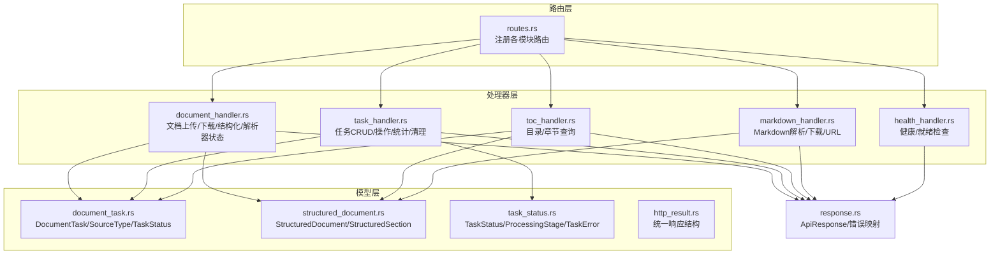
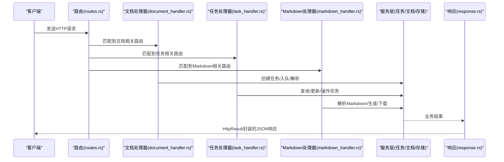
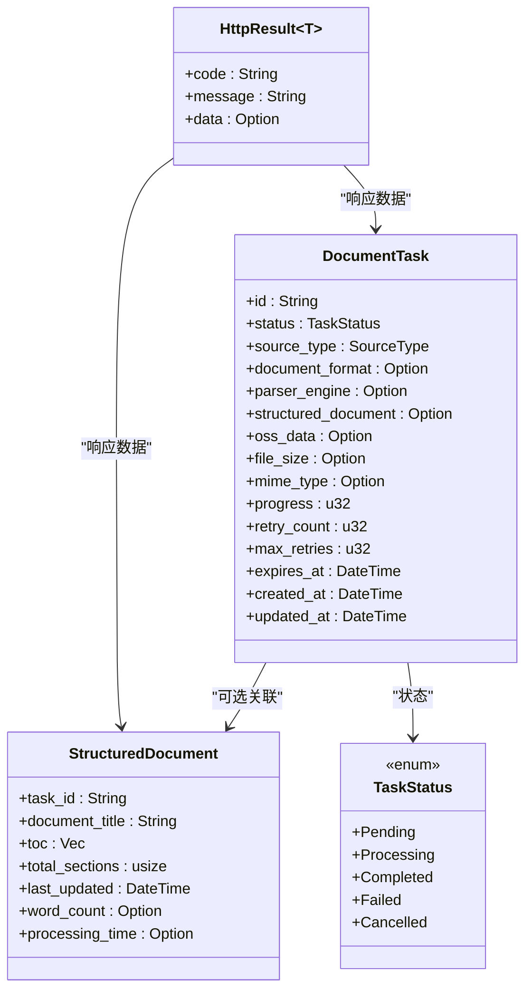

# 文档解析API

<cite>
**本文引用的文件**
- [routes.rs](file://document-parser/src/routes.rs)
- [document_handler.rs](file://document-parser/src/handlers/document_handler.rs)
- [task_handler.rs](file://document-parser/src/handlers/task_handler.rs)
- [toc_handler.rs](file://document-parser/src/handlers/toc_handler.rs)
- [markdown_handler.rs](file://document-parser/src/handlers/markdown_handler.rs)
- [health_handler.rs](file://document-parser/src/handlers/health_handler.rs)
- [response.rs](file://document-parser/src/handlers/response.rs)
- [validation.rs](file://document-parser/src/handlers/validation.rs)
- [document_task.rs](file://document-parser/src/models/document_task.rs)
- [structured_document.rs](file://document-parser/src/models/structured_document.rs)
- [task_status.rs](file://document-parser/src/models/task_status.rs)
- [http_result.rs](file://document-parser/src/models/http_result.rs)
</cite>

## 目录
1. [简介](#简介)
2. [项目结构](#项目结构)
3. [核心组件](#核心组件)
4. [架构总览](#架构总览)
5. [详细接口说明](#详细接口说明)
6. [依赖关系分析](#依赖关系分析)
7. [性能与并发特性](#性能与并发特性)
8. [故障排查指南](#故障排查指南)
9. [结论](#结论)
10. [附录](#附录)

## 简介
本文件为“文档解析服务”的API参考文档，覆盖以下公开HTTP接口：
- 文档上传与解析（POST /api/v1/documents/upload）
- URL文档下载解析（POST /api/v1/documents/uploadFromUrl）
- 结构化文档生成（POST /api/v1/documents/structured）
- 任务状态查询（GET /api/v1/tasks/{task_id}）
- 任务列表与筛选（GET /api/v1/tasks）
- 任务操作（取消、重试、删除、批量操作）
- 任务统计与清理（GET /api/v1/tasks/stats, POST /api/v1/tasks/cleanup）
- 目录与章节（GET /api/v1/tasks/{task_id}/toc, GET /api/v1/tasks/{task_id}/sections, GET /api/v1/tasks/{task_id}/section/{section_id}）
- Markdown处理（POST /api/v1/documents/markdown/parse, POST /api/v1/documents/markdown/sections）
- Markdown下载与URL（GET /api/v1/tasks/{task_id}/markdown/download, GET /api/v1/tasks/{task_id}/markdown/url）
- 健康检查（GET /health, GET /ready）
- 解析器能力与健康（GET /api/v1/documents/formats, GET /api/v1/documents/parser/stats, GET /api/v1/documents/parser/health）

文档重点说明各接口的HTTP方法、URL路径、请求头、请求体结构（使用serde序列化模型）、查询参数、响应格式（含成功与错误情况）、可能的HTTP状态码，并结合DocumentTask与StructuredDocument等数据模型解释API中的使用方式。同时提供curl示例、错误处理策略与认证/速率限制说明。

## 项目结构
- 路由注册集中在路由模块，按API版本与功能域进行分组（文档、任务、OSS、Markdown、健康）。
- 处理器层负责业务编排与错误转换，统一返回HttpResult格式。
- 模型层定义DocumentTask、StructuredDocument、TaskStatus等核心数据结构，贯穿任务生命周期与结果表达。

图表来源
- [routes.rs](file://document-parser/src/routes.rs#L1-L127)
- [document_handler.rs](file://document-parser/src/handlers/document_handler.rs#L1-L1113)
- [task_handler.rs](file://document-parser/src/handlers/task_handler.rs#L1-L1104)
- [toc_handler.rs](file://document-parser/src/handlers/toc_handler.rs#L1-L236)
- [markdown_handler.rs](file://document-parser/src/handlers/markdown_handler.rs#L1-L1050)
- [health_handler.rs](file://document-parser/src/handlers/health_handler.rs#L1-L38)
- [document_task.rs](file://document-parser/src/models/document_task.rs#L1-L361)
- [structured_document.rs](file://document-parser/src/models/structured_document.rs#L1-L200)
- [task_status.rs](file://document-parser/src/models/task_status.rs#L1-L200)
- [http_result.rs](file://document-parser/src/models/http_result.rs#L1-L73)
- [response.rs](file://document-parser/src/handlers/response.rs#L1-L132)

章节来源
- [routes.rs](file://document-parser/src/routes.rs#L1-L127)

## 核心组件
- 统一响应结构：HttpResult，包含code、message、data三要素，便于前后端一致处理。
- 错误映射：ApiResponse将AppError映射为标准HTTP状态码与错误码。
- 任务模型：DocumentTask承载任务全生命周期信息；TaskStatus描述状态机与阶段；StructuredDocument承载解析后的结构化文档。
- 验证器：RequestValidator提供URL、文件、任务ID、分页、排序、Markdown内容、TOC配置等验证。

章节来源
- [http_result.rs](file://document-parser/src/models/http_result.rs#L1-L73)
- [response.rs](file://document-parser/src/handlers/response.rs#L1-L132)
- [document_task.rs](file://document-parser/src/models/document_task.rs#L1-L200)
- [task_status.rs](file://document-parser/src/models/task_status.rs#L1-L120)
- [structured_document.rs](file://document-parser/src/models/structured_document.rs#L1-L120)
- [validation.rs](file://document-parser/src/handlers/validation.rs#L1-L120)

## 架构总览
- 中间件：Tracing、CORS、默认Body Limit（受全局文件大小配置控制）。
- 文档模块：上传/URL下载触发任务创建与入队；解析完成后生成StructuredDocument并可查询目录/章节。
- 任务模块：提供任务CRUD、状态查询、进度查询、批量操作、统计与清理。
- Markdown模块：支持同步解析Markdown为结构化文档，支持下载与临时URL。
- 健康模块：/health与/ready分别返回服务健康与就绪状态。

图表来源
- [routes.rs](file://document-parser/src/routes.rs#L1-L127)
- [document_handler.rs](file://document-parser/src/handlers/document_handler.rs#L1-L200)
- [task_handler.rs](file://document-parser/src/handlers/task_handler.rs#L1-L120)
- [markdown_handler.rs](file://document-parser/src/handlers/markdown_handler.rs#L1-L120)
- [response.rs](file://document-parser/src/handlers/response.rs#L1-L132)

## 详细接口说明

### 健康检查
- GET /health
  - 功能：返回服务健康状态
  - 响应：HttpResult<String>，code=0000，message为“health”
  - 状态码：200
  - 示例：curl -i http://host/health

- GET /ready
  - 功能：返回服务就绪状态
  - 响应：HttpResult<String>，成功时code=0000，失败时返回错误码与消息
  - 状态码：200（就绪），500（未就绪）
  - 示例：curl -i http://host/ready

章节来源
- [health_handler.rs](file://document-parser/src/handlers/health_handler.rs#L1-L38)
- [http_result.rs](file://document-parser/src/models/http_result.rs#L1-L73)

### 文档上传与解析
- POST /api/v1/documents/upload
  - 功能：多部分表单上传文件，触发解析任务
  - 请求头：Content-Type: multipart/form-data
  - 查询参数：
    - enable_toc: 是否启用目录生成（可选）
    - max_toc_depth: 目录最大深度（可选，默认3，范围1-10）
    - bucket_dir: 上传到OSS时的子目录（可选）
  - 请求体：multipart字段file，文件内容
  - 成功响应：HttpResult<UploadResponse>
    - UploadResponse包含task_id、message、FileInfo（filename、size、format、mime_type）
  - 错误响应：HttpResult<UploadResponse>，常见错误码与状态：
    - VALIDATION_ERROR/BAD_REQUEST：参数校验失败（如文件名非法、TOC配置非法、文件扩展名不支持、文件过大、空文件、过小文件）
    - REQUEST_TIMEOUT：上传超时（504）
    - INTERNAL_ERROR：内部错误
  - 状态码：202（Accepted，任务已创建并入队），400、408、413、415、500
  - curl示例：
    - curl -i -X POST -F "file=@/path/to/doc.pdf" "http://host/api/v1/documents/upload?enable_toc=true&max_toc_depth=6&bucket_dir=projectA/docs/v1"

- POST /api/v1/documents/uploadFromUrl
  - 功能：通过URL下载文档并解析
  - 请求头：Content-Type: application/json
  - 请求体：DownloadDocumentRequest
    - url: 文档URL
    - enable_toc/max_toc_depth: 同上
    - bucket_dir: 同上
  - 成功响应：HttpResult<DocumentParseResponse>
    - DocumentParseResponse包含task_id与消息
  - 错误响应：HttpResult<DocumentParseResponse>
  - 状态码：202（Accepted），400、500
  - curl示例：
    - curl -i -X POST -H "Content-Type: application/json" -d '{"url":"https://example.com/doc.pdf","enable_toc":true,"max_toc_depth":6}' http://host/api/v1/documents/uploadFromUrl

- POST /api/v1/documents/structured
  - 功能：将Markdown内容转为结构化文档
  - 请求头：Content-Type: application/json
  - 请求体：GenerateStructuredDocumentRequest
    - markdown_content: Markdown文本
    - enable_toc/max_toc_depth: 目录开关与深度
    - enable_anchors: 是否启用锚点（可选）
  - 成功响应：HttpResult<StructuredDocumentResponse>
    - StructuredDocumentResponse包含StructuredDocument
  - 错误响应：HttpResult<StructuredDocumentResponse>
  - 状态码：200、400
  - curl示例：
    - curl -i -X POST -H "Content-Type: application/json" -d '{"markdown_content":"# Title\n\nContent","enable_toc":true,"max_toc_depth":6}' http://host/api/v1/documents/structured

- GET /api/v1/documents/formats
  - 功能：返回支持的文档格式列表
  - 成功响应：HttpResult<SupportedFormatsResponse>
  - 状态码：200

- GET /api/v1/documents/parser/stats
  - 功能：返回解析器统计信息
  - 成功响应：HttpResult<ParserStatsResponse>
  - 状态码：200

- GET /api/v1/documents/parser/health
  - 功能：检查解析器健康状态
  - 成功响应：HttpResult<...>（具体结构由服务实现）
  - 状态码：200、500

章节来源
- [document_handler.rs](file://document-parser/src/handlers/document_handler.rs#L1-L200)
- [document_handler.rs](file://document-parser/src/handlers/document_handler.rs#L800-L1113)
- [response.rs](file://document-parser/src/handlers/response.rs#L1-L132)
- [http_result.rs](file://document-parser/src/models/http_result.rs#L1-L73)

### 任务管理
- POST /api/v1/tasks
  - 功能：创建任务
  - 请求头：Content-Type: application/json
  - 请求体：CreateTaskRequest
    - source_type: Upload/Url
    - source_path: 文件路径（Upload时）
    - format: 文档格式
  - 成功响应：HttpResult<TaskOperationResponse>
  - 状态码：201、400、500

- GET /api/v1/tasks
  - 功能：分页列出任务
  - 查询参数：
    - page/page_size: 分页（page>=1，page_size∈[1,100]）
    - status/format/source_type/sort_by/sort_order/search/created_after/created_before/min_file_size/max_file_size
  - 成功响应：HttpResult<TaskListResponse>
  - 状态码：200、400、500

- GET /api/v1/tasks/{task_id}
  - 功能：获取任务详情
  - 成功响应：HttpResult<TaskOperationResponse>
  - 状态码：200、404、500

- POST /api/v1/tasks/{task_id}/cancel
  - 功能：取消任务
  - 查询参数：reason（可选）
  - 成功响应：HttpResult<TaskOperationResponse>
  - 状态码：200、400、404、500

- POST /api/v1/tasks/{task_id}/retry
  - 功能：重试任务
  - 成功响应：HttpResult<TaskOperationResponse>
  - 状态码：200、400、404、500

- DELETE /api/v1/tasks/{task_id}
  - 功能：删除任务
  - 成功响应：HttpResult<TaskOperationResponse>
  - 状态码：200、400、404、500

- POST /api/v1/tasks/batch
  - 功能：批量操作（取消/删除/重试）
  - 查询参数：task_ids[]、operation（cancel/delete/retry）、reason（可选）
  - 成功响应：HttpResult<BatchOperationResponse>
  - 状态码：200、400、500

- GET /api/v1/tasks/stats
  - 功能：获取任务统计
  - 成功响应：HttpResult<TaskStatsResponse>
  - 状态码：200、500

- POST /api/v1/tasks/cleanup
  - 功能：清理过期任务
  - 成功响应：HttpResult<String>
  - 状态码：200、500

- GET /api/v1/tasks/{task_id}/progress
  - 功能：获取任务进度（简化版）
  - 成功响应：HttpResult<HashMap<String, serde_json::Value>>
  - 状态码：200、404、500

章节来源
- [task_handler.rs](file://document-parser/src/handlers/task_handler.rs#L1-L200)
- [task_handler.rs](file://document-parser/src/handlers/task_handler.rs#L200-L620)
- [task_handler.rs](file://document-parser/src/handlers/task_handler.rs#L620-L1104)
- [response.rs](file://document-parser/src/handlers/response.rs#L1-L132)
- [http_result.rs](file://document-parser/src/models/http_result.rs#L1-L73)

### 目录与章节
- GET /api/v1/tasks/{task_id}/toc
  - 功能：获取结构化文档的目录
  - 成功响应：HttpResult<TocResponse>
    - TocResponse包含task_id、toc（StructuredSection数组）、total_sections
  - 状态码：200、404、500

- GET /api/v1/tasks/{task_id}/sections
  - 功能：获取所有章节（含文档标题）
  - 成功响应：HttpResult<SectionsResponse>
    - SectionsResponse包含task_id、document_title、toc、total_sections
  - 状态码：200、404、500

- GET /api/v1/tasks/{task_id}/section/{section_id}
  - 功能：获取指定章节内容
  - 成功响应：HttpResult<SectionResponse>
    - SectionResponse包含section_id、title、content、level、has_children
  - 状态码：200、404、500

章节来源
- [toc_handler.rs](file://document-parser/src/handlers/toc_handler.rs#L1-L236)
- [structured_document.rs](file://document-parser/src/models/structured_document.rs#L1-L120)
- [http_result.rs](file://document-parser/src/models/http_result.rs#L1-L73)

### Markdown处理
- POST /api/v1/documents/markdown/parse
  - 功能：同步解析Markdown文件（multipart）
  - 请求头：Content-Type: multipart/form-data
  - 查询参数：enable_toc、max_toc_depth、enable_anchors、enable_cache
  - 请求体：multipart字段file（.md/.markdown）
  - 成功响应：HttpResult<SectionsSyncResponse>
    - SectionsSyncResponse包含document（StructuredDocument）、processing_time_ms、word_count
  - 状态码：200、400、413、500

- GET /api/v1/tasks/{task_id}/markdown/download
  - 功能：下载Markdown（支持Range与临时URL）
  - 查询参数：temp（是否生成临时URL）、expires_hours（临时URL过期小时）、force_regenerate（强制重新生成）、format（下载格式）
  - 成功响应：text/markdown（支持200/206）
  - 状态码：200、206、400、404、500

- GET /api/v1/tasks/{task_id}/markdown/url
  - 功能：获取Markdown URL（可选临时URL）
  - 查询参数：temp、expires_hours（1-168）、force_regenerate、format
  - 成功响应：HttpResult<MarkdownUrlResponse>
    - MarkdownUrlResponse包含url、task_id、temporary、expires_in_hours、file_size、content_type、oss_file_name、oss_bucket
  - 状态码：200、400、404、500

章节来源
- [markdown_handler.rs](file://document-parser/src/handlers/markdown_handler.rs#L1-L200)
- [markdown_handler.rs](file://document-parser/src/handlers/markdown_handler.rs#L200-L620)
- [markdown_handler.rs](file://document-parser/src/handlers/markdown_handler.rs#L620-L1050)
- [structured_document.rs](file://document-parser/src/models/structured_document.rs#L1-L200)
- [http_result.rs](file://document-parser/src/models/http_result.rs#L1-L73)

## 依赖关系分析
- 路由到处理器：routes.rs将URL映射到各处理器函数，处理器通过State注入AppState，进而访问TaskService、DocumentService、OssClient等。
- 处理器到模型：处理器读取/写入DocumentTask、StructuredDocument、TaskStatus等模型，保证数据一致性。
- 错误到响应：ApiResponse将AppError映射为标准HTTP状态码与错误码，统一返回HttpResult结构。
- 验证到处理器：RequestValidator集中校验输入，降低重复逻辑。

图表来源
- [document_task.rs](file://document-parser/src/models/document_task.rs#L1-L200)
- [structured_document.rs](file://document-parser/src/models/structured_document.rs#L1-L120)
- [task_status.rs](file://document-parser/src/models/task_status.rs#L1-L120)
- [http_result.rs](file://document-parser/src/models/http_result.rs#L1-L73)

章节来源
- [routes.rs](file://document-parser/src/routes.rs#L1-L127)
- [response.rs](file://document-parser/src/handlers/response.rs#L1-L132)
- [validation.rs](file://document-parser/src/handlers/validation.rs#L1-L120)

## 性能与并发特性
- 并发上传：上传处理器支持流式写入与分块（默认64KB），并限制最大并发上传数（默认10），超时时间默认5分钟。
- 文件大小限制：受全局文件大小配置控制，超出将返回413。
- 解析器缓存：提供清理与统计接口，便于运维控制资源占用。
- CORS与Tracing：默认开启跨域与请求追踪，便于调试与可观测性。

章节来源
- [document_handler.rs](file://document-parser/src/handlers/document_handler.rs#L40-L120)
- [routes.rs](file://document-parser/src/routes.rs#L1-L60)
- [markdown_handler.rs](file://document-parser/src/handlers/markdown_handler.rs#L370-L460)

## 故障排查指南
- 常见错误与状态码
  - 400（Bad Request）：请求参数错误（如URL非法、文件扩展名不支持、TOC配置非法、Markdown内容为空或过大、分页参数非法）
  - 404（Not Found）：任务不存在
  - 408（Request Timeout）：上传超时
  - 413（Payload Too Large）：文件过大
  - 415（Unsupported Media Type）：不支持的文件格式
  - 500（Internal Server Error）：内部错误
  - 502/503：OSS网关错误（如OSS上传失败）
- 错误映射策略
  - AppError::Validation → 400
  - AppError::File/UnsupportedFormat → 400
  - AppError::Task → 404
  - AppError::Timeout → 408
  - AppError::Parse/MinerU/MarkItDown → 422
  - AppError::Database/Internal → 500
  - AppError::Oss → 502
- 建议排查步骤
  - 检查URL格式与可达性（仅支持http/https，禁止本地地址）
  - 检查文件扩展名与大小限制
  - 检查OSS配置与权限
  - 查看/ready接口确认服务就绪
  - 使用/ready与日志定位解析器健康问题

章节来源
- [response.rs](file://document-parser/src/handlers/response.rs#L1-L132)
- [validation.rs](file://document-parser/src/handlers/validation.rs#L1-L200)
- [health_handler.rs](file://document-parser/src/handlers/health_handler.rs#L1-L38)

## 结论
本文档对文档解析服务的公开HTTP接口进行了全面梳理，涵盖上传、下载、解析、任务管理、目录章节、Markdown处理与健康检查等核心能力。通过统一的HttpResult响应结构与完善的错误映射，配合路由与处理器的清晰职责划分，系统具备良好的可维护性与可扩展性。建议在生产环境中结合限流、熔断与可观测性手段保障稳定性。

## 附录

### 数据模型与API使用要点
- DocumentTask：任务生命周期与状态机，用于任务查询、进度、统计与清理。
- StructuredDocument：结构化文档载体，包含目录、章节、统计信息。
- TaskStatus：状态枚举与阶段，用于任务进度与错误上下文。
- HttpResult：统一响应包装，便于前端与SDK消费。

章节来源
- [document_task.rs](file://document-parser/src/models/document_task.rs#L1-L200)
- [structured_document.rs](file://document-parser/src/models/structured_document.rs#L1-L200)
- [task_status.rs](file://document-parser/src/models/task_status.rs#L1-L200)
- [http_result.rs](file://document-parser/src/models/http_result.rs#L1-L73)