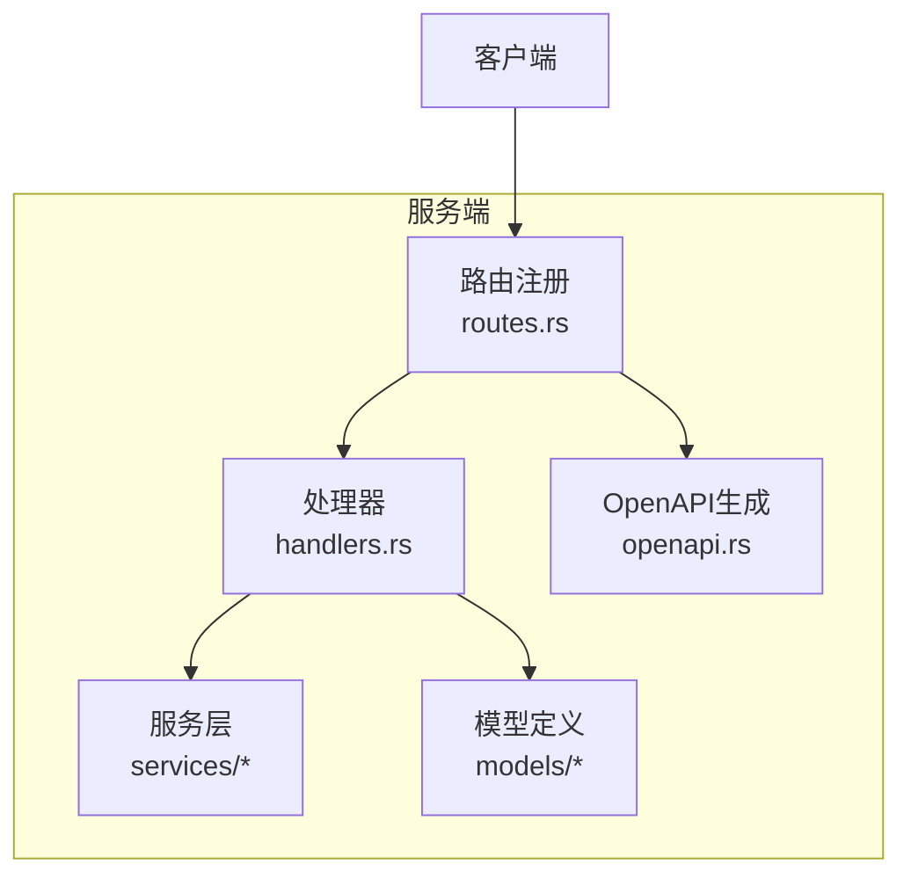
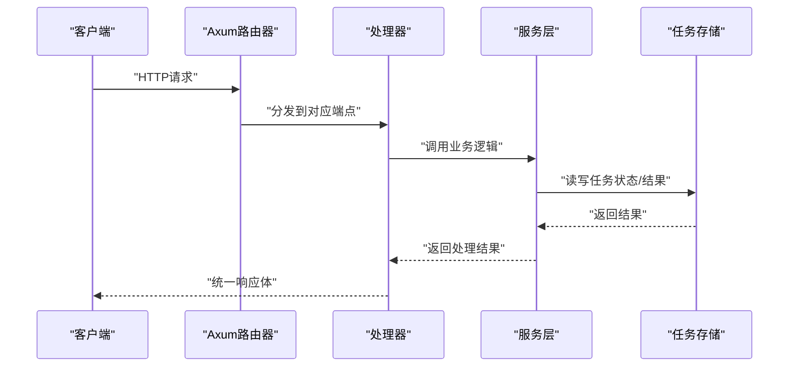
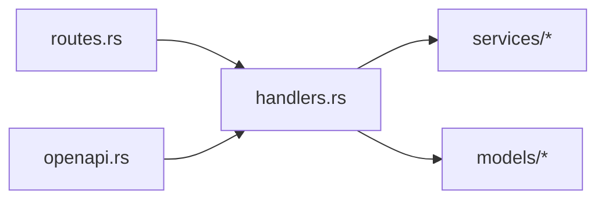

# 语音处理API

<cite>
**本文引用的文件**
- [handlers.rs](file://voice-cli/src/server/handlers.rs)
- [routes.rs](file://voice-cli/src/server/routes.rs)
- [openapi.rs](file://voice-cli/src/openapi.rs)
- [tts.rs](file://voice-cli/src/models/tts.rs)
- [stepped_task.rs](file://voice-cli/src/models/stepped_task.rs)
- [request.rs](file://voice-cli/src/models/request.rs)
- [http_result.rs](file://voice-cli/src/models/http_result.rs)
- [tts_service.rs](file://voice-cli/src/services/tts_service.rs)
- [config.rs](file://voice-cli/src/models/config.rs)
</cite>

## 目录
1. [简介](#简介)
2. [项目结构](#项目结构)
3. [核心组件](#核心组件)
4. [架构总览](#架构总览)
5. [详细组件分析](#详细组件分析)
6. [依赖关系分析](#依赖关系分析)
7. [性能考量](#性能考量)
8. [故障排查指南](#故障排查指南)
9. [结论](#结论)
10. [附录](#附录)

## 简介
本文件为语音处理CLI服务的API参考文档，聚焦于HTTP接口设计与行为说明。内容覆盖以下端点：
- 语音合成（POST /tts/sync、POST /api/v1/tasks/tts）
- 任务状态查询（GET /api/v1/tasks/{task_id}）
- 任务结果获取（GET /api/v1/tasks/{task_id}/result）
- 健康检查（GET /health）
- 模型列表（GET /models）
- 同步转录（POST /transcribe）
- 异步转录（POST /api/v1/tasks/transcribe、POST /api/v1/tasks/transcribeFromUrl）

文档同时说明TTS请求的JSON结构、响应格式、音频格式与采样率支持、SteppedTask模型在任务管理中的应用、HTTP流式响应的使用方式，以及multipart/form-data上传音频文件进行转录的示例。错误处理机制与OpenAPI规范生成情况亦在文中给出。

## 项目结构
语音处理服务采用Axum框架构建，路由集中在routes.rs中注册，具体业务逻辑在handlers.rs中实现；模型定义位于models子模块，服务层封装在services子模块，OpenAPI规范由openapi.rs生成。

图表来源
- [routes.rs](file://voice-cli/src/server/routes.rs#L1-L82)
- [handlers.rs](file://voice-cli/src/server/handlers.rs#L1-L120)
- [openapi.rs](file://voice-cli/src/openapi.rs#L1-L85)

章节来源
- [routes.rs](file://voice-cli/src/server/routes.rs#L1-L82)

## 核心组件
- 路由与中间件：集中于create_routes与create_routes_with_state，挂载健康检查、模型列表、转录、TTS、任务管理等端点，并统一接入中间件层。
- 处理器：实现各HTTP端点的业务逻辑，负责请求解析、参数校验、调用服务层、构造统一响应体。
- 模型：定义请求/响应结构、任务状态、错误类型、音频格式枚举等。
- 服务层：封装TTS服务、转录引擎、任务队列管理等。
- OpenAPI：通过utoipa自动生成Swagger UI与OpenAPI JSON。

章节来源
- [handlers.rs](file://voice-cli/src/server/handlers.rs#L1-L120)
- [routes.rs](file://voice-cli/src/server/routes.rs#L1-L82)
- [openapi.rs](file://voice-cli/src/openapi.rs#L1-L85)

## 架构总览
下图展示服务启动、路由注册、处理器与服务层交互的整体流程。

图表来源
- [routes.rs](file://voice-cli/src/server/routes.rs#L1-L82)
- [handlers.rs](file://voice-cli/src/server/handlers.rs#L1-L120)

## 详细组件分析

### 健康检查（GET /health）
- 功能：检查服务运行状态、模型加载情况、运行时长与版本。
- 响应：统一响应体，包含状态、已加载模型列表、运行时长（秒）、版本号。
- 状态码：200表示健康，500表示异常。

章节来源
- [handlers.rs](file://voice-cli/src/server/handlers.rs#L93-L117)

### 模型列表（GET /models）
- 功能：返回当前支持的Whisper模型列表与已加载模型。
- 响应：统一响应体，包含available_models、loaded_models、model_info。
- 状态码：200成功，500服务器错误。

章节来源
- [handlers.rs](file://voice-cli/src/server/handlers.rs#L119-L144)

### 同步转录（POST /transcribe）
- 功能：上传音频文件进行同步转录，立即返回结果。
- 请求：multipart/form-data，字段包括：
  - file/audio：音频文件（二进制）
  - model：可选，指定模型名称
  - response_format：可选，响应格式（如json）
- 响应：统一响应体，data为TranscriptionResponse：
  - text：完整文本
  - segments：分段数组，包含start、end、text、confidence
  - language：语言代码（可选）
  - duration：音频时长（秒，可选）
  - processing_time：处理耗时（秒）
  - metadata：音视频元数据（可选）
- 状态码：200成功，400请求无效，413文件过大，500服务器错误。

章节来源
- [handlers.rs](file://voice-cli/src/server/handlers.rs#L146-L259)
- [request.rs](file://voice-cli/src/models/request.rs#L74-L115)

### 异步转录（POST /api/v1/tasks/transcribe）
- 功能：提交异步转录任务，立即返回任务ID。
- 请求：multipart/form-data，字段同上。
- 响应：统一响应体，data为AsyncTaskResponse：
  - task_id：任务标识
  - status：任务初始状态（Pending）
  - estimated_completion：预计完成时间（可选）
- 状态码：200成功，400请求无效，413文件过大，500服务器错误。

章节来源
- [handlers.rs](file://voice-cli/src/server/handlers.rs#L261-L332)

### 通过URL提交异步转录（POST /api/v1/tasks/transcribeFromUrl）
- 功能：通过URL下载音频文件进行异步转录，立即返回任务ID。
- 请求：application/json，包含url、model（可选）、response_format（可选）。
- 响应：统一响应体，data为AsyncTaskResponse。
- 状态码：200成功，400请求无效，500服务器错误。

章节来源
- [handlers.rs](file://voice-cli/src/server/handlers.rs#L334-L401)

### 任务状态查询（GET /api/v1/tasks/{task_id}）
- 功能：根据任务ID查询转录任务的当前状态。
- 响应：统一响应体，data为TaskStatusResponse：
  - task_id：任务标识
  - status：SimpleTaskStatus（Pending/Processing/Completed/Failed/Cancelled）
  - message：状态消息（根据状态填充）
  - created_at/updated_at：时间戳
- 状态码：200成功，404任务不存在，500服务器错误。

章节来源
- [handlers.rs](file://voice-cli/src/server/handlers.rs#L403-L453)
- [stepped_task.rs](file://voice-cli/src/models/stepped_task.rs#L116-L141)

### 获取任务结果（GET /api/v1/tasks/{task_id}/result）
- 功能：获取已完成任务的转录结果。
- 响应：统一响应体，data为TranscriptionResponse。
- 状态码：200成功，404任务不存在或结果不可用，400任务未完成，500服务器错误。

章节来源
- [handlers.rs](file://voice-cli/src/server/handlers.rs#L455-L496)
- [request.rs](file://voice-cli/src/models/request.rs#L74-L115)

### 取消任务（POST /api/v1/tasks/{task_id}）
- 功能：取消待处理或正在处理的转录任务。
- 响应：统一响应体，data为CancelResponse。
- 状态码：200成功，404任务不存在，400任务无法取消，500服务器错误。

章节来源
- [handlers.rs](file://voice-cli/src/server/handlers.rs#L498-L536)

### 重试任务（POST /api/v1/tasks/{task_id}/retry）
- 功能：重试已失败或已取消的转录任务。
- 响应：统一响应体，data为RetryResponse。
- 状态码：200成功，404任务不存在，400任务无法重试，500服务器错误。

章节来源
- [handlers.rs](file://voice-cli/src/server/handlers.rs#L538-L577)

### 删除任务（DELETE /api/v1/tasks/{task_id}/delete）
- 功能：彻底删除任务数据，包括状态和结果。
- 响应：统一响应体，data为DeleteResponse。
- 状态码：200成功，404任务不存在，500服务器错误。

章节来源
- [handlers.rs](file://voice-cli/src/server/handlers.rs#L578-L616)

### 获取任务统计（GET /api/v1/tasks/stats）
- 功能：获取当前任务执行情况的统计信息。
- 响应：统一响应体，data为TaskStatsResponse。
- 状态码：200成功，500服务器错误。

章节来源
- [handlers.rs](file://voice-cli/src/server/handlers.rs#L618-L640)

### 语音合成（POST /tts/sync）
- 功能：同步文本转语音，直接返回音频文件。
- 请求：application/json，TtsSyncRequest：
  - text：必填，要合成的文本
  - model：可选，语音模型
  - speed：可选，语速（范围0.5-2.0，默认1.0）
  - pitch：可选，音调（范围-20到20，默认0）
  - volume：可选，音量（范围0.5-2.0，默认1.0）
  - format：可选，输出音频格式（默认mp3）
- 响应：二进制音频文件，Content-Type依据格式自动设置（如audio/mpeg、audio/wav等），包含X-Processing-Time响应头。
- 状态码：200成功，400请求参数错误，500服务器内部错误。

章节来源
- [handlers.rs](file://voice-cli/src/server/handlers.rs#L862-L956)
- [tts.rs](file://voice-cli/src/models/tts.rs#L6-L21)
- [tts_service.rs](file://voice-cli/src/services/tts_service.rs#L93-L214)

### 语音合成（POST /api/v1/tasks/tts）
- 功能：提交TTS异步任务，返回任务ID。
- 请求：application/json，TtsAsyncRequest：
  - text、model、speed、pitch、volume、format与TtsSyncRequest相同
  - priority：可选，任务优先级（Low/Normal/High）
- 响应：统一响应体，data为TtsTaskResponse：
  - task_id：任务标识
  - message：提示信息
  - estimated_duration：预估处理时间（秒，可选）
- 状态码：202已接受，400请求参数错误，500服务器内部错误。

章节来源
- [handlers.rs](file://voice-cli/src/server/handlers.rs#L958-L1016)
- [tts.rs](file://voice-cli/src/models/tts.rs#L23-L40)
- [tts_service.rs](file://voice-cli/src/services/tts_service.rs#L216-L244)

### SteppedTask模型在任务管理中的应用
- 转录任务的阶段性状态与错误模型：
  - ProcessingStage：AudioFormatDetection、AudioConversion、WhisperTranscription、ResultProcessing
  - TaskStatus：Pending、Processing、Completed、Failed、Cancelled
  - TaskError：AudioProcessingFailed、TranscriptionFailed、StorageError、TimeoutError、CancellationRequested
- 这些模型用于异步转录任务的状态流转与错误恢复，便于前端轮询或订阅任务状态。

章节来源
- [stepped_task.rs](file://voice-cli/src/models/stepped_task.rs#L90-L214)

### HTTP流式响应的使用方式
- 本服务未提供标准HTTP流式响应（如text/event-stream）的端点。但服务具备以下能力：
  - 同步TTS端点返回二进制音频文件，客户端可按需缓存或流式消费。
  - 异步任务通过任务ID轮询状态与结果，适合长耗时任务的非阻塞处理。
- 若需SSE，请参考仓库中其他模块（如mcp-proxy）对SSE协议的支持，但本API文档不包含SSE端点。

章节来源
- [handlers.rs](file://voice-cli/src/server/handlers.rs#L862-L956)
- [handlers.rs](file://voice-cli/src/server/handlers.rs#L403-L496)

### 上传音频文件进行转录的multipart/form-data示例
- 字段说明：
  - file/audio：音频文件（二进制）
  - model：可选，模型名称
  - response_format：可选，响应格式
- 示例请求（以cURL为例）：
  - curl -X POST http://host:port/transcribe -F "file=@audio.wav" -F "model=base" -F "response_format=json"

章节来源
- [handlers.rs](file://voice-cli/src/server/handlers.rs#L146-L259)

### 错误处理机制
- 统一响应体：HttpResult，包含code、message、data、tid。
- 常见错误场景与HTTP状态码：
  - 参数无效/格式不支持：400（例如文本过长、参数越界、文件为空、格式不支持）
  - 文件过大：413
  - 任务不存在：404
  - 服务器内部错误：500
- 错误映射：VoiceCliError到HttpResult的错误分类，如配置错误、文件过大、格式不支持、模型不存在、转录失败、超时、存储错误、TTS错误、输入无效等。

章节来源
- [http_result.rs](file://voice-cli/src/models/http_result.rs#L1-L169)
- [handlers.rs](file://voice-cli/src/server/handlers.rs#L146-L259)

### OpenAPI规范（openapi.rs）的生成情况
- 通过utoipa生成OpenAPI规范，包含：
  - 路径：/health、/models、/transcribe、/api/v1/tasks/transcribe、/api/v1/tasks/transcribeFromUrl、/api/v1/tasks/{task_id}、/api/v1/tasks/{task_id}/result、/api/v1/tasks/{task_id}/cancel、/api/v1/tasks/{task_id}/retry、/api/v1/tasks/stats、/tts/sync、/api/v1/tasks/tts
  - 组件：TranscriptionResponse、Segment、HealthResponse、ModelsResponse、ModelInfo、AsyncTaskResponse、TaskStatusResponse、TaskStatus、TaskPriority、CancelResponse、DeleteResponse、RetryResponse、TaskStatsResponse
  - 标签：Health、Models、Transcription、Async Transcription、Task Management
  - Swagger UI：/api/docs
- 生成入口：ApiDoc::openapi()，Swagger UI通过create_swagger_ui()挂载。

章节来源
- [openapi.rs](file://voice-cli/src/openapi.rs#L1-L85)

## 依赖关系分析
- 路由到处理器：routes.rs注册端点并注入共享状态AppState，handlers.rs实现具体逻辑。
- 处理器到服务层：handlers.rs调用services中的TtsService、TranscriptionEngine、LockFreeApalisManager等。
- 模型到处理器：handlers.rs使用models中的请求/响应结构、任务状态、错误类型。
- OpenAPI到处理器：openapi.rs通过paths宏引用handlers中的函数，生成Swagger UI与OpenAPI JSON。

图表来源
- [routes.rs](file://voice-cli/src/server/routes.rs#L1-L82)
- [handlers.rs](file://voice-cli/src/server/handlers.rs#L1-L120)
- [openapi.rs](file://voice-cli/src/openapi.rs#L1-L85)

章节来源
- [routes.rs](file://voice-cli/src/server/routes.rs#L1-L82)
- [handlers.rs](file://voice-cli/src/server/handlers.rs#L1-L120)
- [openapi.rs](file://voice-cli/src/openapi.rs#L1-L85)

## 性能考量
- 同步转录：使用流式处理避免内存占用，先写入临时文件再进行元数据提取与转录，完成后异步清理临时文件。
- 异步转录：提交任务到无锁Apalis管理器，避免阻塞接口响应；任务状态与结果通过队列与存储管理。
- TTS同步：直接返回音频文件，Content-Type按扩展名自动设置；预估处理时间基于文本长度。
- 配置项：最大文件大小、并发任务数、Worker超时、模型目录、日志级别等均在配置中可调优。

章节来源
- [handlers.rs](file://voice-cli/src/server/handlers.rs#L146-L259)
- [handlers.rs](file://voice-cli/src/server/handlers.rs#L862-L956)
- [config.rs](file://voice-cli/src/models/config.rs#L1-L268)

## 故障排查指南
- 健康检查失败：检查服务启动日志与模型加载情况。
- 转录失败：确认音频格式是否受支持、文件是否为空、模型名称是否正确、网络与存储是否正常。
- 任务不存在：确认任务ID是否正确、任务是否被清理。
- 参数错误：检查请求体字段是否符合要求（如speed/pitch/volume范围、text长度限制）。
- OpenAPI文档：访问/api/docs查看接口定义与示例。

章节来源
- [handlers.rs](file://voice-cli/src/server/handlers.rs#L93-L117)
- [http_result.rs](file://voice-cli/src/models/http_result.rs#L93-L169)
- [openapi.rs](file://voice-cli/src/openapi.rs#L75-L85)

## 结论
本API文档梳理了语音处理CLI服务的核心HTTP接口，明确了请求/响应结构、任务管理模型、错误处理策略与OpenAPI生成方式。通过同步与异步两种模式，满足不同场景下的转录与TTS需求；借助统一响应体与Swagger UI，便于集成与调试。

## 附录

### TTS请求JSON结构与响应格式
- TtsSyncRequest
  - 字段：text、model（可选）、speed（0.5-2.0，默认1.0）、pitch（-20到20，默认0）、volume（0.5-2.0，默认1.0）、format（默认mp3）
  - 响应：二进制音频文件，Content-Type按扩展名设置
- TtsAsyncRequest
  - 字段：text、model（可选）、speed、pitch、volume、format、priority（可选）
  - 响应：TtsTaskResponse（task_id、message、estimated_duration）

章节来源
- [tts.rs](file://voice-cli/src/models/tts.rs#L6-L40)
- [handlers.rs](file://voice-cli/src/server/handlers.rs#L862-L1016)

### 音频格式支持与采样率
- 支持格式（转录）：mp3、wav、flac、m4a、ogg等常见音频格式，以及部分视频容器内音频。
- TTS输出格式：默认mp3，也可配置wav等。
- 采样率：由底层模型与音频探测决定，元数据中包含sample_rate等信息。

章节来源
- [request.rs](file://voice-cli/src/models/request.rs#L168-L212)
- [config.rs](file://voice-cli/src/models/config.rs#L187-L203)