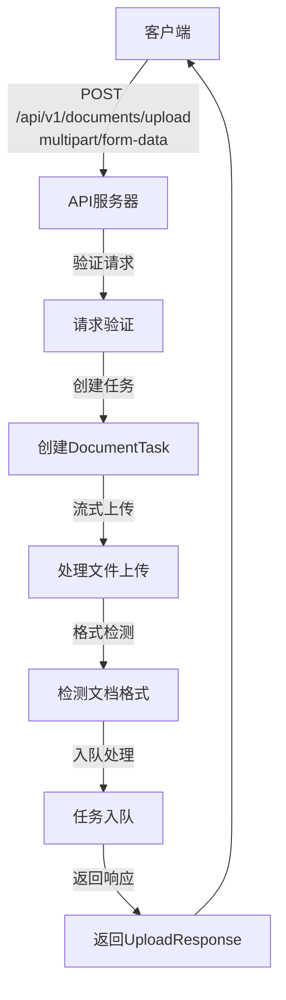
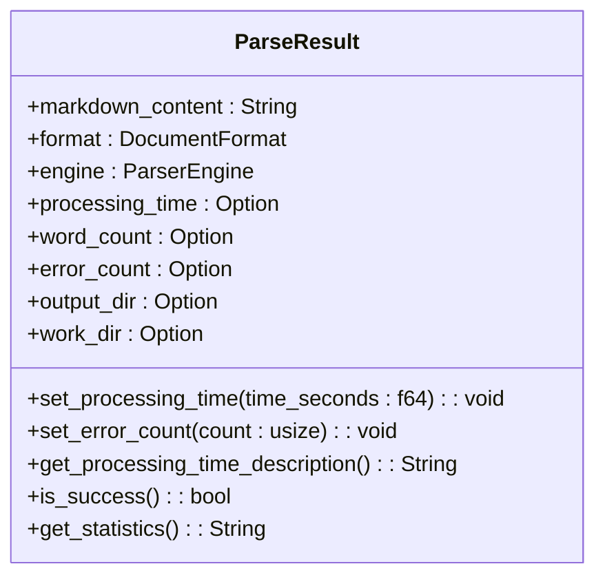
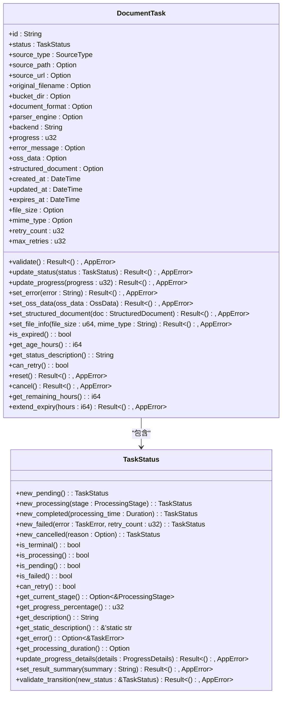
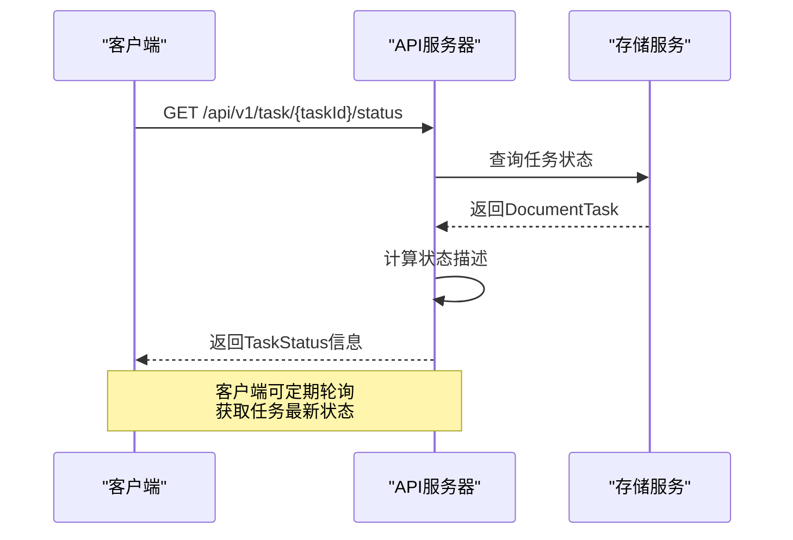
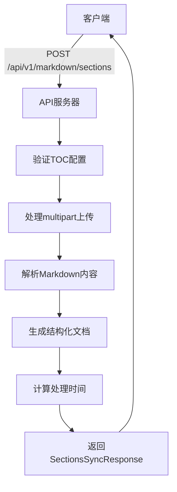
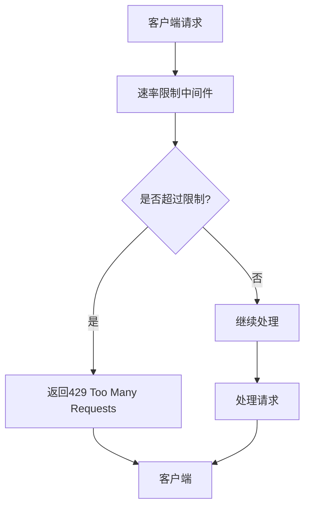
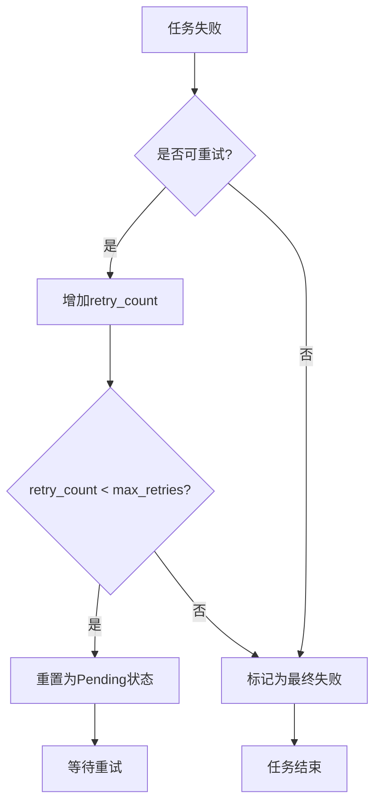

# 文档解析API

<cite>
**本文档引用的文件**  
- [document_handler.rs](file://document-parser/src/handlers/document_handler.rs)
- [markdown_handler.rs](file://document-parser/src/handlers/markdown_handler.rs)
- [document_task.rs](file://document-parser/src/models/document_task.rs)
- [parse_result.rs](file://document-parser/src/models/parse_result.rs)
- [task_status.rs](file://document-parser/src/models/task_status.rs)
- [error_handler.rs](file://document-parser/src/middleware/error_handler.rs)
- [config_validation.rs](file://document-parser/src/production/config_validation.rs)
</cite>

## 目录
1. [简介](#简介)
2. [核心接口](#核心接口)
3. [响应数据结构](#响应数据结构)
4. [轮询解析进度](#轮询解析进度)
5. [Markdown二次处理](#markdown二次处理)
6. [认证与速率限制](#认证与速率限制)
7. [Python调用示例](#python调用示例)
8. [错误处理](#错误处理)
9. [附录](#附录)

## 简介
文档解析API服务提供强大的文档解析能力，支持多种格式的文件上传和解析。该服务能够将PDF、Word、Excel、Markdown等格式的文档转换为结构化的Markdown内容，并支持目录生成、OSS自动上传等高级功能。API设计遵循RESTful原则，提供清晰的端点和响应结构，便于集成到各种应用系统中。

## 核心接口

文档解析服务的核心接口为`POST /api/v1/documents/upload`，用于上传文件并启动解析任务。该接口支持`multipart/form-data`格式的文件上传，可处理PDF、Word、Excel、Markdown等多种文档格式。

请求支持通过查询参数传递解析配置：
- `enable_toc`: 是否启用目录生成（可选，布尔值）
- `max_toc_depth`: 目录最大深度（可选，整数）
- `bucket_dir`: 上传到OSS时的子目录（可选，字符串）

成功调用后，接口返回202状态码，表示文档上传成功，解析任务已在后台启动。

**接口定义**


**接口源码**
- [document_handler.rs](file://document-parser/src/handlers/document_handler.rs#L167-L195)

## 响应数据结构

### ParseResult 结构
`ParseResult`是文档解析的核心响应结构，包含解析后的Markdown内容、文档格式、解析引擎、处理时间等信息。



**字段说明**
- `markdown_content`: 解析后的Markdown内容
- `format`: 源文档格式（PDF、Word等）
- `engine`: 使用的解析引擎（MinerU、MarkItDown等）
- `processing_time`: 处理时间（秒）
- `word_count`: 字数统计
- `error_count`: 解析过程中的错误数量
- `output_dir`: MinerU输出目录的绝对路径
- `work_dir`: MinerU任务工作目录的绝对路径

**源码位置**
- [parse_result.rs](file://document-parser/src/models/parse_result.rs#L4-L17)

### DocumentTask 结构
`DocumentTask`表示一个文档解析任务，包含任务ID、状态、源文件信息、解析配置等。



**源码位置**
- [document_task.rs](file://document-parser/src/models/document_task.rs#L12-L60)
- [task_status.rs](file://document-parser/src/models/task_status.rs#L228-L278)

## 轮询解析进度

### GET /task/{taskId} 接口
通过`GET /api/v1/task/{taskId}/status`接口可以轮询特定任务的解析进度。该接口返回`DocumentTask`状态对象，包含任务的当前状态、进度、错误信息等。



**响应示例**
```json
{
  "id": "task-123",
  "status": "Processing",
  "source_type": "Upload",
  "original_filename": "document.pdf",
  "document_format": "PDF",
  "progress": 75,
  "created_at": "2023-01-01T00:00:00Z",
  "updated_at": "2023-01-01T00:01:30Z",
  "status_description": "处理中 (已运行 90 秒)"
}
```

**源码位置**
- [document_handler.rs](file://document-parser/src/handlers/document_handler.rs#L720-L755)

## Markdown二次处理

### POST /process/markdown 接口
`POST /api/v1/markdown/sections`接口提供对Markdown内容的二次处理能力，支持图片优化、链接重写、目录生成等功能。



该接口支持以下处理选项：
- `enable_toc`: 是否启用目录生成
- `max_toc_depth`: 目录最大深度
- `enable_anchors`: 是否启用锚点功能
- `enable_cache`: 是否启用缓存功能

**源码位置**
- [markdown_handler.rs](file://document-parser/src/handlers/markdown_handler.rs#L168-L201)

## 认证与速率限制

### 认证方式
文档解析API目前未强制要求认证，但在生产环境中建议通过反向代理或API网关添加认证层。根据配置验证规则，系统建议启用身份认证以提高安全性。

### 速率限制策略
系统内置简单的速率限制中间件，防止API被滥用。



当前速率限制配置为：每秒最多100个请求。超过限制的请求将返回429状态码。

**源码位置**
- [error_handler.rs](file://document-parser/src/middleware/error_handler.rs#L123-L143)
- [config_validation.rs](file://document-parser/src/production/config_validation.rs#L551-L593)

## Python调用示例

### 基本文件上传
```python
import requests
import os

def upload_document(file_path, enable_toc=True, max_toc_depth=3):
    """
    上传文档并启动解析任务
    """
    url = "http://localhost:8080/api/v1/documents/upload"
    
    # 准备文件
    with open(file_path, 'rb') as f:
        files = {'file': (os.path.basename(file_path), f)}
        
        # 准备查询参数
        params = {
            'enable_toc': enable_toc,
            'max_toc_depth': max_toc_depth
        }
        
        # 发送请求
        response = requests.post(url, files=files, params=params)
        
        if response.status_code == 202:
            return response.json()
        else:
            raise Exception(f"上传失败: {response.status_code}, {response.text}")

# 使用示例
result = upload_document("./sample.pdf", enable_toc=True, max_toc_depth=3)
print(f"任务ID: {result['task_id']}")
```

### 轮询任务状态
```python
import time
import requests

def poll_task_status(task_id, max_attempts=30, interval=2):
    """
    轮询任务状态直到完成
    """
    url = f"http://localhost:8080/api/v1/task/{task_id}/status"
    
    for attempt in range(max_attempts):
        response = requests.get(url)
        
        if response.status_code == 200:
            task_info = response.json()
            status = task_info['status']
            progress = task_info['progress']
            
            print(f"尝试 {attempt + 1}: 状态={status}, 进度={progress}%")
            
            if status == "Completed":
                print("任务完成!")
                return task_info
            elif status == "Failed":
                print(f"任务失败: {task_info.get('error_message', '未知错误')}")
                return task_info
        else:
            print(f"获取状态失败: {response.status_code}")
            
        time.sleep(interval)
    
    print("轮询超时")
    return None

# 使用示例
task_info = poll_task_status("task-123")
```

### Markdown二次处理
```python
import requests

def process_markdown_content(markdown_text, enable_toc=True, max_toc_depth=3):
    """
    对Markdown内容进行二次处理
    """
    url = "http://localhost:8080/api/v1/markdown/sections"
    
    # 准备multipart数据
    files = {
        'markdown_file': ('content.md', markdown_text, 'text/markdown')
    }
    
    # 准备参数
    data = {
        'enable_toc': enable_toc,
        'max_toc_depth': max_toc_depth
    }
    
    response = requests.post(url, files=files, data=data)
    
    if response.status_code == 200:
        return response.json()
    else:
        raise Exception(f"处理失败: {response.status_code}, {response.text}")

# 使用示例
markdown_content = "# 标题\n这是内容..."
result = process_markdown_content(markdown_content, enable_toc=True, max_toc_depth=3)
print(result['document'])
```

## 错误处理

### 常见错误场景
文档解析API定义了多种HTTP状态码来表示不同的错误情况：

| 状态码 | 错误类型 | 描述 | 处理建议 |
|--------|---------|------|---------|
| 400 | 请求参数错误 | 请求参数格式不正确或缺失必要参数 | 检查请求参数是否符合API文档要求 |
| 413 | 文件过大 | 上传文件超过大小限制 | 压缩文件或分割大文件 |
| 415 | 不支持的文件格式 | 上传了不支持的文件类型 | 确认文件格式是否在支持列表中 |
| 408 | 上传超时 | 文件上传耗时过长 | 检查网络连接或减小文件大小 |
| 500 | 解析失败 | 服务器内部错误导致解析失败 | 重试请求或联系技术支持 |

### 错误响应结构
所有错误响应都遵循统一的格式：

```json
{
  "error": {
    "code": "E010",
    "message": "文件上传超时",
    "timestamp": "2023-01-01T00:00:00Z"
  }
}
```

### 特殊错误处理
对于可恢复的错误（如临时网络问题），系统支持任务重试机制。任务失败后，`retry_count`会增加，当`retry_count < max_retries`时，任务可以重试。



**源码位置**
- [document_task.rs](file://document-parser/src/models/document_task.rs#L280-L310)
- [task_status.rs](file://document-parser/src/models/task_status.rs#L228-L278)

## 附录

### 支持的文档格式
文档解析服务支持以下格式：

| 格式 | 扩展名 | 说明 |
|------|-------|------|
| PDF | .pdf | 使用MinerU引擎解析 |
| Word | .docx, .doc | 使用MarkItDown引擎解析 |
| Excel | .xlsx, .xls | 使用MarkItDown引擎解析 |
| PowerPoint | .pptx, .ppt | 使用MarkItDown引擎解析 |
| Markdown | .md, .markdown | 直接处理或二次处理 |
| 文本文件 | .txt | 作为纯文本处理 |
| HTML | .html, .htm | 作为HTML内容处理 |
| 图片 | .jpg, .jpeg, .png, .gif, .bmp, .tiff | 作为图像文件处理 |
| 音频 | .mp3, .wav, .m4a, .aac | 作为音频文件处理 |

### 配置选项说明
| 配置项 | 默认值 | 说明 |
|-------|-------|------|
| enable_toc | false | 是否生成目录结构 |
| max_toc_depth | 6 | 目录最大嵌套深度 |
| bucket_dir | null | OSS上传时的子目录路径 |
| request_timeout | 30s | HTTP请求超时时间 |
| file_processing_timeout | 300s | 文件处理超时时间 |
| max_file_size | 100MB | 最大允许上传文件大小 |
| rate_limiting | true | 是否启用速率限制 |

### 性能优化建议
1. **批量处理**: 对于大量文档，建议使用异步处理模式，避免阻塞
2. **缓存策略**: 对于重复解析的文档，考虑实现客户端缓存
3. **连接复用**: 使用HTTP连接池减少连接建立开销
4. **压缩传输**: 对于大文件，考虑启用GZIP压缩
5. **并发控制**: 合理设置并发请求数，避免服务器过载