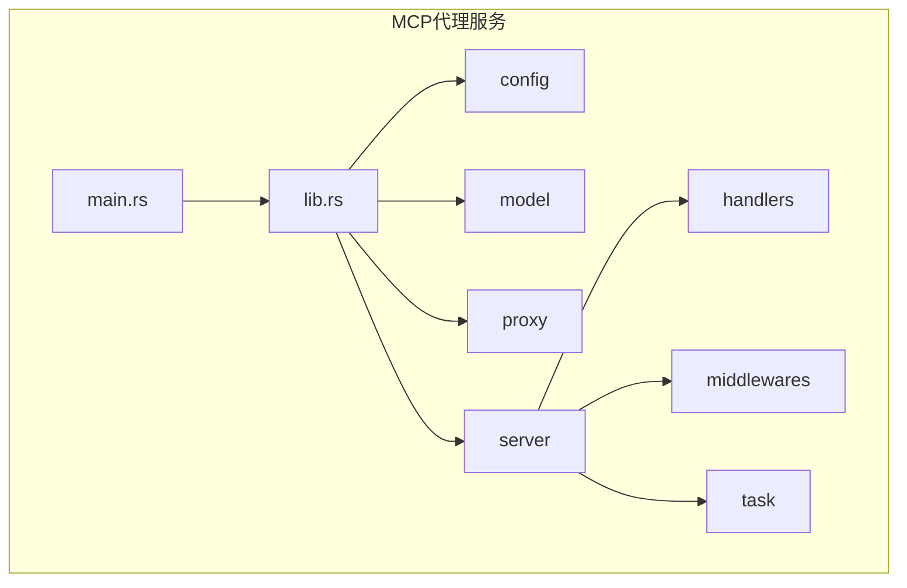
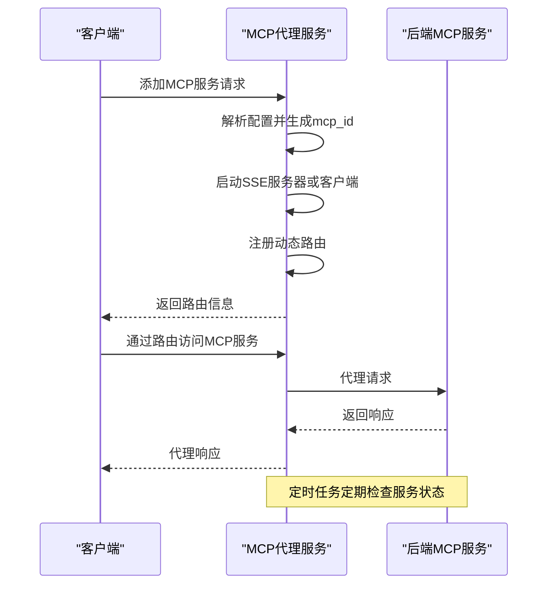
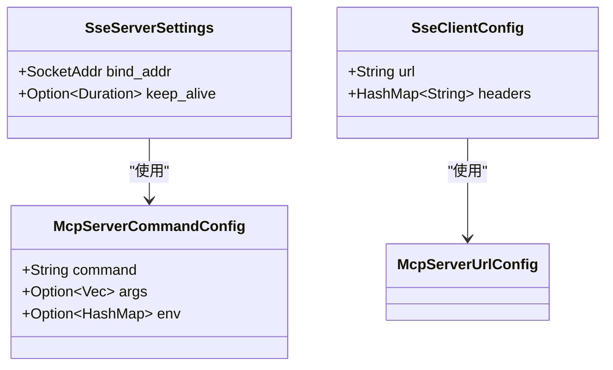
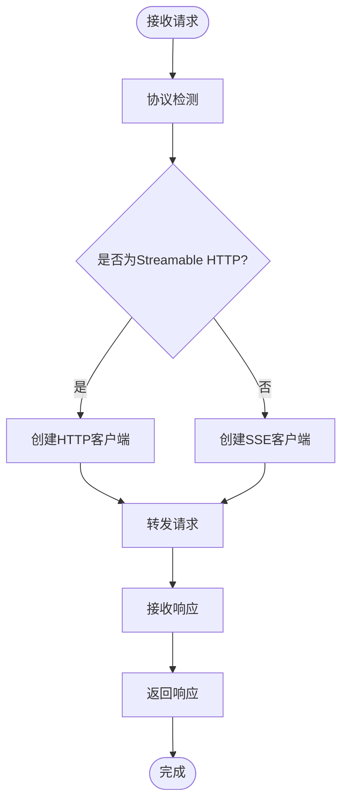
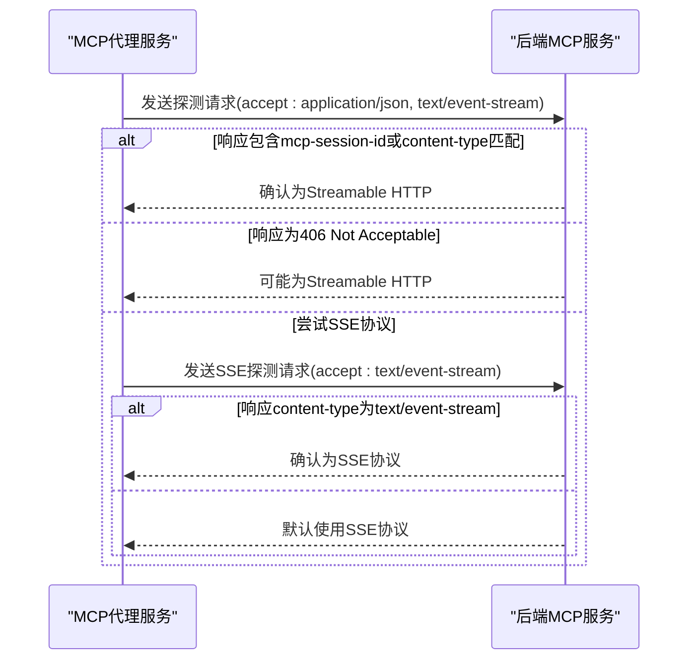
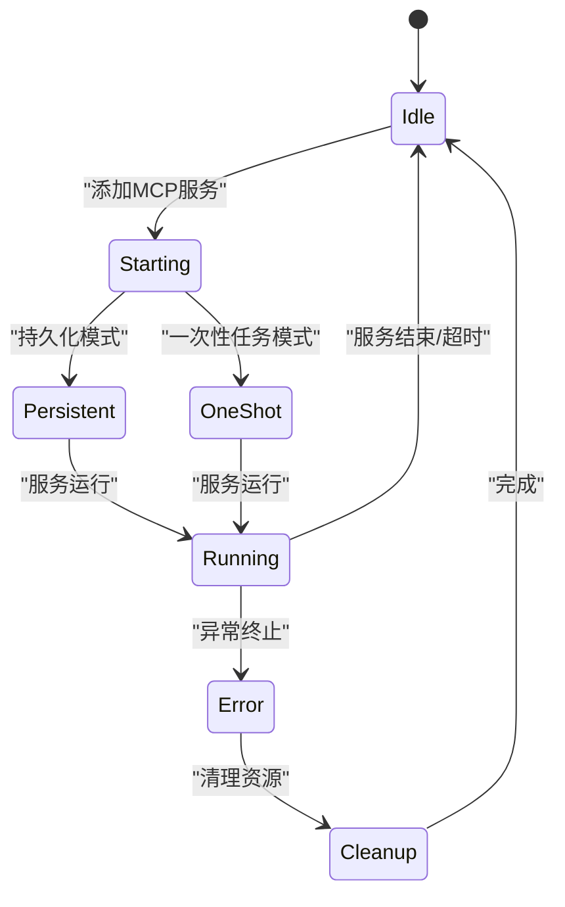
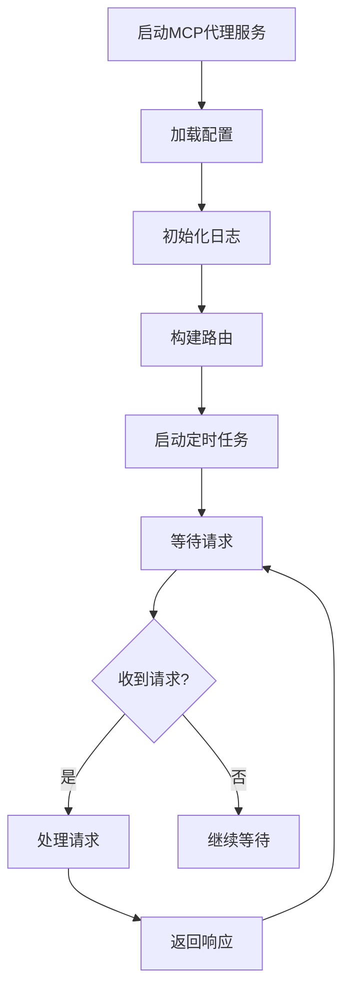
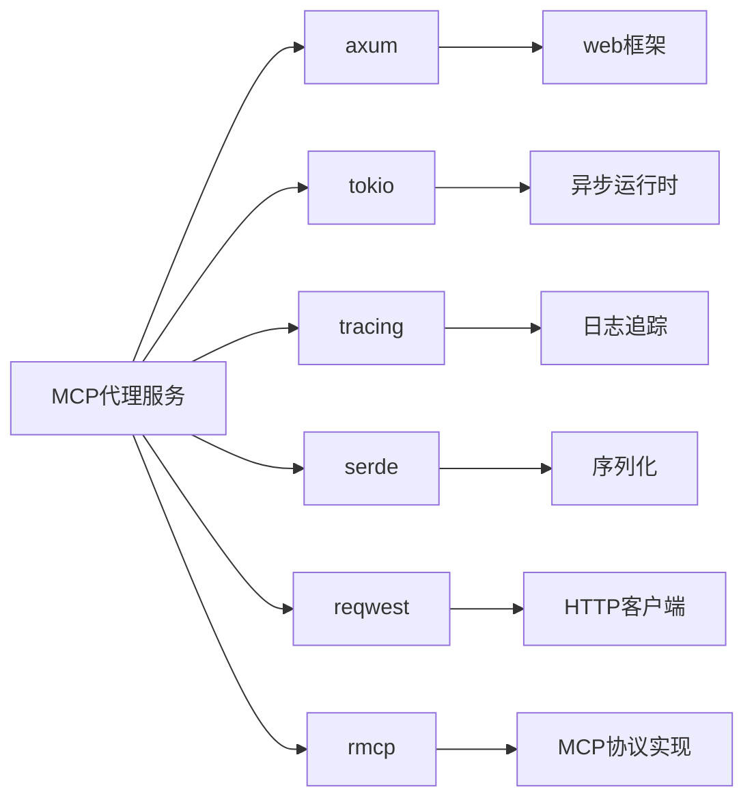

# MCP代理服务

<cite>
**本文档引用的文件**  
- [main.rs](file://mcp-proxy/src/main.rs)
- [lib.rs](file://mcp-proxy/src/lib.rs)
- [config.yml](file://mcp-proxy/config.yml)
- [config.rs](file://mcp-proxy/src/config.rs)
- [app_state_model.rs](file://mcp-proxy/src/model/app_state_model.rs)
- [mcp_config.rs](file://mcp-proxy/src/model/mcp_config.rs)
- [mcp_router_model.rs](file://mcp-proxy/src/model/mcp_router_model.rs)
- [mcp_add_handler.rs](file://mcp-proxy/src/server/handlers/mcp_add_handler.rs)
- [check_mcp_is_status.rs](file://mcp-proxy/src/server/handlers/check_mcp_is_status.rs)
- [sse_client.rs](file://mcp-proxy/src/client/sse_client.rs)
- [sse_server.rs](file://mcp-proxy/src/server/handlers/sse_server.rs)
- [protocol_detector.rs](file://mcp-proxy/src/server/protocol_detector.rs)
- [mcp_dynamic_router_service.rs](file://mcp-proxy/src/server/mcp_dynamic_router_service.rs)
- [schedule_check_mcp_live.rs](file://mcp-proxy/src/server/task/schedule_check_mcp_live.rs)
</cite>

## 目录
1. [简介](#简介)
2. [项目结构](#项目结构)
3. [核心组件](#核心组件)
4. [架构概述](#架构概述)
5. [详细组件分析](#详细组件分析)
6. [依赖分析](#依赖分析)
7. [性能考虑](#性能考虑)
8. [故障排除指南](#故障排除指南)
9. [结论](#结论)

## 简介
MCP代理服务是一个功能强大的中间件服务，旨在为MCP（Model Control Protocol）服务提供协议转换、动态路由和生命周期管理功能。该服务支持SSE（Server-Sent Events）和Streamable HTTP两种主要协议，能够自动检测后端服务的协议类型，并提供透明的代理功能。通过灵活的配置和动态加载机制，MCP代理服务能够适应各种应用场景，包括持久化服务和一次性任务模式。

## 项目结构
MCP代理服务的项目结构遵循Rust项目的标准组织方式，主要包含以下几个关键目录：

- `src/`: 源代码目录，包含服务的核心实现
  - `client/`: 客户端相关功能，如SSE客户端
  - `model/`: 数据模型和配置结构
  - `proxy/`: 代理处理逻辑
  - `server/`: 服务器核心功能，包括处理器、中间件和任务管理
- `fixtures/`: 测试用例和示例文件
- `docs/`: 文档文件，包括协议自动检测说明

服务的核心功能分布在不同的模块中，通过清晰的职责分离实现了高内聚低耦合的设计。

**图源**  
- [main.rs](file://mcp-proxy/src/main.rs#L1-L214)
- [lib.rs](file://mcp-proxy/src/lib.rs#L1-L22)

**本节来源**  
- [main.rs](file://mcp-proxy/src/main.rs#L1-L214)
- [lib.rs](file://mcp-proxy/src/lib.rs#L1-L22)

## 核心组件
MCP代理服务的核心组件包括配置管理、状态管理、协议检测、动态路由和任务调度等。这些组件协同工作，提供了完整的MCP服务代理功能。

配置管理组件负责加载和解析服务配置，包括服务器端口、日志级别和保留天数等。状态管理组件维护了服务的全局状态，包括配置信息和地址信息。协议检测组件能够自动识别后端MCP服务的协议类型，支持SSE和Streamable HTTP两种协议。动态路由组件实现了灵活的路由机制，能够根据请求路径动态地启动和管理MCP服务实例。任务调度组件负责定期检查和清理闲置或异常的服务实例。

**本节来源**  
- [main.rs](file://mcp-proxy/src/main.rs#L1-L214)
- [config.rs](file://mcp-proxy/src/config.rs#L1-L75)
- [app_state_model.rs](file://mcp-proxy/src/model/app_state_model.rs#L1-L34)

## 架构概述
MCP代理服务采用分层架构设计，各层之间通过清晰的接口进行通信。服务启动时，首先初始化配置和日志系统，然后构建路由并启动定时任务。

**图源**  
- [main.rs](file://mcp-proxy/src/main.rs#L1-L214)
- [mcp_add_handler.rs](file://mcp-proxy/src/server/handlers/mcp_add_handler.rs#L1-L91)
- [mcp_dynamic_router_service.rs](file://mcp-proxy/src/server/mcp_dynamic_router_service.rs#L1-L273)

## 详细组件分析

### 协议支持与实现机制
MCP代理服务支持SSE和Streamable HTTP两种协议，通过协议检测机制自动识别后端服务的协议类型。

#### SSE协议实现
SSE协议的实现基于`rmcp`库的SSE服务器和客户端功能。当后端服务通过命令行启动时，代理服务创建一个SSE服务器，将stdio接口转换为SSE接口；当后端服务通过URL提供SSE接口时，代理服务创建一个SSE客户端，将SSE接口转换为stdio接口。

**图源**  
- [sse_server.rs](file://mcp-proxy/src/server/handlers/sse_server.rs#L1-L95)
- [sse_client.rs](file://mcp-proxy/src/client/sse_client.rs#L1-L80)
- [mcp_router_model.rs](file://mcp-proxy/src/model/mcp_router_model.rs#L1-L800)

#### Streamable HTTP协议实现
Streamable HTTP协议的实现通过HTTP客户端直接与后端服务通信。代理服务在检测到Streamable HTTP协议时，会创建相应的HTTP客户端配置，并处理请求和响应的转发。

**图源**  
- [protocol_detector.rs](file://mcp-proxy/src/server/protocol_detector.rs#L1-L184)
- [mcp_router_model.rs](file://mcp-proxy/src/model/mcp_router_model.rs#L1-L800)

#### 协议转换与自动检测
协议转换和自动检测是MCP代理服务的核心功能之一。服务通过`detect_mcp_protocol`函数实现自动检测，该函数首先尝试Streamable HTTP协议，然后尝试SSE协议。

**图源**  
- [protocol_detector.rs](file://mcp-proxy/src/server/protocol_detector.rs#L1-L184)
- [mcp_router_model.rs](file://mcp-proxy/src/model/mcp_router_model.rs#L1-L800)

**本节来源**  
- [protocol_detector.rs](file://mcp-proxy/src/server/protocol_detector.rs#L1-L184)
- [mcp_router_model.rs](file://mcp-proxy/src/model/mcp_router_model.rs#L1-L800)

### 动态加载机制
MCP代理服务支持两种服务模式：持久化服务和一次性任务。

#### 持久化服务模式
持久化服务模式适用于需要长期运行的MCP服务。服务启动后会一直保持运行状态，直到被显式取消或异常终止。

#### 一次性任务模式
一次性任务模式适用于短期任务。服务在完成任务后会自动清理资源，或者在超过3分钟未被访问时由定时任务自动清理。

**图源**  
- [mcp_config.rs](file://mcp-proxy/src/model/mcp_config.rs#L1-L102)
- [schedule_check_mcp_live.rs](file://mcp-proxy/src/server/task/schedule_check_mcp_live.rs#L1-L96)

**本节来源**  
- [mcp_config.rs](file://mcp-proxy/src/model/mcp_config.rs#L1-L102)
- [schedule_check_mcp_live.rs](file://mcp-proxy/src/server/task/schedule_check_mcp_live.rs#L1-L96)

### 操作流程
从服务启动到MCP服务管理的完整操作流程如下：

1. **服务启动**：加载配置，初始化日志，构建路由，启动定时任务
2. **添加MCP服务**：通过API添加新的MCP服务，生成mcp_id和路由
3. **状态检查**：通过mcp_id检查服务状态
4. **消息发送**：通过生成的路由与MCP服务通信
5. **服务删除**：清理服务资源

**图源**  
- [main.rs](file://mcp-proxy/src/main.rs#L1-L214)
- [mcp_add_handler.rs](file://mcp-proxy/src/server/handlers/mcp_add_handler.rs#L1-L91)
- [check_mcp_is_status.rs](file://mcp-proxy/src/server/handlers/check_mcp_is_status.rs#L1-L47)

**本节来源**  
- [main.rs](file://mcp-proxy/src/main.rs#L1-L214)
- [mcp_add_handler.rs](file://mcp-proxy/src/server/handlers/mcp_add_handler.rs#L1-L91)
- [check_mcp_is_status.rs](file://mcp-proxy/src/server/handlers/check_mcp_is_status.rs#L1-L47)

## 依赖分析
MCP代理服务依赖于多个Rust库来实现其功能，主要包括：

**图源**  
- [Cargo.toml](file://mcp-proxy/Cargo.toml#L1-L59)
- [main.rs](file://mcp-proxy/src/main.rs#L1-L214)

**本节来源**  
- [Cargo.toml](file://mcp-proxy/Cargo.toml#L1-L59)
- [main.rs](file://mcp-proxy/src/main.rs#L1-L214)

## 性能考虑
MCP代理服务在设计时考虑了多个性能方面：

1. **异步处理**：使用Tokio异步运行时，确保高并发性能
2. **资源管理**：通过定时任务定期清理闲置服务，避免资源泄漏
3. **日志优化**：配置日志保留天数，避免日志文件无限增长
4. **连接复用**：在可能的情况下复用HTTP连接，减少连接建立开销

服务还实现了优雅关闭机制，在接收到终止信号时会先清理资源再退出，确保服务的稳定性和可靠性。

## 故障排除指南
当遇到问题时，可以参考以下常见问题的解决方法：

1. **服务无法启动**：检查配置文件是否正确，端口是否被占用
2. **MCP服务添加失败**：检查MCP配置是否正确，网络连接是否正常
3. **协议检测失败**：确保后端服务正确实现了SSE或Streamable HTTP协议
4. **资源泄漏**：检查定时任务是否正常运行，服务是否被正确清理

日志文件位于配置指定的路径，默认保留5天，可以通过调整配置来改变保留天数。

**本节来源**  
- [main.rs](file://mcp-proxy/src/main.rs#L1-L214)
- [config.rs](file://mcp-proxy/src/config.rs#L1-L75)
- [config.yml](file://mcp-proxy/config.yml#L1-L11)

## 结论
MCP代理服务提供了一个功能完整、性能优良的MCP服务代理解决方案。通过支持多种协议、实现自动检测、提供动态路由和灵活的生命周期管理，该服务能够满足各种应用场景的需求。其清晰的架构设计和模块化实现使得服务易于维护和扩展，为MCP生态系统的建设提供了坚实的基础。