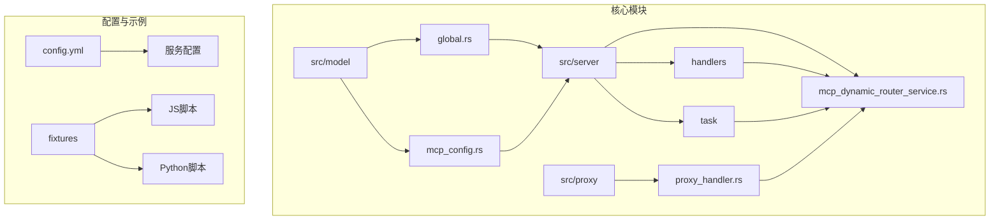
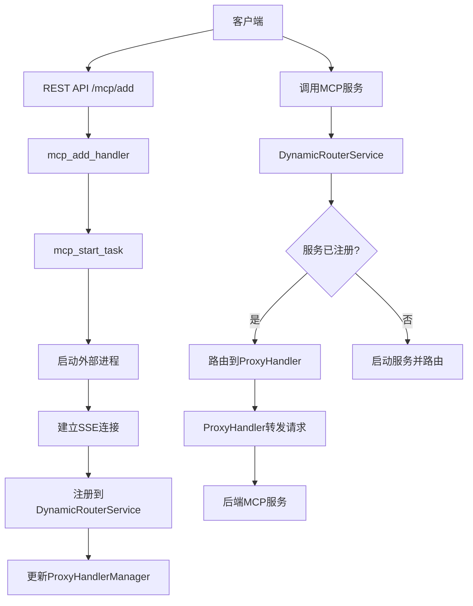
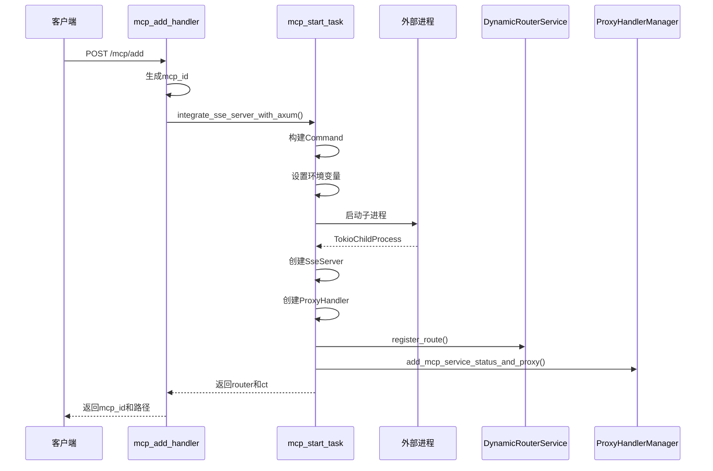
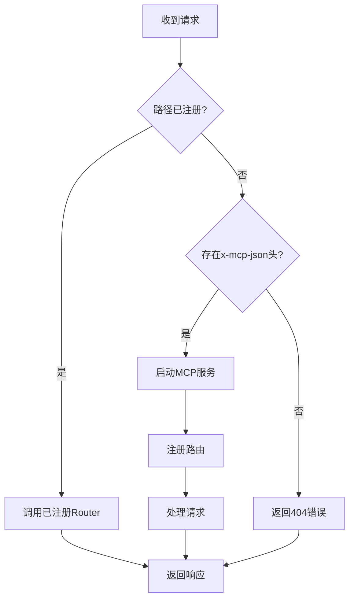
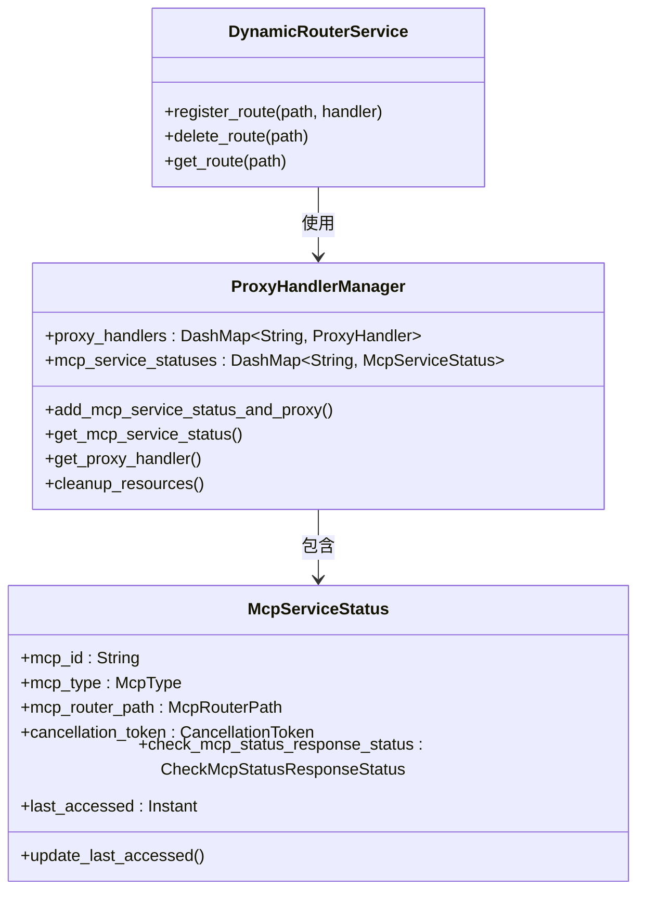
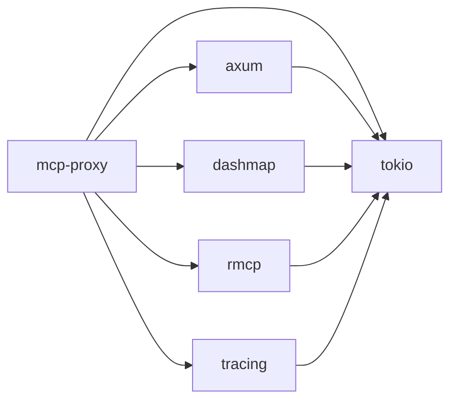

# MCP代理服务

<cite>
**本文档中引用的文件**  
- [main.rs](file://mcp-proxy/src/main.rs)
- [global.rs](file://mcp-proxy/src/model/global.rs)
- [mcp_add_handler.rs](file://mcp-proxy/src/server/handlers/mcp_add_handler.rs)
- [mcp_start_task.rs](file://mcp-proxy/src/server/task/mcp_start_task.rs)
- [mcp_config.rs](file://mcp-proxy/src/model/mcp_config.rs)
- [app_state_model.rs](file://mcp-proxy/src/model/app_state_model.rs)
- [proxy_handler.rs](file://mcp-proxy/src/proxy/proxy_handler.rs)
- [sse_server.rs](file://mcp-proxy/src/server/handlers/sse_server.rs)
- [mcp_dynamic_router_service.rs](file://mcp-proxy/src/server/mcp_dynamic_router_service.rs)
- [config.yml](file://mcp-proxy/config.yml)
- [cow_say_hello.js](file://mcp-proxy/fixtures/cow_say_hello.js)
- [rfunction_python.py](file://mcp-proxy/fixtures/rfunction_python.py)
</cite>

## 目录
1. [简介](#简介)
2. [项目结构](#项目结构)
3. [核心组件](#核心组件)
4. [架构概览](#架构概览)
5. [详细组件分析](#详细组件分析)
6. [依赖分析](#依赖分析)
7. [性能考虑](#性能考虑)
8. [故障排除指南](#故障排除指南)
9. [结论](#结论)

## 简介
MCP代理服务是一个基于Axum构建的远程服务代理系统，旨在通过RESTful API与SSE（Server-Sent Events）实时通信机制集成，实现对MCP（Model Control Protocol）服务的动态管理与调用。该服务支持通过POST /mcp/add接口注册新的MCP服务，异步启动外部进程并建立SSE连接，从而实现对MCP服务的透明代理。系统通过DynamicRouterService实现动态路由注入，通过ProxyHandlerManager管理多个并发代理实例，并利用全局状态（如McpServiceStatus映射）进行线程安全的状态管理。配置文件中的timeout、command、env_vars等字段定义了MCP服务的启动参数与行为。

## 项目结构
MCP代理服务的项目结构清晰，主要分为以下几个核心模块：
- `src/client`：SSE客户端实现
- `src/model`：核心数据模型与全局状态管理
- `src/proxy`：代理处理器实现
- `src/server`：服务器核心逻辑，包括处理器、中间件与任务调度
- `fixtures`：包含用于测试的JS/Python脚本示例
- `config.yml`：主配置文件

**Diagram sources**
- [global.rs](file://mcp-proxy/src/model/global.rs#L1-L207)
- [mcp_config.rs](file://mcp-proxy/src/model/mcp_config.rs#L1-L73)
- [mcp_dynamic_router_service.rs](file://mcp-proxy/src/server/mcp_dynamic_router_service.rs#L1-L119)

**Section sources**
- [mcp-proxy/src](file://mcp-proxy/src)
- [mcp-proxy/config.yml](file://mcp-proxy/config.yml)
- [mcp-proxy/fixtures](file://mcp-proxy/fixtures)

## 核心组件
MCP代理服务的核心组件包括：
- **AppState**：封装应用配置与状态，通过`app_state_model.rs`实现
- **DynamicRouterService**：动态路由服务，管理运行时路由注册与注销
- **ProxyHandlerManager**：全局代理管理器，管理所有MCP服务实例与状态
- **ProxyHandler**：透明代理处理器，转发请求至后端MCP服务
- **McpServiceStatus**：MCP服务状态记录，包含取消令牌、最后访问时间等

**Section sources**
- [app_state_model.rs](file://mcp-proxy/src/model/app_state_model.rs#L1-L34)
- [global.rs](file://mcp-proxy/src/model/global.rs#L1-L207)
- [proxy_handler.rs](file://mcp-proxy/src/proxy/proxy_handler.rs#L1-L450)

## 架构概览
MCP代理服务采用分层架构，基于Axum框架构建RESTful API，通过SSE实现与MCP服务的实时通信。系统启动时初始化全局状态与路由，通过`mcp_add_handler`处理服务注册请求，异步启动外部进程并建立SSE连接。`DynamicRouterService`作为动态路由注入点，拦截请求并根据路径动态启动或路由至已注册的MCP服务。`ProxyHandlerManager`作为全局单例，管理所有代理实例与服务状态，确保线程安全。

**Diagram sources**
- [mcp_add_handler.rs](file://mcp-proxy/src/server/handlers/mcp_add_handler.rs#L1-L90)
- [mcp_start_task.rs](file://mcp-proxy/src/server/task/mcp_start_task.rs#L1-L209)
- [mcp_dynamic_router_service.rs](file://mcp-proxy/src/server/mcp_dynamic_router_service.rs#L1-L119)

## 详细组件分析

### MCP服务注册与启动流程
当客户端发送POST /mcp/add请求时，`mcp_add_handler`解析请求参数，生成唯一mcp_id，调用`integrate_sse_server_with_axum`函数异步启动MCP服务。

**Diagram sources**
- [mcp_add_handler.rs](file://mcp-proxy/src/server/handlers/mcp_add_handler.rs#L1-L90)
- [mcp_start_task.rs](file://mcp-proxy/src/server/task/mcp_start_task.rs#L1-L209)

**Section sources**
- [mcp_add_handler.rs](file://mcp-proxy/src/server/handlers/mcp_add_handler.rs#L1-L90)
- [mcp_start_task.rs](file://mcp-proxy/src/server/task/mcp_start_task.rs#L1-L209)

### 动态路由与代理管理
`DynamicRouterService`实现`tower::Service` trait，作为Axum路由的中间层，拦截所有请求。若请求路径未注册，则尝试从请求头中获取MCP配置并动态启动服务。

**Diagram sources**
- [mcp_dynamic_router_service.rs](file://mcp-proxy/src/server/mcp_dynamic_router_service.rs#L1-L119)

**Section sources**
- [mcp_dynamic_router_service.rs](file://mcp-proxy/src/server/mcp_dynamic_router_service.rs#L1-L119)

### 全局状态与线程安全
`global.rs`中定义了`GLOBAL_PROXY_MANAGER`和`GLOBAL_ROUTES`两个全局静态变量，使用`once_cell::sync::Lazy`和`dashmap::DashMap`确保线程安全。`ProxyHandlerManager`内部使用`DashMap`存储`ProxyHandler`和`McpServiceStatus`，支持高并发读写。

**Diagram sources**
- [global.rs](file://mcp-proxy/src/model/global.rs#L1-L207)

**Section sources**
- [global.rs](file://mcp-proxy/src/model/global.rs#L1-L207)

## 依赖分析
MCP代理服务依赖以下核心库：
- `axum`：Web框架，处理HTTP路由与请求
- `tokio`：异步运行时，管理并发与I/O
- `dashmap`：高性能并发哈希映射，用于全局状态管理
- `rmcp`：MCP协议实现，处理与后端服务的通信
- `tracing`：日志与追踪框架

**Diagram sources**
- [Cargo.toml](file://mcp-proxy/Cargo.toml)
- [main.rs](file://mcp-proxy/src/main.rs#L1-L128)

**Section sources**
- [mcp-proxy/Cargo.toml](file://mcp-proxy/Cargo.toml)

## 性能考虑
- 使用`DashMap`替代`Mutex<HashMap>`，减少锁竞争，提高并发性能
- 通过`CancellationToken`实现优雅关闭，避免资源泄漏
- 日志采用`tracing_subscriber`异步写入文件，减少I/O阻塞
- 预热`uv/deno`环境依赖，减少首次调用延迟

## 故障排除指南
- **服务启动失败**：检查`command`路径是否正确，`env_vars`是否设置
- **SSE连接中断**：检查后端MCP服务是否正常输出，`timeout`设置是否过短
- **路由未注册**：确认`mcp_add`请求成功返回，检查`DynamicRouterService`日志
- **代理转发失败**：检查`ProxyHandler`的`is_mcp_server_ready`状态，确认后端服务响应正常

**Section sources**
- [mcp_error.rs](file://mcp-proxy/src/mcp_error.rs)
- [proxy_handler.rs](file://mcp-proxy/src/proxy/proxy_handler.rs#L1-L450)
- [mcp_start_task.rs](file://mcp-proxy/src/server/task/mcp_start_task.rs#L1-L209)

## 结论
MCP代理服务通过Axum与SSE的集成，实现了对MCP服务的动态代理与管理。其核心设计包括动态路由注入、全局代理管理、线程安全状态维护等，支持灵活的配置与高并发访问。通过`fixtures`中的JS/Python脚本示例，可验证服务的完整生命周期，从注册、启动到调用与清理，形成闭环。未来可进一步优化错误处理、增加监控指标与健康检查机制。