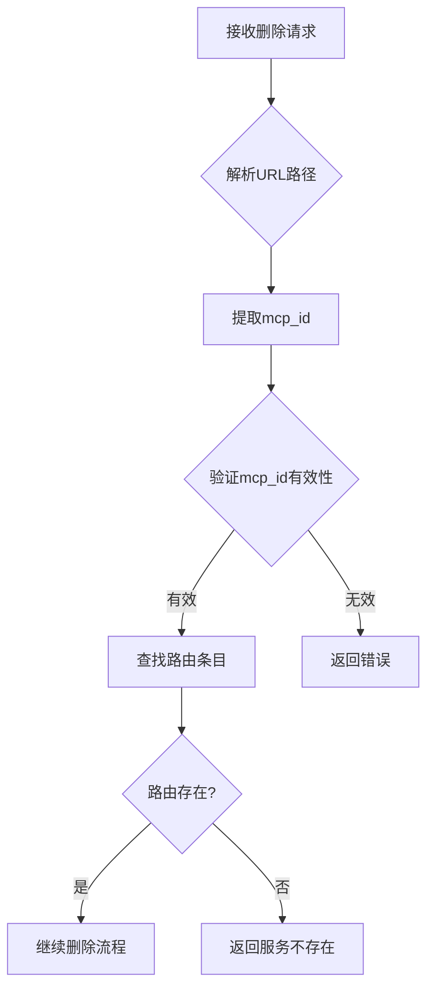
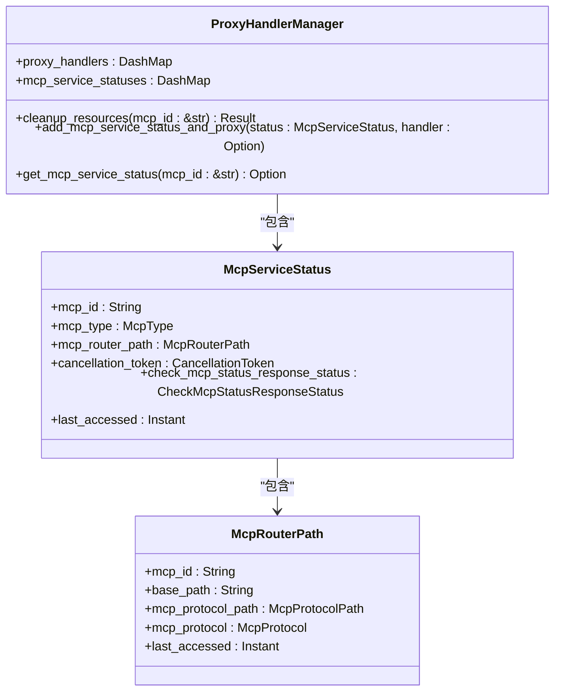
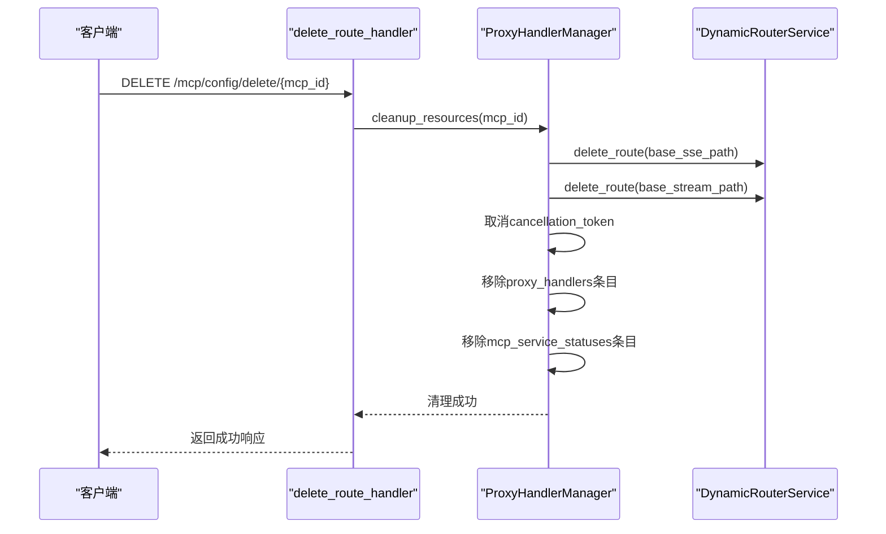

# MCP服务删除

<cite>
**本文档引用的文件**
- [delete_route_handler.rs](file://mcp-proxy/src/server/handlers/delete_route_handler.rs)
- [global.rs](file://mcp-proxy/src/model/global.rs)
- [mcp_router_model.rs](file://mcp-proxy/src/model/mcp_router_model.rs)
- [mcp_dynamic_router_service.rs](file://mcp-proxy/src/server/mcp_dynamic_router_service.rs)
</cite>

## 目录
1. [MCP服务删除流程概述](#mcp服务删除流程概述)
2. [身份验证机制](#身份验证机制)
3. [路由查找与匹配](#路由查找与匹配)
4. [连接清理与资源回收](#连接清理与资源回收)
5. [配置持久化与线程安全](#配置持久化与线程安全)
6. [成功与失败场景分析](#成功与失败场景分析)
7. [生产环境检查清单](#生产环境检查清单)

## MCP服务删除流程概述

MCP服务删除流程通过`delete_route_handler`处理服务移除请求，该流程包含身份验证、路由查找、连接清理和配置持久化等关键步骤。当接收到删除请求时，系统首先验证请求的合法性，然后精确匹配服务名称，安全地从动态路由器中注销路由条目，防止误删。在删除前执行资源回收操作，包括关闭SSE连接池、清除状态缓存和释放端口占用。整个流程通过`mcp_dynamic_router_service`确保路由表更新的线程安全性。

**Section sources**
- [delete_route_handler.rs](file://mcp-proxy/src/server/handlers/delete_route_handler.rs#L8-L24)

## 身份验证机制

系统通过中间件实现身份验证，确保只有授权用户才能执行删除操作。虽然具体的认证实现代码被注释，但系统设计了完整的认证框架，支持Bearer Token和查询参数两种认证方式。认证过程包括从请求头或查询参数中提取令牌，验证令牌的有效性，并将用户信息注入请求上下文中。这种双重认证机制提高了系统的灵活性和安全性。

**Section sources**
- [auth.rs](file://mcp-proxy/src/server/middlewares/auth.rs#L1-L178)

## 路由查找与匹配

路由查找通过`McpRouterPath::from_url`方法实现，该方法解析请求URL并提取MCP服务标识。系统支持两种协议前缀：`/mcp/sse`和`/mcp/stream`，能够准确识别SSE和Streamable HTTP协议。路由匹配采用精确匹配策略，通过服务名称（mcp_id）进行唯一标识，确保不会误删其他服务。`DynamicRouterService::get_route`方法负责在全局路由表中查找匹配的路由条目。



**Diagram sources**
- [mcp_router_model.rs](file://mcp-proxy/src/model/mcp_router_model.rs#L477-L559)
- [mcp_dynamic_router_service.rs](file://mcp-proxy/src/server/mcp_dynamic_router_service.rs#L68-L108)

## 连接清理与资源回收

删除操作前执行全面的资源回收，确保系统资源得到正确释放。资源回收包括关闭SSE连接池、清除状态缓存和释放端口占用。`cleanup_resources`方法是资源清理的核心，它通过`ProxyHandlerManager`执行以下操作：移除相关路由、取消关联的取消令牌、从代理处理器和MCP服务状态映射中移除条目。对于一次性任务，系统还会检查子进程是否已完成或是否超过3分钟未访问，自动触发资源清理。



**Diagram sources**
- [global.rs](file://mcp-proxy/src/model/global.rs#L194-L224)
- [mcp_router_model.rs](file://mcp-proxy/src/model/mcp_router_model.rs#L342-L354)

## 配置持久化与线程安全

路由表更新通过`mcp_dynamic_router_service`实现线程安全机制。系统使用`DashMap`作为全局路由表，提供高效的并发读写操作。`DynamicRouterService`的`register_route`和`delete_route`方法通过原子操作确保路由注册和删除的线程安全性。`GLOBAL_ROUTES`是静态的`Lazy<Arc<DashMap<String, Router>>>`，保证了全局单例模式和线程安全的初始化。`ProxyHandlerManager`同样使用`DashMap`存储代理处理器和MCP服务状态，确保多线程环境下的数据一致性。



**Diagram sources**
- [global.rs](file://mcp-proxy/src/model/global.rs#L27-L42)
- [delete_route_handler.rs](file://mcp-proxy/src/server/handlers/delete_route_handler.rs#L12-L15)

## 成功与失败场景分析

### 成功场景
当服务存在且删除成功时，系统返回成功响应，包含已删除的MCP ID和成功消息。例如，删除ID为"test-service"的服务，返回：
```json
{
    "mcp_id": "test-service",
    "message": "已删除路由: test-service"
}
```

### 失败场景
1. **服务不存在**：当尝试删除不存在的服务时，系统在路由查找阶段返回"未找到已注册的路由"。
2. **正在运行的任务依赖**：对于一次性任务，如果子进程仍在运行，系统会记录"子进程未完成"，并延迟清理。
3. **权限不足**：未通过身份验证的请求会被拒绝，返回401或403状态码。
4. **并发删除**：多个删除请求同时发生时，`DashMap`的线程安全机制确保操作的原子性，避免数据竞争。

**Section sources**
- [mcp_dynamic_router_service.rs](file://mcp-proxy/src/server/mcp_dynamic_router_service.rs#L91-L107)
- [global.rs](file://mcp-proxy/src/model/global.rs#L194-L224)

## 生产环境检查清单

在生产环境中执行删除操作前，建议遵循以下检查清单：

1. **服务状态验证**：确认服务当前状态，避免删除正在处理关键任务的服务。
2. **依赖关系检查**：检查是否有其他服务或系统依赖于该MCP服务。
3. **备份配置**：在删除前备份相关配置，以便需要时可以快速恢复。
4. **通知相关方**：提前通知可能受影响的团队或用户。
5. **选择合适时间**：在低峰期执行删除操作，减少对业务的影响。
6. **监控系统指标**：删除后密切监控系统性能和错误日志，确保没有意外影响。
7. **验证删除结果**：确认路由已从全局路由表中移除，相关资源已释放。

**Section sources**
- [schedule_check_mcp_live.rs](file://mcp-proxy/src/server/task/schedule_check_mcp_live.rs#L68-L95)
- [global.rs](file://mcp-proxy/src/model/global.rs#L227-L239)