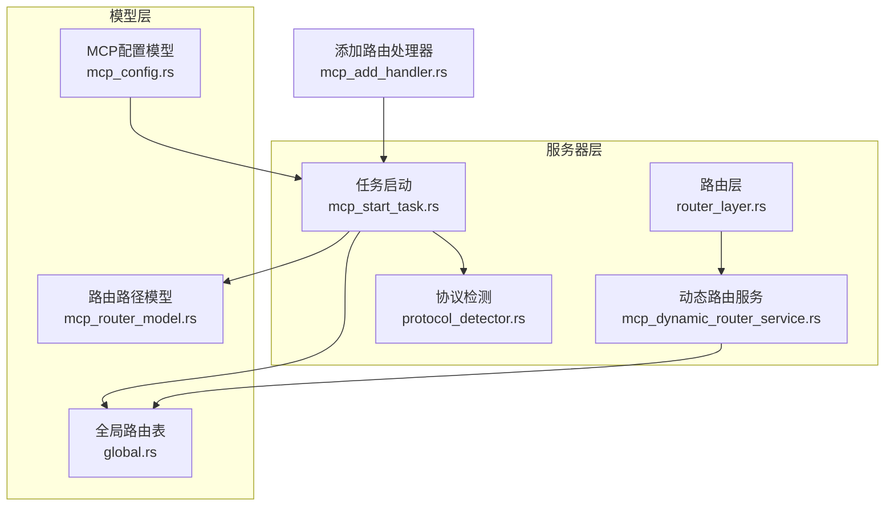
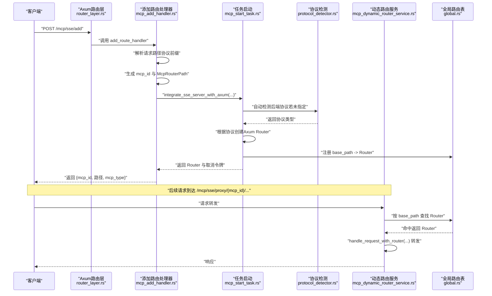
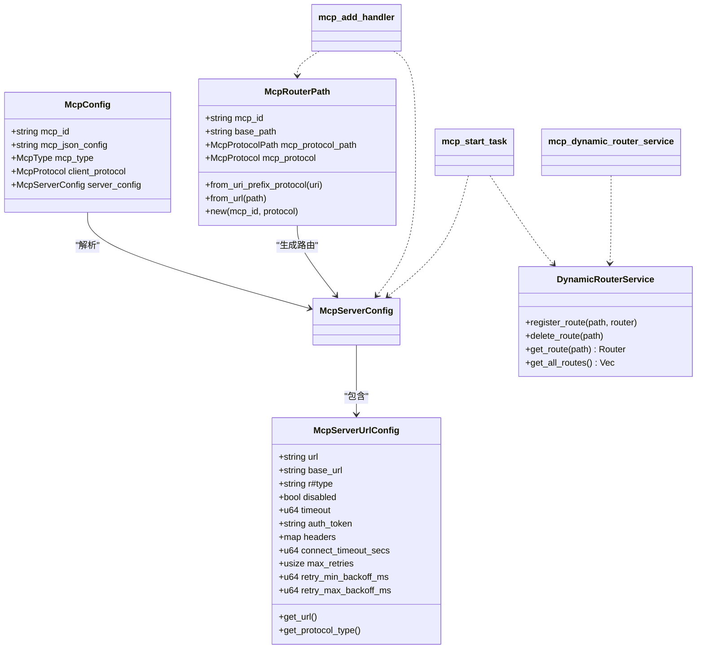
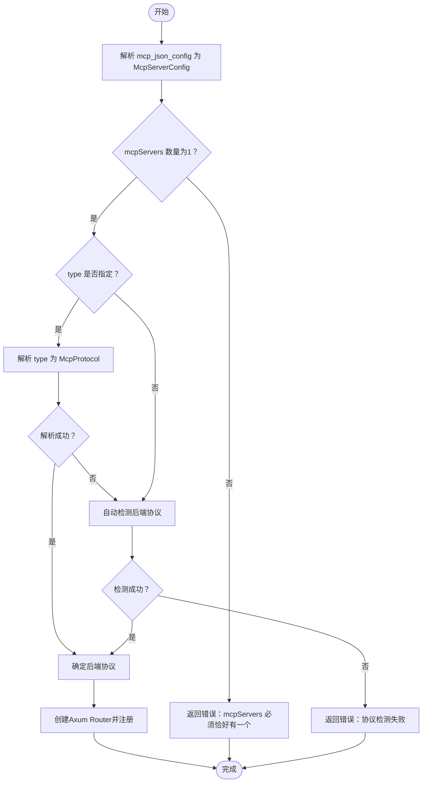

# MCP服务添加

<cite>
**本文引用的文件**
- [mcp_add_handler.rs](file://mcp-proxy/src/server/handlers/mcp_add_handler.rs)
- [mcp_config.rs](file://mcp-proxy/src/model/mcp_config.rs)
- [mcp_router_model.rs](file://mcp-proxy/src/model/mcp_router_model.rs)
- [mcp_dynamic_router_service.rs](file://mcp-proxy/src/server/mcp_dynamic_router_service.rs)
- [mcp_start_task.rs](file://mcp-proxy/src/server/task/mcp_start_task.rs)
- [router_layer.rs](file://mcp-proxy/src/server/router_layer.rs)
- [protocol_detector.rs](file://mcp-proxy/src/server/protocol_detector.rs)
- [global.rs](file://mcp-proxy/src/model/global.rs)
- [mcp_error.rs](file://mcp-proxy/src/mcp_error.rs)
</cite>

## 目录
1. [简介](#简介)
2. [项目结构](#项目结构)
3. [核心组件](#核心组件)
4. [架构总览](#架构总览)
5. [详细组件分析](#详细组件分析)
6. [依赖关系分析](#依赖关系分析)
7. [性能考量](#性能考量)
8. [故障排查指南](#故障排查指南)
9. [结论](#结论)
10. [附录](#附录)

## 简介
本文围绕“MCP服务添加”能力，系统阐述以下内容：
- 如何通过mcp_add_handler接收并解析MCP服务的JSON配置，完成动态路由注册；
- mcp_config结构体各字段语义与默认值；
- 配置验证流程：必填字段检查、URL格式校验、协议兼容性检测；
- 路由表更新机制与Axum路由器的实时同步；
- 完整请求示例与常见错误响应；
- 调试技巧：日志追踪与配置预验证工具。

## 项目结构
与“MCP服务添加”直接相关的模块分布如下：
- 服务器层：路由层、动态路由服务、任务启动、协议检测
- 模型层：MCP配置模型、路由路径模型、全局路由表
- 错误处理：统一应用错误类型

图表来源
- [router_layer.rs](file://mcp-proxy/src/server/router_layer.rs#L24-L82)
- [mcp_dynamic_router_service.rs](file://mcp-proxy/src/server/mcp_dynamic_router_service.rs#L21-L151)
- [mcp_start_task.rs](file://mcp-proxy/src/server/task/mcp_start_task.rs#L52-L403)
- [protocol_detector.rs](file://mcp-proxy/src/server/protocol_detector.rs#L1-L184)
- [mcp_config.rs](file://mcp-proxy/src/model/mcp_config.rs#L11-L101)
- [mcp_router_model.rs](file://mcp-proxy/src/model/mcp_router_model.rs#L341-L624)
- [global.rs](file://mcp-proxy/src/model/global.rs#L15-L73)

章节来源
- [router_layer.rs](file://mcp-proxy/src/server/router_layer.rs#L24-L82)
- [mcp_dynamic_router_service.rs](file://mcp-proxy/src/server/mcp_dynamic_router_service.rs#L21-L151)
- [mcp_start_task.rs](file://mcp-proxy/src/server/task/mcp_start_task.rs#L52-L403)
- [protocol_detector.rs](file://mcp-proxy/src/server/protocol_detector.rs#L1-L184)
- [mcp_config.rs](file://mcp-proxy/src/model/mcp_config.rs#L11-L101)
- [mcp_router_model.rs](file://mcp-proxy/src/model/mcp_router_model.rs#L341-L624)
- [global.rs](file://mcp-proxy/src/model/global.rs#L15-L73)

## 核心组件
- 添加路由处理器：负责接收请求、解析JSON配置、生成路由路径、启动服务并返回结果。
- MCP配置模型：封装mcpId、mcpJsonConfig、mcpType、clientProtocol等字段，支持从JSON解析与带服务器配置的解析。
- 路由路径模型：解析/生成SSE/Stream协议的路由路径，区分代理端点与标准路径。
- 动态路由服务：基于Axum Service trait实现，按请求路径查找已注册路由；未命中时尝试启动服务并再次转发。
- 任务启动：根据配置选择命令行或URL后端，自动检测协议，创建Axum路由器并注册到全局路由表。
- 协议检测：对URL后端进行自动协议探测（Streamable HTTP/SSE），支持手动指定。
- 全局路由表：DashMap存储base_path到Router映射，提供注册、删除、查询与调试打印。

章节来源
- [mcp_add_handler.rs](file://mcp-proxy/src/server/handlers/mcp_add_handler.rs#L14-L91)
- [mcp_config.rs](file://mcp-proxy/src/model/mcp_config.rs#L11-L101)
- [mcp_router_model.rs](file://mcp-proxy/src/model/mcp_router_model.rs#L341-L624)
- [mcp_dynamic_router_service.rs](file://mcp-proxy/src/server/mcp_dynamic_router_service.rs#L21-L151)
- [mcp_start_task.rs](file://mcp-proxy/src/server/task/mcp_start_task.rs#L52-L403)
- [protocol_detector.rs](file://mcp-proxy/src/server/protocol_detector.rs#L1-L184)
- [global.rs](file://mcp-proxy/src/model/global.rs#L15-L73)

## 架构总览
下面的序列图展示了“添加MCP服务”的端到端流程，从HTTP请求到Axum路由器的动态注册与后续请求转发。

图表来源
- [router_layer.rs](file://mcp-proxy/src/server/router_layer.rs#L42-L73)
- [mcp_add_handler.rs](file://mcp-proxy/src/server/handlers/mcp_add_handler.rs#L14-L91)
- [mcp_start_task.rs](file://mcp-proxy/src/server/task/mcp_start_task.rs#L52-L403)
- [protocol_detector.rs](file://mcp-proxy/src/server/protocol_detector.rs#L1-L184)
- [mcp_dynamic_router_service.rs](file://mcp-proxy/src/server/mcp_dynamic_router_service.rs#L21-L151)
- [global.rs](file://mcp-proxy/src/model/global.rs#L15-L73)

## 详细组件分析

### 组件A：mcp_add_handler（添加路由处理器）
职责与流程
- 从请求URI中识别协议前缀（/mcp/sse 或 /mcp/stream），生成McpcRouterPath；
- 从请求体解析AddRouteParams（包含mcp_json_config与可选mcp_type）；
- 调用integrate_sse_server_with_axum完成服务启动与Axum Router构建；
- 根据协议返回不同字段：SSE返回sse_path与message_path，Stream返回stream_path；
- 若协议前缀无效，返回400错误。

关键点
- 协议前缀识别：通过McpRouterPath::from_uri_prefix_protocol判断；
- 路由路径生成：McpRouterPath::new根据mcp_id与协议生成base_path与具体路径；
- 成功后返回包含mcp_id与路径信息的结构，便于客户端访问。

章节来源
- [mcp_add_handler.rs](file://mcp-proxy/src/server/handlers/mcp_add_handler.rs#L14-L91)
- [mcp_router_model.rs](file://mcp-proxy/src/model/mcp_router_model.rs#L341-L408)

### 组件B：mcp_config（MCP配置模型）
字段与语义
- mcp_id：服务唯一标识，字符串；
- mcp_json_config：MCP服务的JSON配置字符串（可选，用于动态启动）；
- mcp_type：服务类型，支持Persistent与OneShot，默认OneShot；
- client_protocol：客户端暴露的协议类型，SSE或Stream，默认SSE；
- server_config：解析后的服务器配置（内部使用，序列化时跳过）。

默认值与解析
- 默认client_protocol为Sse；
- 默认mcp_type为OneShot；
- 支持从JSON字符串解析，或从JSON字符串解析出服务器配置并填充server_config。

章节来源
- [mcp_config.rs](file://mcp-proxy/src/model/mcp_config.rs#L11-L101)

### 组件C：mcp_router_model（路由路径模型）
- McpRouterPath：包含mcp_id、base_path、mcp_protocol_path（SsePath或StreamPath）、mcp_protocol（Sse或Stream）、last_accessed；
- McpProtocolPath：SsePath包含sse_path与message_path，StreamPath包含stream_path；
- 协议枚举：McpProtocol包含Stdio、Sse、Stream；
- 路径解析：
  - from_uri_prefix_protocol：从请求URI前缀识别协议；
  - from_url：从完整URL解析mcp_id与base_path；
  - new：根据mcp_id与协议生成路由路径；
- URL配置模型：
  - McpServerUrlConfig：支持url/base_url、type、timeout、authToken、headers、connectTimeoutSecs、maxRetries、retryMinBackoffMs、retryMaxBackoffMs等字段；
  - McpServerConfig：支持命令行或URL两种配置；
  - McpJsonServerParameters：支持标准mcpServers与灵活结构的解析；
  - FlexibleMcpConfig：递归查找服务配置，适配多层嵌套。

章节来源
- [mcp_router_model.rs](file://mcp-proxy/src/model/mcp_router_model.rs#L18-L211)
- [mcp_router_model.rs](file://mcp-proxy/src/model/mcp_router_model.rs#L213-L258)
- [mcp_router_model.rs](file://mcp-proxy/src/model/mcp_router_model.rs#L260-L339)
- [mcp_router_model.rs](file://mcp-proxy/src/model/mcp_router_model.rs#L341-L624)

### 组件D：mcp_dynamic_router_service（动态路由服务）
职责与流程
- 实现tower::Service<Request<Body>>，在call中：
  - 解析请求路径为McpRouterPath；
  - 从全局路由表按base_path查找Router，命中则handle_request_with_router转发；
  - 未命中时尝试从请求扩展中获取McpConfig，调用start_mcp_and_handle_request启动服务并转发；
  - 若无配置，返回404错误。

章节来源
- [mcp_dynamic_router_service.rs](file://mcp-proxy/src/server/mcp_dynamic_router_service.rs#L21-L151)
- [mcp_dynamic_router_service.rs](file://mcp-proxy/src/server/mcp_dynamic_router_service.rs#L154-L236)
- [mcp_dynamic_router_service.rs](file://mcp-proxy/src/server/mcp_dynamic_router_service.rs#L238-L273)

### 组件E：mcp_start_task（任务启动与Axum集成）
职责与流程
- 根据client_protocol创建McpRouterPath；
- 解析mcp_json_config为McpServerConfig；
- 自动检测后端协议（URL配置）：优先解析type，否则调用detect_mcp_protocol；
- 根据后端协议创建Axum Router（SSE或Streamable HTTP）；
- 注册到全局路由表，返回Router与取消令牌；
- SSE协议支持基础路径重定向到子路径。

章节来源
- [mcp_start_task.rs](file://mcp-proxy/src/server/task/mcp_start_task.rs#L25-L49)
- [mcp_start_task.rs](file://mcp-proxy/src/server/task/mcp_start_task.rs#L52-L403)
- [protocol_detector.rs](file://mcp-proxy/src/server/protocol_detector.rs#L1-L184)
- [global.rs](file://mcp-proxy/src/model/global.rs#L15-L73)

### 组件F：路由层（Axum路由注册）
- 将DynamicRouterService挂载到/mcp/sse/proxy与/mcp/stream/proxy；
- 暴露/mcp/sse/add用于添加路由；
- 暴露/check_status用于健康检查；
- 设置CORS与默认Body限制。

章节来源
- [router_layer.rs](file://mcp-proxy/src/server/router_layer.rs#L24-L82)

## 依赖关系分析
- mcp_add_handler依赖：
  - McpRouterPath（生成路由路径）
  - McpServerConfig（解析mcp_json_config）
  - integrate_sse_server_with_axum（启动服务并返回Router）
- mcp_start_task依赖：
  - McpServerConfig/McpServerUrlConfig（解析URL配置）
  - protocol_detector（自动检测协议）
  - DynamicRouterService（注册路由）
  - GlobalRoutes（全局路由表）
- mcp_dynamic_router_service依赖：
  - DynamicRouterService（全局路由表）
  - McpRouterPath（路径解析）
  - mcp_start_task（启动服务）

图表来源
- [mcp_config.rs](file://mcp-proxy/src/model/mcp_config.rs#L11-L101)
- [mcp_router_model.rs](file://mcp-proxy/src/model/mcp_router_model.rs#L341-L624)
- [mcp_start_task.rs](file://mcp-proxy/src/server/task/mcp_start_task.rs#L52-L403)
- [mcp_dynamic_router_service.rs](file://mcp-proxy/src/server/mcp_dynamic_router_service.rs#L21-L151)
- [global.rs](file://mcp-proxy/src/model/global.rs#L15-L73)

## 性能考量
- 路由查找：使用DashMap存储base_path到Router映射，支持高并发读取；
- 协议检测：自动检测采用短超时请求，避免阻塞主流程；
- SSE基础路径重定向：减少客户端错误请求，降低无效负载；
- 日志与Span：使用tracing减少冗余日志，避免span嵌套导致日志膨胀。

[本节为通用建议，无需列出章节来源]

## 故障排查指南
常见错误与定位
- 无效请求路径（400）：请求URI不以/mcp/sse或/mcp/stream开头；
- 未找到匹配路由（404）：请求路径合法但未注册，且请求扩展中无McpConfig；
- MCP服务启动失败（500）：协议检测失败、URL不可达、命令行启动失败等；
- JSON解析错误（400）：mcp_json_config非有效JSON或mcpServers数量不为1；
- 协议不兼容：URL配置指定type与后端实际协议不一致。

调试技巧
- 启用详细日志：观察mcp_add_handler与mcp_start_task中的debug/info日志；
- 使用/check_status接口预检协议类型与可用性；
- 使用基础路径重定向提示（SSE）辅助定位Accept头问题；
- 使用DynamicRouterService::get_all_routes输出当前已注册路由，核对base_path。

章节来源
- [mcp_add_handler.rs](file://mcp-proxy/src/server/handlers/mcp_add_handler.rs#L84-L91)
- [mcp_dynamic_router_service.rs](file://mcp-proxy/src/server/mcp_dynamic_router_service.rs#L110-L149)
- [mcp_dynamic_router_service.rs](file://mcp-proxy/src/server/mcp_dynamic_router_service.rs#L238-L273)
- [mcp_start_task.rs](file://mcp-proxy/src/server/task/mcp_start_task.rs#L374-L403)
- [mcp_error.rs](file://mcp-proxy/src/mcp_error.rs#L1-L40)

## 结论
mcp_add_handler通过解析请求路径与JSON配置，结合mcp_start_task完成动态路由注册与Axum路由器同步。mcp_config与mcp_router_model定义了清晰的配置与路由模型，配合mcp_dynamic_router_service实现了按需启动与请求转发。协议检测与URL配置字段提供了灵活的后端适配能力。通过完善的日志与错误处理，系统具备良好的可观测性与可维护性。

[本节为总结，无需列出章节来源]

## 附录

### 配置验证流程（概要）
- 必填字段检查
  - mcp_json_config必须提供，且能被解析为包含恰好一个服务的结构；
- URL格式校验
  - McpServerUrlConfig要求至少提供url或base_url之一；
  - headers键名需合法，值需可解析；
- 协议兼容性检测
  - 若未指定type，自动检测后端协议；
  - 若指定type，需能被McpProtocol解析；
  - URL配置不应使用Stdio协议。

图表来源
- [mcp_router_model.rs](file://mcp-proxy/src/model/mcp_router_model.rs#L235-L258)
- [mcp_router_model.rs](file://mcp-proxy/src/model/mcp_router_model.rs#L162-L184)
- [mcp_router_model.rs](file://mcp-proxy/src/model/mcp_router_model.rs#L341-L408)
- [mcp_start_task.rs](file://mcp-proxy/src/server/task/mcp_start_task.rs#L60-L103)
- [protocol_detector.rs](file://mcp-proxy/src/server/protocol_detector.rs#L1-L184)

### 请求示例与响应
- 成功添加服务（SSE）
  - 请求：POST /mcp/sse/add
  - 请求体：包含mcp_json_config与可选mcp_type
  - 响应：包含mcp_id、sse_path、message_path、mcp_type
- 成功添加服务（Stream）
  - 请求：POST /mcp/stream/add
  - 请求体：包含mcp_json_config与可选mcp_type
  - 响应：包含mcp_id、stream_path、mcp_type
- 常见错误
  - 400：无效请求路径或JSON解析失败
  - 404：未找到匹配路由且无配置
  - 500：MCP服务启动失败

章节来源
- [mcp_add_handler.rs](file://mcp-proxy/src/server/handlers/mcp_add_handler.rs#L14-L91)
- [router_layer.rs](file://mcp-proxy/src/server/router_layer.rs#L42-L73)
- [mcp_dynamic_router_service.rs](file://mcp-proxy/src/server/mcp_dynamic_router_service.rs#L110-L149)
- [mcp_error.rs](file://mcp-proxy/src/mcp_error.rs#L1-L40)