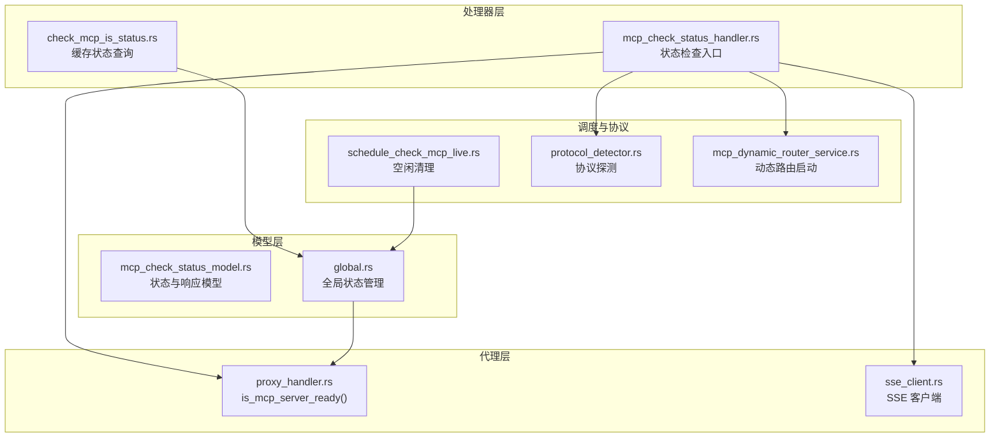
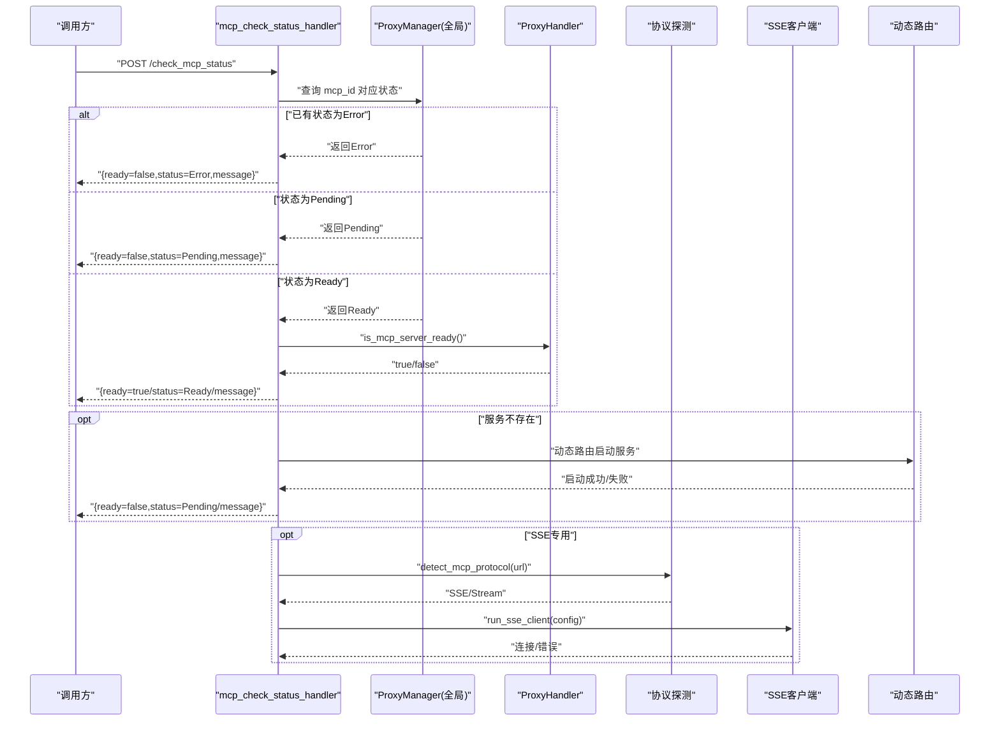
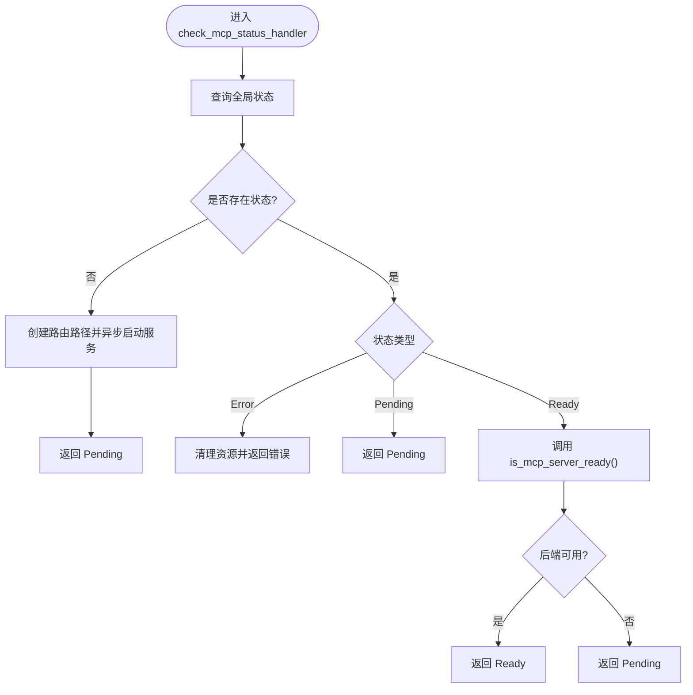
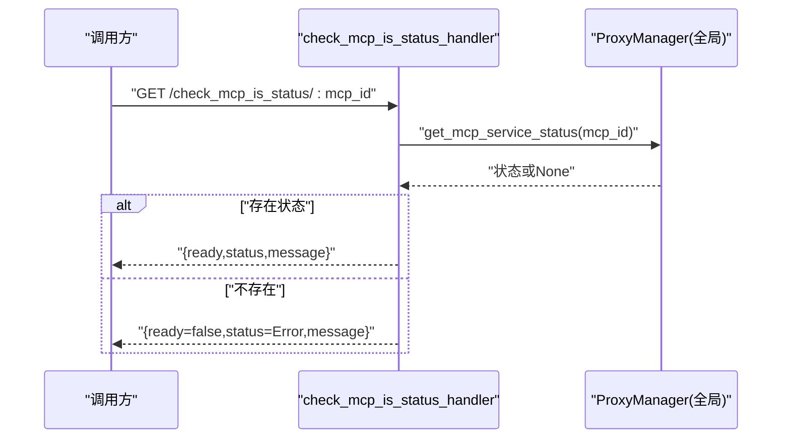
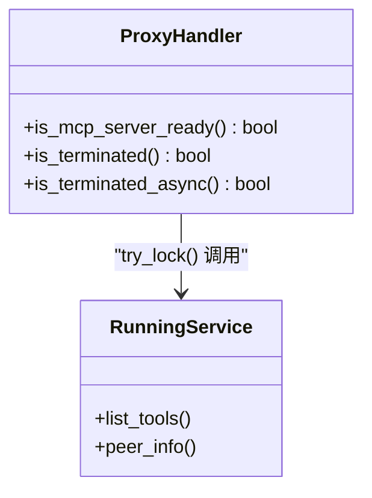
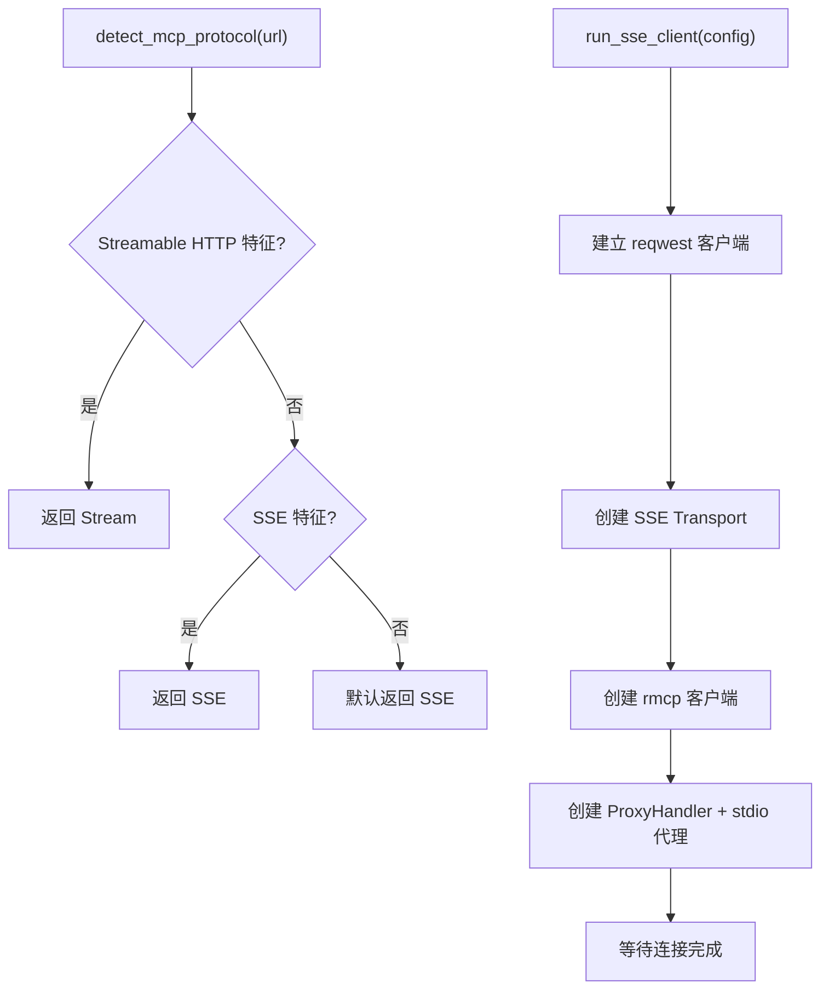
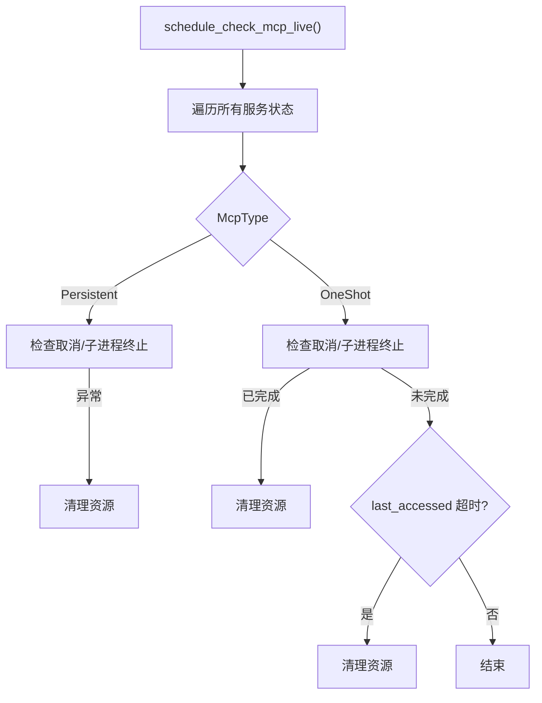
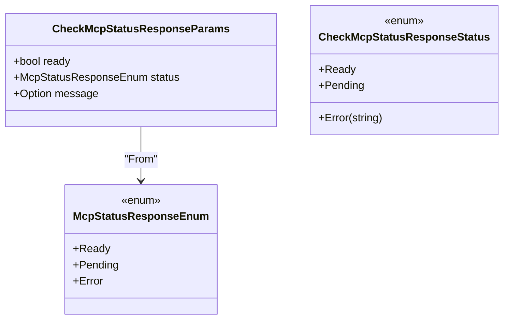
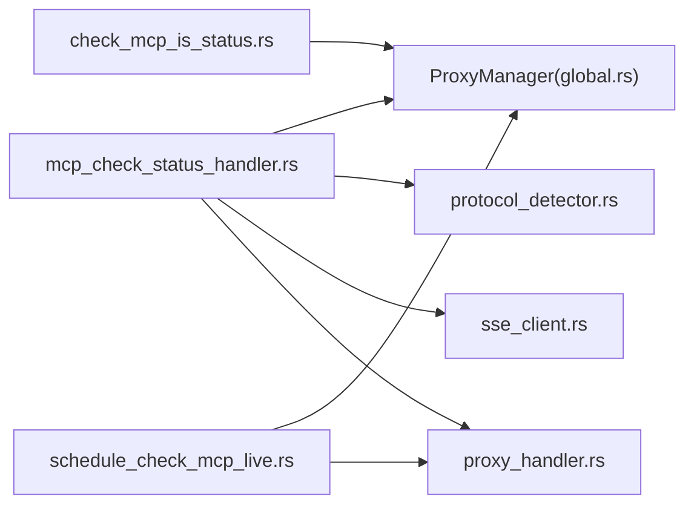

# MCP服务状态检查

<cite>
**本文引用的文件**
- [mcp_check_status_handler.rs](file://mcp-proxy/src/server/handlers/mcp_check_status_handler.rs)
- [check_mcp_is_status.rs](file://mcp-proxy/src/server/handlers/check_mcp_is_status.rs)
- [mcp_check_status_model.rs](file://mcp-proxy/src/model/mcp_check_status_model.rs)
- [proxy_handler.rs](file://mcp-proxy/src/proxy/proxy_handler.rs)
- [schedule_check_mcp_live.rs](file://mcp-proxy/src/server/task/schedule_check_mcp_live.rs)
- [protocol_detector.rs](file://mcp-proxy/src/server/protocol_detector.rs)
- [sse_client.rs](file://mcp-proxy/src/client/sse_client.rs)
- [mcp_dynamic_router_service.rs](file://mcp-proxy/src/server/mcp_dynamic_router_service.rs)
- [global.rs](file://mcp-proxy/src/model/global.rs)
</cite>

## 目录
1. [简介](#简介)
2. [项目结构](#项目结构)
3. [核心组件](#核心组件)
4. [架构总览](#架构总览)
5. [详细组件分析](#详细组件分析)
6. [依赖关系分析](#依赖关系分析)
7. [性能考量](#性能考量)
8. [故障排查指南](#故障排查指南)
9. [结论](#结论)

## 简介
本文件深入解析 mcp_check_status_handler 的状态检测机制，涵盖即时健康检查与缓存状态查询两种模式；说明 check_mcp_is_status 函数如何向目标服务发起协议探测（HTTP GET 或 SSE 连接测试），并评估响应时间与可用性；解释状态缓存策略（TTL、并发访问控制、自动刷新）；解释返回结果中的 status、last_accessed 等关键字段；提供不同场景下的响应示例；列出常见故障原因及排查命令与日志定位方法。

## 项目结构
围绕 MCP 服务状态检查的关键代码位于 mcp-proxy 子模块中，主要涉及：
- 处理器层：状态检查与即时探测
- 模型层：状态与响应模型
- 代理层：对后端 MCP 服务的探测与可用性判定
- 调度层：生命周期与空闲清理
- 协议检测：自动识别 Streamable HTTP 与 SSE 协议
- SSE 客户端：SSE 连接与代理

图表来源
- [mcp_check_status_handler.rs](file://mcp-proxy/src/server/handlers/mcp_check_status_handler.rs#L1-L199)
- [check_mcp_is_status.rs](file://mcp-proxy/src/server/handlers/check_mcp_is_status.rs#L1-L47)
- [mcp_check_status_model.rs](file://mcp-proxy/src/model/mcp_check_status_model.rs#L1-L104)
- [proxy_handler.rs](file://mcp-proxy/src/proxy/proxy_handler.rs#L452-L464)
- [schedule_check_mcp_live.rs](file://mcp-proxy/src/server/task/schedule_check_mcp_live.rs#L1-L96)
- [protocol_detector.rs](file://mcp-proxy/src/server/protocol_detector.rs#L1-L184)
- [sse_client.rs](file://mcp-proxy/src/client/sse_client.rs#L1-L80)
- [mcp_dynamic_router_service.rs](file://mcp-proxy/src/server/mcp_dynamic_router_service.rs#L1-L273)
- [global.rs](file://mcp-proxy/src/model/global.rs#L75-L99)

章节来源
- [mcp_check_status_handler.rs](file://mcp-proxy/src/server/handlers/mcp_check_status_handler.rs#L1-L199)
- [check_mcp_is_status.rs](file://mcp-proxy/src/server/handlers/check_mcp_is_status.rs#L1-L47)
- [mcp_check_status_model.rs](file://mcp-proxy/src/model/mcp_check_status_model.rs#L1-L104)
- [proxy_handler.rs](file://mcp-proxy/src/proxy/proxy_handler.rs#L452-L464)
- [schedule_check_mcp_live.rs](file://mcp-proxy/src/server/task/schedule_check_mcp_live.rs#L1-L96)
- [protocol_detector.rs](file://mcp-proxy/src/server/protocol_detector.rs#L1-L184)
- [sse_client.rs](file://mcp-proxy/src/client/sse_client.rs#L1-L80)
- [mcp_dynamic_router_service.rs](file://mcp-proxy/src/server/mcp_dynamic_router_service.rs#L1-L273)
- [global.rs](file://mcp-proxy/src/model/global.rs#L75-L99)

## 核心组件
- 状态检查处理器：负责即时健康检查与服务启动流程，返回 ready、status、message。
- 缓存状态查询处理器：基于全局状态管理器返回当前缓存状态。
- 代理层探测：通过 try_lock 避免阻塞，调用 list_tools 进行可用性判定。
- 协议探测：自动识别 Streamable HTTP 与 SSE 协议，指导后续连接方式。
- 生命周期调度：对 OneShot/Persistent 服务进行空闲清理与异常终止检测。
- 模型与响应：统一的状态枚举与响应结构体，保证对外一致的语义。

章节来源
- [mcp_check_status_handler.rs](file://mcp-proxy/src/server/handlers/mcp_check_status_handler.rs#L1-L199)
- [check_mcp_is_status.rs](file://mcp-proxy/src/server/handlers/check_mcp_is_status.rs#L1-L47)
- [mcp_check_status_model.rs](file://mcp-proxy/src/model/mcp_check_status_model.rs#L1-L104)
- [proxy_handler.rs](file://mcp-proxy/src/proxy/proxy_handler.rs#L452-L464)
- [protocol_detector.rs](file://mcp-proxy/src/server/protocol_detector.rs#L1-L184)
- [schedule_check_mcp_live.rs](file://mcp-proxy/src/server/task/schedule_check_mcp_live.rs#L1-L96)
- [global.rs](file://mcp-proxy/src/model/global.rs#L75-L99)

## 架构总览
下图展示状态检查的端到端流程，包括即时检查、协议探测、代理可用性判定与缓存状态查询。

图表来源
- [mcp_check_status_handler.rs](file://mcp-proxy/src/server/handlers/mcp_check_status_handler.rs#L34-L199)
- [check_mcp_is_status.rs](file://mcp-proxy/src/server/handlers/check_mcp_is_status.rs#L1-L47)
- [proxy_handler.rs](file://mcp-proxy/src/proxy/proxy_handler.rs#L452-L464)
- [protocol_detector.rs](file://mcp-proxy/src/server/protocol_detector.rs#L1-L184)
- [sse_client.rs](file://mcp-proxy/src/client/sse_client.rs#L1-L80)
- [mcp_dynamic_router_service.rs](file://mcp-proxy/src/server/mcp_dynamic_router_service.rs#L238-L273)
- [global.rs](file://mcp-proxy/src/model/global.rs#L75-L99)

## 详细组件分析

### 即时健康检查（mcp_check_status_handler）
- 功能要点
  - 从全局 ProxyManager 获取 mcp_id 对应的 McpServiceStatus。
  - 若状态为 Error，清理资源并返回错误；若为 Pending，返回 Pending；若为 Ready，进一步探测后端可用性。
  - 若服务不存在，按客户端协议创建 McpRouterPath 并异步启动服务，返回 Pending。
  - SSE/Stream 专用处理器分别注入 McpProtocol，驱动后续协议探测与连接。
- 协议探测
  - detect_mcp_protocol(url) 优先尝试 Streamable HTTP（检查 mcp-session-id、content-type、406 等特征），否则尝试 SSE（text/event-stream）。
- SSE 连接
  - run_sse_client(config) 基于 reqwest 建立 SSE 连接，创建 rmcp 客户端并通过 stdio 代理，用于验证连接可达性。
- 返回结构
  - CheckMcpStatusResponseParams：ready、status（Ready/Pending/Error）、message（错误时携带）。

图表来源
- [mcp_check_status_handler.rs](file://mcp-proxy/src/server/handlers/mcp_check_status_handler.rs#L34-L199)
- [proxy_handler.rs](file://mcp-proxy/src/proxy/proxy_handler.rs#L452-L464)
- [protocol_detector.rs](file://mcp-proxy/src/server/protocol_detector.rs#L1-L184)
- [sse_client.rs](file://mcp-proxy/src/client/sse_client.rs#L1-L80)

章节来源
- [mcp_check_status_handler.rs](file://mcp-proxy/src/server/handlers/mcp_check_status_handler.rs#L34-L199)
- [protocol_detector.rs](file://mcp-proxy/src/server/protocol_detector.rs#L1-L184)
- [sse_client.rs](file://mcp-proxy/src/client/sse_client.rs#L1-L80)

### 缓存状态查询（check_mcp_is_status_handler）
- 功能要点
  - 直接从全局状态管理器读取 mcp_id 的当前状态，返回 ready、status、message。
  - 若 mcp_id 不存在，返回 Error 状态。
- 适用场景
  - 仅需查询缓存状态，不触发即时探测或服务启动。

图表来源
- [check_mcp_is_status.rs](file://mcp-proxy/src/server/handlers/check_mcp_is_status.rs#L1-L47)
- [global.rs](file://mcp-proxy/src/model/global.rs#L75-L99)

章节来源
- [check_mcp_is_status.rs](file://mcp-proxy/src/server/handlers/check_mcp_is_status.rs#L1-L47)
- [global.rs](file://mcp-proxy/src/model/global.rs#L75-L99)

### 代理可用性探测（ProxyHandler::is_mcp_server_ready）
- 设计思想
  - 使用 try_lock 避免阻塞，若无法获取锁，假设服务正常，降低探测对业务的影响。
  - 通过调用 list_tools 进行最小化探测，成功即视为可用。
- 并发与稳定性
  - 通过非阻塞锁与“假设正常”的策略，平衡探测准确性与系统稳定性。

图表来源
- [proxy_handler.rs](file://mcp-proxy/src/proxy/proxy_handler.rs#L452-L464)

章节来源
- [proxy_handler.rs](file://mcp-proxy/src/proxy/proxy_handler.rs#L452-L464)

### 协议探测与连接（detect_mcp_protocol / run_sse_client）
- Streamable HTTP 探测
  - 发送带特定 Accept 头的请求，检查响应头是否包含 mcp-session-id 或 content-type 是否为 text/event-stream/application/json；或返回 406 表示期望特定 Accept。
- SSE 探测
  - 发送 GET 请求，检查 content-type 是否为 text/event-stream 且状态码成功。
- SSE 连接
  - 基于 reqwest 建立 SSE 连接，创建 rmcp 客户端并通过 stdio 代理，验证连接可达性。

图表来源
- [protocol_detector.rs](file://mcp-proxy/src/server/protocol_detector.rs#L1-L184)
- [sse_client.rs](file://mcp-proxy/src/client/sse_client.rs#L1-L80)

章节来源
- [protocol_detector.rs](file://mcp-proxy/src/server/protocol_detector.rs#L1-L184)
- [sse_client.rs](file://mcp-proxy/src/client/sse_client.rs#L1-L80)

### 生命周期与空闲清理（schedule_check_mcp_live）
- Persistent 服务
  - 若取消令牌已取消，或 is_terminated_async() 为真，清理资源。
- OneShot 服务
  - 若取消令牌已取消，清理资源；
  - 若 is_terminated_async() 为真，清理资源；
  - 若 last_accessed 超过阈值（例如 5 分钟），清理资源。
- 作用
  - 防止长时间空闲的 OneShot 服务占用资源；及时回收异常终止的 Persistent 服务。

图表来源
- [schedule_check_mcp_live.rs](file://mcp-proxy/src/server/task/schedule_check_mcp_live.rs#L1-L96)

章节来源
- [schedule_check_mcp_live.rs](file://mcp-proxy/src/server/task/schedule_check_mcp_live.rs#L1-L96)

### 状态模型与响应字段
- CheckMcpStatusResponseParams
  - ready：布尔值，当 status 为 Ready 时为 true。
  - status：枚举 Ready/Pending/Error。
  - message：可选字符串，当 status 为 Error 时携带错误信息。
- McpStatusResponseEnum 与 CheckMcpStatusResponseStatus
  - 二者一一对应，Ready/Pending/Error。
- last_accessed
  - McpServiceStatus 中的字段，用于空闲检测与自动清理。

图表来源
- [mcp_check_status_model.rs](file://mcp-proxy/src/model/mcp_check_status_model.rs#L1-L104)

章节来源
- [mcp_check_status_model.rs](file://mcp-proxy/src/model/mcp_check_status_model.rs#L1-L104)
- [global.rs](file://mcp-proxy/src/model/global.rs#L84-L99)

## 依赖关系分析
- 处理器依赖
  - mcp_check_status_handler 依赖 ProxyManager 获取状态与代理句柄，依赖协议探测与 SSE 客户端进行连接验证。
  - check_mcp_is_status_handler 仅依赖 ProxyManager 的只读查询。
- 代理层依赖
  - ProxyHandler 依赖 rmcp 的 RunningService，通过 try_lock 与 list_tools 进行探测。
- 调度依赖
  - schedule_check_mcp_live 依赖 ProxyManager 的状态集合与 ProxyHandler 的终止检测。
- 协议探测依赖
  - protocol_detector.rs 依赖 reqwest；sse_client.rs 依赖 reqwest 与 rmcp。

图表来源
- [mcp_check_status_handler.rs](file://mcp-proxy/src/server/handlers/mcp_check_status_handler.rs#L1-L199)
- [check_mcp_is_status.rs](file://mcp-proxy/src/server/handlers/check_mcp_is_status.rs#L1-L47)
- [proxy_handler.rs](file://mcp-proxy/src/proxy/proxy_handler.rs#L452-L464)
- [protocol_detector.rs](file://mcp-proxy/src/server/protocol_detector.rs#L1-L184)
- [sse_client.rs](file://mcp-proxy/src/client/sse_client.rs#L1-L80)
- [schedule_check_mcp_live.rs](file://mcp-proxy/src/server/task/schedule_check_mcp_live.rs#L1-L96)
- [global.rs](file://mcp-proxy/src/model/global.rs#L75-L99)

章节来源
- [mcp_check_status_handler.rs](file://mcp-proxy/src/server/handlers/mcp_check_status_handler.rs#L1-L199)
- [check_mcp_is_status.rs](file://mcp-proxy/src/server/handlers/check_mcp_is_status.rs#L1-L47)
- [proxy_handler.rs](file://mcp-proxy/src/proxy/proxy_handler.rs#L452-L464)
- [protocol_detector.rs](file://mcp-proxy/src/server/protocol_detector.rs#L1-L184)
- [sse_client.rs](file://mcp-proxy/src/client/sse_client.rs#L1-L80)
- [schedule_check_mcp_live.rs](file://mcp-proxy/src/server/task/schedule_check_mcp_live.rs#L1-L96)
- [global.rs](file://mcp-proxy/src/model/global.rs#L75-L99)

## 性能考量
- 探测开销最小化
  - 通过 try_lock 避免阻塞，减少对业务请求的影响。
  - 仅调用 list_tools 进行最小化探测，避免复杂操作。
- 并发访问控制
  - 使用 DashMap 管理 McpServiceStatus，保证线程安全。
  - 代理层对客户端句柄加锁，避免竞态。
- 自动刷新与清理
  - schedule_check_mcp_live 定期清理空闲或异常的 OneShot/Persistent 服务，释放资源。
- 建议
  - 对频繁调用的健康检查，建议结合缓存状态查询（check_mcp_is_status）以减少即时探测频率。
  - 对 SSE/Stream 协议探测，建议在首次启动时进行，后续复用已知协议。

[本节为通用性能讨论，不直接分析具体文件]

## 故障排查指南

### 常见故障与现象
- 服务正常运行
  - 状态：Ready；ready=true；message=null。
- 连接超时
  - 现象：SSE/Stream 协议探测失败；返回 Pending 或 Error。
  - 可能原因：网络不通、目标服务未启动、端口未开放。
- 协议不匹配
  - 现象：detect_mcp_protocol 无法识别；SSE/Stream 连接失败。
  - 可能原因：目标服务未实现 SSE 或 Streamable HTTP；路径不正确。

### 排查步骤与命令
- 检查服务是否启动
  - 使用 curl 或浏览器访问目标服务端点，确认服务可达。
  - 查看 mcp-proxy 日志，定位启动失败或协议探测失败的具体阶段。
- 检查协议
  - 使用 curl 验证 SSE：curl -N -H "Accept: text/event-stream" <SSE_URL>
  - 使用 curl 验证 Streamable HTTP：curl -H "Accept: application/json, text/event-stream" -H "Content-Type: application/json" -d '{"jsonrpc":"2.0","id":"probe","method":"ping","params":{}}' <STREAM_URL>
- 检查防火墙与网络
  - 使用 telnet/nmap 检查端口连通性。
  - 检查安全组/防火墙规则，确保允许入站流量。
- 查看日志
  - 关注 mcp_check_status_handler、protocol_detector、sse_client 的日志，定位错误来源。
  - OneShot/Persistent 服务的生命周期日志，确认是否被清理。

### 关键字段说明
- status
  - Ready：服务已就绪，ready=true。
  - Pending：服务正在启动或探测中，ready=false。
  - Error：服务启动失败或探测失败，ready=false，message 携带错误信息。
- last_accessed
  - 最后访问时间戳，用于空闲检测与自动清理（例如 5 分钟未访问的 OneShot 服务会被清理）。

章节来源
- [mcp_check_status_model.rs](file://mcp-proxy/src/model/mcp_check_status_model.rs#L1-L104)
- [schedule_check_mcp_live.rs](file://mcp-proxy/src/server/task/schedule_check_mcp_live.rs#L1-L96)
- [protocol_detector.rs](file://mcp-proxy/src/server/protocol_detector.rs#L1-L184)
- [sse_client.rs](file://mcp-proxy/src/client/sse_client.rs#L1-L80)

## 结论
mcp_check_status_handler 通过“即时健康检查 + 缓存状态查询”双通道实现 MCP 服务状态监控：前者在需要时进行协议探测与可用性验证，后者提供低开销的缓存读取。代理层采用非阻塞探测与最小化调用，保障系统稳定性；调度层通过空闲清理与异常检测，维持资源健康。返回模型统一了 ready、status、message 的语义，便于上层系统快速判断与处理。结合协议探测与日志定位，可高效排查连接超时、协议不匹配等常见问题。