# MCP服务管理

<cite>
**本文档引用的文件**
- [mcp_config.rs](file://mcp-proxy/src/model/mcp_config.rs)
- [mcp_add_handler.rs](file://mcp-proxy/src/server/handlers/mcp_add_handler.rs)
- [mcp_check_status_handler.rs](file://mcp-proxy/src/server/handlers/mcp_check_status_handler.rs)
- [delete_route_handler.rs](file://mcp-proxy/src/server/handlers/delete_route_handler.rs)
- [mcp_router_model.rs](file://mcp-proxy/src/model/mcp_router_model.rs)
- [mcp_dynamic_router_service.rs](file://mcp-proxy/src/server/mcp_dynamic_router_service.rs)
- [schedule_check_mcp_live.rs](file://mcp-proxy/src/server/task/schedule_check_mcp_live.rs)
- [mcp_router_json.rs](file://mcp-proxy/src/server/middlewares/mcp_router_json.rs)
- [mcp_update_latest_layer.rs](file://mcp-proxy/src/server/middlewares/mcp_update_latest_layer.rs)
- [router_layer.rs](file://mcp-proxy/src/server/router_layer.rs)
- [config.yml](file://mcp-proxy/config.yml)
- [README.md](file://mcp-proxy/README.md)
</cite>

## 目录
1. [MCP服务全生命周期管理](#mcp服务全生命周期管理)
2. [服务添加功能](#服务添加功能)
3. [状态检查机制](#状态检查机制)
4. [服务删除操作](#服务删除操作)
5. [配置模型解析](#配置模型解析)
6. [API调用示例](#api调用示例)
7. [常见问题排查](#常见问题排查)
8. [最佳实践](#最佳实践)

## MCP服务全生命周期管理

MCP服务的全生命周期管理涵盖了服务的添加、状态检查和删除操作。系统通过动态路由机制实现对MCP服务的灵活管理，支持SSE和Streamable HTTP两种协议。整个生命周期由`mcp_add_handler`、`mcp_check_status_handler`和`delete_route_handler`三个核心处理器协同完成，配合`mcp_dynamic_router_service`实现动态路由分发。

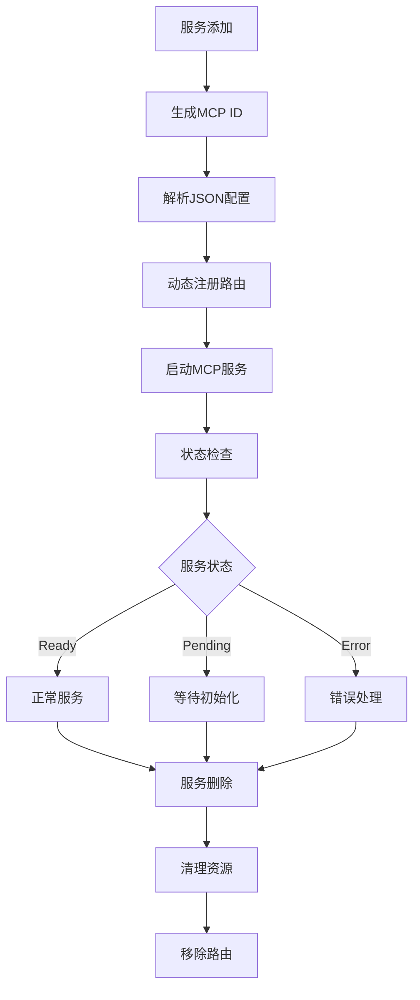
```mermaid
graph TD
A[服务添加] --> B[生成MCP ID]
B --> C[解析JSON配置]
C --> D[动态注册路由]
D --> E[启动MCP服务]
E --> F[状态检查]
F --> G{服务状态}
G --> |Ready| H[正常服务]
G --> |Pending| I[等待初始化]
G --> |Error| J[错误处理]
H --> K[服务删除]
I --> K
J --> K
K --> L[清理资源]
L --> M[移除路由]
```

**图表来源**
- [mcp_add_handler.rs](file://mcp-proxy/src/server/handlers/mcp_add_handler.rs#L1-L91)
- [mcp_check_status_handler.rs](file://mcp-proxy/src/server/handwares/mcp_check_status_handler.rs#L1-L199)
- [delete_route_handler.rs](file://mcp-proxy/src/server/handlers/delete_route_handler.rs#L1-L25)

**本节来源**
- [mcp_add_handler.rs](file://mcp-proxy/src/server/handlers/mcp_add_handler.rs#L1-L91)
- [mcp_check_status_handler.rs](file://mcp-proxy/src/server/handlers/mcp_check_status_handler.rs#L1-L199)
- [delete_route_handler.rs](file://mcp-proxy/src/server/handlers/delete_route_handler.rs#L1-L25)

## 服务添加功能

### mcp_add_handler配置解析

`mcp_add_handler`负责解析配置并动态注册路由，是MCP服务生命周期的起点。该处理器通过`AddRouteParams`结构体接收JSON配置和MCP类型参数，根据请求路径中的协议前缀确定服务类型。

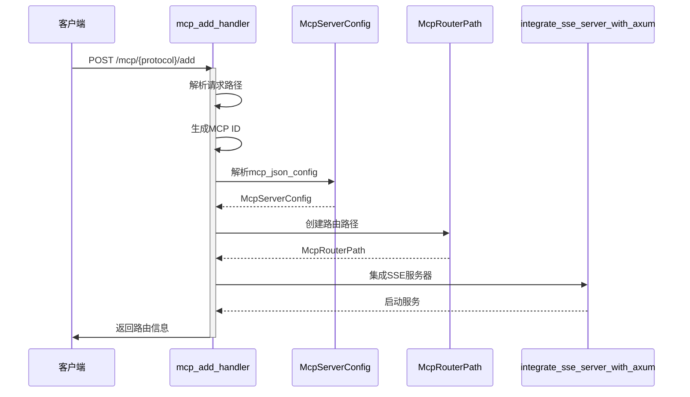
```mermaid
sequenceDiagram
participant Client as 客户端
participant Handler as mcp_add_handler
participant Config as McpServerConfig
participant Router as McpRouterPath
participant Integrator as integrate_sse_server_with_axum
Client->>Handler : POST /mcp/{protocol}/add
activate Handler
Handler->>Handler : 解析请求路径
Handler->>Handler : 生成MCP ID
Handler->>Config : 解析mcp_json_config
Config-->>Handler : McpServerConfig
Handler->>Router : 创建路由路径
Router-->>Handler : McpRouterPath
Handler->>Integrator : 集成SSE服务器
Integrator-->>Handler : 启动服务
Handler->>Client : 返回路由信息
deactivate Handler
```

**图表来源**
- [mcp_add_handler.rs](file://mcp-proxy/src/server/handlers/mcp_add_handler.rs#L1-L91)
- [mcp_router_model.rs](file://mcp-proxy/src/model/mcp_router_model.rs#L1-L800)

**本节来源**
- [mcp_add_handler.rs](file://mcp-proxy/src/server/handlers/mcp_add_handler.rs#L1-L91)
- [mcp_router_model.rs](file://mcp-proxy/src/model/mcp_router_model.rs#L1-L800)

### JSON配置结构与验证

MCP服务的JSON配置遵循严格的结构要求，通过`McpJsonServerParameters`模型进行解析和验证。配置必须包含恰好一个MCP服务器定义，支持命令行和URL两种配置方式。

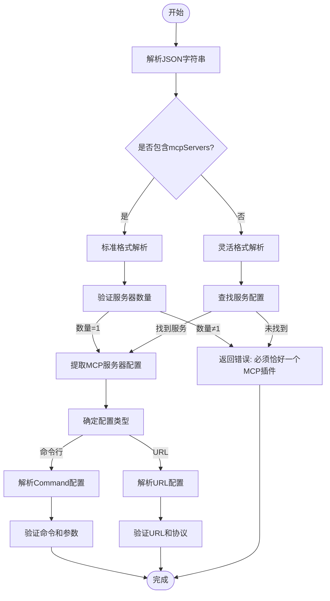
```mermaid
flowchart TD
Start([开始]) --> ParseJSON["解析JSON字符串"]
ParseJSON --> CheckFormat{"是否包含mcpServers?"}
CheckFormat --> |是| StandardFormat["标准格式解析"]
CheckFormat --> |否| FlexibleFormat["灵活格式解析"]
StandardFormat --> ValidateCount["验证服务器数量"]
FlexibleFormat --> FindServices["查找服务配置"]
ValidateCount --> |数量=1| ExtractConfig["提取MCP服务器配置"]
ValidateCount --> |数量≠1| ReturnError["返回错误: 必须恰好一个MCP插件"]
FindServices --> |找到服务| ExtractConfig
FindServices --> |未找到| ReturnError
ExtractConfig --> DetermineType["确定配置类型"]
DetermineType --> |命令行| CommandConfig["解析Command配置"]
DetermineType --> |URL| UrlConfig["解析URL配置"]
CommandConfig --> ValidateCommand["验证命令和参数"]
UrlConfig --> ValidateUrl["验证URL和协议"]
ValidateCommand --> End([完成])
ValidateUrl --> End
ReturnError --> End
```

**图表来源**
- [mcp_router_model.rs](file://mcp-proxy/src/model/mcp_router_model.rs#L1-L800)
- [mcp_config.rs](file://mcp-proxy/src/model/mcp_config.rs#L1-L102)

**本节来源**
- [mcp_router_model.rs](file://mcp-proxy/src/model/mcp_router_model.rs#L1-L800)
- [mcp_config.rs](file://mcp-proxy/src/model/mcp_config.rs#L1-L102)

### 错误处理机制

`mcp_add_handler`实现了完善的错误处理机制，确保在配置解析失败或服务启动异常时能够提供清晰的错误信息。所有错误都通过`AppError::McpServerError`包装，并记录详细的错误日志。

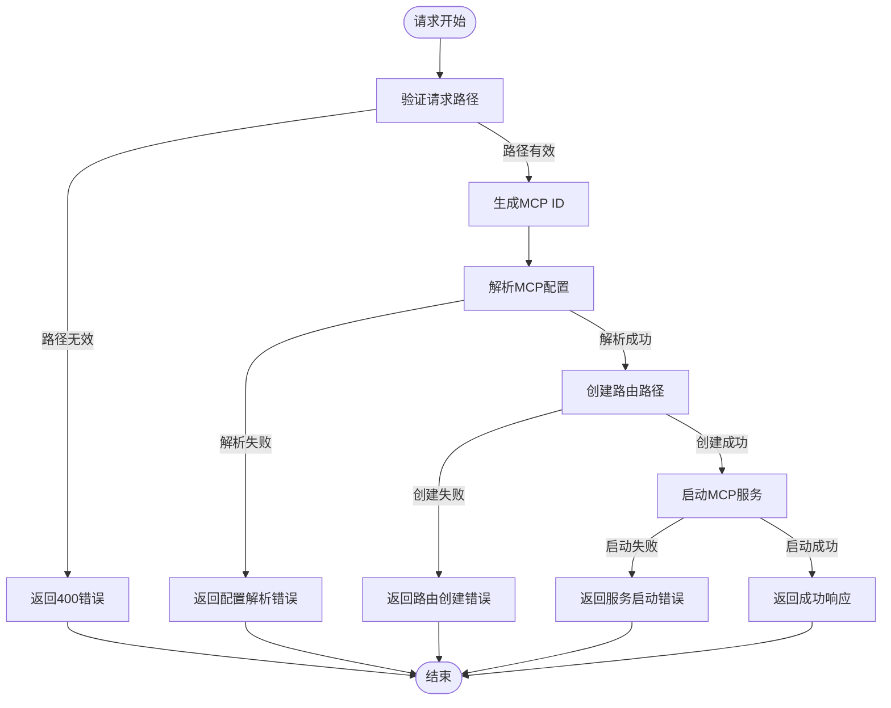
```mermaid
flowchart TD
Start([请求开始]) --> ValidatePath["验证请求路径"]
ValidatePath --> |路径无效| BadRequest["返回400错误"]
ValidatePath --> |路径有效| GenerateID["生成MCP ID"]
GenerateID --> ParseConfig["解析MCP配置"]
ParseConfig --> |解析失败| ConfigError["返回配置解析错误"]
ParseConfig --> |解析成功| CreateRouter["创建路由路径"]
CreateRouter --> |创建失败| RouterError["返回路由创建错误"]
CreateRouter --> |创建成功| StartService["启动MCP服务"]
StartService --> |启动失败| ServiceError["返回服务启动错误"]
StartService --> |启动成功| ReturnSuccess["返回成功响应"]
BadRequest --> End([结束])
ConfigError --> End
RouterError --> End
ServiceError --> End
ReturnSuccess --> End
```

**图表来源**
- [mcp_add_handler.rs](file://mcp-proxy/src/server/handlers/mcp_add_handler.rs#L1-L91)
- [mcp_error.rs](file://mcp-proxy/src/mcp_error.rs)

**本节来源**
- [mcp_add_handler.rs](file://mcp-proxy/src/server/handlers/mcp_add_handler.rs#L1-L91)

## 状态检查机制

### mcp_check_status_handler状态检测逻辑

`mcp_check_status_handler`负责检查MCP服务的状态，实现了智能的状态检测和自动启动机制。该处理器首先检查服务是否已存在，如果不存在则根据提供的配置异步启动服务。

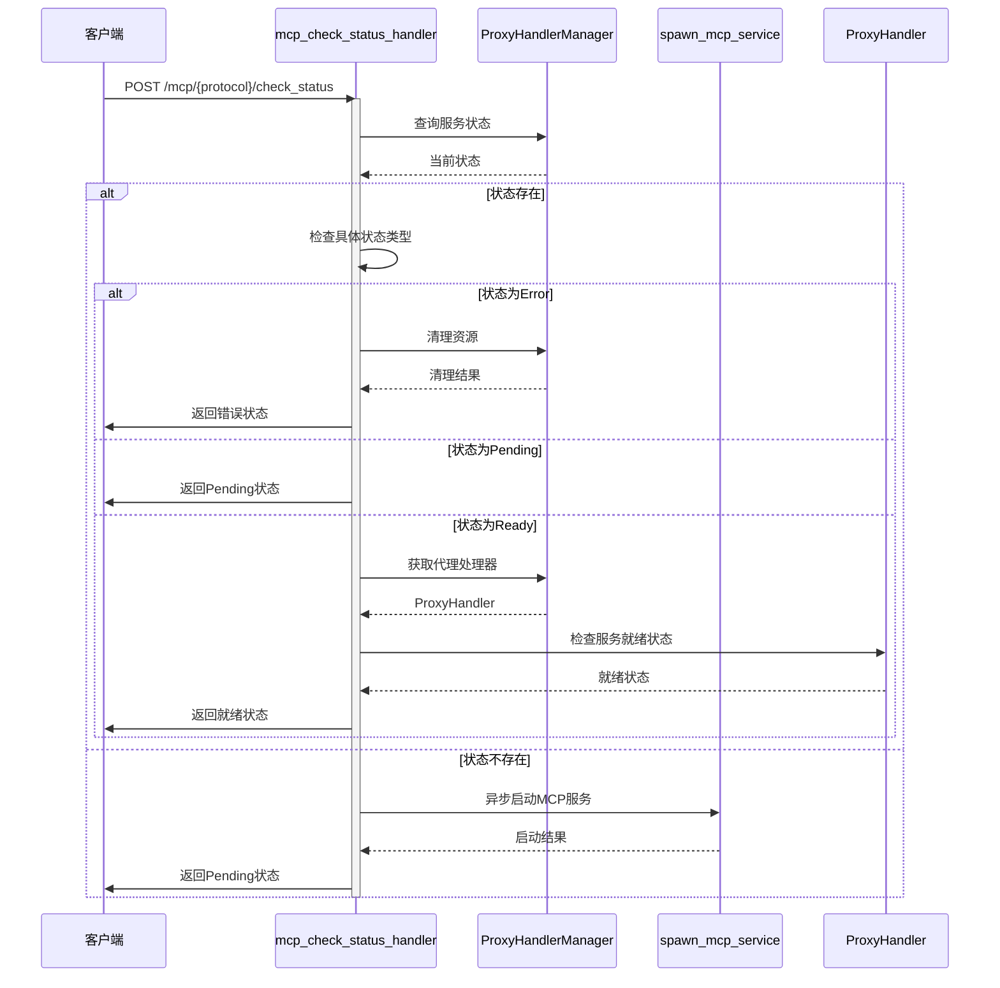
```mermaid
sequenceDiagram
participant Client as 客户端
participant Handler as mcp_check_status_handler
participant Manager as ProxyHandlerManager
participant Spawner as spawn_mcp_service
Client->>Handler : POST /mcp/{protocol}/check_status
activate Handler
Handler->>Manager : 查询服务状态
Manager-->>Handler : 当前状态
alt 状态存在
Handler->>Handler : 检查具体状态类型
alt 状态为Error
Handler->>Manager : 清理资源
Manager-->>Handler : 清理结果
Handler->>Client : 返回错误状态
else 状态为Pending
Handler->>Client : 返回Pending状态
else 状态为Ready
Handler->>Manager : 获取代理处理器
Manager-->>Handler : ProxyHandler
Handler->>ProxyHandler : 检查服务就绪状态
ProxyHandler-->>Handler : 就绪状态
Handler->>Client : 返回就绪状态
end
else 状态不存在
Handler->>Spawner : 异步启动MCP服务
Spawner-->>Handler : 启动结果
Handler->>Client : 返回Pending状态
end
deactivate Handler
```

**图表来源**
- [mcp_check_status_handler.rs](file://mcp-proxy/src/server/handlers/mcp_check_status_handler.rs#L1-L199)
- [mcp_dynamic_router_service.rs](file://mcp-proxy/src/server/mcp_dynamic_router_service.rs#L1-L273)

**本节来源**
- [mcp_check_status_handler.rs](file://mcp-proxy/src/server/handlers/mcp_check_status_handler.rs#L1-L199)

### 健康检查频率与超时设置

系统的健康检查机制通过`schedule_check_mcp_live`任务定期执行，检查所有MCP服务的活跃状态。对于一次性任务(OneShot)，如果超过3分钟未被访问，则自动清理相关资源。

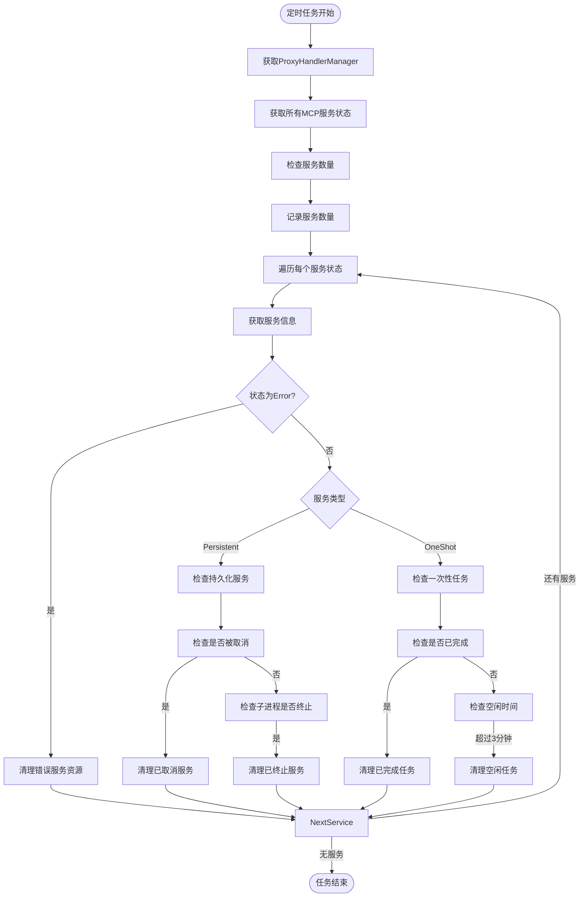
```mermaid
flowchart TD
Start([定时任务开始]) --> GetManager["获取ProxyHandlerManager"]
GetManager --> GetStatuses["获取所有MCP服务状态"]
GetStatuses --> CheckCount["检查服务数量"]
CheckCount --> LogCount["记录服务数量"]
LogCount --> ProcessEach["遍历每个服务状态"]
ProcessEach --> GetInfo["获取服务信息"]
GetInfo --> CheckError{"状态为Error?"}
CheckError --> |是| CleanupError["清理错误服务资源"]
CheckError --> |否| CheckType{"服务类型"}
CheckType --> |Persistent| CheckPersistent["检查持久化服务"]
CheckType --> |OneShot| CheckOneShot["检查一次性任务"]
CheckPersistent --> CheckCancelled["检查是否被取消"]
CheckCancelled --> |是| CleanupCancelled["清理已取消服务"]
CheckCancelled --> |否| CheckTerminated["检查子进程是否终止"]
CheckTerminated --> |是| CleanupTerminated["清理已终止服务"]
CheckOneShot --> CheckCompleted["检查是否已完成"]
CheckCompleted --> |是| CleanupCompleted["清理已完成任务"]
CheckCompleted --> |否| CheckIdleTime["检查空闲时间"]
CheckIdleTime --> |超过3分钟| CleanupIdle["清理空闲任务"]
CleanupError --> NextService
CleanupCancelled --> NextService
CleanupTerminated --> NextService
CleanupCompleted --> NextService
CleanupIdle --> NextService
NextService --> |还有服务| ProcessEach
NextService --> |无服务| End([任务结束])
```

**图表来源**
- [schedule_check_mcp_live.rs](file://mcp-proxy/src/server/task/schedule_check_mcp_live.rs#L1-L96)
- [mcp_router_model.rs](file://mcp-proxy/src/model/mcp_router_model.rs#L1-L800)

**本节来源**
- [schedule_check_mcp_live.rs](file://mcp-proxy/src/server/task/schedule_check_mcp_live.rs#L1-L96)

### 状态缓存策略

系统采用基于内存的状态缓存策略，通过`ProxyHandlerManager`的`DashMap`数据结构存储MCP服务状态。每个服务状态包含最后访问时间戳，用于实现基于时间的资源清理策略。

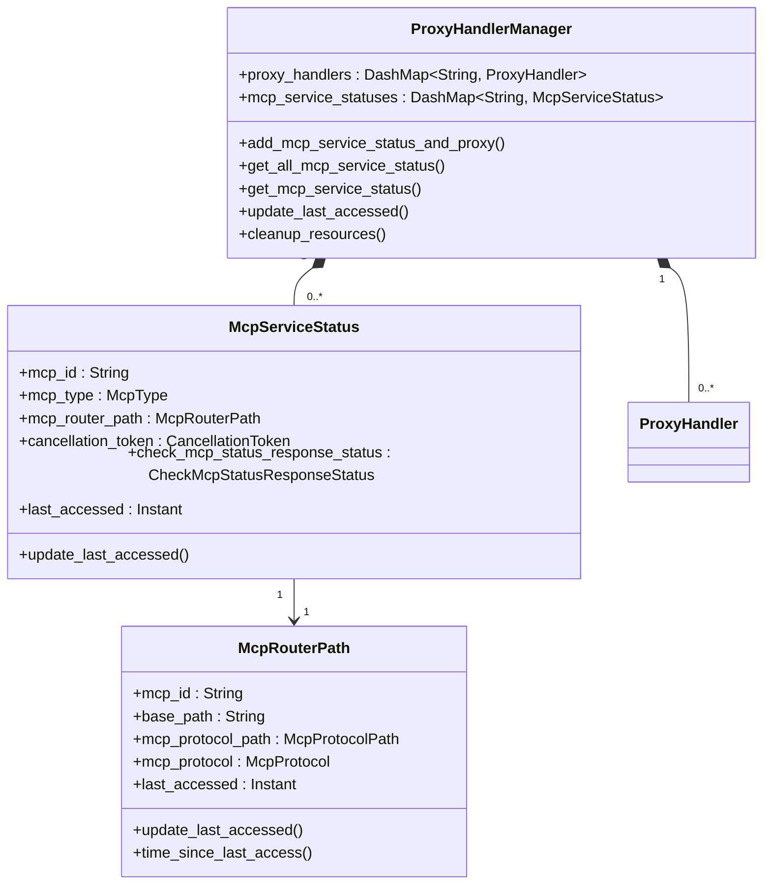
```mermaid
classDiagram
class McpServiceStatus {
+mcp_id : String
+mcp_type : McpType
+mcp_router_path : McpRouterPath
+cancellation_token : CancellationToken
+check_mcp_status_response_status : CheckMcpStatusResponseStatus
+last_accessed : Instant
+update_last_accessed()
}
class ProxyHandlerManager {
+proxy_handlers : DashMap~String, ProxyHandler~
+mcp_service_statuses : DashMap~String, McpServiceStatus~
+add_mcp_service_status_and_proxy()
+get_all_mcp_service_status()
+get_mcp_service_status()
+update_last_accessed()
+cleanup_resources()
}
class McpRouterPath {
+mcp_id : String
+base_path : String
+mcp_protocol_path : McpProtocolPath
+mcp_protocol : McpProtocol
+last_accessed : Instant
+update_last_accessed()
+time_since_last_access()
}
ProxyHandlerManager "1" *-- "0..*" McpServiceStatus
ProxyHandlerManager "1" *-- "0..*" ProxyHandler
McpServiceStatus "1" --> "1" McpRouterPath
```

**图表来源**
- [mcp_router_model.rs](file://mcp-proxy/src/model/mcp_router_model.rs#L1-L800)
- [global.rs](file://mcp-proxy/src/model/global.rs#L102-L173)

**本节来源**
- [mcp_router_model.rs](file://mcp-proxy/src/model/mcp_router_model.rs#L1-L800)
- [global.rs](file://mcp-proxy/src/model/global.rs#L102-L173)

## 服务删除操作

### delete_route_handler安全移除机制

`delete_route_handler`负责安全移除服务路由并清理相关资源，确保系统资源的及时释放。该处理器通过`cleanup_resources`方法执行完整的资源清理流程。

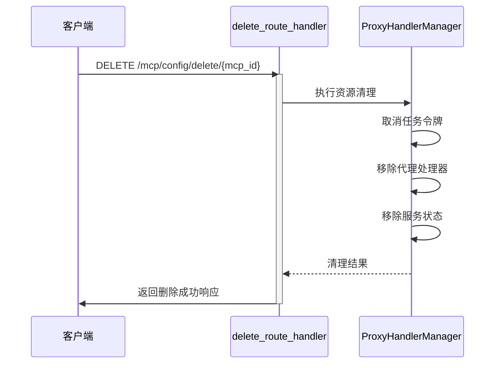
```mermaid
sequenceDiagram
participant Client as 客户端
participant Handler as delete_route_handler
participant Manager as ProxyHandlerManager
Client->>Handler : DELETE /mcp/config/delete/{mcp_id}
activate Handler
Handler->>Manager : 执行资源清理
Manager->>Manager : 取消任务令牌
Manager->>Manager : 移除代理处理器
Manager->>Manager : 移除服务状态
Manager-->>Handler : 清理结果
Handler->>Client : 返回删除成功响应
deactivate Handler
```

**图表来源**
- [delete_route_handler.rs](file://mcp-proxy/src/server/handlers/delete_route_handler.rs#L1-L25)
- [mcp_dynamic_router_service.rs](file://mcp-proxy/src/server/mcp_dynamic_router_service.rs#L1-L273)

**本节来源**
- [delete_route_handler.rs](file://mcp-proxy/src/server/handlers/delete_route_handler.rs#L1-L25)

## 配置模型解析

### mcp_config数据模型

`McpConfig`数据模型定义了MCP服务的核心配置项，包括MCP ID、JSON配置、服务类型和客户端协议等关键属性。该模型通过Serde库实现JSON序列化和反序列化。

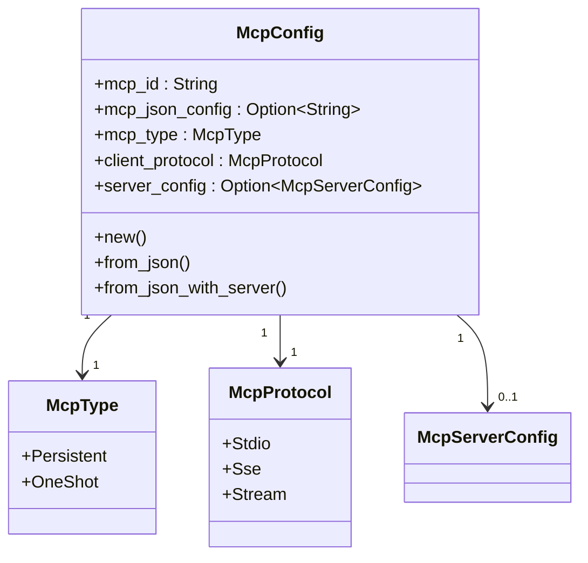
```mermaid
classDiagram
class McpConfig {
+mcp_id : String
+mcp_json_config : Option~String~
+mcp_type : McpType
+client_protocol : McpProtocol
+server_config : Option~McpServerConfig~
+new()
+from_json()
+from_json_with_server()
}
class McpType {
+Persistent
+OneShot
}
class McpProtocol {
+Stdio
+Sse
+Stream
}
McpConfig "1" --> "1" McpType
McpConfig "1" --> "1" McpProtocol
McpConfig "1" --> "0..1" McpServerConfig
```

**图表来源**
- [mcp_config.rs](file://mcp-proxy/src/model/mcp_config.rs#L1-L102)
- [mcp_router_model.rs](file://mcp-proxy/src/model/mcp_router_model.rs#L1-L800)

**本节来源**
- [mcp_config.rs](file://mcp-proxy/src/model/mcp_config.rs#L1-L102)

### 配置项含义与作用范围

MCP配置项具有明确的含义和作用范围，确保服务的正确配置和运行。各配置项的作用范围从全局到局部，形成了完整的配置体系。

| 配置项 | 类型 | 默认值 | 作用范围 | 说明 |
|--------|------|--------|----------|------|
| mcpId | String | 无 | 全局唯一 | MCP服务的唯一标识符 |
| mcpJsonConfig | String | 无 | 服务实例 | MCP服务的JSON配置字符串 |
| mcpType | McpType | OneShot | 服务实例 | 服务类型：Persistent(持久)或OneShot(一次性) |
| clientProtocol | McpProtocol | Sse | 服务实例 | 客户端使用的协议类型 |
| server_config | McpServerConfig | None | 运行时 | 解析后的服务器配置，运行时生成 |

**本节来源**
- [mcp_config.rs](file://mcp-proxy/src/model/mcp_config.rs#L1-L102)
- [mcp_router_model.rs](file://mcp-proxy/src/model/mcp_router_model.rs#L1-L800)

## API调用示例

### 服务添加API调用

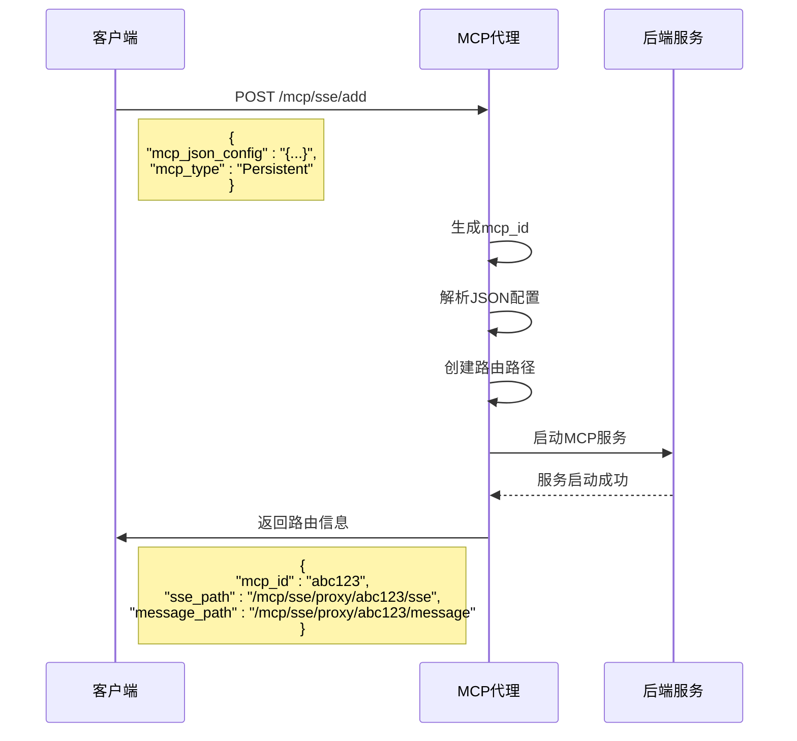
```mermaid
sequenceDiagram
participant Client as 客户端
participant Proxy as MCP代理
participant Backend as 后端服务
Client->>Proxy : POST /mcp/sse/add
Note right of Client : {<br/> "mcp_json_config" : "{...}",<br/> "mcp_type" : "Persistent"<br/>}
Proxy->>Proxy : 生成mcp_id
Proxy->>Proxy : 解析JSON配置
Proxy->>Proxy : 创建路由路径
Proxy->>Backend : 启动MCP服务
Backend-->>Proxy : 服务启动成功
Proxy->>Client : 返回路由信息
Note left of Proxy : {<br/> "mcp_id" : "abc123",<br/> "sse_path" : "/mcp/sse/proxy/abc123/sse",<br/> "message_path" : "/mcp/sse/proxy/abc123/message"<br/>}
```

**本节来源**
- [mcp_add_handler.rs](file://mcp-proxy/src/server/handlers/mcp_add_handler.rs#L1-L91)
- [README.md](file://mcp-proxy/README.md#L211-L776)

### 状态检查API调用

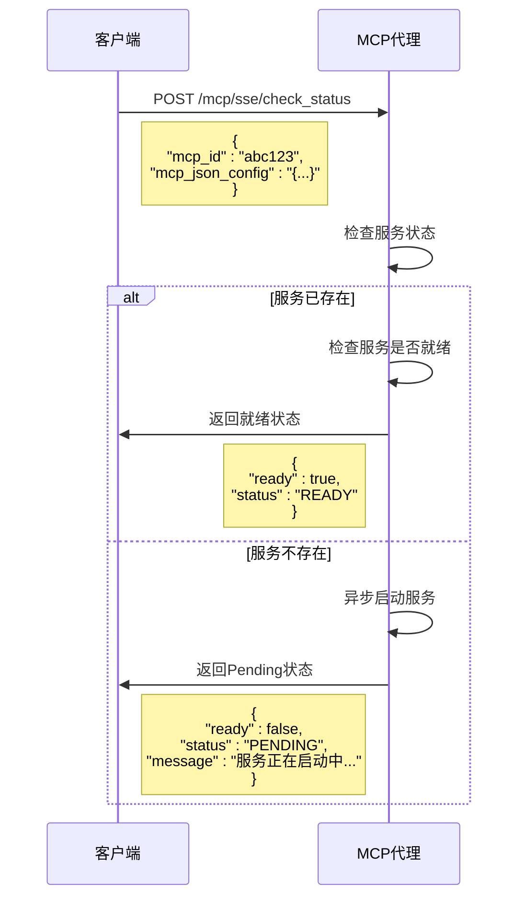
```mermaid
sequenceDiagram
participant Client as 客户端
participant Proxy as MCP代理
Client->>Proxy : POST /mcp/sse/check_status
Note right of Client : {<br/> "mcp_id" : "abc123",<br/> "mcp_json_config" : "{...}"<br/>}
Proxy->>Proxy : 检查服务状态
alt 服务已存在
Proxy->>Proxy : 检查服务是否就绪
Proxy->>Client : 返回就绪状态
Note left of Proxy : {<br/> "ready" : true,<br/> "status" : "READY"<br/>}
else 服务不存在
Proxy->>Proxy : 异步启动服务
Proxy->>Client : 返回Pending状态
Note left of Proxy : {<br/> "ready" : false,<br/> "status" : "PENDING",<br/> "message" : "服务正在启动中..."<br/>}
end
```

**本节来源**
- [mcp_check_status_handler.rs](file://mcp-proxy/src/server/handlers/mcp_check_status_handler.rs#L1-L199)
- [README.md](file://mcp-proxy/README.md#L211-L776)

### 服务删除API调用

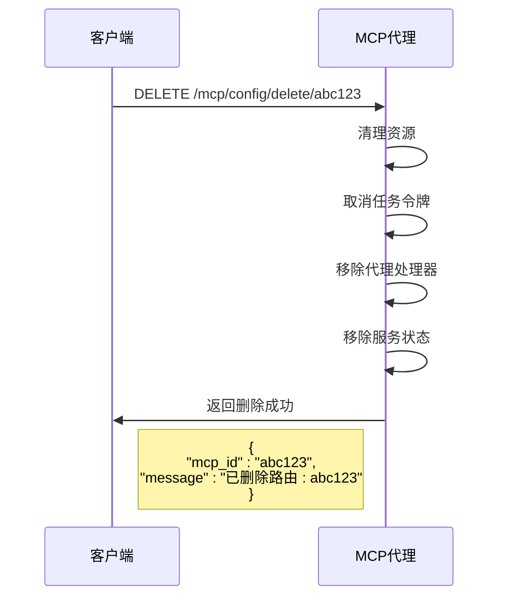
```mermaid
sequenceDiagram
participant Client as 客户端
participant Proxy as MCP代理
Client->>Proxy : DELETE /mcp/config/delete/abc123
Proxy->>Proxy : 清理资源
Proxy->>Proxy : 取消任务令牌
Proxy->>Proxy : 移除代理处理器
Proxy->>Proxy : 移除服务状态
Proxy->>Client : 返回删除成功
Note left of Proxy : {<br/> "mcp_id" : "abc123",<br/> "message" : "已删除路由 : abc123"<br/>}
```

**本节来源**
- [delete_route_handler.rs](file://mcp-proxy/src/server/handlers/delete_route_handler.rs#L1-L25)
- [README.md](file://mcp-proxy/README.md#L211-L776)

## 常见问题排查

### 服务启动失败

当MCP服务启动失败时，系统会记录详细的错误日志并返回相应的错误信息。常见原因包括配置格式错误、依赖服务不可用、网络连接问题等。

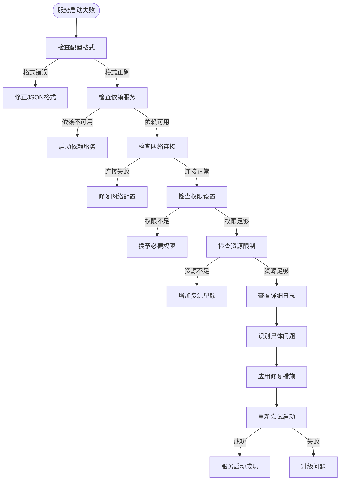
```mermaid
flowchart TD
Start([服务启动失败]) --> CheckConfig["检查配置格式"]
CheckConfig --> |格式错误| FixConfig["修正JSON格式"]
CheckConfig --> |格式正确| CheckDependencies["检查依赖服务"]
CheckDependencies --> |依赖不可用| StartDependencies["启动依赖服务"]
CheckDependencies --> |依赖可用| CheckNetwork["检查网络连接"]
CheckNetwork --> |连接失败| FixNetwork["修复网络配置"]
CheckNetwork --> |连接正常| CheckPermissions["检查权限设置"]
CheckPermissions --> |权限不足| GrantPermissions["授予必要权限"]
CheckPermissions --> |权限足够| CheckResources["检查资源限制"]
CheckResources --> |资源不足| IncreaseResources["增加资源配额"]
CheckResources --> |资源足够| ReviewLogs["查看详细日志"]
ReviewLogs --> IdentifyIssue["识别具体问题"]
IdentifyIssue --> ApplyFix["应用修复措施"]
ApplyFix --> Retry["重新尝试启动"]
Retry --> |成功| Success["服务启动成功"]
Retry --> |失败| Escalate["升级问题"]
```

**本节来源**
- [mcp_check_status_handler.rs](file://mcp-proxy/src/server/handlers/mcp_check_status_handler.rs#L1-L199)
- [mcp_add_handler.rs](file://mcp-proxy/src/server/handlers/mcp_add_handler.rs#L1-L91)

### 路由注册异常

路由注册异常通常由协议不匹配、路径冲突或配置错误引起。系统通过严格的路径验证和协议检测机制来预防此类问题。

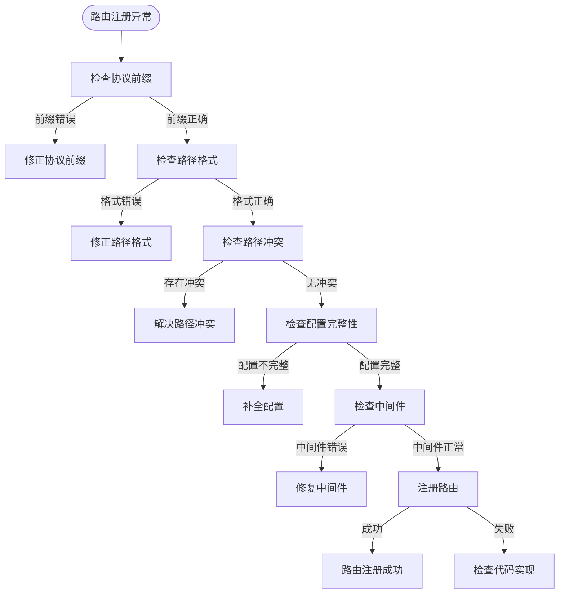
```mermaid
flowchart TD
Start([路由注册异常]) --> CheckProtocol["检查协议前缀"]
CheckProtocol --> |前缀错误| CorrectPrefix["修正协议前缀"]
CheckProtocol --> |前缀正确| CheckPath["检查路径格式"]
CheckPath --> |格式错误| FixPath["修正路径格式"]
CheckPath --> |格式正确| CheckConflict["检查路径冲突"]
CheckConflict --> |存在冲突| ResolveConflict["解决路径冲突"]
CheckConflict --> |无冲突| CheckConfig["检查配置完整性"]
CheckConfig --> |配置不完整| CompleteConfig["补全配置"]
CheckConfig --> |配置完整| CheckMiddleware["检查中间件"]
CheckMiddleware --> |中间件错误| FixMiddleware["修复中间件"]
CheckMiddleware --> |中间件正常| RegisterRoute["注册路由"]
RegisterRoute --> |成功| Success["路由注册成功"]
RegisterRoute --> |失败| ReviewCode["检查代码实现"]
```

**本节来源**
- [mcp_router_model.rs](file://mcp-proxy/src/model/mcp_router_model.rs#L1-L800)
- [router_layer.rs](file://mcp-proxy/src/server/router_layer.rs#L1-L83)

## 最佳实践

### 配置管理最佳实践

遵循配置管理的最佳实践可以确保MCP服务的稳定运行和易于维护。建议采用标准化的配置格式、合理的默认值和清晰的文档说明。

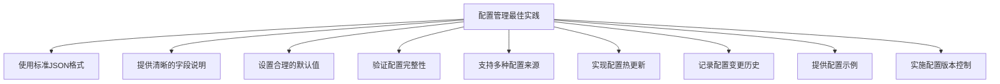
```mermaid
flowchart TD
A[配置管理最佳实践] --> B[使用标准JSON格式]
A --> C[提供清晰的字段说明]
A --> D[设置合理的默认值]
A --> E[验证配置完整性]
A --> F[支持多种配置来源]
A --> G[实现配置热更新]
A --> H[记录配置变更历史]
A --> I[提供配置示例]
A --> J[实施配置版本控制]
```

**本节来源**
- [mcp_config.rs](file://mcp-proxy/src/model/mcp_config.rs#L1-L102)
- [config.yml](file://mcp-proxy/config.yml#L1-L11)

### 性能优化建议

通过合理的性能优化措施，可以提升MCP服务的响应速度和资源利用率。重点关注连接管理、缓存策略和异步处理等方面。

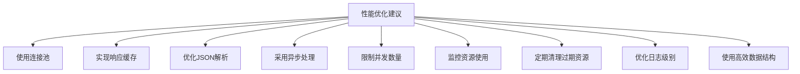
```mermaid
flowchart TD
A[性能优化建议] --> B[使用连接池]
A --> C[实现响应缓存]
A --> D[优化JSON解析]
A --> E[采用异步处理]
A --> F[限制并发数量]
A --> G[监控资源使用]
A --> H[定期清理过期资源]
A --> I[优化日志级别]
A --> J[使用高效数据结构]
```

**本节来源**
- [mcp_dynamic_router_service.rs](file://mcp-proxy/src/server/mcp_dynamic_router_service.rs#L1-L273)
- [schedule_check_mcp_live.rs](file://mcp-proxy/src/server/task/schedule_check_mcp_live.rs#L1-L96)