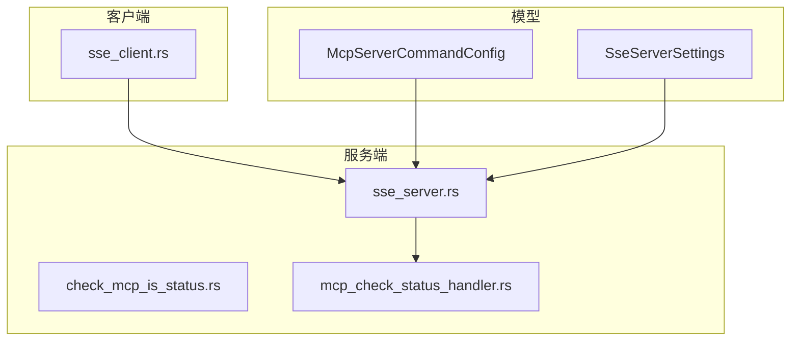
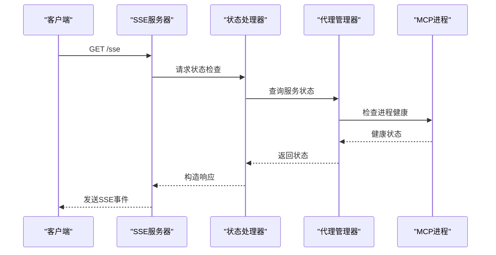
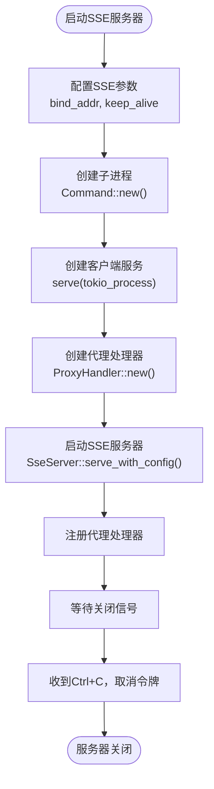
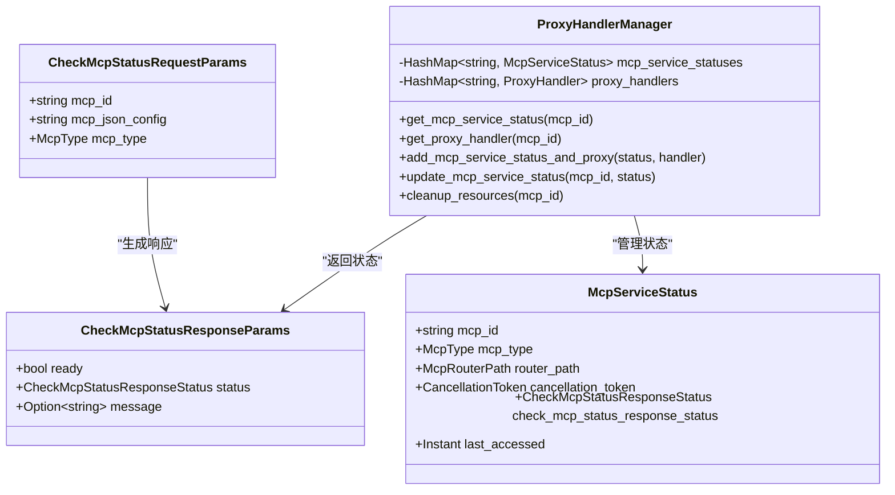
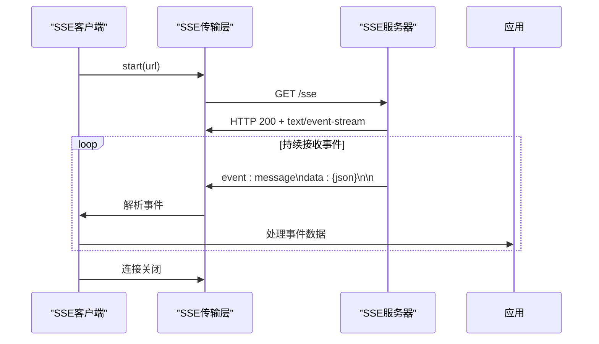
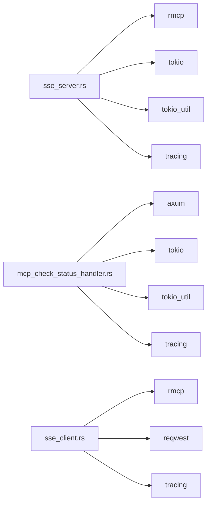

# SSE协议通信

<cite>
**本文档引用的文件**
- [sse_server.rs](file://mcp-proxy/src/server/handlers/sse_server.rs)
- [mcp_check_status_handler.rs](file://mcp-proxy/src/server/handlers/mcp_check_status_handler.rs)
- [sse_client.rs](file://mcp-proxy/src/client/sse_client.rs)
</cite>

## 目录
1. [简介](#简介)
2. [项目结构](#项目结构)
3. [核心组件](#核心组件)
4. [架构概述](#架构概述)
5. [详细组件分析](#详细组件分析)
6. [依赖分析](#依赖分析)
7. [性能考虑](#性能考虑)
8. [故障排除指南](#故障排除指南)
9. [结论](#结论)

## 简介
本文档详细说明了基于SSE（Server-Sent Events）协议的实时通信机制，重点描述了 `sse_server.rs` 如何处理客户端的长连接请求并维护实时数据流，以及 `mcp_check_status_handler.rs` 如何将外部进程的健康状态转换为SSE事件流。文档还涵盖了连接超时处理、重连机制、事件序列化格式、客户端示例及最佳实践。

## 项目结构
MCP代理项目采用模块化设计，主要分为客户端、服务端、模型和测试等模块。SSE相关功能集中在 `mcp-proxy/src/server/handlers` 和 `mcp-proxy/src/client` 目录下。

**Diagram sources**
- [sse_server.rs](file://mcp-proxy/src/server/handlers/sse_server.rs#L1-L20)
- [mcp_check_status_handler.rs](file://mcp-proxy/src/server/handlers/mcp_check_status_handler.rs#L1-L30)

**Section sources**
- [sse_server.rs](file://mcp-proxy/src/server/handlers/sse_server.rs#L1-L95)
- [mcp_check_status_handler.rs](file://mcp-proxy/src/server/handlers/mcp_check_status_handler.rs#L1-L187)

## 核心组件
核心组件包括SSE服务器、状态检查处理器和SSE客户端，它们共同实现了MCP服务的实时状态监控和数据流传输。

**Section sources**
- [sse_server.rs](file://mcp-proxy/src/server/handlers/sse_server.rs#L25-L100)
- [mcp_check_status_handler.rs](file://mcp-proxy/src/server/handlers/mcp_check_status_handler.rs#L15-L80)

## 架构概述
系统采用客户端-服务器架构，通过SSE协议实现服务器向客户端的单向实时数据推送。服务端监听客户端连接，代理外部MCP进程的状态，并通过SSE流将状态更新推送给客户端。

**Diagram sources**
- [sse_server.rs](file://mcp-proxy/src/server/handlers/sse_server.rs#L46-L93)
- [mcp_check_status_handler.rs](file://mcp-proxy/src/server/handlers/mcp_check_status_handler.rs#L50-L100)

## 详细组件分析

### SSE服务器分析
SSE服务器负责处理客户端的长连接请求，代理外部MCP进程的stdio通信，并将其转换为SSE事件流。

**Diagram sources**
- [sse_server.rs](file://mcp-proxy/src/server/handlers/sse_server.rs#L46-L93)

**Section sources**
- [sse_server.rs](file://mcp-proxy/src/server/handlers/sse_server.rs#L1-L95)

### 状态检查处理器分析
状态检查处理器负责将MCP服务的健康状态转换为SSE事件流，支持PENDING、READY和ERROR三种状态。

**Diagram sources**
- [mcp_check_status_handler.rs](file://mcp-proxy/src/server/handlers/mcp_check_status_handler.rs#L10-L50)

**Section sources**
- [mcp_check_status_handler.rs](file://mcp-proxy/src/server/handlers/mcp_check_status_handler.rs#L1-L187)

### 客户端实现分析
SSE客户端实现展示了如何连接到SSE服务器并接收事件流。

**Diagram sources**
- [sse_client.rs](file://mcp-proxy/src/client/sse_client.rs#L37-L72)

**Section sources**
- [sse_client.rs](file://mcp-proxy/src/client/sse_client.rs#L1-L72)

## 依赖分析
系统依赖于多个Rust crate来实现SSE功能和异步处理。

**Diagram sources**
- [sse_server.rs](file://mcp-proxy/src/server/handlers/sse_server.rs#L1-L10)
- [mcp_check_status_handler.rs](file://mcp-proxy/src/server/handlers/mcp_check_status_handler.rs#L1-L10)
- [sse_client.rs](file://mcp-proxy/src/client/sse_client.rs#L1-L10)

**Section sources**
- [sse_server.rs](file://mcp-proxy/src/server/handlers/sse_server.rs#L1-L95)
- [mcp_check_status_handler.rs](file://mcp-proxy/src/server/handlers/mcp_check_status_handler.rs#L1-L187)
- [sse_client.rs](file://mcp-proxy/src/client/sse_client.rs#L1-L72)

## 性能考虑
系统在设计时考虑了连接数限制、内存占用优化和错误处理等性能因素。

### 连接数限制
通过 `CancellationToken` 实现连接的优雅关闭，避免资源泄漏。

### 内存占用优化
使用 `tokio_util::sync::CancellationToken` 和 `Arc` 智能指针减少内存拷贝。

### 错误事件处理
实现完整的错误处理链，包括：
- 子进程启动失败
- SSE连接中断
- 状态检查超时
- 资源清理

**Section sources**
- [sse_server.rs](file://mcp-proxy/src/server/handlers/sse_server.rs#L46-L93)
- [mcp_check_status_handler.rs](file://mcp-proxy/src/server/handlers/mcp_check_status_handler.rs#L100-L150)

## 故障排除指南
### 常见问题
1. **连接超时**：检查 `bind_addr` 配置和网络连接
2. **状态始终PENDING**：确认MCP进程是否正常启动
3. **内存泄漏**：确保 `CancellationToken` 正确取消

### 调试建议
- 启用 `tracing` 日志查看详细执行流程
- 使用 `check_server_available()` 函数验证服务器可达性
- 监控 `ProxyHandlerManager` 中的资源使用情况

**Section sources**
- [sse_server.rs](file://mcp-proxy/src/server/handlers/sse_server.rs#L46-L93)
- [mcp_check_status_handler.rs](file://mcp-proxy/src/server/handlers/mcp_check_status_handler.rs#L150-L187)

## 结论
本文档详细介绍了MCP代理中SSE协议的实现机制，包括服务器端的长连接处理、状态检查、客户端实现和性能优化。通过合理的架构设计和错误处理，系统能够稳定地提供实时状态更新服务。