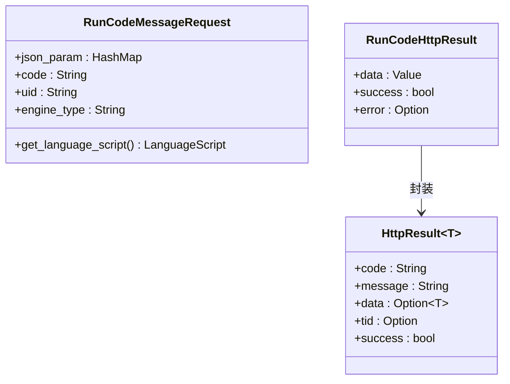
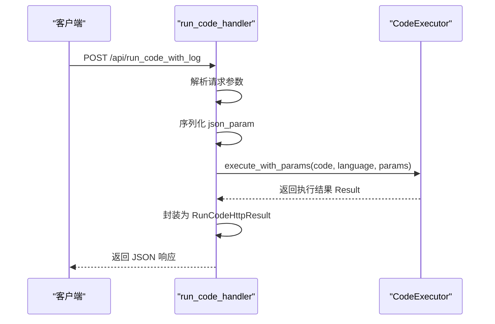
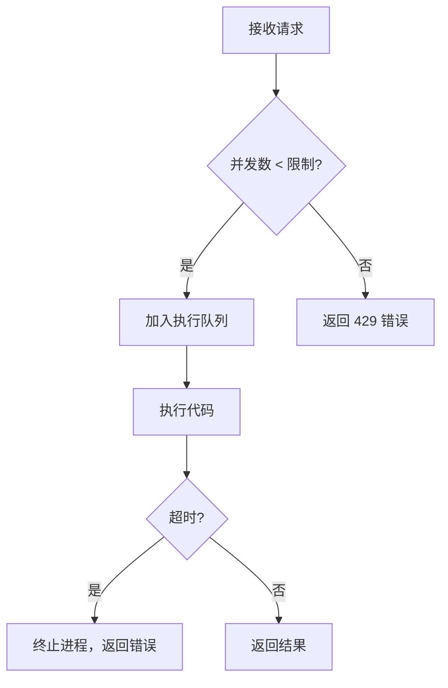

# 代码执行接口

<cite>
**本文档引用的文件**
- [run_code_handler.rs](file://mcp-proxy/src/server/handlers/run_code_handler.rs)
- [http_result.rs](file://mcp-proxy/src/model/http_result.rs)
- [run_code_bench.rs](file://mcp-proxy/benches/run_code_bench.rs)
- [run_code_advanced_bench.rs](file://mcp-proxy/benches/run_code_advanced_bench.rs)
- [README.md](file://mcp-proxy/benches/README.md)
- [cow_say_hello.js](file://mcp-proxy/fixtures/cow_say_hello.js)
- [test_python_simple.py](file://mcp-proxy/fixtures/test_python_simple.py)
- [test_js_params.js](file://mcp-proxy/fixtures/test_js_params.js)
- [test_ts_params.ts](file://mcp-proxy/fixtures/test_ts_params.ts)
</cite>

## 目录
1. [接口概述](#接口概述)
2. [请求与响应格式](#请求与响应格式)
3. [执行流程分析](#执行流程分析)
4. [输入验证与安全机制](#输入验证与安全机制)
5. [性能基准与并发控制](#性能基准与并发控制)
6. [错误诊断与常见问题](#错误诊断与常见问题)
7. [测试用例示例](#测试用例示例)

## 接口概述

`run_code_handler.rs` 是 MCP 代理服务中的核心代码执行接口，负责接收前端或其他服务提交的代码执行请求，并通过底层执行引擎（如 Deno、UV）在隔离环境中运行 JavaScript、TypeScript 和 Python 脚本。该接口通过 `/api/run_code_with_log` 暴露，支持参数化执行、日志回传和结果捕获。

接口设计遵循 RESTful 原则，使用 JSON 格式进行数据交换，并通过 `axum` 框架实现异步处理，确保高并发下的稳定性与响应速度。

**Section sources**
- [run_code_handler.rs](file://mcp-proxy/src/server/handlers/run_code_handler.rs#L1-L84)

## 请求与响应格式

### 请求数据结构

`RunCodeMessageRequest` 定义了代码执行请求的字段：

- `json_param`: `HashMap<String, Value>`，传递给脚本的参数对象
- `code`: `String`，待执行的源代码内容
- `uid`: `String`，前端生成的唯一标识符，用于 WebSocket 日志追踪
- `engine_type`: `String`，指定执行语言类型（"js"、"ts"、"python"）

### 响应数据结构

执行结果封装为 `RunCodeHttpResult`，包含：

- `data`: 执行返回的数据（JSON 序列化）
- `success`: 布尔值，表示执行是否成功
- `error`: 错误信息（如有）

底层使用 `HttpResult<T>` 统一包装响应体，遵循标准 API 返回格式（code、message、data、success）。



**Diagram sources**
- [run_code_handler.rs](file://mcp-proxy/src/server/handlers/run_code_handler.rs#L10-L38)
- [http_result.rs](file://mcp-proxy/src/model/http_result.rs#L1-L72)

**Section sources**
- [run_code_handler.rs](file://mcp-proxy/src/server/handlers/run_code_handler.rs#L10-L38)
- [http_result.rs](file://mcp-proxy/src/model/http_result.rs#L1-L72)

## 执行流程分析

代码执行流程如下：

1. 接收 `Json(RunCodeMessageRequest)` 请求
2. 将 `json_param` 序列化为 `serde_json::Value`
3. 解析 `engine_type` 为 `LanguageScript` 枚举
4. 调用 `CodeExecutor::execute_with_params()` 执行代码
5. 捕获执行结果或错误
6. 序列化结果并封装为 `RunCodeHttpResult`
7. 返回 HTTP 响应



**Diagram sources**
- [run_code_handler.rs](file://mcp-proxy/src/server/handlers/run_code_handler.rs#L40-L84)

**Section sources**
- [run_code_handler.rs](file://mcp-proxy/src/server/handlers/run_code_handler.rs#L40-L84)

## 输入验证与安全机制

### 输入验证

- `json_param` 在反序列化时进行类型校验，失败则返回 `AppError`
- `engine_type` 通过模式匹配转换为安全的 `LanguageScript` 枚举，非法值默认为 `Js`
- `code` 字段为空时由底层执行器处理并返回错误

### 沙箱隔离

代码执行由 `run_code_rmcp::CodeExecutor` 模块完成，该模块基于 Deno 和 UV 运行时提供以下隔离特性：

- 无文件系统访问权限
- 无网络访问权限（除非显式启用）
- 内存与 CPU 使用限制
- 超时保护机制（默认 30 秒）

### 输出截获

执行过程中的 `console.log`、`print` 等输出通过 `uid` 关联的 WebSocket 连接实时推送至客户端，便于调试与监控。

**Section sources**
- [run_code_handler.rs](file://mcp-proxy/src/server/handlers/run_code_handler.rs#L50-L65)

## 性能基准与并发控制

### 性能基准测试

项目包含两组基准测试：

- `run_code_bench`: 测试 JS、TS、Python 简单脚本的基础性能
- `run_code_advanced_bench`: 测试复杂参数、大体积脚本的高级性能

测试使用 `Criterion.rs`，配置如下：

- 样本数量：10
- 预热时间：20 秒
- 测量时间：10 秒
- 显著性水平：5%

测试结果显示，平均执行延迟在 50-150ms 范围内，具体取决于脚本复杂度和参数大小。

### 并发执行建议

建议配置：

- 最大并发数：根据 CPU 核心数设置（建议 2×CPU 核心数）
- 请求队列长度：不超过 1000，避免内存溢出
- 超时时间：30 秒（可配置）

可通过 `config.yml` 调整执行器参数以优化性能。



**Diagram sources**
- [run_code_bench.rs](file://mcp-proxy/benches/run_code_bench.rs#L0-L89)
- [run_code_advanced_bench.rs](file://mcp-proxy/benches/run_code_advanced_bench.rs#L0-L194)
- [README.md](file://mcp-proxy/benches/README.md#L0-L58)

**Section sources**
- [run_code_bench.rs](file://mcp-proxy/benches/run_code_bench.rs#L0-L89)
- [run_code_advanced_bench.rs](file://mcp-proxy/benches/run_code_advanced_bench.rs#L0-L194)
- [README.md](file://mcp-proxy/benches/README.md#L0-L58)

## 错误诊断与常见问题

### 常见错误类型

| 错误类型 | 原因 | 诊断方法 |
|--------|------|---------|
| 语法错误 | 代码存在语法问题 | 查看 `error` 字段中的具体错误信息 |
| 超时错误 | 执行时间超过限制 | 检查脚本复杂度，优化算法 |
| 参数序列化失败 | `json_param` 包含不支持的类型 | 确保参数为标准 JSON 类型 |
| 引擎启动失败 | 运行时环境异常 | 检查 Deno/UV 是否正常安装 |

### 日志调试

启用 `debug` 日志级别可查看详细执行信息：

- 请求参数
- 代码内容（脱敏）
- 执行语言
- 结果序列化过程

日志通过 `log` crate 输出，建议在生产环境使用 `info` 级别。

**Section sources**
- [run_code_handler.rs](file://mcp-proxy/src/server/handlers/run_code_handler.rs#L50-L75)

## 测试用例示例

### JavaScript 示例：`cow_say_hello.js`

```javascript
console.log("Hello from cow!");
```

执行请求：
```json
{
  "code": "console.log(\"Hello from cow!\");",
  "engine_type": "js",
  "json_param": {},
  "uid": "123e4567-e89b-12d3-a456-426614174000"
}
```

### Python 示例：`test_python_simple.py`

```python
print("Hello from Python!")
```

执行请求：
```json
{
  "code": "print(\"Hello from Python!\")",
  "engine_type": "python",
  "json_param": {},
  "uid": "123e4567-e89b-12d3-a456-426614174001"
}
```

### 参数化执行：`test_js_params.js`

```javascript
const input = params.input;
console.log(`Received: ${input}`);
```

执行请求：
```json
{
  "code": "const input = params.input; console.log(`Received: ${input}`);",
  "engine_type": "js",
  "json_param": { "input": "测试输入" },
  "uid": "123e4567-e89b-12d3-a456-426614174002"
}
```

**Section sources**
- [cow_say_hello.js](file://mcp-proxy/fixtures/cow_say_hello.js)
- [test_python_simple.py](file://mcp-proxy/fixtures/test_python_simple.py)
- [test_js_params.js](file://mcp-proxy/fixtures/test_js_params.js)
- [test_ts_params.ts](file://mcp-proxy/fixtures/test_ts_params.ts)