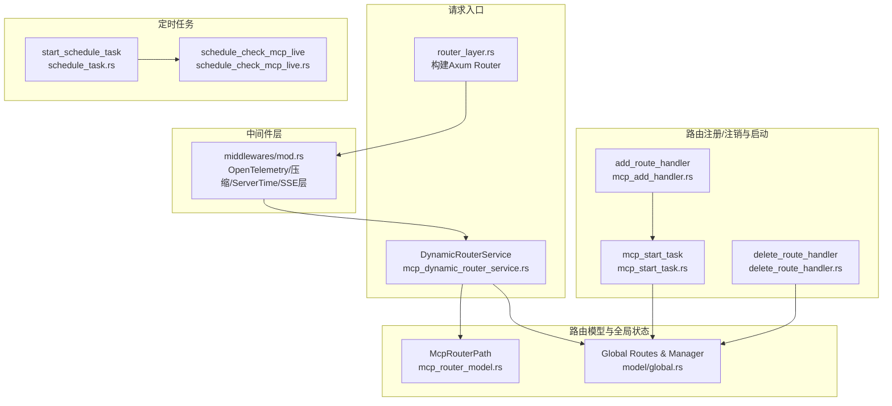
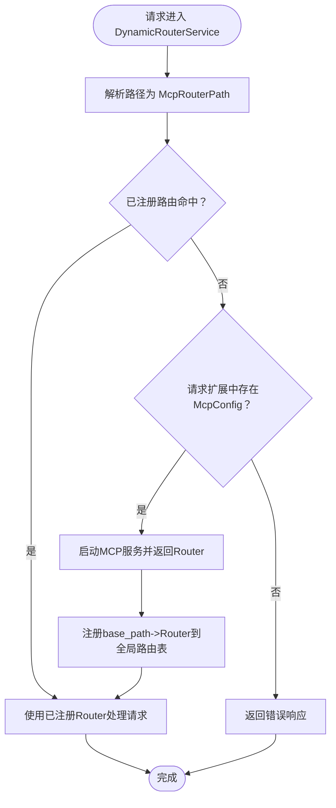
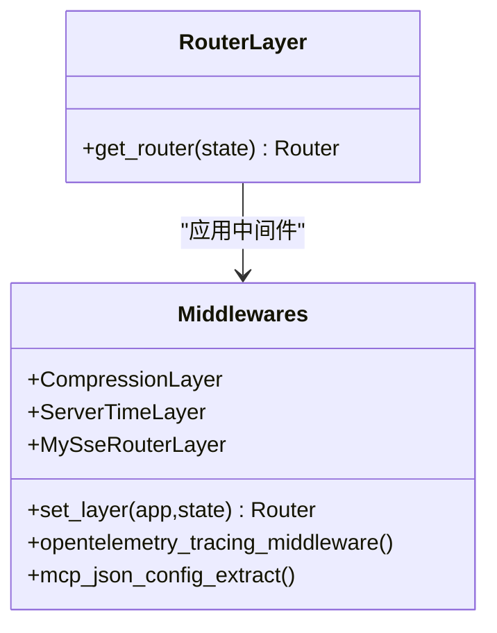
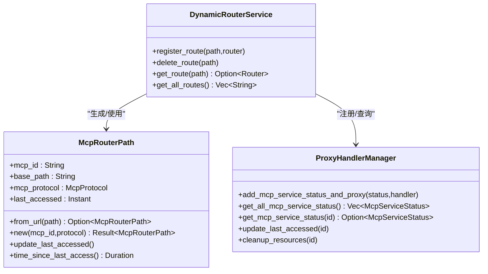
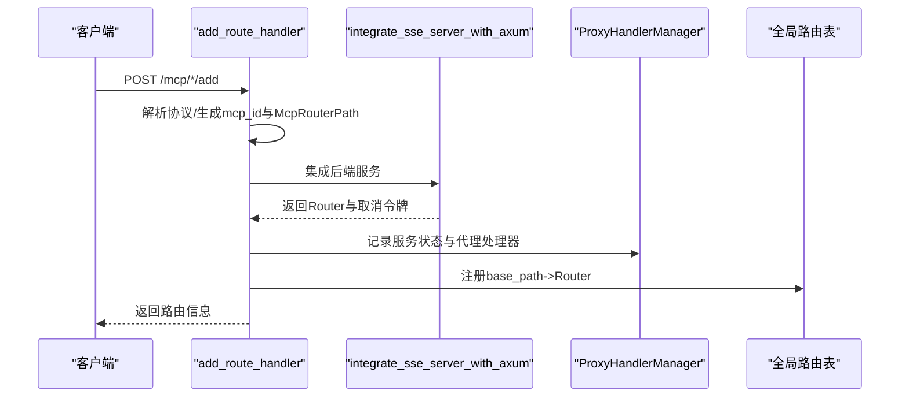
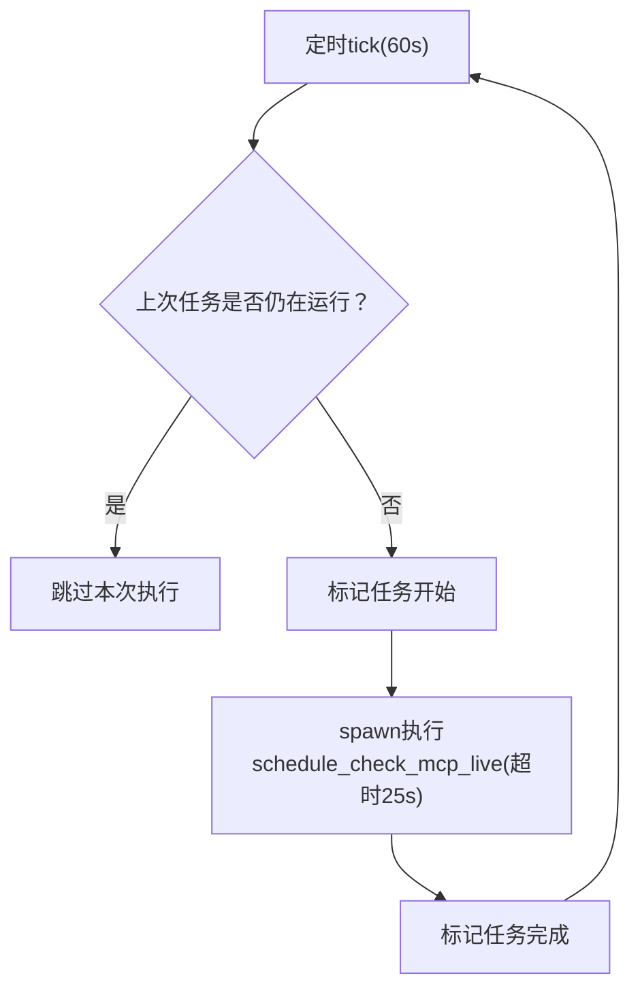
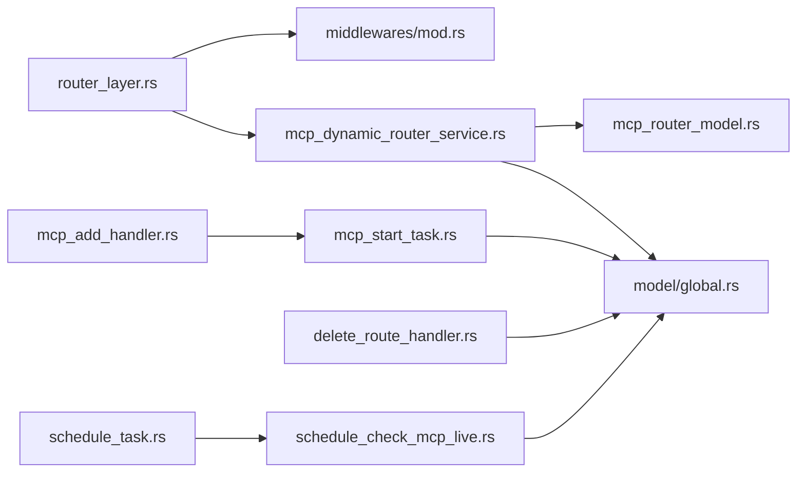

# 动态路由与调度

<cite>
**本文引用的文件**
- [mcp_dynamic_router_service.rs](file://mcp-proxy/src/server/mcp_dynamic_router_service.rs)
- [router_layer.rs](file://mcp-proxy/src/server/router_layer.rs)
- [schedule_check_mcp_live.rs](file://mcp-proxy/src/server/task/schedule_check_mcp_live.rs)
- [schedule_task.rs](file://mcp-proxy/src/server/task/schedule_task.rs)
- [mcp_router_model.rs](file://mcp-proxy/src/model/mcp_router_model.rs)
- [global.rs](file://mcp-proxy/src/model/global.rs)
- [mcp_add_handler.rs](file://mcp-proxy/src/server/handlers/mcp_add_handler.rs)
- [delete_route_handler.rs](file://mcp-proxy/src/server/handlers/delete_route_handler.rs)
- [mcp_start_task.rs](file://mcp-proxy/src/server/task/mcp_start_task.rs)
- [proxy_handler.rs](file://mcp-proxy/src/proxy/proxy_handler.rs)
- [app_state_model.rs](file://mcp-proxy/src/model/app_state_model.rs)
- [mod.rs](file://mcp-proxy/src/server/mod.rs)
</cite>

## 目录
1. [引言](#引言)
2. [项目结构](#项目结构)
3. [核心组件](#核心组件)
4. [架构总览](#架构总览)
5. [详细组件分析](#详细组件分析)
6. [依赖关系分析](#依赖关系分析)
7. [性能考量](#性能考量)
8. [故障排查指南](#故障排查指南)
9. [结论](#结论)
10. [附录](#附录)

## 引言
本文件系统性介绍MCP代理的动态路由架构与定时任务调度系统，重点覆盖以下内容：
- 动态路由注册与注销流程，包括路由匹配算法、优先级与冲突处理
- router_layer在请求处理链中的角色及与中间件的协作
- 定时任务调度器设计，包括服务存活检查的执行频率、任务队列管理与异常恢复策略
- 实际场景下的优势与配置注意事项

## 项目结构
围绕动态路由与调度的关键模块分布如下：
- 路由与请求入口
  - 动态路由服务：mcp_dynamic_router_service.rs
  - 路由层装配：router_layer.rs
  - 中间件层：server/middlewares/mod.rs 及其子模块
- 路由模型与全局状态
  - 路由路径模型：mcp_router_model.rs
  - 全局路由表与代理管理器：model/global.rs
- 路由注册/注销与启动
  - 注册路由处理器：server/handlers/mcp_add_handler.rs
  - 注销路由处理器：server/handlers/delete_route_handler.rs
  - 启动MCP服务：server/task/mcp_start_task.rs
- 定时任务
  - 定时任务启动：server/task/schedule_task.rs
  - 存活检查：server/task/schedule_check_mcp_live.rs
- 应用状态
  - 应用状态模型：model/app_state_model.rs
- 服务导出
  - server/mod.rs 导出路由、中间件、任务等



图表来源
- [router_layer.rs](file://mcp-proxy/src/server/router_layer.rs#L24-L82)
- [mcp_dynamic_router_service.rs](file://mcp-proxy/src/server/mcp_dynamic_router_service.rs#L21-L151)
- [mcp_router_model.rs](file://mcp-proxy/src/model/mcp_router_model.rs#L341-L597)
- [global.rs](file://mcp-proxy/src/model/global.rs#L15-L72)
- [mcp_add_handler.rs](file://mcp-proxy/src/server/handlers/mcp_add_handler.rs#L15-L91)
- [mcp_start_task.rs](file://mcp-proxy/src/server/task/mcp_start_task.rs#L52-L120)
- [delete_route_handler.rs](file://mcp-proxy/src/server/handlers/delete_route_handler.rs#L1-L25)
- [schedule_task.rs](file://mcp-proxy/src/server/task/schedule_task.rs#L1-L63)
- [schedule_check_mcp_live.rs](file://mcp-proxy/src/server/task/schedule_check_mcp_live.rs#L1-L96)

章节来源
- [router_layer.rs](file://mcp-proxy/src/server/router_layer.rs#L24-L82)
- [mcp_dynamic_router_service.rs](file://mcp-proxy/src/server/mcp_dynamic_router_service.rs#L21-L151)
- [mcp_router_model.rs](file://mcp-proxy/src/model/mcp_router_model.rs#L341-L597)
- [global.rs](file://mcp-proxy/src/model/global.rs#L15-L72)
- [mcp_add_handler.rs](file://mcp-proxy/src/server/handlers/mcp_add_handler.rs#L15-L91)
- [mcp_start_task.rs](file://mcp-proxy/src/server/task/mcp_start_task.rs#L52-L120)
- [delete_route_handler.rs](file://mcp-proxy/src/server/handlers/delete_route_handler.rs#L1-L25)
- [schedule_task.rs](file://mcp-proxy/src/server/task/schedule_task.rs#L1-L63)
- [schedule_check_mcp_live.rs](file://mcp-proxy/src/server/task/schedule_check_mcp_live.rs#L1-L96)

## 核心组件
- 动态路由服务 DynamicRouterService
  - 实现tower Service，拦截HTTP请求，解析路径，查找已注册路由，若未命中则尝试按请求扩展中的MCP配置启动服务并转发
- 路由层 router_layer
  - 构建Axum Router，注册健康检查、MCP路由、SSE/Stream协议代理端点、CORS与默认Body限制等
- 路由模型 McpRouterPath
  - 解析请求路径，识别SSE/Stream协议，生成base_path与协议路径结构，支持从URL提取mcp_id
- 全局路由表与代理管理器
  - 全局DashMap存储Router；ProxyHandlerManager维护服务状态、取消令牌与代理处理器
- 路由注册/注销处理器
  - add_route_handler：解析请求路径协议，生成mcp_id与路由路径，集成后端服务并返回路由信息
  - delete_route_handler：删除路由并清理资源
- 定时任务
  - start_schedule_task：周期性触发schedule_check_mcp_live，带超时与并发保护
  - schedule_check_mcp_live：按MCP类型（持久/一次性）检查状态、清理资源、超时回收

章节来源
- [mcp_dynamic_router_service.rs](file://mcp-proxy/src/server/mcp_dynamic_router_service.rs#L21-L151)
- [router_layer.rs](file://mcp-proxy/src/server/router_layer.rs#L24-L82)
- [mcp_router_model.rs](file://mcp-proxy/src/model/mcp_router_model.rs#L341-L597)
- [global.rs](file://mcp-proxy/src/model/global.rs#L15-L72)
- [mcp_add_handler.rs](file://mcp-proxy/src/server/handlers/mcp_add_handler.rs#L15-L91)
- [delete_route_handler.rs](file://mcp-proxy/src/server/handlers/delete_route_handler.rs#L1-L25)
- [schedule_task.rs](file://mcp-proxy/src/server/task/schedule_task.rs#L1-L63)
- [schedule_check_mcp_live.rs](file://mcp-proxy/src/server/task/schedule_check_mcp_live.rs#L1-L96)

## 架构总览
动态路由与调度的整体交互如下：
- 请求进入Axum Router，router_layer设置中间件层（追踪、压缩、ServerTime、SSE路由层）
- DynamicRouterService解析请求路径，定位base_path
- 若已注册路由存在，直接调用该Router处理；否则尝试从请求扩展中读取MCP配置并启动服务，再转发
- 启动成功后，将Router注册到全局路由表，后续同base_path请求可直接命中
- 定时任务周期扫描服务状态，清理异常/超时/已完成的一次性服务

```mermaid
sequenceDiagram
participant C as "客户端"
participant R as "Axum Router<br/>router_layer.rs"
participant L as "中间件层<br/>middlewares/mod.rs"
participant D as "DynamicRouterService<br/>mcp_dynamic_router_service.rs"
participant G as "全局路由表<br/>model/global.rs"
participant A as "注册处理器<br/>mcp_add_handler.rs"
participant S as "启动任务<br/>mcp_start_task.rs"
participant T as "定时任务<br/>schedule_task.rs"
C->>R : 发起HTTP请求
R->>L : 应用中间件
L->>D : 进入DynamicRouterService
D->>D : 解析路径并提取mcp_id/base_path
alt 已注册路由命中
D->>G : 查询base_path
G-->>D : 返回Router
D->>D : 转发至Router处理
else 未命中
D->>D : 从请求扩展读取MCP配置
opt 存在配置
D->>S : 启动MCP服务并返回Router
S-->>D : 返回Router
D->>G : 注册base_path->Router
D->>D : 转发至Router处理
else 无配置
D-->>C : 返回错误响应
end
end
T->>T : 定时触发schedule_check_mcp_live
T->>G : 扫描服务状态并清理资源
```

图表来源
- [router_layer.rs](file://mcp-proxy/src/server/router_layer.rs#L24-L82)
- [mcp_dynamic_router_service.rs](file://mcp-proxy/src/server/mcp_dynamic_router_service.rs#L21-L151)
- [global.rs](file://mcp-proxy/src/model/global.rs#L15-L72)
- [mcp_add_handler.rs](file://mcp-proxy/src/server/handlers/mcp_add_handler.rs#L15-L91)
- [mcp_start_task.rs](file://mcp-proxy/src/server/task/mcp_start_task.rs#L52-L120)
- [schedule_task.rs](file://mcp-proxy/src/server/task/schedule_task.rs#L1-L63)

## 详细组件分析

### 动态路由服务 DynamicRouterService
- 路径解析与匹配
  - 通过McpRouterPath::from_url解析请求路径，识别SSE/Stream协议与mcp_id/base_path
  - 优先从全局路由表按base_path查找Router；若未命中，尝试从请求扩展读取McpConfig并启动服务
- 运行时注册与注销
  - 启动成功后，通过DynamicRouterService.register_route将Router注册到全局路由表
  - 注销通过delete_route_handler调用ProxyHandlerManager.cleanup_resources清理资源并移除路由
- 错误处理与可观测性
  - 记录trace_id与关键请求头，记录错误码与消息，便于追踪



图表来源
- [mcp_dynamic_router_service.rs](file://mcp-proxy/src/server/mcp_dynamic_router_service.rs#L21-L151)
- [global.rs](file://mcp-proxy/src/model/global.rs#L15-L72)

章节来源
- [mcp_dynamic_router_service.rs](file://mcp-proxy/src/server/mcp_dynamic_router_service.rs#L21-L151)
- [global.rs](file://mcp-proxy/src/model/global.rs#L15-L72)

### 路由层 router_layer 与中间件
- 路由层
  - 注册健康检查、MCP路由（SSE/Stream）、状态检查端点、代码执行端点
  - 绑定DynamicRouterService到特定前缀路径，实现透明代理
  - 设置CORS与默认Body限制
- 中间件
  - OpenTelemetry追踪中间件：自动生成trace_id与span
  - MCP配置提取中间件：从请求扩展提取McpConfig
  - 压缩中间件：gzip/br/deflate
  - ServerTime响应头中间件
  - SSE路由层：MySseRouterLayer



图表来源
- [router_layer.rs](file://mcp-proxy/src/server/router_layer.rs#L24-L82)
- [middlewares/mod.rs](file://mcp-proxy/src/server/middlewares/mod.rs#L26-L44)

章节来源
- [router_layer.rs](file://mcp-proxy/src/server/router_layer.rs#L24-L82)
- [middlewares/mod.rs](file://mcp-proxy/src/server/middlewares/mod.rs#L26-L44)

### 路由模型与全局状态
- McpRouterPath
  - 从URL解析mcp_id与base_path，支持SSE/Stream两种协议路径
  - 提供路径校验与最后访问时间更新
- 全局路由表与代理管理器
  - 全局DashMap存储base_path->Router映射
  - ProxyHandlerManager维护服务状态、取消令牌、代理处理器与最后访问时间



图表来源
- [mcp_router_model.rs](file://mcp-proxy/src/model/mcp_router_model.rs#L341-L597)
- [global.rs](file://mcp-proxy/src/model/global.rs#L15-L72)
- [global.rs](file://mcp-proxy/src/model/global.rs#L74-L173)

章节来源
- [mcp_router_model.rs](file://mcp-proxy/src/model/mcp_router_model.rs#L341-L597)
- [global.rs](file://mcp-proxy/src/model/global.rs#L15-L72)
- [global.rs](file://mcp-proxy/src/model/global.rs#L74-L173)

### 路由注册与注销流程
- 注册
  - add_route_handler解析请求路径协议，生成mcp_id与McpRouterPath
  - 调用integrate_sse_server_with_axum集成后端服务，返回Router与取消令牌
  - 启动成功后，将Router注册到全局路由表
- 注销
  - delete_route_handler调用ProxyHandlerManager.cleanup_resources清理资源并移除路由



图表来源
- [mcp_add_handler.rs](file://mcp-proxy/src/server/handlers/mcp_add_handler.rs#L15-L91)
- [mcp_start_task.rs](file://mcp-proxy/src/server/task/mcp_start_task.rs#L52-L120)
- [global.rs](file://mcp-proxy/src/model/global.rs#L15-L72)

章节来源
- [mcp_add_handler.rs](file://mcp-proxy/src/server/handlers/mcp_add_handler.rs#L15-L91)
- [mcp_start_task.rs](file://mcp-proxy/src/server/task/mcp_start_task.rs#L52-L120)
- [global.rs](file://mcp-proxy/src/model/global.rs#L15-L72)

### 定时任务调度器
- 执行频率
  - start_schedule_task以固定周期（示例为60秒）触发schedule_check_mcp_live
- 并发与超时
  - 使用原子布尔值is_running避免任务重叠执行
  - 使用timeout在25秒内限制单次检查任务，确保周期不被阻塞
- 任务队列管理
  - 采用tokio::spawn在独立任务中执行检查，捕获异常并记录
- 异常恢复策略
  - 对ERROR状态、取消、子进程终止、超时未访问等情况分别清理资源
  - 对持久化服务检查取消与子进程终止；对一次性服务检查完成与超时未访问



图表来源
- [schedule_task.rs](file://mcp-proxy/src/server/task/schedule_task.rs#L1-L63)
- [schedule_check_mcp_live.rs](file://mcp-proxy/src/server/task/schedule_check_mcp_live.rs#L1-L96)

章节来源
- [schedule_task.rs](file://mcp-proxy/src/server/task/schedule_task.rs#L1-L63)
- [schedule_check_mcp_live.rs](file://mcp-proxy/src/server/task/schedule_check_mcp_live.rs#L1-L96)

### 请求处理链与中间件协同
- 请求进入顺序
  - router_layer构建Router并合并健康检查与API路由
  - set_layer应用中间件：OpenTelemetry追踪、MCP配置提取、压缩、ServerTime、SSE路由层
  - DynamicRouterService在路由层中作为route_service绑定到特定前缀
- 中间件职责
  - OpenTelemetry：生成trace_id与span，贯穿请求生命周期
  - MCP配置提取：从请求扩展中提取McpConfig，供DynamicRouterService启动服务使用
  - 压缩与ServerTime：优化传输与响应头
  - SSE路由层：增强SSE路径处理能力

章节来源
- [router_layer.rs](file://mcp-proxy/src/server/router_layer.rs#L24-L82)
- [middlewares/mod.rs](file://mcp-proxy/src/server/middlewares/mod.rs#L26-L44)
- [mcp_dynamic_router_service.rs](file://mcp-proxy/src/server/mcp_dynamic_router_service.rs#L21-L151)

## 依赖关系分析
- 组件耦合
  - DynamicRouterService依赖McpRouterPath与全局路由表
  - 路由层依赖中间件与DynamicRouterService
  - 注册/注销处理器依赖ProxyHandlerManager与mcp_start_task
  - 定时任务依赖ProxyHandlerManager与清理逻辑
- 外部依赖
  - Axum Router、tower、dashmap、tokio、log/tracing等



图表来源
- [router_layer.rs](file://mcp-proxy/src/server/router_layer.rs#L24-L82)
- [mcp_dynamic_router_service.rs](file://mcp-proxy/src/server/mcp_dynamic_router_service.rs#L21-L151)
- [mcp_router_model.rs](file://mcp-proxy/src/model/mcp_router_model.rs#L341-L597)
- [global.rs](file://mcp-proxy/src/model/global.rs#L15-L72)
- [mcp_add_handler.rs](file://mcp-proxy/src/server/handlers/mcp_add_handler.rs#L15-L91)
- [mcp_start_task.rs](file://mcp-proxy/src/server/task/mcp_start_task.rs#L52-L120)
- [delete_route_handler.rs](file://mcp-proxy/src/server/handlers/delete_route_handler.rs#L1-L25)
- [schedule_task.rs](file://mcp-proxy/src/server/task/schedule_task.rs#L1-L63)
- [schedule_check_mcp_live.rs](file://mcp-proxy/src/server/task/schedule_check_mcp_live.rs#L1-L96)

章节来源
- [mod.rs](file://mcp-proxy/src/server/mod.rs#L1-L18)

## 性能考量
- 路由查找复杂度
  - 全局路由表基于DashMap，查询为O(1)平均复杂度，适合高并发请求
- 路径解析
  - McpRouterPath::from_url按前缀与路径段解析，开销低
- 中间件链路
  - 中间件按序执行，建议避免在中间件中做重IO；压缩与追踪为轻量操作
- 定时任务
  - 60秒周期+25秒超时，避免长时间阻塞；使用原子布尔值防止重叠执行
- 资源清理
  - 对ERROR、取消、终止、超时未访问的服务统一清理，降低内存与连接泄漏风险

## 故障排查指南
- 路由未命中
  - 检查请求路径是否符合SSE/Stream前缀与格式
  - 确认请求扩展中是否存在McpConfig
  - 查看全局路由表是否已注册base_path
- 启动失败
  - 检查mcp_start_task返回的错误信息
  - 确认后端服务可达与认证配置正确
- 定时清理未生效
  - 检查定时任务是否正常运行与超时设置
  - 查看服务状态是否为ERROR/Canceled/Terminated
- 资源泄漏
  - 确认delete_route_handler已调用并清理资源
  - 检查持久化服务是否被取消或子进程终止

章节来源
- [mcp_dynamic_router_service.rs](file://mcp-proxy/src/server/mcp_dynamic_router_service.rs#L21-L151)
- [mcp_add_handler.rs](file://mcp-proxy/src/server/handlers/mcp_add_handler.rs#L15-L91)
- [delete_route_handler.rs](file://mcp-proxy/src/server/handlers/delete_route_handler.rs#L1-L25)
- [schedule_task.rs](file://mcp-proxy/src/server/task/schedule_task.rs#L1-L63)
- [schedule_check_mcp_live.rs](file://mcp-proxy/src/server/task/schedule_check_mcp_live.rs#L1-L96)

## 结论
本系统通过DynamicRouterService实现运行时路由注册与注销，结合McpRouterPath的路径解析与全局路由表，实现了灵活高效的动态路由架构。router_layer与中间件协同，确保请求在进入动态路由前完成必要的上下文注入与处理。定时任务调度器通过周期性检查与超时控制，保障服务生命周期管理与资源回收。整体设计在微服务环境下具备良好的扩展性与稳定性。

## 附录
- 实际场景优势
  - 动态路由：按需启动后端服务，减少常驻资源占用
  - 协议透明：SSE/Stream协议统一接入，简化客户端适配
  - 生命周期管理：定时清理异常/超时服务，降低运维成本
- 配置注意事项
  - 路由前缀与路径格式需严格遵循SSE/Stream规范
  - 请求扩展中的McpConfig需包含有效后端配置
  - 定时任务周期与超时需结合业务负载合理设置
  - 中间件链路尽量保持轻量，避免影响请求延迟