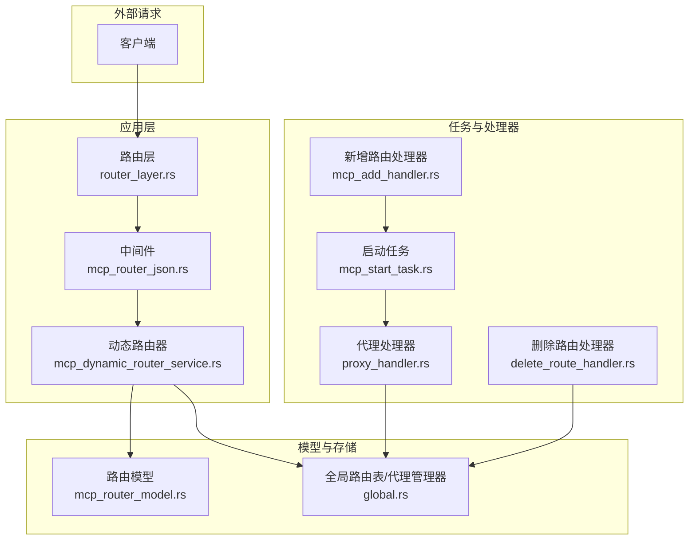
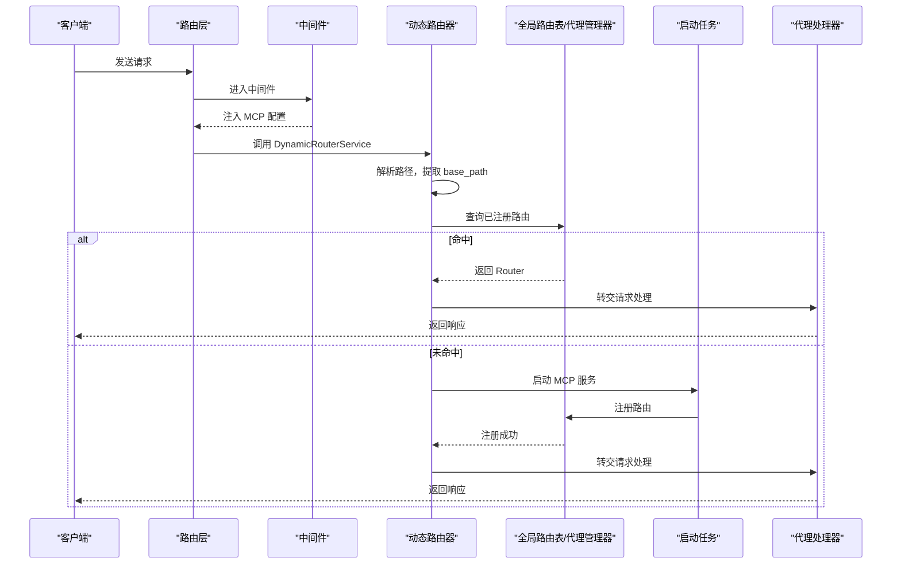
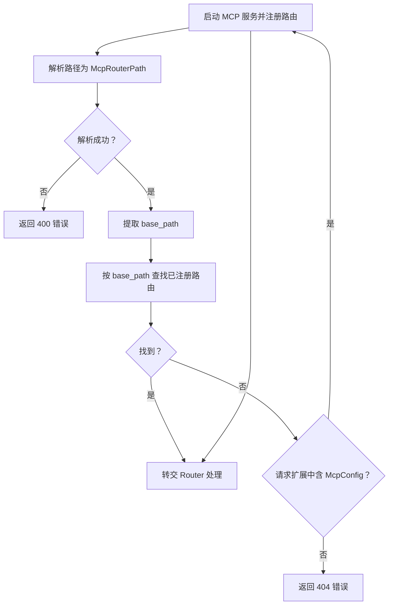
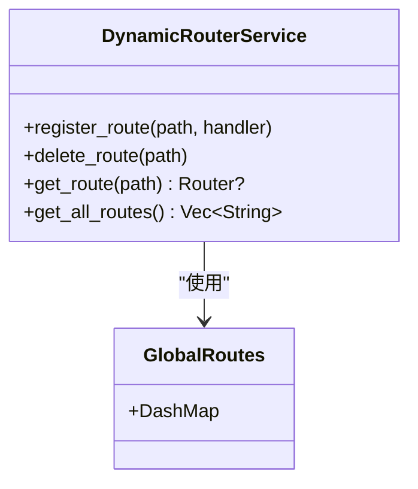
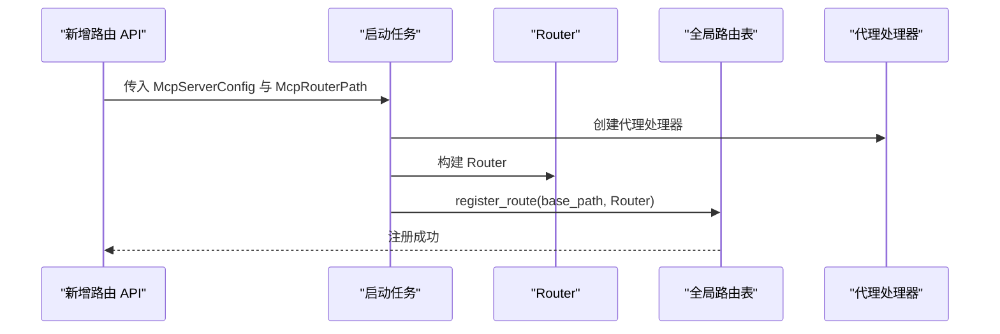
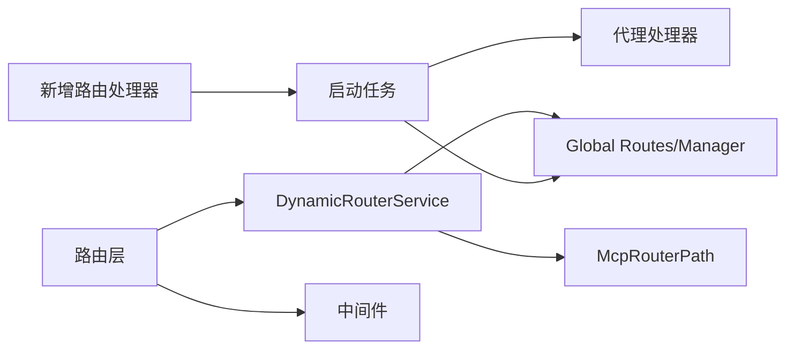

# 动态路由服务

<cite>
**本文引用的文件**
- [mcp_dynamic_router_service.rs](file://mcp-proxy/src/server/mcp_dynamic_router_service.rs)
- [router_layer.rs](file://mcp-proxy/src/server/router_layer.rs)
- [mcp_router_model.rs](file://mcp-proxy/src/model/mcp_router_model.rs)
- [global.rs](file://mcp-proxy/src/model/global.rs)
- [mcp_router_json.rs](file://mcp-proxy/src/server/middlewares/mcp_router_json.rs)
- [mcp_add_handler.rs](file://mcp-proxy/src/server/handlers/mcp_add_handler.rs)
- [delete_route_handler.rs](file://mcp-proxy/src/server/handlers/delete_route_handler.rs)
- [mcp_start_task.rs](file://mcp-proxy/src/server/task/mcp_start_task.rs)
- [proxy_handler.rs](file://mcp-proxy/src/proxy/proxy_handler.rs)
- [app_state_model.rs](file://mcp-proxy/src/model/app_state_model.rs)
- [lib.rs](file://mcp-proxy/src/lib.rs)
</cite>

## 目录
1. [简介](#简介)
2. [项目结构](#项目结构)
3. [核心组件](#核心组件)
4. [架构总览](#架构总览)
5. [详细组件分析](#详细组件分析)
6. [依赖关系分析](#依赖关系分析)
7. [性能考量](#性能考量)
8. [故障排查指南](#故障排查指南)
9. [结论](#结论)
10. [附录](#附录)

## 简介
本文件深入解析 mcp_dynamic_router_service 模块的实现机制，重点覆盖以下方面：
- 运行时动态注册、更新与注销 MCP 服务路由
- 路由表数据结构设计与并发访问控制
- 路由匹配算法（前缀匹配、精确匹配）与优先级排序
- 服务注册时的健康状态校验流程与服务发现集成
- 新增路由、删除路由、查询路由的 API 调用方式
- 高并发场景下路由变更的一致性保障策略
- 路由冲突（路径重复）的检测与解决机制
- 实际配置示例与常见使用模式

## 项目结构
mcp-proxy 的动态路由能力主要由以下模块协同实现：
- 路由层与入口：router_layer.rs 定义对外路由与中间件
- 动态路由器：mcp_dynamic_router_service.rs 实现运行时请求分发
- 路由模型与路径解析：mcp_router_model.rs 定义路由路径结构与解析规则
- 全局路由表与代理管理：global.rs 提供全局路由表与代理管理器
- 中间件：mcp_router_json.rs 从请求头提取 MCP 配置
- 任务与启动：mcp_start_task.rs 启动 MCP 并注册路由
- 处理器：mcp_add_handler.rs、delete_route_handler.rs 提供新增与删除路由的 API
- 代理处理器：proxy_handler.rs 提供协议转换与健康检查

图表来源
- [router_layer.rs](file://mcp-proxy/src/server/router_layer.rs#L24-L82)
- [mcp_router_json.rs](file://mcp-proxy/src/server/middlewares/mcp_router_json.rs#L1-L57)
- [mcp_dynamic_router_service.rs](file://mcp-proxy/src/server/mcp_dynamic_router_service.rs#L21-L152)
- [mcp_router_model.rs](file://mcp-proxy/src/model/mcp_router_model.rs#L341-L597)
- [global.rs](file://mcp-proxy/src/model/global.rs#L16-L72)
- [mcp_add_handler.rs](file://mcp-proxy/src/server/handlers/mcp_add_handler.rs#L1-L91)
- [mcp_start_task.rs](file://mcp-proxy/src/server/task/mcp_start_task.rs#L52-L403)
- [proxy_handler.rs](file://mcp-proxy/src/proxy/proxy_handler.rs#L1-L120)

章节来源
- [router_layer.rs](file://mcp-proxy/src/server/router_layer.rs#L24-L82)
- [mcp_dynamic_router_service.rs](file://mcp-proxy/src/server/mcp_dynamic_router_service.rs#L21-L152)
- [mcp_router_model.rs](file://mcp-proxy/src/model/mcp_router_model.rs#L341-L597)
- [global.rs](file://mcp-proxy/src/model/global.rs#L16-L72)
- [mcp_router_json.rs](file://mcp-proxy/src/server/middlewares/mcp_router_json.rs#L1-L57)
- [mcp_add_handler.rs](file://mcp-proxy/src/server/handlers/mcp_add_handler.rs#L1-L91)
- [mcp_start_task.rs](file://mcp-proxy/src/server/task/mcp_start_task.rs#L52-L403)
- [proxy_handler.rs](file://mcp-proxy/src/proxy/proxy_handler.rs#L1-L120)

## 核心组件
- 动态路由器 DynamicRouterService：实现对 /mcp/sse/proxy 与 /mcp/stream/proxy 的请求分发，按 base_path 查找已注册路由；未命中时尝试从请求头提取 MCP 配置并启动服务。
- 路由模型 McpRouterPath：解析请求路径，提取 mcp_id 与 base_path，区分 SSE 与 Stream 协议，生成路由路径结构。
- 全局路由表与代理管理器：使用 DashMap 与 Arc 包装的全局路由表，提供注册、删除、查询路由的能力；同时维护代理处理器与服务状态。
- 中间件 mcp_router_json：从请求头 x-mcp-json（Base64）与 x-mcp-type 解析 MCP 配置，注入到请求扩展中。
- 启动任务 integrate_sse_server_with_axum：根据配置选择命令行或 URL 启动 MCP，创建 SSE/Stream 服务，注册路由并返回 Router。
- 新增/删除路由处理器：新增路由生成 mcp_id 与路由路径，启动服务并返回前端可用的路径；删除路由清理资源并返回确认信息。

章节来源
- [mcp_dynamic_router_service.rs](file://mcp-proxy/src/server/mcp_dynamic_router_service.rs#L21-L152)
- [mcp_router_model.rs](file://mcp-proxy/src/model/mcp_router_model.rs#L341-L597)
- [global.rs](file://mcp-proxy/src/model/global.rs#L16-L72)
- [mcp_router_json.rs](file://mcp-proxy/src/server/middlewares/mcp_router_json.rs#L1-L57)
- [mcp_start_task.rs](file://mcp-proxy/src/server/task/mcp_start_task.rs#L52-L403)
- [mcp_add_handler.rs](file://mcp-proxy/src/server/handlers/mcp_add_handler.rs#L1-L91)
- [delete_route_handler.rs](file://mcp-proxy/src/server/handlers/delete_route_handler.rs#L1-L25)

## 架构总览
动态路由服务的整体工作流如下：
- 客户端请求进入路由层，匹配 /mcp/sse/proxy 与 /mcp/stream/proxy
- 中间件从请求头提取 MCP 配置并注入
- 动态路由器解析请求路径，提取 base_path
- 若已注册路由命中，直接交由对应 Router 处理
- 若未命中，尝试启动 MCP 服务并注册路由后处理请求
- 新增路由 API 用于运行时注册，删除路由 API 用于注销与资源清理

图表来源
- [router_layer.rs](file://mcp-proxy/src/server/router_layer.rs#L42-L73)
- [mcp_router_json.rs](file://mcp-proxy/src/server/middlewares/mcp_router_json.rs#L1-L57)
- [mcp_dynamic_router_service.rs](file://mcp-proxy/src/server/mcp_dynamic_router_service.rs#L21-L152)
- [global.rs](file://mcp-proxy/src/model/global.rs#L16-L72)
- [mcp_start_task.rs](file://mcp-proxy/src/server/task/mcp_start_task.rs#L52-L403)
- [proxy_handler.rs](file://mcp-proxy/src/proxy/proxy_handler.rs#L1-L120)

## 详细组件分析

### 动态路由器 DynamicRouterService
- 职责
  - 解析请求路径，提取 mcp_id 与 base_path
  - 从全局路由表按 base_path 查找已注册 Router
  - 未命中时从请求扩展中读取 McpConfig，启动 MCP 服务并注册路由后处理请求
- 关键行为
  - 路径解析：使用 McpRouterPath::from_url
  - 路由查找：DynamicRouterService::get_route
  - 启动服务：start_mcp_and_handle_request -> mcp_start_task
- 日志与可观测性：使用 tracing::debug_span 记录关键事件与错误码

图表来源
- [mcp_dynamic_router_service.rs](file://mcp-proxy/src/server/mcp_dynamic_router_service.rs#L21-L152)
- [mcp_router_model.rs](file://mcp-proxy/src/model/mcp_router_model.rs#L341-L597)
- [mcp_router_json.rs](file://mcp-proxy/src/server/middlewares/mcp_router_json.rs#L1-L57)
- [mcp_start_task.rs](file://mcp-proxy/src/server/task/mcp_start_task.rs#L52-L403)

章节来源
- [mcp_dynamic_router_service.rs](file://mcp-proxy/src/server/mcp_dynamic_router_service.rs#L21-L152)

### 路由表与并发控制
- 全局路由表
  - 使用 DashMap + Arc 包装，提供线程安全的并发读写
  - 提供 register_route、delete_route、get_route、get_all_routes 等方法
- 并发访问控制
  - DashMap 保证并发安全
  - 读多写少场景下，get_route 采用只读快照式访问
- 线程安全建议
  - 保持 Router 对象不可变，注册后避免修改
  - 删除路由时确保无活跃请求在使用该 Router

图表来源
- [global.rs](file://mcp-proxy/src/model/global.rs#L16-L72)

章节来源
- [global.rs](file://mcp-proxy/src/model/global.rs#L16-L72)

### 路由匹配算法与优先级
- 前缀匹配
  - 路由层使用 /mcp/sse/proxy/{*path} 与 /mcp/stream/proxy/{*path} 进行前缀匹配
  - DynamicRouterService 依据 McpRouterPath::from_url 解析 base_path
- 精确匹配
  - 以 base_path 为键进行精确匹配
- 优先级排序
  - 当前实现按 base_path 精确匹配，未见显式优先级排序逻辑
  - 建议：若未来引入更复杂的匹配规则，可在注册阶段按路径复杂度排序

章节来源
- [router_layer.rs](file://mcp-proxy/src/server/router_layer.rs#L42-L73)
- [mcp_router_model.rs](file://mcp-proxy/src/model/mcp_router_model.rs#L341-L597)
- [mcp_dynamic_router_service.rs](file://mcp-proxy/src/server/mcp_dynamic_router_service.rs#L21-L152)

### 服务注册与健康状态校验
- 注册流程
  - 新增路由 API 生成 mcp_id 与路由路径
  - integrate_sse_server_with_axum 根据配置创建 SSE/Stream 服务
  - 注册路由到全局路由表
- 健康状态校验
  - 代理处理器提供 is_mcp_server_ready 与 is_terminated/is_terminated_async
  - 通过 try_lock 与轻量级 RPC 检查服务可用性
- 服务发现集成
  - URL 配置支持自动协议检测（SSE/Stream），并允许显式指定 type
  - 支持自定义 headers 与认证头（Authorization）

图表来源
- [mcp_add_handler.rs](file://mcp-proxy/src/server/handlers/mcp_add_handler.rs#L1-L91)
- [mcp_start_task.rs](file://mcp-proxy/src/server/task/mcp_start_task.rs#L52-L403)
- [global.rs](file://mcp-proxy/src/model/global.rs#L16-L72)
- [proxy_handler.rs](file://mcp-proxy/src/proxy/proxy_handler.rs#L1-L120)

章节来源
- [mcp_add_handler.rs](file://mcp-proxy/src/server/handlers/mcp_add_handler.rs#L1-L91)
- [mcp_start_task.rs](file://mcp-proxy/src/server/task/mcp_start_task.rs#L52-L403)
- [proxy_handler.rs](file://mcp-proxy/src/proxy/proxy_handler.rs#L424-L509)

### 新增路由、删除路由与查询路由 API
- 新增路由
  - 路径：POST /mcp/sse/add 或 POST /mcp/stream/add
  - 请求体：包含 mcp_json_config 与可选 mcp_type
  - 响应：返回 mcp_id 与路由路径（SSE 返回 sse_path/message_path，Stream 返回 stream_path）
- 删除路由
  - 路径：DELETE /mcp/config/delete/{mcp_id}
  - 响应：返回 mcp_id 与确认消息
- 查询路由
  - 可通过 DynamicRouterService::get_all_routes 获取当前已注册路由列表（调试用途）

章节来源
- [router_layer.rs](file://mcp-proxy/src/server/router_layer.rs#L42-L73)
- [mcp_add_handler.rs](file://mcp-proxy/src/server/handlers/mcp_add_handler.rs#L1-L91)
- [delete_route_handler.rs](file://mcp-proxy/src/server/handlers/delete_route_handler.rs#L1-L25)
- [global.rs](file://mcp-proxy/src/model/global.rs#L55-L62)

### 高并发一致性保障策略
- 全局路由表使用 DashMap，读写并发安全
- 注册/删除路由为原子操作，避免竞态条件
- 请求处理链路中，先查找再启动，减少未注册状态下的异常
- 建议
  - 在高并发场景下，注册与删除应加互斥锁或使用队列化批处理
  - 对于批量路由变更，采用事务式注册/删除（当前未见实现，可作为演进建议）

章节来源
- [global.rs](file://mcp-proxy/src/model/global.rs#L16-L72)
- [mcp_dynamic_router_service.rs](file://mcp-proxy/src/server/mcp_dynamic_router_service.rs#L21-L152)

### 路由冲突检测与解决
- 冲突检测
  - 当前实现以 base_path 为键，若重复注册将覆盖旧 Router
  - 建议在注册前检查键冲突，或采用幂等注册（基于 mcp_id）
- 解决机制
  - 删除旧路由后再注册新路由
  - 或在注册时返回错误并提示冲突

章节来源
- [global.rs](file://mcp-proxy/src/model/global.rs#L16-L72)
- [mcp_start_task.rs](file://mcp-proxy/src/server/task/mcp_start_task.rs#L385-L403)

### 实际配置示例与常见使用模式
- SSE 协议
  - 新增路由：POST /mcp/sse/add，请求体包含 mcp_json_config（Base64 编码）
  - 返回包含 mcp_id、sse_path、message_path
  - 访问：GET /mcp/sse/proxy/{mcp_id}/sse，POST /mcp/sse/proxy/{mcp_id}/message
- Stream 协议
  - 新增路由：POST /mcp/stream/add，请求体包含 mcp_json_config
  - 返回包含 mcp_id、stream_path
  - 访问：GET /mcp/stream/proxy/{mcp_id}（返回服务器信息），POST /mcp/stream/proxy/{mcp_id}（转发请求）
- 常见模式
  - 通过 x-mcp-json 与 x-mcp-type 传递 MCP 配置与类型
  - URL 配置支持自动协议检测与显式 type 指定

章节来源
- [router_layer.rs](file://mcp-proxy/src/server/router_layer.rs#L42-L73)
- [mcp_router_json.rs](file://mcp-proxy/src/server/middlewares/mcp_router_json.rs#L1-L57)
- [mcp_add_handler.rs](file://mcp-proxy/src/server/handlers/mcp_add_handler.rs#L1-L91)
- [mcp_router_model.rs](file://mcp-proxy/src/model/mcp_router_model.rs#L341-L597)

## 依赖关系分析
- 组件耦合
  - DynamicRouterService 依赖 McpRouterPath 与全局路由表
  - 启动任务依赖代理处理器与全局代理管理器
  - 路由层依赖动态路由器与中间件
- 外部依赖
  - DashMap 提供并发安全的哈希表
  - Axum Router 提供路由与服务封装
  - rmcp 提供协议转换与传输层

图表来源
- [mcp_dynamic_router_service.rs](file://mcp-proxy/src/server/mcp_dynamic_router_service.rs#L21-L152)
- [mcp_router_model.rs](file://mcp-proxy/src/model/mcp_router_model.rs#L341-L597)
- [global.rs](file://mcp-proxy/src/model/global.rs#L16-L72)
- [mcp_add_handler.rs](file://mcp-proxy/src/server/handlers/mcp_add_handler.rs#L1-L91)
- [mcp_start_task.rs](file://mcp-proxy/src/server/task/mcp_start_task.rs#L52-L403)
- [router_layer.rs](file://mcp-proxy/src/server/router_layer.rs#L24-L82)
- [mcp_router_json.rs](file://mcp-proxy/src/server/middlewares/mcp_router_json.rs#L1-L57)

章节来源
- [lib.rs](file://mcp-proxy/src/lib.rs#L10-L22)
- [app_state_model.rs](file://mcp-proxy/src/model/app_state_model.rs#L1-L34)

## 性能考量
- 并发读写
  - DashMap 提供高性能并发访问，适合读多写少场景
- 路由查找
  - 基于 base_path 的哈希查找，时间复杂度近似 O(1)
- 路由注册/删除
  - 原子操作，避免频繁重建 Router
- 建议优化
  - 对热点路径增加 LRU 缓存
  - 批量注册/删除时合并操作，减少锁竞争

[本节为通用指导，无需列出具体文件来源]

## 故障排查指南
- 404 未找到路由
  - 检查是否已注册 base_path
  - 确认请求头 x-mcp-json 是否正确（Base64 编码）
- 400 路径解析失败
  - 确认请求路径符合 /mcp/sse/proxy 或 /mcp/stream/proxy 规范
- 启动失败
  - 检查 McpServerConfig 配置（命令行或 URL）
  - 确认协议类型（SSE/Stream）与 URL 协议一致
- 健康检查
  - 使用代理处理器的 is_mcp_server_ready 与 is_terminated_async 检查服务状态

章节来源
- [mcp_dynamic_router_service.rs](file://mcp-proxy/src/server/mcp_dynamic_router_service.rs#L114-L151)
- [mcp_router_json.rs](file://mcp-proxy/src/server/middlewares/mcp_router_json.rs#L1-L57)
- [proxy_handler.rs](file://mcp-proxy/src/proxy/proxy_handler.rs#L424-L509)

## 结论
mcp_dynamic_router_service 通过“前缀匹配 + base_path 精确匹配”的组合，实现了运行时动态注册、更新与注销 MCP 服务路由。全局路由表采用 DashMap 与 Arc 提供线程安全的并发访问；中间件负责从请求头提取 MCP 配置；启动任务负责协议转换与路由注册。在高并发场景下，建议进一步完善冲突检测与批处理策略，以提升一致性与稳定性。

[本节为总结性内容，无需列出具体文件来源]

## 附录
- API 调用方式
  - 新增路由：POST /mcp/sse/add 或 POST /mcp/stream/add，Body 包含 mcp_json_config 与可选 mcp_type
  - 删除路由：DELETE /mcp/config/delete/{mcp_id}
  - 查询路由：调用 DynamicRouterService::get_all_routes（调试用途）
- 配置要点
  - x-mcp-json：Base64 编码的 MCP 配置
  - x-mcp-type：MCP 类型（默认持续运行）
  - URL 配置支持自动协议检测与显式 type 指定

章节来源
- [router_layer.rs](file://mcp-proxy/src/server/router_layer.rs#L42-L73)
- [mcp_add_handler.rs](file://mcp-proxy/src/server/handlers/mcp_add_handler.rs#L1-L91)
- [delete_route_handler.rs](file://mcp-proxy/src/server/handlers/delete_route_handler.rs#L1-L25)
- [mcp_router_json.rs](file://mcp-proxy/src/server/middlewares/mcp_router_json.rs#L1-L57)
- [global.rs](file://mcp-proxy/src/model/global.rs#L55-L62)