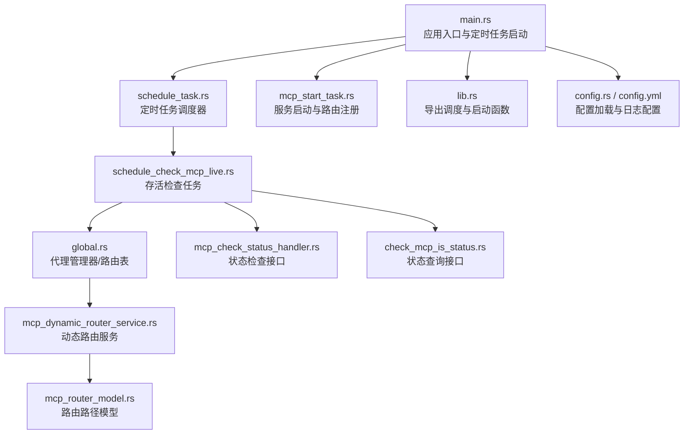
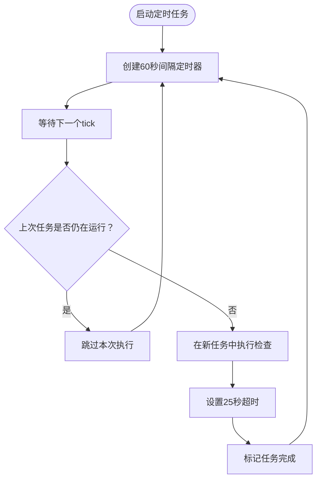
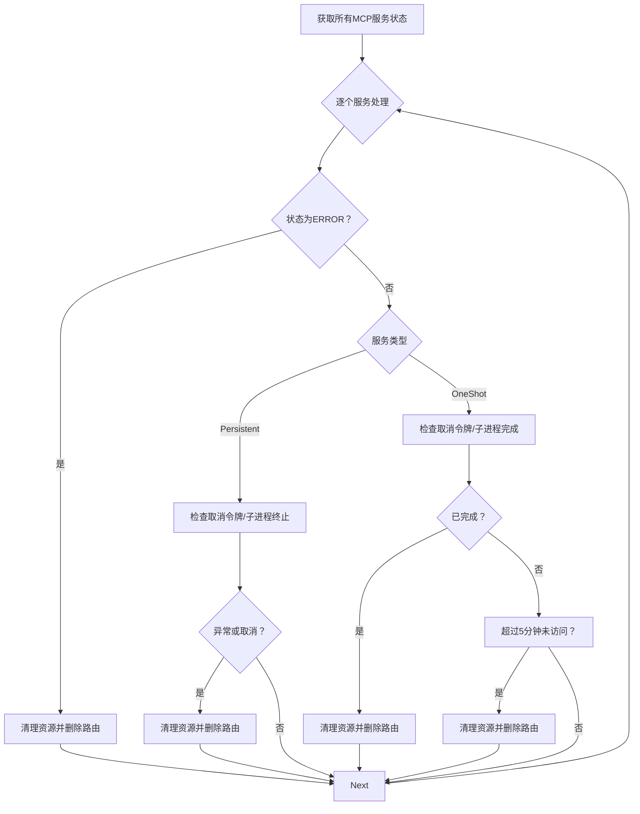
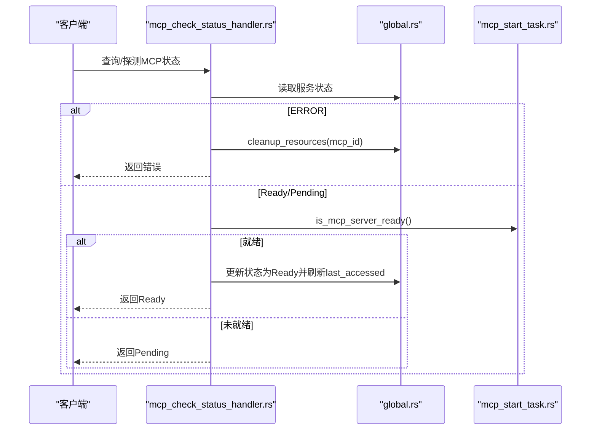
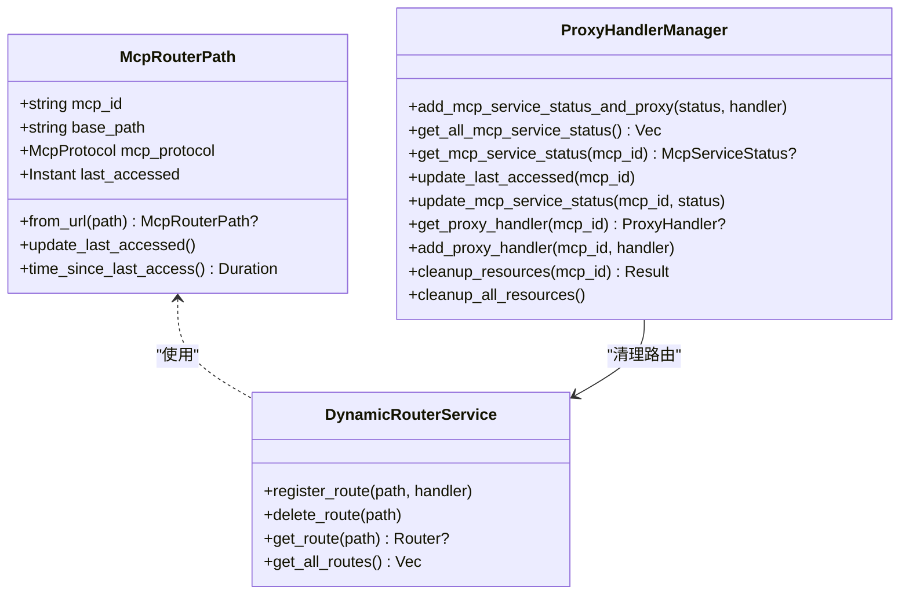
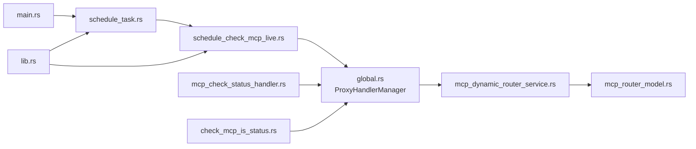

# 定时任务与调度管理

<cite>
**本文引用的文件**
- [schedule_task.rs](file://mcp-proxy/src/server/task/schedule_task.rs)
- [schedule_check_mcp_live.rs](file://mcp-proxy/src/server/task/schedule_check_mcp_live.rs)
- [main.rs](file://mcp-proxy/src/main.rs)
- [global.rs](file://mcp-proxy/src/model/global.rs)
- [mcp_dynamic_router_service.rs](file://mcp-proxy/src/server/mcp_dynamic_router_service.rs)
- [mcp_router_model.rs](file://mcp-proxy/src/model/mcp_router_model.rs)
- [mcp_check_status_handler.rs](file://mcp-proxy/src/server/handlers/mcp_check_status_handler.rs)
- [check_mcp_is_status.rs](file://mcp-proxy/src/server/handlers/check_mcp_is_status.rs)
- [mcp_start_task.rs](file://mcp-proxy/src/server/task/mcp_start_task.rs)
- [lib.rs](file://mcp-proxy/src/lib.rs)
- [config.rs](file://mcp-proxy/src/config.rs)
- [config.yml](file://mcp-proxy/config.yml)
</cite>

## 目录
1. [简介](#简介)
2. [项目结构](#项目结构)
3. [核心组件](#核心组件)
4. [架构总览](#架构总览)
5. [详细组件分析](#详细组件分析)
6. [依赖关系分析](#依赖关系分析)
7. [性能考量](#性能考量)
8. [故障排查指南](#故障排查指南)
9. [结论](#结论)
10. [附录](#附录)

## 简介
本文件围绕MCP代理的定时任务调度系统展开，重点分析以下内容：
- schedule_task.rs中任务调度器的初始化与运行机制
- schedule_check_mcp_live.rs中服务存活检查的具体实现
- 基于tokio定时器的任务触发方式与可配置性
- 存活检查的HTTP健康探针逻辑、超时处理、失败重试策略与状态更新流程
- 任务执行结果对路由表的动态更新（如下线不可用服务）
- 资源消耗、时钟漂移影响与分布式协调问题
- 监控指标采集与告警配置建议

## 项目结构
该模块位于mcp-proxy子工程中，定时任务与调度相关代码主要分布在server/task目录，配合全局代理管理器与动态路由服务协同工作。



图表来源
- [main.rs](file://mcp-proxy/src/main.rs#L70-L90)
- [schedule_task.rs](file://mcp-proxy/src/server/task/schedule_task.rs#L1-L64)
- [schedule_check_mcp_live.rs](file://mcp-proxy/src/server/task/schedule_check_mcp_live.rs#L1-L96)
- [global.rs](file://mcp-proxy/src/model/global.rs#L1-L247)
- [mcp_dynamic_router_service.rs](file://mcp-proxy/src/server/mcp_dynamic_router_service.rs#L1-L273)
- [mcp_router_model.rs](file://mcp-proxy/src/model/mcp_router_model.rs#L1-L1262)
- [mcp_check_status_handler.rs](file://mcp-proxy/src/server/handlers/mcp_check_status_handler.rs#L26-L114)
- [check_mcp_is_status.rs](file://mcp-proxy/src/server/handlers/check_mcp_is_status.rs#L1-L46)
- [mcp_start_task.rs](file://mcp-proxy/src/server/task/mcp_start_task.rs#L1-L200)
- [lib.rs](file://mcp-proxy/src/lib.rs#L1-L22)
- [config.rs](file://mcp-proxy/src/config.rs#L1-L75)
- [config.yml](file://mcp-proxy/config.yml#L1-L11)

章节来源
- [main.rs](file://mcp-proxy/src/main.rs#L70-L90)
- [schedule_task.rs](file://mcp-proxy/src/server/task/schedule_task.rs#L1-L64)
- [schedule_check_mcp_live.rs](file://mcp-proxy/src/server/task/schedule_check_mcp_live.rs#L1-L96)
- [global.rs](file://mcp-proxy/src/model/global.rs#L1-L247)
- [mcp_dynamic_router_service.rs](file://mcp-proxy/src/server/mcp_dynamic_router_service.rs#L1-L273)
- [mcp_router_model.rs](file://mcp-proxy/src/model/mcp_router_model.rs#L1-L1262)
- [mcp_check_status_handler.rs](file://mcp-proxy/src/server/handlers/mcp_check_status_handler.rs#L26-L114)
- [check_mcp_is_status.rs](file://mcp-proxy/src/server/handlers/check_mcp_is_status.rs#L1-L46)
- [mcp_start_task.rs](file://mcp-proxy/src/server/task/mcp_start_task.rs#L1-L200)
- [lib.rs](file://mcp-proxy/src/lib.rs#L1-L22)
- [config.rs](file://mcp-proxy/src/config.rs#L1-L75)
- [config.yml](file://mcp-proxy/config.yml#L1-L11)

## 核心组件
- 定时任务调度器：基于tokio::time::interval创建周期任务，负责按固定间隔触发存活检查。
- 存活检查任务：扫描全局代理管理器中的MCP服务状态，清理异常或长时间未访问的服务。
- 代理管理器与动态路由：维护服务状态、路由表、取消令牌，并在清理时移除路由。
- 状态检查接口：对外提供健康状态查询与就绪探测，辅助存活检查决策。
- 应用入口：启动定时任务与日志清理等后台任务。

章节来源
- [schedule_task.rs](file://mcp-proxy/src/server/task/schedule_task.rs#L1-L64)
- [schedule_check_mcp_live.rs](file://mcp-proxy/src/server/task/schedule_check_mcp_live.rs#L1-L96)
- [global.rs](file://mcp-proxy/src/model/global.rs#L1-L247)
- [mcp_dynamic_router_service.rs](file://mcp-proxy/src/server/mcp_dynamic_router_service.rs#L1-L273)
- [mcp_check_status_handler.rs](file://mcp-proxy/src/server/handlers/mcp_check_status_handler.rs#L26-L114)
- [check_mcp_is_status.rs](file://mcp-proxy/src/server/handlers/check_mcp_is_status.rs#L1-L46)
- [main.rs](file://mcp-proxy/src/main.rs#L70-L90)

## 架构总览
定时任务调度系统与动态路由服务协同，形成“定时扫描—状态判定—清理路由—更新状态”的闭环。

```mermaid
sequenceDiagram
participant Main as "main.rs"
participant Scheduler as "schedule_task.rs"
participant Checker as "schedule_check_mcp_live.rs"
participant Manager as "global.rs<br/>ProxyHandlerManager"
participant Router as "mcp_dynamic_router_service.rs"
participant Model as "mcp_router_model.rs"
Main->>Scheduler : 启动定时任务
Scheduler->>Scheduler : 每60秒tick
Scheduler->>Checker : 触发存活检查
Checker->>Manager : 获取所有MCP服务状态
alt ERROR状态
Checker->>Manager : cleanup_resources(mcp_id)
Manager->>Router : 删除路由(base_sse/base_stream)
else Persistent服务
Checker->>Manager : 检查取消令牌/子进程终止
opt 异常或取消
Checker->>Manager : cleanup_resources(mcp_id)
Manager->>Router : 删除路由
end
else OneShot服务
Checker->>Manager : 检查取消令牌/子进程完成
opt 已完成
Checker->>Manager : cleanup_resources(mcp_id)
Manager->>Router : 删除路由
else 超过5分钟未访问
Checker->>Manager : cleanup_resources(mcp_id)
Manager->>Router : 删除路由
end
end
Checker-->>Scheduler : 完成
```

图表来源
- [main.rs](file://mcp-proxy/src/main.rs#L70-L90)
- [schedule_task.rs](file://mcp-proxy/src/server/task/schedule_task.rs#L1-L64)
- [schedule_check_mcp_live.rs](file://mcp-proxy/src/server/task/schedule_check_mcp_live.rs#L1-L96)
- [global.rs](file://mcp-proxy/src/model/global.rs#L193-L241)
- [mcp_dynamic_router_service.rs](file://mcp-proxy/src/server/mcp_dynamic_router_service.rs#L1-L273)
- [mcp_router_model.rs](file://mcp-proxy/src/model/mcp_router_model.rs#L341-L410)

## 详细组件分析

### 组件A：定时任务调度器（schedule_task.rs）
- 初始化与运行机制
  - 使用tokio::time::interval创建60秒周期的定时器。
  - 使用原子布尔值is_running避免任务重叠执行。
  - 每次tick后，若上一次任务未完成则跳过本次执行；否则在独立任务中执行检查，并设置25秒超时。
- 可配置性
  - 当前检查间隔硬编码为60秒，超时硬编码为25秒。
  - 可通过修改源码实现配置化（见“依赖关系分析”中的建议）。
- 并发与稳定性
  - 采用tokio::spawn隔离检查任务，防止阻塞主循环。
  - 使用timeout确保不会长期占用CPU或IO。



图表来源
- [schedule_task.rs](file://mcp-proxy/src/server/task/schedule_task.rs#L1-L64)

章节来源
- [schedule_task.rs](file://mcp-proxy/src/server/task/schedule_task.rs#L1-L64)

### 组件B：存活检查任务（schedule_check_mcp_live.rs）
- 服务状态扫描
  - 通过全局代理管理器获取所有MCP服务状态列表。
  - 输出当前运行中的MCP服务数量日志。
- 超时与清理策略
  - 对ERROR状态的服务直接清理资源。
  - 对Persistent服务：若取消令牌已取消或子进程异常终止则清理。
  - 对OneShot服务：若取消令牌已取消或子进程已完成则清理；若超过5分钟未访问也清理。
- 路由表更新
  - 清理资源时删除对应SSE与Stream路由路径，确保下游不再命中。
- 状态更新
  - 检查过程中会更新服务的last_accessed时间，便于后续闲置清理判断。



图表来源
- [schedule_check_mcp_live.rs](file://mcp-proxy/src/server/task/schedule_check_mcp_live.rs#L1-L96)
- [global.rs](file://mcp-proxy/src/model/global.rs#L193-L241)

章节来源
- [schedule_check_mcp_live.rs](file://mcp-proxy/src/server/task/schedule_check_mcp_live.rs#L1-L96)
- [global.rs](file://mcp-proxy/src/model/global.rs#L193-L241)

### 组件C：状态检查与健康探针（mcp_check_status_handler.rs、check_mcp_is_status.rs）
- 健康探针逻辑
  - 若服务状态为ERROR，清理资源并返回错误。
  - 若服务状态为READY，进一步调用代理处理器的就绪检查方法；若成功则更新状态为READY并刷新last_accessed。
  - 若服务不存在，触发服务启动流程并返回PENDING。
- 失败重试与状态更新
  - 状态更新通过代理管理器的update_mcp_service_status完成。
  - last_accessed在状态检查时更新，避免被误判为闲置。
- 与存活检查的关系
  - 存活检查依赖代理管理器中的状态与last_accessed，二者共同保证清理时机准确。



图表来源
- [mcp_check_status_handler.rs](file://mcp-proxy/src/server/handlers/mcp_check_status_handler.rs#L26-L114)
- [check_mcp_is_status.rs](file://mcp-proxy/src/server/handlers/check_mcp_is_status.rs#L1-L46)
- [global.rs](file://mcp-proxy/src/model/global.rs#L175-L181)
- [mcp_start_task.rs](file://mcp-proxy/src/server/task/mcp_start_task.rs#L1-L200)

章节来源
- [mcp_check_status_handler.rs](file://mcp-proxy/src/server/handlers/mcp_check_status_handler.rs#L26-L114)
- [check_mcp_is_status.rs](file://mcp-proxy/src/server/handlers/check_mcp_is_status.rs#L1-L46)
- [global.rs](file://mcp-proxy/src/model/global.rs#L175-L181)
- [mcp_start_task.rs](file://mcp-proxy/src/server/task/mcp_start_task.rs#L1-L200)

### 组件D：动态路由与路由表（mcp_dynamic_router_service.rs、mcp_router_model.rs）
- 路由路径模型
  - McpRouterPath定义SSE与Stream两类路由路径，包含mcp_id、base_path、协议类型与last_accessed。
  - 提供从URL解析路由路径与更新last_accessed的方法。
- 动态路由服务
  - DynamicRouterService维护全局路由表，提供注册、删除、查询路由的能力。
  - 在清理资源时同步删除对应路由，避免流量继续命中已失效服务。



图表来源
- [mcp_router_model.rs](file://mcp-proxy/src/model/mcp_router_model.rs#L341-L410)
- [mcp_dynamic_router_service.rs](file://mcp-proxy/src/server/mcp_dynamic_router_service.rs#L1-L273)
- [global.rs](file://mcp-proxy/src/model/global.rs#L1-L247)

章节来源
- [mcp_router_model.rs](file://mcp-proxy/src/model/mcp_router_model.rs#L341-L410)
- [mcp_dynamic_router_service.rs](file://mcp-proxy/src/server/mcp_dynamic_router_service.rs#L1-L273)
- [global.rs](file://mcp-proxy/src/model/global.rs#L1-L247)

### 组件E：应用入口与任务启动（main.rs、lib.rs）
- 应用入口
  - 启动定时任务与日志清理任务；定时任务通过tokio::spawn启动。
- 导出接口
  - lib.rs导出start_schedule_task与schedule_check_mcp_live，供main.rs使用。

章节来源
- [main.rs](file://mcp-proxy/src/main.rs#L70-L90)
- [lib.rs](file://mcp-proxy/src/lib.rs#L1-L22)

## 依赖关系分析
- 组件耦合
  - schedule_task.rs依赖schedule_check_mcp_live.rs；schedule_check_mcp_live.rs依赖global.rs中的代理管理器。
  - 代理管理器同时被存活检查与状态检查接口使用，形成“状态—清理—路由”的闭环。
- 外部依赖
  - tokio::time::interval用于定时；tokio::spawn用于并发；DashMap与CancellationToken用于并发安全与取消控制。
- 潜在循环依赖
  - 当前文件间无循环导入；但若未来扩展，需避免在schedule_check_mcp_live.rs中引入对schedule_task.rs的反向依赖。



图表来源
- [schedule_task.rs](file://mcp-proxy/src/server/task/schedule_task.rs#L1-L64)
- [schedule_check_mcp_live.rs](file://mcp-proxy/src/server/task/schedule_check_mcp_live.rs#L1-L96)
- [global.rs](file://mcp-proxy/src/model/global.rs#L1-L247)
- [mcp_dynamic_router_service.rs](file://mcp-proxy/src/server/mcp_dynamic_router_service.rs#L1-L273)
- [mcp_router_model.rs](file://mcp-proxy/src/model/mcp_router_model.rs#L1-L1262)
- [mcp_check_status_handler.rs](file://mcp-proxy/src/server/handlers/mcp_check_status_handler.rs#L26-L114)
- [check_mcp_is_status.rs](file://mcp-proxy/src/server/handlers/check_mcp_is_status.rs#L1-L46)
- [main.rs](file://mcp-proxy/src/main.rs#L70-L90)
- [lib.rs](file://mcp-proxy/src/lib.rs#L1-L22)

章节来源
- [schedule_task.rs](file://mcp-proxy/src/server/task/schedule_task.rs#L1-L64)
- [schedule_check_mcp_live.rs](file://mcp-proxy/src/server/task/schedule_check_mcp_live.rs#L1-L96)
- [global.rs](file://mcp-proxy/src/model/global.rs#L1-L247)
- [mcp_dynamic_router_service.rs](file://mcp-proxy/src/server/mcp_dynamic_router_service.rs#L1-L273)
- [mcp_router_model.rs](file://mcp-proxy/src/model/mcp_router_model.rs#L1-L1262)
- [mcp_check_status_handler.rs](file://mcp-proxy/src/server/handlers/mcp_check_status_handler.rs#L26-L114)
- [check_mcp_is_status.rs](file://mcp-proxy/src/server/handlers/check_mcp_is_status.rs#L1-L46)
- [main.rs](file://mcp-proxy/src/main.rs#L70-L90)
- [lib.rs](file://mcp-proxy/src/lib.rs#L1-L22)

## 性能考量
- 资源消耗
  - 定时任务每60秒执行一次，每次执行在独立任务中进行，避免阻塞主循环。
  - 检查过程遍历所有MCP服务状态，复杂度O(N)；清理路由与取消令牌操作为常数时间。
- 时钟漂移
  - 使用interval固定间隔，若单次检查耗时接近或超过间隔，可能导致累积延迟。可通过缩短超时或调整间隔缓解。
- 分布式协调
  - 当前实现为单实例定时任务，未涉及跨实例协调。若部署多副本，建议引入分布式锁或外部协调服务，避免重复清理。

[本节为通用性能讨论，不直接分析具体文件]

## 故障排查指南
- 定时任务未执行
  - 检查main.rs是否调用了start_schedule_task；确认日志中“MCP服务状态检查定时任务已启动”是否输出。
- 任务重叠或超时
  - 若日志出现“上一次MCP服务状态检查任务尚未完成，跳过本次执行”，说明检查耗时过长或系统负载过高。
  - 若出现“MCP服务状态检查任务超时”，说明检查逻辑阻塞或网络超时，需优化检查逻辑或增加超时阈值。
- 路由未清理
  - 检查代理管理器cleanup_resources是否被调用；确认DynamicRouterService.delete_route是否执行。
- 状态不一致
  - 检查状态检查接口是否正确更新状态与last_accessed；核对代理管理器update_mcp_service_status与update_last_accessed的调用。

章节来源
- [main.rs](file://mcp-proxy/src/main.rs#L70-L90)
- [schedule_task.rs](file://mcp-proxy/src/server/task/schedule_task.rs#L1-L64)
- [schedule_check_mcp_live.rs](file://mcp-proxy/src/server/task/schedule_check_mcp_live.rs#L1-L96)
- [global.rs](file://mcp-proxy/src/model/global.rs#L193-L241)
- [mcp_check_status_handler.rs](file://mcp-proxy/src/server/handlers/mcp_check_status_handler.rs#L26-L114)

## 结论
该定时任务调度系统通过固定间隔的存活检查，结合代理管理器与动态路由服务，实现了对MCP服务的自动化生命周期管理。当前实现具备良好的并发与超时控制，但在可配置性、分布式协调与监控指标方面仍有改进空间。建议后续引入配置化间隔与超时、分布式锁协调、以及更完善的指标采集与告警体系。

[本节为总结性内容，不直接分析具体文件]

## 附录

### 配置与可配置性建议
- 检查间隔与超时
  - 当前间隔为60秒，超时为25秒。建议通过config.yml或环境变量进行配置化，以便在不同场景下调整。
- 日志与保留策略
  - 日志级别与保留天数已在config.yml中配置，日志清理任务按小时执行。

章节来源
- [config.rs](file://mcp-proxy/src/config.rs#L1-L75)
- [config.yml](file://mcp-proxy/config.yml#L1-L11)
- [main.rs](file://mcp-proxy/src/main.rs#L81-L101)

### 监控指标与告警建议
- 指标采集
  - 任务执行时长：记录定时任务的执行耗时，便于发现抖动与超时风险。
  - 失败率：统计检查任务超时与清理失败次数。
  - 路由清理次数：统计清理资源与删除路由的次数。
  - 服务状态分布：统计READY/PENDING/ERROR的数量变化。
- 告警配置
  - 当任务超时比例超过阈值或清理失败次数激增时触发告警。
  - 当READY服务数量骤降或ERROR服务数量上升时触发告警。

[本节为通用监控建议，不直接分析具体文件]