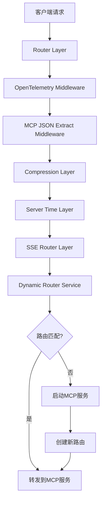
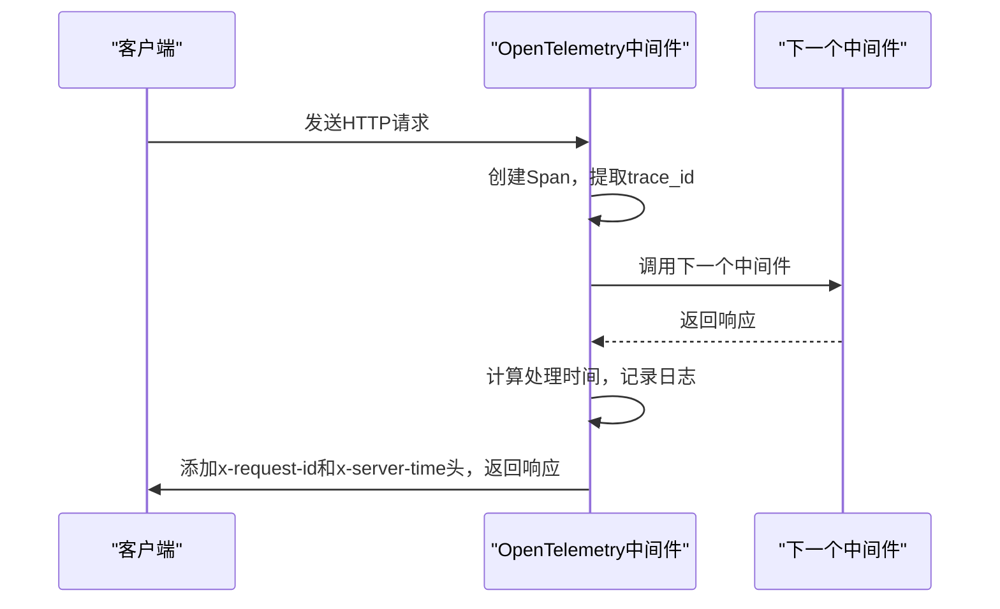
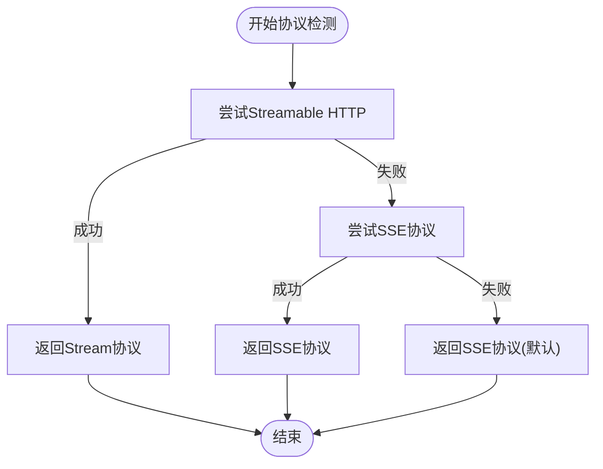
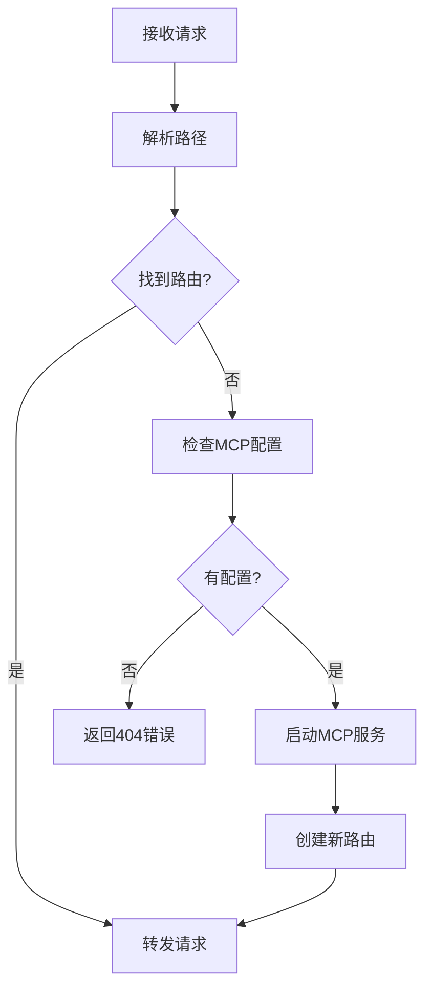

# 路由层与中间件集成

<cite>
**本文档引用的文件**
- [router_layer.rs](file://mcp-proxy/src/server/router_layer.rs)
- [mcp_dynamic_router_service.rs](file://mcp-proxy/src/server/mcp_dynamic_router_service.rs)
- [opentelemetry_middleware.rs](file://mcp-proxy/src/server/middlewares/opentelemetry_middleware.rs)
- [auth.rs](file://mcp-proxy/src/server/middlewares/auth.rs)
- [protocol_detector.rs](file://mcp-proxy/src/server/protocol_detector.rs)
- [mcp_router_json.rs](file://mcp-proxy/src/server/middlewares/mcp_router_json.rs)
- [mcp_update_latest_layer.rs](file://mcp-proxy/src/server/middlewares/mcp_update_latest_layer.rs)
- [mcp_router_model.rs](file://mcp-proxy/src/model/mcp_router_model.rs)
- [mcp_config.rs](file://mcp-proxy/src/model/mcp_config.rs)
- [mod.rs](file://mcp-proxy/src/server/middlewares/mod.rs)
- [main.rs](file://mcp-proxy/src/main.rs)
- [app_state_model.rs](file://mcp-proxy/src/model/app_state_model.rs)
</cite>

## 目录
1. [引言](#引言)
2. [路由层核心架构](#路由层核心架构)
3. [中间件协作机制](#中间件协作机制)
4. [请求处理流程分析](#请求处理流程分析)
5. [动态路由匹配与上下文传递](#动态路由匹配与上下文传递)
6. [性能开销与优化建议](#性能开销与优化建议)
7. [结论](#结论)

## 引言
路由层（router_layer）在MCP代理系统中扮演着核心枢纽的角色，作为Axum路由系统与MCP代理业务逻辑之间的桥梁。它不仅负责请求的分发，还承担着上下文传递、协议适配和中间件集成等关键任务。本文档将深入分析其设计原理和实现机制，详细阐述其如何与认证中间件、OpenTelemetry追踪中间件以及协议检测中间件协同工作，确保请求能够被正确、高效地处理。

## 路由层核心架构

**图表来源**
- [router_layer.rs](file://mcp-proxy/src/server/router_layer.rs#L25-L82)
- [mod.rs](file://mcp-proxy/src/server/middlewares/mod.rs#L29-L42)

**本节来源**
- [router_layer.rs](file://mcp-proxy/src/server/router_layer.rs#L25-L82)
- [mod.rs](file://mcp-proxy/src/server/middlewares/mod.rs#L29-L42)

## 中间件协作机制

### 认证中间件（auth）
认证中间件负责验证请求的合法性，通过检查请求头中的`Authorization`字段或查询参数中的`token`来完成身份验证。它支持Bearer Token和查询参数两种认证方式，为系统提供了灵活的访问控制机制。

### OpenTelemetry追踪中间件（opentelemetry_middleware）
该中间件实现了分布式追踪功能，主要职责包括：
- 自动创建OpenTelemetry的span和trace
- 在响应头中添加`x-request-id`（即trace_id）
- 在响应头中添加`x-server-time`（请求处理时间）
- 记录HTTP请求的语义化属性，如方法、URL、路由等

**图表来源**
- [opentelemetry_middleware.rs](file://mcp-proxy/src/server/middlewares/opentelemetry_middleware.rs#L21-L107)

**本节来源**
- [opentelemetry_middleware.rs](file://mcp-proxy/src/server/middlewares/opentelemetry_middleware.rs#L21-L107)

### 协议检测中间件（protocol_detector）
协议检测中间件通过发送探测请求来自动判断MCP服务支持的协议类型。其检测流程如下：
1. 首先尝试Streamable HTTP协议，发送带有特定Accept头的请求
2. 如果失败，则尝试SSE协议
3. 如果都不支持，默认返回SSE协议以保证向后兼容

**图表来源**
- [protocol_detector.rs](file://mcp-proxy/src/server/protocol_detector.rs#L12-L30)

**本节来源**
- [protocol_detector.rs](file://mcp-proxy/src/server/protocol_detector.rs#L12-L30)

## 请求处理流程分析

### 自定义中间件注入与执行顺序
中间件的注入通过`set_layer`函数完成，其执行顺序严格按照在`ServiceBuilder`中添加的顺序进行：
1. `opentelemetry_tracing_middleware`：最先执行，负责追踪
2. `mcp_json_config_extract`：提取MCP配置信息
3. `CompressionLayer`：处理HTTP压缩
4. `ServerTimeLayer`：添加服务器时间头
5. `MySseRouterLayer`：最后执行，负责路由更新

**本节来源**
- [mod.rs](file://mcp-proxy/src/server/middlewares/mod.rs#L29-L42)
- [mcp_router_json.rs](file://mcp-proxy/src/server/middlewares/mcp_router_json.rs#L11-L57)
- [mcp_update_latest_layer.rs](file://mcp-proxy/src/server/middlewares/mcp_update_latest_layer.rs#L12-L70)

## 动态路由匹配与上下文传递

### 请求分发机制
当请求进入系统后，`DynamicRouterService`负责匹配对应的MCP服务实例。其匹配流程如下：
1. 解析请求路径，提取`mcp_id`和`base_path`
2. 在路由表中查找已注册的路由
3. 如果找到匹配的路由，则直接转发请求
4. 如果未找到，则尝试启动新的MCP服务

**图表来源**
- [mcp_dynamic_router_service.rs](file://mcp-proxy/src/server/mcp_dynamic_router_service.rs#L30-L135)

**本节来源**
- [mcp_dynamic_router_service.rs](file://mcp-proxy/src/server/mcp_dynamic_router_service.rs#L30-L135)
- [mcp_router_model.rs](file://mcp-proxy/src/model/mcp_router_model.rs#L477-L559)

## 性能开销与优化建议

### 复杂路由场景下的性能考量
在复杂的路由场景下，系统可能面临以下性能挑战：
- 路由匹配的计算开销
- 动态服务启动的延迟
- 中间件链的处理时间累积

### 优化建议
1. **路由缓存**：实现路由匹配结果的缓存机制，避免重复解析相同的路径
2. **预编译匹配规则**：将常用的路由匹配规则预编译为高效的查找表
3. **异步处理**：将非关键路径的处理（如日志记录）改为异步执行
4. **连接池**：为频繁访问的MCP服务维护连接池，减少连接建立的开销

**本节来源**
- [mcp_dynamic_router_service.rs](file://mcp-proxy/src/server/mcp_dynamic_router_service.rs#L91-L108)
- [mcp_router_model.rs](file://mcp-proxy/src/model/mcp_router_model.rs#L477-L559)

## 结论
路由层作为MCP代理系统的核心组件，通过精心设计的中间件链和动态路由机制，实现了高效、灵活的请求处理能力。它不仅能够准确地将请求分发到对应的MCP服务实例，还能在必要时动态启动新的服务。通过与认证、追踪和协议检测等中间件的紧密协作，系统在保证功能完整性的同时，也提供了良好的可观测性和安全性。未来可以通过引入路由缓存和预编译匹配规则等优化措施，进一步提升系统在复杂场景下的性能表现。