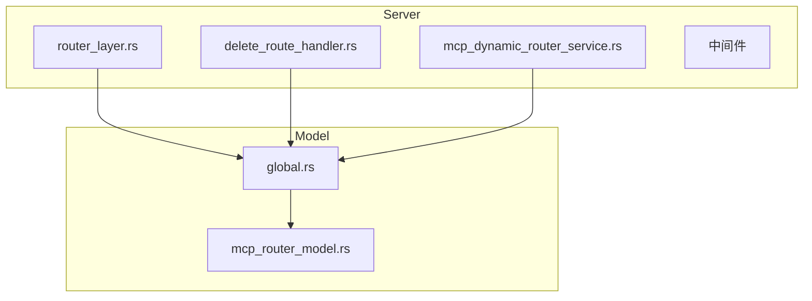
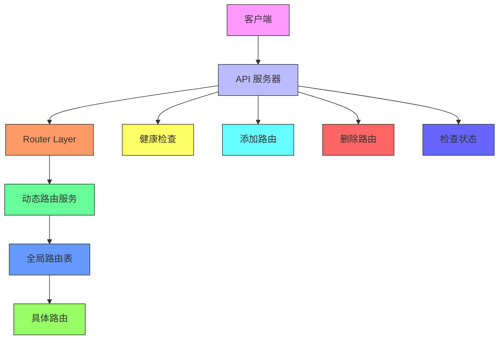
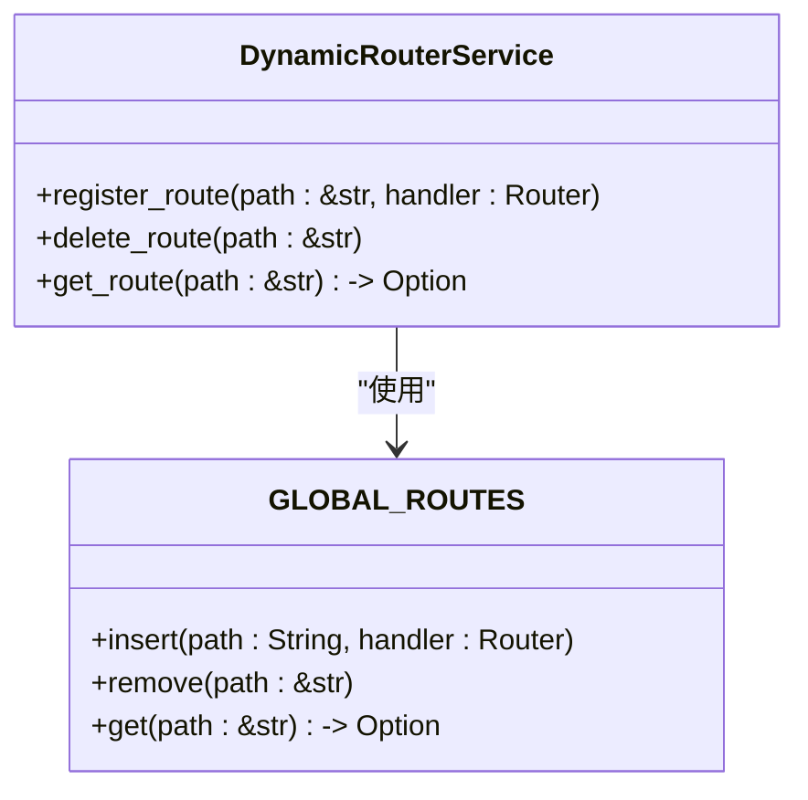
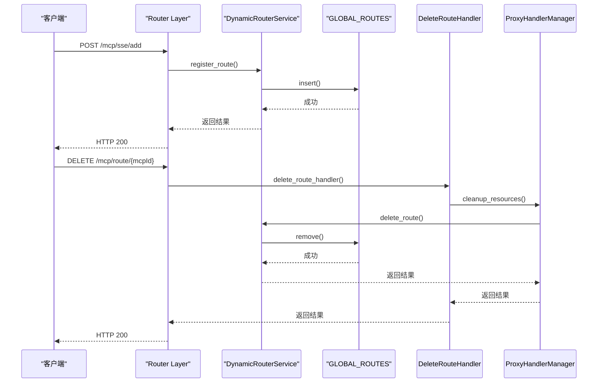
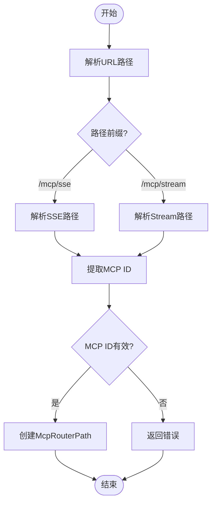
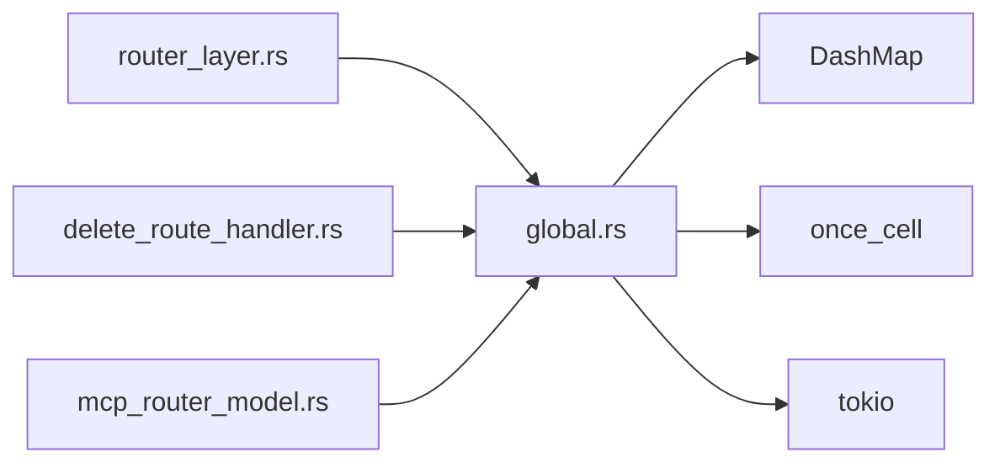

# 动态路由管理

<cite>
**本文档引用的文件**
- [router_layer.rs](file://mcp-proxy/src/server/router_layer.rs)
- [delete_route_handler.rs](file://mcp-proxy/src/server/handlers/delete_route_handler.rs)
- [global.rs](file://mcp-proxy/src/model/global.rs)
- [mcp_router_model.rs](file://mcp-proxy/src/model/mcp_router_model.rs)
</cite>

## 目录
1. [简介](#简介)
2. [项目结构](#项目结构)
3. [核心组件](#核心组件)
4. [架构概述](#架构概述)
5. [详细组件分析](#详细组件分析)
6. [依赖分析](#依赖分析)
7. [性能考虑](#性能考虑)
8. [故障排除指南](#故障排除指南)
9. [结论](#结论)

## 简介
本文档详细解释了 MCP 代理系统中动态路由管理的实现机制。重点分析了如何通过 Layer 机制在运行时注册和注销路由，确保系统的灵活性和可扩展性。文档涵盖了路由注册、注销、线程安全机制、路由冲突处理策略以及性能监控建议。

## 项目结构
MCP 代理系统采用模块化设计，主要分为以下几个模块：
- `client`：处理客户端连接
- `model`：定义数据模型和全局状态
- `proxy`：实现代理功能
- `server`：处理服务器端逻辑，包括路由和中间件
- `config`：配置管理
- `mcp_error`：错误处理

**图示来源**
- [router_layer.rs](file://mcp-proxy/src/server/router_layer.rs#L0-L80)
- [global.rs](file://mcp-proxy/src/model/global.rs#L0-L206)
- [mcp_router_model.rs](file://mcp-proxy/src/model/mcp_router_model.rs#L0-L389)

**本节来源**
- [router_layer.rs](file://mcp-proxy/src/server/router_layer.rs#L0-L80)
- [global.rs](file://mcp-proxy/src/model/global.rs#L0-L206)

## 核心组件
动态路由管理的核心组件包括：
- `DynamicRouterService`：负责注册、删除和获取路由
- `GLOBAL_ROUTES`：全局单例路由表，使用 `DashMap` 实现线程安全
- `ProxyHandlerManager`：管理代理处理器和 MCP 服务状态
- `McpRouterPath`：解析和生成 MCP 路由路径

**本节来源**
- [global.rs](file://mcp-proxy/src/model/global.rs#L20-L22)
- [mcp_router_model.rs](file://mcp-proxy/src/model/mcp_router_model.rs#L78-L91)

## 架构概述
系统采用分层架构，通过 Axum 框架实现路由管理。`router_layer.rs` 中的 `get_router` 函数创建了基本路由，并通过 `set_layer` 添加中间件。动态路由通过 `DynamicRouterService` 实现，支持运行时注册和注销。

**图示来源**
- [router_layer.rs](file://mcp-proxy/src/server/router_layer.rs#L0-L80)
- [global.rs](file://mcp-proxy/src/model/global.rs#L25-L28)

## 详细组件分析

### 动态路由服务分析
`DynamicRouterService` 是动态路由管理的核心，提供了注册、删除和获取路由的方法。通过 `GLOBAL_ROUTES` 静态变量实现全局路由表，确保线程安全。

**图示来源**
- [global.rs](file://mcp-proxy/src/model/global.rs#L25-L28)

#### 路由注册与注销
路由注册和注销通过 `DynamicRouterService` 的静态方法实现。注册时将路由插入 `GLOBAL_ROUTES`，注销时从 `GLOBAL_ROUTES` 中移除。

**图示来源**
- [router_layer.rs](file://mcp-proxy/src/server/router_layer.rs#L0-L80)
- [delete_route_handler.rs](file://mcp-proxy/src/server/handlers/delete_route_handler.rs#L0-L18)
- [global.rs](file://mcp-proxy/src/model/global.rs#L25-L28)

### 路由路径解析
`McpRouterPath` 结构体负责解析和生成 MCP 路由路径。支持 SSE 和 Stream 两种协议，每种协议有不同的路径模式。

**图示来源**
- [mcp_router_model.rs](file://mcp-proxy/src/model/mcp_router_model.rs#L78-L91)

**本节来源**
- [global.rs](file://mcp-proxy/src/model/global.rs#L20-L22)
- [mcp_router_model.rs](file://mcp-proxy/src/model/mcp_router_model.rs#L78-L91)

## 依赖分析
系统依赖关系如下：
- `router_layer.rs` 依赖 `global.rs` 中的 `DynamicRouterService` 和 `GLOBAL_ROUTES`
- `delete_route_handler.rs` 依赖 `global.rs` 中的 `ProxyHandlerManager`
- `mcp_router_model.rs` 定义了路由路径的结构和解析逻辑

**图示来源**
- [router_layer.rs](file://mcp-proxy/src/server/router_layer.rs#L0-L80)
- [delete_route_handler.rs](file://mcp-proxy/src/server/handlers/delete_route_handler.rs#L0-L18)
- [global.rs](file://mcp-proxy/src/model/global.rs#L0-L206)

**本节来源**
- [router_layer.rs](file://mcp-proxy/src/server/router_layer.rs#L0-L80)
- [delete_route_handler.rs](file://mcp-proxy/src/server/handlers/delete_route_handler.rs#L0-L18)
- [global.rs](file://mcp-proxy/src/model/global.rs#L0-L206)

## 性能考虑
- 使用 `DashMap` 实现线程安全的路由表，避免锁竞争
- 通过 `Lazy` 静态变量实现单例模式，减少内存开销
- 定期清理无效路由，防止内存泄漏
- 提供性能监控接口，便于系统调优

## 故障排除指南
- **路由注册失败**：检查 `mcp_json_config` 是否正确，确保 MCP ID 唯一
- **路由注销失败**：确认 MCP ID 存在，检查是否有其他服务正在使用该路由
- **性能下降**：监控路由表大小，定期清理无效路由
- **内存泄漏**：确保在服务关闭时调用 `cleanup_all_resources`

**本节来源**
- [global.rs](file://mcp-proxy/src/model/global.rs#L25-L28)
- [delete_route_handler.rs](file://mcp-proxy/src/server/handlers/delete_route_handler.rs#L0-L18)

## 结论
MCP 代理系统的动态路由管理机制通过 `DynamicRouterService` 和 `GLOBAL_ROUTES` 实现了灵活的路由注册和注销功能。通过 `DashMap` 和 `Lazy` 确保了线程安全和内存效率。系统提供了完整的路由管理接口，支持运行时动态调整路由配置，满足了高可用性和可扩展性的需求。