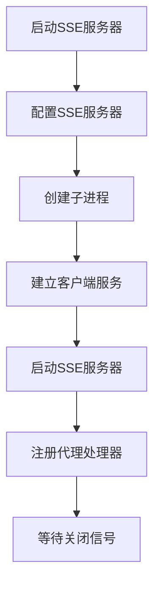
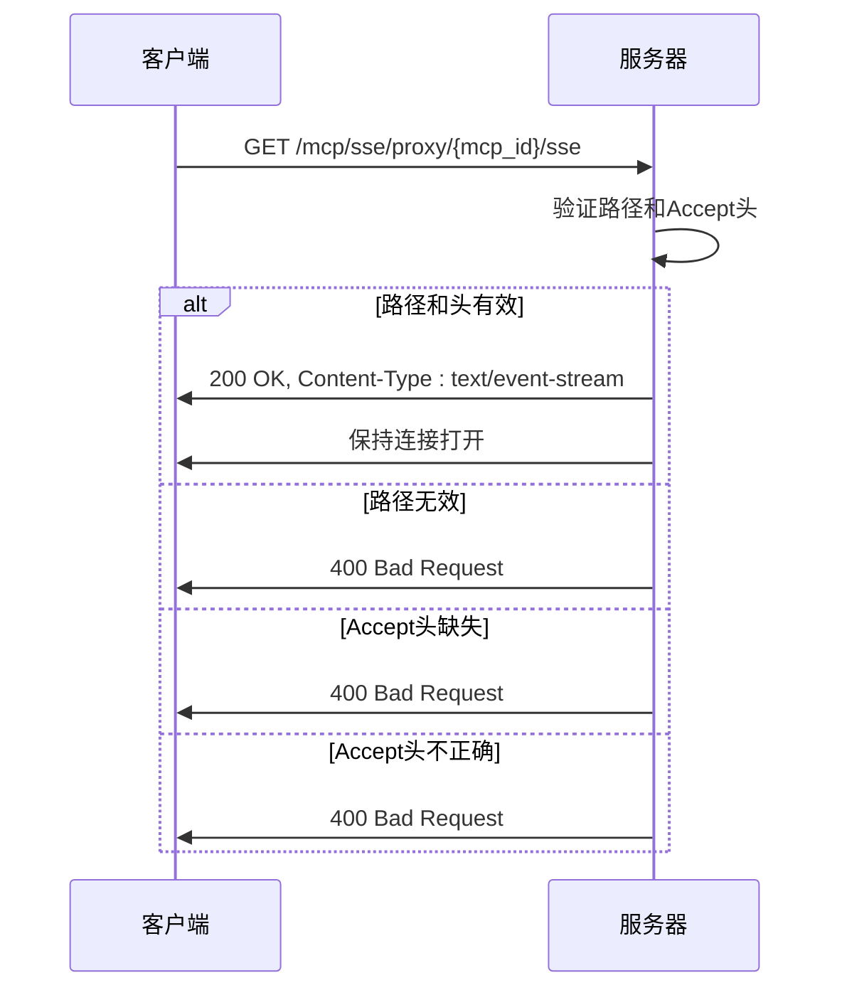
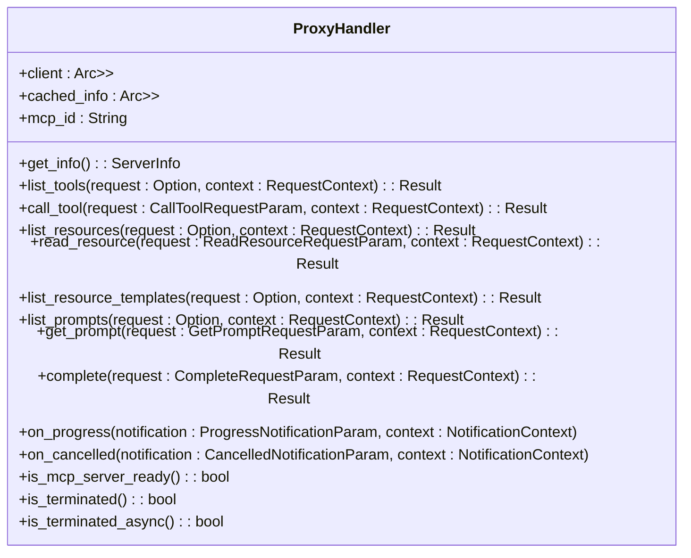
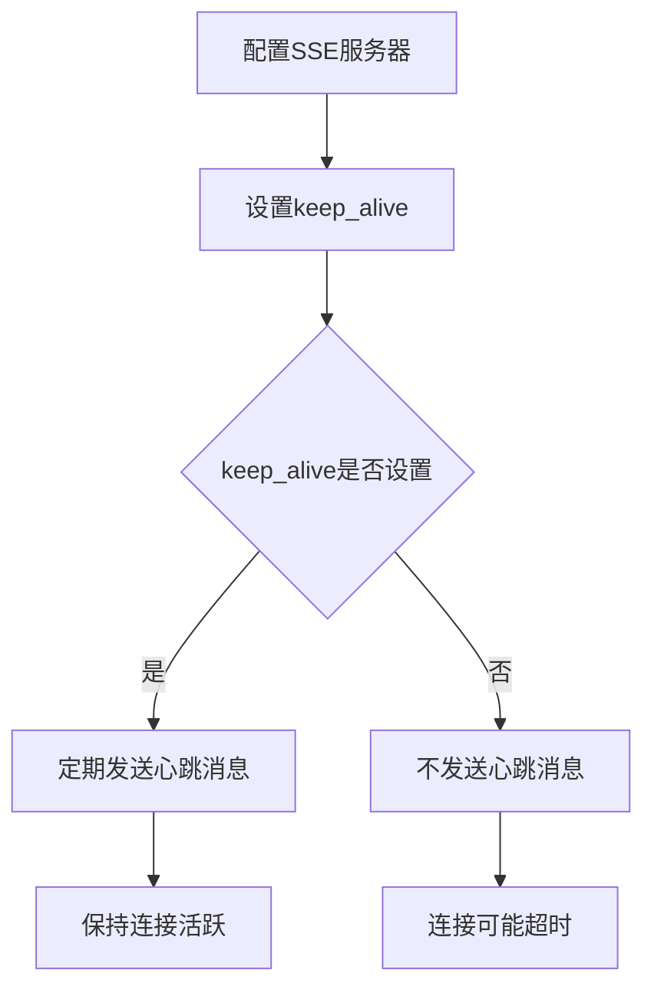
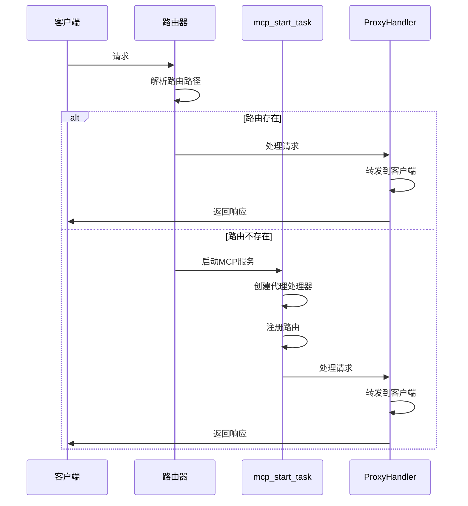
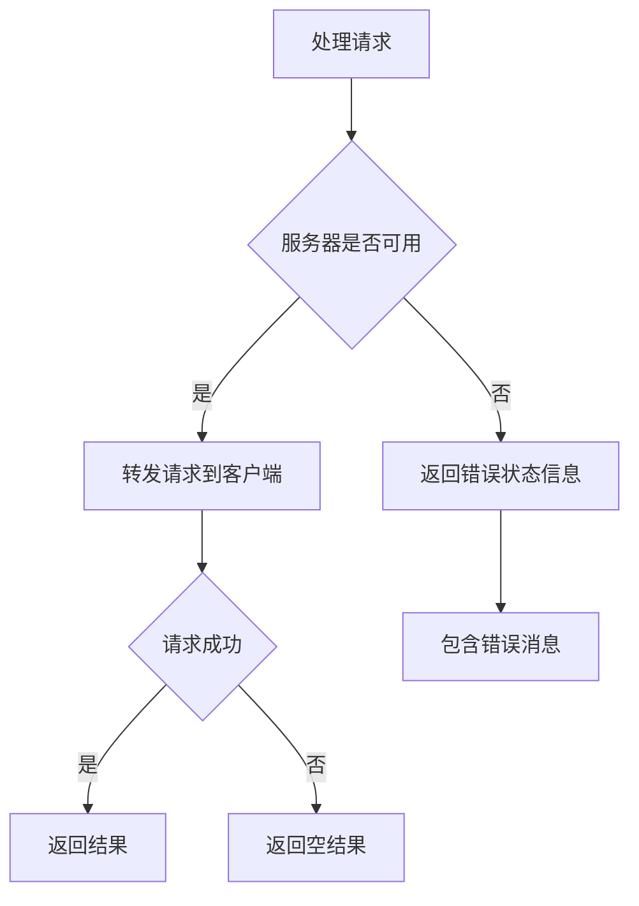
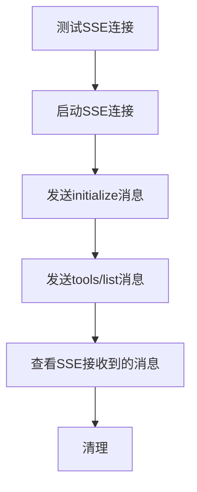
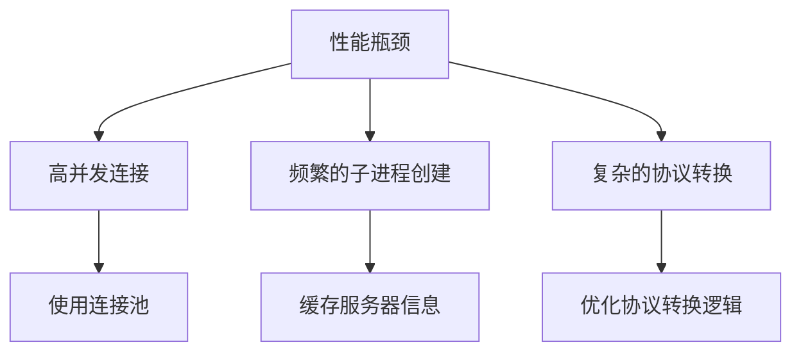

# SSE协议支持

<cite>
**本文档引用的文件**
- [sse_server.rs](file://mcp-proxy/src/server/handlers/sse_server.rs)
- [proxy_handler.rs](file://mcp-proxy/src/proxy/proxy_handler.rs)
- [mcp_router_model.rs](file://mcp-proxy/src/model/mcp_router_model.rs)
- [mcp_start_task.rs](file://mcp-proxy/src/server/task/mcp_start_task.rs)
- [protocol_detector.rs](file://mcp-proxy/src/server/protocol_detector.rs)
- [test_sse_paths.md](file://mcp-proxy/test_sse_paths.md)
- [test_sse_client.py](file://mcp-proxy/test_sse_client.py)
- [test_sse_connection.sh](file://mcp-proxy/test_sse_connection.sh)
- [test_sse_simple.sh](file://mcp-proxy/test_sse_simple.sh)
- [test_sse_complete.sh](file://mcp-proxy/test_sse_complete.sh)
</cite>

## 目录
1. [引言](#引言)
2. [SSE协议实现机制](#sse协议实现机制)
3. [事件流建立过程](#事件流建立过程)
4. [服务端事件推送格式](#服务端事件推送格式)
5. [心跳机制实现](#心跳机制实现)
6. [事件循环与客户端管理](#事件循环与客户端管理)
7. [错误处理与连接管理](#错误处理与连接管理)
8. [测试路径与调试方法](#测试路径与调试方法)
9. [性能瓶颈与优化建议](#性能瓶颈与优化建议)

## 引言
SSE（Server-Sent Events）协议在MCP代理服务中扮演着关键角色，它实现了服务器向客户端的单向实时数据推送。本文档详细说明了MCP代理服务中SSE协议的实现机制，包括事件流的建立、服务端事件推送格式、心跳机制、事件循环、客户端管理、错误处理、连接超时和客户端重连机制的设计。通过分析代码实现和测试用例，本文档为开发者提供了全面的理解和实践指导。

## SSE协议实现机制
MCP代理服务中的SSE协议实现主要通过`run_sse_server`函数和`ProxyHandler`结构体来完成。`run_sse_server`函数负责创建本地SSE服务器，该服务器代理到stdio MCP服务器。它通过配置SSE服务器、创建子进程、建立客户端服务和启动SSE服务器来实现这一功能。

**Diagram sources**
- [sse_server.rs](file://mcp-proxy/src/server/handlers/sse_server.rs#L27-L94)

**Section sources**
- [sse_server.rs](file://mcp-proxy/src/server/handlers/sse_server.rs#L27-L94)

## 事件流建立过程
事件流的建立过程包括HTTP头设置、内容类型定义和连接保持策略。当客户端发起SSE连接请求时，服务器会检查请求路径和Accept头，确保其符合SSE协议的要求。

**Diagram sources**
- [mcp_start_task.rs](file://mcp-proxy/src/server/task/mcp_start_task.rs#L407-L473)
- [protocol_detector.rs](file://mcp-proxy/src/server/protocol_detector.rs#L114-L163)

**Section sources**
- [mcp_start_task.rs](file://mcp-proxy/src/server/task/mcp_start_task.rs#L407-L473)
- [protocol_detector.rs](file://mcp-proxy/src/server/protocol_detector.rs#L114-L163)

## 服务端事件推送格式
服务端事件推送格式遵循SSE标准，包括event、data、id字段。服务器通过`ProxyHandler`结构体处理各种MCP协议方法，并将结果通过SSE推送给客户端。

**Diagram sources**
- [proxy_handler.rs](file://mcp-proxy/src/proxy/proxy_handler.rs#L18-L509)

**Section sources**
- [proxy_handler.rs](file://mcp-proxy/src/proxy/proxy_handler.rs#L18-L509)

## 心跳机制实现
心跳机制通过定期发送ping/pong消息来保持连接活跃。虽然代码中没有直接实现ping/pong逻辑，但通过`SseServerConfig`中的`keep_alive`选项来配置连接保持策略。

**Diagram sources**
- [mcp_router_model.rs](file://mcp-proxy/src/model/mcp_router_model.rs#L27-L30)
- [sse_server.rs](file://mcp-proxy/src/server/handlers/sse_server.rs#L37-L43)

**Section sources**
- [mcp_router_model.rs](file://mcp-proxy/src/model/mcp_router_model.rs#L27-L30)
- [sse_server.rs](file://mcp-proxy/src/server/handlers/sse_server.rs#L37-L43)

## 事件循环与客户端管理
事件循环和客户端管理通过`ProxyHandler`结构体和`mcp_start_task`函数实现。`ProxyHandler`负责处理各种MCP协议方法，而`mcp_start_task`负责启动MCP服务并处理请求。

**Diagram sources**
- [mcp_start_task.rs](file://mcp-proxy/src/server/task/mcp_start_task.rs#L303-L403)
- [mcp_dynamic_router_service.rs](file://mcp-proxy/src/server/mcp_dynamic_router_service.rs#L21-L273)

**Section sources**
- [mcp_start_task.rs](file://mcp-proxy/src/server/task/mcp_start_task.rs#L303-L403)
- [mcp_dynamic_router_service.rs](file://mcp-proxy/src/server/mcp_dynamic_router_service.rs#L21-L273)

## 错误处理与连接管理
错误处理和连接管理通过`ProxyHandler`结构体中的各种方法实现。`ProxyHandler`在处理请求时会检查服务器的可用性，并在出现错误时返回适当的错误信息。

**Diagram sources**
- [proxy_handler.rs](file://mcp-proxy/src/proxy/proxy_handler.rs#L77-L77)
- [proxy_handler.rs](file://mcp-proxy/src/proxy/proxy_handler.rs#L65-L77)

**Section sources**
- [proxy_handler.rs](file://mcp-proxy/src/proxy/proxy_handler.rs#L77-L77)
- [proxy_handler.rs](file://mcp-proxy/src/proxy/proxy_handler.rs#L65-L77)

## 测试路径与调试方法
测试路径和调试方法通过提供的测试脚本和Python脚本实现。这些脚本涵盖了SSE连接、消息发送、初始化和工具列表请求等场景。

**Diagram sources**
- [test_sse_client.py](file://mcp-proxy/test_sse_client.py#L1-L112)
- [test_sse_connection.sh](file://mcp-proxy/test_sse_connection.sh#L1-L64)
- [test_sse_simple.sh](file://mcp-proxy/test_sse_simple.sh#L1-L35)
- [test_sse_complete.sh](file://mcp-proxy/test_sse_complete.sh#L1-L94)

**Section sources**
- [test_sse_client.py](file://mcp-proxy/test_sse_client.py#L1-L112)
- [test_sse_connection.sh](file://mcp-proxy/test_sse_connection.sh#L1-L64)
- [test_sse_simple.sh](file://mcp-proxy/test_sse_simple.sh#L1-L35)
- [test_sse_complete.sh](file://mcp-proxy/test_sse_complete.sh#L1-L94)

## 性能瓶颈与优化建议
性能瓶颈可能出现在高并发连接、频繁的子进程创建和复杂的协议转换上。优化建议包括使用连接池、缓存服务器信息和优化协议转换逻辑。

**Diagram sources**
- [proxy_handler.rs](file://mcp-proxy/src/proxy/proxy_handler.rs#L21-L22)
- [mcp_start_task.rs](file://mcp-proxy/src/server/task/mcp_start_task.rs#L364-L373)

**Section sources**
- [proxy_handler.rs](file://mcp-proxy/src/proxy/proxy_handler.rs#L21-L22)
- [mcp_start_task.rs](file://mcp-proxy/src/server/task/mcp_start_task.rs#L364-L373)