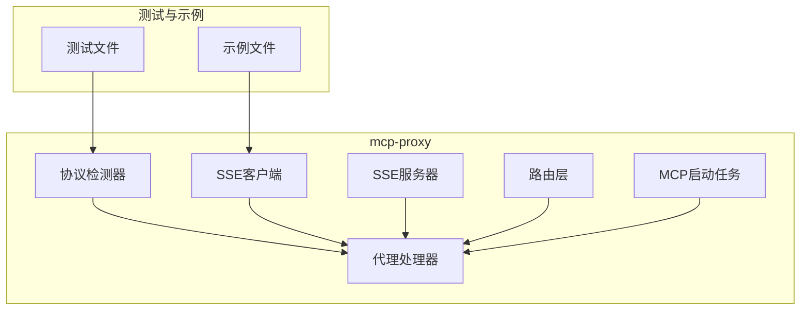
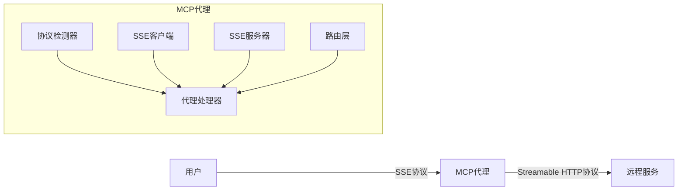
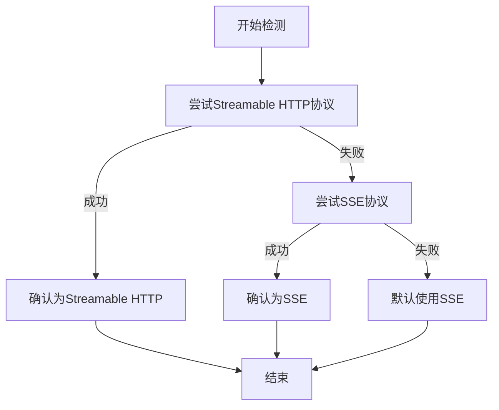
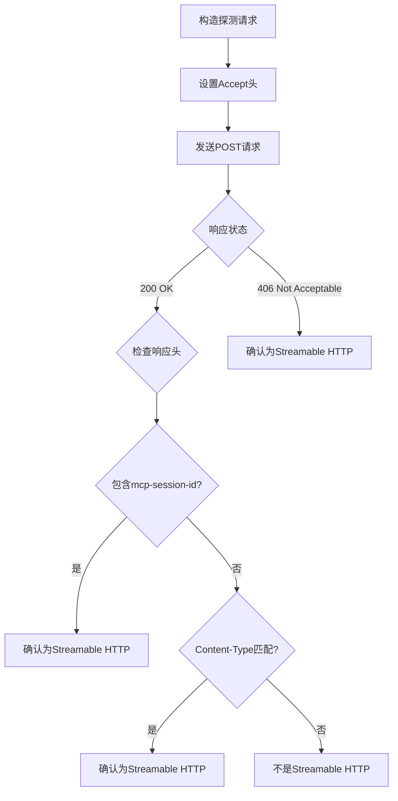
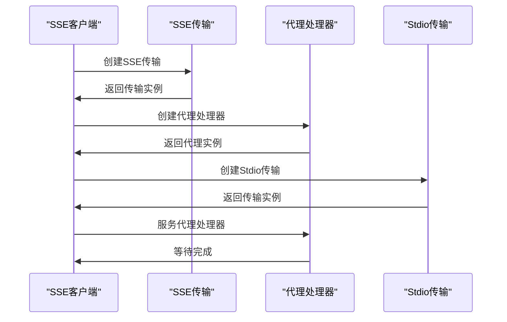
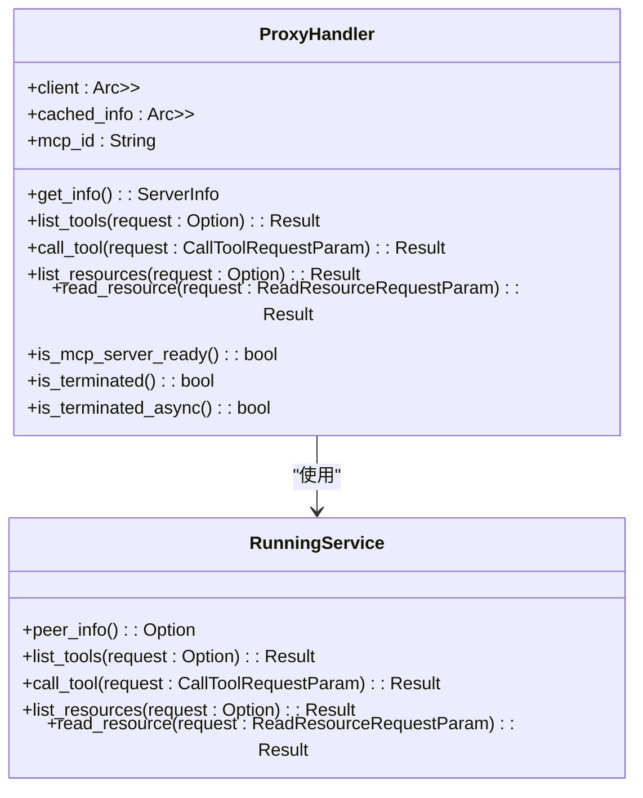
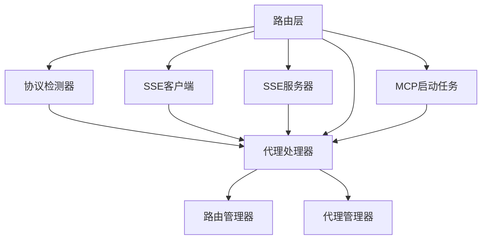

# Streamable HTTP协议支持

<cite>
**本文档引用的文件**   
- [TEST_STREAMABLE.md](file://mcp-proxy/TEST_STREAMABLE.md)
- [protocol_detector.rs](file://mcp-proxy/src/server/protocol_detector.rs)
- [sse_client.rs](file://mcp-proxy/src/client/sse_client.rs)
- [sse_server.rs](file://mcp-proxy/src/server/handlers/sse_server.rs)
- [proxy_handler.rs](file://mcp-proxy/src/proxy/proxy_handler.rs)
- [mcp_config.rs](file://mcp-proxy/src/model/mcp_config.rs)
- [mcp_router_model.rs](file://mcp-proxy/src/model/mcp_router_model.rs)
- [router_layer.rs](file://mcp-proxy/src/server/router_layer.rs)
- [mcp_start_task.rs](file://mcp-proxy/src/server/task/mcp_start_task.rs)
- [streamable_hello.py](file://mcp-proxy/fixtures/streamable_mcp/streamable_hello.py)
</cite>

## 目录
1. [引言](#引言)
2. [项目结构](#项目结构)
3. [核心组件](#核心组件)
4. [架构概述](#架构概述)
5. [详细组件分析](#详细组件分析)
6. [依赖分析](#依赖分析)
7. [性能考虑](#性能考虑)
8. [故障排除指南](#故障排除指南)
9. [结论](#结论)

## 引言
本文档深入解析MCP代理对Streamable HTTP协议的双向流式通信支持。通过分析代码库，阐述分块传输编码（chunked transfer encoding）的实现原理，以及请求与响应数据流的管道化处理机制。说明协议检测器如何识别Streamable模式的请求特征（如特定header或payload结构），并路由至对应处理器。结合TEST_STREAMABLE.md中的测试场景，描述连接复用、流式反序列化和实时消息传递的实现细节。提供客户端实现示例、性能对比数据及典型应用场景（如实时代码执行流），并给出常见问题排查指南。

## 项目结构
MCP代理项目结构清晰，主要包含以下几个核心模块：
- `mcp-proxy`: 核心代理服务，处理Streamable HTTP和SSE协议的双向通信
- `document-parser`: 文档解析服务，处理各种文档格式
- `fastembed`: 嵌入式服务
- `oss-client`: 对象存储客户端
- `voice-cli`: 语音命令行接口

核心的`mcp-proxy`模块包含处理流式通信的关键组件，如协议检测、SSE客户端/服务器、代理处理器等。



**图源**
- [protocol_detector.rs](file://mcp-proxy/src/server/protocol_detector.rs)
- [sse_client.rs](file://mcp-proxy/src/client/sse_client.rs)
- [sse_server.rs](file://mcp-proxy/src/server/handlers/sse_server.rs)
- [proxy_handler.rs](file://mcp-proxy/src/proxy/proxy_handler.rs)
- [router_layer.rs](file://mcp-proxy/src/server/router_layer.rs)
- [mcp_start_task.rs](file://mcp-proxy/src/server/task/mcp_start_task.rs)
- [TEST_STREAMABLE.md](file://mcp-proxy/TEST_STREAMABLE.md)
- [streamable_hello.py](file://mcp-proxy/fixtures/streamable_mcp/streamable_hello.py)

**本节源**
- [mcp-proxy](file://mcp-proxy)
- [TEST_STREAMABLE.md](file://mcp-proxy/TEST_STREAMABLE.md)

## 核心组件
MCP代理的核心组件包括协议检测器、SSE客户端/服务器、代理处理器和路由层。这些组件协同工作，实现Streamable HTTP协议的双向流式通信支持。

**本节源**
- [protocol_detector.rs](file://mcp-proxy/src/server/protocol_detector.rs)
- [sse_client.rs](file://mcp-proxy/src/client/sse_client.rs)
- [sse_server.rs](file://mcp-proxy/src/server/handlers/sse_server.rs)
- [proxy_handler.rs](file://mcp-proxy/src/proxy/proxy_handler.rs)
- [router_layer.rs](file://mcp-proxy/src/server/router_layer.rs)

## 架构概述
MCP代理的架构设计旨在实现高效的双向流式通信。通过协议检测器自动识别远程服务的协议类型，然后使用相应的客户端（SSE或Streamable HTTP）建立连接。代理处理器负责转发请求和响应，实现协议的透明转换。



**图源**
- [protocol_detector.rs](file://mcp-proxy/src/server/protocol_detector.rs)
- [sse_client.rs](file://mcp-proxy/src/client/sse_client.rs)
- [sse_server.rs](file://mcp-proxy/src/server/handlers/sse_server.rs)
- [proxy_handler.rs](file://mcp-proxy/src/proxy/proxy_handler.rs)
- [router_layer.rs](file://mcp-proxy/src/server/router_layer.rs)

## 详细组件分析

### 协议检测器分析
协议检测器是MCP代理的关键组件，负责自动识别远程MCP服务的协议类型。它首先尝试检测Streamable HTTP协议，然后尝试SSE协议。

#### 协议检测逻辑


**图源**
- [protocol_detector.rs](file://mcp-proxy/src/server/protocol_detector.rs#L12-L30)

#### Streamable HTTP检测
Streamable HTTP协议的检测基于以下特征：
1. Accept头包含`application/json, text/event-stream`
2. 响应头包含`mcp-session-id`
3. Content-Type为`text/event-stream`或`application/json`
4. 状态码为200或406 Not Acceptable



**图源**
- [protocol_detector.rs](file://mcp-proxy/src/server/protocol_detector.rs#L32-L112)

**本节源**
- [protocol_detector.rs](file://mcp-proxy/src/server/protocol_detector.rs)

### SSE客户端分析
SSE客户端负责连接远程SSE服务器，并将其暴露为stdio服务器。

#### SSE客户端工作流程


**图源**
- [sse_client.rs](file://mcp-proxy/src/client/sse_client.rs#L22-L79)

**本节源**
- [sse_client.rs](file://mcp-proxy/src/client/sse_client.rs)

### 代理处理器分析
代理处理器是MCP代理的核心，负责转发请求和响应，实现协议的透明转换。

#### 代理处理器类图


**图源**
- [proxy_handler.rs](file://mcp-proxy/src/proxy/proxy_handler.rs#L18-L509)

**本节源**
- [proxy_handler.rs](file://mcp-proxy/src/proxy/proxy_handler.rs)

## 依赖分析
MCP代理的组件之间存在紧密的依赖关系，通过清晰的接口实现松耦合。



**图源**
- [protocol_detector.rs](file://mcp-proxy/src/server/protocol_detector.rs)
- [sse_client.rs](file://mcp-proxy/src/client/sse_client.rs)
- [sse_server.rs](file://mcp-proxy/src/server/handlers/sse_server.rs)
- [proxy_handler.rs](file://mcp-proxy/src/proxy/proxy_handler.rs)
- [router_layer.rs](file://mcp-proxy/src/server/router_layer.rs)
- [mcp_start_task.rs](file://mcp-proxy/src/server/task/mcp_start_task.rs)

**本节源**
- [go.mod](file://mcp-proxy/Cargo.toml)
- [go.sum](file://mcp-proxy/Cargo.lock)

## 性能考虑
MCP代理在设计时充分考虑了性能因素，通过以下机制实现高效通信：
1. 连接复用：保持长连接，减少连接建立开销
2. 异步处理：使用Tokio异步运行时，提高并发处理能力
3. 缓存机制：缓存服务器信息，减少重复查询
4. 流式处理：支持分块传输，减少内存占用

## 故障排除指南
### 1. 连接失败
```bash
# 检查服务是否启动
curl http://0.0.0.0:8000/mcp/health
```

### 2. 协议不匹配
- 确保mcpProtocol字段设置为"Stream"
- 远程服务必须支持Streamable HTTP协议

### 3. 认证问题
如果远程服务需要认证:
```json
{
  "mcpId": "test-streamable-service",
  "mcpJsonConfig": "{
    \"mcpServers\": {
      \"test-service\": {
        \"url\": \"http://0.0.0.0:8000/mcp\",
        \"authToken\": \"your-token\"
      }
    }
  }",
  "mcpType": "Persistent",
  "mcpProtocol": "Stream"
}
```

**本节源**
- [TEST_STREAMABLE.md](file://mcp-proxy/TEST_STREAMABLE.md#L118-L143)
- [mcp_error.rs](file://mcp-proxy/src/mcp_error.rs)

## 结论
MCP代理通过精心设计的架构和组件，实现了对Streamable HTTP协议的全面支持。协议检测器能够自动识别远程服务的协议类型，代理处理器实现了高效的双向流式通信。通过SSE客户端/服务器和路由层的协同工作，MCP代理能够透明地转换不同协议，为用户提供一致的接口。该设计具有良好的扩展性和性能，适用于各种实时通信场景。