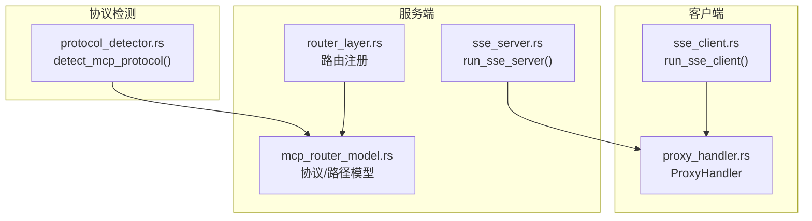
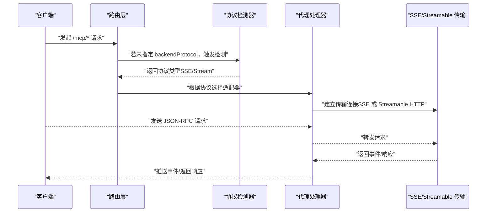
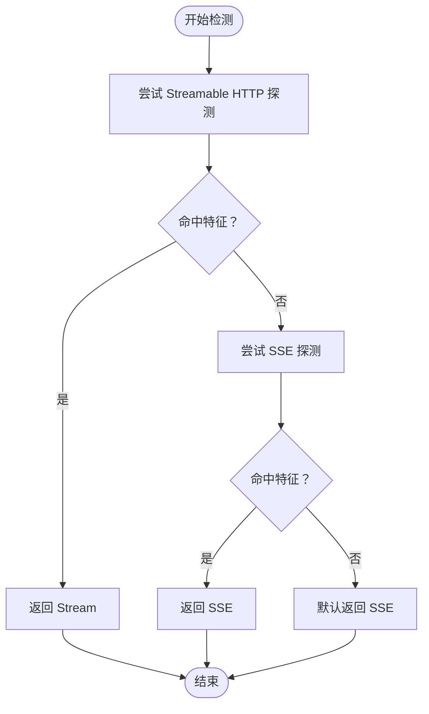
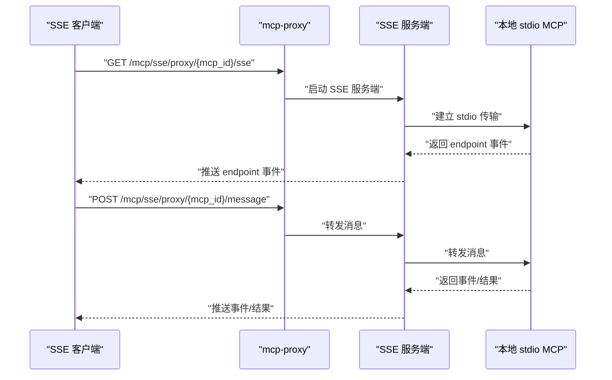
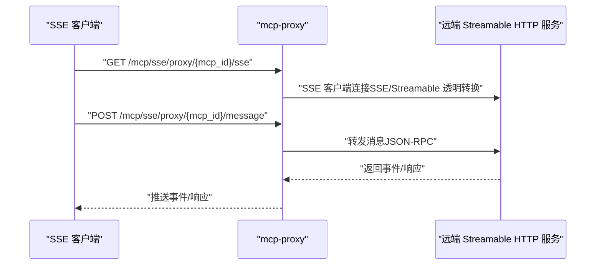
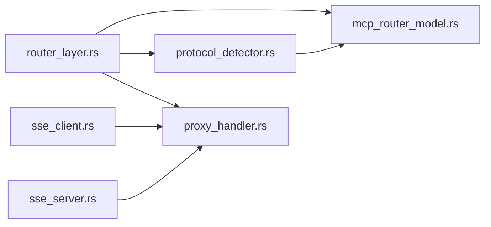
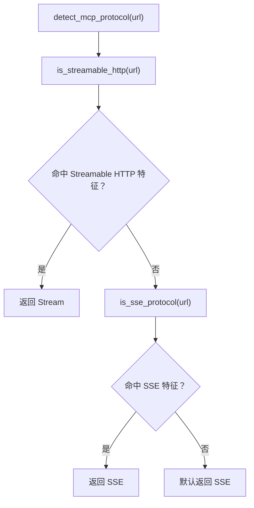
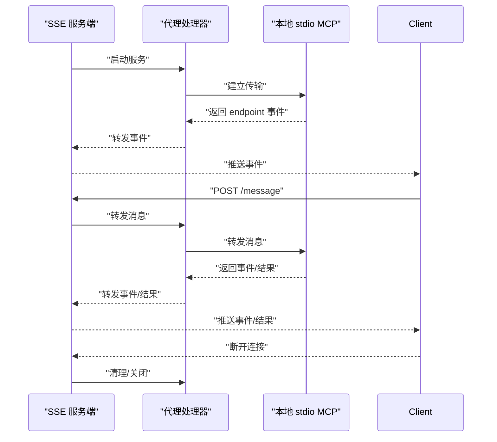
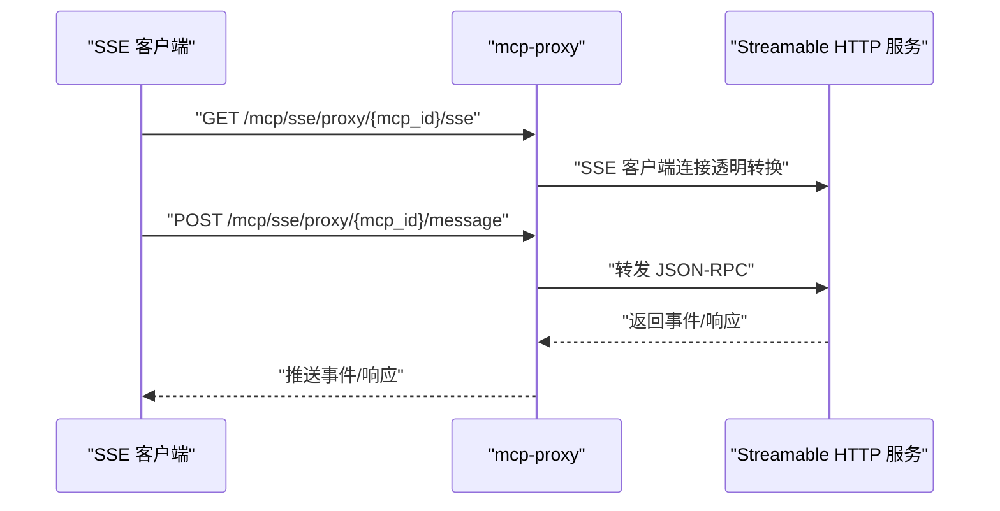

# 协议支持

<cite>
**本文引用的文件**
- [protocol_detector.rs](file://mcp-proxy/src/server/protocol_detector.rs)
- [sse_client.rs](file://mcp-proxy/src/client/sse_client.rs)
- [sse_server.rs](file://mcp-proxy/src/server/handlers/sse_server.rs)
- [mcp_config.rs](file://mcp-proxy/src/model/mcp_config.rs)
- [mcp_router_model.rs](file://mcp-proxy/src/model/mcp_router_model.rs)
- [router_layer.rs](file://mcp-proxy/src/server/router_layer.rs)
- [proxy_handler.rs](file://mcp-proxy/src/proxy/proxy_handler.rs)
- [protocol-auto-detection.md](file://mcp-proxy/docs/protocol-auto-detection.md)
- [TEST_STREAMABLE.md](file://mcp-proxy/TEST_STREAMABLE.md)
- [mcp_sse_test.rs](file://mcp-proxy/src/tests/mcp_sse_test.rs)
- [test_sse_client.py](file://mcp-proxy/test_sse_client.py)
- [streamable_hello.py](file://mcp-proxy/fixtures/streamable_mcp/streamable_hello.py)
</cite>

## 目录
1. [简介](#简介)
2. [项目结构](#项目结构)
3. [核心组件](#核心组件)
4. [架构总览](#架构总览)
5. [详细组件分析](#详细组件分析)
6. [依赖关系分析](#依赖关系分析)
7. [性能考量](#性能考量)
8. [故障排查指南](#故障排查指南)
9. [结论](#结论)
10. [附录](#附录)

## 简介
本文件系统性说明 mcp-proxy 对 Server-Sent Events（SSE）与 Streamable HTTP 协议的支持机制，覆盖协议自动检测、SSE 事件流的建立/维持/关闭、Streamable HTTP 的双向通信模式、消息序列化/反序列化处理、协议选择建议、性能对比与适用场景，并提供测试路径与调试方法。

## 项目结构
围绕协议支持的关键模块分布如下：
- 协议检测：基于探测请求判断后端协议类型
- 客户端适配：SSE 客户端封装，面向远端 SSE 或 Streamable HTTP
- 服务端适配：SSE 服务端封装，面向本地 stdio MCP 并对外暴露 SSE
- 路由与协议模型：定义路由前缀、协议枚举、路径生成与解析
- 代理处理器：统一转发 MCP 方法调用，缓存能力信息，处理通知
- 文档与测试：自动检测文档、Streamable 测试指南、Python/SSE 客户端脚本

图表来源
- [protocol_detector.rs](file://mcp-proxy/src/server/protocol_detector.rs#L1-L184)
- [sse_client.rs](file://mcp-proxy/src/client/sse_client.rs#L1-L80)
- [sse_server.rs](file://mcp-proxy/src/server/handlers/sse_server.rs#L1-L95)
- [router_layer.rs](file://mcp-proxy/src/server/router_layer.rs#L1-L83)
- [mcp_router_model.rs](file://mcp-proxy/src/model/mcp_router_model.rs#L1-L120)

章节来源
- [protocol_detector.rs](file://mcp-proxy/src/server/protocol_detector.rs#L1-L184)
- [mcp_router_model.rs](file://mcp-proxy/src/model/mcp_router_model.rs#L1-L120)
- [router_layer.rs](file://mcp-proxy/src/server/router_layer.rs#L1-L83)

## 核心组件
- 协议自动检测器：通过探测请求识别后端是 Streamable HTTP 还是 SSE
- SSE 客户端：将远端 SSE/Streamable HTTP 适配为本地 stdio 传输
- SSE 服务端：将本地 stdio MCP 适配为 SSE 服务端
- 路由与协议模型：定义路由前缀、协议枚举、路径生成与解析
- 代理处理器：统一转发 MCP 方法调用，缓存能力信息，处理进度/取消等通知
- 文档与测试：自动检测说明、Streamable 测试指南、Python/SSE 客户端脚本

章节来源
- [protocol_detector.rs](file://mcp-proxy/src/server/protocol_detector.rs#L1-L184)
- [sse_client.rs](file://mcp-proxy/src/client/sse_client.rs#L1-L80)
- [sse_server.rs](file://mcp-proxy/src/server/handlers/sse_server.rs#L1-L95)
- [mcp_router_model.rs](file://mcp-proxy/src/model/mcp_router_model.rs#L340-L420)
- [proxy_handler.rs](file://mcp-proxy/src/proxy/proxy_handler.rs#L1-L120)
- [protocol-auto-detection.md](file://mcp-proxy/docs/protocol-auto-detection.md#L1-L175)
- [TEST_STREAMABLE.md](file://mcp-proxy/TEST_STREAMABLE.md#L1-L153)

## 架构总览
mcp-proxy 通过“协议自动检测 + 传输适配 + 路由层 + 代理处理器”的组合，实现对 SSE 与 Streamable HTTP 的透明代理与转换。

图表来源
- [protocol_detector.rs](file://mcp-proxy/src/server/protocol_detector.rs#L1-L184)
- [router_layer.rs](file://mcp-proxy/src/server/router_layer.rs#L1-L83)
- [proxy_handler.rs](file://mcp-proxy/src/proxy/proxy_handler.rs#L1-L120)

## 详细组件分析

### 协议自动检测机制
- 检测顺序：先尝试 Streamable HTTP，再尝试 SSE；若均失败，默认回退为 SSE
- Streamable HTTP 特征：
  - 探测请求携带 Accept: application/json, text/event-stream
  - 若响应头包含 mcp-session-id 或返回 406 Not Acceptable，或 Content-Type 包含 text/event-stream/application/json 且状态成功，则判定为 Streamable HTTP
- SSE 特征：
  - 探测请求携带 Accept: text/event-stream
  - 若响应头 Content-Type 为 text/event-stream 且状态成功，则判定为 SSE
- 超时与日志：探测超时 5 秒，日志记录检测过程与结果

图表来源
- [protocol_detector.rs](file://mcp-proxy/src/server/protocol_detector.rs#L1-L184)
- [protocol-auto-detection.md](file://mcp-proxy/docs/protocol-auto-detection.md#L1-L175)

章节来源
- [protocol_detector.rs](file://mcp-proxy/src/server/protocol_detector.rs#L1-L184)
- [protocol-auto-detection.md](file://mcp-proxy/docs/protocol-auto-detection.md#L1-L175)

### SSE 服务器端事件流
- SSE 服务端封装：将本地 stdio MCP 适配为 SSE 服务端，提供 /sse 与 /message 端点
- 连接维持：SSE 服务端配置 keep-alive，支持 Ctrl+C 关闭
- 事件推送：通过 SSE 推送 MCP 事件（如 endpoint、progress、cancelled 等）

图表来源
- [sse_server.rs](file://mcp-proxy/src/server/handlers/sse_server.rs#L1-L95)
- [mcp_router_model.rs](file://mcp-proxy/src/model/mcp_router_model.rs#L340-L420)

章节来源
- [sse_server.rs](file://mcp-proxy/src/server/handlers/sse_server.rs#L1-L95)
- [mcp_router_model.rs](file://mcp-proxy/src/model/mcp_router_model.rs#L340-L420)

### Streamable HTTP 双向通信模式
- Streamable HTTP 客户端：通过 POST 初始化/消息通道，配合 SSE 服务端的 message 端点进行请求-响应交互
- 会话与认证：支持在 URL 配置中设置 auth_token 与 headers，用于后端认证
- 透明代理：SSE 客户端可连接远端 Streamable HTTP 服务，mcp-proxy 内部以 Streamable HTTP 协议与远端交互

图表来源
- [mcp_router_model.rs](file://mcp-proxy/src/model/mcp_router_model.rs#L120-L220)
- [TEST_STREAMABLE.md](file://mcp-proxy/TEST_STREAMABLE.md#L1-L153)

章节来源
- [mcp_router_model.rs](file://mcp-proxy/src/model/mcp_router_model.rs#L120-L220)
- [TEST_STREAMABLE.md](file://mcp-proxy/TEST_STREAMABLE.md#L1-L153)

### 消息序列化与反序列化
- 请求/响应格式：遵循 JSON-RPC 2.0，字段包括 jsonrpc、id、method、params
- SSE 侧：通过 /message 端点接收 JSON-RPC 请求，经代理处理器转发至后端
- Streamable 侧：通过 POST 初始化/消息通道，配合 SSE 服务端的 message 端点进行交互
- Python 客户端脚本演示了 SSE 事件监听、endpoint 事件解析、message 端点发送 JSON-RPC 的流程

章节来源
- [mcp_sse_test.rs](file://mcp-proxy/src/tests/mcp_sse_test.rs#L1-L120)
- [test_sse_client.py](file://mcp-proxy/test_sse_client.py#L1-L112)

### 协议选择建议、性能对比与适用场景
- 选择建议
  - 若后端为 Streamable HTTP：优先使用 SSE 客户端 + Streamable HTTP 后端（透明代理）
  - 若后端为 SSE：直接使用 SSE 客户端 + SSE 后端
  - 若协议不确定：启用自动检测；若协议稳定且固定，建议手动指定以减少首次连接延迟
- 性能对比
  - 自动检测会增加首次连接延迟（约 1–5 秒），且检测结果不缓存
  - SSE 适合长连接、事件推送；Streamable HTTP 适合请求-响应与流式消息
- 适用场景
  - SSE：事件驱动、实时通知、长连接场景
  - Streamable HTTP：与支持 Streamable HTTP 的 MCP 服务对接，便于透明代理

章节来源
- [protocol-auto-detection.md](file://mcp-proxy/docs/protocol-auto-detection.md#L108-L175)
- [TEST_STREAMABLE.md](file://mcp-proxy/TEST_STREAMABLE.md#L1-L153)

## 依赖关系分析
- 路由层根据请求路径前缀（/mcp/sse、/mcp/stream）选择协议并交由动态路由器处理
- 协议检测器在未指定 backendProtocol 时介入，决定后端传输类型
- 代理处理器统一转发 MCP 方法调用，缓存服务能力信息，处理通知事件
- SSE 客户端/服务端分别负责将远端 SSE/Streamable HTTP 与本地 stdio 传输对接

图表来源
- [router_layer.rs](file://mcp-proxy/src/server/router_layer.rs#L1-L83)
- [mcp_router_model.rs](file://mcp-proxy/src/model/mcp_router_model.rs#L1-L120)
- [protocol_detector.rs](file://mcp-proxy/src/server/protocol_detector.rs#L1-L184)
- [proxy_handler.rs](file://mcp-proxy/src/proxy/proxy_handler.rs#L1-L120)
- [sse_client.rs](file://mcp-proxy/src/client/sse_client.rs#L1-L80)
- [sse_server.rs](file://mcp-proxy/src/server/handlers/sse_server.rs#L1-L95)

章节来源
- [router_layer.rs](file://mcp-proxy/src/server/router_layer.rs#L1-L83)
- [mcp_router_model.rs](file://mcp-proxy/src/model/mcp_router_model.rs#L1-L120)
- [protocol_detector.rs](file://mcp-proxy/src/server/protocol_detector.rs#L1-L184)
- [proxy_handler.rs](file://mcp-proxy/src/proxy/proxy_handler.rs#L1-L120)
- [sse_client.rs](file://mcp-proxy/src/client/sse_client.rs#L1-L80)
- [sse_server.rs](file://mcp-proxy/src/server/handlers/sse_server.rs#L1-L95)

## 性能考量
- 首次连接延迟：自动检测引入 1–5 秒延迟，检测不缓存
- 连接复用：SSE 为长连接，Streamable HTTP 通过会话头（如 mcp-session-id）维持会话
- 超时与重试：URL 配置支持连接超时、最大重试次数与退避策略
- 日志与可观测性：检测过程与关键事件均有日志输出，便于定位问题

章节来源
- [protocol-auto-detection.md](file://mcp-proxy/docs/protocol-auto-detection.md#L120-L175)
- [mcp_router_model.rs](file://mcp-proxy/src/model/mcp_router_model.rs#L180-L220)

## 故障排查指南
- 协议检测失败
  - 确认后端是否支持 SSE 或 Streamable HTTP
  - 手动指定 backendProtocol 以跳过检测
  - 查看日志中检测过程与响应头信息
- SSE 连接问题
  - 使用 Python 客户端脚本验证 endpoint 事件与 message 端点
  - 检查 /mcp/sse/proxy/{mcp_id}/sse 与 /mcp/sse/proxy/{mcp_id}/message 是否可达
- Streamable HTTP 问题
  - 确认远端服务 URL、认证头与 headers 设置
  - 使用测试脚本与 curl 验证初始化与工具列表调用
- 常见错误
  - 406 Not Acceptable：表明后端期望特定 Accept 头（典型 Streamable HTTP 特征）
  - Content-Type 不匹配：检查后端是否返回 text/event-stream 或 application/json

章节来源
- [protocol-auto-detection.md](file://mcp-proxy/docs/protocol-auto-detection.md#L108-L175)
- [TEST_STREAMABLE.md](file://mcp-proxy/TEST_STREAMABLE.md#L1-L153)
- [test_sse_client.py](file://mcp-proxy/test_sse_client.py#L1-L112)
- [mcp_sse_test.rs](file://mcp-proxy/src/tests/mcp_sse_test.rs#L1-L120)

## 结论
mcp-proxy 通过协议自动检测与传输适配，实现了对 SSE 与 Streamable HTTP 的透明代理与转换。SSE 适合事件驱动与长连接场景，Streamable HTTP 适合请求-响应与流式消息。合理选择协议、利用自动检测与手动指定相结合，可在保证兼容性的前提下优化性能与稳定性。

## 附录

### 协议自动检测流程（代码级）

图表来源
- [protocol_detector.rs](file://mcp-proxy/src/server/protocol_detector.rs#L1-L184)

### SSE 事件流建立/维持/关闭（代码级）

图表来源
- [sse_server.rs](file://mcp-proxy/src/server/handlers/sse_server.rs#L1-L95)
- [proxy_handler.rs](file://mcp-proxy/src/proxy/proxy_handler.rs#L1-L120)

### Streamable HTTP 双向通信（代码级）

图表来源
- [mcp_router_model.rs](file://mcp-proxy/src/model/mcp_router_model.rs#L120-L220)
- [TEST_STREAMABLE.md](file://mcp-proxy/TEST_STREAMABLE.md#L1-L153)

### 实际测试路径与调试方法
- 自动检测与状态检查
  - 使用文档中的示例请求进行状态检查与协议检测
  - 观察日志中检测结果与协议判定
- Streamable HTTP 测试
  - 启动示例 Streamable HTTP 服务（Python 脚本）
  - 使用测试脚本与 curl 验证初始化、工具列表与工具调用
- SSE 客户端测试
  - 使用 Python 客户端脚本监听 SSE 事件、解析 endpoint、发送 message
  - 在 Rust 测试中验证状态检查与客户端行为

章节来源
- [protocol-auto-detection.md](file://mcp-proxy/docs/protocol-auto-detection.md#L1-L175)
- [TEST_STREAMABLE.md](file://mcp-proxy/TEST_STREAMABLE.md#L1-L153)
- [test_sse_client.py](file://mcp-proxy/test_sse_client.py#L1-L112)
- [mcp_sse_test.rs](file://mcp-proxy/src/tests/mcp_sse_test.rs#L1-L120)
- [streamable_hello.py](file://mcp-proxy/fixtures/streamable_mcp/streamable_hello.py#L1-L10)