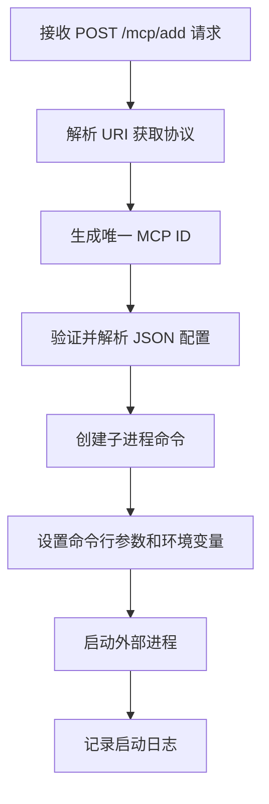
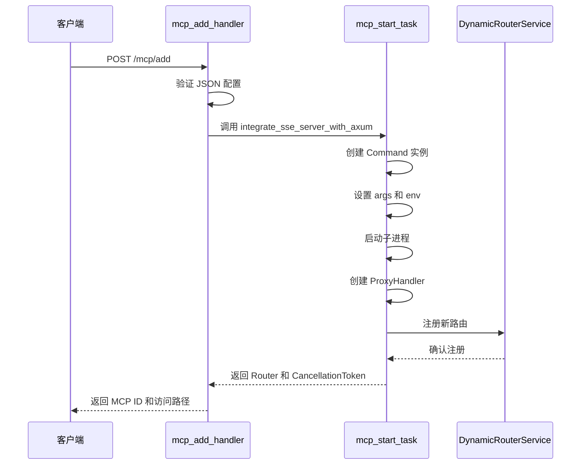
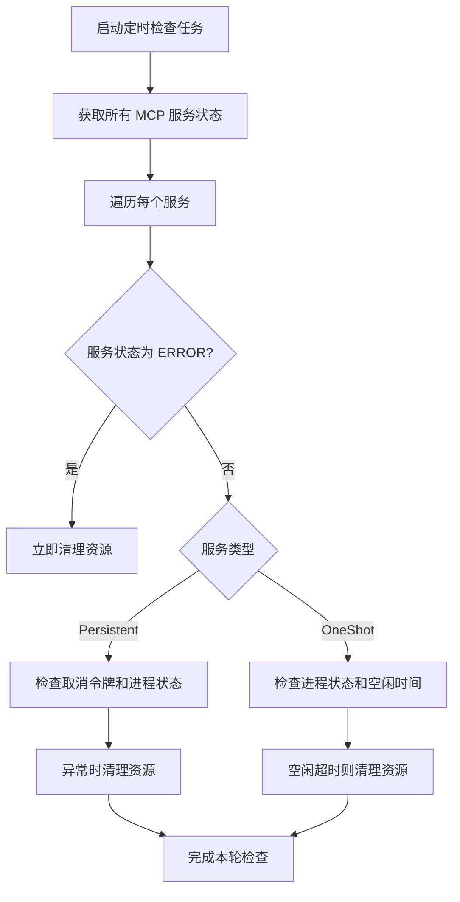
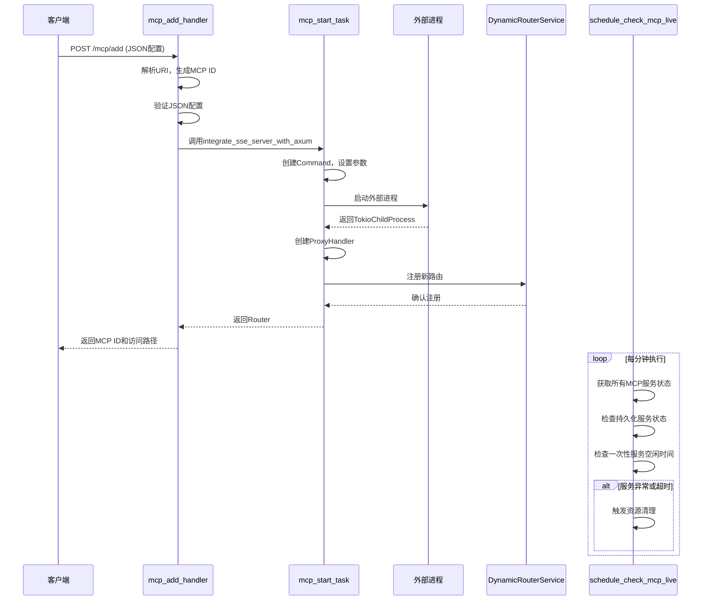
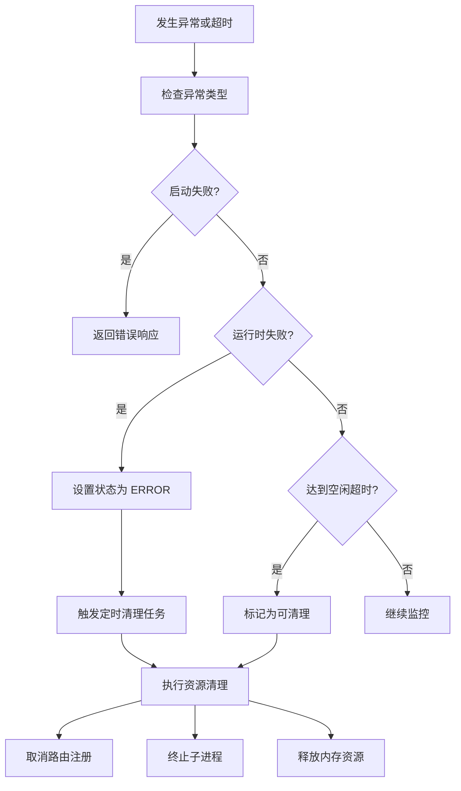

# 插件生命周期管理

<cite>
**本文档中引用的文件**  
- [mcp_start_task.rs](file://mcp-proxy/src/server/task/mcp_start_task.rs)
- [mcp_add_handler.rs](file://mcp-proxy/src/server/handlers/mcp_add_handler.rs)
- [schedule_check_mcp_live.rs](file://mcp-proxy/src/server/task/schedule_check_mcp_live.rs)
- [mcp_router_model.rs](file://mcp-proxy/src/model/mcp_router_model.rs)
- [mcp_config.rs](file://mcp-proxy/src/model/mcp_config.rs)
</cite>

## 目录
1. [简介](#简介)
2. [核心组件](#核心组件)
3. [MCP配置解析与进程启动](#mcp配置解析与进程启动)
4. [服务初始化流程](#服务初始化流程)
5. [心跳检测与存活监控](#心跳检测与存活监控)
6. [完整时序图](#完整时序图)
7. [异常处理与资源清理](#异常处理与资源清理)
8. [支持的脚本类型与执行环境](#支持的脚本类型与执行环境)

## 简介
本文档详细阐述了MCP（Modular Control Plane）插件的生命周期管理机制。系统通过REST API接收插件配置，异步启动外部进程，并持续监控其运行状态。整个生命周期涵盖配置解析、进程启动、健康检查、资源清理等关键环节，确保插件服务的稳定性和可靠性。

## 核心组件
系统主要由三个核心模块构成：`mcp_add_handler.rs`负责接收和验证配置请求；`mcp_start_task.rs`负责解析配置并启动外部进程；`schedule_check_mcp_live.rs`负责定期检查插件的存活状态并执行资源清理。

**本节来源**
- [mcp_start_task.rs](file://mcp-proxy/src/server/task/mcp_start_task.rs)
- [mcp_add_handler.rs](file://mcp-proxy/src/server/handlers/mcp_add_handler.rs)
- [schedule_check_mcp_live.rs](file://mcp-proxy/src/server/task/schedule_check_mcp_live.rs)

## MCP配置解析与进程启动
当收到`POST /mcp/add`请求时，系统首先通过`mcp_add_handler.rs`中的`add_route_handler`函数处理请求。该函数从URI中提取协议类型，并生成唯一的MCP ID。随后，它调用`McpServerCommandConfig::try_from`方法将传入的JSON配置解析为内部结构体。

解析成功后，系统调用`integrate_sse_server_with_axum`函数（定义于`mcp_start_task.rs`）来启动外部进程。该函数使用`tokio::process::Command`创建子进程命令，设置命令行参数和环境变量，并最终执行`tokio_process`。在启动过程中，系统会记录完整的命令字符串，便于调试和复现。



**本节来源**
- [mcp_add_handler.rs](file://mcp-proxy/src/server/handlers/mcp_add_handler.rs#L30-L85)
- [mcp_start_task.rs](file://mcp-proxy/src/server/task/mcp_start_task.rs#L45-L80)
- [mcp_router_model.rs](file://mcp-proxy/src/model/mcp_router_model.rs#L38-L76)

## 服务初始化流程
服务初始化流程始于`mcp_add_handler.rs`对传入配置的验证。系统要求JSON配置中必须包含恰好一个MCP插件定义，否则将返回错误。验证通过后，系统根据协议类型（SSE或Stream）选择相应的服务集成方式。

对于SSE协议，系统创建`SseServer`实例，并将其与`ProxyHandler`关联。`ProxyHandler`作为代理，将外部MCP服务与内部HTTP接口桥接。初始化完成后，系统将新的路由注册到全局`DynamicRouterService`中，并返回包含MCP ID和访问路径的响应。



**本节来源**
- [mcp_add_handler.rs](file://mcp-proxy/src/server/handlers/mcp_add_handler.rs#L50-L75)
- [mcp_start_task.rs](file://mcp-proxy/src/server/task/mcp_start_task.rs#L100-L140)
- [mcp_router_model.rs](file://mcp-proxy/src/model/mcp_router_model.rs#L283-L325)

## 心跳检测与存活监控
`schedule_check_mcp_live.rs`文件定义了定期检查MCP服务存活状态的任务。该任务通过`proxy_manager`获取所有MCP服务状态，并根据服务类型进行差异化处理。

对于`Persistent`类型的服务，系统检查取消令牌是否被触发或子进程是否已终止。对于`OneShot`类型的服务，系统不仅检查进程状态，还监控其空闲时间。如果一次性任务超过5分钟未被访问，系统将自动清理其资源。此外，任何状态为`ERROR`的服务都会被立即清理。



**本节来源**
- [schedule_check_mcp_live.rs](file://mcp-proxy/src/server/task/schedule_check_mcp_live.rs#L10-L80)
- [mcp_config.rs](file://mcp-proxy/src/model/mcp_config.rs#L0-L71)

## 完整时序图
以下时序图展示了从客户端发起请求到服务就绪的完整流程：



**本节来源**
- [mcp_add_handler.rs](file://mcp-proxy/src/server/handlers/mcp_add_handler.rs)
- [mcp_start_task.rs](file://mcp-proxy/src/server/task/mcp_start_task.rs)
- [schedule_check_mcp_live.rs](file://mcp-proxy/src/server/task/schedule_check_mcp_live.rs)

## 异常处理与资源清理
系统实现了完善的异常处理和资源清理机制。当进程启动失败时，`mcp_add_handler.rs`会捕获错误并返回详细的错误信息。对于已启动但后续失败的进程，`schedule_check_mcp_live.rs`中的监控任务会检测到其异常状态并触发清理。

资源清理包括取消路由注册、释放`CancellationToken`、关闭子进程以及从全局管理器中移除服务状态。系统还实现了启动超时处理，虽然具体超时时间未在代码中明确指定，但通过异步任务的自然超时机制来防止无限等待。



**本节来源**
- [mcp_add_handler.rs](file://mcp-proxy/src/server/handlers/mcp_add_handler.rs#L70-L85)
- [mcp_start_task.rs](file://mcp-proxy/src/server/task/mcp_start_task.rs#L141-L182)
- [schedule_check_mcp_live.rs](file://mcp-proxy/src/server/task/schedule_check_mcp_live.rs#L50-L80)

## 支持的脚本类型与执行环境
根据代码库中的测试文件，系统支持多种脚本类型，包括JavaScript、TypeScript和Python。这些脚本通过外部命令执行，例如使用`npx`运行Node.js脚本，或直接调用Python解释器。

执行环境通过配置中的`env`字段进行设置，允许为每个MCP服务指定独立的环境变量。例如，可以为百度地图MCP设置`BAIDU_MAP_API_KEY`环境变量。系统还支持复杂的执行场景，如导入第三方库（lodash、axios等）和处理参数传递。

```mermaid
erDiagram
MCP_CONFIG ||--o{ ENV_VAR : 包含
MCP_CONFIG ||--o{ ARG : 包含
MCP_CONFIG }|--|| SCRIPT_TYPE : 确定
class MCP_CONFIG {
+String command
+Vec<String> args
+HashMap<String, String> env
}
class ENV_VAR {
+String key
+String value
}
class ARG {
+String value
}
class SCRIPT_TYPE {
+JS
+TS
+Python
}
```

**本节来源**
- [mcp_router_model.rs](file://mcp-proxy/src/model/mcp_router_model.rs#L327-L357)
- [run_code_advanced_bench.rs](file://mcp-proxy/benches/run_code_advanced_bench.rs#L24-L85)
- [mcp_start_task.rs](file://mcp-proxy/src/server/task/mcp_start_task.rs#L60-L70)