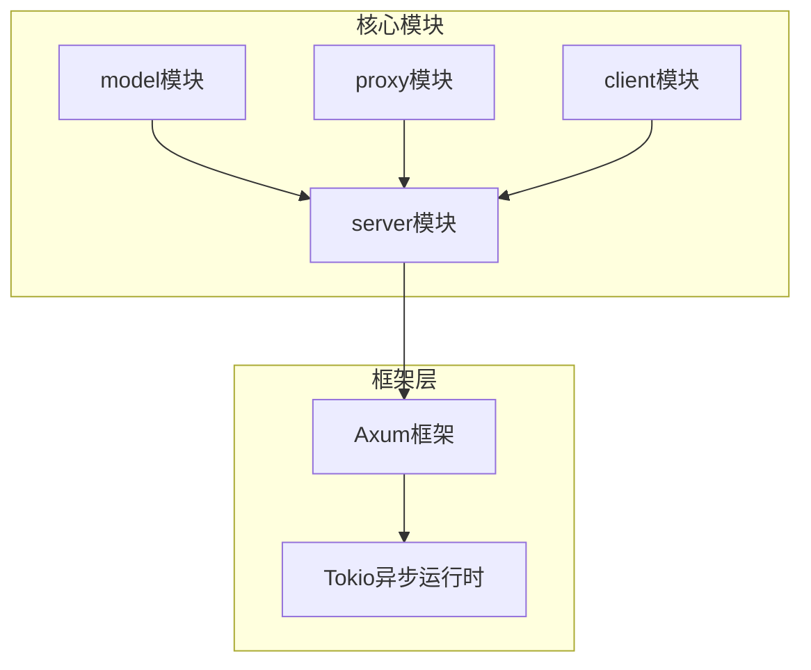
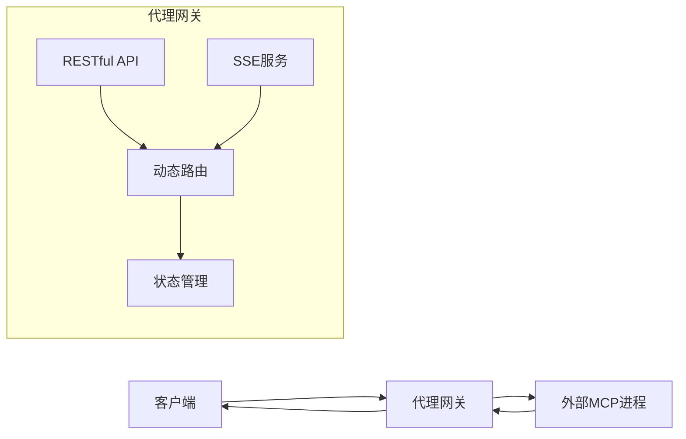
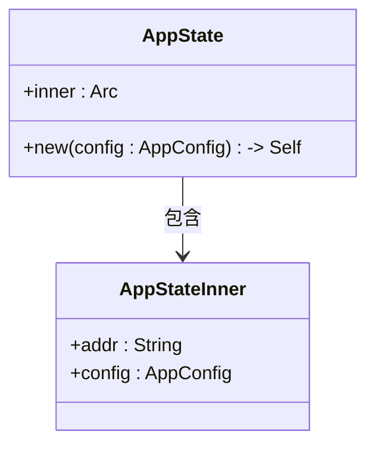
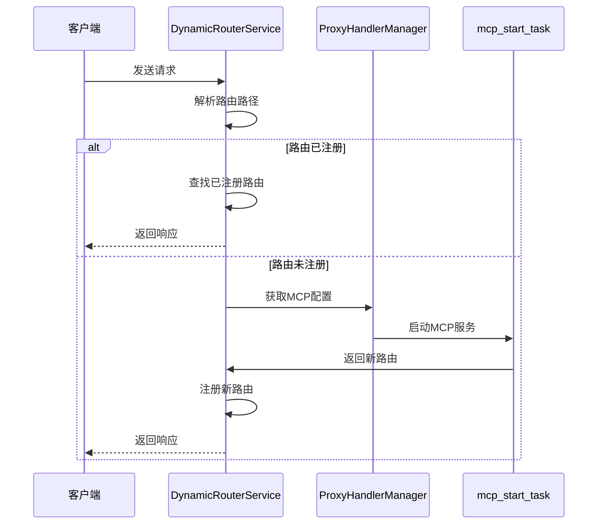
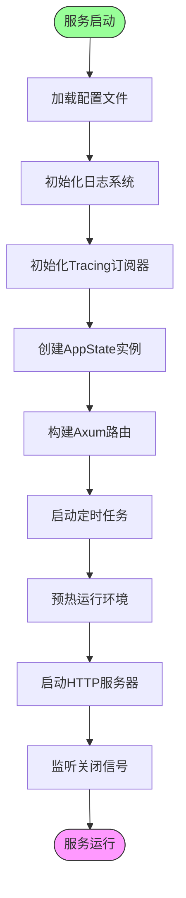
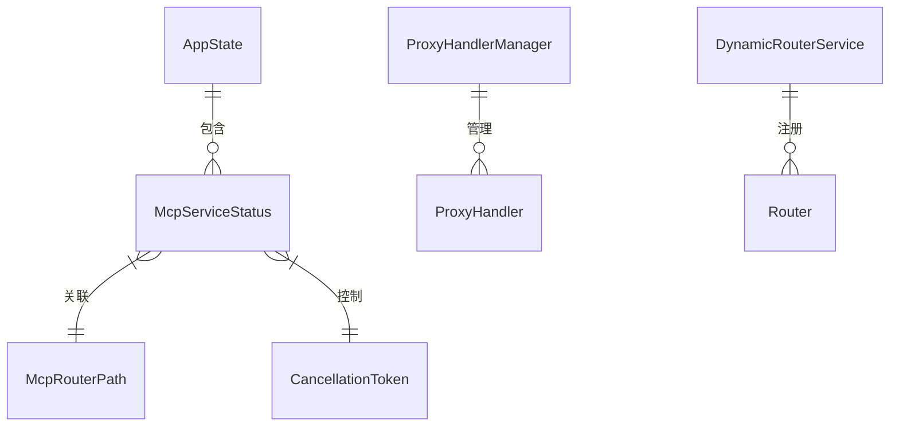

# 服务架构

<cite>
**本文档引用的文件**
- [main.rs](file://mcp-proxy/src/main.rs)
- [app_state_model.rs](file://mcp-proxy/src/model/app_state_model.rs)
- [global.rs](file://mcp-proxy/src/model/global.rs)
- [mcp_dynamic_router_service.rs](file://mcp-proxy/src/server/mcp_dynamic_router_service.rs)
- [router_layer.rs](file://mcp-proxy/src/server/router_layer.rs)
- [mcp_start_task.rs](file://mcp-proxy/src/server/task/mcp_start_task.rs)
- [sse_server.rs](file://mcp-proxy/src/server/handlers/sse_server.rs)
- [mod.rs](file://mcp-proxy/src/model/mod.rs)
</cite>

## 目录
1. [项目结构](#项目结构)
2. [核心组件](#核心组件)
3. [架构概述](#架构概述)
4. [详细组件分析](#详细组件分析)
5. [依赖分析](#依赖分析)
6. [性能考虑](#性能考虑)
7. [故障排除指南](#故障排除指南)
8. [结论](#结论)

## 项目结构

本项目采用模块化设计，主要包含以下核心目录：

- `src/model`：定义系统核心数据结构和全局状态
- `src/server`：包含服务器路由、中间件和任务调度逻辑
- `src/proxy`：MCP代理处理器实现
- `src/client`：SSE客户端相关实现

系统通过Axum框架构建RESTful API服务，结合SSE（Server-Sent Events）实现实时通信能力。

**Diagram sources**
- [main.rs](file://mcp-proxy/src/main.rs#L1-L127)
- [mod.rs](file://mcp-proxy/src/model/mod.rs#L1-L17)

**Section sources**
- [main.rs](file://mcp-proxy/src/main.rs#L1-L127)
- [mod.rs](file://mcp-proxy/src/model/mod.rs#L1-L17)

## 核心组件

系统核心组件包括AppState全局状态管理器、DynamicRouterService动态路由服务、ProxyHandlerManager代理处理器管理器等。这些组件协同工作，实现了MCP代理服务的动态路由和状态管理功能。

**Section sources**
- [app_state_model.rs](file://mcp-proxy/src/model/app_state_model.rs#L1-L33)
- [global.rs](file://mcp-proxy/src/model/global.rs#L1-L206)

## 架构概述

系统采用基于Axum框架的RESTful API架构，集成SSE实时通信功能。通过Tokio异步运行时实现高性能并发处理，利用DashMap实现线程安全的状态管理。

**Diagram sources**
- [main.rs](file://mcp-proxy/src/main.rs#L1-L127)
- [router_layer.rs](file://mcp-proxy/src/server/router_layer.rs#L1-L80)

## 详细组件分析

### AppState全局状态管理器分析

AppState通过Arc智能指针和DashMap哈希表实现线程安全的全局状态管理，确保多个McpServiceStatus实例的安全维护。

**Diagram sources**
- [app_state_model.rs](file://mcp-proxy/src/model/app_state_model.rs#L1-L33)

**Section sources**
- [app_state_model.rs](file://mcp-proxy/src/model/app_state_model.rs#L1-L33)

### DynamicRouterService动态路由分析

DynamicRouterService实现运行时动态路由注入功能，与ProxyHandlerManager协同工作，实现灵活的路由管理。

**Diagram sources**
- [mcp_dynamic_router_service.rs](file://mcp-proxy/src/server/mcp_dynamic_router_service.rs#L1-L118)
- [mcp_start_task.rs](file://mcp-proxy/src/server/task/mcp_start_task.rs#L1-L43)

**Section sources**
- [mcp_dynamic_router_service.rs](file://mcp-proxy/src/server/mcp_dynamic_router_service.rs#L1-L118)
- [mcp_start_task.rs](file://mcp-proxy/src/server/task/mcp_start_task.rs#L1-L43)

### 服务启动流程分析

系统启动时，通过Tokio异步运行时初始化各组件，按照特定顺序完成组件装配。

**Diagram sources**
- [main.rs](file://mcp-proxy/src/main.rs#L1-L127)

**Section sources**
- [main.rs](file://mcp-proxy/src/main.rs#L1-L127)

## 依赖分析

系统依赖关系清晰，各模块职责分离，通过静态全局变量实现跨模块状态共享。

**Diagram sources**
- [global.rs](file://mcp-proxy/src/model/global.rs#L1-L206)

**Section sources**
- [global.rs](file://mcp-proxy/src/model/global.rs#L1-L206)

## 性能考虑

系统通过以下方式优化性能：
- 使用DashMap实现高效的并发访问
- 采用Tokio异步运行时处理高并发请求
- 实现资源自动清理机制，避免内存泄漏
- 通过连接池和缓存机制提高响应速度

## 故障排除指南

系统提供完善的错误处理和日志记录机制，便于故障排查。

**Section sources**
- [main.rs](file://mcp-proxy/src/main.rs#L1-L127)
- [global.rs](file://mcp-proxy/src/model/global.rs#L1-L206)

## 结论

本架构文档详细描述了MCP代理服务的设计与实现，重点阐述了基于Axum框架的RESTful API与SSE实时通信的集成设计，以及动态路由和状态管理的核心机制。系统设计合理，具备良好的扩展性和维护性。