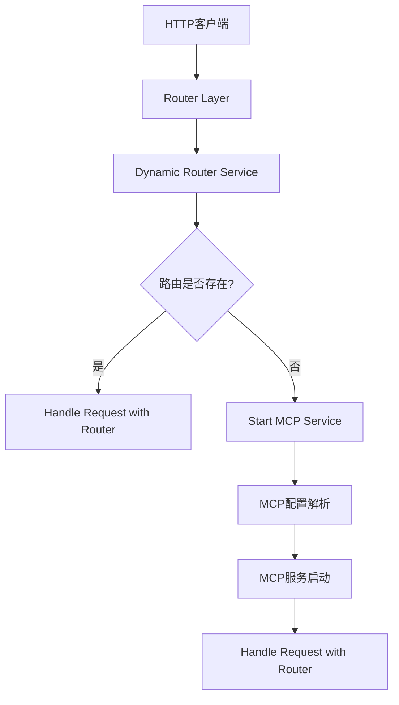
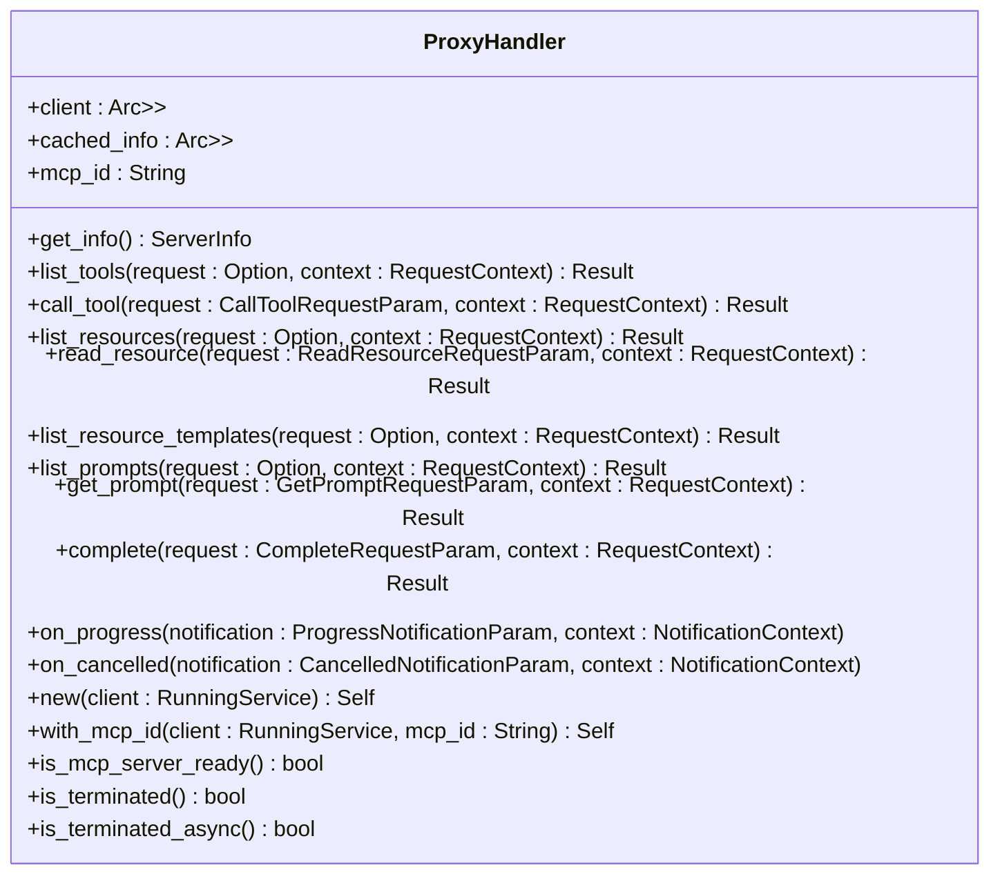
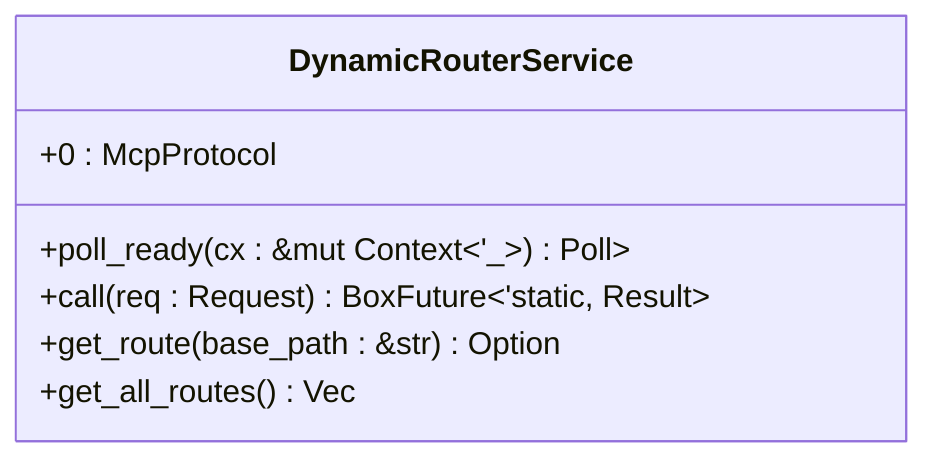
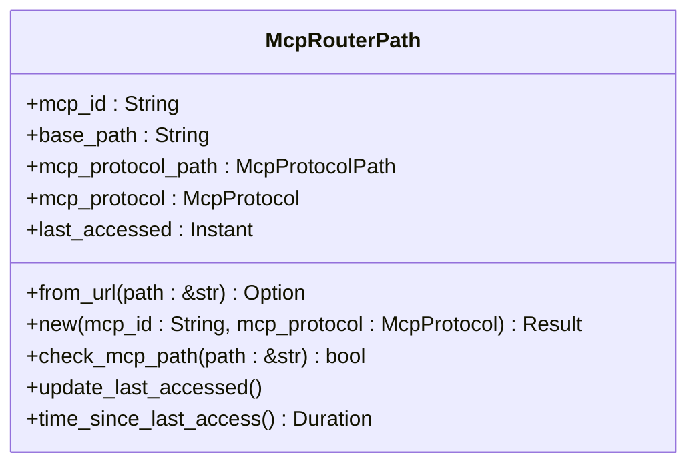
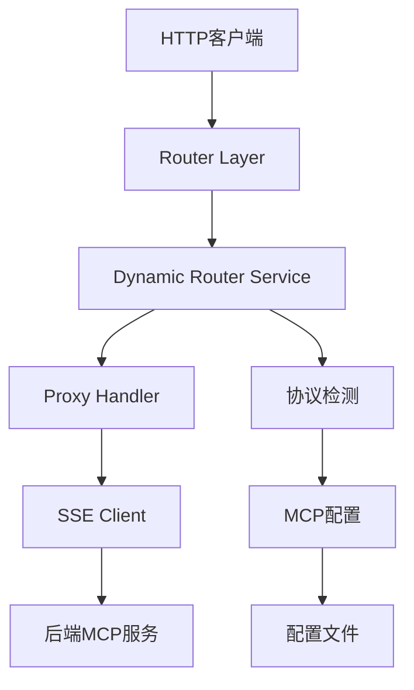

# HTTP请求代理机制

<cite>
**本文档引用的文件**
- [proxy_handler.rs](file://mcp-proxy/src/proxy/proxy_handler.rs)
- [router_layer.rs](file://mcp-proxy/src/server/router_layer.rs)
- [mcp_dynamic_router_service.rs](file://mcp-proxy/src/server/mcp_dynamic_router_service.rs)
- [mcp_router_model.rs](file://mcp-proxy/src/model/mcp_router_model.rs)
- [protocol_detector.rs](file://mcp-proxy/src/server/protocol_detector.rs)
- [main.rs](file://mcp-proxy/src/main.rs)
- [config.rs](file://mcp-proxy/src/config.rs)
</cite>

## 目录
1. [引言](#引言)
2. [项目结构](#项目结构)
3. [核心组件](#核心组件)
4. [架构概述](#架构概述)
5. [详细组件分析](#详细组件分析)
6. [依赖分析](#依赖分析)
7. [性能考虑](#性能考虑)
8. [故障排除指南](#故障排除指南)
9. [结论](#结论)

## 引言
本文档深入解析MCP代理中HTTP请求的代理实现机制。详细说明proxy_handler如何接收客户端的普通HTTP请求，根据路由配置将请求转发至对应的后端MCP服务，包括请求头的处理、请求体的透传、超时控制策略以及错误码的映射机制。阐述请求转发过程中的中间件链执行顺序，如身份验证、协议检测和时间统计。结合代码示例展示请求转发的核心逻辑，包括URL重写、Host头替换和连接池管理。提供性能调优建议，如连接复用、并发限制和缓冲策略，并说明如何通过日志和指标监控代理行为。

## 项目结构
MCP代理项目采用模块化设计，主要包含以下几个核心目录：
- `mcp-proxy/src/proxy/`：包含代理处理的核心逻辑
- `mcp-proxy/src/server/`：包含服务器路由、中间件和协议检测
- `mcp-proxy/src/model/`：包含MCP路由和配置模型
- `mcp-proxy/src/client/`：包含SSE客户端实现
- `mcp-proxy/src/config/`：包含配置管理

**图表来源**
- [router_layer.rs](file://mcp-proxy/src/server/router_layer.rs#L25-L83)
- [mcp_dynamic_router_service.rs](file://mcp-proxy/src/server/mcp_dynamic_router_service.rs#L21-L273)

**章节来源**
- [router_layer.rs](file://mcp-proxy/src/server/router_layer.rs#L1-L83)
- [mcp_dynamic_router_service.rs](file://mcp-proxy/src/server/mcp_dynamic_router_service.rs#L1-L273)

## 核心组件
MCP代理的核心组件主要包括ProxyHandler、DynamicRouterService和McpRouterPath。ProxyHandler负责处理MCP服务的代理请求，DynamicRouterService负责动态路由的处理，McpRouterPath负责MCP路由路径的解析和生成。

**章节来源**
- [proxy_handler.rs](file://mcp-proxy/src/proxy/proxy_handler.rs#L1-L509)
- [mcp_dynamic_router_service.rs](file://mcp-proxy/src/server/mcp_dynamic_router_service.rs#L1-L273)
- [mcp_router_model.rs](file://mcp-proxy/src/model/mcp_router_model.rs#L1-L1262)

## 架构概述
MCP代理的架构设计遵循微服务架构原则，通过动态路由机制实现灵活的请求转发。代理服务接收客户端的HTTP请求，根据请求路径和MCP配置，动态地将请求转发至对应的后端MCP服务。

**图表来源**
- [main.rs](file://mcp-proxy/src/main.rs#L1-L214)
- [router_layer.rs](file://mcp-proxy/src/server/router_layer.rs#L25-L83)
- [protocol_detector.rs](file://mcp-proxy/src/server/protocol_detector.rs#L1-L184)

## 详细组件分析

### ProxyHandler分析
ProxyHandler是MCP代理的核心组件，负责处理MCP服务的代理请求。它实现了ServerHandler trait，提供了get_info、list_tools、call_tool等方法。

**图表来源**
- [proxy_handler.rs](file://mcp-proxy/src/proxy/proxy_handler.rs#L1-L509)

**章节来源**
- [proxy_handler.rs](file://mcp-proxy/src/proxy/proxy_handler.rs#L1-L509)

### DynamicRouterService分析
DynamicRouterService是MCP代理的动态路由服务，负责处理动态路由的请求。它实现了Service trait，提供了poll_ready和call方法。

**图表来源**
- [mcp_dynamic_router_service.rs](file://mcp-proxy/src/server/mcp_dynamic_router_service.rs#L1-L273)

**章节来源**
- [mcp_dynamic_router_service.rs](file://mcp-proxy/src/server/mcp_dynamic_router_service.rs#L1-L273)

### McpRouterPath分析
McpRouterPath是MCP代理的路由路径模型，负责解析和生成MCP路由路径。它提供了from_url、new、check_mcp_path等方法。

**图表来源**
- [mcp_router_model.rs](file://mcp-proxy/src/model/mcp_router_model.rs#L342-L624)

**章节来源**
- [mcp_router_model.rs](file://mcp-proxy/src/model/mcp_router_model.rs#L342-L624)

## 依赖分析
MCP代理的依赖关系如下图所示：

**图表来源**
- [router_layer.rs](file://mcp-proxy/src/server/router_layer.rs#L25-L83)
- [mcp_dynamic_router_service.rs](file://mcp-proxy/src/server/mcp_dynamic_router_service.rs#L21-L273)
- [proxy_handler.rs](file://mcp-proxy/src/proxy/proxy_handler.rs#L1-L509)
- [protocol_detector.rs](file://mcp-proxy/src/server/protocol_detector.rs#L1-L184)
- [config.rs](file://mcp-proxy/src/config.rs#L1-L75)

**章节来源**
- [router_layer.rs](file://mcp-proxy/src/server/router_layer.rs#L1-L83)
- [mcp_dynamic_router_service.rs](file://mcp-proxy/src/server/mcp_dynamic_router_service.rs#L1-L273)
- [proxy_handler.rs](file://mcp-proxy/src/proxy/proxy_handler.rs#L1-L509)
- [protocol_detector.rs](file://mcp-proxy/src/server/protocol_detector.rs#L1-L184)
- [config.rs](file://mcp-proxy/src/config.rs#L1-L75)

## 性能考虑
MCP代理在性能方面做了以下优化：
1. 使用Arc和Mutex实现线程安全的共享状态
2. 使用RwLock实现读写锁，提高并发性能
3. 使用tokio异步运行时，提高I/O性能
4. 使用reqwest客户端，支持连接池和超时控制
5. 使用tracing和metrics进行性能监控

## 故障排除指南
当MCP代理出现问题时，可以按照以下步骤进行排查：
1. 检查日志文件，查看是否有错误信息
2. 检查配置文件，确保配置正确
3. 检查网络连接，确保后端MCP服务可达
4. 检查请求路径，确保路径正确
5. 检查MCP配置，确保配置正确

**章节来源**
- [main.rs](file://mcp-proxy/src/main.rs#L1-L214)
- [config.rs](file://mcp-proxy/src/config.rs#L1-L75)

## 结论
MCP代理通过动态路由机制实现了灵活的请求转发，能够根据请求路径和MCP配置，动态地将请求转发至对应的后端MCP服务。代理服务具有良好的性能和可扩展性，能够满足大规模并发请求的需求。通过详细的日志和指标监控，可以方便地进行故障排查和性能优化。