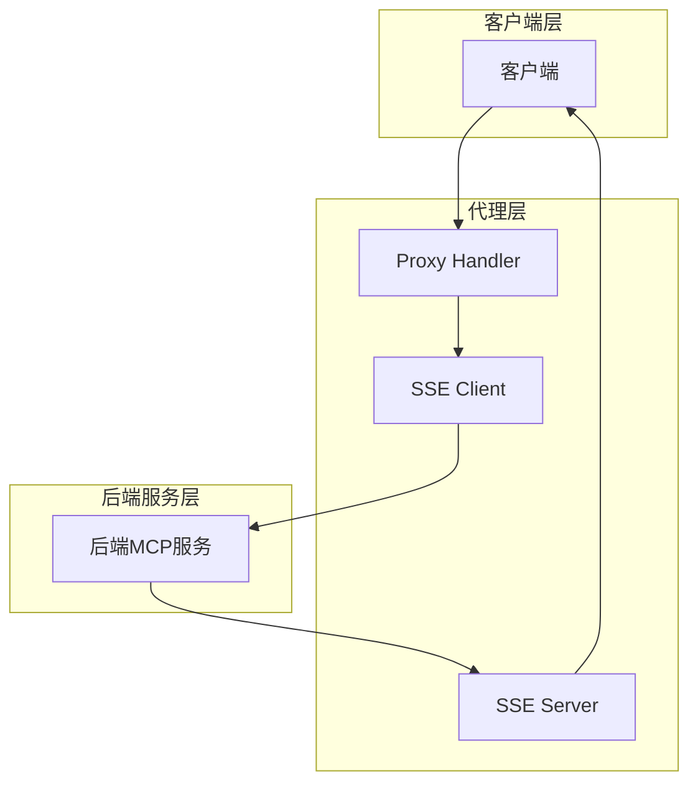
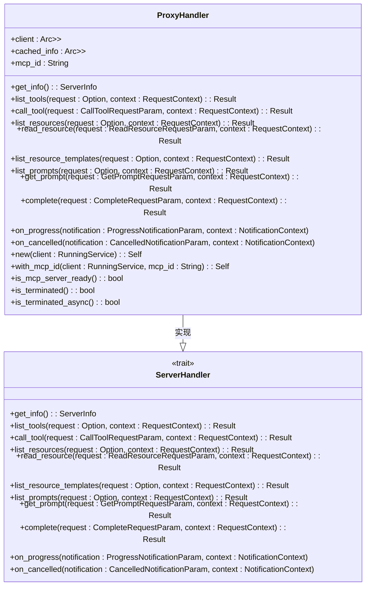
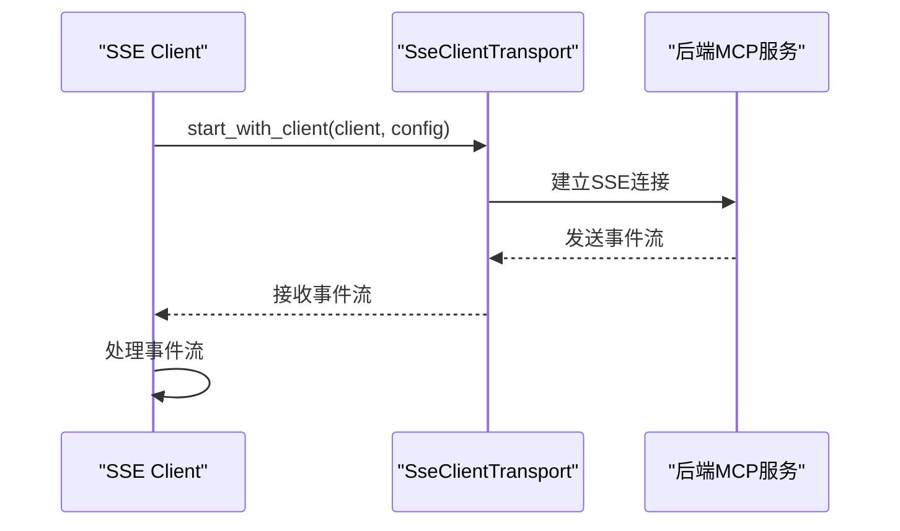
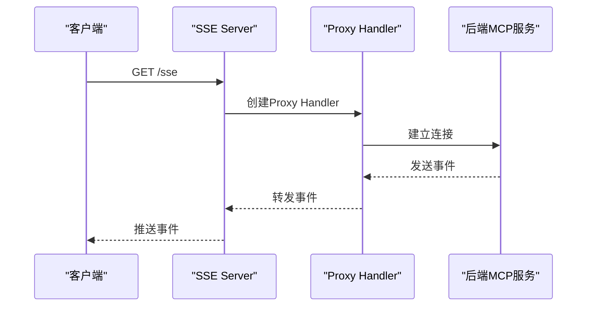
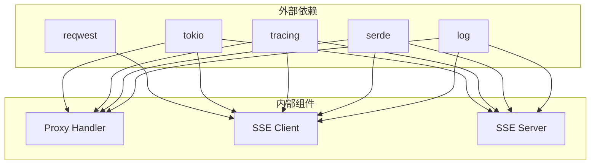

# SSE流式代理机制

<cite>
**本文档引用的文件**  
- [proxy_handler.rs](file://mcp-proxy/src/proxy/proxy_handler.rs)
- [sse_client.rs](file://mcp-proxy/src/client/sse_client.rs)
- [sse_server.rs](file://mcp-proxy/src/server/handlers/sse_server.rs)
- [opentelemetry_middleware.rs](file://mcp-proxy/src/server/middlewares/opentelemetry_middleware.rs)
- [telemetry.rs](file://mcp-proxy/src/server/telemetry.rs)
- [mcp_sse_test.rs](file://mcp-proxy/src/tests/mcp_sse_test.rs)
- [test_sse_client.py](file://mcp-proxy/test_sse_client.py)
- [test_sse_complete.sh](file://mcp-proxy/test_sse_complete.sh)
- [protocol_detector.rs](file://mcp-proxy/src/server/protocol_detector.rs)
</cite>

## 目录
1. [引言](#引言)
2. [核心组件](#核心组件)
3. [架构概述](#架构概述)
4. [详细组件分析](#详细组件分析)
5. [依赖分析](#依赖分析)
6. [性能考虑](#性能考虑)
7. [故障排除指南](#故障排除指南)
8. [结论](#结论)

## 引言
本文档全面阐述了MCP代理对SSE（Server-Sent Events）协议的流式代理实现。通过分析核心组件，详细说明了proxy_handler如何识别SSE请求并建立双向流式通道，sse_client如何与后端MCP服务保持长连接并接收事件流，以及sse_server如何将后端事件实时推送给客户端。文档还解释了事件数据的映射规则、连接状态的同步机制、错误传播策略（如重连逻辑和断点续传）以及心跳检测的实现方式。结合实际代码分析流式数据的缓冲、分块传输和内存管理策略。提供SSE代理的性能优化建议，包括流控机制、超时设置和资源清理，并说明如何通过OpenTelemetry进行链路追踪。

## 核心组件
MCP代理的SSE流式代理实现由多个核心组件构成，包括proxy_handler、sse_client和sse_server。这些组件协同工作，实现了从客户端到后端MCP服务的双向流式通信。proxy_handler负责处理来自客户端的请求，并将其转发到后端MCP服务；sse_client负责与后端MCP服务建立SSE连接，并接收事件流；sse_server则负责将后端事件实时推送给客户端。这些组件通过异步I/O和事件驱动的方式，实现了高效的流式数据传输。

**本文档引用的文件**
- [proxy_handler.rs](file://mcp-proxy/src/proxy/proxy_handler.rs)
- [sse_client.rs](file://mcp-proxy/src/client/sse_client.rs)
- [sse_server.rs](file://mcp-proxy/src/server/handlers/sse_server.rs)

## 架构概述
MCP代理的SSE流式代理架构采用分层设计，包括客户端层、代理层和后端服务层。客户端层通过HTTP请求与代理层通信，代理层负责解析请求并建立SSE连接，后端服务层则提供实际的MCP服务。代理层通过proxy_handler、sse_client和sse_server三个核心组件实现SSE协议的流式代理。整个架构支持双向流式通信，能够实时推送事件流，并通过OpenTelemetry实现链路追踪。

**图表来源**
- [proxy_handler.rs](file://mcp-proxy/src/proxy/proxy_handler.rs)
- [sse_client.rs](file://mcp-proxy/src/client/sse_client.rs)
- [sse_server.rs](file://mcp-proxy/src/server/handlers/sse_server.rs)

## 详细组件分析
### Proxy Handler分析
Proxy Handler是MCP代理的核心组件，负责处理来自客户端的请求并将其转发到后端MCP服务。它通过实现ServerHandler trait，提供了get_info、list_tools、call_tool等方法，能够处理各种MCP协议请求。Proxy Handler使用Arc<Mutex<RunningService<RoleClient, ClientInfo>>>来管理后端MCP服务的连接，确保线程安全。它还通过RwLock<Option<ServerInfo>>缓存服务器信息，避免频繁锁定客户端。

**图表来源**
- [proxy_handler.rs](file://mcp-proxy/src/proxy/proxy_handler.rs)

**本文档引用的文件**
- [proxy_handler.rs](file://mcp-proxy/src/proxy/proxy_handler.rs)

### SSE Client分析
SSE Client负责与后端MCP服务建立SSE连接，并接收事件流。它通过SseClientConfig配置SSE客户端，包括URL和请求头。SSE Client使用reqwest::Client构建HTTP客户端，并通过SseClientTransport与后端MCP服务建立连接。它还通过ClientInfo配置客户端能力，确保能够使用后端MCP服务的所有功能。

**图表来源**
- [sse_client.rs](file://mcp-proxy/src/client/sse_client.rs)

**本文档引用的文件**
- [sse_client.rs](file://mcp-proxy/src/client/sse_client.rs)

### SSE Server分析
SSE Server负责将后端事件实时推送给客户端。它通过SseServerConfig配置SSE服务器，包括绑定地址、SSE路径和POST路径。SSE Server使用TokioChildProcess与后端MCP服务建立连接，并通过SseServer::serve_with_config启动SSE服务器。它还通过ProxyHandler处理客户端请求，并将后端事件推送给客户端。

**图表来源**
- [sse_server.rs](file://mcp-proxy/src/server/handlers/sse_server.rs)

**本文档引用的文件**
- [sse_server.rs](file://mcp-proxy/src/server/handlers/sse_server.rs)

## 依赖分析
MCP代理的SSE流式代理实现依赖于多个外部库和内部组件。外部库包括reqwest、tokio、tracing等，用于HTTP客户端、异步I/O和日志记录。内部组件包括proxy_handler、sse_client和sse_server，它们通过接口和数据结构进行通信。整个系统通过Cargo.toml管理依赖关系，确保版本兼容性和构建一致性。

**图表来源**
- [Cargo.toml](file://mcp-proxy/Cargo.toml)
- [proxy_handler.rs](file://mcp-proxy/src/proxy/proxy_handler.rs)
- [sse_client.rs](file://mcp-proxy/src/client/sse_client.rs)
- [sse_server.rs](file://mcp-proxy/src/server/handlers/sse_server.rs)

**本文档引用的文件**
- [Cargo.toml](file://mcp-proxy/Cargo.toml)
- [proxy_handler.rs](file://mcp-proxy/src/proxy/proxy_handler.rs)
- [sse_client.rs](file://mcp-proxy/src/client/sse_client.rs)
- [sse_server.rs](file://mcp-proxy/src/server/handlers/sse_server.rs)

## 性能考虑
MCP代理的SSE流式代理实现通过多种方式优化性能。首先，使用异步I/O和事件驱动的方式，避免了阻塞操作，提高了并发处理能力。其次，通过缓存服务器信息，减少了频繁的网络请求。此外，通过OpenTelemetry实现链路追踪，能够监控系统性能并及时发现瓶颈。最后，通过合理的超时设置和资源清理，确保系统稳定运行。

**本文档引用的文件**
- [proxy_handler.rs](file://mcp-proxy/src/proxy/proxy_handler.rs)
- [telemetry.rs](file://mcp-proxy/src/server/telemetry.rs)

## 故障排除指南
在使用MCP代理的SSE流式代理时，可能会遇到各种问题。以下是一些常见的故障排除建议：
1. **连接失败**：检查后端MCP服务是否正常运行，确保URL和端口正确。
2. **事件流中断**：检查网络连接是否稳定，确保SSE连接未被防火墙或代理中断。
3. **性能下降**：通过OpenTelemetry监控系统性能，检查是否有瓶颈。
4. **日志记录**：查看日志文件，分析错误信息，定位问题根源。

**本文档引用的文件**
- [mcp_sse_test.rs](file://mcp-proxy/src/tests/mcp_sse_test.rs)
- [test_sse_client.py](file://mcp-proxy/test_sse_client.py)
- [test_sse_complete.sh](file://mcp-proxy/test_sse_complete.sh)

## 结论
MCP代理的SSE流式代理实现通过proxy_handler、sse_client和sse_server三个核心组件，实现了从客户端到后端MCP服务的双向流式通信。该实现采用分层设计，支持异步I/O和事件驱动，能够高效处理大量并发请求。通过OpenTelemetry实现链路追踪，能够监控系统性能并及时发现瓶颈。整体架构稳定可靠，适用于各种MCP服务场景。