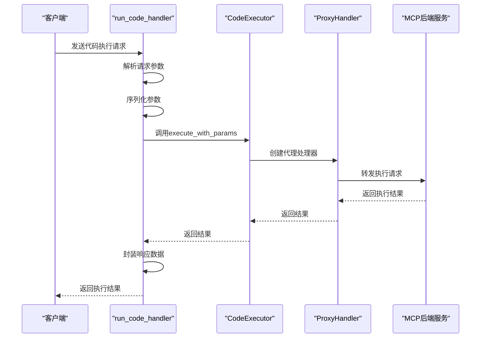
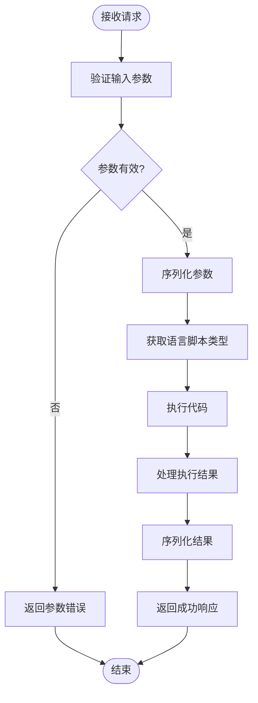
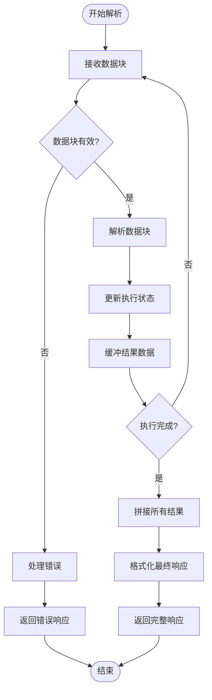
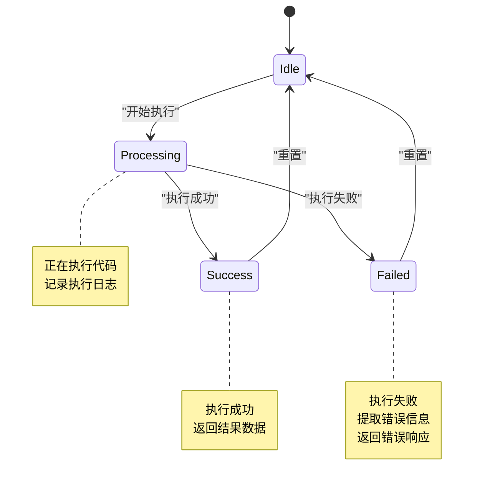
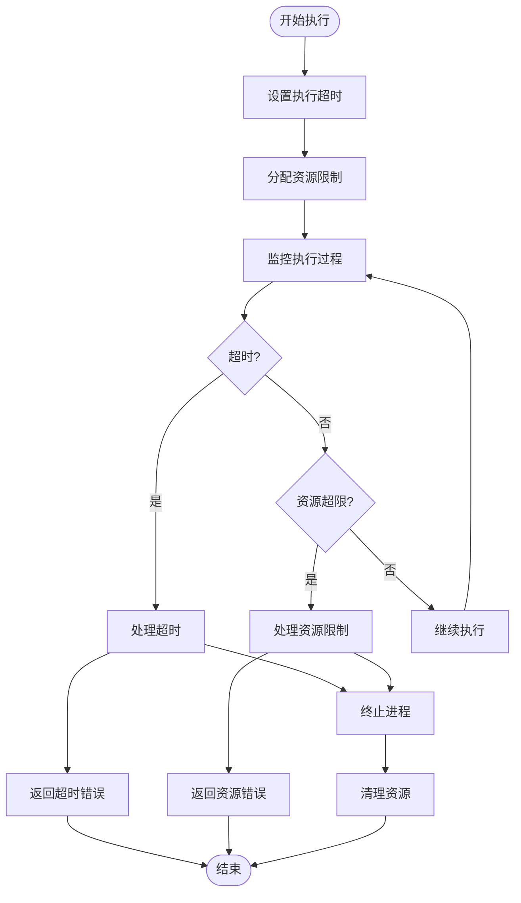
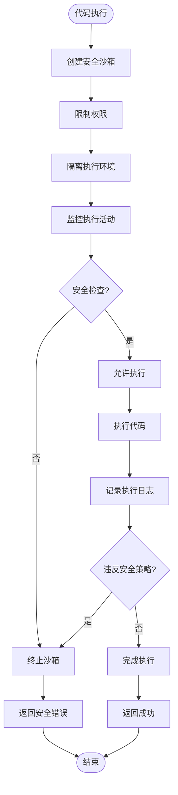
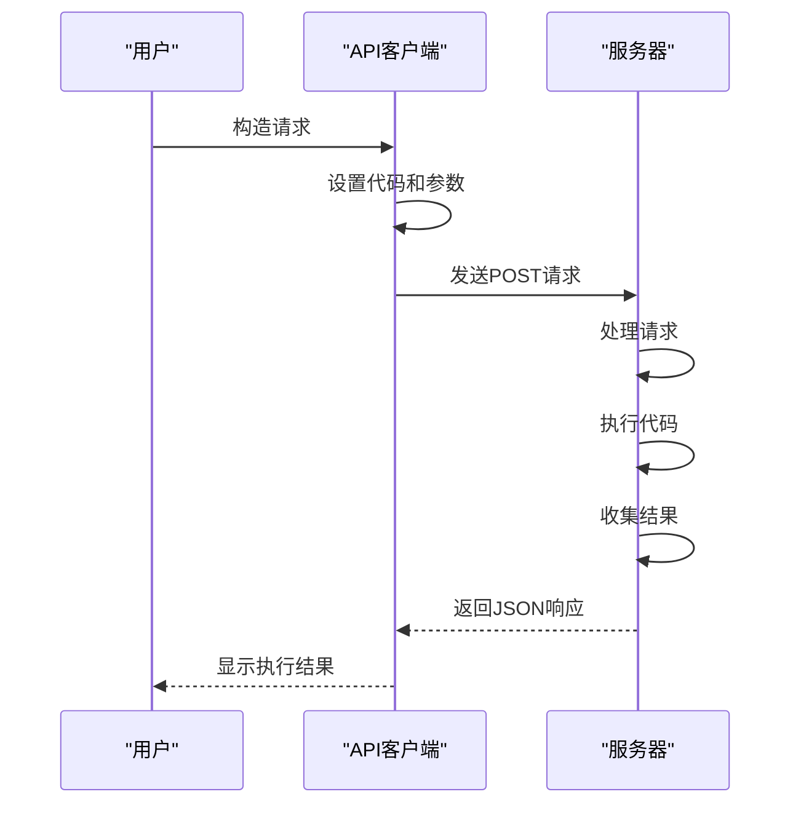
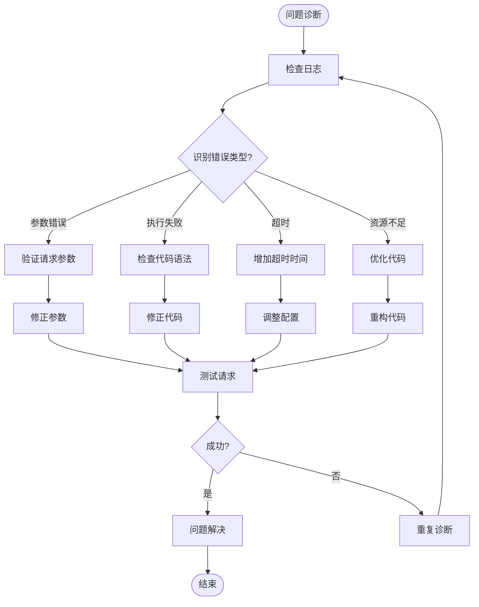

# 代码执行请求转发

<cite>
**本文档中引用的文件**   
- [run_code_handler.rs](file://mcp-proxy/src/server/handlers/run_code_handler.rs)
- [proxy_handler.rs](file://mcp-proxy/src/proxy/proxy_handler.rs)
- [sse_client.rs](file://mcp-proxy/src/client/sse_client.rs)
- [mcp_config.rs](file://mcp-proxy/src/model/mcp_config.rs)
- [mcp_router_model.rs](file://mcp-proxy/src/model/mcp_router_model.rs)
- [http_result.rs](file://mcp-proxy/src/model/http_result.rs)
- [mcp_check_status_model.rs](file://mcp-proxy/src/model/mcp_check_status_model.rs)
- [sse_server.rs](file://mcp-proxy/src/server/handlers/sse_server.rs)
</cite>

## 目录
1. [简介](#简介)
2. [核心组件分析](#核心组件分析)
3. [代码执行请求处理流程](#代码执行请求处理流程)
4. [请求参数处理与校验](#请求参数处理与校验)
5. [响应数据流式解析机制](#响应数据流式解析机制)
6. [执行状态映射与错误处理](#执行状态映射与错误处理)
7. [超时与资源限制处理](#超时与资源限制处理)
8. [安全沙箱机制](#安全沙箱机制)
9. [API使用示例](#api使用示例)
10. [调试建议与常见问题](#调试建议与常见问题)

## 简介
本文档详细解析`run_code_handler`对代码执行类请求的特殊转发处理流程。该处理器负责接收客户端的代码执行请求，对请求参数进行序列化与校验，调用`proxy_handler`将请求转发至支持代码执行的MCP后端服务。文档将描述响应数据的流式解析机制，包括分块结果的拼接、执行状态的映射（如运行中、成功、失败）以及错误信息的提取与封装。同时，将阐述对执行超时、资源限制和安全沙箱等场景的处理策略。

## 核心组件分析

**Section sources**
- [run_code_handler.rs](file://mcp-proxy/src/server/handlers/run_code_handler.rs#L1-L93)
- [proxy_handler.rs](file://mcp-proxy/src/proxy/proxy_handler.rs#L1-L509)
- [sse_client.rs](file://mcp-proxy/src/client/sse_client.rs#L1-L80)

## 代码执行请求处理流程

**Diagram sources**
- [run_code_handler.rs](file://mcp-proxy/src/server/handlers/run_code_handler.rs#L38-L92)
- [proxy_handler.rs](file://mcp-proxy/src/proxy/proxy_handler.rs#L17-L508)
- [sse_client.rs](file://mcp-proxy/src/client/sse_client.rs#L24-L79)

## 请求参数处理与校验

**Diagram sources**
- [run_code_handler.rs](file://mcp-proxy/src/server/handlers/run_code_handler.rs#L41-L48)
- [run_code_handler.rs](file://mcp-proxy/src/server/handlers/run_code_handler.rs#L50-L53)

## 响应数据流式解析机制

**Diagram sources**
- [run_code_handler.rs](file://mcp-proxy/src/server/handlers/run_code_handler.rs#L74-L80)
- [http_result.rs](file://mcp-proxy/src/model/http_result.rs#L38-L51)

## 执行状态映射与错误处理

**Diagram sources**
- [run_code_handler.rs](file://mcp-proxy/src/server/handlers/run_code_handler.rs#L66-L72)
- [run_code_handler.rs](file://mcp-proxy/src/server/handlers/run_code_handler.rs#L85-L89)

## 超时与资源限制处理

**Diagram sources**
- [mcp_router_model.rs](file://mcp-proxy/src/model/mcp_router_model.rs#L115-L116)
- [mcp_router_model.rs](file://mcp-proxy/src/model/mcp_router_model.rs#L139-L145)

## 安全沙箱机制

**Diagram sources**
- [mcp_router_model.rs](file://mcp-proxy/src/model/mcp_router_model.rs#L127-L128)
- [mcp_config.rs](file://mcp-proxy/src/model/mcp_config.rs#L11-L102)

## API使用示例

**Diagram sources**
- [run_code_handler.rs](file://mcp-proxy/src/server/handlers/run_code_handler.rs#L38-L92)
- [http_result.rs](file://mcp-proxy/src/model/http_result.rs#L16-L35)

## 调试建议与常见问题

**Diagram sources**
- [run_code_handler.rs](file://mcp-proxy/src/server/handlers/run_code_handler.rs#L45-L47)
- [run_code_handler.rs](file://mcp-proxy/src/server/handlers/run_code_handler.rs#L61-L63)
- [run_code_handler.rs](file://mcp-proxy/src/server/handlers/run_code_handler.rs#L77-L79)

**Section sources**
- [run_code_handler.rs](file://mcp-proxy/src/server/handlers/run_code_handler.rs#L1-L93)
- [mcp_check_status_model.rs](file://mcp-proxy/src/model/mcp_check_status_model.rs#L1-L104)