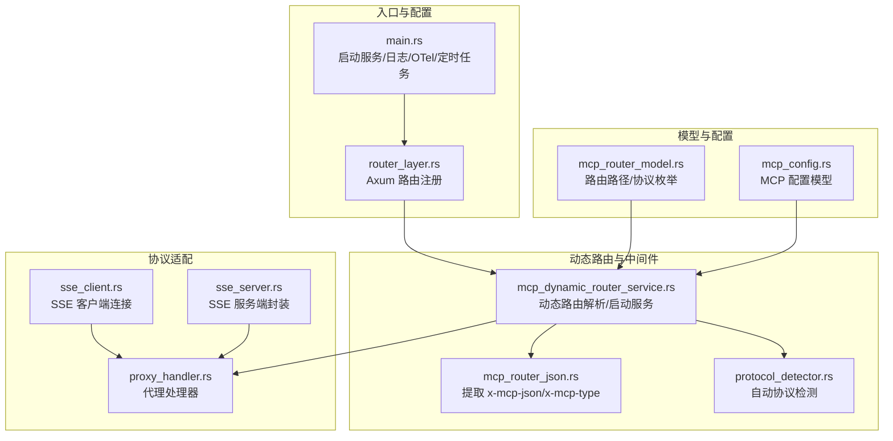
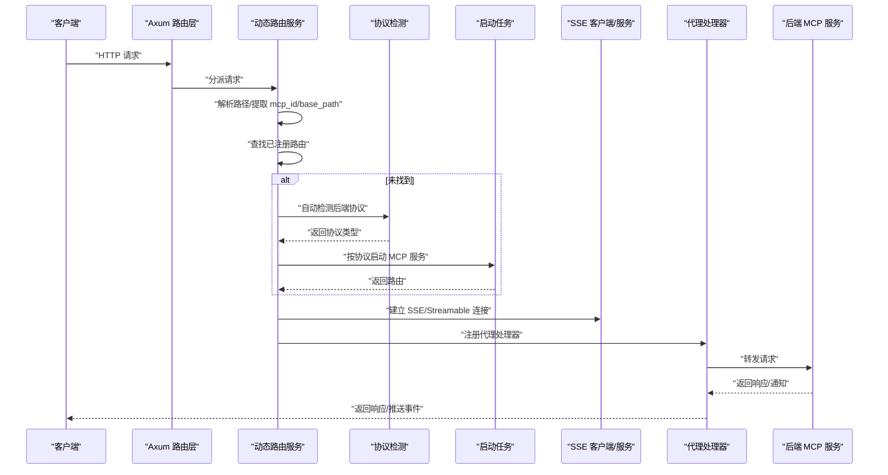
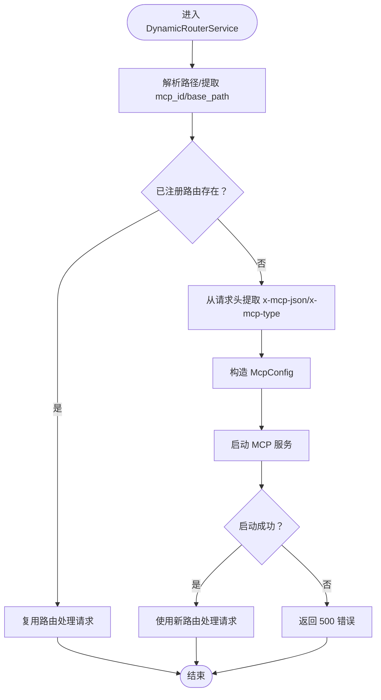
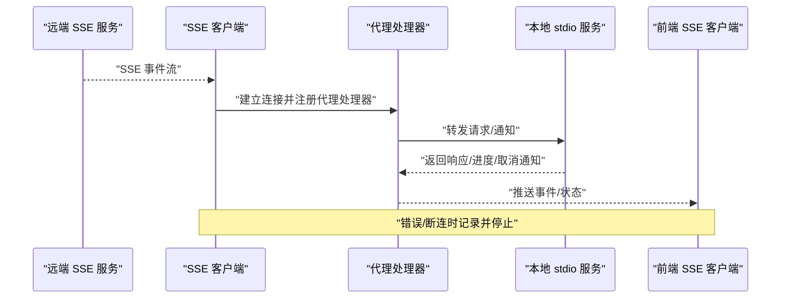
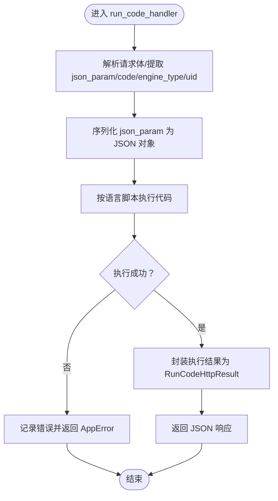
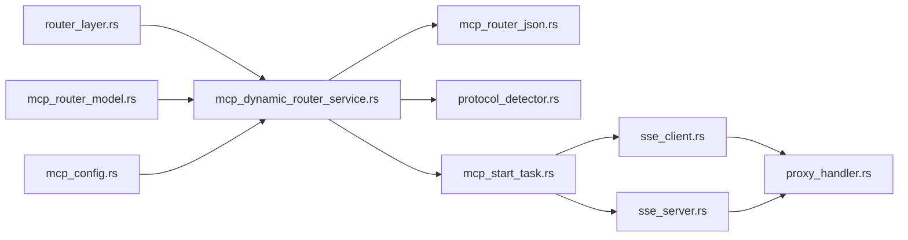

# 请求转发机制

<cite>
**本文引用的文件**
- [mcp-proxy/src/proxy/proxy_handler.rs](file://mcp-proxy/src/proxy/proxy_handler.rs)
- [mcp-proxy/src/server/handlers/run_code_handler.rs](file://mcp-proxy/src/server/handlers/run_code_handler.rs)
- [mcp-proxy/src/client/sse_client.rs](file://mcp-proxy/src/client/sse_client.rs)
- [mcp-proxy/src/server/handlers/sse_server.rs](file://mcp-proxy/src/server/handlers/sse_server.rs)
- [mcp-proxy/src/server/router_layer.rs](file://mcp-proxy/src/server/router_layer.rs)
- [mcp-proxy/src/server/mcp_dynamic_router_service.rs](file://mcp-proxy/src/server/mcp_dynamic_router_service.rs)
- [mcp-proxy/src/server/middlewares/mcp_router_json.rs](file://mcp-proxy/src/server/middlewares/mcp_router_json.rs)
- [mcp-proxy/src/server/protocol_detector.rs](file://mcp-proxy/src/server/protocol_detector.rs)
- [mcp-proxy/src/model/mcp_router_model.rs](file://mcp-proxy/src/model/mcp_router_model.rs)
- [mcp-proxy/src/model/mcp_config.rs](file://mcp-proxy/src/model/mcp_config.rs)
- [mcp-proxy/src/main.rs](file://mcp-proxy/src/main.rs)
- [mcp-proxy/src/server/task/mcp_start_task.rs](file://mcp-proxy/src/server/task/mcp_start_task.rs)
</cite>

## 目录
1. [引言](#引言)
2. [项目结构](#项目结构)
3. [核心组件](#核心组件)
4. [架构总览](#架构总览)
5. [详细组件分析](#详细组件分析)
6. [依赖关系分析](#依赖关系分析)
7. [性能考量](#性能考量)
8. [故障排查指南](#故障排查指南)
9. [结论](#结论)

## 引言
本文围绕 MCP 代理的请求转发实现机制展开，重点解释以下方面：
- proxy_handler 如何接收客户端请求并基于路由规则转发至目标 MCP 服务，涵盖 HTTP 头处理、请求体透传与超时控制。
- SSE 客户端与后端 MCP 服务之间的双向流式代理逻辑，包括事件映射、错误传播与连接状态同步。
- run_code_handler 对代码执行请求的特殊处理流程，包括参数序列化、响应解析与流式结果返回。
- 请求转发的性能优化策略、安全过滤机制与调试日志配置建议。

## 项目结构
MCP 代理采用 Axum 路由层 + 动态路由服务 + 协议检测 + SSE/Streamable 适配的分层设计。核心入口在 main 中初始化日志、OpenTelemetry、定时任务与 HTTP 服务；路由层将 /mcp/sse 与 /mcp/stream 的请求交由 DynamicRouterService 动态解析并按需启动后端服务；协议检测负责自动识别后端协议类型；SSE 客户端/服务分别负责将远端 SSE 或 Streamable HTTP 服务转换为本地可用的 stdio/SSE 接口。

图表来源
- [mcp-proxy/src/main.rs](file://mcp-proxy/src/main.rs#L1-L161)
- [mcp-proxy/src/server/router_layer.rs](file://mcp-proxy/src/server/router_layer.rs#L24-L82)
- [mcp-proxy/src/server/mcp_dynamic_router_service.rs](file://mcp-proxy/src/server/mcp_dynamic_router_service.rs#L21-L152)
- [mcp-proxy/src/server/middlewares/mcp_router_json.rs](file://mcp-proxy/src/server/middlewares/mcp_router_json.rs#L1-L57)
- [mcp-proxy/src/server/protocol_detector.rs](file://mcp-proxy/src/server/protocol_detector.rs#L1-L184)
- [mcp-proxy/src/client/sse_client.rs](file://mcp-proxy/src/client/sse_client.rs#L1-L80)
- [mcp-proxy/src/server/handlers/sse_server.rs](file://mcp-proxy/src/server/handlers/sse_server.rs#L1-L95)
- [mcp-proxy/src/proxy/proxy_handler.rs](file://mcp-proxy/src/proxy/proxy_handler.rs#L1-L120)
- [mcp-proxy/src/model/mcp_router_model.rs](file://mcp-proxy/src/model/mcp_router_model.rs#L1-L120)
- [mcp-proxy/src/model/mcp_config.rs](file://mcp-proxy/src/model/mcp_config.rs#L1-L102)

章节来源
- [mcp-proxy/src/main.rs](file://mcp-proxy/src/main.rs#L1-L161)
- [mcp-proxy/src/server/router_layer.rs](file://mcp-proxy/src/server/router_layer.rs#L24-L82)

## 核心组件
- 动态路由服务：根据请求路径解析 mcp_id 与 base_path，若未注册则尝试启动对应 MCP 服务并复用其路由。
- 协议检测：自动判断后端为 SSE 或 Streamable HTTP，必要时回退到 SSE。
- SSE 客户端/服务：将远端 SSE 或 Streamable HTTP 服务转换为本地 stdio/SSE 接口，供代理处理器统一处理。
- 代理处理器：封装 rmcp 服务，将上游请求转发至后端 MCP，并处理能力检查、通知与错误返回。
- 运行代码处理器：对代码执行请求进行参数序列化、执行与结果封装，支持 JS/TS/Python 等语言脚本。

章节来源
- [mcp-proxy/src/server/mcp_dynamic_router_service.rs](file://mcp-proxy/src/server/mcp_dynamic_router_service.rs#L21-L152)
- [mcp-proxy/src/server/protocol_detector.rs](file://mcp-proxy/src/server/protocol_detector.rs#L1-L184)
- [mcp-proxy/src/client/sse_client.rs](file://mcp-proxy/src/client/sse_client.rs#L1-L80)
- [mcp-proxy/src/server/handlers/sse_server.rs](file://mcp-proxy/src/server/handlers/sse_server.rs#L1-L95)
- [mcp-proxy/src/proxy/proxy_handler.rs](file://mcp-proxy/src/proxy/proxy_handler.rs#L1-L120)
- [mcp-proxy/src/server/handlers/run_code_handler.rs](file://mcp-proxy/src/server/handlers/run_code_handler.rs#L1-L93)

## 架构总览
MCP 代理的请求转发链路如下：
- 客户端通过 /mcp/sse 或 /mcp/stream 的路径访问代理。
- 路由层将请求交给 DynamicRouterService，后者解析路径并尝试复用已注册路由；若未注册则根据请求头中的 x-mcp-json/x-mcp-type 启动对应 MCP 服务。
- 协议检测模块在必要时自动识别后端协议类型，确保协议转换正确。
- SSE 客户端/服务将远端 SSE 或 Streamable HTTP 服务转换为本地 stdio/SSE 接口，代理处理器统一转发请求并处理能力检查与通知。
- 对于代码执行请求，run_code_handler 直接处理并返回结果。

图表来源
- [mcp-proxy/src/server/router_layer.rs](file://mcp-proxy/src/server/router_layer.rs#L24-L82)
- [mcp-proxy/src/server/mcp_dynamic_router_service.rs](file://mcp-proxy/src/server/mcp_dynamic_router_service.rs#L21-L152)
- [mcp-proxy/src/server/protocol_detector.rs](file://mcp-proxy/src/server/protocol_detector.rs#L1-L184)
- [mcp-proxy/src/server/task/mcp_start_task.rs](file://mcp-proxy/src/server/task/mcp_start_task.rs#L303-L330)
- [mcp-proxy/src/client/sse_client.rs](file://mcp-proxy/src/client/sse_client.rs#L1-L80)
- [mcp-proxy/src/server/handlers/sse_server.rs](file://mcp-proxy/src/server/handlers/sse_server.rs#L1-L95)
- [mcp-proxy/src/proxy/proxy_handler.rs](file://mcp-proxy/src/proxy/proxy_handler.rs#L1-L120)

## 详细组件分析

### 动态路由与请求转发
- 路由解析：DynamicRouterService 从请求路径中提取 mcp_id 与 base_path，并记录 trace_id 与关键请求头信息，便于可观测性。
- 路由查找：若已存在匹配的 base_path，则直接复用该路由处理请求；否则尝试启动 MCP 服务并返回新路由。
- 启动流程：根据请求头中的 x-mcp-json（Base64 编码）与 x-mcp-type（默认 OneShot），构造 McpConfig 并调用启动任务，最终将请求交由新路由处理。

图表来源
- [mcp-proxy/src/server/mcp_dynamic_router_service.rs](file://mcp-proxy/src/server/mcp_dynamic_router_service.rs#L21-L152)
- [mcp-proxy/src/server/middlewares/mcp_router_json.rs](file://mcp-proxy/src/server/middlewares/mcp_router_json.rs#L1-L57)
- [mcp-proxy/src/model/mcp_config.rs](file://mcp-proxy/src/model/mcp_config.rs#L1-L102)

章节来源
- [mcp-proxy/src/server/mcp_dynamic_router_service.rs](file://mcp-proxy/src/server/mcp_dynamic_router_service.rs#L21-L152)
- [mcp-proxy/src/server/middlewares/mcp_router_json.rs](file://mcp-proxy/src/server/middlewares/mcp_router_json.rs#L1-L57)
- [mcp-proxy/src/model/mcp_config.rs](file://mcp-proxy/src/model/mcp_config.rs#L1-L102)

### HTTP 头处理、请求体透传与超时控制
- HTTP 头处理：中间件从请求头中提取 x-mcp-json（Base64 解码）、x-mcp-type，并将其注入到请求扩展中，供后续动态路由使用。
- 请求体透传：DynamicRouterService 在处理请求时会记录 Content-Type、Content-Length 等关键头部，但未对请求体做额外解析或修改，保持透传。
- 超时控制：SSE 客户端/服务与协议检测模块使用默认超时设置；在启动任务中，SSE/Streamable 客户端/服务的超时可通过配置项进行调整（见“性能考量”）。

章节来源
- [mcp-proxy/src/server/middlewares/mcp_router_json.rs](file://mcp-proxy/src/server/middlewares/mcp_router_json.rs#L1-L57)
- [mcp-proxy/src/server/mcp_dynamic_router_service.rs](file://mcp-proxy/src/server/mcp_dynamic_router_service.rs#L155-L236)
- [mcp-proxy/src/server/protocol_detector.rs](file://mcp-proxy/src/server/protocol_detector.rs#L32-L112)
- [mcp-proxy/src/server/task/mcp_start_task.rs](file://mcp-proxy/src/server/task/mcp_start_task.rs#L174-L199)

### SSE 客户端与后端 MCP 服务的双向流式代理
- SSE 客户端：将远端 SSE 服务通过 SSE 客户端传输层连接，创建 ClientInfo 并 serve，随后创建 ProxyHandler 并通过 stdio 传输暴露为本地 stdio 服务。
- SSE 服务端：将本地 stdio 服务通过 SSE 服务端传输层暴露为 SSE 接口，支持 /sse 与 /message 路径。
- 事件映射与通知：代理处理器实现了进度与取消通知的转发，确保前端能够实时感知后端状态变化。
- 错误传播与连接状态同步：代理处理器在能力检查失败或后端不可用时返回空结果或错误信息；SSE 客户端/服务在连接异常时记录错误并停止。

图表来源
- [mcp-proxy/src/client/sse_client.rs](file://mcp-proxy/src/client/sse_client.rs#L1-L80)
- [mcp-proxy/src/server/handlers/sse_server.rs](file://mcp-proxy/src/server/handlers/sse_server.rs#L1-L95)
- [mcp-proxy/src/proxy/proxy_handler.rs](file://mcp-proxy/src/proxy/proxy_handler.rs#L387-L422)

章节来源
- [mcp-proxy/src/client/sse_client.rs](file://mcp-proxy/src/client/sse_client.rs#L1-L80)
- [mcp-proxy/src/server/handlers/sse_server.rs](file://mcp-proxy/src/server/handlers/sse_server.rs#L1-L95)
- [mcp-proxy/src/proxy/proxy_handler.rs](file://mcp-proxy/src/proxy/proxy_handler.rs#L387-L422)

### run_code_handler 的特殊处理流程
- 参数序列化：将请求体中的 json_param 转换为 JSON 对象，失败则返回错误。
- 代码执行：根据 engine_type 选择语言脚本（JS/TS/Python），调用 CodeExecutor 执行带参数的代码。
- 响应解析与返回：将执行结果封装为 RunCodeHttpResult 并序列化为 JSON 返回。

图表来源
- [mcp-proxy/src/server/handlers/run_code_handler.rs](file://mcp-proxy/src/server/handlers/run_code_handler.rs#L1-L93)

章节来源
- [mcp-proxy/src/server/handlers/run_code_handler.rs](file://mcp-proxy/src/server/handlers/run_code_handler.rs#L1-L93)

## 依赖关系分析
- 路由层依赖动态路由服务与中间件，动态路由服务依赖协议检测与启动任务，启动任务依赖 SSE 客户端/服务与代理处理器。
- 代理处理器依赖 rmcp 的 RunningService 与 ServerHandler，向上游提供统一的 MCP 能力接口。
- 路由路径模型与配置模型贯穿于路径解析与服务启动流程。

图表来源
- [mcp-proxy/src/server/router_layer.rs](file://mcp-proxy/src/server/router_layer.rs#L24-L82)
- [mcp-proxy/src/server/mcp_dynamic_router_service.rs](file://mcp-proxy/src/server/mcp_dynamic_router_service.rs#L21-L152)
- [mcp-proxy/src/server/middlewares/mcp_router_json.rs](file://mcp-proxy/src/server/middlewares/mcp_router_json.rs#L1-L57)
- [mcp-proxy/src/server/protocol_detector.rs](file://mcp-proxy/src/server/protocol_detector.rs#L1-L184)
- [mcp-proxy/src/server/task/mcp_start_task.rs](file://mcp-proxy/src/server/task/mcp_start_task.rs#L303-L330)
- [mcp-proxy/src/client/sse_client.rs](file://mcp-proxy/src/client/sse_client.rs#L1-L80)
- [mcp-proxy/src/server/handlers/sse_server.rs](file://mcp-proxy/src/server/handlers/sse_server.rs#L1-L95)
- [mcp-proxy/src/proxy/proxy_handler.rs](file://mcp-proxy/src/proxy/proxy_handler.rs#L1-L120)
- [mcp-proxy/src/model/mcp_router_model.rs](file://mcp-proxy/src/model/mcp_router_model.rs#L1-L120)
- [mcp-proxy/src/model/mcp_config.rs](file://mcp-proxy/src/model/mcp_config.rs#L1-L102)

章节来源
- [mcp-proxy/src/server/router_layer.rs](file://mcp-proxy/src/server/router_layer.rs#L24-L82)
- [mcp-proxy/src/server/mcp_dynamic_router_service.rs](file://mcp-proxy/src/server/mcp_dynamic_router_service.rs#L21-L152)

## 性能考量
- 日志与可观测性：main 中初始化了控制台与文件日志层，并启用了 OpenTelemetry；动态路由服务与中间件均记录关键请求头与 trace_id，有助于定位性能瓶颈。
- 路由查找与启动：动态路由服务在未找到已注册路由时尝试启动服务，建议在高并发场景下尽量复用已注册路由，减少启动开销。
- 协议检测：协议检测模块设置了较短的超时（秒级），避免长时间阻塞；在启动任务中可根据配置调整 SSE/Streamable 客户端/服务的超时。
- SSE/Streamable 连接：SSE 客户端/服务支持 keep-alive 与取消令牌，建议在长连接场景下合理设置 keep-alive 时间，避免资源占用过高。
- 代码执行：run_code_handler 对参数与结果进行序列化，建议在大体量参数或结果时注意内存与 CPU 开销。

章节来源
- [mcp-proxy/src/main.rs](file://mcp-proxy/src/main.rs#L1-L161)
- [mcp-proxy/src/server/mcp_dynamic_router_service.rs](file://mcp-proxy/src/server/mcp_dynamic_router_service.rs#L21-L152)
- [mcp-proxy/src/server/protocol_detector.rs](file://mcp-proxy/src/server/protocol_detector.rs#L32-L112)
- [mcp-proxy/src/server/task/mcp_start_task.rs](file://mcp-proxy/src/server/task/mcp_start_task.rs#L174-L199)
- [mcp-proxy/src/server/handlers/sse_server.rs](file://mcp-proxy/src/server/handlers/sse_server.rs#L1-L95)
- [mcp-proxy/src/client/sse_client.rs](file://mcp-proxy/src/client/sse_client.rs#L1-L80)

## 故障排查指南
- 路由解析失败：检查请求路径是否以 /mcp 开头，以及是否包含正确的 mcp_id；查看动态路由服务日志中“路径解析失败”的记录。
- 未找到已注册路由：确认是否正确传递 x-mcp-json（Base64 编码）与 x-mcp-type；查看动态路由服务日志中“未找到匹配的路径”的记录。
- 协议检测异常：若后端协议无法识别，建议显式指定 type；查看协议检测模块日志中“无法确定协议类型”的记录。
- SSE 连接问题：检查 SSE 客户端/服务的连接与 keep-alive 设置；查看代理处理器日志中“通知转发失败”的记录。
- 代码执行失败：检查 run_code_handler 的参数序列化与执行结果；查看日志中“执行失败但未提供错误信息”的记录。

章节来源
- [mcp-proxy/src/server/mcp_dynamic_router_service.rs](file://mcp-proxy/src/server/mcp_dynamic_router_service.rs#L137-L151)
- [mcp-proxy/src/server/middlewares/mcp_router_json.rs](file://mcp-proxy/src/server/middlewares/mcp_router_json.rs#L1-L57)
- [mcp-proxy/src/server/protocol_detector.rs](file://mcp-proxy/src/server/protocol_detector.rs#L1-L184)
- [mcp-proxy/src/proxy/proxy_handler.rs](file://mcp-proxy/src/proxy/proxy_handler.rs#L387-L422)
- [mcp-proxy/src/server/handlers/run_code_handler.rs](file://mcp-proxy/src/server/handlers/run_code_handler.rs#L1-L93)

## 结论
MCP 代理通过动态路由与协议检测实现了灵活的请求转发与协议转换，结合 SSE 客户端/服务与代理处理器，能够稳定地将远端 SSE/Streamable HTTP 服务暴露为本地接口。run_code_handler 提供了对代码执行的统一入口。在性能方面，建议充分利用已注册路由、合理设置超时与 keep-alive，并通过日志与 OpenTelemetry 进行可观测性增强。对于安全与调试，建议在生产环境中启用 HTTPS、限制请求体大小、开启必要的 CORS 与审计日志，并根据需要调整日志级别与采样策略。