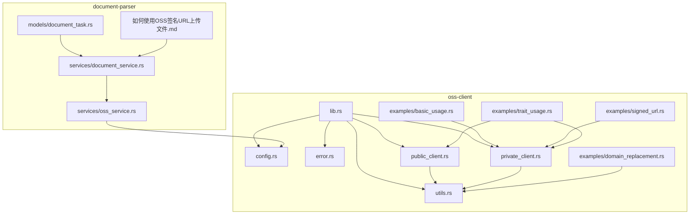
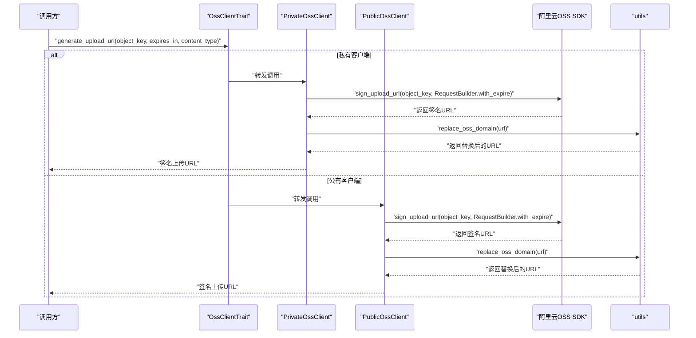
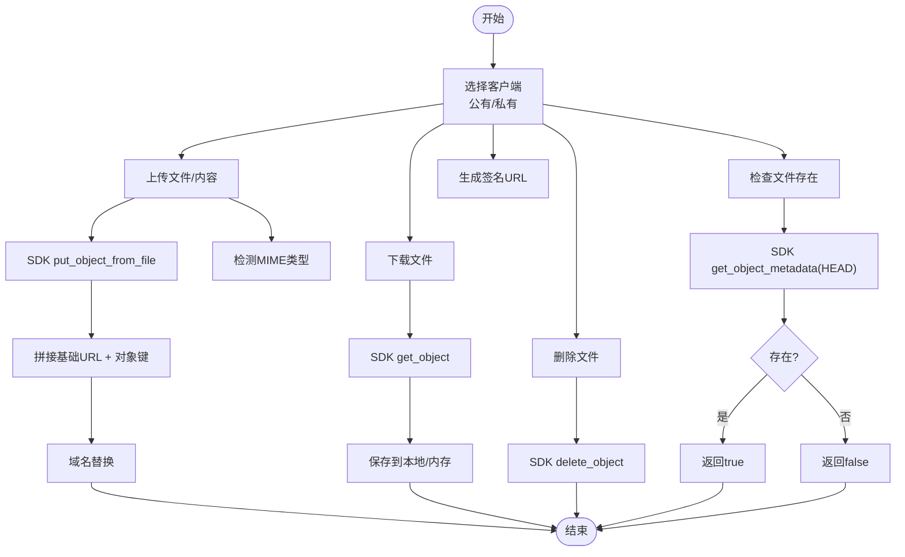

# OSS客户端

<cite>
**本文引用的文件**
- [oss-client/src/lib.rs](file://oss-client/src/lib.rs)
- [oss-client/src/public_client.rs](file://oss-client/src/public_client.rs)
- [oss-client/src/private_client.rs](file://oss-client/src/private_client.rs)
- [oss-client/src/config.rs](file://oss-client/src/config.rs)
- [oss-client/src/error.rs](file://oss-client/src/error.rs)
- [oss-client/src/utils.rs](file://oss-client/src/utils.rs)
- [oss-client/examples/basic_usage.rs](file://oss-client/examples/basic_usage.rs)
- [oss-client/examples/domain_replacement.rs](file://oss-client/examples/domain_replacement.rs)
- [oss-client/examples/signed_url.rs](file://oss-client/examples/signed_url.rs)
- [oss-client/examples/trait_usage.rs](file://oss-client/examples/trait_usage.rs)
- [oss-client/Cargo.toml](file://oss-client/Cargo.toml)
- [oss-client/README.md](file://oss-client/README.md)
- [document-parser/src/services/oss_service.rs](file://document-parser/src/services/oss_service.rs)
- [document-parser/如何使用OSS签名URL上传文件.md](file://document-parser/如何使用OSS签名URL上传文件.md)
- [document-parser/src/models/document_task.rs](file://document-parser/src/models/document_task.rs)
- [document-parser/src/services/document_service.rs](file://document-parser/src/services/document_service.rs)
</cite>

## 目录
1. [简介](#简介)
2. [项目结构](#项目结构)
3. [核心组件](#核心组件)
4. [架构总览](#架构总览)
5. [详细组件分析](#详细组件分析)
6. [依赖关系分析](#依赖关系分析)
7. [性能考虑](#性能考虑)
8. [故障排查指南](#故障排查指南)
9. [结论](#结论)
10. [附录](#附录)

## 简介
本文件面向使用者与开发者，系统性介绍 OSS 客户端的功能特性与使用方法，覆盖与阿里云对象存储的集成方案（文件上传/下载、签名URL生成、文件管理）、公有客户端与私有客户端的区别与适用场景、域名替换与签名URL等高级功能、错误处理机制与性能优化策略，并结合文档解析服务的集成实践给出最佳实践建议。

## 项目结构
OSS 客户端位于 oss-client 模块，提供统一的接口与两类客户端实现（公有/私有），并配套工具函数与示例；同时，文档解析服务（document-parser）通过独立的 OSS 服务封装与之协同，实现上传签名URL、下载签名URL、批量上传、对象管理等功能。

图表来源
- [oss-client/src/lib.rs](file://oss-client/src/lib.rs#L1-L159)
- [oss-client/src/config.rs](file://oss-client/src/config.rs#L1-L86)
- [oss-client/src/error.rs](file://oss-client/src/error.rs#L1-L174)
- [oss-client/src/public_client.rs](file://oss-client/src/public_client.rs#L1-L612)
- [oss-client/src/private_client.rs](file://oss-client/src/private_client.rs#L1-L219)
- [oss-client/src/utils.rs](file://oss-client/src/utils.rs#L1-L502)
- [oss-client/examples/basic_usage.rs](file://oss-client/examples/basic_usage.rs#L1-L102)
- [oss-client/examples/domain_replacement.rs](file://oss-client/examples/domain_replacement.rs#L1-L66)
- [oss-client/examples/signed_url.rs](file://oss-client/examples/signed_url.rs#L1-L140)
- [oss-client/examples/trait_usage.rs](file://oss-client/examples/trait_usage.rs#L1-L123)
- [document-parser/src/services/oss_service.rs](file://document-parser/src/services/oss_service.rs#L1-L800)
- [document-parser/src/models/document_task.rs](file://document-parser/src/models/document_task.rs#L1-L49)
- [document-parser/src/services/document_service.rs](file://document-parser/src/services/document_service.rs#L167-L385)
- [document-parser/如何使用OSS签名URL上传文件.md](file://document-parser/如何使用OSS签名URL上传文件.md#L1-L218)

章节来源
- [oss-client/src/lib.rs](file://oss-client/src/lib.rs#L1-L159)
- [oss-client/Cargo.toml](file://oss-client/Cargo.toml#L1-L21)

## 核心组件
- 统一接口 OssClientTrait：定义上传/下载/删除/存在性检查/连接测试/签名URL生成/对象键生成等能力，私有与公有客户端均实现该接口，便于多态使用。
- 配置 OssConfig：封装 endpoint、bucket、access_key_id、access_key_secret、region、upload_directory 等字段，并提供校验与基础URL、带前缀对象键生成。
- 错误类型 OssError：统一错误分类，便于上层处理与降级。
- 工具函数 utils：MIME类型检测、文件名清洗、随机文件名生成、文件大小格式化、域名替换（解决跨域）、批量域名替换等。
- 公有客户端 PublicOssClient：面向公有bucket，支持公开URL生成、批量公开URL生成、元信息HEAD获取、文件存在性检查、连接测试等。
- 私有客户端 PrivateOssClient：面向私有bucket，支持上传/内容上传/删除/存在性检查/连接测试、上传/下载签名URL生成等。
- 示例与文档：提供基本使用、签名URL、域名替换、统一接口等示例，以及 OSS 签名URL上传的使用指南。

章节来源
- [oss-client/src/lib.rs](file://oss-client/src/lib.rs#L42-L143)
- [oss-client/src/config.rs](file://oss-client/src/config.rs#L1-L86)
- [oss-client/src/error.rs](file://oss-client/src/error.rs#L1-L174)
- [oss-client/src/utils.rs](file://oss-client/src/utils.rs#L1-L502)
- [oss-client/src/public_client.rs](file://oss-client/src/public_client.rs#L1-L612)
- [oss-client/src/private_client.rs](file://oss-client/src/private_client.rs#L1-L219)
- [oss-client/examples/basic_usage.rs](file://oss-client/examples/basic_usage.rs#L1-L102)
- [oss-client/examples/signed_url.rs](file://oss-client/examples/signed_url.rs#L1-L140)
- [oss-client/examples/domain_replacement.rs](file://oss-client/examples/domain_replacement.rs#L1-L66)
- [oss-client/examples/trait_usage.rs](file://oss-client/examples/trait_usage.rs#L1-L123)
- [oss-client/README.md](file://oss-client/README.md#L1-L413)

## 架构总览
OSS 客户端通过统一接口抽象，屏蔽公有/私有 bucket 的差异；工具函数负责域名替换与文件元数据处理；示例展示典型用法；文档解析服务在更高层通过 OSS 服务封装与客户端协作，实现签名URL、批量上传、对象管理与下载等。

图表来源
- [oss-client/src/lib.rs](file://oss-client/src/lib.rs#L42-L143)
- [oss-client/src/config.rs](file://oss-client/src/config.rs#L1-L86)
- [oss-client/src/error.rs](file://oss-client/src/error.rs#L1-L174)
- [oss-client/src/public_client.rs](file://oss-client/src/public_client.rs#L1-L612)
- [oss-client/src/private_client.rs](file://oss-client/src/private_client.rs#L1-L219)
- [oss-client/src/utils.rs](file://oss-client/src/utils.rs#L1-L502)

## 详细组件分析

### 统一接口 OssClientTrait
- 能力范围：获取配置、基础URL、生成上传/下载签名URL、上传文件/内容、删除文件、检查文件存在、连接测试、生成唯一对象键。
- 设计价值：通过 trait 抽象，实现多态使用，便于在业务层以统一方式调用不同客户端。

章节来源
- [oss-client/src/lib.rs](file://oss-client/src/lib.rs#L42-L143)

### 配置 OssConfig
- 字段：endpoint、bucket、access_key_id、access_key_secret、region、upload_directory。
- 校验：对关键字段进行非空校验。
- 基础URL与带前缀对象键：提供 get_base_url 与 get_prefixed_key，后者自动拼接 upload_directory 前缀，避免重复拼接。

章节来源
- [oss-client/src/config.rs](file://oss-client/src/config.rs#L1-L86)

### 错误类型 OssError
- 分类：配置、网络、文件不存在、权限、IO、SDK、文件大小超限、不支持的文件类型、超时、无效参数。
- 辅助判断：提供 is_xxx_error 方法，便于分支处理。

章节来源
- [oss-client/src/error.rs](file://oss-client/src/error.rs#L1-L174)

### 工具函数 utils
- MIME类型检测与类型判断：支持图片/文档/音频/视频类型识别。
- 文件名处理：清洗特殊字符、生成随机文件名、提取扩展名/文件名/无扩展名文件名。
- 文件大小格式化与解析：支持 B/KB/MB/GB/TB。
- 域名替换：将固定公网 bucket 域名替换为自定义域名，解决跨域问题；提供批量替换。
- 用途：在客户端内部用于签名URL生成、公开URL生成、文件元信息获取等。

章节来源
- [oss-client/src/utils.rs](file://oss-client/src/utils.rs#L1-L502)

### 公有客户端 PublicOssClient
- 能力：
  - 公开下载URL与公开访问URL生成（无需签名，永久有效）。
  - 批量公开URL生成。
  - 通过HTTP HEAD获取文件元信息（content-length/content-type/last-modified/etag）。
  - 上传/内容上传/删除/存在性检查/连接测试。
  - 生成唯一对象键（带时间戳与短UUID，可保留原始文件扩展名）。
- 适用场景：公开资源、产品文档、静态资源等无需鉴权的场景。

章节来源
- [oss-client/src/public_client.rs](file://oss-client/src/public_client.rs#L1-L612)

### 私有客户端 PrivateOssClient
- 能力：
  - 上传/内容上传/删除/存在性检查/连接测试。
  - 上传签名URL与下载签名URL生成（可设置过期时间）。
  - 生成唯一对象键（与公有客户端一致的命名策略）。
- 适用场景：私有文件、临时分享、受控访问等需要签名与过期控制的场景。

章节来源
- [oss-client/src/private_client.rs](file://oss-client/src/private_client.rs#L1-L219)

### 公有客户端与私有客户端对比
- 是否需要签名：公有客户端生成公开URL，无需签名；私有客户端生成签名URL，需要过期时间。
- 访问性质：公有客户端适合公开资源；私有客户端适合受控访问。
- 元信息获取：公有客户端可通过HTTP HEAD获取元信息；私有客户端通过SDK接口检查存在性。
- 域名替换：两者均使用 utils::replace_oss_domain 进行域名替换，解决跨域问题。

章节来源
- [oss-client/src/public_client.rs](file://oss-client/src/public_client.rs#L1-L612)
- [oss-client/src/private_client.rs](file://oss-client/src/private_client.rs#L1-L219)
- [oss-client/src/utils.rs](file://oss-client/src/utils.rs#L245-L301)

### 签名URL生成流程（序列图）

图表来源
- [oss-client/src/private_client.rs](file://oss-client/src/private_client.rs#L60-L91)
- [oss-client/src/public_client.rs](file://oss-client/src/public_client.rs#L256-L289)
- [oss-client/src/utils.rs](file://oss-client/src/utils.rs#L245-L275)

### 文件上传/下载/删除流程（流程图）

图表来源
- [oss-client/src/private_client.rs](file://oss-client/src/private_client.rs#L93-L177)
- [oss-client/src/public_client.rs](file://oss-client/src/public_client.rs#L303-L436)
- [oss-client/src/utils.rs](file://oss-client/src/utils.rs#L245-L275)

### 域名替换与跨域处理
- 目的：将固定公网 bucket 域名替换为自定义域名，避免浏览器跨域限制。
- 实现：utils::replace_oss_domain 与 utils::replace_oss_domains_batch。
- 场景：图片预览、公开资源访问、批量URL处理。

章节来源
- [oss-client/src/utils.rs](file://oss-client/src/utils.rs#L245-L301)
- [oss-client/examples/domain_replacement.rs](file://oss-client/examples/domain_replacement.rs#L1-L66)

### 统一接口与多态使用
- 通过 OssClientTrait，可在运行时以统一方式调用不同客户端，便于在业务层抽象。
- 示例：trait_usage.rs 展示了多态使用与通用上传/删除函数。

章节来源
- [oss-client/examples/trait_usage.rs](file://oss-client/examples/trait_usage.rs#L1-L123)
- [oss-client/src/lib.rs](file://oss-client/src/lib.rs#L42-L143)

### 与文档解析服务的集成
- 文档解析服务通过独立的 OSS 服务封装（document-parser/src/services/oss_service.rs）与阿里云OSS交互，提供：
  - 上传文件/内容、批量上传、下载到本地、获取对象内容、生成上传/下载签名URL、删除对象等。
  - 并发控制（信号量）、重试机制、分片上传策略（按文件大小决策）。
- 与 OSS 客户端的关系：
  - oss-client 提供统一接口与工具函数，便于在应用层以统一方式调用。
  - document-parser 的 OSS 服务封装在更高层，提供更丰富的上传/下载/签名URL能力与并发控制。
- 集成最佳实践：
  - 使用签名URL实现直传（客户端直连OSS，减轻服务端压力）。
  - 上传完成后，触发文档解析任务，解析结果可回写到 OSS 并记录到任务模型中。
  - 使用对象键生成策略保证唯一性与可读性。

章节来源
- [document-parser/src/services/oss_service.rs](file://document-parser/src/services/oss_service.rs#L1-L800)
- [document-parser/src/services/document_service.rs](file://document-parser/src/services/document_service.rs#L167-L385)
- [document-parser/src/models/document_task.rs](file://document-parser/src/models/document_task.rs#L1-L49)
- [document-parser/如何使用OSS签名URL上传文件.md](file://document-parser/如何使用OSS签名URL上传文件.md#L1-L218)

## 依赖关系分析
- 依赖库：aliyun-oss-rust-sdk、chrono、reqwest、serde、tokio、tracing、uuid、async-trait、tempfile、thiserror。
- 关系：oss-client 通过 aliyun-oss-rust-sdk 与阿里云OSS交互；通过 reqwest 与 HTTP HEAD 元信息获取；通过 tokio 异步运行；通过 tracing 日志；通过 thiserror 统一错误类型；通过 uuid/tempfile 生成唯一标识与临时文件。

章节来源
- [oss-client/Cargo.toml](file://oss-client/Cargo.toml#L1-L21)

## 性能考虑
- 并发与限流：在更高层的 OSS 服务封装中使用信号量控制并发上传，避免资源争用。
- 重试机制：上传失败时按配置进行重试，提升稳定性。
- 分片上传：按文件大小决策上传策略（示例中对大文件仍采用简单上传，可根据实际SDK能力扩展）。
- 域名替换：减少跨域带来的额外请求与失败，提升前端加载效率。
- 日志与可观测性：通过 tracing 输出关键步骤日志，便于定位性能瓶颈。

章节来源
- [oss-client/src/utils.rs](file://oss-client/src/utils.rs#L245-L301)
- [document-parser/src/services/oss_service.rs](file://document-parser/src/services/oss_service.rs#L1-L800)

## 故障排查指南
- 常见错误类型与处理：
  - 配置错误：检查 access_key_id/access_key_secret/endpoint/bucket/region 是否正确。
  - 网络错误：检查网络连通性与DNS解析。
  - 权限不足：确认bucket权限与RAM角色策略。
  - 文件不存在：确认对象键是否正确，或先检查文件存在性。
  - SDK错误：查看底层SDK返回的具体错误信息。
  - 超时与无效参数：检查过期时间、内容类型、文件大小限制。
- 域名替换问题：确认替换规则与目标域名是否匹配，避免误替换。
- 签名URL问题：确认过期时间设置合理，Content-Type与文件类型一致。

章节来源
- [oss-client/src/error.rs](file://oss-client/src/error.rs#L1-L174)
- [oss-client/src/utils.rs](file://oss-client/src/utils.rs#L245-L301)
- [oss-client/examples/signed_url.rs](file://oss-client/examples/signed_url.rs#L1-L140)

## 结论
OSS 客户端提供了简洁统一的接口与完善的工具函数，既能满足公有/私有 bucket 的差异化需求，又能在应用层以多态方式统一调用。结合文档解析服务的 OSS 服务封装，可实现从签名URL直传、批量上传、对象管理到解析结果落盘的完整链路。通过合理的错误处理与性能优化策略，可在生产环境中稳定高效地运行。

## 附录

### 快速开始与示例路径
- 基本使用：[examples/basic_usage.rs](file://oss-client/examples/basic_usage.rs#L1-L102)
- 签名URL：[examples/signed_url.rs](file://oss-client/examples/signed_url.rs#L1-L140)
- 域名替换：[examples/domain_replacement.rs](file://oss-client/examples/domain_replacement.rs#L1-L66)
- 统一接口与多态：[examples/trait_usage.rs](file://oss-client/examples/trait_usage.rs#L1-L123)

### API与行为要点
- 上传/内容上传：自动检测MIME类型，必要时使用临时文件；上传成功后拼接基础URL并进行域名替换。
- 删除/存在性检查：通过SDK的 delete_object/get_object_metadata 实现。
- 签名URL：上传/下载均可生成，支持自定义过期时间；下载URL在私有客户端中默认过期时间可配置。
- 公有URL：无需签名，永久有效；支持批量生成与元信息获取。

章节来源
- [oss-client/src/public_client.rs](file://oss-client/src/public_client.rs#L1-L612)
- [oss-client/src/private_client.rs](file://oss-client/src/private_client.rs#L1-L219)
- [oss-client/src/utils.rs](file://oss-client/src/utils.rs#L245-L301)