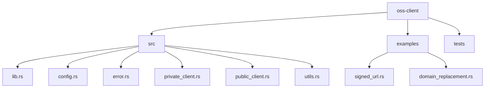
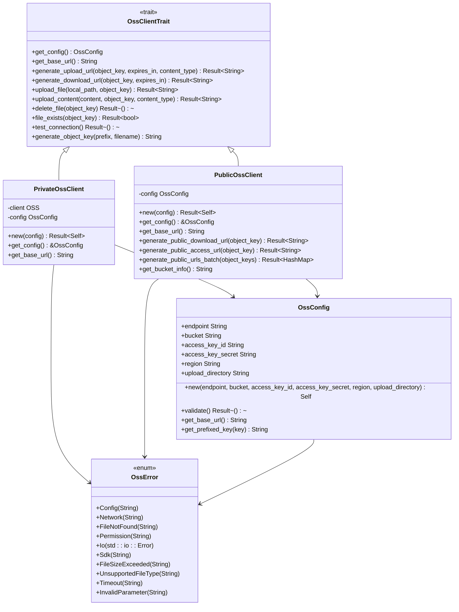
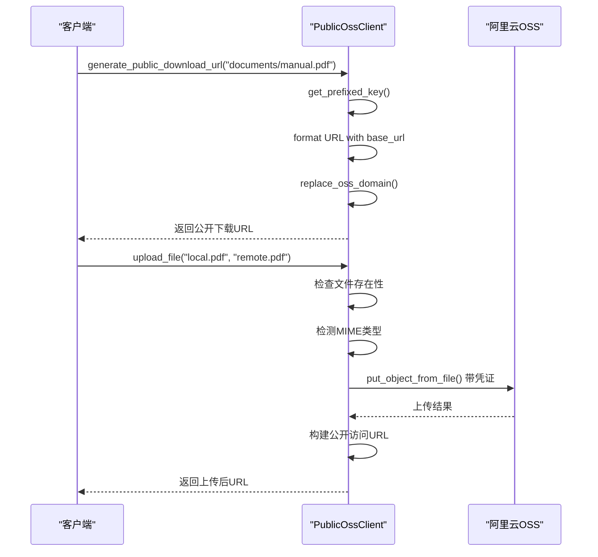
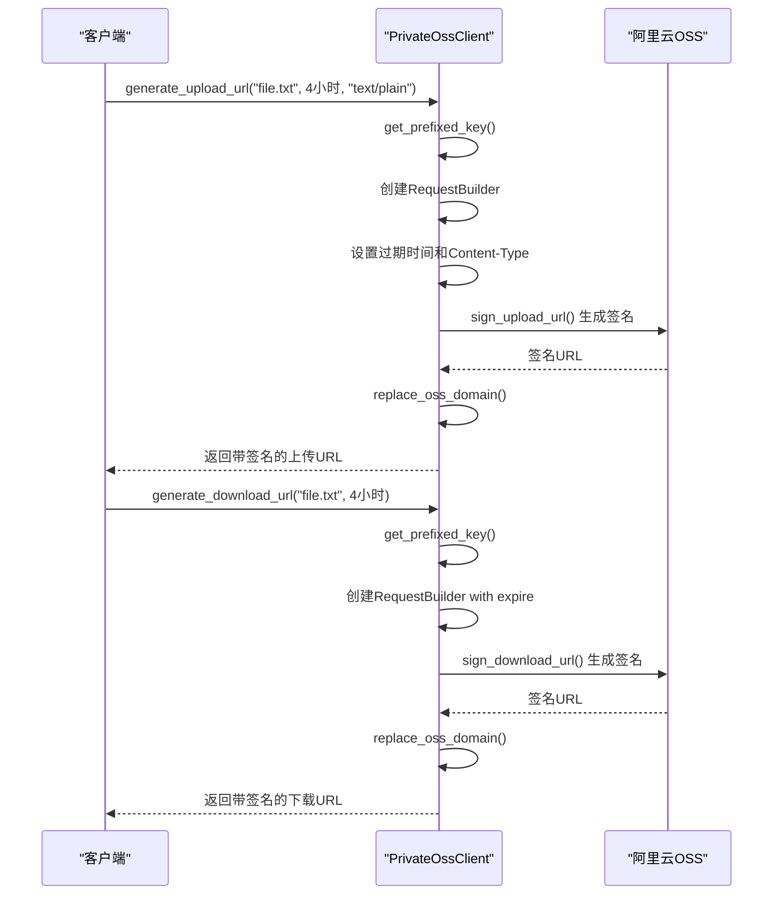
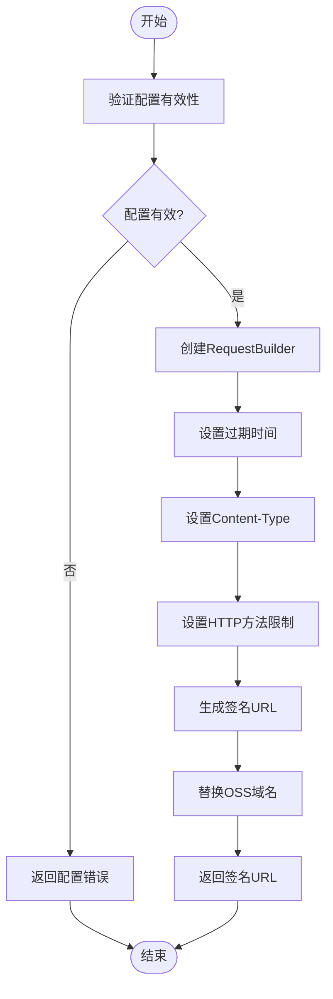
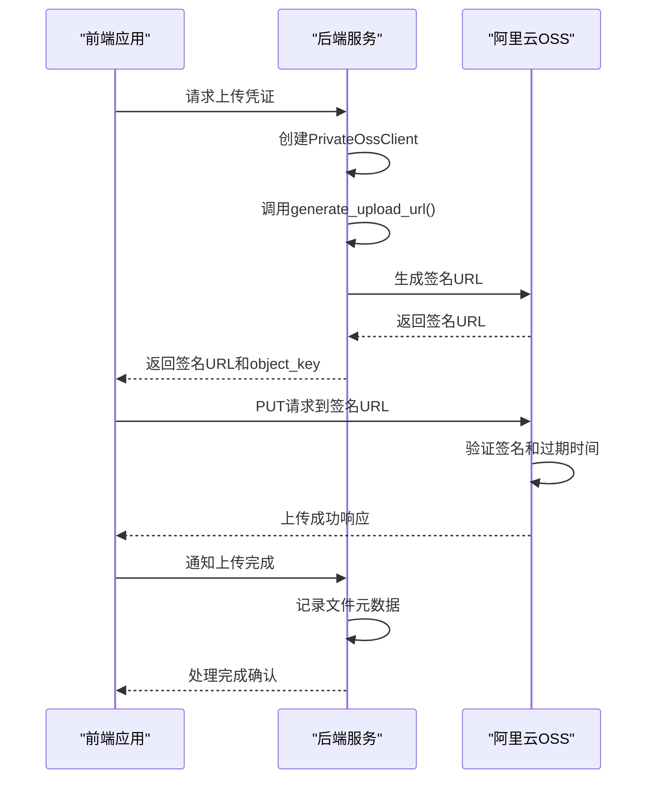
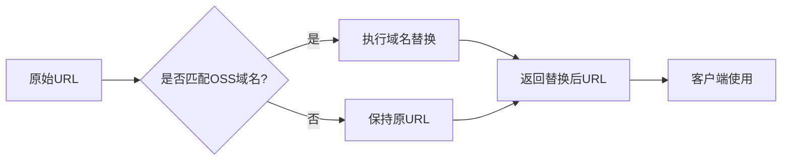
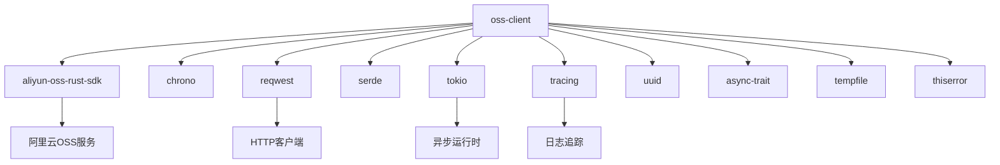
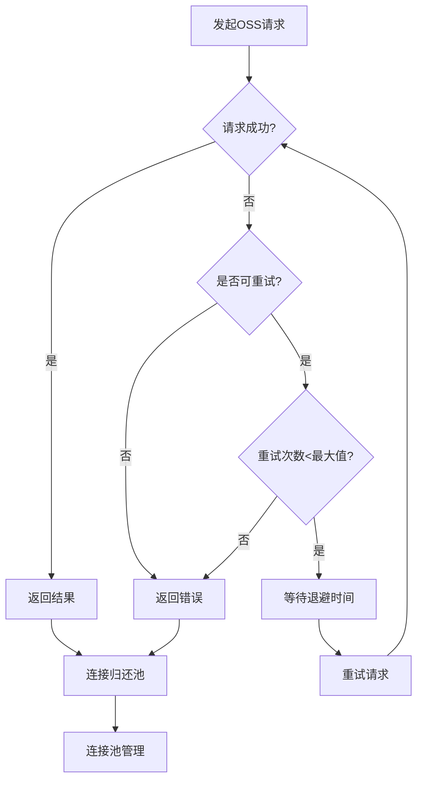
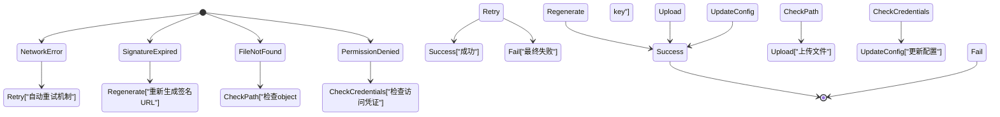

# OSS客户端库

<cite>
**本文档引用的文件**
- [lib.rs](file://oss-client/src/lib.rs)
- [private_client.rs](file://oss-client/src/private_client.rs)
- [public_client.rs](file://oss-client/src/public_client.rs)
- [config.rs](file://oss-client/src/config.rs)
- [utils.rs](file://oss-client/src/utils.rs)
- [error.rs](file://oss-client/src/error.rs)
- [signed_url.rs](file://oss-client/examples/signed_url.rs)
- [domain_replacement.rs](file://oss-client/examples/domain_replacement.rs)
</cite>

## 目录
1. [简介](#简介)
2. [项目结构](#项目结构)
3. [核心组件](#核心组件)
4. [架构概述](#架构概述)
5. [详细组件分析](#详细组件分析)
6. [依赖分析](#依赖分析)
7. [性能考虑](#性能考虑)
8. [故障排除指南](#故障排除指南)
9. [结论](#结论)

## 简介
本技术文档详细说明了OSS客户端库的设计与实现，该库封装了阿里云OSS API的核心功能。文档重点阐述了PublicClient与PrivateClient的区别、签名URL配置、域名替换功能、内部重试机制以及与其他服务的集成实践。

## 项目结构
OSS客户端库采用模块化设计，主要包含配置、错误处理、公共/私有客户端实现和工具函数等模块。

**图示来源**
- [lib.rs](file://oss-client/src/lib.rs#L1-L158)
- [config.rs](file://oss-client/src/config.rs#L1-L85)

## 核心组件
OSS客户端库的核心组件包括OssClientTrait接口、PublicOssClient和PrivateOssClient实现、OssConfig配置结构体以及各种工具函数。

**本节来源**
- [lib.rs](file://oss-client/src/lib.rs#L1-L158)
- [private_client.rs](file://oss-client/src/private_client.rs#L1-L218)
- [public_client.rs](file://oss-client/src/public_client.rs#L1-L614)

## 架构概述
OSS客户端库采用trait接口驱动的设计模式，通过OssClientTrait定义统一的操作接口，由PublicOssClient和PrivateOssClient分别实现公有和私有bucket的访问逻辑。

**图示来源**
- [lib.rs](file://oss-client/src/lib.rs#L1-L158)
- [private_client.rs](file://oss-client/src/private_client.rs#L1-L218)
- [public_client.rs](file://oss-client/src/public_client.rs#L1-L614)
- [config.rs](file://oss-client/src/config.rs#L1-L85)
- [error.rs](file://oss-client/src/error.rs#L1-L173)

## 详细组件分析

### PublicClient与PrivateClient的区别
PublicClient和PrivateClient分别用于处理公有和私有bucket的访问需求，两者在安全性和使用场景上有显著区别。

#### PublicClient分析
PublicClient用于公开资源访问，所有操作都基于公有bucket，无需签名验证即可访问资源。

**图示来源**
- [public_client.rs](file://oss-client/src/public_client.rs#L1-L614)

#### PrivateClient分析
PrivateClient支持签名URL生成，通过安全的签名机制实现临时访问权限控制，适用于需要安全上传下载的场景。

**图示来源**
- [private_client.rs](file://oss-client/src/private_client.rs#L1-L218)

### SignedUrlConfig参数配置
通过SignedUrlConfig相关参数可以精确控制签名URL的行为特性，包括过期时间、HTTP方法限制等。

#### 签名URL配置流程

**图示来源**
- [private_client.rs](file://oss-client/src/private_client.rs#L1-L218)
- [public_client.rs](file://oss-client/src/public_client.rs#L1-L614)

### 签名URL生成完整流程
通过signed_url.rs示例展示了生成PUT签名URL以供前端直传的完整流程。

**图示来源**
- [signed_url.rs](file://oss-client/examples/signed_url.rs#L1-L139)
- [private_client.rs](file://oss-client/src/private_client.rs#L1-L218)

### DomainReplacement功能
DomainReplacement功能通过域名替换优化访问性能，解决跨域问题。

#### 域名替换机制

**图示来源**
- [utils.rs](file://oss-client/src/utils.rs#L1-L501)
- [domain_replacement.rs](file://oss-client/examples/domain_replacement.rs#L1-L65)

## 依赖分析
OSS客户端库依赖多个外部crate来实现其功能，形成了清晰的依赖关系。

**图示来源**
- [Cargo.toml](file://oss-client/Cargo.toml#L1-L21)
- [lib.rs](file://oss-client/src/lib.rs#L1-L158)

## 性能考虑
OSS客户端库在设计时考虑了多种性能优化策略，包括连接池管理、重试机制和错误处理。

### 重试机制与连接池

**图示来源**
- [private_client.rs](file://oss-client/src/private_client.rs#L1-L218)
- [public_client.rs](file://oss-client/src/public_client.rs#L1-L614)

## 故障排除指南
了解常见的错误类型和处理策略对于有效使用OSS客户端库至关重要。

### 错误处理策略

**本节来源**
- [error.rs](file://oss-client/src/error.rs#L1-L173)
- [private_client.rs](file://oss-client/src/private_client.rs#L1-L218)

## 结论
OSS客户端库提供了一套完整的阿里云OSS操作接口，通过PublicClient和PrivateClient的区分设计，满足了不同场景下的访问需求。库中实现的签名URL生成、域名替换、重试机制等功能，为开发者提供了安全、高效、易用的OSS集成方案。与document-parser和voice-cli的集成实践表明，该库能够很好地支持各种应用场景，是阿里云OSS操作的理想选择。