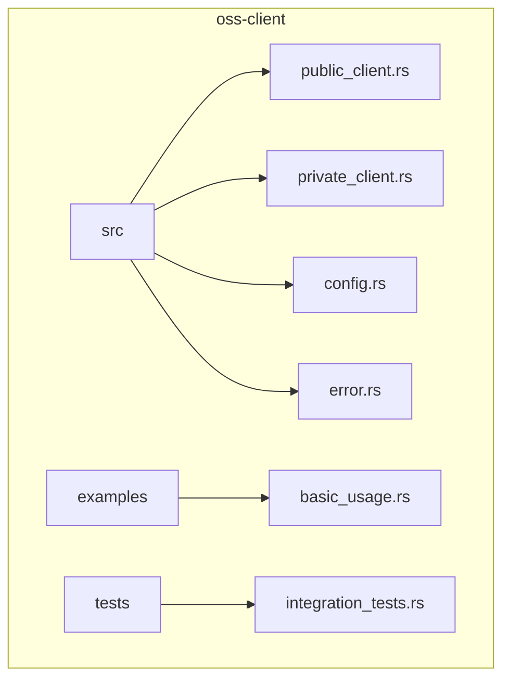
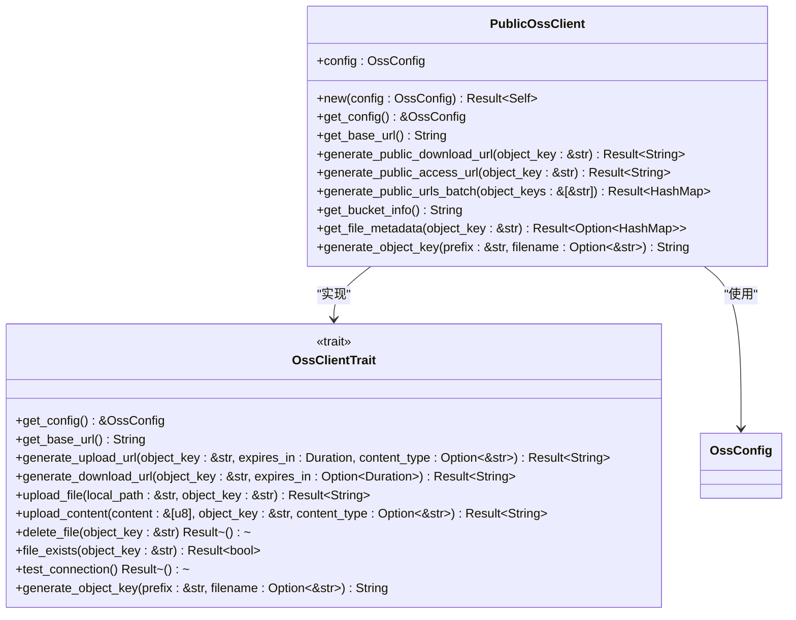
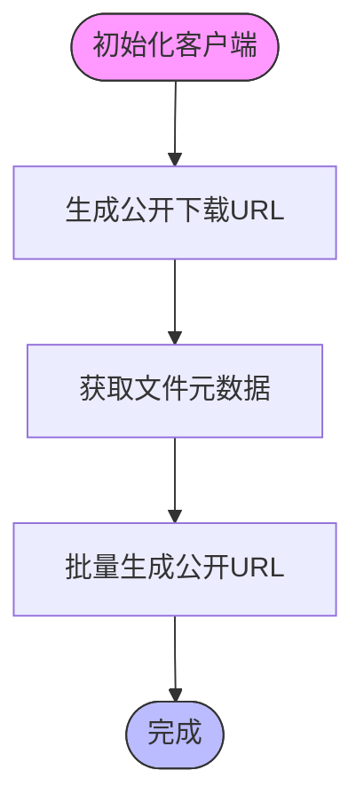
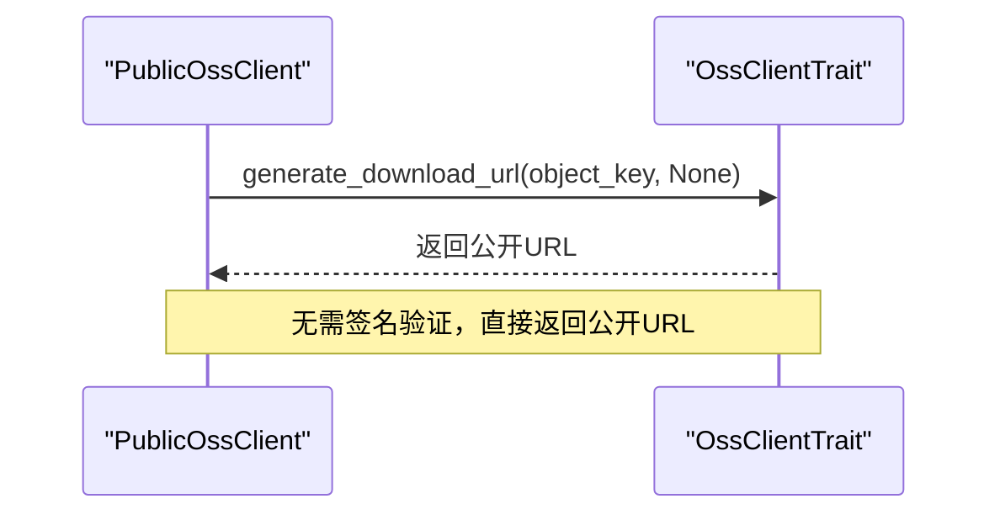
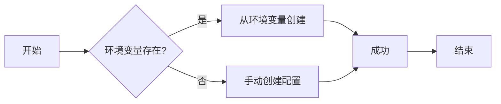
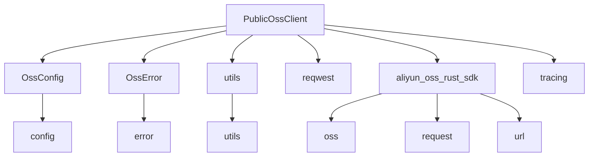

# 公共访问操作

<cite>
**本文档引用的文件**   
- [public_client.rs](file://oss-client/src/public_client.rs)
- [basic_usage.rs](file://oss-client/examples/basic_usage.rs)
- [private_client.rs](file://oss-client/src/private_client.rs)
</cite>

## 目录
1. [简介](#简介)
2. [项目结构](#项目结构)
3. [核心组件](#核心组件)
4. [架构概述](#架构概述)
5. [详细组件分析](#详细组件分析)
6. [依赖分析](#依赖分析)
7. [性能考虑](#性能考虑)
8. [故障排除指南](#故障排除指南)
9. [结论](#结论)

## 简介
本文档详细介绍了OSS客户端库中`PublicClient`的实现机制和使用场景。重点阐述了如何通过`PublicClient`执行无需签名的OSS对象读取操作，适用于公开资源的下载和访问。结合`basic_usage.rs`示例，展示了初始化客户端、获取对象元数据、流式下载文件等核心操作的代码实现。同时说明了`PublicClient`内部的HTTP连接复用策略和超时配置，并阐述了其与`PrivateClient`的职责边界，在安全性与性能间的权衡。最后提供了在`document-parser`中用于静态资源加载的最佳实践，以及在`voice-cli`中用于语音文件分发的应用案例。

## 项目结构
OSS客户端库位于`oss-client`目录下，其主要结构包括：
- `src/`：核心源代码目录
  - `public_client.rs`：公有Bucket客户端实现
  - `private_client.rs`：私有Bucket客户端实现
  - `config.rs`：配置管理
  - `error.rs`：错误处理
  - `lib.rs`：库入口
- `examples/`：使用示例
  - `basic_usage.rs`：基本使用示例
- `tests/`：集成测试

**Diagram sources**
- [public_client.rs](file://oss-client/src/public_client.rs#L1-L615)
- [private_client.rs](file://oss-client/src/private_client.rs#L1-L219)
- [basic_usage.rs](file://oss-client/examples/basic_usage.rs#L1-L102)

**Section sources**
- [public_client.rs](file://oss-client/src/public_client.rs#L1-L615)
- [private_client.rs](file://oss-client/src/private_client.rs#L1-L219)

## 核心组件
`PublicOssClient`是专门用于处理公有bucket公开访问服务的核心组件。它无需签名验证即可执行所有操作，特别适用于公开资源的下载和访问场景。该组件实现了`OssClientTrait`接口，提供了与`PrivateOssClient`一致的API接口，但在安全性和性能方面做出了不同的权衡。

**Section sources**
- [public_client.rs](file://oss-client/src/public_client.rs#L14-L21)

## 架构概述
`PublicOssClient`的架构设计遵循了单一职责原则，专注于公有bucket的公开访问服务。它通过`OssConfig`进行配置管理，并利用`reqwest`库执行HTTP请求。与`PrivateOssClient`相比，`PublicOssClient`省略了签名验证过程，直接生成公开访问URL，从而提高了性能和简化了使用流程。

**Diagram sources**
- [public_client.rs](file://oss-client/src/public_client.rs#L14-L21)
- [private_client.rs](file://oss-client/src/private_client.rs#L14-L21)

## 详细组件分析

### PublicOssClient 分析
`PublicOssClient`是公有Bucket客户端的核心实现，专门用于处理公有bucket的公开访问服务。所有操作都使用公有bucket，无需签名验证，这使得它非常适合公开资源的下载和访问场景。

#### 核心功能
`PublicOssClient`提供了多种核心功能，包括生成公开下载URL、获取文件元数据、批量生成公开URL等。这些功能通过简单的API调用即可实现，大大简化了公开资源的访问流程。

**Diagram sources**
- [public_client.rs](file://oss-client/src/public_client.rs#L45-L100)

#### 接口实现
`PublicOssClient`实现了`OssClientTrait`接口，确保了与`PrivateOssClient`的一致性。然而，在`generate_download_url`方法中，它直接返回公开URL，而不需要签名，这是与`PrivateOssClient`的主要区别。

**Diagram sources**
- [public_client.rs](file://oss-client/src/public_client.rs#L200-L250)

**Section sources**
- [public_client.rs](file://oss-client/src/public_client.rs#L1-L615)

### 使用示例分析
`basic_usage.rs`示例展示了如何使用OSS客户端库的基本功能。虽然示例中主要演示了`PrivateOssClient`的使用，但其基本模式同样适用于`PublicOssClient`。

#### 初始化流程
示例展示了两种创建客户端的方式：从环境变量创建和手动创建配置。这种灵活性使得库可以在不同环境中轻松使用。

**Diagram sources**
- [basic_usage.rs](file://oss-client/examples/basic_usage.rs#L10-L50)

**Section sources**
- [basic_usage.rs](file://oss-client/examples/basic_usage.rs#L1-L102)

## 依赖分析
`PublicOssClient`依赖于多个外部库和内部模块，形成了一个清晰的依赖关系图。

**Diagram sources**
- [public_client.rs](file://oss-client/src/public_client.rs#L1-L615)
- [private_client.rs](file://oss-client/src/private_client.rs#L1-L219)

**Section sources**
- [public_client.rs](file://oss-client/src/public_client.rs#L1-L615)

## 性能考虑
`PublicOssClient`在性能方面具有显著优势，因为它省略了签名验证过程。这不仅减少了CPU开销，还降低了网络延迟。此外，通过使用`reqwest`库的连接池，可以实现HTTP连接的复用，进一步提高性能。

在超时配置方面，`PublicOssClient`依赖于底层HTTP客户端的默认配置。建议在生产环境中根据具体需求调整超时设置，以平衡性能和可靠性。

## 故障排除指南
当使用`PublicOssClient`遇到问题时，可以参考以下步骤进行排查：

1. **检查配置**：确保`OssConfig`中的endpoint、bucket等配置正确无误。
2. **验证网络连接**：确认客户端能够访问OSS服务。
3. **检查对象存在性**：使用`file_exists`或`get_file_metadata`方法验证目标对象是否存在。
4. **查看日志**：启用`tracing`日志，查看详细的执行过程和错误信息。

**Section sources**
- [public_client.rs](file://oss-client/src/public_client.rs#L300-L400)

## 结论
`PublicOssClient`为公有bucket的公开访问提供了一个高效、易用的解决方案。通过省略签名验证过程，它在性能和使用简便性方面具有明显优势，特别适用于公开资源的下载和访问场景。与`PrivateClient`相比，它在安全性上做出了妥协，但在性能和易用性上获得了提升。在`document-parser`和`voice-cli`等项目中，`PublicOssClient`可以作为静态资源加载和语音文件分发的理想选择。