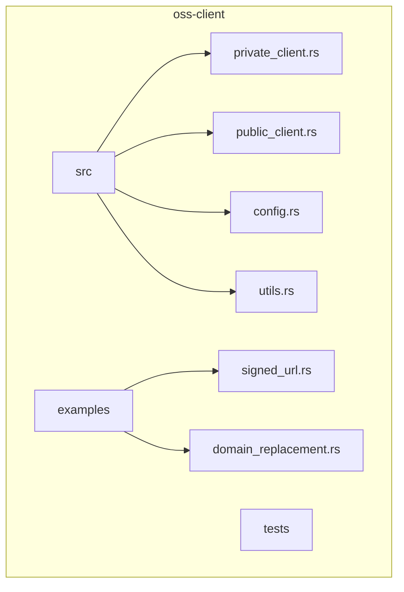
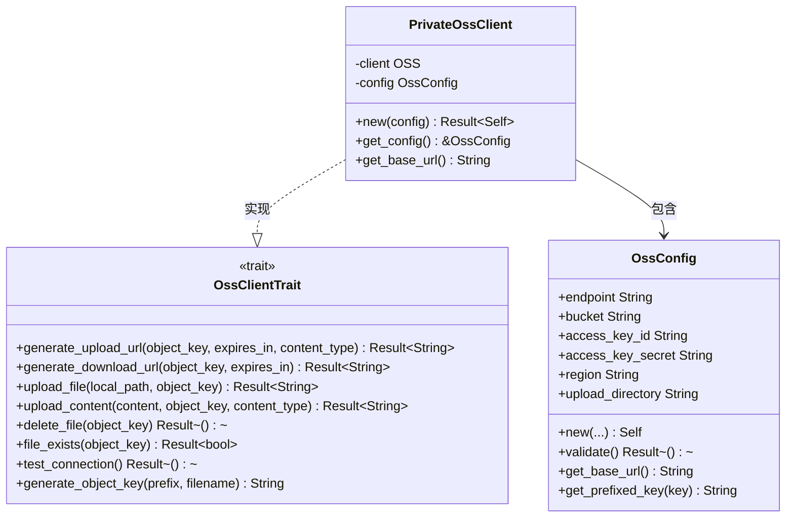
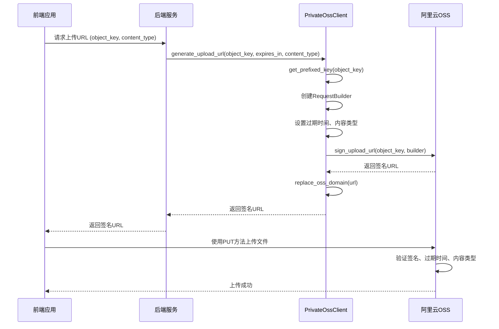
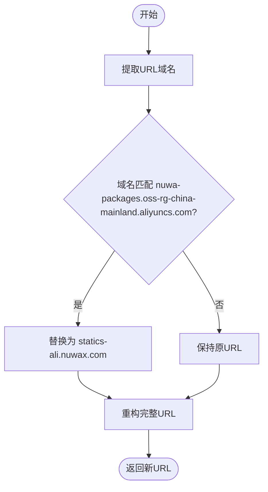
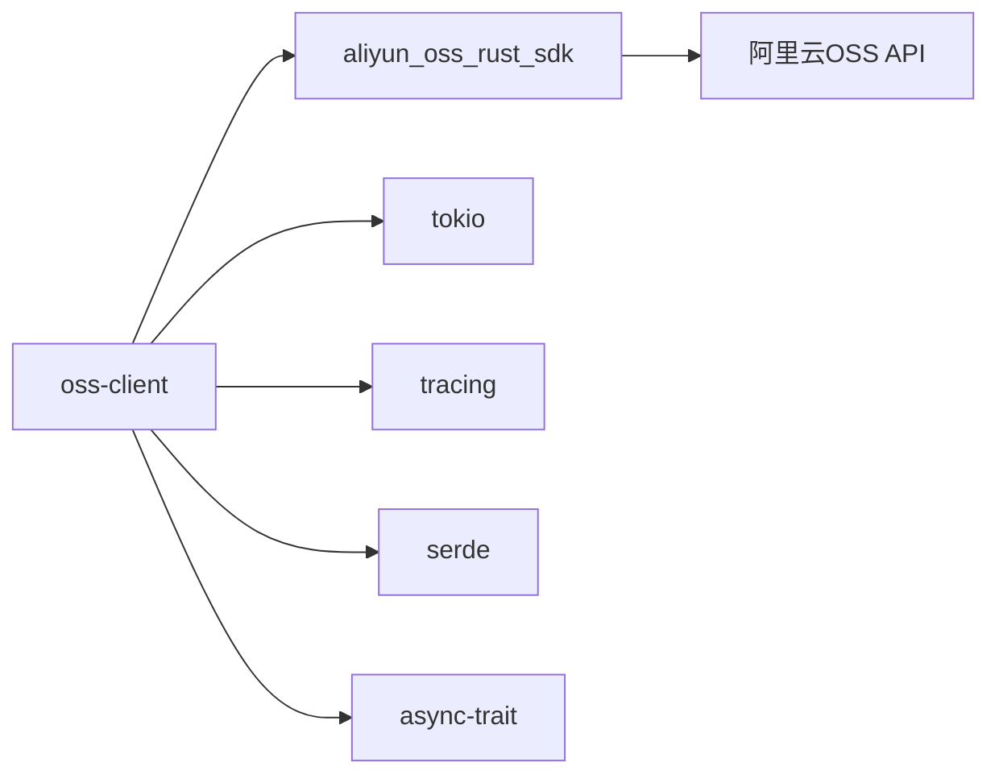

# 私有资源与签名管理

<cite>
**本文档引用文件**  
- [private_client.rs](file://oss-client/src/private_client.rs)
- [utils.rs](file://oss-client/src/utils.rs)
- [config.rs](file://oss-client/src/config.rs)
- [signed_url.rs](file://oss-client/examples/signed_url.rs)
- [domain_replacement.rs](file://oss-client/examples/domain_replacement.rs)
- [oss_service.rs](file://document-parser/src/services/oss_service.rs)
- [private_oss_handler.rs](file://document-parser/src/handlers/private_oss_handler.rs)
</cite>

## 目录
1. [简介](#简介)
2. [项目结构](#项目结构)
3. [核心组件](#核心组件)
4. [架构概述](#架构概述)
5. [详细组件分析](#详细组件分析)
6. [依赖分析](#依赖分析)
7. [性能考虑](#性能考虑)
8. [故障排除指南](#故障排除指南)
9. [结论](#结论)

## 简介
本文档深入解析OSS客户端库中私有资源访问与签名URL生成的技术实现。重点阐述`PrivateClient`如何基于阿里云OSS签名机制生成安全的预签名URL，支持PUT/GET等HTTP方法的细粒度控制。详细说明`SignedUrlConfig`结构体中`expires_in`、`allowed_methods`等关键字段的配置方式，并通过`signed_url.rs`示例完整演示从前端上传请求到后端生成PUT签名URL，再到客户端直传OSS的全流程。同时涵盖签名URL的安全性保障机制、CDN域名替换功能以及常见错误处理方案。

## 项目结构
OSS客户端库位于`oss-client`目录下，主要包含`src`、`examples`和`tests`三个子目录。`src`目录下实现了私有和公有客户端的核心逻辑，`examples`目录提供了签名URL和域名替换的使用示例，`tests`目录包含集成测试用例。该库通过`aliyun_oss_rust_sdk`与阿里云OSS服务进行交互，实现了安全的私有资源访问机制。

**Diagram sources**
- [private_client.rs](file://oss-client/src/private_client.rs#L1-L218)
- [domain_replacement.rs](file://oss-client/examples/domain_replacement.rs#L1-L65)

**Section sources**
- [private_client.rs](file://oss-client/src/private_client.rs#L1-L218)
- [examples](file://oss-client/examples)

## 核心组件
核心组件包括`PrivateOssClient`、`OssConfig`和域名替换工具函数。`PrivateOssClient`实现了`OssClientTrait`接口，提供生成上传和下载签名URL的功能。`OssConfig`结构体封装了OSS连接所需的所有配置信息，包括endpoint、bucket、access key等。`replace_oss_domain`函数实现了将阿里云OSS域名替换为自定义域名的功能，解决跨域问题。

**Section sources**
- [private_client.rs](file://oss-client/src/private_client.rs#L1-L218)
- [config.rs](file://oss-client/src/config.rs#L1-L85)
- [utils.rs](file://oss-client/src/utils.rs#L1-L501)

## 架构概述
系统架构采用分层设计，上层为客户端应用，中层为OSS客户端库，底层为阿里云OSS服务。客户端库通过`aliyun_oss_rust_sdk`与OSS服务通信，对外提供简单易用的API。签名URL生成流程包括：客户端请求 -> 服务端验证权限 -> 生成预签名URL -> 返回给客户端 -> 客户端直传OSS。

**Diagram sources**
- [private_client.rs](file://oss-client/src/private_client.rs#L1-L218)
- [oss_service.rs](file://document-parser/src/services/oss_service.rs#L735-L777)

## 详细组件分析

### PrivateOssClient分析
`PrivateOssClient`是私有OSS客户端的核心实现，负责生成安全的预签名URL。

#### 类图

**Diagram sources**
- [private_client.rs](file://oss-client/src/private_client.rs#L1-L218)
- [config.rs](file://oss-client/src/config.rs#L1-L85)

### 签名URL生成流程分析
签名URL生成是私有资源访问的核心功能，支持细粒度的HTTP方法控制。

#### 序列图

**Diagram sources**
- [private_client.rs](file://oss-client/src/private_client.rs#L1-L218)
- [signed_url.rs](file://oss-client/examples/signed_url.rs#L1-L139)

### 域名替换功能分析
域名替换功能用于解决跨域问题，提升资源访问性能。

#### 流程图

**Diagram sources**
- [utils.rs](file://oss-client/src/utils.rs#L447-L473)
- [domain_replacement.rs](file://oss-client/examples/domain_replacement.rs#L1-L65)

## 依赖分析
OSS客户端库依赖于`aliyun_oss_rust_sdk`与阿里云OSS服务通信，同时使用`tokio`进行异步操作，`tracing`进行日志记录，`serde`进行序列化。通过`async-trait`实现异步trait，确保接口的灵活性和可扩展性。

**Diagram sources**
- [Cargo.toml](file://oss-client/Cargo.toml)
- [private_client.rs](file://oss-client/src/private_client.rs#L1-L218)

**Section sources**
- [Cargo.toml](file://oss-client/Cargo.toml)

## 性能考虑
在性能方面，签名URL的生成是轻量级操作，主要开销在于网络请求的签名计算。建议合理设置签名URL的有效期，避免频繁生成。对于大量URL的域名替换，应使用`replace_oss_domains_batch`批量处理，减少函数调用开销。同时，通过CDN域名替换可以显著提升资源访问速度，减少跨域请求的延迟。

## 故障排除指南
常见问题包括签名失效、权限不足和域名替换失败。

**Section sources**
- [private_client.rs](file://oss-client/src/private_client.rs#L1-L218)
- [utils.rs](file://oss-client/src/utils.rs#L447-L473)
- [oss_service.rs](file://document-parser/src/services/oss_service.rs#L735-L777)

### 签名失效处理
当签名URL过期时，客户端需要重新向服务端请求新的签名URL。服务端应返回明确的错误信息，指导客户端进行重试。

### 权限不足处理
确保`access_key_id`和`access_key_secret`具有足够的权限访问指定的bucket和object。检查OSS的RAM策略配置，确保允许`PutObject`和`GetObject`操作。

### 域名替换失败处理
确认原始URL的域名与`OLD_DOMAIN`常量完全匹配。检查URL是否包含协议头（https://），以及大小写是否一致。

## 结论
本文档详细解析了OSS客户端库中私有资源访问和签名URL生成的技术实现。通过`PrivateOssClient`，可以安全地生成支持PUT/GET等HTTP方法的预签名URL，实现客户端直传OSS的功能。结合域名替换功能，不仅能解决跨域问题，还能提升资源访问性能。合理的错误处理机制确保了系统的稳定性和可靠性。