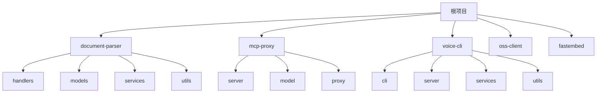
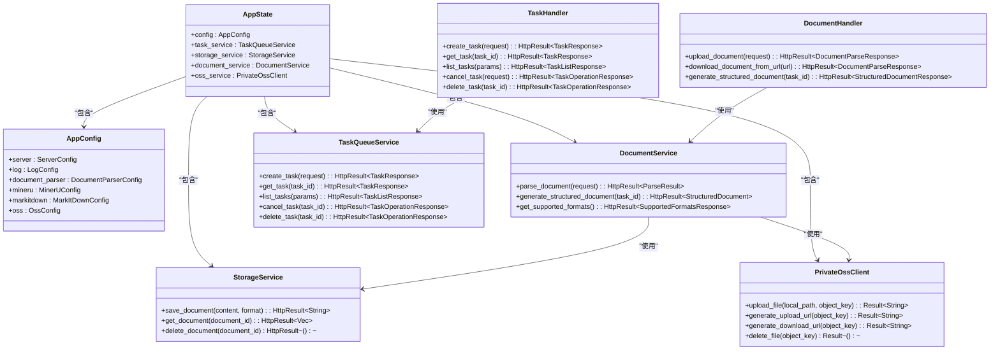
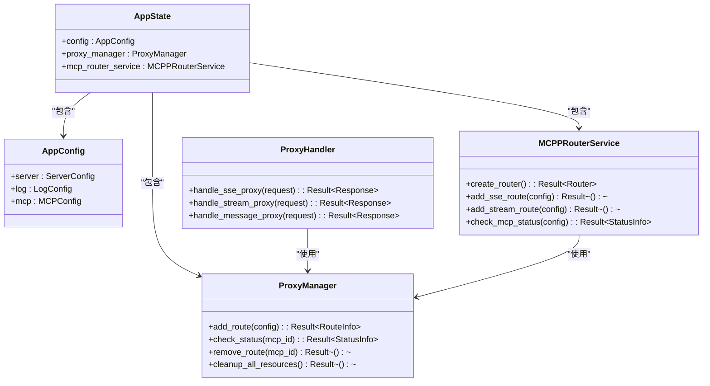
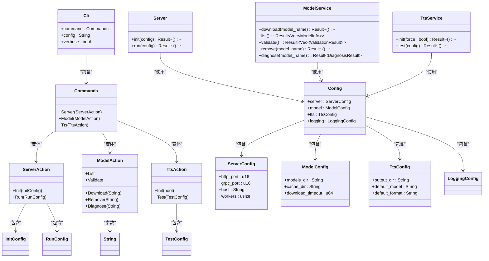

# 开发指南

<cite>
**本文档引用的文件**   
- [Cargo.toml](file://Cargo.toml)
- [README.md](file://README.md)
- [cliff.toml](file://cliff.toml)
- [deny.toml](file://deny.toml)
- [Makefile](file://Makefile)
- [document-parser/src/lib.rs](file://document-parser/src/lib.rs)
- [mcp-proxy/src/main.rs](file://mcp-proxy/src/main.rs)
- [voice-cli/src/main.rs](file://voice-cli/src/main.rs)
- [fastembed/src/main.rs](file://fastembed/src/main.rs)
- [oss-client/src/lib.rs](file://oss-client/src/lib.rs)
- [document-parser/src/handlers/mod.rs](file://document-parser/src/handlers/mod.rs)
- [document-parser/src/models/mod.rs](file://document-parser/src/models/mod.rs)
- [document-parser/Cargo.toml](file://document-parser/Cargo.toml)
- [voice-cli/pyproject.toml](file://voice-cli/pyproject.toml)
- [document-parser/src/tests/test_config.rs](file://document-parser/src/tests/test_config.rs)
- [document-parser/src/tests/mod.rs](file://document-parser/src/tests/mod.rs)
- [voice-cli/src/tests/mod.rs](file://voice-cli/src/tests/mod.rs)
</cite>

## 目录
1. [项目结构](#项目结构)
2. [代码分层架构](#代码分层架构)
3. [开发环境设置](#开发环境设置)
4. [测试方法指南](#测试方法指南)
5. [代码贡献流程](#代码贡献流程)
6. [依赖管理策略](#依赖管理策略)
7. [安全检查工具](#安全检查工具)
8. [版本发布流程](#版本发布流程)

## 项目结构

本项目是一个多模块Rust项目，包含多个子项目和服务。主要组件包括：

- **document-parser**: 文档解析服务，支持多格式文档转换为结构化Markdown
- **mcp-proxy**: MCP代理服务，支持SSE和Streamable HTTP协议
- **voice-cli**: 语音命令行工具，支持TTS和STT功能
- **oss-client**: 阿里云OSS客户端库
- **fastembed**: 嵌入式服务

项目采用Cargo工作区模式管理多个子项目，通过根目录的`Cargo.toml`文件定义工作区成员。



**图示来源**
- [Cargo.toml](file://Cargo.toml#L2)
- [document-parser/src/lib.rs](file://document-parser/src/lib.rs#L5-L17)
- [mcp-proxy/src/main.rs](file://mcp-proxy/src/main.rs#L1-L8)
- [voice-cli/src/main.rs](file://voice-cli/src/main.rs#L5-L10)

## 代码分层架构

### Document Parser 服务架构

Document Parser服务采用典型的分层架构设计，包含以下主要层次：

- **handlers**: 处理HTTP请求和响应
- **models**: 定义数据模型和业务实体
- **services**: 实现核心业务逻辑
- **parsers**: 文档解析引擎
- **processors**: 数据处理逻辑
- **utils**: 通用工具函数
- **middleware**: 请求中间件
- **performance**: 性能优化组件
- **production**: 生产环境特性



**图示来源**
- [document-parser/src/lib.rs](file://document-parser/src/lib.rs#L5-L17)
- [document-parser/src/handlers/mod.rs](file://document-parser/src/handlers/mod.rs#L1-L21)
- [document-parser/src/models/mod.rs](file://document-parser/src/models/mod.rs#L1-L22)

### MCP Proxy 服务架构

MCP Proxy服务主要处理MCP协议的代理和转换，其架构包括：

- **server**: HTTP服务器实现
- **model**: 数据模型
- **proxy**: 代理处理逻辑
- **client**: 客户端实现
- **task**: 任务调度



**图示来源**
- [mcp-proxy/src/main.rs](file://mcp-proxy/src/main.rs#L1-L8)
- [mcp-proxy/src/model/app_state_model.rs](file://mcp-proxy/src/model/app_state_model.rs)

### Voice CLI 架构

Voice CLI是一个命令行工具，其架构包括：

- **cli**: 命令行接口
- **model**: 数据模型
- **server**: 服务器实现
- **services**: 核心服务
- **utils**: 工具函数



**图示来源**
- [voice-cli/src/main.rs](file://voice-cli/src/main.rs#L6-L10)
- [voice-cli/src/cli/model.rs](file://voice-cli/src/cli/model.rs)
- [voice-cli/src/models/config.rs](file://voice-cli/src/models/config.rs)

## 开发环境设置

### Rust工具链设置

本项目需要Rust 1.70+版本，推荐使用1.75+版本。可以通过以下命令安装和配置Rust工具链：

```bash
# 安装Rust工具链
curl --proto '=https' --tlsv1.2 -sSf https://sh.rustup.rs | sh

# 设置默认工具链
rustup default stable

# 添加必要的组件
rustup component add rustfmt
rustup component add clippy
```

项目使用Cargo工作区模式，根目录的`Cargo.toml`文件定义了所有工作区成员和共享依赖。

### Python依赖设置

Document Parser服务依赖Python环境来运行MinerU和MarkItDown等解析工具。需要设置Python虚拟环境：

```bash
# 进入document-parser目录
cd document-parser

# 初始化虚拟环境和依赖（首次使用）
document-parser uv-init

# 检查环境状态
document-parser check

# 激活虚拟环境
source ./venv/bin/activate  # Linux/macOS
.\venv\Scripts\activate     # Windows
```

Voice CLI的TTS功能依赖Python包，通过`pyproject.toml`文件管理：

```toml
[project]
name = "voice-cli-tts"
version = "0.1.0"
description = "TTS dependencies for voice-cli"
requires-python = ">=3.10,<3.11"
dependencies = [
    "torch>=2.8",
    "torchaudio>=2.8",
    "numpy>=1.19.0,<2.0.0",
    "soundfile>=0.12",
    "huggingface-hub>=0.34.4",
]
```

### 测试配置

项目包含多种测试类型，需要相应的测试配置：

```rust
// 测试环境配置
pub struct TestEnvironment {
    pub temp_dir: TempDir,
    pub db_path: String,
    pub config: crate::config::AppConfig,
}

impl TestEnvironment {
    /// 创建一个新的隔离测试环境
    pub fn new() -> Self {
        init_test_logging();
        let temp_dir = TempDir::new().expect("Failed to create temp directory");
        let db_path = temp_dir
            .path()
            .join("test.db")
            .to_string_lossy()
            .to_string();
        
        // 使用测试专用配置
        let mut config = crate::config::AppConfig::load_config().unwrap();
        config.database.url = format!("sqlite://{}", db_path);
        config.server.port = find_free_port();
        
        Self { temp_dir, db_path, config }
    }
}
```

**代码来源**
- [document-parser/src/tests/test_config.rs](file://document-parser/src/tests/test_config.rs#L6-L42)
- [voice-cli/pyproject.toml](file://voice-cli/pyproject.toml#L1-L23)

## 测试方法指南

### 单元测试

项目使用Rust的内置测试框架进行单元测试。测试文件通常位于`src/tests/`目录下，使用`#[cfg(test)]`属性标记。

```rust
#[cfg(test)]
mod tests {
    use super::*;
    use tokio::test;

    #[test]
    async fn test_basic_functionality() {
        let app_state = create_test_app_state().await;
        // 进行测试...
    }

    #[test]
    async fn test_file_size_validation() {
        let app_state = create_test_app_state_for_file_size_test(50, 25).await;
        // 测试文件大小验证逻辑...
    }
}
```

### 集成测试

集成测试位于各子项目的`tests/`目录下，测试跨组件的交互：

```rust
// document-parser集成测试
#[tokio::test]
async fn test_external_services() {
    // 设置环境变量
    std::env::set_var("TEST_OSS_ENDPOINT", "https://real-oss-endpoint.com");
    std::env::set_var("TEST_OSS_BUCKET", "real-test-bucket");

    // 使用集成测试配置
    let config = create_integration_test_config();
    let app_state = create_test_app_state_with_config(config).await;
    // 进行集成测试...
}
```

### 性能测试

性能测试使用Criterion库，位于`benches/`目录下：

```rust
// document-parser性能测试
criterion_group!(benches, document_parsing_bench, markdown_processing_bench);
criterion_main!(benches);

fn document_parsing_bench(c: &mut Criterion) {
    c.bench_function("parse_large_document", |b| {
        b.iter(|| {
            let parser = DualEngineParser::new();
            parser.parse_document(black_box(&test_document));
        });
    });
}
```

### 测试执行

使用Makefile中的目标来执行测试：

```bash
# 运行所有测试
cargo test

# 运行特定子项目的测试
cargo test --package document-parser

# 运行性能测试
cargo bench

# 运行集成测试
cargo test --test integration_tests
```

**代码来源**
- [document-parser/src/tests/mod.rs](file://document-parser/src/tests/mod.rs#L270-L355)
- [voice-cli/src/tests/mod.rs](file://voice-cli/src/tests/mod.rs#L1-L11)
- [document-parser/Cargo.toml](file://document-parser/Cargo.toml#L110-L116)

## 代码贡献流程

### 分支管理

项目采用Git分支管理策略，主要分支包括：

- `main`: 主分支，包含稳定代码
- `develop`: 开发分支，集成所有功能开发
- `feature/*`: 功能分支，开发新功能
- `hotfix/*`: 热修复分支，紧急修复

```bash
# 创建功能分支
git checkout -b feature/new-parser-engine

# 提交更改
git add .
git commit -m "feat(parser): add new parser engine"

# 推送分支
git push origin feature/new-parser-engine
```

### 代码审查

所有代码贡献都需要通过Pull Request进行代码审查。审查流程包括：

1. 创建Pull Request
2. 自动CI/CD流水线运行
3. 团队成员代码审查
4. 根据反馈修改代码
5. 合并到主分支

### 提交规范

项目遵循Conventional Commits规范，提交消息格式如下：

```
<type>(<scope>): <subject>
<BLANK LINE>
<body>
<BLANK LINE>
<footer>
```

其中`type`可以是：
- `feat`: 新功能
- `fix`: 修复bug
- `docs`: 文档更新
- `style`: 代码格式调整
- `refactor`: 代码重构
- `test`: 测试相关
- `chore`: 构建过程或辅助工具的变动

**代码来源**
- [cliff.toml](file://cliff.toml#L52-L77)
- [Makefile](file://Makefile#L137-L183)

## 依赖管理策略

项目使用Cargo工作区模式管理依赖，根目录的`Cargo.toml`文件定义了共享依赖：

```toml
[workspace]
members = ["document-parser", "fastembed", "mcp-proxy", "oss-client", "voice-cli"]
resolver = "2"

[workspace.dependencies]
mcp-proxy = { path = "mcp-proxy" }
oss-client = { path = "oss-client" }
tokio = { version = "1.48", features = ["macros", "net", "rt", "rt-multi-thread"] }
axum = { version = "0.8", features = [
    "http2",
    "query",
    "tracing",
    "ws",
    "multipart",
    "macros",
] }
```

各子项目在自己的`Cargo.toml`文件中引用工作区依赖：

```toml
[dependencies]
axum = { workspace = true }
tokio = { workspace = true, features = [
    "macros",
    "net",
    "rt",
    "rt-multi-thread",
    "signal",
    "io-util",
    "process",
] }
```

这种策略确保了依赖版本的一致性，简化了依赖管理。

**代码来源**
- [Cargo.toml](file://Cargo.toml#L1-L103)
- [document-parser/Cargo.toml](file://document-parser/Cargo.toml#L8-L27)

## 安全检查工具

项目使用`cargo-deny`进行安全检查，配置文件`deny.toml`定义了安全策略：

```toml
[licenses]
# 明确允许的许可证
allow = [
    #"MIT",
    #"Apache-2.0",
    #"Apache-2.0 WITH LLVM-exception",
]

[bans]
# 多个版本的同一crate的处理级别
multiple-versions = "warn"
# 版本要求为*的处理级别
wildcards = "allow"

[sources]
# 未知注册表的处理级别
unknown-registry = "warn"
# 未知git仓库的处理级别
unknown-git = "warn"
# 允许的crate注册表URL
allow-registry = ["https://github.com/rust-lang/crates.io-index"]
```

安全检查包括：
- 许可证检查
- 依赖项禁止列表
- 来源检查
- 安全漏洞检查

运行安全检查：
```bash
cargo deny check
```

**代码来源**
- [deny.toml](file://deny.toml#L1-L240)

## 版本发布流程

项目使用`git-cliff`生成变更日志，配置文件`cliff.toml`定义了发布流程：

```toml
[changelog]
header = """
# Changelog\n
All notable changes to this project will be documented in this file. See [conventional commits](https://www.conventionalcommits.org/) for commit guidelines.\n
"""
body = """
---
\
    \
        ## [{{ version | trim_start_matches(pat="v") }}]($REPO/compare/{{ previous.version }}..{{ version }}) - {{ timestamp | date(format="%Y-%m-%d") }}
    \
        ## [{{ version | trim_start_matches(pat="v") }}] - {{ timestamp | date(format="%Y-%m-%d") }}
    \
\
    ## [unreleased]
\

    ### {{ group | striptags | trim | upper_first }}
    
        - **({{commit.scope}})** [**breaking**] \
            {{ commit.message|trim }} - ([{{ commit.id | truncate(length=7, end="") }}]($REPO/commit/{{ commit.id }})) - {{ commit.author.name }}
    
    \n\
    
        
        
            -  [**breaking**]\
                {{ commit.message|trim }} - ([{{ commit.id | truncate(length=7, end="") }}]($REPO/commit/{{ commit.id }})) - {{ commit.author.name }}
        
    
\n
"""

[git]
conventional_commits = true
filter_unconventional = false
commit_parsers = [
    { message = "\\[skip", skip = true },
    { message = "\\p{Han}", skip = true },
    { message = "^feat", group = "Features" },
    { message = "^fix", group = "Bug Fixes" },
    { message = "^doc", group = "Documentation" },
    { message = "^perf", group = "Performance" },
    { message = "^refactor", group = "Refactoring" },
    { message = "^style", group = "Style" },
    { message = "^revert", group = "Revert" },
    { message = "^test", group = "Tests" },
    { message = "^chore\\(version\\):", skip = true },
    { message = "^chore", group = "Miscellaneous Chores" },
    { message = ".*", group = "Other" },
    { body = ".*security", group = "Security" },
]
```

发布流程：
1. 确保所有功能开发完成并通过测试
2. 更新版本号
3. 生成变更日志
4. 创建发布标签
5. 发布到crate.io

```bash
# 生成变更日志
git cliff -v > CHANGELOG.md

# 创建发布标签
git tag v0.1.0

# 发布到crate.io
cargo publish
```

**代码来源**
- [cliff.toml](file://cliff.toml#L1-L96)