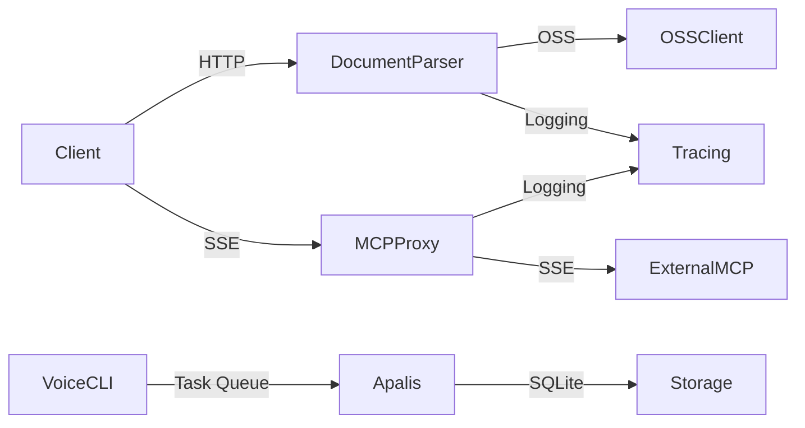
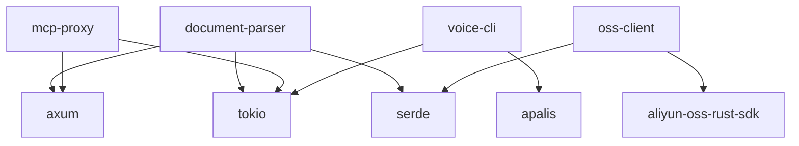

# 开发者指南

<cite>
**本文档中引用的文件**  
- [main.go](file://main.go)
- [auth.go](file://auth/auth.go)
- [http_server.go](file://server/http_server.go)
- [config.go](file://config/config.go)
- [database.go](file://components/database.go)
- [helper.go](file://util/helper.go)
- [api.go](file://handlers/api.go)
</cite>

## 目录
1. [简介](#简介)
2. [项目结构](#项目结构)
3. [核心组件](#核心组件)
4. [架构概述](#架构概述)
5. [详细组件分析](#详细组件分析)
6. [依赖分析](#依赖分析)
7. [性能考量](#性能考量)
8. [故障排除指南](#故障排除指南)
9. [结论](#结论)
10. [附录](#附录)（如有必要）

## 简介
本指南旨在为开发者提供全面的贡献指导，涵盖代码风格、依赖安全、版本发布、公共API设计、测试策略、新功能扩展、性能评估、调试技巧以及异步编程最佳实践。项目采用Rust语言开发，包含多个子crate，分别负责文档解析、MCP代理、OSS客户端和语音CLI等功能。

## 项目结构
项目采用Cargo工作区管理多个子crate，包括`document-parser`、`mcp-proxy`、`oss-client`和`voice-cli`。每个子crate都有独立的`src`、`tests`、`benches`和`fixtures`目录，遵循Rust社区标准布局。

```mermaid
graph TB
subgraph "根目录"
Cargo_toml[Cargo.toml]
workspace[Cargo.toml (workspace)]
cliff_toml[cliff.toml]
deny_toml[cargo-deny.toml]
end
subgraph "document-parser"
doc_src[src/]
doc_tests[tests/]
doc_benches[benches/]
doc_fixtures[fixtures/]
doc_Cargo[Cargo.toml]
end
subgraph "mcp-proxy"
mcp_src[src/]
mcp_tests[tests/]
mcp_benches[benches/]
mcp_fixtures[fixtures/]
mcp_Cargo[Cargo.toml]
end
subgraph "oss-client"
oss_src[src/]
oss_examples[examples/]
oss_tests[tests/]
oss_Cargo[Cargo.toml]
end
subgraph "voice-cli"
voice_src[src/]
voice_tests[tests/]
voice_benches[benches/]
voice_fixtures[fixtures/]
voice_Cargo[Cargo.toml]
end
workspace --> document-parser
workspace --> mcp-proxy
workspace --> oss-client
workspace --> voice-cli
```

**图示来源**
- [Cargo.toml](file://Cargo.toml)
- [document-parser/Cargo.toml](file://document-parser/Cargo.toml)
- [mcp-proxy/Cargo.toml](file://mcp-proxy/Cargo.toml)

**本节来源**
- [Cargo.toml](file://Cargo.toml)
- [document-parser/Cargo.toml](file://document-parser/Cargo.toml)

## 核心组件
项目由多个核心crate组成，每个crate负责特定功能。`document-parser`提供文档解析服务，`mcp-proxy`实现MCP代理功能，`oss-client`封装OSS操作，`voice-cli`处理语音相关任务。各crate通过工作区统一管理依赖和版本。

**本节来源**
- [document-parser/Cargo.toml](file://document-parser/Cargo.toml)
- [mcp-proxy/Cargo.toml](file://mcp-proxy/Cargo.toml)
- [oss-client/Cargo.toml](file://oss-client/Cargo.toml)
- [voice-cli/Cargo.toml](file://voice-cli/Cargo.toml)

## 架构概述
系统采用微服务架构，各组件通过HTTP API和异步消息进行通信。`document-parser`和`mcp-proxy`作为独立服务运行，`oss-client`作为共享库被多个服务引用。异步处理通过`tokio`运行时和`apalis`任务队列实现。



**图示来源**
- [CLAUDE.md](file://CLAUDE.md#L124-L141)
- [oss-client/README.md](file://oss-client/README.md#L0-L47)

## 详细组件分析

### 代码风格与静态检查
项目使用`rustfmt`统一代码格式，`clippy`进行静态分析。开发者应在提交代码前运行`cargo fmt`和`cargo clippy`确保代码风格一致。

**本节来源**
- [CLAUDE.md](file://CLAUDE.md#L124-L141)

### 依赖安全检查
项目使用`cargo-deny`进行依赖安全检查，配置文件`deny.toml`定义了许可证、安全漏洞和依赖源的检查规则。开发者应定期运行`cargo deny check`确保依赖安全。

```toml
[licenses]
allow = [
    "MIT",
    "Apache-2.0",
]
confidence-threshold = 0.8

[advisories]
ignore = [
    "RUSTSEC-0000-0000",
]
```

**图示来源**
- [deny.toml](file://deny.toml#L83-L106)
- [deny.toml](file://deny.toml#L61-L81)

**本节来源**
- [deny.toml](file://deny.toml)

### 版本发布流程
项目使用`cliff`生成符合Conventional Commits规范的CHANGELOG。提交信息应遵循`feat:`, `fix:`, `docs:`, `perf:`等前缀。发布时运行`git cliff --tag v0.1.0`生成版本日志。

```toml
[git]
conventional_commits = true
commit_parsers = [
    { message = "^feat", group = "Features" },
    { message = "^fix", group = "Bug Fixes" },
    { message = "^doc", group = "Documentation" },
]
```

**图示来源**
- [cliff.toml](file://cliff.toml#L51-L82)

**本节来源**
- [cliff.toml](file://cliff.toml)

### 公共API设计
各crate的`lib.rs`通过`pub use`暴露公共API。例如`oss-client`的`lib.rs`导出`OssClient`和`PublicOssClient`，`mcp-proxy`的`lib.rs`导出`ProxyHandler`。

```rust
// oss-client/src/lib.rs
pub use private_client::OssClient;
pub use public_client::PublicOssClient;

// mcp-proxy/src/lib.rs
pub use proxy::ProxyHandler;
```

**本节来源**
- [oss-client/src/lib.rs](file://oss-client/src/lib.rs)
- [mcp-proxy/src/lib.rs](file://mcp-proxy/src/lib.rs)

### 测试策略
项目包含单元测试、集成测试和性能测试。`fixtures`目录提供测试数据，`tests`目录包含各种测试用例。开发者应使用`create_test_app_state()`等工具创建隔离的测试环境。

```rust
#[tokio::test]
async fn test_basic_functionality() {
    let app_state = create_test_app_state().await;
    // 进行测试...
}
```

**本节来源**
- [document-parser/src/tests/mod.rs](file://document-parser/src/tests/mod.rs#L272-L319)
- [document-parser/src/tests/test_config.rs](file://document-parser/src/tests/test_config.rs#L0-L41)

### 添加新文档解析器
要添加新的文档解析器，需在`document-parser/src/parsers/`目录下实现`Parser` trait，并在`mod.rs`中注册。新解析器应支持`parse`和`detect`方法。

```rust
// parsers/parser_trait.rs
pub trait Parser {
    fn parse(&self, input: &str) -> Result<ParsedDocument>;
    fn detect(&self, content: &[u8]) -> bool;
}
```

**本节来源**
- [document-parser/src/parsers/parser_trait.rs](file://document-parser/src/parsers/parser_trait.rs)

### 添加新MCP插件
要添加新的MCP插件，需在`mcp-proxy`的配置中添加插件JSON配置，服务器会自动加载并启动对应的MCP服务。插件配置包含名称、URL和认证信息。

**本节来源**
- [README.md](file://README.md#L0-L41)

### 性能测试
`benches`目录包含使用Criterion.rs的性能测试。开发者应运行`cargo bench`评估代码变更对性能的影响。测试使用`fixtures`中的真实数据。

```rust
// benches/run_code_bench.rs
criterion_group!(benches, run_code_benchmark);
criterion_main!(benches);
```

**本节来源**
- [mcp-proxy/benches/README.md](file://mcp-proxy/benches/README.md#L0-L58)
- [mcp-proxy/benches/run_code_advanced_bench.rs](file://mcp-proxy/benches/run_code_advanced_bench.rs#L24-L63)

### 调试技巧
启用`tracing`日志进行调试，设置环境变量`RUST_LOG=document_parser=debug`。使用Rust Analyzer进行代码导航和类型检查。

```rust
// 启用调试日志
tracing_subscriber::fmt()
    .with_env_filter("document_parser=debug")
    .init();
```

**本节来源**
- [document-parser/src/tests/test_config.rs](file://document-parser/src/tests/test_config.rs#L0-L41)
- [mcp-proxy/src/server/middlewares/mark_log_span.rs](file://mcp-proxy/src/server/middlewares/mark_log_span.rs#L48-L100)

### 异步编程最佳实践
使用`tokio`运行时，注意`Send`和`Sync`边界。共享状态使用`Arc<Mutex<T>>`或`tokio::sync::Mutex`。避免在异步函数中阻塞操作。

```rust
// 正确：使用异步互斥锁
let data = Arc::new(tokio::sync::Mutex::new(vec![]));
```

**本节来源**
- [CLAUDE.md](file://CLAUDE.md#L124-L141)
- [voice-cli/APALIS_RESEARCH.md](file://voice-cli/APALIS_RESEARCH.md#L81-L133)

## 依赖分析
项目依赖通过工作区统一管理，子crate使用`{ workspace = true }`引用共享依赖。`cargo-deny`检查依赖安全，`clippy`确保代码质量。



**图示来源**
- [Cargo.toml](file://Cargo.toml)
- [document-parser/Cargo.toml](file://document-parser/Cargo.toml)

**本节来源**
- [Cargo.toml](file://Cargo.toml)
- [deny.toml](file://deny.toml)

## 性能考量
系统设计考虑了高并发和大文件处理。使用`tokio`多线程运行时，`apalis`任务队列处理异步任务，`moka`缓存提高性能。性能测试确保关键路径的效率。

**本节来源**
- [CLAUDE.md](file://CLAUDE.md#L124-L141)
- [document-parser/src/performance/concurrency_optimizer.rs](file://document-parser/src/performance/concurrency_optimizer.rs#L224-L268)

## 故障排除指南
常见问题包括OSS连接失败、Python环境未激活、MCP插件加载失败等。使用`check`命令诊断环境问题，查看日志定位错误。

```bash
# 检查环境状态
document-parser check
```

**本节来源**
- [README.md](file://README.md#L0-L41)
- [document-parser/src/utils/environment_manager.rs](file://document-parser/src/utils/environment_manager.rs#L514-L562)

## 结论
本指南提供了全面的开发贡献指导。遵循代码风格、安全检查和测试规范，确保代码质量和系统稳定性。积极参与项目开发，共同提升系统功能和性能。

## 附录
### 环境变量参考
- `OSS_ACCESS_KEY_ID`: OSS访问密钥ID
- `OSS_ACCESS_KEY_SECRET`: OSS访问密钥密钥
- `RUST_LOG`: 日志级别配置

### 常用命令
```bash
# 格式化代码
cargo fmt

# 静态检查
cargo clippy

# 安全检查
cargo deny check

# 运行测试
cargo test

# 性能测试
cargo bench

# 生成CHANGELOG
git cliff --tag v0.1.0
```