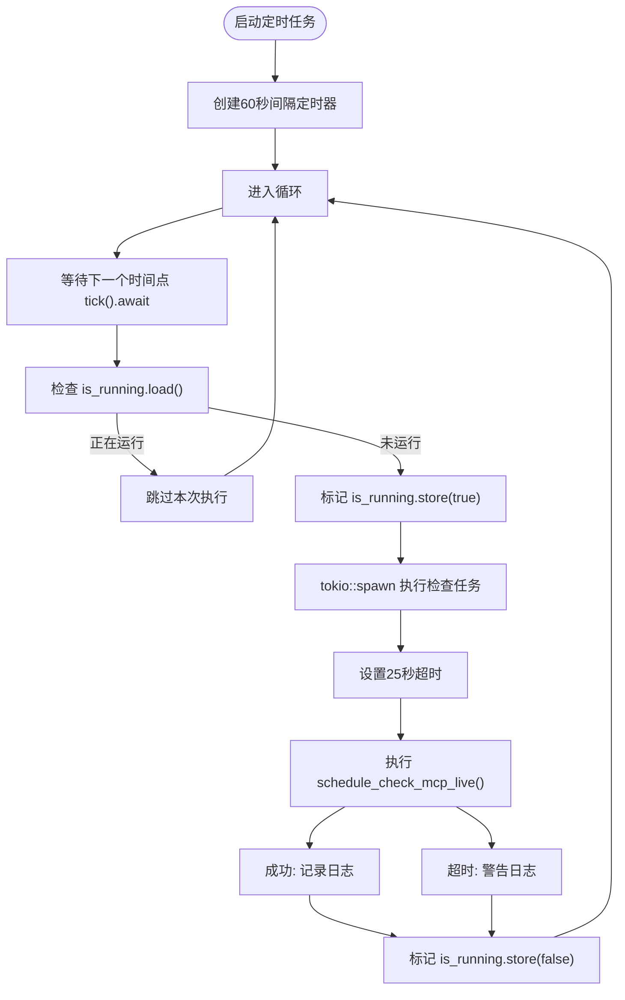
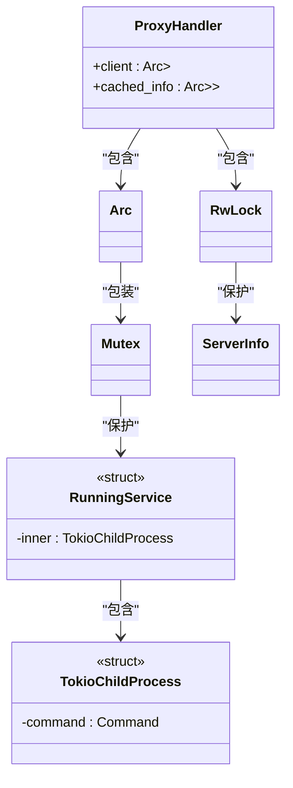

# 异步编程最佳实践

<cite>
**本文档引用的文件**  
- [mcp_start_task.rs](file://mcp-proxy/src/server/task/mcp_start_task.rs)
- [schedule_task.rs](file://mcp-proxy/src/server/task/schedule_task.rs)
- [proxy_handler.rs](file://mcp-proxy/src/proxy/proxy_handler.rs)
- [sse_client.rs](file://mcp-proxy/src/client/sse_client.rs)
</cite>

## 目录
1. [引言](#引言)
2. [核心异步概念在项目中的应用](#核心异步概念在项目中的应用)
3. [后台任务的启动与管理](#后台任务的启动与管理)
4. [异步流处理与资源安全](#异步流处理与资源安全)
5. [Send和Sync边界与跨线程安全](#send和sync边界与跨线程安全)
6. [常见陷阱与规避建议](#常见陷阱与规避建议)
7. [结论](#结论)

## 引言
本指南旨在为基于Tokio的异步架构提供最佳实践建议，重点分析`mcp-proxy`项目中异步编程的关键实现模式。通过深入解析`mcp_start_task`、`schedule_task`、`proxy_handler`和`sse_client`等核心模块，阐述如何正确使用`Future`、`async/await`、`spawn`和`JoinHandle`等异步原语，确保系统在高并发场景下的稳定性与性能。

## 核心异步概念在项目中的应用

### Future与async/await
在`mcp-proxy`项目中，所有I/O密集型操作均采用`async/await`语法实现非阻塞调用。例如，在`proxy_handler.rs`中，`list_tools`、`call_tool`等方法均声明为`async`，通过`.await`等待底层客户端响应，避免阻塞事件循环线程。

### Spawn与JoinHandle
`tokio::spawn`用于将异步任务提交到运行时执行。在`schedule_task.rs`中，定时检查任务通过`tokio::spawn`创建独立任务，确保不影响主事件循环。虽然未显式返回`JoinHandle`，但通过`CancellationToken`实现任务的协作式取消。

**Section sources**
- [proxy_handler.rs](file://mcp-proxy/src/proxy/proxy_handler.rs#L100-L150)
- [schedule_task.rs](file://mcp-proxy/src/server/task/schedule_task.rs#L25-L30)

## 后台任务的启动与管理

### mcp_start_task中的任务启动
`mcp_start_task`函数负责启动MCP服务子进程并集成SSE服务器。该函数通过`TokioChildProcess::new`创建子进程，并使用`client.serve(tokio_process).await`建立异步通信通道。整个过程在`async`上下文中执行，确保非阻塞。

### schedule_task中的定时任务管理
`start_schedule_task`函数创建一个周期性执行的定时任务，每60秒检查一次MCP服务状态。通过`Arc<AtomicBool>`确保同一任务不会并发执行，避免资源竞争。任务内部使用`tokio::time::timeout`设置25秒超时，防止检查任务无限期阻塞。



**Diagram sources**
- [schedule_task.rs](file://mcp-proxy/src/server/task/schedule_task.rs#L15-L60)

**Section sources**
- [mcp_start_task.rs](file://mcp-proxy/src/server/task/mcp_start_task.rs#L50-L100)
- [schedule_task.rs](file://mcp-proxy/src/server/task/schedule_task.rs#L10-L60)

## 异步流处理与资源安全

### proxy_handler中的异步代理模式
`ProxyHandler`结构体封装了对远程MCP服务的代理调用。通过`Arc<Mutex<RunningService>>`安全地在多个异步任务间共享客户端连接。每个方法（如`list_tools`、`call_tool`）在调用前获取锁，确保同一时间只有一个任务能操作底层连接。

### sse_client中的流处理
虽然`sse_client.rs`内容未完全展示，但从项目结构可知其负责SSE（Server-Sent Events）流处理。此类实现需特别注意：
- 使用`tokio::sync::mpsc`或`broadcast`通道安全传递事件
- 在`Drop`时正确关闭连接，防止资源泄漏
- 使用`select!`宏处理取消信号与数据接收的竞争

**Section sources**
- [proxy_handler.rs](file://mcp-proxy/src/proxy/proxy_handler.rs#L50-L80)
- [sse_client.rs](file://mcp-proxy/src/client/sse_client.rs#L1-L10)

## Send和Sync边界与跨线程安全

### Send与Sync的重要性
在Tokio多线程运行时中，所有被`spawn`的任务必须实现`Send` trait，确保能安全地跨线程移动。`Sync`则允许多个线程同时引用同一数据。

### 项目中的实现
`ProxyHandler`通过`Arc<Mutex<T>>`确保线程安全：
- `Arc`提供`Send + Sync`的引用计数
- `Mutex`确保对内部`RunningService`的独占访问
- `RwLock`用于`cached_info`，允许多个读取者并发访问

这种组合确保`ProxyHandler`可安全地在多个Tokio工作线程间共享，满足`Send`边界要求。



**Diagram sources**
- [proxy_handler.rs](file://mcp-proxy/src/proxy/proxy_handler.rs#L20-L40)

**Section sources**
- [proxy_handler.rs](file://mcp-proxy/src/proxy/proxy_handler.rs#L10-L50)

## 常见陷阱与规避建议

### 避免在异步块中阻塞操作
切勿在`async`函数中调用`std::thread::sleep`或同步I/O操作。应使用`tokio::time::sleep`和异步文件/网络API。

### 合理使用超时机制
如`schedule_task.rs`所示，长时间运行的任务应设置超时：
```rust
tokio::time::timeout(Duration::from_secs(25), long_running_task()).await
```

### 正确处理取消信号
使用`tokio_util::sync::CancellationToken`实现优雅取消。在`mcp_start_task`中，`SseServerConfig`包含取消令牌，允许外部控制服务生命周期。

### 资源泄漏预防
- 确保所有`spawn`的任务都有明确的退出条件
- 使用`Drop`守卫自动清理资源
- 定期检查`JoinHandle`的返回值

**Section sources**
- [mcp_start_task.rs](file://mcp-proxy/src/server/task/mcp_start_task.rs#L150-L180)
- [schedule_task.rs](file://mcp-proxy/src/server/task/schedule_task.rs#L40-L50)

## 结论
`mcp-proxy`项目展示了基于Tokio的异步架构的成熟实践。通过合理使用`async/await`、`spawn`、`Send/Sync`边界和资源管理技术，实现了高性能、高可靠性的代理服务。开发者应遵循本文档的最佳实践，避免常见陷阱，确保异步代码的健壮性与可维护性。