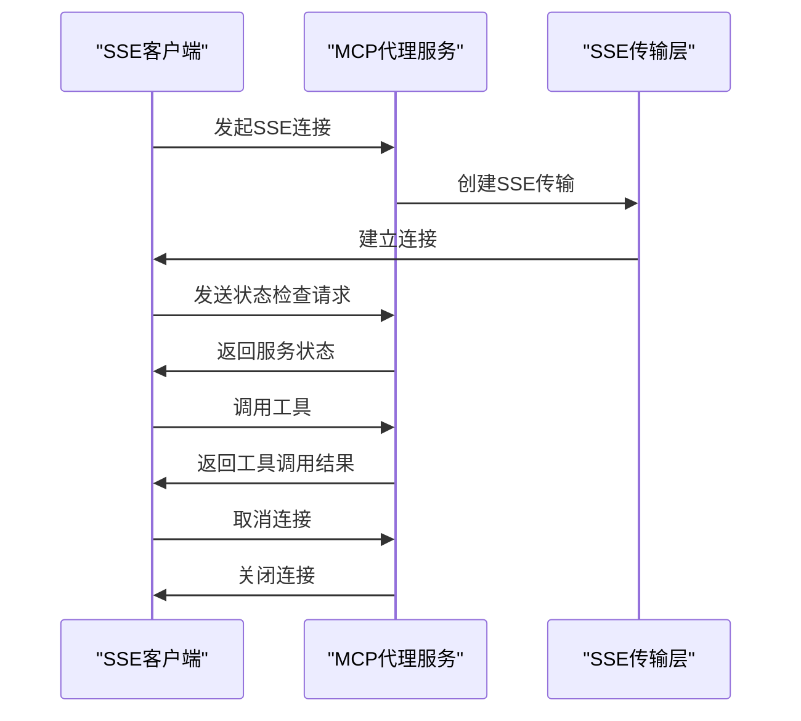

# 单元测试

<cite>
**本文档中引用的文件**  
- [markitdown_parser.rs](file://document-parser/src/parsers/markitdown_parser.rs)
- [markdown_processor.rs](file://document-parser/src/processors/markdown_processor.rs)
- [document_service.rs](file://document-parser/src/services/document_service.rs)
- [coverage_tests.rs](file://document-parser/src/tests/coverage_tests.rs)
- [mcp_sse_test.rs](file://mcp-proxy/src/tests/mcp_sse_test.rs)
</cite>

## 目录
1. [简介](#简介)
2. [文档解析服务测试](#文档解析服务测试)
3. [MCP代理服务SSE通信测试](#mcp代理服务sse通信测试)
4. [测试覆盖率与集成验证](#测试覆盖率与集成验证)
5. [测试最佳实践](#测试最佳实践)
6. [结论](#结论)

## 简介
本文档详细介绍了如何使用Rust的`#[cfg(test)]`模块对核心组件进行隔离测试。重点涵盖文档解析服务中的解析器、处理器、服务层逻辑的测试方法，以及MCP代理服务中SSE通信状态机的验证。通过具体示例，如测试MarkitdownParser的文本提取准确性、验证MCP路由更新逻辑的正确性，说明如何利用mock对象隔离外部依赖，确保测试的可重复性和稳定性。同时，结合`coverage_tests.rs`中的实践，指导开发者编写高价值的断言，以实现全面的测试覆盖率。

## 文档解析服务测试

### MarkitdownParser解析器测试
`MarkitdownParser`是文档解析服务中的核心组件，负责将多种格式的文档转换为Markdown。通过`#[cfg(test)]`模块，可以对解析器的各个功能进行隔离测试，确保其在不同场景下的正确性。

**Section sources**
- [markitdown_parser.rs](file://document-parser/src/parsers/markitdown_parser.rs#L0-L799)

### MarkdownProcessor处理器测试
`MarkdownProcessor`负责处理Markdown内容，包括生成目录（TOC）、处理图片上传等。测试时，可以通过mock对象模拟外部依赖，如OSS客户端，确保测试的独立性和稳定性。

**Section sources**
- [markdown_processor.rs](file://document-parser/src/processors/markdown_processor.rs#L0-L799)

### DocumentService服务层测试
`DocumentService`是文档解析服务的入口，负责协调解析器、处理器和存储服务。测试时，需要验证其在不同状态下的行为，如任务创建、状态更新、错误处理等。

**Section sources**
- [document_service.rs](file://document-parser/src/services/document_service.rs#L0-L799)

## MCP代理服务SSE通信测试

### SSE客户端与服务器通信测试
MCP代理服务通过SSE（Server-Sent Events）与客户端进行通信。测试时，需要验证SSE客户端与服务器的连接、消息传递和状态机转换的正确性。通过`mcp_sse_test.rs`中的测试用例，可以模拟不同场景下的通信行为。

**Diagram sources**
- [mcp_sse_test.rs](file://mcp-proxy/src/tests/mcp_sse_test.rs#L0-L359)

## 测试覆盖率与集成验证

### 测试覆盖率目标
为了确保代码质量，测试覆盖率应达到80%以上。通过`coverage_tests.rs`中的测试用例，可以验证各个模块的覆盖率，确保所有关键路径都被覆盖。

**Section sources**
- [coverage_tests.rs](file://document-parser/src/tests/coverage_tests.rs#L0-L799)

### 集成测试
集成测试用于验证多个组件协同工作的正确性。通过模拟完整的文档处理流程，从文件上传到解析、处理、存储，确保整个系统的稳定性和可靠性。

## 测试最佳实践

### 使用Mock对象隔离外部依赖
在测试中，应使用mock对象隔离外部依赖，如数据库、OSS服务等。这可以确保测试的独立性和可重复性，避免因外部环境变化导致测试失败。

### 编写高价值的断言
断言是测试的核心，应编写高价值的断言，确保测试的准确性和有效性。例如，验证解析结果的准确性、服务状态的正确性等。

### 并行测试
为了提高测试效率，应尽可能并行执行测试用例。Rust的`tokio`库提供了强大的异步支持，可以轻松实现并行测试。

## 结论
通过`#[cfg(test)]`模块，可以对核心组件进行隔离测试，确保其在不同场景下的正确性。结合mock对象和高价值的断言，可以实现全面的测试覆盖率，确保系统的稳定性和可靠性。同时，通过集成测试验证多个组件协同工作的正确性，确保整个系统的质量。