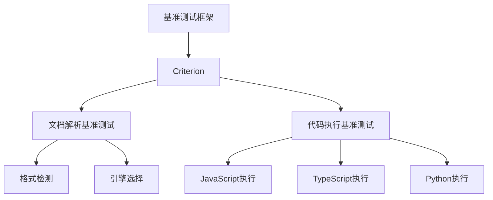
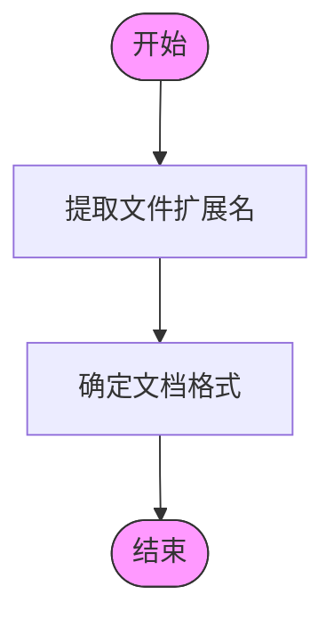
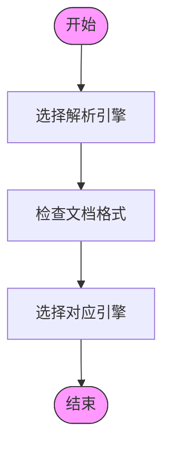
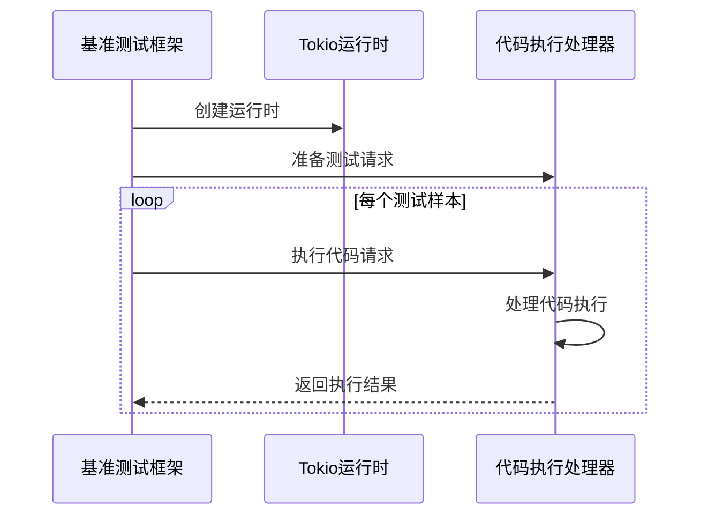
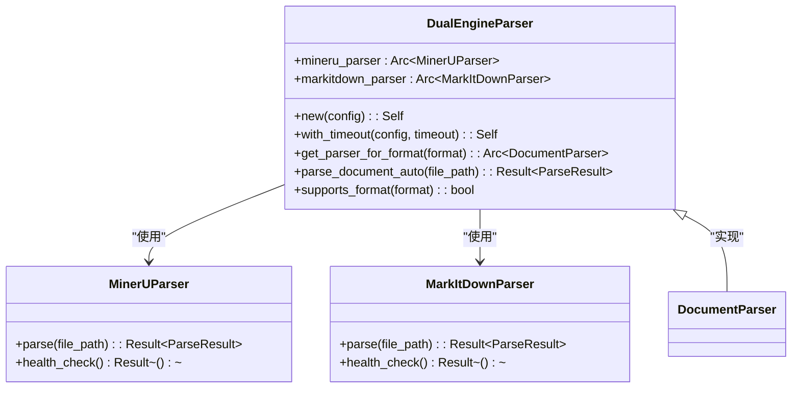
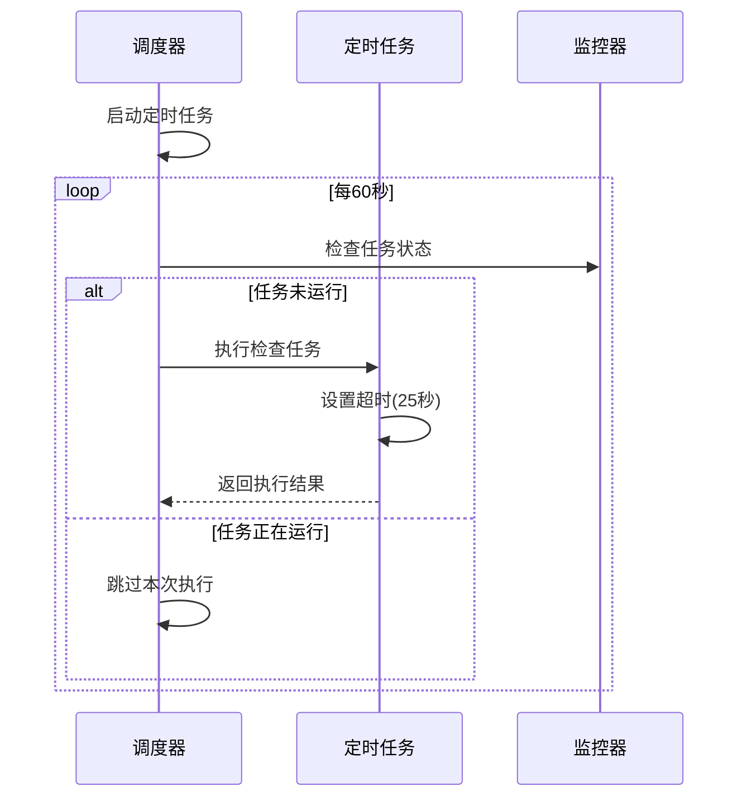
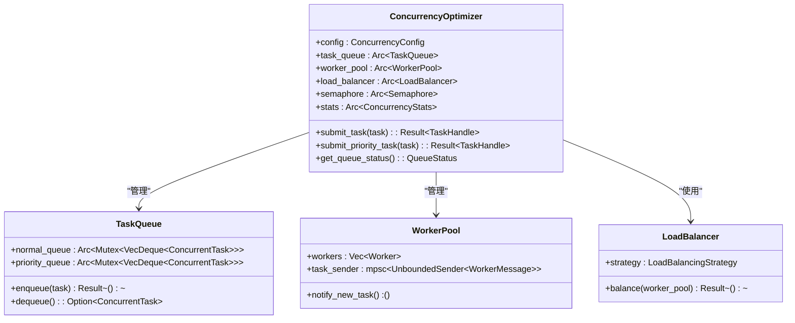
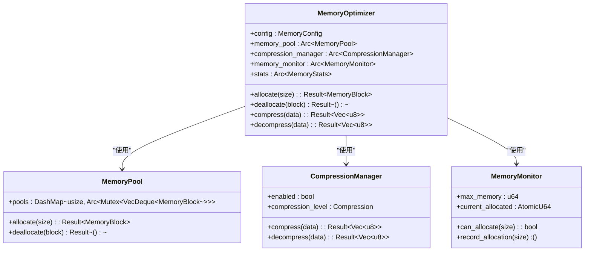
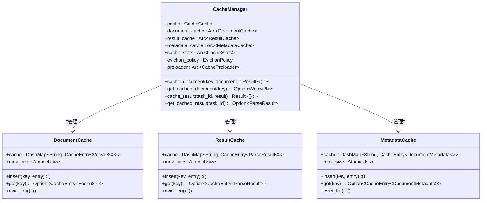
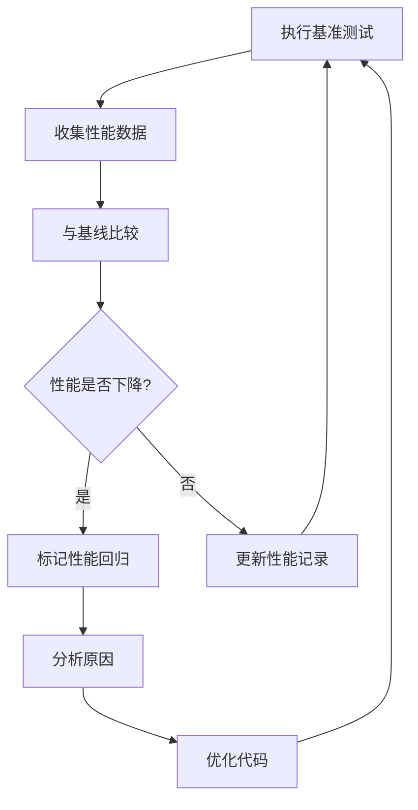

# 性能基准测试

<cite>
**本文档引用的文件**
- [document_parsing_bench.rs](file://document-parser/benches/document_parsing_bench.rs)
- [run_code_bench.rs](file://mcp-proxy/benches/run_code_bench.rs)
- [dual_engine_parser.rs](file://document-parser/src/parsers/dual_engine_parser.rs)
- [schedule_task.rs](file://mcp-proxy/src/server/task/schedule_task.rs)
- [concurrency_optimizer.rs](file://document-parser/src/performance/concurrency_optimizer.rs)
- [memory_optimizer.rs](file://document-parser/src/performance/memory_optimizer.rs)
- [cache_manager.rs](file://document-parser/src/performance/cache_manager.rs)
</cite>

## 目录
1. [引言](#引言)
2. [基准测试框架概述](#基准测试框架概述)
3. [文档解析性能基准测试](#文档解析性能基准测试)
4. [代码执行延迟基准测试](#代码执行延迟基准测试)
5. [关键组件性能分析](#关键组件性能分析)
6. [性能监控与基线建立](#性能监控与基线建立)
7. [性能优化配置建议](#性能优化配置建议)
8. [性能分析工具链集成](#性能分析工具链集成)
9. [结论](#结论)

## 引言
本文档系统介绍了如何使用Criterion等基准测试框架评估关键路径性能，重点关注文档解析和代码执行延迟的量化分析。通过详细的基准测试方法和性能监控策略，指导开发者建立性能基线，监控性能回归，并提供优化建议。

## 基准测试框架概述
本项目采用Criterion作为主要的基准测试框架，用于精确测量关键路径的性能。Criterion提供了统计学上可靠的性能测量，支持多种测试配置，包括样本大小、预热时间和测量时间的调整。

**图表来源**
- [document_parsing_bench.rs](file://document-parser/benches/document_parsing_bench.rs)
- [run_code_bench.rs](file://mcp-proxy/benches/run_code_bench.rs)

## 文档解析性能基准测试
文档解析性能基准测试主要评估不同文档格式的解析性能，重点关注格式检测和引擎选择两个关键环节。

### 格式检测性能测试
格式检测性能测试评估系统从文件路径中提取扩展名并确定文档格式的效率。

**图表来源**
- [document_parsing_bench.rs](file://document-parser/benches/document_parsing_bench.rs#L10-L25)

### 引擎选择性能测试
引擎选择性能测试评估系统根据文档格式选择合适解析引擎的效率。

**图表来源**
- [document_parsing_bench.rs](file://document-parser/benches/document_parsing_bench.rs#L27-L42)

**本节来源**
- [document_parsing_bench.rs](file://document-parser/benches/document_parsing_bench.rs#L10-L46)

## 代码执行延迟基准测试
代码执行延迟基准测试量化了不同类型脚本的执行性能，包括JavaScript、TypeScript和Python。

### 测试配置
代码执行基准测试配置了特定的采样参数以确保测量的准确性：

- 样本大小：10
- 预热时间：20秒
- 测量时间：10秒

**图表来源**
- [run_code_bench.rs](file://mcp-proxy/benches/run_code_bench.rs#L45-L90)

### JavaScript执行性能
JavaScript执行性能测试评估系统执行JavaScript代码的延迟。

### TypeScript执行性能
TypeScript执行性能测试评估系统执行TypeScript代码的延迟。

### Python执行性能
Python执行性能测试评估系统执行Python代码的延迟。

**本节来源**
- [run_code_bench.rs](file://mcp-proxy/benches/run_code_bench.rs#L45-L90)

## 关键组件性能分析
本节深入分析系统中的关键性能组件，包括双引擎解析器和并发任务调度器。

### 双引擎解析器性能分析
双引擎解析器是文档解析系统的核心组件，支持MinerU和MarkItDown两种解析引擎。

**图表来源**
- [dual_engine_parser.rs](file://document-parser/src/parsers/dual_engine_parser.rs#L1-L216)

### 并发任务调度器性能分析
并发任务调度器负责管理定时任务的执行，确保系统资源的有效利用。

**图表来源**
- [schedule_task.rs](file://mcp-proxy/src/server/task/schedule_task.rs#L1-L63)

### 并发优化器分析
并发优化器管理任务队列、工作线程池和负载均衡，确保系统的高并发处理能力。

**图表来源**
- [concurrency_optimizer.rs](file://document-parser/src/performance/concurrency_optimizer.rs#L1-L703)

### 内存优化器分析
内存优化器负责内存使用监控、内存池管理和数据压缩，优化系统的内存使用效率。

**图表来源**
- [memory_optimizer.rs](file://document-parser/src/performance/memory_optimizer.rs#L1-L707)

### 缓存管理器分析
缓存管理器提供智能缓存策略、缓存预热和失效管理功能，提高系统的响应速度。

**图表来源**
- [cache_manager.rs](file://document-parser/src/performance/cache_manager.rs#L1-L799)

**本节来源**
- [dual_engine_parser.rs](file://document-parser/src/parsers/dual_engine_parser.rs#L1-L216)
- [schedule_task.rs](file://mcp-proxy/src/server/task/schedule_task.rs#L1-L63)
- [concurrency_optimizer.rs](file://document-parser/src/performance/concurrency_optimizer.rs#L1-L703)
- [memory_optimizer.rs](file://document-parser/src/performance/memory_optimizer.rs#L1-L707)
- [cache_manager.rs](file://document-parser/src/performance/cache_manager.rs#L1-L799)

## 性能监控与基线建立
建立有效的性能监控体系是确保系统稳定运行的关键。本节介绍如何建立性能基线并监控性能回归。

### 性能基线建立流程
1. 在稳定环境下运行基准测试
2. 记录关键性能指标
3. 建立性能基线数据库
4. 定期对比新测试结果

### 性能回归监控
性能回归监控需要定期执行基准测试，并与性能基线进行比较，及时发现性能下降。

## 性能优化配置建议
本节提供具体的性能优化配置建议，帮助开发者最大化系统性能。

### CPU绑定测试的线程优化
对于CPU绑定的测试，建议根据CPU核心数合理配置线程数：

- 设置工作线程数为CPU核心数的1-2倍
- 避免过度的线程竞争
- 使用线程池复用线程

### 内存使用监控
有效的内存使用监控策略包括：

- 设置内存使用上限
- 定期清理过期缓存
- 监控内存分配和释放

### 并发配置优化
并发配置优化建议：

- 根据系统负载调整最大并发任务数
- 合理设置任务队列大小
- 使用优先级队列处理关键任务

## 性能分析工具链集成
集成性能分析工具链可以帮助识别系统瓶颈并优化关键组件。

### 工具链组成
- 基准测试框架：Criterion
- 性能监控：内置统计收集
- 分析工具：火焰图、内存分析器

### 集成方案
1. 在CI/CD流水线中集成基准测试
2. 设置性能回归警报
3. 定期生成性能报告

## 结论
本文档详细介绍了系统的性能基准测试方法，包括文档解析和代码执行延迟的量化分析。通过建立性能基线和监控体系，开发者可以有效识别性能瓶颈并进行优化。建议定期执行基准测试，确保系统性能的持续改进。